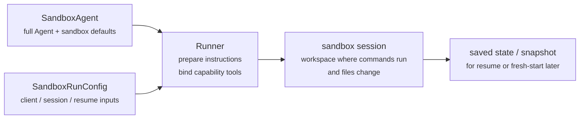
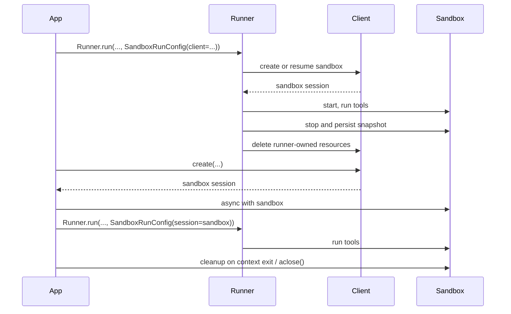

---
search:
  exclude: true
---
# 概念

!!! warning "ベータ機能"

    サンドボックスエージェントはベータ版です。一般提供前に API の詳細、デフォルト、サポートされる機能が変更されること、また時間の経過とともにより高度な機能が追加されることを想定してください。

最新のエージェントは、ファイルシステム内の実ファイルを操作できるときに最も効果を発揮します。 **サンドボックスエージェント** は、専用ツールやシェルコマンドを使用して、大規模なドキュメントセットの検索と操作、ファイル編集、アーティファクト生成、コマンド実行を行えます。サンドボックスは、エージェントがユーザーの代わりに作業するために使用できる永続的なワークスペースをモデルに提供します。Agents SDK のサンドボックスエージェントを使うと、サンドボックス環境と組み合わせたエージェントを簡単に実行でき、適切なファイルをファイルシステム上に配置し、サンドボックスをオーケストレーションして、大規模なタスクの開始、停止、再開を容易にできます。

エージェントに必要なデータを中心にワークスペースを定義します。ワークスペースは、GitHub リポジトリ、ローカルファイルとディレクトリ、合成タスクファイル、S3 や Azure Blob Storage などのリモートファイルシステム、およびユーザーが提供するその他のサンドボックス入力から開始できます。

<div class="sandbox-harness-image" markdown="1">


</div>

`SandboxAgent` は今でも `Agent` です。`instructions`、`prompt`、`tools`、`handoffs`、`mcp_servers`、`model_settings`、`output_type`、ガードレール、フックなど、通常のエージェントのサーフェスを維持し、通常の `Runner` API を通じて実行されます。変わるのは実行境界です。

- `SandboxAgent` はエージェント自体を定義します。通常のエージェント設定に加え、`default_manifest`、`base_instructions`、`run_as` などのサンドボックス固有のデフォルト、およびファイルシステムツール、シェルアクセス、スキル、メモリ、コンパクションなどのケイパビリティを定義します。
- `Manifest` は、新しいサンドボックスワークスペースの望ましい初期コンテンツとレイアウトを宣言します。これにはファイル、リポジトリ、マウント、環境が含まれます。
- サンドボックスセッションは、コマンドが実行されファイルが変更される、稼働中の分離環境です。
- [`SandboxRunConfig`][agents.run_config.SandboxRunConfig] は、その実行がどのようにサンドボックスセッションを取得するかを決定します。たとえば、直接注入する、シリアライズされたサンドボックスセッション状態から再接続する、サンドボックスクライアントを通じて新しいサンドボックスセッションを作成する、などです。
- 保存されたサンドボックス状態とスナップショットにより、後続の実行で以前の作業に再接続したり、保存済みコンテンツから新しいサンドボックスセッションを開始したりできます。

`Manifest` は新規セッションのワークスペース契約であり、稼働中のすべてのサンドボックスに対する完全な信頼できる情報源ではありません。実行の有効なワークスペースは、代わりに、再利用されたサンドボックスセッション、シリアライズされたサンドボックスセッション状態、または実行時に選択されたスナップショットから得られる場合があります。

このページ全体で、「サンドボックスセッション」とは、サンドボックスクライアントによって管理される稼働中の実行環境を指します。これは、[セッション](../sessions/index.md)で説明されている SDK の会話型 [`Session`][agents.memory.session.Session] インターフェイスとは異なります。

外側のランタイムは引き続き、承認、トレーシング、ハンドオフ、再開管理を所有します。サンドボックスセッションは、コマンド、ファイル変更、環境分離を所有します。この分離は、この設計の中核です。

### 各要素の関係

サンドボックス実行は、エージェント定義と実行ごとのサンドボックス設定を組み合わせます。ランナーはエージェントを準備し、稼働中のサンドボックスセッションにバインドし、後続の実行のために状態を保存できます。



サンドボックス固有のデフォルトは `SandboxAgent` に保持します。実行ごとのサンドボックスセッションの選択は `SandboxRunConfig` に保持します。

ライフサイクルは 3 つのフェーズで考えてください。

1. `SandboxAgent`、`Manifest`、ケイパビリティを使って、エージェントと新規ワークスペース契約を定義します。
2. サンドボックスセッションを注入、再開、または作成する `SandboxRunConfig` を `Runner` に渡して実行します。
3. ランナー管理の `RunState`、明示的なサンドボックス `session_state`、または保存済みワークスペーススナップショットから後で続行します。

シェルアクセスがたまに使う 1 つのツールにすぎない場合は、[ツールガイド](../tools.md)のホスト型シェルから始めてください。ワークスペース分離、サンドボックスクライアントの選択、またはサンドボックスセッションの再開動作が設計の一部である場合は、サンドボックスエージェントを使用してください。

## 使用場面

サンドボックスエージェントは、ワークスペース中心のワークフローに適しています。たとえば、次のような場合です。

- コーディングとデバッグ。たとえば、GitHub リポジトリ内の issue レポートに対する自動修正をオーケストレーションし、対象を絞ったテストを実行する場合
- ドキュメント処理と編集。たとえば、ユーザーの財務ドキュメントから情報を抽出し、記入済みの税務フォーム下書きを作成する場合
- ファイルに基づくレビューまたは分析。たとえば、回答前にオンボーディングパケット、生成されたレポート、アーティファクトバンドルを確認する場合
- 分離されたマルチエージェントパターン。たとえば、各レビュアーまたはコーディングサブエージェントに独自のワークスペースを与える場合
- 複数ステップのワークスペースタスク。たとえば、ある実行でバグを修正し、後で回帰テストを追加する場合、またはスナップショットやサンドボックスセッション状態から再開する場合

ファイルや継続的なファイルシステムへのアクセスが不要な場合は、`Agent` を使い続けてください。シェルアクセスがたまに使う機能にすぎない場合は、ホスト型シェルを追加します。ワークスペース境界自体が機能の一部である場合は、サンドボックスエージェントを使用してください。

## サンドボックスクライアントの選択

ローカル開発では `UnixLocalSandboxClient` から始めてください。コンテナ分離やイメージの同等性が必要になったら `DockerSandboxClient` に移行します。プロバイダー管理の実行が必要になったら、ホスト型プロバイダーに移行します。

ほとんどの場合、`SandboxAgent` 定義は同じままで、サンドボックスクライアントとそのオプションだけが [`SandboxRunConfig`][agents.run_config.SandboxRunConfig] 内で変わります。ローカル、Docker、ホスト型、リモートマウントのオプションについては、[サンドボックスクライアント](clients.md)を参照してください。

## 主要要素

<div class="sandbox-nowrap-first-column-table" markdown="1">

| レイヤー | 主な SDK 要素 | 何に答えるか |
| --- | --- | --- |
| エージェント定義 | `SandboxAgent`、`Manifest`、ケイパビリティ | どのエージェントが実行され、新規セッションのワークスペース契約は何を起点にすべきですか？ |
| サンドボックス実行 | `SandboxRunConfig`、サンドボックスクライアント、稼働中のサンドボックスセッション | この実行はどのように稼働中のサンドボックスセッションを取得し、作業はどこで実行されますか？ |
| 保存されたサンドボックス状態 | `RunState` サンドボックスペイロード、`session_state`、スナップショット | このワークフローはどのように以前のサンドボックス作業に再接続するか、または保存済みコンテンツから新しいサンドボックスセッションを開始しますか？ |

</div>

主な SDK 要素は、これらのレイヤーに次のように対応します。

<div class="sandbox-nowrap-first-column-table" markdown="1">

| 要素 | 所有するもの | 確認すべき問い |
| --- | --- | --- |
| [`SandboxAgent`][agents.sandbox.sandbox_agent.SandboxAgent] | エージェント定義 | このエージェントは何を行い、どのデフォルトを一緒に持たせるべきですか？ |
| [`Manifest`][agents.sandbox.manifest.Manifest] | 新規セッションのワークスペースファイルとフォルダー | 実行開始時にファイルシステム上にどのファイルとフォルダーが存在すべきですか？ |
| [`Capability`][agents.sandbox.capabilities.capability.Capability] | サンドボックスネイティブの動作 | どのツール、instructions の断片、またはランタイム動作をこのエージェントにアタッチすべきですか？ |
| [`SandboxRunConfig`][agents.run_config.SandboxRunConfig] | 実行ごとのサンドボックスクライアントとサンドボックスセッションソース | この実行はサンドボックスセッションを注入、再開、または作成すべきですか？ |
| [`RunState`][agents.run_state.RunState] | ランナー管理の保存済みサンドボックス状態 | 以前のランナー管理ワークフローを再開し、そのサンドボックス状態を自動的に引き継いでいますか？ |
| [`SandboxRunConfig.session_state`][agents.run_config.SandboxRunConfig.session_state] | 明示的にシリアライズされたサンドボックスセッション状態 | `RunState` の外部ですでにシリアライズしたサンドボックス状態から再開したいですか？ |
| [`SandboxRunConfig.snapshot`][agents.run_config.SandboxRunConfig.snapshot] | 新規サンドボックスセッション用の保存済みワークスペースコンテンツ | 新しいサンドボックスセッションを保存済みファイルとアーティファクトから開始すべきですか？ |

</div>

実践的な設計順序は次のとおりです。

1. `Manifest` で新規セッションのワークスペース契約を定義します。
2. `SandboxAgent` でエージェントを定義します。
3. 組み込みまたはカスタムのケイパビリティを追加します。
4. 各実行が `RunConfig(sandbox=SandboxRunConfig(...))` 内でどのようにサンドボックスセッションを取得すべきかを決定します。

## サンドボックス実行の準備

実行時、ランナーはその定義を具体的なサンドボックス対応の実行に変換します。

1. `SandboxRunConfig` からサンドボックスセッションを解決します。
   `session=...` を渡した場合、その稼働中のサンドボックスセッションを再利用します。
   それ以外の場合は、`client=...` を使って作成または再開します。
2. 実行に対する有効なワークスペース入力を決定します。
   実行がサンドボックスセッションを注入または再開する場合、その既存のサンドボックス状態が優先されます。
   それ以外の場合、ランナーは 1 回限りのマニフェスト上書きまたは `agent.default_manifest` から開始します。
   これが、`Manifest` だけではすべての実行の最終的な稼働中ワークスペースを定義しない理由です。
3. ケイパビリティに、結果のマニフェストを処理させます。
   これにより、最終的なエージェントが準備される前に、ケイパビリティがファイル、マウント、またはその他のワークスペーススコープの動作を追加できます。
4. 固定された順序で最終的な instructions を構築します。
   SDK のデフォルトサンドボックスプロンプト、または明示的に上書きした場合は `base_instructions`、次に `instructions`、次にケイパビリティの instructions 断片、次にリモートマウントポリシーテキスト、次にレンダリングされたファイルシステムツリーです。
5. ケイパビリティツールを稼働中のサンドボックスセッションにバインドし、準備済みエージェントを通常の `Runner` API を通じて実行します。

サンドボックス化は、ターンの意味を変えません。ターンは引き続きモデルステップであり、単一のシェルコマンドやサンドボックスアクションではありません。サンドボックス側の操作とターンの間には、固定された 1:1 の対応はありません。一部の作業はサンドボックス実行レイヤー内に留まる場合があり、他のアクションはツール結果、承認、または別のモデルステップを必要とするその他の状態を返す場合があります。実践的なルールとして、サンドボックス作業が発生した後にエージェントランタイムが別のモデル応答を必要とする場合にのみ、別のターンが消費されます。

これらの準備ステップがあるため、`SandboxAgent` を設計する際に主に考えるべきサンドボックス固有のオプションは、`default_manifest`、`instructions`、`base_instructions`、`capabilities`、`run_as` です。

## `SandboxAgent` オプション

これらは、通常の `Agent` フィールドに加えたサンドボックス固有のオプションです。

<div class="sandbox-nowrap-first-column-table" markdown="1">

| オプション | 最適な用途 |
| --- | --- |
| `default_manifest` | ランナーが作成する新規サンドボックスセッションのデフォルトワークスペースです。 |
| `instructions` | SDK サンドボックスプロンプトの後に追加される、追加の役割、ワークフロー、成功基準です。 |
| `base_instructions` | SDK サンドボックスプロンプトを置き換える高度なエスケープハッチです。 |
| `capabilities` | このエージェントと一緒に持たせるべきサンドボックスネイティブのツールと動作です。 |
| `run_as` | シェルコマンド、ファイル読み取り、パッチなど、モデル向けサンドボックスツールのユーザー ID です。 |

</div>

サンドボックスクライアントの選択、サンドボックスセッションの再利用、マニフェストの上書き、スナップショットの選択は、エージェント上ではなく [`SandboxRunConfig`][agents.run_config.SandboxRunConfig] に属します。

### `default_manifest`

`default_manifest` は、ランナーがこのエージェントの新規サンドボックスセッションを作成するときに使用するデフォルトの [`Manifest`][agents.sandbox.manifest.Manifest] です。エージェントが通常開始すべきファイル、リポジトリ、ヘルパー資料、出力ディレクトリ、マウントに使用します。

これはデフォルトにすぎません。実行は `SandboxRunConfig(manifest=...)` で上書きでき、再利用または再開されたサンドボックスセッションは既存のワークスペース状態を維持します。

### `instructions` と `base_instructions`

異なるプロンプトでも維持すべき短いルールには `instructions` を使用します。`SandboxAgent` では、これらの instructions は SDK のサンドボックスベースプロンプトの後に追加されるため、組み込みのサンドボックスガイダンスを保持しつつ、独自の役割、ワークフロー、成功基準を追加できます。

SDK のサンドボックスベースプロンプトを置き換えたい場合にのみ、`base_instructions` を使用します。ほとんどのエージェントでは設定すべきではありません。

<div class="sandbox-nowrap-first-column-table" markdown="1">

| 入れる場所... | 用途 | 例 |
| --- | --- | --- |
| `instructions` | エージェントの安定した役割、ワークフロールール、成功基準です。 | 「オンボーディングドキュメントを点検してから、ハンドオフしてください。」、「最終ファイルを `output/` に書き込んでください。」 |
| `base_instructions` | SDK サンドボックスベースプロンプトの完全な置き換えです。 | カスタムの低レベルサンドボックスラッパープロンプトです。 |
| ユーザープロンプト | この実行の 1 回限りのリクエストです。 | 「このワークスペースを要約してください。」 |
| マニフェスト内のワークスペースファイル | より長いタスク仕様、リポジトリローカルの instructions、または範囲が限定された参照資料です。 | `repo/task.md`、ドキュメントバンドル、サンプルパケットです。 |

</div>

`instructions` の適切な使い方には次のものがあります。

- [examples/sandbox/unix_local_pty.py](https://github.com/openai/openai-agents-python/blob/main/examples/sandbox/unix_local_pty.py) は、PTY 状態が重要な場合に、エージェントを 1 つの対話型プロセス内に維持します。
- [examples/sandbox/handoffs.py](https://github.com/openai/openai-agents-python/blob/main/examples/sandbox/handoffs.py) は、点検後にサンドボックスレビュアーがユーザーへ直接回答することを禁止します。
- [examples/sandbox/tax_prep.py](https://github.com/openai/openai-agents-python/blob/main/examples/sandbox/tax_prep.py) は、最終的な記入済みファイルが実際に `output/` に配置されることを要求します。
- [examples/sandbox/docs/coding_task.py](https://github.com/openai/openai-agents-python/blob/main/examples/sandbox/docs/coding_task.py) は、正確な検証コマンドを固定し、ワークスペースルート相対のパッチパスを明確にします。

ユーザーの 1 回限りのタスクを `instructions` にコピーすること、マニフェストに属する長い参照資料を埋め込むこと、組み込みケイパビリティがすでに注入するツールドキュメントを繰り返すこと、モデルが実行時に必要としないローカルインストールメモを混ぜることは避けてください。

`instructions` を省略しても、SDK はデフォルトのサンドボックスプロンプトを含めます。これは低レベルラッパーには十分ですが、ほとんどのユーザー向けエージェントでは明示的な `instructions` を提供すべきです。

### `capabilities`

ケイパビリティは、サンドボックスネイティブの動作を `SandboxAgent` にアタッチします。実行開始前にワークスペースを形成し、サンドボックス固有の instructions を追加し、稼働中のサンドボックスセッションにバインドされるツールを公開し、そのエージェントのモデル動作や入力処理を調整できます。

組み込みケイパビリティには次のものがあります。

<div class="sandbox-nowrap-first-column-table" markdown="1">

| ケイパビリティ | 追加すべき場合 | メモ |
| --- | --- | --- |
| `Shell` | エージェントにシェルアクセスが必要な場合です。 | `exec_command` を追加し、サンドボックスクライアントが PTY 対話をサポートする場合は `write_stdin` も追加します。 |
| `Filesystem` | エージェントがファイルを編集したりローカル画像を点検したりする必要がある場合です。 | `apply_patch` と `view_image` を追加します。パッチパスはワークスペースルート相対です。 |
| `Skills` | サンドボックス内でスキルの検出とマテリアライズを行いたい場合です。 | `.agents` や `.agents/skills` を手動でマウントするよりも、これを優先してください。`Skills` がスキルをインデックス化し、サンドボックス内にマテリアライズします。 |
| `Memory` | 後続の実行でメモリアーティファクトを読み取る、または生成すべき場合です。 | `Shell` が必要です。ライブ更新には `Filesystem` も必要です。 |
| `Compaction` | 長時間実行されるフローで、コンパクション項目の後にコンテキストをトリミングする必要がある場合です。 | モデルのサンプリングと入力処理を調整します。 |

</div>

デフォルトでは、`SandboxAgent.capabilities` は `Capabilities.default()` を使用し、これには `Filesystem()`、`Shell()`、`Compaction()` が含まれます。`capabilities=[...]` を渡すと、そのリストがデフォルトを置き換えるため、引き続き必要なデフォルトケイパビリティを含めてください。

スキルについては、どのようにマテリアライズしたいかに基づいてソースを選択します。

- `Skills(lazy_from=LocalDirLazySkillSource(...))` は、モデルが最初にインデックスを検出し、必要なものだけを読み込めるため、より大きなローカルスキルディレクトリの適切なデフォルトです。
- `LocalDirLazySkillSource(source=LocalDir(src=...))` は、SDK プロセスが実行されているファイルシステムから読み取ります。サンドボックスイメージやワークスペース内にしか存在しないパスではなく、元のホスト側スキルディレクトリを渡してください。
- `Skills(from_=LocalDir(src=...))` は、事前にステージングしたい小さなローカルバンドルに適しています。
- `Skills(from_=GitRepo(repo=..., ref=...))` は、スキル自体をリポジトリから取得すべき場合に適しています。

`LocalDir.src` は SDK ホスト上のソースパスです。`skills_path` は、`load_skill` が呼び出されたときにスキルがステージングされる、サンドボックスワークスペース内の相対宛先パスです。

スキルがすでに `.agents/skills/<name>/SKILL.md` のような場所のディスク上に存在する場合は、`LocalDir(...)` をそのソースルートに向け、それでも `Skills(...)` を使って公開してください。異なるサンドボックス内レイアウトに依存する既存のワークスペース契約がない限り、デフォルトの `skills_path=".agents"` を維持してください。

適合する場合は、組み込みケイパビリティを優先してください。組み込みでカバーされていないサンドボックス固有のツールや instructions サーフェスが必要な場合にのみ、カスタムケイパビリティを作成してください。

## 概念

### マニフェスト

[`Manifest`][agents.sandbox.manifest.Manifest] は、新規サンドボックスセッションのワークスペースを記述します。ワークスペースの `root` を設定し、ファイルとディレクトリを宣言し、ローカルファイルをコピーし、Git リポジトリをクローンし、リモートストレージマウントをアタッチし、環境変数を設定し、ユーザーまたはグループを定義し、ワークスペース外の特定の絶対パスへのアクセスを許可できます。

マニフェストエントリのパスはワークスペース相対です。絶対パスにすることも、`..` でワークスペース外に出ることもできません。これにより、ワークスペース契約はローカル、Docker、ホスト型クライアント間でポータブルになります。

作業開始前にエージェントが必要とする資料には、マニフェストエントリを使用します。

<div class="sandbox-nowrap-first-column-table" markdown="1">

| マニフェストエントリ | 用途 |
| --- | --- |
| `File`、`Dir` | 小さな合成入力、ヘルパーファイル、または出力ディレクトリです。 |
| `LocalFile`、`LocalDir` | サンドボックスにマテリアライズすべきホストファイルまたはディレクトリです。 |
| `GitRepo` | ワークスペースにフェッチすべきリポジトリです。 |
| `S3Mount`、`GCSMount`、`R2Mount`、`AzureBlobMount`、`BoxMount`、`S3FilesMount` などのマウント | サンドボックス内に表示すべき外部ストレージです。 |

</div>

`Dir` は、合成された子要素から、または出力場所として、サンドボックスワークスペース内にディレクトリを作成します。ホストファイルシステムから読み取るわけではありません。既存のホストディレクトリをサンドボックスワークスペースにコピーすべき場合は、`LocalDir` を使用します。

`LocalFile.src` と `LocalDir.src` は、デフォルトでは SDK プロセスの作業ディレクトリを基準に解決されます。ソースは、`extra_path_grants` でカバーされていない限り、そのベースディレクトリ内に留まる必要があります。これにより、ローカルソースのマテリアライズは、サンドボックスマニフェストの他の部分と同じホストパスの信頼境界内に維持されます。

マウントエントリは公開するストレージを記述し、マウント戦略はサンドボックスバックエンドがそのストレージをどのようにアタッチするかを記述します。マウントオプションとプロバイダーサポートについては、[サンドボックスクライアント](clients.md#mounts-and-remote-storage)を参照してください。

適切なマニフェスト設計とは通常、ワークスペース契約を狭く保ち、長いタスク手順を `repo/task.md` などのワークスペースファイルに置き、instructions では `repo/task.md` や `output/report.md` などの相対ワークスペースパスを使用することを意味します。エージェントが `Filesystem` ケイパビリティの `apply_patch` ツールでファイルを編集する場合、パッチパスはシェルの `workdir` ではなく、サンドボックスワークスペースルートからの相対であることを忘れないでください。

`extra_path_grants` は、エージェントがワークスペース外の具体的な絶対パスを必要とする場合、またはマニフェストが SDK プロセスの作業ディレクトリ外にある信頼済みローカルソースをコピーする必要がある場合にのみ使用してください。例として、一時的なツール出力用の `/tmp`、読み取り専用ランタイム用の `/opt/toolchain`、サンドボックスにマテリアライズすべき生成済みスキルディレクトリがあります。許可は、ローカルソースのマテリアライズ、SDK ファイル API、およびバックエンドがファイルシステムポリシーを強制できる場合のシェル実行に適用されます。

```python
from agents.sandbox import Manifest, SandboxPathGrant

manifest = Manifest(
    extra_path_grants=(
        SandboxPathGrant(path="/tmp"),
        SandboxPathGrant(path="/opt/toolchain", read_only=True),
    ),
)
```

`extra_path_grants` を含むマニフェストは、信頼済み設定として扱ってください。アプリケーションがそれらのホストパスをすでに承認していない限り、モデル出力やその他の信頼できないペイロードから許可を読み込まないでください。

スナップショットと `persist_workspace()` は、引き続きワークスペースルートのみを含みます。追加で許可されたパスはランタイムアクセスであり、永続的なワークスペース状態ではありません。

### 権限

`Permissions` は、マニフェストエントリのファイルシステム権限を制御します。これはサンドボックスがマテリアライズするファイルに関するものであり、モデル権限、承認ポリシー、API 認証情報に関するものではありません。

デフォルトでは、マニフェストエントリは所有者に読み取り/書き込み/実行が許可され、グループとその他に読み取り/実行が許可されます。ステージングされたファイルをプライベート、読み取り専用、または実行可能にすべき場合は、これを上書きします。

```python
from agents.sandbox import FileMode, Permissions
from agents.sandbox.entries import File

private_notes = File(
    content=b"internal notes",
    permissions=Permissions(
        owner=FileMode.READ | FileMode.WRITE,
        group=FileMode.NONE,
        other=FileMode.NONE,
    ),
)
```

`Permissions` は、所有者、グループ、その他のビットを個別に保存し、さらにそのエントリがディレクトリかどうかを保存します。直接構築することも、`Permissions.from_str(...)` でモード文字列から解析することも、`Permissions.from_mode(...)` で OS モードから派生させることもできます。

ユーザーは、作業を実行できるサンドボックス ID です。その ID をサンドボックス内に存在させたい場合は、マニフェストに `User` を追加し、シェルコマンド、ファイル読み取り、パッチなどのモデル向けサンドボックスツールをそのユーザーとして実行すべき場合は、`SandboxAgent.run_as` を設定します。`run_as` がマニフェストにまだ存在しないユーザーを指している場合、ランナーが有効なマニフェストにそのユーザーを追加します。

```python
from agents import Runner
from agents.run import RunConfig
from agents.sandbox import FileMode, Manifest, Permissions, SandboxAgent, SandboxRunConfig, User
from agents.sandbox.entries import Dir, LocalDir
from agents.sandbox.sandboxes.unix_local import UnixLocalSandboxClient

analyst = User(name="analyst")

agent = SandboxAgent(
    name="Dataroom analyst",
    instructions="Review the files in `dataroom/` and write findings to `output/`.",
    default_manifest=Manifest(
        # Declare the sandbox user so manifest entries can grant access to it.
        users=[analyst],
        entries={
            "dataroom": LocalDir(
                src="./dataroom",
                # Let the analyst traverse and read the mounted dataroom, but not edit it.
                group=analyst,
                permissions=Permissions(
                    owner=FileMode.READ | FileMode.EXEC,
                    group=FileMode.READ | FileMode.EXEC,
                    other=FileMode.NONE,
                ),
            ),
            "output": Dir(
                # Give the analyst a writable scratch/output directory for artifacts.
                group=analyst,
                permissions=Permissions(
                    owner=FileMode.ALL,
                    group=FileMode.ALL,
                    other=FileMode.NONE,
                ),
            ),
        },
    ),
    # Run model-facing sandbox actions as this user, so those permissions apply.
    run_as=analyst,
)

result = await Runner.run(
    agent,
    "Summarize the contracts and call out renewal dates.",
    run_config=RunConfig(
        sandbox=SandboxRunConfig(client=UnixLocalSandboxClient()),
    ),
)
```

ファイルレベルの共有ルールも必要な場合は、ユーザーとマニフェストグループ、およびエントリの `group` メタデータを組み合わせます。`run_as` ユーザーは、誰がサンドボックスネイティブのアクションを実行するかを制御します。`Permissions` は、サンドボックスがワークスペースをマテリアライズした後、そのユーザーがどのファイルを読み取り、書き込み、または実行できるかを制御します。

### SnapshotSpec

`SnapshotSpec` は、新規サンドボックスセッションで保存済みワークスペースコンテンツをどこから復元し、どこへ永続化するかを指定します。これはサンドボックスワークスペースのスナップショットポリシーであり、`session_state` は特定のサンドボックスバックエンドを再開するためのシリアライズされた接続状態です。

ローカルの永続スナップショットには `LocalSnapshotSpec` を使用し、アプリがリモートスナップショットクライアントを提供する場合は `RemoteSnapshotSpec` を使用します。ローカルスナップショットのセットアップが利用できない場合は、フォールバックとして no-op スナップショットが使用されます。また、ワークスペーススナップショットの永続化を望まない高度な呼び出し側は、明示的に no-op スナップショットを使用できます。

```python
from pathlib import Path

from agents.run import RunConfig
from agents.sandbox import LocalSnapshotSpec, SandboxRunConfig
from agents.sandbox.sandboxes.unix_local import UnixLocalSandboxClient

run_config = RunConfig(
    sandbox=SandboxRunConfig(
        client=UnixLocalSandboxClient(),
        snapshot=LocalSnapshotSpec(base_path=Path("/tmp/my-sandbox-snapshots")),
    )
)
```

ランナーが新規サンドボックスセッションを作成すると、サンドボックスクライアントはそのセッションのスナップショットインスタンスを構築します。開始時、スナップショットが復元可能であれば、実行が続行される前にサンドボックスは保存済みワークスペースコンテンツを復元します。クリーンアップ時、ランナー所有のサンドボックスセッションはワークスペースをアーカイブし、スナップショットを通じて永続化します。

`snapshot` を省略した場合、ランタイムは可能であればデフォルトのローカルスナップショット場所を使用しようとします。それをセットアップできない場合は、no-op スナップショットにフォールバックします。マウントされたパスと一時パスは、永続的なワークスペースコンテンツとしてスナップショットにコピーされません。

### サンドボックスライフサイクル

ライフサイクルモードは 2 つあります。 **SDK 所有** と **開発者所有** です。

<div class="sandbox-lifecycle-diagram" markdown="1">



</div>

サンドボックスが 1 回の実行の間だけ存在すればよい場合は、SDK 所有のライフサイクルを使用します。`client`、任意の `manifest`、任意の `snapshot`、クライアント `options` を渡します。ランナーはサンドボックスを作成または再開し、開始し、エージェントを実行し、スナップショット対応のワークスペース状態を永続化し、サンドボックスをシャットダウンし、クライアントにランナー所有リソースをクリーンアップさせます。

```python
result = await Runner.run(
    agent,
    "Inspect the workspace and summarize what changed.",
    run_config=RunConfig(
        sandbox=SandboxRunConfig(client=UnixLocalSandboxClient()),
    ),
)
```

サンドボックスを先に作成したい場合、複数の実行で 1 つの稼働中サンドボックスを再利用したい場合、実行後にファイルを点検したい場合、自分で作成したサンドボックス上でストリーミングしたい場合、またはクリーンアップのタイミングを正確に決めたい場合は、開発者所有のライフサイクルを使用します。`session=...` を渡すと、ランナーはその稼働中サンドボックスを使用しますが、代わりに閉じることはありません。

```python
sandbox = await client.create(manifest=agent.default_manifest)

async with sandbox:
    run_config = RunConfig(sandbox=SandboxRunConfig(session=sandbox))
    await Runner.run(agent, "Analyze the files.", run_config=run_config)
    await Runner.run(agent, "Write the final report.", run_config=run_config)
```

コンテキストマネージャーが通常の形です。エントリ時にサンドボックスを開始し、終了時にセッションクリーンアップのライフサイクルを実行します。アプリでコンテキストマネージャーを使用できない場合は、ライフサイクルメソッドを直接呼び出します。

```python
sandbox = await client.create(
    manifest=agent.default_manifest,
    snapshot=LocalSnapshotSpec(base_path=Path("/tmp/my-sandbox-snapshots")),
)
try:
    await sandbox.start()
    await Runner.run(
        agent,
        "Analyze the files.",
        run_config=RunConfig(sandbox=SandboxRunConfig(session=sandbox)),
    )
    # Persist a checkpoint of the live workspace before doing more work.
    # `aclose()` also calls `stop()`, so this is only needed for an explicit mid-lifecycle save.
    await sandbox.stop()
finally:
    await sandbox.aclose()
```

`stop()` はスナップショット対応のワークスペースコンテンツのみを永続化します。サンドボックスを破棄するわけではありません。`aclose()` は完全なセッションクリーンアップパスです。pre-stop フックを実行し、`stop()` を呼び出し、サンドボックスリソースをシャットダウンし、セッションスコープの依存関係を閉じます。

## `SandboxRunConfig` オプション

[`SandboxRunConfig`][agents.run_config.SandboxRunConfig] は、サンドボックスセッションがどこから来るか、および新規セッションをどのように初期化すべきかを決定する、実行ごとのオプションを保持します。

### サンドボックスソース

これらのオプションは、ランナーがサンドボックスセッションを再利用、再開、または作成すべきかを決定します。

<div class="sandbox-nowrap-first-column-table" markdown="1">

| オプション | 使用すべき場合 | メモ |
| --- | --- | --- |
| `client` | ランナーにサンドボックスセッションの作成、再開、クリーンアップを任せたい場合です。 | 稼働中のサンドボックス `session` を提供しない限り必須です。 |
| `session` | すでに稼働中のサンドボックスセッションを自分で作成している場合です。 | 呼び出し側がライフサイクルを所有します。ランナーはその稼働中のサンドボックスセッションを再利用します。 |
| `session_state` | シリアライズされたサンドボックスセッション状態はあるが、稼働中のサンドボックスセッションオブジェクトはない場合です。 | `client` が必要です。ランナーは、その明示的な状態から所有セッションとして再開します。 |

</div>

実際には、ランナーはサンドボックスセッションを次の順序で解決します。

1. `run_config.sandbox.session` を注入した場合、その稼働中のサンドボックスセッションが直接再利用されます。
2. それ以外で、実行が `RunState` から再開される場合、保存されたサンドボックスセッション状態が再開されます。
3. それ以外で、`run_config.sandbox.session_state` を渡した場合、ランナーはその明示的にシリアライズされたサンドボックスセッション状態から再開します。
4. それ以外の場合、ランナーは新規サンドボックスセッションを作成します。その新規セッションでは、提供されていれば `run_config.sandbox.manifest` を使用し、そうでなければ `agent.default_manifest` を使用します。

### 新規セッション入力

これらのオプションは、ランナーが新規サンドボックスセッションを作成する場合にのみ重要です。

<div class="sandbox-nowrap-first-column-table" markdown="1">

| オプション | 使用すべき場合 | メモ |
| --- | --- | --- |
| `manifest` | 1 回限りの新規セッションワークスペース上書きを行いたい場合です。 | 省略時は `agent.default_manifest` にフォールバックします。 |
| `snapshot` | 新規サンドボックスセッションをスナップショットから開始すべき場合です。 | 再開に似たフローやリモートスナップショットクライアントに便利です。 |
| `options` | サンドボックスクライアントが作成時オプションを必要とする場合です。 | Docker イメージ、Modal アプリ名、E2B テンプレート、タイムアウト、および類似のクライアント固有設定で一般的です。 |

</div>

### マテリアライズ制御

`concurrency_limits` は、サンドボックスのマテリアライズ作業をどれだけ並列に実行できるかを制御します。大きなマニフェストやローカルディレクトリのコピーでリソース制御を厳しくする必要がある場合は、`SandboxConcurrencyLimits(manifest_entries=..., local_dir_files=...)` を使用します。どちらかの値を `None` に設定すると、その特定の制限を無効にできます。

`archive_limits` は、アーカイブ展開に対する SDK 側のリソースチェックを制御します。SDK のデフォルトしきい値を有効にするには `archive_limits=SandboxArchiveLimits()` を設定します。アーカイブでより厳しいリソース制御が必要な場合は、`SandboxArchiveLimits(max_input_bytes=..., max_extracted_bytes=..., max_members=...)` などの明示的な値を渡します。SDK アーカイブリソース制限なしのデフォルト動作を維持するには `archive_limits=None` のままにします。または、個別のフィールドを `None` に設定して、その制限だけを無効にします。

覚えておく価値のある影響がいくつかあります。

- 新規セッション: `manifest=` と `snapshot=` は、ランナーが新規サンドボックスセッションを作成している場合にのみ適用されます。
- 再開とスナップショット: `session_state=` は以前にシリアライズされたサンドボックス状態に再接続します。一方、`snapshot=` は保存済みワークスペースコンテンツから新しいサンドボックスセッションを開始します。
- クライアント固有オプション: `options=` はサンドボックスクライアントに依存します。Docker と多くのホスト型クライアントでは必須です。
- 注入された稼働中セッション: 実行中のサンドボックス `session` を渡すと、ケイパビリティ駆動のマニフェスト更新は、互換性のある非マウントエントリを追加できます。`manifest.root`、`manifest.environment`、`manifest.users`、`manifest.groups` の変更、既存エントリの削除、エントリタイプの置き換え、マウントエントリの追加または変更はできません。
- ランナー API: `SandboxAgent` の実行は、引き続き通常の `Runner.run()`、`Runner.run_sync()`、`Runner.run_streamed()` API を使用します。

## 完全な例: コーディングタスク

このコーディング形式の例は、デフォルトの出発点として適しています。

```python
import asyncio
from pathlib import Path

from agents import ModelSettings, Runner
from agents.run import RunConfig
from agents.sandbox import Manifest, SandboxAgent, SandboxRunConfig
from agents.sandbox.capabilities import (
    Capabilities,
    LocalDirLazySkillSource,
    Skills,
)
from agents.sandbox.entries import LocalDir
from agents.sandbox.sandboxes.unix_local import UnixLocalSandboxClient

EXAMPLE_DIR = Path(__file__).resolve().parent
HOST_REPO_DIR = EXAMPLE_DIR / "repo"
HOST_SKILLS_DIR = EXAMPLE_DIR / "skills"
TARGET_TEST_CMD = "sh tests/test_credit_note.sh"


def build_agent(model: str) -> SandboxAgent[None]:
    return SandboxAgent(
        name="Sandbox engineer",
        model=model,
        instructions=(
            "Inspect the repo, make the smallest correct change, run the most relevant checks, "
            "and summarize the file changes and risks. "
            "Read `repo/task.md` before editing files. Stay grounded in the repository, preserve "
            "existing behavior, and mention the exact verification command you ran. "
            "Use the `$credit-note-fixer` skill before editing files. If the repo lives under "
            "`repo/`, remember that `apply_patch` paths stay relative to the sandbox workspace "
            "root, so edits still target `repo/...`."
        ),
        # Put repos and task files in the manifest.
        default_manifest=Manifest(
            entries={
                "repo": LocalDir(src=HOST_REPO_DIR),
            }
        ),
        capabilities=Capabilities.default() + [
            Skills(
                lazy_from=LocalDirLazySkillSource(
                    # This is a host path read by the SDK process.
                    # Requested skills are copied into `skills_path` in the sandbox.
                    source=LocalDir(src=HOST_SKILLS_DIR),
                )
            ),
        ],
        model_settings=ModelSettings(tool_choice="required"),
    )


async def main(model: str, prompt: str) -> None:
    result = await Runner.run(
        build_agent(model),
        prompt,
        run_config=RunConfig(
            sandbox=SandboxRunConfig(client=UnixLocalSandboxClient()),
            workflow_name="Sandbox coding example",
        ),
    )
    print(result.final_output)


if __name__ == "__main__":
    asyncio.run(
        main(
            model="gpt-5.5",
            prompt=(
                "Open `repo/task.md`, use the `$credit-note-fixer` skill, fix the bug, "
                f"run `{TARGET_TEST_CMD}`, and summarize the change."
            ),
        )
    )
```

[examples/sandbox/docs/coding_task.py](https://github.com/openai/openai-agents-python/blob/main/examples/sandbox/docs/coding_task.py) を参照してください。この例では、Unix-local 実行間で決定論的に検証できるように、小さなシェルベースのリポジトリを使用しています。もちろん、実際のタスクリポジトリは Python、JavaScript、またはその他の任意のものにできます。

## 一般的なパターン

上記の完全な例から始めてください。多くの場合、同じ `SandboxAgent` をそのまま維持し、サンドボックスクライアント、サンドボックスセッションソース、またはワークスペースソースだけを変更できます。

### サンドボックスクライアントの切り替え

エージェント定義は同じままにし、実行設定だけを変更します。コンテナ分離やイメージの同等性が必要な場合は Docker を使用し、プロバイダー管理の実行が必要な場合はホスト型プロバイダーを使用します。例とプロバイダーオプションについては、[サンドボックスクライアント](clients.md)を参照してください。

### ワークスペースの上書き

エージェント定義は同じままにし、新規セッションのマニフェストだけを差し替えます。

```python
from agents.run import RunConfig
from agents.sandbox import Manifest, SandboxRunConfig
from agents.sandbox.entries import GitRepo
from agents.sandbox.sandboxes.unix_local import UnixLocalSandboxClient

run_config = RunConfig(
    sandbox=SandboxRunConfig(
        client=UnixLocalSandboxClient(),
        manifest=Manifest(
            entries={
                "repo": GitRepo(repo="openai/openai-agents-python", ref="main"),
            }
        ),
    ),
)
```

同じエージェントの役割を、エージェントを再構築せずに異なるリポジトリ、パケット、タスクバンドルに対して実行すべき場合に使用します。上記の検証済みコーディング例は、1 回限りの上書きではなく `default_manifest` を使った同じパターンを示しています。

### サンドボックスセッションの注入

明示的なライフサイクル制御、実行後の点検、または出力コピーが必要な場合は、稼働中のサンドボックスセッションを注入します。

```python
from agents import Runner
from agents.run import RunConfig
from agents.sandbox import SandboxRunConfig
from agents.sandbox.sandboxes.unix_local import UnixLocalSandboxClient

client = UnixLocalSandboxClient()
sandbox = await client.create(manifest=agent.default_manifest)

async with sandbox:
    result = await Runner.run(
        agent,
        prompt,
        run_config=RunConfig(
            sandbox=SandboxRunConfig(session=sandbox),
        ),
    )
```

実行後にワークスペースを点検したい場合、またはすでに開始済みのサンドボックスセッション上でストリーミングしたい場合に使用します。[examples/sandbox/docs/coding_task.py](https://github.com/openai/openai-agents-python/blob/main/examples/sandbox/docs/coding_task.py) と [examples/sandbox/docker/docker_runner.py](https://github.com/openai/openai-agents-python/blob/main/examples/sandbox/docker/docker_runner.py) を参照してください。

### セッション状態からの再開

`RunState` の外部ですでにサンドボックス状態をシリアライズしている場合は、ランナーにその状態から再接続させます。

```python
from agents.run import RunConfig
from agents.sandbox import SandboxRunConfig

serialized = load_saved_payload()
restored_state = client.deserialize_session_state(serialized)

run_config = RunConfig(
    sandbox=SandboxRunConfig(
        client=client,
        session_state=restored_state,
    ),
)
```

サンドボックス状態が独自のストレージやジョブシステム内にあり、`Runner` にそこから直接再開させたい場合に使用します。シリアライズ/デシリアライズフローについては、[examples/sandbox/extensions/blaxel_runner.py](https://github.com/openai/openai-agents-python/blob/main/examples/sandbox/extensions/blaxel_runner.py) を参照してください。

### スナップショットからの開始

保存済みファイルとアーティファクトから新しいサンドボックスを開始します。

```python
from pathlib import Path

from agents.run import RunConfig
from agents.sandbox import LocalSnapshotSpec, SandboxRunConfig
from agents.sandbox.sandboxes.unix_local import UnixLocalSandboxClient

run_config = RunConfig(
    sandbox=SandboxRunConfig(
        client=UnixLocalSandboxClient(),
        snapshot=LocalSnapshotSpec(base_path=Path("/tmp/my-sandbox-snapshot")),
    ),
)
```

新規実行を `agent.default_manifest` だけではなく、保存済みワークスペースコンテンツから開始すべき場合に使用します。ローカルスナップショットフローについては [examples/sandbox/memory.py](https://github.com/openai/openai-agents-python/blob/main/examples/sandbox/memory.py) を、リモートスナップショットクライアントについては [examples/sandbox/sandbox_agent_with_remote_snapshot.py](https://github.com/openai/openai-agents-python/blob/main/examples/sandbox/sandbox_agent_with_remote_snapshot.py) を参照してください。

### Git からのスキル読み込み

ローカルスキルソースを、リポジトリベースのソースに差し替えます。

```python
from agents.sandbox.capabilities import Capabilities, Skills
from agents.sandbox.entries import GitRepo

capabilities = Capabilities.default() + [
    Skills(from_=GitRepo(repo="sdcoffey/tax-prep-skills", ref="main")),
]
```

スキルバンドルに独自のリリースサイクルがある場合、またはサンドボックス間で共有すべき場合に使用します。[examples/sandbox/tax_prep.py](https://github.com/openai/openai-agents-python/blob/main/examples/sandbox/tax_prep.py) を参照してください。

### ツールとしての公開

ツールエージェントは、独自のサンドボックス境界を持つことも、親実行から稼働中のサンドボックスを再利用することもできます。再利用は、高速な読み取り専用エクスプローラーエージェントに便利です。別のサンドボックスの作成、ハイドレート、スナップショットにコストをかけずに、親が使用している正確なワークスペースを点検できます。

```python
from agents import Runner
from agents.run import RunConfig
from agents.sandbox import FileMode, Manifest, Permissions, SandboxAgent, SandboxRunConfig, User
from agents.sandbox.entries import Dir, File
from agents.sandbox.sandboxes.unix_local import UnixLocalSandboxClient

coordinator = User(name="coordinator")
explorer = User(name="explorer")

manifest = Manifest(
    users=[coordinator, explorer],
    entries={
        "pricing_packet": Dir(
            group=coordinator,
            permissions=Permissions(
                owner=FileMode.ALL,
                group=FileMode.ALL,
                other=FileMode.READ | FileMode.EXEC,
                directory=True,
            ),
            children={
                "pricing.md": File(
                    content=b"Pricing packet contents...",
                    group=coordinator,
                    permissions=Permissions(
                        owner=FileMode.ALL,
                        group=FileMode.ALL,
                        other=FileMode.READ,
                    ),
                ),
            },
        ),
        "work": Dir(
            group=coordinator,
            permissions=Permissions(
                owner=FileMode.ALL,
                group=FileMode.ALL,
                other=FileMode.NONE,
                directory=True,
            ),
        ),
    },
)

pricing_explorer = SandboxAgent(
    name="Pricing Explorer",
    instructions="Read `pricing_packet/` and summarize commercial risk. Do not edit files.",
    run_as=explorer,
)

client = UnixLocalSandboxClient()
sandbox = await client.create(manifest=manifest)

async with sandbox:
    shared_run_config = RunConfig(
        sandbox=SandboxRunConfig(session=sandbox),
    )

    orchestrator = SandboxAgent(
        name="Revenue Operations Coordinator",
        instructions="Coordinate the review and write final notes to `work/`.",
        run_as=coordinator,
        tools=[
            pricing_explorer.as_tool(
                tool_name="review_pricing_packet",
                tool_description="Inspect the pricing packet and summarize commercial risk.",
                run_config=shared_run_config,
                max_turns=2,
            ),
        ],
    )

    result = await Runner.run(
        orchestrator,
        "Review the pricing packet, then write final notes to `work/summary.md`.",
        run_config=shared_run_config,
    )
```

ここでは、親エージェントが `coordinator` として実行され、エクスプローラーツールエージェントが同じ稼働中サンドボックスセッション内で `explorer` として実行されます。`pricing_packet/` エントリは `other` ユーザーが読み取り可能なため、エクスプローラーはすばやく点検できますが、書き込みビットはありません。`work/` ディレクトリはコーディネーターのユーザー/グループのみが利用できるため、親は最終アーティファクトを書き込める一方で、エクスプローラーは読み取り専用のままです。

ツールエージェントに本当の分離が必要な場合は、代わりに独自のサンドボックス `RunConfig` を与えます。

```python
from docker import from_env as docker_from_env

from agents.run import RunConfig
from agents.sandbox import SandboxAgent, SandboxRunConfig
from agents.sandbox.sandboxes.docker import DockerSandboxClient, DockerSandboxClientOptions

rollout_agent = SandboxAgent(
    name="Rollout Reviewer",
    instructions="Inspect the rollout packet and summarize implementation risk.",
)

rollout_agent.as_tool(
    tool_name="review_rollout_risk",
    tool_description="Inspect the rollout packet and summarize implementation risk.",
    run_config=RunConfig(
        sandbox=SandboxRunConfig(
            client=DockerSandboxClient(docker_from_env()),
            options=DockerSandboxClientOptions(image="python:3.14-slim"),
        ),
    ),
)
```

ツールエージェントが自由に変更すべき場合、信頼できないコマンドを実行すべき場合、または異なるバックエンド/イメージを使用すべき場合は、別のサンドボックスを使用します。[examples/sandbox/sandbox_agents_as_tools.py](https://github.com/openai/openai-agents-python/blob/main/examples/sandbox/sandbox_agents_as_tools.py) を参照してください。

### ローカルツールと MCP の組み合わせ

同じエージェントで通常のツールを使用しながら、サンドボックスワークスペースも維持します。

```python
from agents.sandbox import SandboxAgent
from agents.sandbox.capabilities import Shell

agent = SandboxAgent(
    name="Workspace reviewer",
    instructions="Inspect the workspace and call host tools when needed.",
    tools=[get_discount_approval_path],
    mcp_servers=[server],
    capabilities=[Shell()],
)
```

ワークスペース点検がエージェントの仕事の一部にすぎない場合に使用します。[examples/sandbox/sandbox_agent_with_tools.py](https://github.com/openai/openai-agents-python/blob/main/examples/sandbox/sandbox_agent_with_tools.py) を参照してください。

## メモリ

将来のサンドボックスエージェント実行が以前の実行から学習すべき場合は、`Memory` ケイパビリティを使用します。メモリは SDK の会話型 `Session` メモリとは別のものです。学びをサンドボックスワークスペース内のファイルに抽出し、後続の実行がそれらのファイルを読み取れるようにします。

セットアップ、読み取り/生成動作、マルチターン会話、レイアウト分離については、[エージェントメモリ](memory.md)を参照してください。

## 構成パターン

単一エージェントパターンが明確になったら、次の設計上の問いは、より大きなシステム内でサンドボックス境界をどこに置くかです。

サンドボックスエージェントは、引き続き SDK の他の部分と組み合わせられます。

- [ハンドオフ](../handoffs.md): ドキュメント量の多い作業を、非サンドボックスの受付エージェントからサンドボックスレビュアーへハンドオフします。
- [Agents as tools](../tools.md#agents-as-tools): 複数のサンドボックスエージェントをツールとして公開します。通常は各 `Agent.as_tool(...)` 呼び出しで `run_config=RunConfig(sandbox=SandboxRunConfig(...))` を渡し、各ツールに独自のサンドボックス境界を持たせます。
- [MCP](../mcp.md) と通常の関数ツール: サンドボックスケイパビリティは、`mcp_servers` や通常の Python ツールと共存できます。
- [エージェントの実行](../running_agents.md): サンドボックス実行は、引き続き通常の `Runner` API を使用します。

特に一般的なパターンは 2 つあります。

- ワークスペース分離が必要なワークフロー部分だけ、非サンドボックスエージェントがサンドボックスエージェントへハンドオフする
- オーケストレーターが複数のサンドボックスエージェントをツールとして公開する。通常は各 `Agent.as_tool(...)` 呼び出しに個別のサンドボックス `RunConfig` を指定し、各ツールに独自の分離ワークスペースを持たせる

### ターンとサンドボックス実行

ハンドオフと agent-as-tool 呼び出しは別々に説明すると理解しやすくなります。

ハンドオフでは、トップレベルの実行とトップレベルのターンループは引き続き 1 つです。アクティブなエージェントは変わりますが、実行がネストされるわけではありません。非サンドボックスの受付エージェントがサンドボックスレビュアーへハンドオフした場合、同じ実行内の次のモデル呼び出しはサンドボックスエージェント用に準備され、そのサンドボックスエージェントが次のターンを担当するエージェントになります。言い換えると、ハンドオフは同じ実行の次のターンをどのエージェントが所有するかを変更します。[examples/sandbox/handoffs.py](https://github.com/openai/openai-agents-python/blob/main/examples/sandbox/handoffs.py) を参照してください。

`Agent.as_tool(...)` では、関係が異なります。外側のオーケストレーターは、ツールを呼び出すと決定するために外側の 1 ターンを使い、そのツール呼び出しがサンドボックスエージェントのネストされた実行を開始します。ネストされた実行には、独自のターンループ、`max_turns`、承認、通常は独自のサンドボックス `RunConfig` があります。1 つのネストされたターンで完了する場合もあれば、複数かかる場合もあります。外側のオーケストレーターから見ると、その作業はすべて 1 つのツール呼び出しの背後にあるため、ネストされたターンは外側の実行のターンカウンターを増やしません。[examples/sandbox/sandbox_agents_as_tools.py](https://github.com/openai/openai-agents-python/blob/main/examples/sandbox/sandbox_agents_as_tools.py) を参照してください。

承認の動作も同じ分離に従います。

- ハンドオフでは、その実行内でサンドボックスエージェントがアクティブなエージェントになっているため、承認は同じトップレベル実行上に留まります。
- `Agent.as_tool(...)` では、サンドボックスツールエージェント内で発生した承認は引き続き外側の実行に表示されますが、保存されたネスト実行状態から来ており、外側の実行が再開されるとネストされたサンドボックス実行を再開します。

## 参考資料

- [クイックスタート](../sandbox_agents.md): 1 つのサンドボックスエージェントを実行します。
- [サンドボックスクライアント](clients.md): ローカル、Docker、ホスト型、マウントのオプションを選択します。
- [エージェントメモリ](memory.md): 以前のサンドボックス実行からの学びを保持し、再利用します。
- [examples/sandbox/](https://github.com/openai/openai-agents-python/tree/main/examples/sandbox): 実行可能なローカル、コーディング、メモリ、ハンドオフ、エージェント構成パターンです。