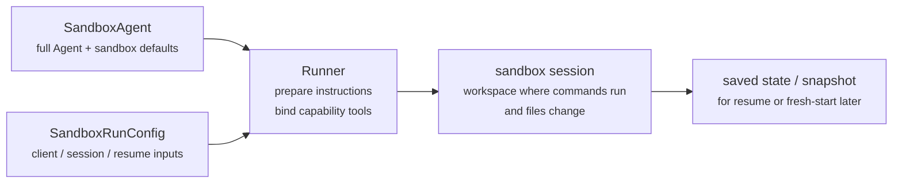
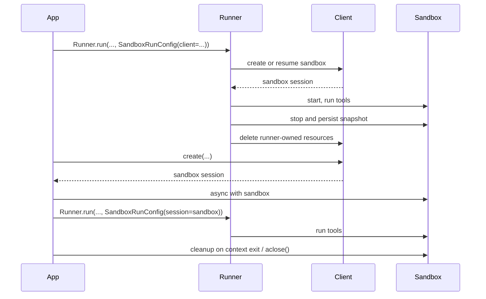

---
search:
  exclude: true
---
# 概念

!!! warning "ベータ機能"

    サンドボックスエージェントはベータ版です。一般提供までに API の詳細、デフォルト、サポートされる機能が変更される可能性があり、時間とともにより高度な機能が追加される予定です。

現代的なエージェントは、ファイルシステム上の実ファイルを操作できる場合に最もよく機能します。 **サンドボックスエージェント** は、専用ツールとシェルコマンドを利用して、大規模なドキュメントセットの検索や操作、ファイル編集、成果物の生成、コマンド実行を行えます。サンドボックスは、エージェントがユーザーに代わって作業するために使用できる永続的なワークスペースをモデルに提供します。Agents SDK のサンドボックスエージェントは、サンドボックス環境とペアになったエージェントを簡単に実行できるようにし、ファイルシステム上に適切なファイルを配置し、サンドボックスをオーケストレーションして、大規模にタスクを開始、停止、再開しやすくします。

エージェントが必要とするデータを中心にワークスペースを定義します。GitHub リポジトリ、ローカルファイルとディレクトリ、合成タスクファイル、S3 や Azure Blob Storage などのリモートファイルシステム、およびユーザーが提供するその他のサンドボックス入力から開始できます。

<div class="sandbox-harness-image" markdown="1">


</div>

`SandboxAgent` は引き続き `Agent` です。`instructions`、`prompt`、`tools`、`handoffs`、`mcp_servers`、`model_settings`、`output_type`、ガードレール、フックといった通常のエージェントサーフェスを保持し、通常の `Runner` API を通じて実行されます。変わるのは実行境界です。

- `SandboxAgent` はエージェント自体を定義します。通常のエージェント設定に加え、`default_manifest`、`base_instructions`、`run_as` などのサンドボックス固有のデフォルト、およびファイルシステムツール、シェルアクセス、スキル、メモリ、コンパクションなどの機能を含みます。
- `Manifest` は、新しいサンドボックスワークスペースの望ましい初期コンテンツとレイアウトを宣言します。これにはファイル、リポジトリ、マウント、環境が含まれます。
- サンドボックスセッションは、コマンドが実行されファイルが変更される、ライブの隔離環境です。
- [`SandboxRunConfig`][agents.run_config.SandboxRunConfig] は、その実行がサンドボックスセッションをどのように取得するかを決定します。たとえば、直接注入する、シリアライズ済みのサンドボックスセッション状態から再接続する、サンドボックスクライアントを通じて新しいサンドボックスセッションを作成する、などです。
- 保存されたサンドボックス状態とスナップショットにより、後続の実行で以前の作業へ再接続したり、保存済みコンテンツから新しいサンドボックスセッションを初期化したりできます。

`Manifest` は新規セッションのワークスペース契約であり、すべてのライブサンドボックスに対する完全な信頼できる情報源ではありません。ある実行における実効ワークスペースは、再利用されたサンドボックスセッション、シリアライズ済みのサンドボックスセッション状態、または実行時に選択されたスナップショットから得られる場合があります。

このページ全体で、「サンドボックスセッション」とは、サンドボックスクライアントによって管理されるライブ実行環境を意味します。これは、[Sessions](../sessions/index.md) で説明されている SDK の会話用 [`Session`][agents.memory.session.Session] インターフェイスとは異なります。

外側のランタイムは引き続き、承認、トレーシング、ハンドオフ、再開のブックキーピングを所有します。サンドボックスセッションは、コマンド、ファイル変更、環境の隔離を所有します。この分離はモデルの中核的な部分です。

### 各要素の関係

サンドボックス実行は、エージェント定義と実行ごとのサンドボックス設定を組み合わせます。Runner はエージェントを準備し、それをライブサンドボックスセッションにバインドし、後続の実行のために状態を保存できます。



サンドボックス固有のデフォルトは `SandboxAgent` に保持します。実行ごとのサンドボックスセッション選択は `SandboxRunConfig` に保持します。

ライフサイクルは 3 つのフェーズで考えてください。

1. `SandboxAgent`、`Manifest`、機能を使って、エージェントと新規ワークスペース契約を定義します。
2. `Runner` に、サンドボックスセッションを注入、再開、または作成する `SandboxRunConfig` を渡して実行します。
3. Runner 管理の `RunState`、明示的なサンドボックス `session_state`、または保存済みワークスペーススナップショットから後で継続します。

シェルアクセスが一時的に使うツールの 1 つにすぎない場合は、[tools guide](../tools.md) のホスト型シェルから始めてください。ワークスペースの隔離、サンドボックスクライアントの選択、またはサンドボックスセッションの再開動作が設計の一部である場合は、サンドボックスエージェントを使用してください。

## 利用する場面

サンドボックスエージェントは、ワークスペース中心のワークフローに適しています。たとえば次のような場合です。

- コーディングとデバッグ。たとえば、GitHub リポジトリ内の Issue レポートに対する自動修正をオーケストレーションし、対象テストを実行する場合
- ドキュメント処理と編集。たとえば、ユーザーの財務書類から情報を抽出し、完成した税務フォームのドラフトを作成する場合
- ファイルに基づくレビューや分析。たとえば、オンボーディングパケット、生成されたレポート、成果物バンドルを確認してから回答する場合
- 隔離されたマルチエージェントパターン。たとえば、各レビュアーやコーディングサブエージェントに独自のワークスペースを与える場合
- 複数ステップのワークスペースタスク。たとえば、ある実行でバグを修正し、後で回帰テストを追加する場合や、スナップショットまたはサンドボックスセッション状態から再開する場合

ファイルや動的なファイルシステムへのアクセスが不要な場合は、引き続き `Agent` を使用してください。シェルアクセスが一時的な機能にすぎない場合は、ホスト型シェルを追加します。ワークスペース境界自体が機能の一部である場合は、サンドボックスエージェントを使用します。

## サンドボックスクライアントの選択

ローカル開発では `UnixLocalSandboxClient` から始めてください。コンテナ隔離やイメージの同等性が必要になったら `DockerSandboxClient` に移行します。プロバイダー管理の実行が必要な場合は、ホスト型プロバイダーに移行します。

ほとんどの場合、[`SandboxRunConfig`][agents.run_config.SandboxRunConfig] 内のサンドボックスクライアントとそのオプションが変わっても、`SandboxAgent` 定義は同じままです。ローカル、Docker、ホスト型、リモートマウントの各オプションについては、[Sandbox clients](clients.md) を参照してください。

## 主要な構成要素

<div class="sandbox-nowrap-first-column-table" markdown="1">

| レイヤー | 主な SDK 構成要素 | 回答する内容 |
| --- | --- | --- |
| エージェント定義 | `SandboxAgent`、`Manifest`、機能 | どのエージェントを実行し、どの新規セッションのワークスペース契約から開始すべきか。 |
| サンドボックス実行 | `SandboxRunConfig`、サンドボックスクライアント、ライブサンドボックスセッション | この実行はどのようにライブサンドボックスセッションを取得し、作業はどこで実行されるか。 |
| 保存済みサンドボックス状態 | `RunState` サンドボックスペイロード、`session_state`、スナップショット | このワークフローはどのように以前のサンドボックス作業へ再接続するか、または保存済みコンテンツから新しいサンドボックスセッションを初期化するか。 |

</div>

主な SDK 構成要素は、次のようにこれらのレイヤーに対応します。

<div class="sandbox-nowrap-first-column-table" markdown="1">

| 構成要素 | 所有するもの | この質問をします |
| --- | --- | --- |
| [`SandboxAgent`][agents.sandbox.sandbox_agent.SandboxAgent] | エージェント定義 | このエージェントは何を行うべきか、どのデフォルトを一緒に持たせるべきか。 |
| [`Manifest`][agents.sandbox.manifest.Manifest] | 新規セッションのワークスペースファイルとフォルダー | 実行開始時にファイルシステム上にどのファイルとフォルダーが存在すべきか。 |
| [`Capability`][agents.sandbox.capabilities.capability.Capability] | サンドボックスネイティブの動作 | どのツール、指示フラグメント、またはランタイム動作をこのエージェントに付与すべきか。 |
| [`SandboxRunConfig`][agents.run_config.SandboxRunConfig] | 実行ごとのサンドボックスクライアントとサンドボックスセッションソース | この実行はサンドボックスセッションを注入、再開、または作成すべきか。 |
| [`RunState`][agents.run_state.RunState] | Runner 管理の保存済みサンドボックス状態 | 以前の Runner 管理ワークフローを再開し、そのサンドボックス状態を自動的に引き継ぐか。 |
| [`SandboxRunConfig.session_state`][agents.run_config.SandboxRunConfig.session_state] | 明示的にシリアライズされたサンドボックスセッション状態 | `RunState` の外部で既にシリアライズしたサンドボックス状態から再開したいか。 |
| [`SandboxRunConfig.snapshot`][agents.run_config.SandboxRunConfig.snapshot] | 新規サンドボックスセッション用の保存済みワークスペースコンテンツ | 新しいサンドボックスセッションを保存済みファイルと成果物から開始すべきか。 |

</div>

実用的な設計順序は次のとおりです。

1. `Manifest` で新規セッションのワークスペース契約を定義します。
2. `SandboxAgent` でエージェントを定義します。
3. 組み込みまたはカスタムの機能を追加します。
4. `RunConfig(sandbox=SandboxRunConfig(...))` で、各実行がサンドボックスセッションをどのように取得するかを決定します。

## サンドボックス実行の準備

実行時、Runner はその定義を具体的なサンドボックス対応の実行に変換します。

1. `SandboxRunConfig` からサンドボックスセッションを解決します。`session=...` を渡した場合、そのライブサンドボックスセッションを再利用します。それ以外の場合は、`client=...` を使って作成または再開します。
2. 実行の実効ワークスペース入力を決定します。実行がサンドボックスセッションを注入または再開する場合、その既存のサンドボックス状態が優先されます。それ以外の場合、Runner は 1 回限りの manifest オーバーライドまたは `agent.default_manifest` から開始します。このため、`Manifest` だけでは、すべての実行における最終的なライブワークスペースは定義されません。
3. 機能が結果の manifest を処理できるようにします。これにより、最終的なエージェントが準備される前に、機能がファイル、マウント、その他のワークスペーススコープの動作を追加できます。
4. 固定された順序で最終的な指示を構築します。SDK のデフォルトサンドボックスプロンプト、または明示的に上書きした場合は `base_instructions`、次に `instructions`、次に機能の指示フラグメント、次にリモートマウントポリシーテキスト、最後にレンダリングされたファイルシステムツリーです。
5. 機能ツールをライブサンドボックスセッションにバインドし、通常の `Runner` API を通じて準備済みエージェントを実行します。

サンドボックス化は、ターンの意味を変えません。ターンは引き続きモデルステップであり、単一のシェルコマンドやサンドボックスアクションではありません。サンドボックス側の操作とターンの間に固定された 1:1 の対応はありません。一部の作業はサンドボックス実行レイヤー内にとどまり、他のアクションはツール結果、承認、または別のモデルステップを必要とするその他の状態を返す場合があります。実用上のルールとして、サンドボックス作業の後にエージェントランタイムが別のモデル応答を必要とする場合にのみ、別のターンが消費されます。

これらの準備ステップがあるため、`SandboxAgent` を設計する際には、`default_manifest`、`instructions`、`base_instructions`、`capabilities`、`run_as` が主なサンドボックス固有オプションになります。

## `SandboxAgent` オプション

通常の `Agent` フィールドに加わるサンドボックス固有のオプションは次のとおりです。

<div class="sandbox-nowrap-first-column-table" markdown="1">

| オプション | 最適な用途 |
| --- | --- |
| `default_manifest` | Runner によって作成される新規サンドボックスセッションのデフォルトワークスペース。 |
| `instructions` | SDK サンドボックスプロンプトの後に追加される追加の役割、ワークフロー、成功基準。 |
| `base_instructions` | SDK サンドボックスプロンプトを置き換える高度なエスケープハッチ。 |
| `capabilities` | このエージェントと一緒に移動すべきサンドボックスネイティブのツールと動作。 |
| `run_as` | シェルコマンド、ファイル読み取り、パッチなど、モデル向けサンドボックスツールのユーザー ID。 |

</div>

サンドボックスクライアントの選択、サンドボックスセッションの再利用、manifest オーバーライド、スナップショット選択は、エージェントではなく [`SandboxRunConfig`][agents.run_config.SandboxRunConfig] に属します。

### `default_manifest`

`default_manifest` は、Runner がこのエージェント用に新規サンドボックスセッションを作成するときに使用されるデフォルトの [`Manifest`][agents.sandbox.manifest.Manifest] です。エージェントが通常開始すべきファイル、リポジトリ、補助資料、出力ディレクトリ、マウントに使用します。

これはデフォルトにすぎません。実行は `SandboxRunConfig(manifest=...)` で上書きできます。また、再利用または再開されたサンドボックスセッションは既存のワークスペース状態を保持します。

### `instructions` と `base_instructions`

異なるプロンプトでも維持すべき短いルールには `instructions` を使用します。`SandboxAgent` では、これらの instructions は SDK のサンドボックスベースプロンプトの後に追加されるため、組み込みのサンドボックスガイダンスを保ちながら、独自の役割、ワークフロー、成功基準を追加できます。

SDK サンドボックスベースプロンプトを置き換えたい場合にのみ、`base_instructions` を使用します。ほとんどのエージェントでは設定すべきではありません。

<div class="sandbox-nowrap-first-column-table" markdown="1">

| 配置先 | 用途 | 例 |
| --- | --- | --- |
| `instructions` | エージェントの安定した役割、ワークフロールール、成功基準。 | 「オンボーディング文書を検査してからハンドオフする。」、「最終ファイルを `output/` に書き込む。」 |
| `base_instructions` | SDK サンドボックスベースプロンプトの完全な置き換え。 | カスタムの低レベルサンドボックスラッパープロンプト。 |
| ユーザープロンプト | この実行に対する 1 回限りのリクエスト。 | 「このワークスペースを要約してください。」 |
| manifest 内のワークスペースファイル | より長いタスク仕様、リポジトリローカルの指示、または範囲が限定された参考資料。 | `repo/task.md`、ドキュメントバンドル、サンプルパケット。 |

</div>

`instructions` の適切な使用例は次のとおりです。

- [examples/sandbox/unix_local_pty.py](https://github.com/openai/openai-agents-python/blob/main/examples/sandbox/unix_local_pty.py) は、PTY 状態が重要な場合にエージェントを 1 つの対話型プロセス内に保ちます。
- [examples/sandbox/handoffs.py](https://github.com/openai/openai-agents-python/blob/main/examples/sandbox/handoffs.py) は、サンドボックスレビュアーが検査後にユーザーへ直接回答することを禁止します。
- [examples/sandbox/tax_prep.py](https://github.com/openai/openai-agents-python/blob/main/examples/sandbox/tax_prep.py) は、最終的に入力済みのファイルが実際に `output/` に配置されることを要求します。
- [examples/sandbox/docs/coding_task.py](https://github.com/openai/openai-agents-python/blob/main/examples/sandbox/docs/coding_task.py) は、正確な検証コマンドを固定し、ワークスペースルート相対のパッチパスを明確にします。

ユーザーの 1 回限りのタスクを `instructions` にコピーすること、manifest に属する長い参考資料を埋め込むこと、組み込み機能が既に注入するツールドキュメントを言い換えること、実行時にモデルが必要としないローカルインストールメモを混ぜることは避けてください。

`instructions` を省略しても、SDK はデフォルトのサンドボックスプロンプトを含めます。これは低レベルラッパーには十分ですが、ほとんどのユーザー向けエージェントでは明示的な `instructions` も提供すべきです。

### `capabilities`

機能は、サンドボックスネイティブの動作を `SandboxAgent` に付与します。実行開始前にワークスペースを形成し、サンドボックス固有の指示を追加し、ライブサンドボックスセッションにバインドされるツールを公開し、そのエージェントのモデル動作や入力処理を調整できます。

組み込み機能には次のものがあります。

<div class="sandbox-nowrap-first-column-table" markdown="1">

| 機能 | 追加する場合 | 注記 |
| --- | --- | --- |
| `Shell` | エージェントにシェルアクセスが必要な場合。 | `exec_command` を追加します。サンドボックスクライアントが PTY 対話をサポートする場合は `write_stdin` も追加します。 |
| `Filesystem` | エージェントにファイル編集やローカル画像の検査が必要な場合。 | `apply_patch` と `view_image` を追加します。パッチパスはワークスペースルート相対です。 |
| `Skills` | サンドボックス内でスキルの検出とマテリアライズを行いたい場合。 | `.agents` または `.agents/skills` を手動でマウントするよりも、これを優先してください。`Skills` はスキルをインデックス化し、サンドボックスにマテリアライズします。 |
| `Memory` | 後続の実行がメモリ成果物を読み取る、または生成する必要がある場合。 | `Shell` が必要です。ライブ更新には `Filesystem` も必要です。 |
| `Compaction` | 長時間実行されるフローで、コンパクション項目の後にコンテキストのトリミングが必要な場合。 | モデルサンプリングと入力処理を調整します。 |

</div>

デフォルトでは、`SandboxAgent.capabilities` は `Capabilities.default()` を使用します。これには `Filesystem()`、`Shell()`、`Compaction()` が含まれます。`capabilities=[...]` を渡すと、そのリストがデフォルトを置き換えるため、引き続き必要なデフォルト機能を含めてください。

スキルについては、どのようにマテリアライズしたいかに基づいてソースを選択します。

- `Skills(lazy_from=LocalDirLazySkillSource(...))` は、モデルがまずインデックスを検出し、必要なものだけをロードできるため、大きなローカルスキルディレクトリの適切なデフォルトです。
- `LocalDirLazySkillSource(source=LocalDir(src=...))` は、SDK プロセスが実行されているファイルシステムから読み取ります。サンドボックスイメージまたはワークスペース内にしか存在しないパスではなく、元のホスト側スキルディレクトリを渡してください。
- `Skills(from_=LocalDir(src=...))` は、事前にステージングしたい小さなローカルバンドルに適しています。
- `Skills(from_=GitRepo(repo=..., ref=...))` は、スキル自体をリポジトリから取得すべき場合に適しています。

`LocalDir.src` は SDK ホスト上のソースパスです。`skills_path` は、`load_skill` が呼び出されたときにスキルがステージングされる、サンドボックスワークスペース内の相対的な宛先パスです。

スキルが既に `.agents/skills/<name>/SKILL.md` のような場所にディスク上で存在する場合は、そのソースルートを `LocalDir(...)` に指定し、それでも `Skills(...)` を使って公開してください。サンドボックス内の別のレイアウトに依存する既存のワークスペース契約がない限り、デフォルトの `skills_path=".agents"` を維持してください。

適合する場合は組み込み機能を優先してください。組み込みでは対応できないサンドボックス固有のツールまたは指示サーフェスが必要な場合にのみ、カスタム機能を作成します。

## 概念

### Manifest

[`Manifest`][agents.sandbox.manifest.Manifest] は、新規サンドボックスセッションのワークスペースを記述します。ワークスペース `root` の設定、ファイルとディレクトリの宣言、ローカルファイルのコピー、Git リポジトリのクローン、リモートストレージマウントの接続、環境変数の設定、ユーザーまたはグループの定義、ワークスペース外の特定の絶対パスへのアクセス許可を行えます。

Manifest エントリのパスはワークスペース相対です。絶対パスにしたり、`..` でワークスペースから抜け出したりすることはできません。これにより、ワークスペース契約はローカル、Docker、ホスト型クライアント間でポータブルに保たれます。

作業開始前にエージェントが必要とする資料には、manifest エントリを使用します。

<div class="sandbox-nowrap-first-column-table" markdown="1">

| Manifest エントリ | 用途 |
| --- | --- |
| `File`、`Dir` | 小さな合成入力、補助ファイル、または出力ディレクトリ。 |
| `LocalFile`、`LocalDir` | サンドボックスにマテリアライズすべきホストファイルまたはディレクトリ。 |
| `GitRepo` | ワークスペースに取得すべきリポジトリ。 |
| `S3Mount`、`GCSMount`、`R2Mount`、`AzureBlobMount`、`BoxMount`、`S3FilesMount` などのマウント | サンドボックス内に表示すべき外部ストレージ。 |

</div>

`Dir` は、合成子要素から、または出力場所として、サンドボックスワークスペース内にディレクトリを作成します。ホストファイルシステムから読み取ることはありません。既存のホストディレクトリをサンドボックスワークスペースにコピーする必要がある場合は、`LocalDir` を使用します。

`LocalFile.src` と `LocalDir.src` は、デフォルトで SDK プロセスの作業ディレクトリに対して解決されます。ソースは、`extra_path_grants` でカバーされていない限り、そのベースディレクトリ配下に留まる必要があります。これにより、ローカルソースのマテリアライズは、サンドボックス manifest の他の部分と同じホストパス信頼境界内に保たれます。

マウントエントリは公開するストレージを記述し、マウント戦略はサンドボックスバックエンドがそのストレージを接続する方法を記述します。マウントオプションとプロバイダーサポートについては、[Sandbox clients](clients.md#mounts-and-remote-storage) を参照してください。

適切な manifest 設計では通常、ワークスペース契約を狭く保ち、長いタスク手順を `repo/task.md` などのワークスペースファイルに置き、instructions 内では `repo/task.md` や `output/report.md` などの相対ワークスペースパスを使用します。エージェントが `Filesystem` 機能の `apply_patch` ツールでファイルを編集する場合、パッチパスはシェルの `workdir` ではなく、サンドボックスワークスペースルートからの相対パスであることに注意してください。

`extra_path_grants` は、エージェントがワークスペース外の具体的な絶対パスを必要とする場合、または manifest が SDK プロセス作業ディレクトリ外の信頼済みローカルソースをコピーする必要がある場合にのみ使用します。例として、一時的なツール出力用の `/tmp`、読み取り専用ランタイム用の `/opt/toolchain`、サンドボックスにマテリアライズすべき生成済みスキルディレクトリなどがあります。グラントは、ローカルソースのマテリアライズ、SDK ファイル API、およびバックエンドがファイルシステムポリシーを強制できる場合のシェル実行に適用されます。

```python
from agents.sandbox import Manifest, SandboxPathGrant

manifest = Manifest(
    extra_path_grants=(
        SandboxPathGrant(path="/tmp"),
        SandboxPathGrant(path="/opt/toolchain", read_only=True),
    ),
)
```

`extra_path_grants` を含む manifest は、信頼済み設定として扱ってください。アプリケーションがそれらのホストパスを既に承認していない限り、モデル出力やその他の信頼できないペイロードからグラントを読み込まないでください。

スナップショットと `persist_workspace()` には、引き続きワークスペースルートのみが含まれます。追加で許可されたパスはランタイムアクセスであり、永続的なワークスペース状態ではありません。

### Permissions

`Permissions` は、manifest エントリのファイルシステム権限を制御します。これはサンドボックスがマテリアライズするファイルに関するものであり、モデル権限、承認ポリシー、API 認証情報に関するものではありません。

デフォルトでは、manifest エントリは所有者が読み取り/書き込み/実行可能で、グループとその他ユーザーが読み取り/実行可能です。ステージングされたファイルをプライベート、読み取り専用、または実行可能にすべき場合は、これを上書きします。

```python
from agents.sandbox import FileMode, Permissions
from agents.sandbox.entries import File

private_notes = File(
    content=b"internal notes",
    permissions=Permissions(
        owner=FileMode.READ | FileMode.WRITE,
        group=FileMode.NONE,
        other=FileMode.NONE,
    ),
)
```

`Permissions` は、所有者、グループ、その他のビットと、そのエントリがディレクトリかどうかを別々に保存します。直接構築することも、`Permissions.from_str(...)` でモード文字列から解析することも、`Permissions.from_mode(...)` で OS モードから導出することもできます。

ユーザーは、作業を実行できるサンドボックス ID です。その ID をサンドボックス内に存在させたい場合は、manifest に `User` を追加し、シェルコマンド、ファイル読み取り、パッチなどのモデル向けサンドボックスツールをそのユーザーとして実行すべき場合は `SandboxAgent.run_as` を設定します。`run_as` が manifest にまだ存在しないユーザーを指している場合、Runner は有効な manifest にそのユーザーを追加します。

```python
from agents import Runner
from agents.run import RunConfig
from agents.sandbox import FileMode, Manifest, Permissions, SandboxAgent, SandboxRunConfig, User
from agents.sandbox.entries import Dir, LocalDir
from agents.sandbox.sandboxes.unix_local import UnixLocalSandboxClient

analyst = User(name="analyst")

agent = SandboxAgent(
    name="Dataroom analyst",
    instructions="Review the files in `dataroom/` and write findings to `output/`.",
    default_manifest=Manifest(
        # Declare the sandbox user so manifest entries can grant access to it.
        users=[analyst],
        entries={
            "dataroom": LocalDir(
                src="./dataroom",
                # Let the analyst traverse and read the mounted dataroom, but not edit it.
                group=analyst,
                permissions=Permissions(
                    owner=FileMode.READ | FileMode.EXEC,
                    group=FileMode.READ | FileMode.EXEC,
                    other=FileMode.NONE,
                ),
            ),
            "output": Dir(
                # Give the analyst a writable scratch/output directory for artifacts.
                group=analyst,
                permissions=Permissions(
                    owner=FileMode.ALL,
                    group=FileMode.ALL,
                    other=FileMode.NONE,
                ),
            ),
        },
    ),
    # Run model-facing sandbox actions as this user, so those permissions apply.
    run_as=analyst,
)

result = await Runner.run(
    agent,
    "Summarize the contracts and call out renewal dates.",
    run_config=RunConfig(
        sandbox=SandboxRunConfig(client=UnixLocalSandboxClient()),
    ),
)
```

ファイルレベルの共有ルールも必要な場合は、ユーザーを manifest グループおよびエントリの `group` メタデータと組み合わせてください。`run_as` ユーザーは、サンドボックスネイティブアクションを誰が実行するかを制御します。`Permissions` は、サンドボックスがワークスペースをマテリアライズした後、そのユーザーがどのファイルを読み取り、書き込み、実行できるかを制御します。

### SnapshotSpec

`SnapshotSpec` は、新規サンドボックスセッションが保存済みワークスペースコンテンツをどこから復元し、どこへ永続化すべきかを示します。これはサンドボックスワークスペースのスナップショットポリシーであり、`session_state` は特定のサンドボックスバックエンドを再開するためのシリアライズ済み接続状態です。

ローカルの永続スナップショットには `LocalSnapshotSpec` を使用し、アプリがリモートスナップショットクライアントを提供する場合は `RemoteSnapshotSpec` を使用します。ローカルスナップショット設定が利用できない場合はフォールバックとして no-op スナップショットが使用され、高度な呼び出し元はワークスペーススナップショットの永続化を望まない場合に明示的に使用できます。

```python
from pathlib import Path

from agents.run import RunConfig
from agents.sandbox import LocalSnapshotSpec, SandboxRunConfig
from agents.sandbox.sandboxes.unix_local import UnixLocalSandboxClient

run_config = RunConfig(
    sandbox=SandboxRunConfig(
        client=UnixLocalSandboxClient(),
        snapshot=LocalSnapshotSpec(base_path=Path("/tmp/my-sandbox-snapshots")),
    )
)
```

Runner が新規サンドボックスセッションを作成すると、サンドボックスクライアントはそのセッション用のスナップショットインスタンスを構築します。開始時に、スナップショットが復元可能であれば、サンドボックスは実行が続行される前に保存済みワークスペースコンテンツを復元します。クリーンアップ時には、Runner 所有のサンドボックスセッションがワークスペースをアーカイブし、スナップショットを通じて永続化します。

`snapshot` を省略した場合、ランタイムは可能であればデフォルトのローカルスナップショット場所を使用しようとします。それを設定できない場合は、no-op スナップショットにフォールバックします。マウントされたパスと一時パスは、永続的なワークスペースコンテンツとしてスナップショットにコピーされません。

### サンドボックスライフサイクル

ライフサイクルモードには、 **SDK 所有** と **開発者所有** の 2 つがあります。

<div class="sandbox-lifecycle-diagram" markdown="1">



</div>

サンドボックスを 1 回の実行だけ存続させればよい場合は、SDK 所有ライフサイクルを使用します。`client`、任意の `manifest`、任意の `snapshot`、およびクライアントの `options` を渡します。Runner はサンドボックスを作成または再開し、開始し、エージェントを実行し、スナップショット対応のワークスペース状態を永続化し、サンドボックスをシャットダウンし、Runner 所有リソースをクライアントにクリーンアップさせます。

```python
result = await Runner.run(
    agent,
    "Inspect the workspace and summarize what changed.",
    run_config=RunConfig(
        sandbox=SandboxRunConfig(client=UnixLocalSandboxClient()),
    ),
)
```

サンドボックスを事前に作成したい場合、1 つのライブサンドボックスを複数の実行で再利用したい場合、実行後にファイルを検査したい場合、自分で作成したサンドボックス越しにストリーミングしたい場合、またはクリーンアップのタイミングを正確に決めたい場合は、開発者所有ライフサイクルを使用します。`session=...` を渡すと、Runner はそのライブサンドボックスを使用しますが、代わりに閉じることはありません。

```python
sandbox = await client.create(manifest=agent.default_manifest)

async with sandbox:
    run_config = RunConfig(sandbox=SandboxRunConfig(session=sandbox))
    await Runner.run(agent, "Analyze the files.", run_config=run_config)
    await Runner.run(agent, "Write the final report.", run_config=run_config)
```

通常はコンテキストマネージャー形式です。入力時にサンドボックスを開始し、終了時にセッションクリーンアップライフサイクルを実行します。アプリがコンテキストマネージャーを使用できない場合は、ライフサイクルメソッドを直接呼び出してください。

```python
sandbox = await client.create(
    manifest=agent.default_manifest,
    snapshot=LocalSnapshotSpec(base_path=Path("/tmp/my-sandbox-snapshots")),
)
try:
    await sandbox.start()
    await Runner.run(
        agent,
        "Analyze the files.",
        run_config=RunConfig(sandbox=SandboxRunConfig(session=sandbox)),
    )
    # Persist a checkpoint of the live workspace before doing more work.
    # `aclose()` also calls `stop()`, so this is only needed for an explicit mid-lifecycle save.
    await sandbox.stop()
finally:
    await sandbox.aclose()
```

`stop()` はスナップショット対応のワークスペースコンテンツのみを永続化します。サンドボックスを破棄するわけではありません。`aclose()` は完全なセッションクリーンアップパスです。pre-stop フックを実行し、`stop()` を呼び出し、サンドボックスリソースをシャットダウンし、セッションスコープの依存関係を閉じます。

## `SandboxRunConfig` オプション

[`SandboxRunConfig`][agents.run_config.SandboxRunConfig] は、サンドボックスセッションの取得元と、新規セッションをどのように初期化するかを決定する実行ごとのオプションを保持します。

### サンドボックスソース

これらのオプションは、Runner がサンドボックスセッションを再利用、再開、または作成すべきかを決定します。

<div class="sandbox-nowrap-first-column-table" markdown="1">

| オプション | 使用する場合 | 注記 |
| --- | --- | --- |
| `client` | Runner にサンドボックスセッションの作成、再開、クリーンアップを任せたい場合。 | ライブサンドボックス `session` を提供しない限り必須です。 |
| `session` | 既に自分でライブサンドボックスセッションを作成している場合。 | 呼び出し元がライフサイクルを所有します。Runner はそのライブサンドボックスセッションを再利用します。 |
| `session_state` | シリアライズ済みのサンドボックスセッション状態はあるが、ライブサンドボックスセッションオブジェクトはない場合。 | `client` が必要です。Runner はその明示的な状態から所有セッションとして再開します。 |

</div>

実際には、Runner は次の順序でサンドボックスセッションを解決します。

1. `run_config.sandbox.session` を注入した場合、そのライブサンドボックスセッションが直接再利用されます。
2. それ以外で、実行が `RunState` から再開している場合、保存されたサンドボックスセッション状態が再開されます。
3. それ以外で、`run_config.sandbox.session_state` を渡した場合、Runner はその明示的にシリアライズされたサンドボックスセッション状態から再開します。
4. それ以外の場合、Runner は新規サンドボックスセッションを作成します。その新規セッションでは、提供されていれば `run_config.sandbox.manifest` を使用し、そうでなければ `agent.default_manifest` を使用します。

### 新規セッション入力

これらのオプションは、Runner が新規サンドボックスセッションを作成する場合にのみ意味があります。

<div class="sandbox-nowrap-first-column-table" markdown="1">

| オプション | 使用する場合 | 注記 |
| --- | --- | --- |
| `manifest` | 1 回限りの新規セッションワークスペース上書きを行いたい場合。 | 省略された場合は `agent.default_manifest` にフォールバックします。 |
| `snapshot` | 新規サンドボックスセッションをスナップショットから初期化すべき場合。 | 再開に似たフローやリモートスナップショットクライアントに便利です。 |
| `options` | サンドボックスクライアントが作成時オプションを必要とする場合。 | Docker イメージ、Modal アプリ名、E2B テンプレート、タイムアウト、および同様のクライアント固有設定で一般的です。 |

</div>

### マテリアライズ制御

`concurrency_limits` は、並列に実行できるサンドボックスマテリアライズ作業の量を制御します。大きな manifest やローカルディレクトリコピーに対してより厳密なリソース制御が必要な場合は、`SandboxConcurrencyLimits(manifest_entries=..., local_dir_files=...)` を使用します。いずれかの値を `None` に設定すると、その特定の制限を無効化できます。

`archive_limits` は、アーカイブ展開に対する SDK 側のリソースチェックを制御します。SDK デフォルトしきい値を有効にするには `archive_limits=SandboxArchiveLimits()` を設定します。アーカイブにより厳密なリソース制御が必要な場合は、`SandboxArchiveLimits(max_input_bytes=..., max_extracted_bytes=..., max_members=...)` のような明示的な値を渡します。SDK のアーカイブリソース制限なしというデフォルト動作を維持するには `archive_limits=None` のままにします。または、個別フィールドを `None` に設定して、その制限だけを無効化します。

覚えておく価値のある含意がいくつかあります。

- 新規セッション: `manifest=` と `snapshot=` は、Runner が新規サンドボックスセッションを作成する場合にのみ適用されます。
- 再開とスナップショット: `session_state=` は以前にシリアライズされたサンドボックス状態へ再接続します。一方、`snapshot=` は保存済みワークスペースコンテンツから新しいサンドボックスセッションを初期化します。
- クライアント固有オプション: `options=` はサンドボックスクライアントに依存します。Docker と多くのホスト型クライアントでは必須です。
- 注入されたライブセッション: 実行中のサンドボックス `session` を渡した場合、機能による manifest 更新は互換性のある非マウントエントリを追加できます。`manifest.root`、`manifest.environment`、`manifest.users`、`manifest.groups` を変更すること、既存エントリを削除すること、エントリ型を置き換えること、マウントエントリを追加または変更することはできません。
- Runner API: `SandboxAgent` の実行は引き続き通常の `Runner.run()`、`Runner.run_sync()`、`Runner.run_streamed()` API を使用します。

## 完全な例: コーディングタスク

このコーディング形式の例は、適切なデフォルトの出発点です。

```python
import asyncio
from pathlib import Path

from agents import ModelSettings, Runner
from agents.run import RunConfig
from agents.sandbox import Manifest, SandboxAgent, SandboxRunConfig
from agents.sandbox.capabilities import (
    Capabilities,
    LocalDirLazySkillSource,
    Skills,
)
from agents.sandbox.entries import LocalDir
from agents.sandbox.sandboxes.unix_local import UnixLocalSandboxClient

EXAMPLE_DIR = Path(__file__).resolve().parent
HOST_REPO_DIR = EXAMPLE_DIR / "repo"
HOST_SKILLS_DIR = EXAMPLE_DIR / "skills"
TARGET_TEST_CMD = "sh tests/test_credit_note.sh"


def build_agent(model: str) -> SandboxAgent[None]:
    return SandboxAgent(
        name="Sandbox engineer",
        model=model,
        instructions=(
            "Inspect the repo, make the smallest correct change, run the most relevant checks, "
            "and summarize the file changes and risks. "
            "Read `repo/task.md` before editing files. Stay grounded in the repository, preserve "
            "existing behavior, and mention the exact verification command you ran. "
            "Use the `$credit-note-fixer` skill before editing files. If the repo lives under "
            "`repo/`, remember that `apply_patch` paths stay relative to the sandbox workspace "
            "root, so edits still target `repo/...`."
        ),
        # Put repos and task files in the manifest.
        default_manifest=Manifest(
            entries={
                "repo": LocalDir(src=HOST_REPO_DIR),
            }
        ),
        capabilities=Capabilities.default() + [
            Skills(
                lazy_from=LocalDirLazySkillSource(
                    # This is a host path read by the SDK process.
                    # Requested skills are copied into `skills_path` in the sandbox.
                    source=LocalDir(src=HOST_SKILLS_DIR),
                )
            ),
        ],
        model_settings=ModelSettings(tool_choice="required"),
    )


async def main(model: str, prompt: str) -> None:
    result = await Runner.run(
        build_agent(model),
        prompt,
        run_config=RunConfig(
            sandbox=SandboxRunConfig(client=UnixLocalSandboxClient()),
            workflow_name="Sandbox coding example",
        ),
    )
    print(result.final_output)


if __name__ == "__main__":
    asyncio.run(
        main(
            model="gpt-5.5",
            prompt=(
                "Open `repo/task.md`, use the `$credit-note-fixer` skill, fix the bug, "
                f"run `{TARGET_TEST_CMD}`, and summarize the change."
            ),
        )
    )
```

[examples/sandbox/docs/coding_task.py](https://github.com/openai/openai-agents-python/blob/main/examples/sandbox/docs/coding_task.py) を参照してください。この例では、Unix ローカル実行間で決定論的に検証できるように、小さなシェルベースのリポジトリを使用します。実際のタスクリポジトリは、もちろん Python、JavaScript、その他何でも構いません。

## 一般的なパターン

上記の完全な例から始めてください。多くの場合、同じ `SandboxAgent` をそのまま維持し、サンドボックスクライアント、サンドボックスセッションソース、またはワークスペースソースだけを変更できます。

### サンドボックスクライアントの切り替え

エージェント定義は同じままにし、実行設定だけを変更します。コンテナ隔離やイメージの同等性が必要な場合は Docker を使用し、プロバイダー管理の実行が必要な場合はホスト型プロバイダーを使用します。例とプロバイダーオプションについては、[Sandbox clients](clients.md) を参照してください。

### ワークスペースの上書き

エージェント定義は同じままにし、新規セッションの manifest だけを入れ替えます。

```python
from agents.run import RunConfig
from agents.sandbox import Manifest, SandboxRunConfig
from agents.sandbox.entries import GitRepo
from agents.sandbox.sandboxes.unix_local import UnixLocalSandboxClient

run_config = RunConfig(
    sandbox=SandboxRunConfig(
        client=UnixLocalSandboxClient(),
        manifest=Manifest(
            entries={
                "repo": GitRepo(repo="openai/openai-agents-python", ref="main"),
            }
        ),
    ),
)
```

エージェントを再構築せずに、同じエージェントの役割を異なるリポジトリ、パケット、またはタスクバンドルに対して実行すべき場合に使用します。上記の検証済みコーディング例は、1 回限りの上書きではなく `default_manifest` で同じパターンを示しています。

### サンドボックスセッションの注入

明示的なライフサイクル制御、実行後の検査、または出力コピーが必要な場合は、ライブサンドボックスセッションを注入します。

```python
from agents import Runner
from agents.run import RunConfig
from agents.sandbox import SandboxRunConfig
from agents.sandbox.sandboxes.unix_local import UnixLocalSandboxClient

client = UnixLocalSandboxClient()
sandbox = await client.create(manifest=agent.default_manifest)

async with sandbox:
    result = await Runner.run(
        agent,
        prompt,
        run_config=RunConfig(
            sandbox=SandboxRunConfig(session=sandbox),
        ),
    )
```

実行後にワークスペースを検査したい場合や、既に開始済みのサンドボックスセッション越しにストリーミングしたい場合に使用します。[examples/sandbox/docs/coding_task.py](https://github.com/openai/openai-agents-python/blob/main/examples/sandbox/docs/coding_task.py) と [examples/sandbox/docker/docker_runner.py](https://github.com/openai/openai-agents-python/blob/main/examples/sandbox/docker/docker_runner.py) を参照してください。

### セッション状態からの再開

`RunState` の外部で既にサンドボックス状態をシリアライズしている場合は、Runner にその状態から再接続させます。

```python
from agents.run import RunConfig
from agents.sandbox import SandboxRunConfig

serialized = load_saved_payload()
restored_state = client.deserialize_session_state(serialized)

run_config = RunConfig(
    sandbox=SandboxRunConfig(
        client=client,
        session_state=restored_state,
    ),
)
```

サンドボックス状態が独自のストレージまたはジョブシステムに存在し、`Runner` にそれを直接再開させたい場合に使用します。シリアライズ/デシリアライズフローについては、[examples/sandbox/extensions/blaxel_runner.py](https://github.com/openai/openai-agents-python/blob/main/examples/sandbox/extensions/blaxel_runner.py) を参照してください。

### スナップショットからの開始

保存済みファイルと成果物から新しいサンドボックスを初期化します。

```python
from pathlib import Path

from agents.run import RunConfig
from agents.sandbox import LocalSnapshotSpec, SandboxRunConfig
from agents.sandbox.sandboxes.unix_local import UnixLocalSandboxClient

run_config = RunConfig(
    sandbox=SandboxRunConfig(
        client=UnixLocalSandboxClient(),
        snapshot=LocalSnapshotSpec(base_path=Path("/tmp/my-sandbox-snapshot")),
    ),
)
```

新規実行を `agent.default_manifest` だけでなく、保存済みワークスペースコンテンツから開始すべき場合に使用します。ローカルスナップショットフローについては [examples/sandbox/memory.py](https://github.com/openai/openai-agents-python/blob/main/examples/sandbox/memory.py) を、リモートスナップショットクライアントについては [examples/sandbox/sandbox_agent_with_remote_snapshot.py](https://github.com/openai/openai-agents-python/blob/main/examples/sandbox/sandbox_agent_with_remote_snapshot.py) を参照してください。

### Git からのスキル読み込み

ローカルスキルソースを、リポジトリをバックエンドとするものに入れ替えます。

```python
from agents.sandbox.capabilities import Capabilities, Skills
from agents.sandbox.entries import GitRepo

capabilities = Capabilities.default() + [
    Skills(from_=GitRepo(repo="sdcoffey/tax-prep-skills", ref="main")),
]
```

スキルバンドルに独自のリリースサイクルがある場合や、サンドボックス間で共有すべき場合に使用します。[examples/sandbox/tax_prep.py](https://github.com/openai/openai-agents-python/blob/main/examples/sandbox/tax_prep.py) を参照してください。

### ツールとしての公開

ツールエージェントは、独自のサンドボックス境界を持つことも、親実行のライブサンドボックスを再利用することもできます。再利用は、高速な読み取り専用エクスプローラーエージェントに便利です。別のサンドボックスを作成、ハイドレート、スナップショットするコストを払わずに、親が使用している正確なワークスペースを検査できます。

```python
from agents import Runner
from agents.run import RunConfig
from agents.sandbox import FileMode, Manifest, Permissions, SandboxAgent, SandboxRunConfig, User
from agents.sandbox.entries import Dir, File
from agents.sandbox.sandboxes.unix_local import UnixLocalSandboxClient

coordinator = User(name="coordinator")
explorer = User(name="explorer")

manifest = Manifest(
    users=[coordinator, explorer],
    entries={
        "pricing_packet": Dir(
            group=coordinator,
            permissions=Permissions(
                owner=FileMode.ALL,
                group=FileMode.ALL,
                other=FileMode.READ | FileMode.EXEC,
                directory=True,
            ),
            children={
                "pricing.md": File(
                    content=b"Pricing packet contents...",
                    group=coordinator,
                    permissions=Permissions(
                        owner=FileMode.ALL,
                        group=FileMode.ALL,
                        other=FileMode.READ,
                    ),
                ),
            },
        ),
        "work": Dir(
            group=coordinator,
            permissions=Permissions(
                owner=FileMode.ALL,
                group=FileMode.ALL,
                other=FileMode.NONE,
                directory=True,
            ),
        ),
    },
)

pricing_explorer = SandboxAgent(
    name="Pricing Explorer",
    instructions="Read `pricing_packet/` and summarize commercial risk. Do not edit files.",
    run_as=explorer,
)

client = UnixLocalSandboxClient()
sandbox = await client.create(manifest=manifest)

async with sandbox:
    shared_run_config = RunConfig(
        sandbox=SandboxRunConfig(session=sandbox),
    )

    orchestrator = SandboxAgent(
        name="Revenue Operations Coordinator",
        instructions="Coordinate the review and write final notes to `work/`.",
        run_as=coordinator,
        tools=[
            pricing_explorer.as_tool(
                tool_name="review_pricing_packet",
                tool_description="Inspect the pricing packet and summarize commercial risk.",
                run_config=shared_run_config,
                max_turns=2,
            ),
        ],
    )

    result = await Runner.run(
        orchestrator,
        "Review the pricing packet, then write final notes to `work/summary.md`.",
        run_config=shared_run_config,
    )
```

ここでは、親エージェントが `coordinator` として実行され、エクスプローラーツールエージェントが同じライブサンドボックスセッション内で `explorer` として実行されます。`pricing_packet/` エントリは `other` ユーザーが読み取り可能なので、explorer はそれらをすばやく検査できますが、書き込みビットはありません。`work/` ディレクトリは coordinator のユーザー/グループだけが利用できるため、親は最終成果物を書き込めますが、explorer は読み取り専用のままです。

ツールエージェントに実際の隔離が必要な場合は、独自のサンドボックス `RunConfig` を与えます。

```python
from docker import from_env as docker_from_env

from agents.run import RunConfig
from agents.sandbox import SandboxAgent, SandboxRunConfig
from agents.sandbox.sandboxes.docker import DockerSandboxClient, DockerSandboxClientOptions

rollout_agent = SandboxAgent(
    name="Rollout Reviewer",
    instructions="Inspect the rollout packet and summarize implementation risk.",
)

rollout_agent.as_tool(
    tool_name="review_rollout_risk",
    tool_description="Inspect the rollout packet and summarize implementation risk.",
    run_config=RunConfig(
        sandbox=SandboxRunConfig(
            client=DockerSandboxClient(docker_from_env()),
            options=DockerSandboxClientOptions(image="python:3.14-slim"),
        ),
    ),
)
```

ツールエージェントが自由に変更する、信頼できないコマンドを実行する、または別のバックエンド/イメージを使用する必要がある場合は、別のサンドボックスを使用します。[examples/sandbox/sandbox_agents_as_tools.py](https://github.com/openai/openai-agents-python/blob/main/examples/sandbox/sandbox_agents_as_tools.py) を参照してください。

### ローカルツールと MCP との組み合わせ

同じエージェントで通常のツールも使用しながら、サンドボックスワークスペースを維持します。

```python
from agents.sandbox import SandboxAgent
from agents.sandbox.capabilities import Shell

agent = SandboxAgent(
    name="Workspace reviewer",
    instructions="Inspect the workspace and call host tools when needed.",
    tools=[get_discount_approval_path],
    mcp_servers=[server],
    capabilities=[Shell()],
)
```

ワークスペース検査がエージェントの仕事の一部にすぎない場合に使用します。[examples/sandbox/sandbox_agent_with_tools.py](https://github.com/openai/openai-agents-python/blob/main/examples/sandbox/sandbox_agent_with_tools.py) を参照してください。

## メモリ

将来のサンドボックスエージェント実行が過去の実行から学習すべき場合は、`Memory` 機能を使用します。メモリは SDK の会話用 `Session` メモリとは別のものです。教訓をサンドボックスワークスペース内のファイルに抽出し、後続の実行がそれらのファイルを読み取れるようにします。

セットアップ、読み取り/生成動作、マルチターン会話、レイアウト隔離については、[Agent memory](memory.md) を参照してください。

## 構成パターン

単一エージェントパターンが明確になったら、次の設計上の問いは、より大きなシステムのどこにサンドボックス境界を置くかです。

サンドボックスエージェントは、引き続き SDK の他の部分と組み合わせられます。

- [Handoffs](../handoffs.md): ドキュメント量の多い作業を、非サンドボックスの受付エージェントからサンドボックスレビュアーへハンドオフします。
- [Agents as tools](../tools.md#agents-as-tools): 複数のサンドボックスエージェントをツールとして公開します。通常は各 `Agent.as_tool(...)` 呼び出しで `run_config=RunConfig(sandbox=SandboxRunConfig(...))` を渡し、各ツールが独自のサンドボックス境界を得るようにします。
- [MCP](../mcp.md) と通常の関数ツール: サンドボックス機能は `mcp_servers` や通常の Python ツールと共存できます。
- [エージェントの実行](../running_agents.md): サンドボックス実行は引き続き通常の `Runner` API を使用します。

特に一般的なパターンは 2 つあります。

- ワークフローのうちワークスペース隔離が必要な部分だけ、非サンドボックスエージェントがサンドボックスエージェントへハンドオフする
- オーケストレーターが複数のサンドボックスエージェントをツールとして公開する。通常は各 `Agent.as_tool(...)` 呼び出しに別々のサンドボックス `RunConfig` を使用し、各ツールが独自の隔離ワークスペースを得るようにする

### ターンとサンドボックス実行

ハンドオフと agent-as-tool 呼び出しは分けて説明すると理解しやすくなります。

ハンドオフの場合、トップレベルの実行とトップレベルのターンループは引き続き 1 つです。アクティブなエージェントは変わりますが、実行がネストされるわけではありません。非サンドボックスの受付エージェントがサンドボックスレビュアーへハンドオフすると、同じ実行内の次のモデル呼び出しはサンドボックスエージェント向けに準備され、そのサンドボックスエージェントが次のターンを担当するエージェントになります。言い換えると、ハンドオフは同じ実行の次のターンをどのエージェントが所有するかを変更します。[examples/sandbox/handoffs.py](https://github.com/openai/openai-agents-python/blob/main/examples/sandbox/handoffs.py) を参照してください。

`Agent.as_tool(...)` の場合、関係は異なります。外側のオーケストレーターは 1 つの外側ターンを使ってツール呼び出しを決定し、そのツール呼び出しがサンドボックスエージェントのネストされた実行を開始します。ネストされた実行には、独自のターンループ、`max_turns`、承認、通常は独自のサンドボックス `RunConfig` があります。1 つのネストターンで完了する場合もあれば、複数かかる場合もあります。外側のオーケストレーターから見ると、そのすべての作業は 1 つのツール呼び出しの背後にあるため、ネストされたターンは外側実行のターンカウンターを増やしません。[examples/sandbox/sandbox_agents_as_tools.py](https://github.com/openai/openai-agents-python/blob/main/examples/sandbox/sandbox_agents_as_tools.py) を参照してください。

承認動作も同じ分離に従います。

- ハンドオフでは、サンドボックスエージェントがその実行のアクティブなエージェントになるため、承認は同じトップレベル実行に残ります
- `Agent.as_tool(...)` では、サンドボックスツールエージェント内で発生した承認も外側の実行に表面化しますが、それらは保存されたネスト実行状態から来ており、外側の実行が再開するとネストされたサンドボックス実行を再開します

## 関連情報

- [Quickstart](../sandbox_agents.md): 1 つのサンドボックスエージェントを実行します。
- [Sandbox clients](clients.md): ローカル、Docker、ホスト型、マウントの各オプションを選択します。
- [Agent memory](memory.md): 以前のサンドボックス実行からの教訓を保持し、再利用します。
- [examples/sandbox/](https://github.com/openai/openai-agents-python/tree/main/examples/sandbox): 実行可能なローカル、コーディング、メモリ、ハンドオフ、エージェント構成パターン。