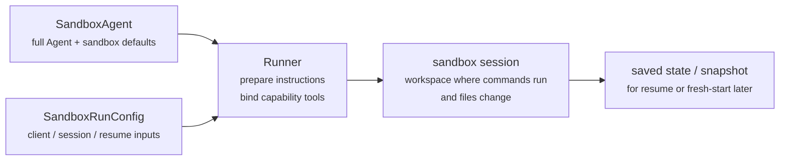
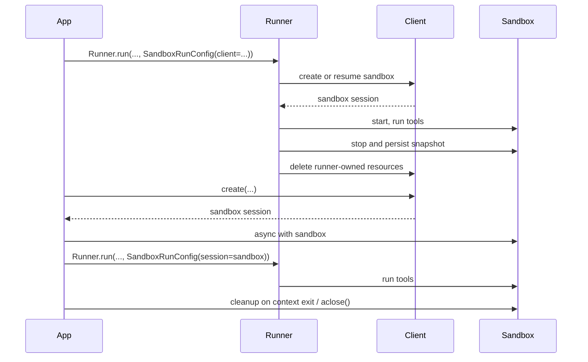

---
search:
  exclude: true
---
# 概念

!!! warning "ベータ機能"

    サンドボックスエージェントはベータ版です。一般提供前に API の詳細、デフォルト、サポートされる機能が変更される可能性があります。また、時間の経過とともにより高度な機能が追加される予定です。

現代的なエージェントは、ファイルシステム上の実ファイルを操作できるときに最も効果的に動作します。**サンドボックスエージェント** は、専用ツールとシェルコマンドを使用して、大規模なドキュメントセットの検索や操作、ファイルの編集、成果物の生成、コマンドの実行を行えます。サンドボックスは、エージェントがユーザーの代わりに作業するために利用できる永続的なワークスペースをモデルに提供します。Agents SDK のサンドボックスエージェントは、サンドボックス環境と組み合わせたエージェントを簡単に実行できるようにし、ファイルシステム上に適切なファイルを配置し、サンドボックスをオーケストレーションして、タスクを大規模に開始、停止、再開しやすくします。

エージェントが必要とするデータを中心にワークスペースを定義します。ワークスペースは、GitHub リポジトリ、ローカルファイルとディレクトリ、合成タスクファイル、S3 や Azure Blob Storage などのリモートファイルシステム、その他提供するサンドボックス入力から開始できます。

<div class="sandbox-harness-image" markdown="1">


</div>

`SandboxAgent` は引き続き `Agent` です。`instructions`、`prompt`、`tools`、`handoffs`、`mcp_servers`、`model_settings`、`output_type`、ガードレール、フックなど、通常のエージェントのインターフェイスを保持し、通常の `Runner` API を通じて実行されます。変わるのは実行境界です。

- `SandboxAgent` はエージェント自体を定義します。通常のエージェント設定に加えて、`default_manifest`、`base_instructions`、`run_as` などのサンドボックス固有のデフォルト、ファイルシステムツール、シェルアクセス、スキル、メモリ、コンパクションなどの機能を含みます。
- `Manifest` は、ファイル、リポジトリ、マウント、環境など、新規サンドボックスワークスペースの望ましい初期内容とレイアウトを宣言します。
- サンドボックスセッションは、コマンドが実行されファイルが変更される、ライブの隔離環境です。
- [`SandboxRunConfig`][agents.run_config.SandboxRunConfig] は、実行がサンドボックスセッションをどのように取得するかを決定します。たとえば、直接注入する、シリアライズ済みのサンドボックスセッション状態から再接続する、またはサンドボックスクライアントを通じて新規サンドボックスセッションを作成する、といった方法があります。
- 保存済みのサンドボックス状態とスナップショットにより、後続の実行は以前の作業に再接続したり、保存済みの内容から新規サンドボックスセッションを初期化したりできます。

`Manifest` は新規セッションのワークスペース契約であり、すべてのライブサンドボックスに対する完全な唯一の情報源ではありません。実行の有効なワークスペースは、再利用されたサンドボックスセッション、シリアライズ済みのサンドボックスセッション状態、または実行時に選択されたスナップショットから取得される場合があります。

このページ全体で、「サンドボックスセッション」とはサンドボックスクライアントによって管理されるライブ実行環境を意味します。これは、[Sessions](../sessions/index.md) で説明されている SDK の会話型 [`Session`][agents.memory.session.Session] インターフェイスとは異なります。

外側のランタイムは引き続き、承認、トレーシング、ハンドオフ、再開の記録管理を所有します。サンドボックスセッションは、コマンド、ファイル変更、環境隔離を所有します。この分担は、このモデルの中核です。

### 各要素の関係

サンドボックス実行は、エージェント定義と実行ごとのサンドボックス設定を組み合わせます。Runner はエージェントを準備し、ライブのサンドボックスセッションにバインドし、後続の実行のために状態を保存できます。



サンドボックス固有のデフォルトは `SandboxAgent` に保持します。実行ごとのサンドボックスセッションの選択は `SandboxRunConfig` に保持します。

ライフサイクルは 3 つのフェーズで考えてください。

1. `SandboxAgent`、`Manifest`、機能を使って、エージェントと新規ワークスペース契約を定義します。
2. サンドボックスセッションを注入、再開、または作成する `SandboxRunConfig` を `Runner` に渡して、実行を行います。
3. Runner 管理の `RunState`、明示的なサンドボックス `session_state`、または保存済みワークスペーススナップショットから、後で継続します。

シェルアクセスが時々使うツールの 1 つにすぎない場合は、[ツールガイド](../tools.md) のホスト型シェルから始めてください。ワークスペースの隔離、サンドボックスクライアントの選択、またはサンドボックスセッションの再開動作が設計の一部である場合は、サンドボックスエージェントを選択してください。

## 使用すべき場面

サンドボックスエージェントは、ワークスペース中心のワークフローに適しています。例:

- コーディングとデバッグ。たとえば、GitHub リポジトリ内の issue レポートに対する自動修正をオーケストレーションし、対象を絞ったテストを実行する場合
- ドキュメント処理と編集。たとえば、ユーザーの財務ドキュメントから情報を抽出し、完成済みの税務フォーム草案を作成する場合
- ファイルに基づくレビューまたは分析。たとえば、回答前にオンボーディング資料、生成されたレポート、成果物バンドルを確認する場合
- 隔離されたマルチエージェントパターン。たとえば、各レビュアーまたはコーディングサブエージェントに独自のワークスペースを与える場合
- 複数ステップのワークスペースタスク。たとえば、ある実行でバグを修正し、後で回帰テストを追加する場合、またはスナップショットやサンドボックスセッション状態から再開する場合

ファイルや生きたファイルシステムへのアクセスが不要な場合は、`Agent` を使い続けてください。シェルアクセスが時々使う機能の 1 つにすぎない場合は、ホスト型シェルを追加してください。ワークスペース境界自体が機能の一部である場合は、サンドボックスエージェントを使用してください。

## サンドボックスクライアントの選択

ローカル開発では `UnixLocalSandboxClient` から始めてください。コンテナ隔離やイメージの一致性が必要になったら `DockerSandboxClient` に移行してください。プロバイダー管理の実行が必要になったら、ホスト型プロバイダーに移行してください。

ほとんどの場合、`SandboxAgent` 定義は同じままで、サンドボックスクライアントとそのオプションを [`SandboxRunConfig`][agents.run_config.SandboxRunConfig] で変更します。ローカル、Docker、ホスト型、リモートマウントのオプションについては、[サンドボックスクライアント](clients.md) を参照してください。

## 主要な構成要素

<div class="sandbox-nowrap-first-column-table" markdown="1">

| レイヤー | 主な SDK 構成要素 | 答える問い |
| --- | --- | --- |
| エージェント定義 | `SandboxAgent`, `Manifest`, capabilities | どのエージェントを実行し、新規セッションのワークスペース契約を何から開始すべきですか？ |
| サンドボックス実行 | `SandboxRunConfig`、サンドボックスクライアント、ライブサンドボックスセッション | この実行はライブサンドボックスセッションをどのように取得し、作業はどこで実行されますか？ |
| 保存済みサンドボックス状態 | `RunState` サンドボックスペイロード、`session_state`、スナップショット | このワークフローは以前のサンドボックス作業にどのように再接続するか、または保存済み内容から新規サンドボックスセッションをどのように初期化しますか？ |

</div>

主な SDK 構成要素は、これらのレイヤーに次のように対応します。

<div class="sandbox-nowrap-first-column-table" markdown="1">

| 構成要素 | 管理するもの | 問うべきこと |
| --- | --- | --- |
| [`SandboxAgent`][agents.sandbox.sandbox_agent.SandboxAgent] | エージェント定義 | このエージェントは何を行うべきで、どのデフォルトを一緒に持ち運ぶべきですか？ |
| [`Manifest`][agents.sandbox.manifest.Manifest] | 新規セッションのワークスペースファイルとフォルダー | 実行開始時に、ファイルシステム上にどのファイルとフォルダーが存在すべきですか？ |
| [`Capability`][agents.sandbox.capabilities.capability.Capability] | サンドボックスネイティブな挙動 | どのツール、指示の断片、またはランタイム挙動をこのエージェントに付与すべきですか？ |
| [`SandboxRunConfig`][agents.run_config.SandboxRunConfig] | 実行ごとのサンドボックスクライアントとサンドボックスセッションの取得元 | この実行ではサンドボックスセッションを注入、再開、または作成すべきですか？ |
| [`RunState`][agents.run_state.RunState] | Runner が管理する保存済みサンドボックス状態 | 以前の Runner 管理ワークフローを再開し、そのサンドボックス状態を自動的に引き継いでいますか？ |
| [`SandboxRunConfig.session_state`][agents.run_config.SandboxRunConfig.session_state] | 明示的なシリアライズ済みサンドボックスセッション状態 | `RunState` の外部で既にシリアライズしたサンドボックス状態から再開したいですか？ |
| [`SandboxRunConfig.snapshot`][agents.run_config.SandboxRunConfig.snapshot] | 新規サンドボックスセッション用の保存済みワークスペース内容 | 新規サンドボックスセッションを保存済みファイルや成果物から開始すべきですか？ |

</div>

実践的な設計順序は次のとおりです。

1. `Manifest` で新規セッションのワークスペース契約を定義します。
2. `SandboxAgent` でエージェントを定義します。
3. 組み込みまたはカスタムの機能を追加します。
4. 各実行がサンドボックスセッションをどのように取得するかを `RunConfig(sandbox=SandboxRunConfig(...))` で決定します。

## サンドボックス実行の準備

実行時に、Runner はその定義を具体的なサンドボックス backed の実行に変換します。

1. `SandboxRunConfig` からサンドボックスセッションを解決します。
   `session=...` を渡すと、そのライブサンドボックスセッションを再利用します。
   それ以外の場合は、`client=...` を使用して作成または再開します。
2. 実行の有効なワークスペース入力を決定します。
   実行がサンドボックスセッションを注入または再開する場合、その既存のサンドボックス状態が優先されます。
   それ以外の場合、Runner は 1 回限りのマニフェストオーバーライド、または `agent.default_manifest` から開始します。
   そのため、`Manifest` だけでは、すべての実行における最終的なライブワークスペースは定義されません。
3. 機能に、結果として得られたマニフェストを処理させます。
   これにより、最終的なエージェントを準備する前に、機能がファイル、マウント、またはその他のワークスペーススコープの挙動を追加できます。
4. 固定された順序で最終的な instructions を構築します。
   SDK のデフォルトサンドボックスプロンプト、または明示的にオーバーライドした場合は `base_instructions`、次に `instructions`、次に機能の指示断片、次にリモートマウントのポリシーテキスト、最後にレンダリングされたファイルシステムツリーです。
5. 機能ツールをライブサンドボックスセッションにバインドし、通常の `Runner` API を通じて準備済みエージェントを実行します。

サンドボックス化によって、ターンの意味は変わりません。ターンは引き続きモデルステップであり、単一のシェルコマンドやサンドボックスアクションではありません。サンドボックス側の操作とターンの間に固定の 1:1 対応はありません。一部の作業はサンドボックス実行レイヤー内に留まる一方、別のアクションはツール結果、承認、または次のモデルステップを必要とするその他の状態を返す場合があります。実践上の規則として、サンドボックス作業の後にエージェントランタイムが別のモデル応答を必要とする場合にのみ、もう 1 ターンが消費されます。

これらの準備手順があるため、`SandboxAgent` を設計するときに考えるべき主なサンドボックス固有オプションは、`default_manifest`、`instructions`、`base_instructions`、`capabilities`、`run_as` です。

## `SandboxAgent` のオプション

通常の `Agent` フィールドに加えて用意されている、サンドボックス固有のオプションは次のとおりです。

<div class="sandbox-nowrap-first-column-table" markdown="1">

| オプション | 主な用途 |
| --- | --- |
| `default_manifest` | Runner が作成する新規サンドボックスセッションのデフォルトワークスペース。 |
| `instructions` | SDK サンドボックスプロンプトの後に追加される、追加の役割、ワークフロー、成功基準。 |
| `base_instructions` | SDK サンドボックスプロンプトを置き換える高度なオーバーライド手段。 |
| `capabilities` | このエージェントと一緒に持ち運ぶべきサンドボックスネイティブなツールと挙動。 |
| `run_as` | シェルコマンド、ファイル読み取り、パッチなど、モデル向けサンドボックスツールのユーザー ID。 |

</div>

サンドボックスクライアントの選択、サンドボックスセッションの再利用、マニフェストオーバーライド、スナップショット選択は、エージェントではなく [`SandboxRunConfig`][agents.run_config.SandboxRunConfig] に属します。

### `default_manifest`

`default_manifest` は、Runner がこのエージェント用に新規サンドボックスセッションを作成するときに使用されるデフォルトの [`Manifest`][agents.sandbox.manifest.Manifest] です。エージェントが通常開始すべきファイル、リポジトリ、補助資料、出力ディレクトリ、マウントに使用します。

これはデフォルトにすぎません。実行は `SandboxRunConfig(manifest=...)` でこれをオーバーライドできます。また、再利用または再開されたサンドボックスセッションは、既存のワークスペース状態を保持します。

### `instructions` と `base_instructions`

異なるプロンプトでも維持すべき短いルールには `instructions` を使用します。`SandboxAgent` では、これらの instructions は SDK のサンドボックスベースプロンプトの後に追加されるため、組み込みのサンドボックスガイダンスを保持しつつ、独自の役割、ワークフロー、成功基準を追加できます。

SDK サンドボックスベースプロンプトを置き換えたい場合にのみ、`base_instructions` を使用してください。ほとんどのエージェントでは設定すべきではありません。

<div class="sandbox-nowrap-first-column-table" markdown="1">

| 配置先... | 用途 | 例 |
| --- | --- | --- |
| `instructions` | エージェントの安定した役割、ワークフロールール、成功基準。 | 「オンボーディングドキュメントを調査してから、ハンドオフします。」、「最終ファイルを `output/` に書き込みます。」 |
| `base_instructions` | SDK サンドボックスベースプロンプトの完全な置き換え。 | カスタムの低レベルサンドボックスラッパープロンプト。 |
| ユーザープロンプト | この実行の 1 回限りのリクエスト。 | 「このワークスペースを要約してください。」 |
| マニフェスト内のワークスペースファイル | より長いタスク仕様、リポジトリローカルの指示、または範囲が限定された参照資料。 | `repo/task.md`、ドキュメントバンドル、サンプルパケット。 |

</div>

`instructions` の適切な用途には、次のようなものがあります。

- [examples/sandbox/unix_local_pty.py](https://github.com/openai/openai-agents-python/blob/main/examples/sandbox/unix_local_pty.py) は、PTY 状態が重要な場合に、エージェントを 1 つの対話型プロセス内に留めます。
- [examples/sandbox/handoffs.py](https://github.com/openai/openai-agents-python/blob/main/examples/sandbox/handoffs.py) は、サンドボックスレビュアーが検査後にユーザーへ直接回答することを禁止します。
- [examples/sandbox/tax_prep.py](https://github.com/openai/openai-agents-python/blob/main/examples/sandbox/tax_prep.py) は、最終的に記入済みのファイルが実際に `output/` に配置されることを要求します。
- [examples/sandbox/docs/coding_task.py](https://github.com/openai/openai-agents-python/blob/main/examples/sandbox/docs/coding_task.py) は、正確な検証コマンドを固定し、ワークスペースルート相対のパッチパスを明確にします。

ユーザーの 1 回限りのタスクを `instructions` にコピーすること、マニフェストに置くべき長い参照資料を埋め込むこと、組み込み機能が既に注入するツールドキュメントを繰り返すこと、または実行時にモデルが必要としないローカルインストールメモを混ぜることは避けてください。

`instructions` を省略しても、SDK はデフォルトのサンドボックスプロンプトを含めます。低レベルのラッパーにはそれで十分ですが、ほとんどのユーザー向けエージェントでは、明示的な `instructions` を提供すべきです。

### `capabilities`

機能は、サンドボックスネイティブな挙動を `SandboxAgent` に付与します。実行開始前にワークスペースを形作り、サンドボックス固有の指示を追加し、ライブサンドボックスセッションにバインドされるツールを公開し、そのエージェントのモデル挙動や入力処理を調整できます。

組み込み機能には次のものがあります。

<div class="sandbox-nowrap-first-column-table" markdown="1">

| 機能 | 追加する場面 | 注意 |
| --- | --- | --- |
| `Shell` | エージェントがシェルアクセスを必要とする場合。 | `exec_command` を追加し、サンドボックスクライアントが PTY インタラクションをサポートする場合は `write_stdin` も追加します。 |
| `Filesystem` | エージェントがファイルを編集する、またはローカル画像を検査する必要がある場合。 | `apply_patch` と `view_image` を追加します。パッチパスはワークスペースルート相対です。 |
| `Skills` | サンドボックス内でスキル検出とマテリアライズを行いたい場合。 | `.agents` または `.agents/skills` を手動でマウントするよりもこちらを優先してください。`Skills` はスキルのインデックス化とサンドボックスへのマテリアライズを行います。 |
| `Memory` | 後続の実行でメモリ成果物を読み取る、または生成する必要がある場合。 | `Shell` が必要です。ライブ更新には `Filesystem` も必要です。 |
| `Compaction` | 長時間実行されるフローで、コンパクション項目の後にコンテキストのトリミングが必要な場合。 | モデルサンプリングと入力処理を調整します。 |

</div>

デフォルトでは、`SandboxAgent.capabilities` は `Capabilities.default()` を使用します。これには `Filesystem()`、`Shell()`、`Compaction()` が含まれます。`capabilities=[...]` を渡すと、そのリストがデフォルトを置き換えるため、引き続き必要なデフォルト機能を含めてください。

スキルについては、どのようにマテリアライズしたいかに基づいてソースを選択してください。

- `Skills(lazy_from=LocalDirLazySkillSource(...))` は、大きめのローカルスキルディレクトリに適したデフォルトです。モデルがまずインデックスを発見し、必要なものだけを読み込めるためです。
- `LocalDirLazySkillSource(source=LocalDir(src=...))` は、SDK プロセスが実行されているファイルシステムから読み取ります。サンドボックスイメージまたはワークスペース内にのみ存在するパスではなく、元のホスト側スキルディレクトリを渡してください。
- `Skills(from_=LocalDir(src=...))` は、事前にステージングしたい小さなローカルバンドルに適しています。
- `Skills(from_=GitRepo(repo=..., ref=...))` は、スキル自体をリポジトリから取得すべき場合に適しています。

`LocalDir.src` は SDK ホスト上のソースパスです。`skills_path` は、`load_skill` が呼び出されたときにスキルがステージングされる、サンドボックスワークスペース内の相対宛先パスです。

スキルが既に `.agents/skills/<name>/SKILL.md` のような場所にディスク上で存在する場合は、そのソースルートを `LocalDir(...)` に指定し、それでも `Skills(...)` を使用して公開してください。別のサンドボックス内レイアウトに依存する既存のワークスペース契約がない限り、デフォルトの `skills_path=".agents"` を維持してください。

適合する場合は、組み込み機能を優先してください。組み込みでカバーされないサンドボックス固有のツールや指示面が必要な場合にのみ、カスタム機能を作成してください。

## 概念

### マニフェスト

[`Manifest`][agents.sandbox.manifest.Manifest] は、新規サンドボックスセッションのワークスペースを記述します。ワークスペースの `root` を設定し、ファイルとディレクトリを宣言し、ローカルファイルをコピーし、Git リポジトリをクローンし、リモートストレージマウントを接続し、環境変数を設定し、ユーザーやグループを定義し、ワークスペース外の特定の絶対パスへのアクセスを許可できます。

マニフェストエントリのパスはワークスペース相対です。絶対パスにすることや、`..` でワークスペース外へ抜けることはできません。これにより、ワークスペース契約はローカル、Docker、ホスト型クライアント間で移植可能になります。

作業開始前にエージェントが必要とする資料には、マニフェストエントリを使用します。

<div class="sandbox-nowrap-first-column-table" markdown="1">

| マニフェストエントリ | 用途 |
| --- | --- |
| `File`, `Dir` | 小さな合成入力、補助ファイル、または出力ディレクトリ。 |
| `LocalFile`, `LocalDir` | サンドボックスにマテリアライズすべきホストファイルまたはディレクトリ。 |
| `GitRepo` | ワークスペースに取得すべきリポジトリ。 |
| `S3Mount`, `GCSMount`, `R2Mount`, `AzureBlobMount`, `BoxMount`, `S3FilesMount` などのマウント | サンドボックス内に表示すべき外部ストレージ。 |

</div>

`Dir` は、合成子要素から、または出力場所として、サンドボックスワークスペース内にディレクトリを作成します。ホストファイルシステムから読み取るわけではありません。既存のホストディレクトリをサンドボックスワークスペースにコピーすべき場合は、`LocalDir` を使用してください。

`LocalFile.src` と `LocalDir.src` は、デフォルトでは SDK プロセスの作業ディレクトリを基準に解決されます。ソースは、`extra_path_grants` でカバーされていない限り、そのベースディレクトリの下に留まる必要があります。これにより、ローカルソースのマテリアライズは、サンドボックスマニフェストの他の部分と同じホストパスの信頼境界内に保たれます。

マウントエントリは公開するストレージを記述し、マウント戦略はサンドボックスバックエンドがそのストレージをどのように接続するかを記述します。マウントオプションとプロバイダーサポートについては、[サンドボックスクライアント](clients.md#mounts-and-remote-storage) を参照してください。

適切なマニフェスト設計では通常、ワークスペース契約を狭く保ち、長いタスク手順を `repo/task.md` などのワークスペースファイルに置き、`repo/task.md` や `output/report.md` などの相対ワークスペースパスを指示で使用します。エージェントが `Filesystem` 機能の `apply_patch` ツールでファイルを編集する場合、パッチパスはシェルの `workdir` ではなくサンドボックスワークスペースルートからの相対であることを忘れないでください。

エージェントがワークスペース外の具体的な絶対パスを必要とする場合、または SDK プロセスの作業ディレクトリ外にある信頼済みローカルソースをマニフェストがコピーする必要がある場合にのみ、`extra_path_grants` を使用してください。例として、一時的なツール出力用の `/tmp`、読み取り専用ランタイム用の `/opt/toolchain`、サンドボックスにマテリアライズすべき生成済みスキルディレクトリなどがあります。付与は、ローカルソースのマテリアライズ、SDK ファイル API、バックエンドがファイルシステムポリシーを適用できる場合のシェル実行に適用されます。

```python
from agents.sandbox import Manifest, SandboxPathGrant

manifest = Manifest(
    extra_path_grants=(
        SandboxPathGrant(path="/tmp"),
        SandboxPathGrant(path="/opt/toolchain", read_only=True),
    ),
)
```

`extra_path_grants` を含むマニフェストは、信頼済み設定として扱ってください。アプリケーションがそれらのホストパスを既に承認していない限り、モデル出力やその他の信頼できないペイロードから付与を読み込まないでください。

スナップショットと `persist_workspace()` は、引き続きワークスペースルートのみを含みます。追加で許可されたパスはランタイムアクセスであり、永続的なワークスペース状態ではありません。

### 権限

`Permissions` は、マニフェストエントリのファイルシステム権限を制御します。これはサンドボックスがマテリアライズするファイルに関するものであり、モデル権限、承認ポリシー、API 認証情報に関するものではありません。

デフォルトでは、マニフェストエントリは所有者が読み取り/書き込み/実行可能で、グループとその他のユーザーが読み取り/実行可能です。ステージングされたファイルをプライベート、読み取り専用、または実行可能にすべき場合は、これをオーバーライドしてください。

```python
from agents.sandbox import FileMode, Permissions
from agents.sandbox.entries import File

private_notes = File(
    text="internal notes",
    permissions=Permissions(
        owner=FileMode.READ | FileMode.WRITE,
        group=FileMode.NONE,
        other=FileMode.NONE,
    ),
)
```

`Permissions` は、所有者、グループ、その他のビットを個別に保持し、さらにエントリがディレクトリかどうかも保持します。直接構築することも、`Permissions.from_str(...)` でモード文字列からパースすることも、`Permissions.from_mode(...)` で OS モードから導出することもできます。

ユーザーは、作業を実行できるサンドボックス ID です。その ID をサンドボックスに存在させたい場合は、マニフェストに `User` を追加し、シェルコマンド、ファイル読み取り、パッチなどのモデル向けサンドボックスツールをそのユーザーとして実行すべき場合は `SandboxAgent.run_as` を設定してください。`run_as` がマニフェスト内にまだ存在しないユーザーを指している場合、Runner は有効なマニフェストにそのユーザーを追加します。

```python
from agents import Runner
from agents.run import RunConfig
from agents.sandbox import FileMode, Manifest, Permissions, SandboxAgent, SandboxRunConfig, User
from agents.sandbox.entries import Dir, LocalDir
from agents.sandbox.sandboxes.unix_local import UnixLocalSandboxClient

analyst = User(name="analyst")

agent = SandboxAgent(
    name="Dataroom analyst",
    instructions="Review the files in `dataroom/` and write findings to `output/`.",
    default_manifest=Manifest(
        # Declare the sandbox user so manifest entries can grant access to it.
        users=[analyst],
        entries={
            "dataroom": LocalDir(
                src="./dataroom",
                # Let the analyst traverse and read the mounted dataroom, but not edit it.
                group=analyst,
                permissions=Permissions(
                    owner=FileMode.READ | FileMode.EXEC,
                    group=FileMode.READ | FileMode.EXEC,
                    other=FileMode.NONE,
                ),
            ),
            "output": Dir(
                # Give the analyst a writable scratch/output directory for artifacts.
                group=analyst,
                permissions=Permissions(
                    owner=FileMode.ALL,
                    group=FileMode.ALL,
                    other=FileMode.NONE,
                ),
            ),
        },
    ),
    # Run model-facing sandbox actions as this user, so those permissions apply.
    run_as=analyst,
)

result = await Runner.run(
    agent,
    "Summarize the contracts and call out renewal dates.",
    run_config=RunConfig(
        sandbox=SandboxRunConfig(client=UnixLocalSandboxClient()),
    ),
)
```

ファイルレベルの共有ルールも必要な場合は、ユーザーとマニフェストグループ、エントリの `group` メタデータを組み合わせてください。`run_as` ユーザーは誰がサンドボックスネイティブなアクションを実行するかを制御し、`Permissions` はサンドボックスがワークスペースをマテリアライズした後に、そのユーザーがどのファイルを読み取り、書き込み、実行できるかを制御します。

### スナップショット仕様

`SnapshotSpec` は、新規サンドボックスセッションで保存済みワークスペース内容をどこから復元し、どこへ永続化して戻すかを指定します。これはサンドボックスワークスペースのスナップショットポリシーであり、`session_state` は特定のサンドボックスバックエンドを再開するためのシリアライズ済み接続状態です。

ローカルの永続スナップショットには `LocalSnapshotSpec` を使用し、アプリがリモートスナップショットクライアントを提供する場合は `RemoteSnapshotSpec` を使用します。ローカルスナップショットのセットアップが利用できない場合はフォールバックとして no-op スナップショットが使用され、高度な呼び出し元はワークスペーススナップショットの永続化を望まない場合に明示的に使用できます。

```python
from pathlib import Path

from agents.run import RunConfig
from agents.sandbox import LocalSnapshotSpec, SandboxRunConfig
from agents.sandbox.sandboxes.unix_local import UnixLocalSandboxClient

run_config = RunConfig(
    sandbox=SandboxRunConfig(
        client=UnixLocalSandboxClient(),
        snapshot=LocalSnapshotSpec(base_path=Path("/tmp/my-sandbox-snapshots")),
    )
)
```

Runner が新規サンドボックスセッションを作成すると、サンドボックスクライアントはそのセッション用のスナップショットインスタンスを構築します。開始時に、スナップショットが復元可能であれば、実行が継続する前にサンドボックスは保存済みワークスペース内容を復元します。クリーンアップ時には、Runner 所有のサンドボックスセッションがワークスペースをアーカイブし、スナップショットを通じて永続化して戻します。

`snapshot` を省略すると、ランタイムは可能な場合にデフォルトのローカルスナップショット場所を使用しようとします。それをセットアップできない場合は、no-op スナップショットにフォールバックします。マウントされたパスと一時パスは、永続的なワークスペース内容としてスナップショットにコピーされません。

### サンドボックスのライフサイクル

ライフサイクルモードは 2 つあります。**SDK 所有** と **開発者所有** です。

<div class="sandbox-lifecycle-diagram" markdown="1">



</div>

サンドボックスが 1 回の実行の間だけ存続すればよい場合は、SDK 所有のライフサイクルを使用します。`client`、任意の `manifest`、任意の `snapshot`、クライアント `options` を渡します。Runner はサンドボックスを作成または再開し、開始し、エージェントを実行し、スナップショット backed のワークスペース状態を永続化し、サンドボックスをシャットダウンし、クライアントに Runner 所有リソースをクリーンアップさせます。

```python
result = await Runner.run(
    agent,
    "Inspect the workspace and summarize what changed.",
    run_config=RunConfig(
        sandbox=SandboxRunConfig(client=UnixLocalSandboxClient()),
    ),
)
```

サンドボックスを先に作成したい場合、1 つのライブサンドボックスを複数の実行で再利用したい場合、実行後にファイルを検査したい場合、自分で作成したサンドボックス上でストリーミングしたい場合、またはクリーンアップのタイミングを厳密に決めたい場合は、開発者所有のライフサイクルを使用します。`session=...` を渡すと、Runner はそのライブサンドボックスを使用しますが、代わりに閉じることはありません。

```python
sandbox = await client.create(manifest=agent.default_manifest)

async with sandbox:
    run_config = RunConfig(sandbox=SandboxRunConfig(session=sandbox))
    await Runner.run(agent, "Analyze the files.", run_config=run_config)
    await Runner.run(agent, "Write the final report.", run_config=run_config)
```

通常はコンテキストマネージャーの形を使用します。エントリ時にサンドボックスを開始し、終了時にセッションのクリーンアップライフサイクルを実行します。アプリでコンテキストマネージャーを使用できない場合は、ライフサイクルメソッドを直接呼び出してください。

```python
sandbox = await client.create(
    manifest=agent.default_manifest,
    snapshot=LocalSnapshotSpec(base_path=Path("/tmp/my-sandbox-snapshots")),
)
try:
    await sandbox.start()
    await Runner.run(
        agent,
        "Analyze the files.",
        run_config=RunConfig(sandbox=SandboxRunConfig(session=sandbox)),
    )
    # Persist a checkpoint of the live workspace before doing more work.
    # `aclose()` also calls `stop()`, so this is only needed for an explicit mid-lifecycle save.
    await sandbox.stop()
finally:
    await sandbox.aclose()
```

`stop()` はスナップショット backed のワークスペース内容だけを永続化し、サンドボックスを破棄しません。`aclose()` は完全なセッションクリーンアップパスです。停止前フックを実行し、`stop()` を呼び出し、サンドボックスリソースをシャットダウンし、セッションスコープの依存関係を閉じます。

## `SandboxRunConfig` のオプション

[`SandboxRunConfig`][agents.run_config.SandboxRunConfig] は、サンドボックスセッションがどこから来るか、および新規セッションをどのように初期化すべきかを決定する、実行ごとのオプションを保持します。

### サンドボックスの取得元

これらのオプションは、Runner がサンドボックスセッションを再利用、再開、または作成すべきかを決定します。

<div class="sandbox-nowrap-first-column-table" markdown="1">

| オプション | 使用する場面 | 注意 |
| --- | --- | --- |
| `client` | Runner にサンドボックスセッションの作成、再開、クリーンアップを任せたい場合。 | ライブサンドボックス `session` を提供しない限り必須です。 |
| `session` | 既にライブサンドボックスセッションを自分で作成している場合。 | 呼び出し元がライフサイクルを所有します。Runner はそのライブサンドボックスセッションを再利用します。 |
| `session_state` | シリアライズ済みのサンドボックスセッション状態はあるが、ライブサンドボックスセッションオブジェクトはない場合。 | `client` が必要です。Runner はその明示的な状態から所有セッションとして再開します。 |

</div>

実際には、Runner は次の順序でサンドボックスセッションを解決します。

1. `run_config.sandbox.session` を注入した場合、そのライブサンドボックスセッションが直接再利用されます。
2. それ以外で、実行が `RunState` から再開される場合、保存されているサンドボックスセッション状態が再開されます。
3. それ以外で、`run_config.sandbox.session_state` を渡した場合、Runner はその明示的なシリアライズ済みサンドボックスセッション状態から再開します。
4. それ以外の場合、Runner は新規サンドボックスセッションを作成します。その新規セッションでは、提供されている場合は `run_config.sandbox.manifest` を使用し、そうでない場合は `agent.default_manifest` を使用します。

### 新規セッションの入力

これらのオプションは、Runner が新規サンドボックスセッションを作成する場合にのみ意味を持ちます。

<div class="sandbox-nowrap-first-column-table" markdown="1">

| オプション | 使用する場面 | 注意 |
| --- | --- | --- |
| `manifest` | 1 回限りの新規セッションワークスペースオーバーライドが必要な場合。 | 省略時は `agent.default_manifest` にフォールバックします。 |
| `snapshot` | 新規サンドボックスセッションをスナップショットから初期化すべき場合。 | 再開に似たフローやリモートスナップショットクライアントに有用です。 |
| `options` | サンドボックスクライアントが作成時オプションを必要とする場合。 | Docker イメージ、Modal アプリ名、E2B テンプレート、タイムアウト、および同様のクライアント固有設定で一般的です。 |

</div>

### マテリアライズ制御

`concurrency_limits` は、サンドボックスのマテリアライズ作業をどの程度並列に実行できるかを制御します。大きなマニフェストやローカルディレクトリコピーでより厳密なリソース制御が必要な場合は、`SandboxConcurrencyLimits(manifest_entries=..., local_dir_files=...)` を使用してください。いずれかの値を `None` に設定すると、その特定の制限を無効にできます。

`archive_limits` は、アーカイブ抽出に対する SDK 側のリソースチェックを制御します。SDK のデフォルトしきい値を有効にするには `archive_limits=SandboxArchiveLimits()` を設定します。アーカイブにより厳密なリソース制御が必要な場合は、`SandboxArchiveLimits(max_input_bytes=..., max_extracted_bytes=..., max_members=...)` などの明示的な値を渡してください。SDK アーカイブリソース制限なしのデフォルト動作を維持するには `archive_limits=None` のままにし、個別のフィールドだけを無効にするにはそのフィールドを `None` に設定します。

留意すべき点がいくつかあります。

- 新規セッション: `manifest=` と `snapshot=` は、Runner が新規サンドボックスセッションを作成する場合にのみ適用されます。
- 再開とスナップショット: `session_state=` は以前にシリアライズされたサンドボックス状態に再接続します。一方、`snapshot=` は保存済みワークスペース内容から新規サンドボックスセッションを初期化します。
- クライアント固有オプション: `options=` はサンドボックスクライアントに依存します。Docker や多くのホスト型クライアントでは必須です。
- 注入されたライブセッション: 実行中のサンドボックス `session` を渡す場合、機能駆動のマニフェスト更新は互換性のある非マウントエントリを追加できます。`manifest.root`、`manifest.environment`、`manifest.users`、`manifest.groups` を変更すること、既存エントリを削除すること、エントリタイプを置き換えること、マウントエントリを追加または変更することはできません。
- Runner API: `SandboxAgent` の実行は引き続き、通常の `Runner.run()`、`Runner.run_sync()`、`Runner.run_streamed()` API を使用します。

## 完全な例: コーディングタスク

このコーディングスタイルの例は、デフォルトの出発点として適しています。

```python
import asyncio
from pathlib import Path

from agents import ModelSettings, Runner
from agents.run import RunConfig
from agents.sandbox import Manifest, SandboxAgent, SandboxRunConfig
from agents.sandbox.capabilities import (
    Capabilities,
    LocalDirLazySkillSource,
    Skills,
)
from agents.sandbox.entries import LocalDir
from agents.sandbox.sandboxes.unix_local import UnixLocalSandboxClient

EXAMPLE_DIR = Path(__file__).resolve().parent
HOST_REPO_DIR = EXAMPLE_DIR / "repo"
HOST_SKILLS_DIR = EXAMPLE_DIR / "skills"
TARGET_TEST_CMD = "sh tests/test_credit_note.sh"


def build_agent(model: str) -> SandboxAgent[None]:
    return SandboxAgent(
        name="Sandbox engineer",
        model=model,
        instructions=(
            "Inspect the repo, make the smallest correct change, run the most relevant checks, "
            "and summarize the file changes and risks. "
            "Read `repo/task.md` before editing files. Stay grounded in the repository, preserve "
            "existing behavior, and mention the exact verification command you ran. "
            "Use the `$credit-note-fixer` skill before editing files. If the repo lives under "
            "`repo/`, remember that `apply_patch` paths stay relative to the sandbox workspace "
            "root, so edits still target `repo/...`."
        ),
        # Put repos and task files in the manifest.
        default_manifest=Manifest(
            entries={
                "repo": LocalDir(src=HOST_REPO_DIR),
            }
        ),
        capabilities=Capabilities.default() + [
            Skills(
                lazy_from=LocalDirLazySkillSource(
                    # This is a host path read by the SDK process.
                    # Requested skills are copied into `skills_path` in the sandbox.
                    source=LocalDir(src=HOST_SKILLS_DIR),
                )
            ),
        ],
        model_settings=ModelSettings(tool_choice="required"),
    )


async def main(model: str, prompt: str) -> None:
    result = await Runner.run(
        build_agent(model),
        prompt,
        run_config=RunConfig(
            sandbox=SandboxRunConfig(client=UnixLocalSandboxClient()),
            workflow_name="Sandbox coding example",
        ),
    )
    print(result.final_output)


if __name__ == "__main__":
    asyncio.run(
        main(
            model="gpt-5.5",
            prompt=(
                "Open `repo/task.md`, use the `$credit-note-fixer` skill, fix the bug, "
                f"run `{TARGET_TEST_CMD}`, and summarize the change."
            ),
        )
    )
```

[examples/sandbox/docs/coding_task.py](https://github.com/openai/openai-agents-python/blob/main/examples/sandbox/docs/coding_task.py) を参照してください。この例は、Unix ローカル実行間で決定論的に検証できるように、小さなシェルベースのリポジトリを使用しています。実際のタスクリポジトリは、もちろん Python、JavaScript、またはその他何でもかまいません。

## 一般的なパターン

上記の完全な例から始めてください。多くの場合、同じ `SandboxAgent` をそのまま維持し、サンドボックスクライアント、サンドボックスセッションの取得元、またはワークスペースの取得元だけを変更できます。

### サンドボックスクライアントの切り替え

エージェント定義は同じままにし、実行設定だけを変更します。コンテナ隔離やイメージの一致性が必要な場合は Docker を使用し、プロバイダー管理の実行が必要な場合はホスト型プロバイダーを使用します。例とプロバイダーオプションについては、[サンドボックスクライアント](clients.md) を参照してください。

### ワークスペースのオーバーライド

エージェント定義は同じままにし、新規セッションのマニフェストだけを差し替えます。

```python
from agents.run import RunConfig
from agents.sandbox import Manifest, SandboxRunConfig
from agents.sandbox.entries import GitRepo
from agents.sandbox.sandboxes.unix_local import UnixLocalSandboxClient

run_config = RunConfig(
    sandbox=SandboxRunConfig(
        client=UnixLocalSandboxClient(),
        manifest=Manifest(
            entries={
                "repo": GitRepo(repo="openai/openai-agents-python", ref="main"),
            }
        ),
    ),
)
```

同じエージェントの役割を、エージェントを再構築せずに異なるリポジトリ、パケット、またはタスクバンドルに対して実行すべき場合に使用します。上記の検証済みコーディング例では、1 回限りのオーバーライドではなく `default_manifest` で同じパターンを示しています。

### サンドボックスセッションの注入

明示的なライフサイクル制御、実行後の検査、または出力コピーが必要な場合は、ライブサンドボックスセッションを注入します。

```python
from agents import Runner
from agents.run import RunConfig
from agents.sandbox import SandboxRunConfig
from agents.sandbox.sandboxes.unix_local import UnixLocalSandboxClient

client = UnixLocalSandboxClient()
sandbox = await client.create(manifest=agent.default_manifest)

async with sandbox:
    result = await Runner.run(
        agent,
        prompt,
        run_config=RunConfig(
            sandbox=SandboxRunConfig(session=sandbox),
        ),
    )
```

実行後にワークスペースを検査したい場合や、既に開始済みのサンドボックスセッション上でストリーミングしたい場合に使用します。[examples/sandbox/docs/coding_task.py](https://github.com/openai/openai-agents-python/blob/main/examples/sandbox/docs/coding_task.py) と [examples/sandbox/docker/docker_runner.py](https://github.com/openai/openai-agents-python/blob/main/examples/sandbox/docker/docker_runner.py) を参照してください。

### セッション状態からの再開

`RunState` の外部で既にサンドボックス状態をシリアライズしている場合は、Runner にその状態から再接続させます。

```python
from agents.run import RunConfig
from agents.sandbox import SandboxRunConfig

serialized = load_saved_payload()
restored_state = client.deserialize_session_state(serialized)

run_config = RunConfig(
    sandbox=SandboxRunConfig(
        client=client,
        session_state=restored_state,
    ),
)
```

サンドボックス状態が独自のストレージまたはジョブシステムに存在し、`Runner` にそこから直接再開させたい場合に使用します。シリアライズ/デシリアライズのフローについては、[examples/sandbox/extensions/blaxel_runner.py](https://github.com/openai/openai-agents-python/blob/main/examples/sandbox/extensions/blaxel_runner.py) を参照してください。

### スナップショットからの開始

保存済みファイルと成果物から新規サンドボックスを初期化します。

```python
from pathlib import Path

from agents.run import RunConfig
from agents.sandbox import LocalSnapshotSpec, SandboxRunConfig
from agents.sandbox.sandboxes.unix_local import UnixLocalSandboxClient

run_config = RunConfig(
    sandbox=SandboxRunConfig(
        client=UnixLocalSandboxClient(),
        snapshot=LocalSnapshotSpec(base_path=Path("/tmp/my-sandbox-snapshot")),
    ),
)
```

新規実行を `agent.default_manifest` だけではなく、保存済みワークスペース内容から開始すべき場合に使用します。ローカルスナップショットフローについては [examples/sandbox/memory.py](https://github.com/openai/openai-agents-python/blob/main/examples/sandbox/memory.py) を、リモートスナップショットクライアントについては [examples/sandbox/sandbox_agent_with_remote_snapshot.py](https://github.com/openai/openai-agents-python/blob/main/examples/sandbox/sandbox_agent_with_remote_snapshot.py) を参照してください。

### Git からのスキル読み込み

ローカルスキルソースを、リポジトリ backed のものに差し替えます。

```python
from agents.sandbox.capabilities import Capabilities, Skills
from agents.sandbox.entries import GitRepo

capabilities = Capabilities.default() + [
    Skills(from_=GitRepo(repo="sdcoffey/tax-prep-skills", ref="main")),
]
```

スキルバンドルに独自のリリースサイクルがある場合や、サンドボックス間で共有すべき場合に使用します。[examples/sandbox/tax_prep.py](https://github.com/openai/openai-agents-python/blob/main/examples/sandbox/tax_prep.py) を参照してください。

### ツールとしての公開

ツールエージェントは、独自のサンドボックス境界を持つことも、親実行のライブサンドボックスを再利用することもできます。再利用は、高速な読み取り専用の探索エージェントに有用です。別のサンドボックスの作成、ハイドレーション、スナップショット作成にコストをかけずに、親が使用している正確なワークスペースを検査できます。

```python
from agents import Runner
from agents.run import RunConfig
from agents.sandbox import FileMode, Manifest, Permissions, SandboxAgent, SandboxRunConfig, User
from agents.sandbox.entries import Dir, File
from agents.sandbox.sandboxes.unix_local import UnixLocalSandboxClient

coordinator = User(name="coordinator")
explorer = User(name="explorer")

manifest = Manifest(
    users=[coordinator, explorer],
    entries={
        "pricing_packet": Dir(
            group=coordinator,
            permissions=Permissions(
                owner=FileMode.ALL,
                group=FileMode.ALL,
                other=FileMode.READ | FileMode.EXEC,
                directory=True,
            ),
            children={
                "pricing.md": File(
                    content=b"Pricing packet contents...",
                    group=coordinator,
                    permissions=Permissions(
                        owner=FileMode.ALL,
                        group=FileMode.ALL,
                        other=FileMode.READ,
                    ),
                ),
            },
        ),
        "work": Dir(
            group=coordinator,
            permissions=Permissions(
                owner=FileMode.ALL,
                group=FileMode.ALL,
                other=FileMode.NONE,
                directory=True,
            ),
        ),
    },
)

pricing_explorer = SandboxAgent(
    name="Pricing Explorer",
    instructions="Read `pricing_packet/` and summarize commercial risk. Do not edit files.",
    run_as=explorer,
)

client = UnixLocalSandboxClient()
sandbox = await client.create(manifest=manifest)

async with sandbox:
    shared_run_config = RunConfig(
        sandbox=SandboxRunConfig(session=sandbox),
    )

    orchestrator = SandboxAgent(
        name="Revenue Operations Coordinator",
        instructions="Coordinate the review and write final notes to `work/`.",
        run_as=coordinator,
        tools=[
            pricing_explorer.as_tool(
                tool_name="review_pricing_packet",
                tool_description="Inspect the pricing packet and summarize commercial risk.",
                run_config=shared_run_config,
                max_turns=2,
            ),
        ],
    )

    result = await Runner.run(
        orchestrator,
        "Review the pricing packet, then write final notes to `work/summary.md`.",
        run_config=shared_run_config,
    )
```

ここでは、親エージェントは `coordinator` として実行され、探索ツールエージェントは同じライブサンドボックスセッション内で `explorer` として実行されます。`pricing_packet/` エントリは `other` ユーザーが読み取り可能であるため、explorer はすばやく検査できますが、書き込みビットは持ちません。`work/` ディレクトリは coordinator のユーザー/グループだけが利用できるため、親は最終成果物を書き込めますが、explorer は読み取り専用のままです。

ツールエージェントに実際の隔離が必要な場合は、代わりに独自のサンドボックス `RunConfig` を与えます。

```python
from docker import from_env as docker_from_env

from agents.run import RunConfig
from agents.sandbox import SandboxRunConfig
from agents.sandbox.sandboxes.docker import DockerSandboxClient, DockerSandboxClientOptions

rollout_agent.as_tool(
    tool_name="review_rollout_risk",
    tool_description="Inspect the rollout packet and summarize implementation risk.",
    run_config=RunConfig(
        sandbox=SandboxRunConfig(
            client=DockerSandboxClient(docker_from_env()),
            options=DockerSandboxClientOptions(image="python:3.14-slim"),
        ),
    ),
)
```

ツールエージェントが自由に変更すべき場合、信頼できないコマンドを実行すべき場合、または異なるバックエンド/イメージを使用すべき場合は、別のサンドボックスを使用してください。[examples/sandbox/sandbox_agents_as_tools.py](https://github.com/openai/openai-agents-python/blob/main/examples/sandbox/sandbox_agents_as_tools.py) を参照してください。

### ローカルツールおよび MCP との組み合わせ

同じエージェントで通常のツールを使用しながら、サンドボックスワークスペースも維持します。

```python
from agents.sandbox import SandboxAgent
from agents.sandbox.capabilities import Shell

agent = SandboxAgent(
    name="Workspace reviewer",
    instructions="Inspect the workspace and call host tools when needed.",
    tools=[get_discount_approval_path],
    mcp_servers=[server],
    capabilities=[Shell()],
)
```

ワークスペース検査がエージェントの仕事の一部にすぎない場合に使用します。[examples/sandbox/sandbox_agent_with_tools.py](https://github.com/openai/openai-agents-python/blob/main/examples/sandbox/sandbox_agent_with_tools.py) を参照してください。

## メモリ

将来のサンドボックスエージェント実行が以前の実行から学習すべき場合は、`Memory` 機能を使用します。メモリは SDK の会話型 `Session` メモリとは別です。学びをサンドボックスワークスペース内のファイルに蒸留し、後続の実行がそれらのファイルを読み取れるようにします。

セットアップ、読み取り/生成の挙動、マルチターン会話、レイアウト隔離については、[エージェントメモリ](memory.md) を参照してください。

## 構成パターン

単一エージェントのパターンが明確になったら、次の設計上の問いは、より大きなシステムのどこにサンドボックス境界を置くかです。

サンドボックスエージェントは、引き続き SDK の他の部分と組み合わせられます。

- [ハンドオフ](../handoffs.md): ドキュメントの多い作業を、非サンドボックスの受付エージェントからサンドボックスレビュアーにハンドオフします。
- [Agents as tools](../tools.md#agents-as-tools): 複数のサンドボックスエージェントをツールとして公開します。通常は各 `Agent.as_tool(...)` 呼び出しに `run_config=RunConfig(sandbox=SandboxRunConfig(...))` を渡し、各ツールが独自のサンドボックス境界を持つようにします。
- [MCP](../mcp.md) と通常の関数ツール: サンドボックス機能は、`mcp_servers` や通常の Python ツールと共存できます。
- [エージェントの実行](../running_agents.md): サンドボックス実行も通常の `Runner` API を使用します。

特に一般的なパターンは 2 つあります。

- ワークフローのうちワークスペース隔離が必要な部分だけを、非サンドボックスエージェントからサンドボックスエージェントにハンドオフする
- オーケストレーターが複数のサンドボックスエージェントをツールとして公開する。通常は各 `Agent.as_tool(...)` 呼び出しごとに別々のサンドボックス `RunConfig` を使い、各ツールが独自の隔離ワークスペースを持つようにする

### ターンとサンドボックス実行

ハンドオフと agent-as-tool 呼び出しは分けて説明すると理解しやすくなります。

ハンドオフでは、引き続き 1 つのトップレベル実行と 1 つのトップレベルターンループがあります。アクティブなエージェントは変わりますが、実行がネストされるわけではありません。非サンドボックスの受付エージェントがサンドボックスレビュアーにハンドオフすると、同じ実行内の次のモデル呼び出しはサンドボックスエージェント用に準備され、そのサンドボックスエージェントが次のターンを担当します。言い換えると、ハンドオフは同じ実行の次のターンをどのエージェントが所有するかを変更します。[examples/sandbox/handoffs.py](https://github.com/openai/openai-agents-python/blob/main/examples/sandbox/handoffs.py) を参照してください。

`Agent.as_tool(...)` では、関係が異なります。外側のオーケストレーターは、ツールを呼び出すと決定するために外側の 1 ターンを使用し、そのツール呼び出しがサンドボックスエージェントのネストされた実行を開始します。ネストされた実行は、独自のターンループ、`max_turns`、承認、そして通常は独自のサンドボックス `RunConfig` を持ちます。1 つのネストされたターンで完了する場合もあれば、複数かかる場合もあります。外側のオーケストレーターの視点では、その作業全体が 1 つのツール呼び出しの背後にあるため、ネストされたターンは外側の実行のターンカウンターを増やしません。[examples/sandbox/sandbox_agents_as_tools.py](https://github.com/openai/openai-agents-python/blob/main/examples/sandbox/sandbox_agents_as_tools.py) を参照してください。

承認の挙動も同じ分担に従います。

- ハンドオフでは、サンドボックスエージェントがその実行内のアクティブエージェントになるため、承認は同じトップレベル実行に留まります
- `Agent.as_tool(...)` では、サンドボックスツールエージェント内で発生した承認も外側の実行に表示されますが、それらは保存されたネスト実行状態から来ており、外側の実行が再開されるとネストされたサンドボックス実行を再開します

## 関連情報

- [クイックスタート](quickstart.md): 1 つのサンドボックスエージェントを実行します。
- [サンドボックスクライアント](clients.md): ローカル、Docker、ホスト型、マウントのオプションを選択します。
- [エージェントメモリ](memory.md): 以前のサンドボックス実行からの学びを保持し、再利用します。
- [examples/sandbox/](https://github.com/openai/openai-agents-python/tree/main/examples/sandbox): 実行可能なローカル、コーディング、メモリ、ハンドオフ、エージェント構成のパターン。