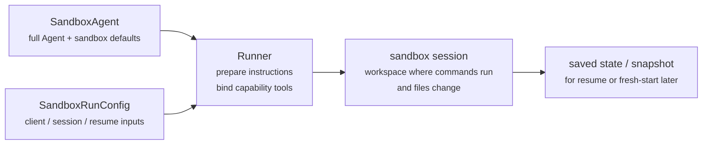
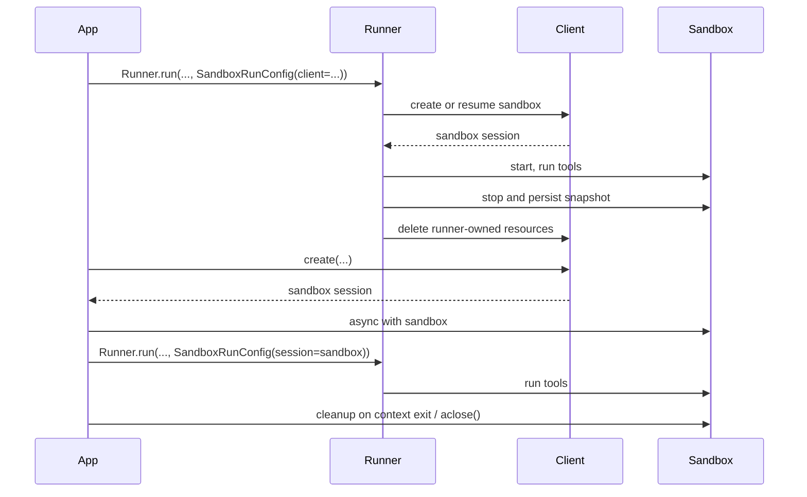

---
search:
  exclude: true
---
# 概念

!!! warning "ベータ機能"

    サンドボックスエージェントはベータ版です。API、デフォルト、対応機能の詳細は一般提供までに変更される可能性があり、今後さらに高度な機能が追加される見込みです。

現代のエージェントは、ファイルシステム上の実ファイルを操作できるときに最も効果を発揮します。**サンドボックスエージェント** は、専用ツールやシェルコマンドを利用して、大規模なドキュメントセットの検索や操作、ファイル編集、成果物の生成、コマンド実行を行えます。サンドボックスは、エージェントがユーザーに代わって作業するために使える永続的なワークスペースをモデルに提供します。Agents SDK のサンドボックスエージェントは、サンドボックス環境と組み合わせたエージェントを簡単に実行できるようにし、適切なファイルをファイルシステム上に用意し、サンドボックスをオーケストレーションして、タスクの開始、停止、再開を大規模に容易にします。

エージェントが必要とするデータを中心にワークスペースを定義します。GitHub リポジトリ、ローカルのファイルやディレクトリ、合成タスクファイル、S3 や Azure Blob Storage などのリモートファイルシステム、その他ユーザーが提供するサンドボックス入力から開始できます。

<div class="sandbox-harness-image" markdown="1">


</div>

`SandboxAgent` は引き続き `Agent` です。`instructions`、`prompt`、`tools`、`handoffs`、`mcp_servers`、`model_settings`、`output_type`、ガードレール、フックなど、通常のエージェントのインターフェイスを保持し、通常の `Runner` API を通じて実行されます。変わるのは実行境界です。

- `SandboxAgent` はエージェント自体を定義します。通常のエージェント設定に加えて、`default_manifest`、`base_instructions`、`run_as` などのサンドボックス固有のデフォルト、およびファイルシステムツール、シェルアクセス、スキル、メモリ、コンパクションなどの機能を含みます。
- `Manifest` は、新しいサンドボックスワークスペースの望ましい初期内容とレイアウトを宣言します。これにはファイル、リポジトリ、マウント、環境が含まれます。
- サンドボックスセッションは、コマンドが実行されファイルが変更される、実行中の隔離環境です。
- [`SandboxRunConfig`][agents.run_config.SandboxRunConfig] は、その実行がサンドボックスセッションをどのように取得するかを決定します。たとえば、直接注入する、シリアライズ済みのサンドボックスセッション状態から再接続する、またはサンドボックスクライアントを通じて新しいサンドボックスセッションを作成する、といった方法です。
- 保存済みのサンドボックス状態とスナップショットにより、後続の実行は以前の作業に再接続したり、保存済み内容から新しいサンドボックスセッションを初期化したりできます。

`Manifest` は新規セッションのワークスペース契約であり、すべての実行中サンドボックスに対する完全な信頼できる情報源ではありません。実行における実効ワークスペースは、再利用されたサンドボックスセッション、シリアライズ済みのサンドボックスセッション状態、または実行時に選択されたスナップショットから来る場合もあります。

このページ全体で、「サンドボックスセッション」とは、サンドボックスクライアントによって管理される実行中の実行環境を意味します。これは [Sessions](../sessions/index.md) で説明されている SDK の会話用 [`Session`][agents.memory.session.Session] インターフェイスとは異なります。

外側のランタイムは引き続き承認、トレーシング、ハンドオフ、再開のブックキーピングを所有します。サンドボックスセッションはコマンド、ファイル変更、環境隔離を所有します。この分割はモデルの中核です。

### 各要素の関係

サンドボックス実行は、エージェント定義と実行ごとのサンドボックス設定を組み合わせます。runner はエージェントを準備し、実行中のサンドボックスセッションにバインドし、後続の実行のために状態を保存できます。



サンドボックス固有のデフォルトは `SandboxAgent` に保持します。実行ごとのサンドボックスセッション選択は `SandboxRunConfig` に保持します。

ライフサイクルは 3 つのフェーズで考えます。

1. `SandboxAgent`、`Manifest`、capabilities を使って、エージェントと新規ワークスペース契約を定義します。
2. サンドボックスセッションを注入、再開、または作成する `SandboxRunConfig` を `Runner` に渡して実行します。
3. runner 管理の `RunState`、明示的なサンドボックス `session_state`、または保存済みワークスペーススナップショットから後で継続します。

シェルアクセスがたまに使う 1 つのツールにすぎない場合は、[ツールガイド](../tools.md) のホスト型シェルから始めてください。ワークスペース隔離、サンドボックスクライアントの選択、またはサンドボックスセッションの再開動作が設計の一部である場合は、サンドボックスエージェントを使用してください。

## 使用場面

サンドボックスエージェントは、ワークスペース中心のワークフローに適しています。例:

- コーディングとデバッグ。たとえば、GitHub リポジトリ内の issue レポートに対する自動修正をオーケストレーションし、対象テストを実行する場合
- ドキュメント処理と編集。たとえば、ユーザーの金融文書から情報を抽出し、記入済みの税務フォーム下書きを作成する場合
- ファイルに基づくレビューや分析。たとえば、回答前にオンボーディング資料、生成済みレポート、成果物バンドルを確認する場合
- 隔離されたマルチエージェントパターン。たとえば、各レビュアーまたはコーディング用サブエージェントに独自のワークスペースを与える場合
- 複数ステップのワークスペースタスク。たとえば、ある実行でバグを修正し、後でリグレッションテストを追加する場合、またはスナップショットやサンドボックスセッション状態から再開する場合

ファイルや稼働中のファイルシステムへのアクセスが不要であれば、`Agent` を引き続き使用してください。シェルアクセスがたまに使う機能にすぎない場合はホスト型シェルを追加し、ワークスペース境界そのものが機能の一部である場合はサンドボックスエージェントを使用してください。

## サンドボックスクライアントの選択

ローカル開発には `UnixLocalSandboxClient` から始めてください。コンテナ隔離やイメージの一致が必要になったら `DockerSandboxClient` に移行します。プロバイダー管理の実行が必要になったら、ホスト型プロバイダーに移行します。

多くの場合、`SandboxAgent` 定義は同じままで、サンドボックスクライアントとそのオプションだけが [`SandboxRunConfig`][agents.run_config.SandboxRunConfig] で変わります。ローカル、Docker、ホスト型、リモートマウントのオプションについては [サンドボックスクライアント](clients.md) を参照してください。

## 主要要素

<div class="sandbox-nowrap-first-column-table" markdown="1">

| レイヤー | 主な SDK 要素 | 答える内容 |
| --- | --- | --- |
| エージェント定義 | `SandboxAgent`、`Manifest`、capabilities | どのエージェントを実行し、新規セッションのワークスペース契約は何から開始すべきですか? |
| サンドボックス実行 | `SandboxRunConfig`、サンドボックスクライアント、実行中のサンドボックスセッション | この実行はどのように実行中のサンドボックスセッションを取得し、作業はどこで実行されますか? |
| 保存済みサンドボックス状態 | `RunState` サンドボックスペイロード、`session_state`、スナップショット | このワークフローは以前のサンドボックス作業にどう再接続するか、または保存済み内容から新しいサンドボックスセッションをどう初期化しますか? |

</div>

主な SDK 要素は、次のようにこれらのレイヤーに対応します。

<div class="sandbox-nowrap-first-column-table" markdown="1">

| 要素 | 所有するもの | 問うべき質問 |
| --- | --- | --- |
| [`SandboxAgent`][agents.sandbox.sandbox_agent.SandboxAgent] | エージェント定義 | このエージェントは何を行うべきで、どのデフォルトを一緒に持たせるべきですか? |
| [`Manifest`][agents.sandbox.manifest.Manifest] | 新規セッションのワークスペースファイルとフォルダー | 実行開始時にファイルシステム上にどのファイルとフォルダーが存在すべきですか? |
| [`Capability`][agents.sandbox.capabilities.capability.Capability] | サンドボックスネイティブの動作 | どのツール、instruction 断片、またはランタイム動作をこのエージェントに付与すべきですか? |
| [`SandboxRunConfig`][agents.run_config.SandboxRunConfig] | 実行ごとのサンドボックスクライアントとサンドボックスセッションのソース | この実行はサンドボックスセッションを注入、再開、または作成すべきですか? |
| [`RunState`][agents.run_state.RunState] | runner 管理の保存済みサンドボックス状態 | 以前の runner 管理ワークフローを再開し、そのサンドボックス状態を自動的に引き継いでいますか? |
| [`SandboxRunConfig.session_state`][agents.run_config.SandboxRunConfig.session_state] | 明示的にシリアライズされたサンドボックスセッション状態 | `RunState` の外部で既にシリアライズしたサンドボックス状態から再開したいですか? |
| [`SandboxRunConfig.snapshot`][agents.run_config.SandboxRunConfig.snapshot] | 新規サンドボックスセッション用の保存済みワークスペース内容 | 新しいサンドボックスセッションを保存済みファイルや成果物から開始すべきですか? |

</div>

実践的な設計順序は次のとおりです。

1. `Manifest` で新規セッションのワークスペース契約を定義します。
2. `SandboxAgent` でエージェントを定義します。
3. 組み込みまたはカスタム capabilities を追加します。
4. 各実行が `RunConfig(sandbox=SandboxRunConfig(...))` でサンドボックスセッションをどう取得すべきかを決定します。

## サンドボックス実行の準備

実行時、runner はその定義を具体的なサンドボックス対応実行に変換します。

1. `SandboxRunConfig` からサンドボックスセッションを解決します。
   `session=...` を渡した場合、その実行中のサンドボックスセッションを再利用します。
   それ以外の場合は、`client=...` を使って作成または再開します。
2. 実行に対する実効ワークスペース入力を決定します。
   実行がサンドボックスセッションを注入または再開する場合、その既存のサンドボックス状態が優先されます。
   それ以外の場合、runner は一時的な manifest オーバーライドまたは `agent.default_manifest` から開始します。
   このため、`Manifest` だけではすべての実行について最終的な実行中ワークスペースは定義されません。
3. capabilities に結果の manifest を処理させます。
   これにより capabilities は、最終的なエージェントが準備される前に、ファイル、マウント、またはその他のワークスペーススコープの動作を追加できます。
4. 固定順序で最終的な instructions を構築します。
   SDK のデフォルトサンドボックスプロンプト、または明示的に上書きした場合は `base_instructions`、次に `instructions`、次に capability の instruction 断片、次にリモートマウントポリシーテキスト、最後にレンダリングされたファイルシステムツリーです。
5. capability ツールを実行中のサンドボックスセッションにバインドし、準備済みエージェントを通常の `Runner` API を通じて実行します。

サンドボックス化しても、ターンの意味は変わりません。ターンは引き続きモデルのステップであり、単一のシェルコマンドやサンドボックスアクションではありません。サンドボックス側の操作とターンの間に固定の 1:1 対応はありません。一部の作業はサンドボックス実行レイヤー内に留まり、別のアクションはツール結果、承認、または別のモデルステップを必要とするその他の状態を返す場合があります。実践上のルールとして、サンドボックス作業が発生した後にエージェントランタイムが別のモデル応答を必要とする場合にのみ、別のターンが消費されます。

これらの準備ステップにより、`SandboxAgent` を設計するときに考慮すべき主なサンドボックス固有オプションは、`default_manifest`、`instructions`、`base_instructions`、`capabilities`、`run_as` になります。

## `SandboxAgent` オプション

これらは通常の `Agent` フィールドに加わる、サンドボックス固有のオプションです。

<div class="sandbox-nowrap-first-column-table" markdown="1">

| オプション | 最適な用途 |
| --- | --- |
| `default_manifest` | runner が作成する新規サンドボックスセッションのデフォルトワークスペース。 |
| `instructions` | SDK サンドボックスプロンプトの後に追加されるロール、ワークフロー、成功基準。 |
| `base_instructions` | SDK サンドボックスプロンプトを置き換える高度な脱出口。 |
| `capabilities` | このエージェントと一緒に持たせるべきサンドボックスネイティブのツールと動作。 |
| `run_as` | シェルコマンド、ファイル読み取り、パッチなど、モデル向けサンドボックスツールのユーザー ID。 |

</div>

サンドボックスクライアントの選択、サンドボックスセッションの再利用、manifest オーバーライド、スナップショット選択は、エージェントではなく [`SandboxRunConfig`][agents.run_config.SandboxRunConfig] に属します。

### `default_manifest`

`default_manifest` は、このエージェント用に runner が新しいサンドボックスセッションを作成するときに使うデフォルトの [`Manifest`][agents.sandbox.manifest.Manifest] です。エージェントが通常開始すべきファイル、リポジトリ、ヘルパー資料、出力ディレクトリ、マウントに使用します。

これはデフォルトにすぎません。実行は `SandboxRunConfig(manifest=...)` で上書きでき、再利用または再開されたサンドボックスセッションは既存のワークスペース状態を保持します。

### `instructions` と `base_instructions`

異なるプロンプトでも維持すべき短いルールには `instructions` を使用します。`SandboxAgent` では、これらの instructions は SDK のサンドボックスベースプロンプトの後に追加されるため、組み込みのサンドボックスガイダンスを維持しつつ、独自のロール、ワークフロー、成功基準を追加できます。

`base_instructions` は、SDK サンドボックスベースプロンプトを置き換えたい場合にのみ使用してください。ほとんどのエージェントでは設定すべきではありません。

<div class="sandbox-nowrap-first-column-table" markdown="1">

| 入れる場所 | 用途 | 例 |
| --- | --- | --- |
| `instructions` | エージェントの安定したロール、ワークフロールール、成功基準。 | 「オンボーディング文書を検査してからハンドオフしてください。」、「最終ファイルを `output/` に書き込んでください。」 |
| `base_instructions` | SDK サンドボックスベースプロンプトの完全な置き換え。 | カスタムの低レベルサンドボックスラッパープロンプト。 |
| ユーザープロンプト | この実行の一回限りのリクエスト。 | 「このワークスペースを要約してください。」 |
| manifest 内のワークスペースファイル | 長めのタスク仕様、リポジトリローカルの instructions、または範囲限定の参考資料。 | `repo/task.md`、ドキュメントバンドル、サンプルパケット。 |

</div>

`instructions` の良い用途には次があります。

- [examples/sandbox/unix_local_pty.py](https://github.com/openai/openai-agents-python/blob/main/examples/sandbox/unix_local_pty.py) は、PTY 状態が重要な場合にエージェントを 1 つのインタラクティブプロセス内に保ちます。
- [examples/sandbox/handoffs.py](https://github.com/openai/openai-agents-python/blob/main/examples/sandbox/handoffs.py) は、サンドボックスレビュアーが検査後にユーザーへ直接回答することを禁止します。
- [examples/sandbox/tax_prep.py](https://github.com/openai/openai-agents-python/blob/main/examples/sandbox/tax_prep.py) は、最終的に記入されたファイルが実際に `output/` に置かれることを要求します。
- [examples/sandbox/docs/coding_task.py](https://github.com/openai/openai-agents-python/blob/main/examples/sandbox/docs/coding_task.py) は、正確な検証コマンドを固定し、ワークスペースルート相対のパッチパスを明確にします。

ユーザーの一回限りのタスクを `instructions` にコピーすること、manifest に属する長い参考資料を埋め込むこと、組み込み capabilities がすでに注入するツールドキュメントを言い直すこと、または実行時にモデルが必要としないローカルインストールメモを混在させることは避けてください。

`instructions` を省略しても、SDK はデフォルトのサンドボックスプロンプトを含めます。これは低レベルラッパーには十分ですが、ほとんどのユーザー向けエージェントでは明示的な `instructions` を提供すべきです。

### `capabilities`

Capabilities はサンドボックスネイティブの動作を `SandboxAgent` に付与します。実行開始前にワークスペースを形作り、サンドボックス固有の instructions を追加し、実行中のサンドボックスセッションにバインドされるツールを公開し、そのエージェントのモデル動作や入力処理を調整できます。

組み込み capabilities には次が含まれます。

<div class="sandbox-nowrap-first-column-table" markdown="1">

| Capability | 追加する場合 | 注記 |
| --- | --- | --- |
| `Shell` | エージェントがシェルアクセスを必要とする場合。 | `exec_command` を追加し、サンドボックスクライアントが PTY 対話をサポートする場合は `write_stdin` も追加します。 |
| `Filesystem` | エージェントがファイル編集やローカル画像の検査を必要とする場合。 | `apply_patch` と `view_image` を追加します。パッチパスはワークスペースルート相対です。 |
| `Skills` | サンドボックス内でスキルの発見と具現化を行いたい場合。 | `.agents` または `.agents/skills` を手動でマウントするより、こちらを優先してください。`Skills` はスキルをインデックス化し、サンドボックス内に具現化します。 |
| `Memory` | 後続の実行がメモリ成果物を読み取る、または生成すべき場合。 | `Shell` が必要です。ライブ更新には `Filesystem` も必要です。 |
| `Compaction` | 長時間実行フローで、コンパクションアイテム後のコンテキスト削減が必要な場合。 | モデルサンプリングと入力処理を調整します。 |

</div>

デフォルトでは、`SandboxAgent.capabilities` は `Capabilities.default()` を使用します。これには `Filesystem()`、`Shell()`、`Compaction()` が含まれます。`capabilities=[...]` を渡した場合、そのリストがデフォルトを置き換えるため、引き続き必要なデフォルト capabilities を含めてください。

スキルについては、どのように具現化したいかに基づいてソースを選びます。

- `Skills(lazy_from=LocalDirLazySkillSource(...))` は、モデルが最初にインデックスを発見し、必要なものだけをロードできるため、大きめのローカルスキルディレクトリに適したデフォルトです。
- `LocalDirLazySkillSource(source=LocalDir(src=...))` は、SDK プロセスが実行されているファイルシステムから読み取ります。サンドボックスイメージやワークスペース内にしか存在しないパスではなく、元のホスト側スキルディレクトリを渡してください。
- `Skills(from_=LocalDir(src=...))` は、事前にステージングしたい小さなローカルバンドルに適しています。
- `Skills(from_=GitRepo(repo=..., ref=...))` は、スキル自体をリポジトリから取得すべき場合に適しています。

`LocalDir.src` は SDK ホスト上のソースパスです。`skills_path` は、`load_skill` が呼び出されたときにスキルがステージングされる、サンドボックスワークスペース内の相対宛先パスです。

スキルがすでに `.agents/skills/<name>/SKILL.md` のような場所にディスク上で存在する場合は、そのソースルートを `LocalDir(...)` に指定し、引き続き `Skills(...)` を使って公開してください。既存のワークスペース契約が別のサンドボックス内レイアウトに依存していない限り、デフォルトの `skills_path=".agents"` を維持してください。

適合する場合は組み込み capabilities を優先してください。組み込みでカバーされないサンドボックス固有ツールや instruction インターフェイスが必要な場合にのみ、カスタム capability を作成してください。

## 概念

### Manifest

[`Manifest`][agents.sandbox.manifest.Manifest] は、新規サンドボックスセッションのワークスペースを記述します。ワークスペース `root` の設定、ファイルやディレクトリの宣言、ローカルファイルのコピー、Git リポジトリのクローン、リモートストレージマウントのアタッチ、環境変数の設定、ユーザーやグループの定義、ワークスペース外の特定の絶対パスへのアクセス付与が可能です。

Manifest エントリのパスはワークスペース相対です。絶対パスにしたり、`..` でワークスペースを抜けたりすることはできません。これにより、ワークスペース契約はローカル、Docker、ホスト型クライアントの間でポータブルになります。

作業開始前にエージェントが必要とする材料には manifest エントリを使用します。

<div class="sandbox-nowrap-first-column-table" markdown="1">

| Manifest エントリ | 用途 |
| --- | --- |
| `File`、`Dir` | 小さな合成入力、ヘルパーファイル、または出力ディレクトリ。 |
| `LocalFile`、`LocalDir` | サンドボックスに具現化すべきホストファイルまたはディレクトリ。 |
| `GitRepo` | ワークスペースに取得すべきリポジトリ。 |
| `S3Mount`、`GCSMount`、`R2Mount`、`AzureBlobMount`、`BoxMount`、`S3FilesMount` などのマウント | サンドボックス内に表示すべき外部ストレージ。 |

</div>

`Dir` は合成の子要素から、または出力場所として、サンドボックスワークスペース内にディレクトリを作成します。ホストファイルシステムから読み取りません。既存のホストディレクトリをサンドボックスワークスペースにコピーすべき場合は `LocalDir` を使用してください。

`LocalFile.src` と `LocalDir.src` は、デフォルトでは SDK プロセスの作業ディレクトリを基準に解決されます。ソースは `extra_path_grants` でカバーされていない限り、そのベースディレクトリの下に留まる必要があります。これにより、ローカルソースの具現化は、サンドボックス manifest の他の部分と同じホストパス信頼境界内に保たれます。

マウントエントリは公開するストレージを記述し、マウント戦略はサンドボックスバックエンドがそのストレージをどのようにアタッチするかを記述します。マウントオプションとプロバイダーサポートについては、[サンドボックスクライアント](clients.md#mounts-and-remote-storage) を参照してください。

優れた manifest 設計では通常、ワークスペース契約を狭く保ち、長いタスク手順を `repo/task.md` のようなワークスペースファイルに置き、instructions では `repo/task.md` や `output/report.md` のような相対ワークスペースパスを使用します。エージェントが `Filesystem` capability の `apply_patch` ツールでファイルを編集する場合、パッチパスはシェルの `workdir` ではなく、サンドボックスワークスペースルートからの相対であることを忘れないでください。

`extra_path_grants` は、エージェントがワークスペース外の具体的な絶対パスを必要とする場合、または manifest が SDK プロセスの作業ディレクトリ外にある信頼済みローカルソースをコピーする必要がある場合にのみ使用してください。例として、一時的なツール出力用の `/tmp`、読み取り専用ランタイム用の `/opt/toolchain`、またはサンドボックスに具現化すべき生成済みスキルディレクトリがあります。grant は、ローカルソースの具現化、SDK ファイル API、およびバックエンドがファイルシステムポリシーを強制できる場合のシェル実行に適用されます。

```python
from agents.sandbox import Manifest, SandboxPathGrant

manifest = Manifest(
    extra_path_grants=(
        SandboxPathGrant(path="/tmp"),
        SandboxPathGrant(path="/opt/toolchain", read_only=True),
    ),
)
```

`extra_path_grants` を含む manifests は、信頼済み設定として扱ってください。アプリケーションがそれらのホストパスをすでに承認していない限り、モデル出力やその他の信頼できないペイロードから grant を読み込まないでください。

スナップショットと `persist_workspace()` は、引き続きワークスペースルートのみを含みます。追加で grant されたパスはランタイムアクセスであり、永続的なワークスペース状態ではありません。

### Permissions

`Permissions` は manifest エントリのファイルシステム権限を制御します。これはサンドボックスが具現化するファイルに関するものであり、モデル権限、承認ポリシー、API 認証情報に関するものではありません。

デフォルトでは、manifest エントリは owner が読み取り/書き込み/実行可能で、group と others が読み取り/実行可能です。ステージングされたファイルをプライベート、読み取り専用、または実行可能にすべき場合は上書きしてください。

```python
from agents.sandbox import FileMode, Permissions
from agents.sandbox.entries import File

private_notes = File(
    text="internal notes",
    permissions=Permissions(
        owner=FileMode.READ | FileMode.WRITE,
        group=FileMode.NONE,
        other=FileMode.NONE,
    ),
)
```

`Permissions` は owner、group、other のビットと、そのエントリがディレクトリかどうかを別々に保持します。直接構築することも、`Permissions.from_str(...)` でモード文字列から解析することも、`Permissions.from_mode(...)` で OS モードから導出することもできます。

ユーザーは作業を実行できるサンドボックス ID です。その ID をサンドボックス内に存在させたい場合は manifest に `User` を追加し、シェルコマンド、ファイル読み取り、パッチなどのモデル向けサンドボックスツールをそのユーザーとして実行すべき場合は `SandboxAgent.run_as` を設定します。`run_as` が manifest にまだ存在しないユーザーを指している場合、runner が実効 manifest にそのユーザーを追加します。

```python
from agents import Runner
from agents.run import RunConfig
from agents.sandbox import FileMode, Manifest, Permissions, SandboxAgent, SandboxRunConfig, User
from agents.sandbox.entries import Dir, LocalDir
from agents.sandbox.sandboxes.unix_local import UnixLocalSandboxClient

analyst = User(name="analyst")

agent = SandboxAgent(
    name="Dataroom analyst",
    instructions="Review the files in `dataroom/` and write findings to `output/`.",
    default_manifest=Manifest(
        # Declare the sandbox user so manifest entries can grant access to it.
        users=[analyst],
        entries={
            "dataroom": LocalDir(
                src="./dataroom",
                # Let the analyst traverse and read the mounted dataroom, but not edit it.
                group=analyst,
                permissions=Permissions(
                    owner=FileMode.READ | FileMode.EXEC,
                    group=FileMode.READ | FileMode.EXEC,
                    other=FileMode.NONE,
                ),
            ),
            "output": Dir(
                # Give the analyst a writable scratch/output directory for artifacts.
                group=analyst,
                permissions=Permissions(
                    owner=FileMode.ALL,
                    group=FileMode.ALL,
                    other=FileMode.NONE,
                ),
            ),
        },
    ),
    # Run model-facing sandbox actions as this user, so those permissions apply.
    run_as=analyst,
)

result = await Runner.run(
    agent,
    "Summarize the contracts and call out renewal dates.",
    run_config=RunConfig(
        sandbox=SandboxRunConfig(client=UnixLocalSandboxClient()),
    ),
)
```

ファイルレベルの共有ルールも必要な場合は、ユーザーと manifest グループおよびエントリの `group` メタデータを組み合わせてください。`run_as` ユーザーはサンドボックスネイティブアクションを誰が実行するかを制御し、`Permissions` はサンドボックスがワークスペースを具現化した後、そのユーザーがどのファイルを読み取り、書き込み、または実行できるかを制御します。

### SnapshotSpec

`SnapshotSpec` は、新しいサンドボックスセッションが保存済みワークスペース内容をどこから復元し、どこへ永続化するかを指定します。これはサンドボックスワークスペースのスナップショットポリシーであり、`session_state` は特定のサンドボックスバックエンドを再開するためのシリアライズ済み接続状態です。

ローカルの永続スナップショットには `LocalSnapshotSpec` を使用し、アプリがリモートスナップショットクライアントを提供する場合は `RemoteSnapshotSpec` を使用します。ローカルスナップショットのセットアップが利用できない場合はフォールバックとして no-op スナップショットが使用され、高度な呼び出し元はワークスペーススナップショットの永続化を望まない場合に明示的に使用できます。

```python
from pathlib import Path

from agents.run import RunConfig
from agents.sandbox import LocalSnapshotSpec, SandboxRunConfig
from agents.sandbox.sandboxes.unix_local import UnixLocalSandboxClient

run_config = RunConfig(
    sandbox=SandboxRunConfig(
        client=UnixLocalSandboxClient(),
        snapshot=LocalSnapshotSpec(base_path=Path("/tmp/my-sandbox-snapshots")),
    )
)
```

runner が新しいサンドボックスセッションを作成するとき、サンドボックスクライアントはそのセッション用のスナップショットインスタンスを構築します。開始時にスナップショットが復元可能であれば、実行が続行する前にサンドボックスは保存済みワークスペース内容を復元します。クリーンアップ時には、runner 所有のサンドボックスセッションがワークスペースをアーカイブし、スナップショットを通じて永続化します。

`snapshot` を省略すると、ランタイムは可能な場合にデフォルトのローカルスナップショット場所を使用しようとします。それをセットアップできない場合、no-op スナップショットにフォールバックします。マウントされたパスとエフェメラルなパスは、永続的なワークスペース内容としてスナップショットにコピーされません。

### サンドボックスのライフサイクル

ライフサイクルモードは **SDK 所有** と **開発者所有** の 2 つです。

<div class="sandbox-lifecycle-diagram" markdown="1">



</div>

サンドボックスが 1 回の実行だけで存在すればよい場合は、SDK 所有のライフサイクルを使用します。`client`、任意の `manifest`、任意の `snapshot`、およびクライアント `options` を渡します。runner はサンドボックスを作成または再開し、開始し、エージェントを実行し、スナップショット対応ワークスペース状態を永続化し、サンドボックスをシャットダウンし、クライアントに runner 所有リソースのクリーンアップを任せます。

```python
result = await Runner.run(
    agent,
    "Inspect the workspace and summarize what changed.",
    run_config=RunConfig(
        sandbox=SandboxRunConfig(client=UnixLocalSandboxClient()),
    ),
)
```

サンドボックスを事前に作成したい場合、1 つの実行中サンドボックスを複数実行で再利用したい場合、実行後にファイルを検査したい場合、自分で作成したサンドボックス上でストリーミングしたい場合、またはクリーンアップのタイミングを正確に決めたい場合は、開発者所有のライフサイクルを使用します。`session=...` を渡すと、runner はその実行中サンドボックスを使用しますが、代わりに閉じることはありません。

```python
sandbox = await client.create(manifest=agent.default_manifest)

async with sandbox:
    run_config = RunConfig(sandbox=SandboxRunConfig(session=sandbox))
    await Runner.run(agent, "Analyze the files.", run_config=run_config)
    await Runner.run(agent, "Write the final report.", run_config=run_config)
```

通常はコンテキストマネージャーの形を使います。エントリ時にサンドボックスを開始し、終了時にセッションのクリーンアップライフサイクルを実行します。アプリでコンテキストマネージャーを使えない場合は、ライフサイクルメソッドを直接呼び出してください。

```python
sandbox = await client.create(
    manifest=agent.default_manifest,
    snapshot=LocalSnapshotSpec(base_path=Path("/tmp/my-sandbox-snapshots")),
)
try:
    await sandbox.start()
    await Runner.run(
        agent,
        "Analyze the files.",
        run_config=RunConfig(sandbox=SandboxRunConfig(session=sandbox)),
    )
    # Persist a checkpoint of the live workspace before doing more work.
    # `aclose()` also calls `stop()`, so this is only needed for an explicit mid-lifecycle save.
    await sandbox.stop()
finally:
    await sandbox.aclose()
```

`stop()` はスナップショット対応ワークスペース内容のみを永続化します。サンドボックスを破棄するわけではありません。`aclose()` は完全なセッションクリーンアップ経路です。停止前フックを実行し、`stop()` を呼び出し、サンドボックスリソースをシャットダウンし、セッションスコープの依存関係を閉じます。

## `SandboxRunConfig` オプション

[`SandboxRunConfig`][agents.run_config.SandboxRunConfig] は、サンドボックスセッションの取得元と、新規セッションの初期化方法を決定する実行ごとのオプションを保持します。

### サンドボックスソース

これらのオプションは、runner がサンドボックスセッションを再利用、再開、または作成すべきかを決定します。

<div class="sandbox-nowrap-first-column-table" markdown="1">

| オプション | 使用する場合 | 注記 |
| --- | --- | --- |
| `client` | runner にサンドボックスセッションの作成、再開、クリーンアップを任せたい場合。 | 実行中のサンドボックス `session` を提供しない限り必須です。 |
| `session` | 実行中のサンドボックスセッションを自分ですでに作成している場合。 | 呼び出し元がライフサイクルを所有します。runner はその実行中サンドボックスセッションを再利用します。 |
| `session_state` | シリアライズ済みサンドボックスセッション状態はあるが、実行中のサンドボックスセッションオブジェクトはない場合。 | `client` が必要です。runner はその明示的な状態から所有セッションとして再開します。 |

</div>

実際には、runner は次の順序でサンドボックスセッションを解決します。

1. `run_config.sandbox.session` を注入した場合、その実行中サンドボックスセッションが直接再利用されます。
2. それ以外で、実行が `RunState` から再開している場合、保存済みのサンドボックスセッション状態が再開されます。
3. それ以外で、`run_config.sandbox.session_state` を渡した場合、runner はその明示的なシリアライズ済みサンドボックスセッション状態から再開します。
4. それ以外の場合、runner は新しいサンドボックスセッションを作成します。その新規セッションでは、提供されていれば `run_config.sandbox.manifest` を使用し、なければ `agent.default_manifest` を使用します。

### 新規セッション入力

これらのオプションは、runner が新しいサンドボックスセッションを作成する場合にのみ意味があります。

<div class="sandbox-nowrap-first-column-table" markdown="1">

| オプション | 使用する場合 | 注記 |
| --- | --- | --- |
| `manifest` | 一回限りの新規セッションワークスペース上書きを行いたい場合。 | 省略時は `agent.default_manifest` にフォールバックします。 |
| `snapshot` | 新しいサンドボックスセッションをスナップショットから初期化すべき場合。 | 再開に近いフローやリモートスナップショットクライアントに便利です。 |
| `options` | サンドボックスクライアントが作成時オプションを必要とする場合。 | Docker イメージ、Modal アプリ名、E2B テンプレート、タイムアウト、同様のクライアント固有設定で一般的です。 |

</div>

### 具現化制御

`concurrency_limits` は、サンドボックス具現化作業をどの程度並列で実行できるかを制御します。大きな manifests やローカルディレクトリコピーに、より厳密なリソース制御が必要な場合は `SandboxConcurrencyLimits(manifest_entries=..., local_dir_files=...)` を使用します。特定の制限を無効にするには、どちらかの値を `None` に設定します。

覚えておく価値がある含意がいくつかあります。

- 新規セッション: `manifest=` と `snapshot=` は、runner が新しいサンドボックスセッションを作成する場合にのみ適用されます。
- 再開とスナップショット: `session_state=` は以前にシリアライズされたサンドボックス状態へ再接続し、`snapshot=` は保存済みワークスペース内容から新しいサンドボックスセッションを初期化します。
- クライアント固有オプション: `options=` はサンドボックスクライアントに依存します。Docker と多くのホスト型クライアントでは必要です。
- 注入された実行中セッション: 実行中のサンドボックス `session` を渡した場合、capability 主導の manifest 更新は互換性のある非マウントエントリを追加できます。`manifest.root`、`manifest.environment`、`manifest.users`、`manifest.groups` の変更、既存エントリの削除、エントリ型の置換、マウントエントリの追加または変更はできません。
- Runner API: `SandboxAgent` の実行は、引き続き通常の `Runner.run()`、`Runner.run_sync()`、`Runner.run_streamed()` API を使用します。

## 完全な例: コーディングタスク

このコーディング形式の例は、優れたデフォルトの出発点です。

```python
import asyncio
from pathlib import Path

from agents import ModelSettings, Runner
from agents.run import RunConfig
from agents.sandbox import Manifest, SandboxAgent, SandboxRunConfig
from agents.sandbox.capabilities import (
    Capabilities,
    LocalDirLazySkillSource,
    Skills,
)
from agents.sandbox.entries import LocalDir
from agents.sandbox.sandboxes.unix_local import UnixLocalSandboxClient

EXAMPLE_DIR = Path(__file__).resolve().parent
HOST_REPO_DIR = EXAMPLE_DIR / "repo"
HOST_SKILLS_DIR = EXAMPLE_DIR / "skills"
TARGET_TEST_CMD = "sh tests/test_credit_note.sh"


def build_agent(model: str) -> SandboxAgent[None]:
    return SandboxAgent(
        name="Sandbox engineer",
        model=model,
        instructions=(
            "Inspect the repo, make the smallest correct change, run the most relevant checks, "
            "and summarize the file changes and risks. "
            "Read `repo/task.md` before editing files. Stay grounded in the repository, preserve "
            "existing behavior, and mention the exact verification command you ran. "
            "Use the `$credit-note-fixer` skill before editing files. If the repo lives under "
            "`repo/`, remember that `apply_patch` paths stay relative to the sandbox workspace "
            "root, so edits still target `repo/...`."
        ),
        # Put repos and task files in the manifest.
        default_manifest=Manifest(
            entries={
                "repo": LocalDir(src=HOST_REPO_DIR),
            }
        ),
        capabilities=Capabilities.default() + [
            Skills(
                lazy_from=LocalDirLazySkillSource(
                    # This is a host path read by the SDK process.
                    # Requested skills are copied into `skills_path` in the sandbox.
                    source=LocalDir(src=HOST_SKILLS_DIR),
                )
            ),
        ],
        model_settings=ModelSettings(tool_choice="required"),
    )


async def main(model: str, prompt: str) -> None:
    result = await Runner.run(
        build_agent(model),
        prompt,
        run_config=RunConfig(
            sandbox=SandboxRunConfig(client=UnixLocalSandboxClient()),
            workflow_name="Sandbox coding example",
        ),
    )
    print(result.final_output)


if __name__ == "__main__":
    asyncio.run(
        main(
            model="gpt-5.5",
            prompt=(
                "Open `repo/task.md`, use the `$credit-note-fixer` skill, fix the bug, "
                f"run `{TARGET_TEST_CMD}`, and summarize the change."
            ),
        )
    )
```

[examples/sandbox/docs/coding_task.py](https://github.com/openai/openai-agents-python/blob/main/examples/sandbox/docs/coding_task.py) を参照してください。これは小さなシェルベースのリポジトリを使用しているため、Unix ローカル実行間で決定論的に検証できます。実際のタスクリポジトリはもちろん Python、JavaScript、その他何でも構いません。

## 一般的なパターン

上記の完全な例から始めてください。多くの場合、同じ `SandboxAgent` をそのまま維持し、サンドボックスクライアント、サンドボックスセッションソース、またはワークスペースソースだけを変更できます。

### サンドボックスクライアントの切り替え

エージェント定義は同じに保ち、実行設定だけを変更します。コンテナ隔離やイメージの一致が必要な場合は Docker を使用し、プロバイダー管理の実行が必要な場合はホスト型プロバイダーを使用します。例とプロバイダーオプションについては [サンドボックスクライアント](clients.md) を参照してください。

### ワークスペースの上書き

エージェント定義は同じに保ち、新規セッションの manifest だけを入れ替えます。

```python
from agents.run import RunConfig
from agents.sandbox import Manifest, SandboxRunConfig
from agents.sandbox.entries import GitRepo
from agents.sandbox.sandboxes.unix_local import UnixLocalSandboxClient

run_config = RunConfig(
    sandbox=SandboxRunConfig(
        client=UnixLocalSandboxClient(),
        manifest=Manifest(
            entries={
                "repo": GitRepo(repo="openai/openai-agents-python", ref="main"),
            }
        ),
    ),
)
```

同じエージェントロールを、エージェントを再構築せずに異なるリポジトリ、パケット、またはタスクバンドルに対して実行すべき場合に使用します。上記の検証済みコーディング例では、一回限りの上書きではなく `default_manifest` で同じパターンを示しています。

### サンドボックスセッションの注入

明示的なライフサイクル制御、実行後の検査、または出力コピーが必要な場合は、実行中のサンドボックスセッションを注入します。

```python
from agents import Runner
from agents.run import RunConfig
from agents.sandbox import SandboxRunConfig
from agents.sandbox.sandboxes.unix_local import UnixLocalSandboxClient

client = UnixLocalSandboxClient()
sandbox = await client.create(manifest=agent.default_manifest)

async with sandbox:
    result = await Runner.run(
        agent,
        prompt,
        run_config=RunConfig(
            sandbox=SandboxRunConfig(session=sandbox),
        ),
    )
```

実行後にワークスペースを検査したい場合、またはすでに開始されたサンドボックスセッション上でストリーミングしたい場合に使用します。[examples/sandbox/docs/coding_task.py](https://github.com/openai/openai-agents-python/blob/main/examples/sandbox/docs/coding_task.py) と [examples/sandbox/docker/docker_runner.py](https://github.com/openai/openai-agents-python/blob/main/examples/sandbox/docker/docker_runner.py) を参照してください。

### セッション状態からの再開

`RunState` の外部でサンドボックス状態をすでにシリアライズしている場合は、runner にその状態から再接続させます。

```python
from agents.run import RunConfig
from agents.sandbox import SandboxRunConfig

serialized = load_saved_payload()
restored_state = client.deserialize_session_state(serialized)

run_config = RunConfig(
    sandbox=SandboxRunConfig(
        client=client,
        session_state=restored_state,
    ),
)
```

サンドボックス状態が独自のストレージやジョブシステムにあり、`Runner` にそこから直接再開させたい場合に使用します。シリアライズ/デシリアライズの流れについては [examples/sandbox/extensions/blaxel_runner.py](https://github.com/openai/openai-agents-python/blob/main/examples/sandbox/extensions/blaxel_runner.py) を参照してください。

### スナップショットからの開始

保存済みファイルと成果物から新しいサンドボックスを初期化します。

```python
from pathlib import Path

from agents.run import RunConfig
from agents.sandbox import LocalSnapshotSpec, SandboxRunConfig
from agents.sandbox.sandboxes.unix_local import UnixLocalSandboxClient

run_config = RunConfig(
    sandbox=SandboxRunConfig(
        client=UnixLocalSandboxClient(),
        snapshot=LocalSnapshotSpec(base_path=Path("/tmp/my-sandbox-snapshot")),
    ),
)
```

新規実行を `agent.default_manifest` だけではなく保存済みワークスペース内容から開始すべき場合に使用します。ローカルスナップショットフローについては [examples/sandbox/memory.py](https://github.com/openai/openai-agents-python/blob/main/examples/sandbox/memory.py) を、リモートスナップショットクライアントについては [examples/sandbox/sandbox_agent_with_remote_snapshot.py](https://github.com/openai/openai-agents-python/blob/main/examples/sandbox/sandbox_agent_with_remote_snapshot.py) を参照してください。

### Git からのスキル読み込み

ローカルスキルソースを、リポジトリに基づくものへ入れ替えます。

```python
from agents.sandbox.capabilities import Capabilities, Skills
from agents.sandbox.entries import GitRepo

capabilities = Capabilities.default() + [
    Skills(from_=GitRepo(repo="sdcoffey/tax-prep-skills", ref="main")),
]
```

スキルバンドルに独自のリリース周期がある場合、またはサンドボックス間で共有すべき場合に使用します。[examples/sandbox/tax_prep.py](https://github.com/openai/openai-agents-python/blob/main/examples/sandbox/tax_prep.py) を参照してください。

### ツールとしての公開

ツールエージェントは、独自のサンドボックス境界を持つことも、親実行から実行中のサンドボックスを再利用することもできます。再利用は高速な読み取り専用探索エージェントに便利です。別のサンドボックスを作成、ハイドレート、スナップショットするコストを払わずに、親が使っている正確なワークスペースを検査できます。

```python
from agents import Runner
from agents.run import RunConfig
from agents.sandbox import FileMode, Manifest, Permissions, SandboxAgent, SandboxRunConfig, User
from agents.sandbox.entries import Dir, File
from agents.sandbox.sandboxes.unix_local import UnixLocalSandboxClient

coordinator = User(name="coordinator")
explorer = User(name="explorer")

manifest = Manifest(
    users=[coordinator, explorer],
    entries={
        "pricing_packet": Dir(
            group=coordinator,
            permissions=Permissions(
                owner=FileMode.ALL,
                group=FileMode.ALL,
                other=FileMode.READ | FileMode.EXEC,
                directory=True,
            ),
            children={
                "pricing.md": File(
                    content=b"Pricing packet contents...",
                    group=coordinator,
                    permissions=Permissions(
                        owner=FileMode.ALL,
                        group=FileMode.ALL,
                        other=FileMode.READ,
                    ),
                ),
            },
        ),
        "work": Dir(
            group=coordinator,
            permissions=Permissions(
                owner=FileMode.ALL,
                group=FileMode.ALL,
                other=FileMode.NONE,
                directory=True,
            ),
        ),
    },
)

pricing_explorer = SandboxAgent(
    name="Pricing Explorer",
    instructions="Read `pricing_packet/` and summarize commercial risk. Do not edit files.",
    run_as=explorer,
)

client = UnixLocalSandboxClient()
sandbox = await client.create(manifest=manifest)

async with sandbox:
    shared_run_config = RunConfig(
        sandbox=SandboxRunConfig(session=sandbox),
    )

    orchestrator = SandboxAgent(
        name="Revenue Operations Coordinator",
        instructions="Coordinate the review and write final notes to `work/`.",
        run_as=coordinator,
        tools=[
            pricing_explorer.as_tool(
                tool_name="review_pricing_packet",
                tool_description="Inspect the pricing packet and summarize commercial risk.",
                run_config=shared_run_config,
                max_turns=2,
            ),
        ],
    )

    result = await Runner.run(
        orchestrator,
        "Review the pricing packet, then write final notes to `work/summary.md`.",
        run_config=shared_run_config,
    )
```

ここでは親エージェントが `coordinator` として実行され、explorer ツールエージェントが同じ実行中サンドボックスセッション内で `explorer` として実行されます。`pricing_packet/` エントリは `other` ユーザーが読み取れるため、explorer はすばやく検査できますが、書き込みビットは持ちません。`work/` ディレクトリは coordinator のユーザー/グループだけが利用できるため、親は最終成果物を書き込み、explorer は読み取り専用のままでいられます。

ツールエージェントに本当の隔離が必要な場合は、独自のサンドボックス `RunConfig` を与えます。

```python
from docker import from_env as docker_from_env

from agents.run import RunConfig
from agents.sandbox import SandboxRunConfig
from agents.sandbox.sandboxes.docker import DockerSandboxClient, DockerSandboxClientOptions

rollout_agent.as_tool(
    tool_name="review_rollout_risk",
    tool_description="Inspect the rollout packet and summarize implementation risk.",
    run_config=RunConfig(
        sandbox=SandboxRunConfig(
            client=DockerSandboxClient(docker_from_env()),
            options=DockerSandboxClientOptions(image="python:3.14-slim"),
        ),
    ),
)
```

ツールエージェントが自由に変更する、信頼できないコマンドを実行する、または異なるバックエンド/イメージを使用すべき場合は、別のサンドボックスを使用します。[examples/sandbox/sandbox_agents_as_tools.py](https://github.com/openai/openai-agents-python/blob/main/examples/sandbox/sandbox_agents_as_tools.py) を参照してください。

### ローカルツールと MCP との組み合わせ

同じエージェントで通常のツールを引き続き使用しながら、サンドボックスワークスペースを維持します。

```python
from agents.sandbox import SandboxAgent
from agents.sandbox.capabilities import Shell

agent = SandboxAgent(
    name="Workspace reviewer",
    instructions="Inspect the workspace and call host tools when needed.",
    tools=[get_discount_approval_path],
    mcp_servers=[server],
    capabilities=[Shell()],
)
```

ワークスペース検査がエージェントの仕事の一部にすぎない場合に使用します。[examples/sandbox/sandbox_agent_with_tools.py](https://github.com/openai/openai-agents-python/blob/main/examples/sandbox/sandbox_agent_with_tools.py) を参照してください。

## メモリ

将来のサンドボックスエージェント実行が以前の実行から学ぶべき場合は、`Memory` capability を使用します。メモリは SDK の会話用 `Session` メモリとは別です。教訓をサンドボックスワークスペース内のファイルに抽出し、後続の実行がそれらのファイルを読めるようにします。

セットアップ、読み取り/生成動作、マルチターン会話、レイアウト隔離については [エージェントメモリ](memory.md) を参照してください。

## 構成パターン

単一エージェントパターンが明確になったら、次の設計上の問いは、より大きなシステム内でサンドボックス境界をどこに置くかです。

サンドボックスエージェントは、引き続き SDK の他の部分と組み合わせられます。

- [ハンドオフ](../handoffs.md): ドキュメント量の多い作業を、非サンドボックスの受付エージェントからサンドボックスレビュアーへハンドオフします。
- [Agents as tools](../tools.md#agents-as-tools): 複数のサンドボックスエージェントをツールとして公開します。通常は各 `Agent.as_tool(...)` 呼び出しで `run_config=RunConfig(sandbox=SandboxRunConfig(...))` を渡し、各ツールに独自のサンドボックス境界を与えます。
- [MCP](../mcp.md) と通常の関数ツール: サンドボックス capabilities は `mcp_servers` や通常の Python ツールと共存できます。
- [エージェントの実行](../running_agents.md): サンドボックス実行は引き続き通常の `Runner` API を使用します。

特によくあるパターンは 2 つです。

- ワークフローのうちワークスペース隔離が必要な部分だけ、非サンドボックスエージェントがサンドボックスエージェントへハンドオフする
- オーケストレーターが複数のサンドボックスエージェントをツールとして公開する。通常は各 `Agent.as_tool(...)` 呼び出しごとに別々のサンドボックス `RunConfig` を使い、各ツールに独自の隔離ワークスペースを与える

### ターンとサンドボックス実行

ハンドオフと agent-as-tool 呼び出しは別々に説明すると理解しやすくなります。

ハンドオフでは、依然として 1 つのトップレベル実行と 1 つのトップレベルターンループがあります。アクティブなエージェントは変わりますが、実行がネストされるわけではありません。非サンドボックスの受付エージェントがサンドボックスレビュアーにハンドオフすると、その同じ実行内の次のモデル呼び出しがサンドボックスエージェント用に準備され、そのサンドボックスエージェントが次のターンを担当します。言い換えると、ハンドオフは同じ実行の次のターンをどのエージェントが所有するかを変更します。[examples/sandbox/handoffs.py](https://github.com/openai/openai-agents-python/blob/main/examples/sandbox/handoffs.py) を参照してください。

`Agent.as_tool(...)` では、関係が異なります。外側のオーケストレーターは、ツール呼び出しを行うと決定するために外側の 1 ターンを使い、そのツール呼び出しがサンドボックスエージェントのネストされた実行を開始します。ネストされた実行は独自のターンループ、`max_turns`、承認、通常は独自のサンドボックス `RunConfig` を持ちます。1 つのネストされたターンで完了する場合もあれば、複数ターンかかる場合もあります。外側のオーケストレーターから見ると、その作業はすべて 1 回のツール呼び出しの背後にあるため、ネストされたターンは外側実行のターンカウンターを増やしません。[examples/sandbox/sandbox_agents_as_tools.py](https://github.com/openai/openai-agents-python/blob/main/examples/sandbox/sandbox_agents_as_tools.py) を参照してください。

承認動作も同じ分割に従います。

- ハンドオフでは、サンドボックスエージェントがその実行のアクティブエージェントになるため、承認は同じトップレベル実行に留まります。
- `Agent.as_tool(...)` では、サンドボックスツールエージェント内で発生した承認は外側の実行にも表示されますが、保存済みのネスト実行状態から来ており、外側の実行が再開したときにネストされたサンドボックス実行を再開します。

## 関連資料

- [クイックスタート](quickstart.md): 1 つのサンドボックスエージェントを実行します。
- [サンドボックスクライアント](clients.md): ローカル、Docker、ホスト型、マウントオプションを選択します。
- [エージェントメモリ](memory.md): 以前のサンドボックス実行から得た教訓を保存し再利用します。
- [examples/sandbox/](https://github.com/openai/openai-agents-python/tree/main/examples/sandbox): 実行可能なローカル、コーディング、メモリ、ハンドオフ、エージェント構成パターンです。