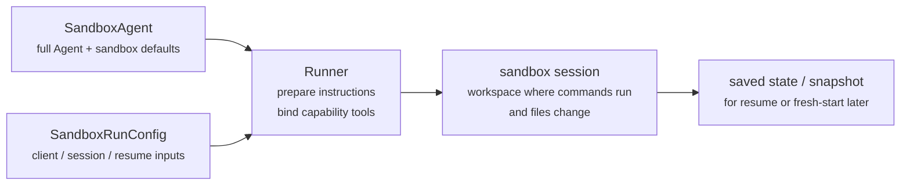
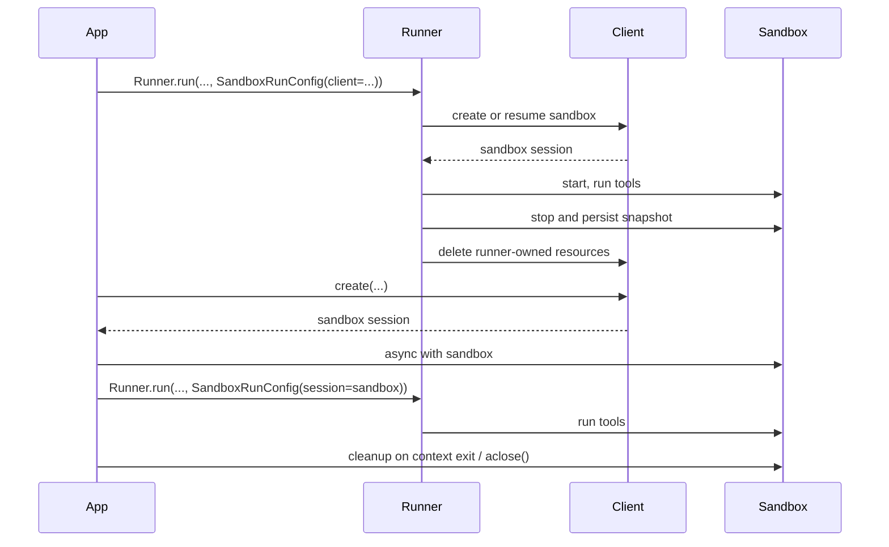

---
search:
  exclude: true
---
# 概念

!!! warning "ベータ機能"

    サンドボックスエージェントはベータ版です。一般提供までに API、デフォルト、対応機能の詳細が変更される可能性があり、今後より高度な機能が追加される見込みです。

現代のエージェントは、ファイルシステム上の実ファイルを扱えるときに最もよく機能します。 **サンドボックスエージェント** は、専用ツールやシェルコマンドを利用して、大規模なドキュメントセットの検索や操作、ファイル編集、成果物生成、コマンド実行を行えます。サンドボックスは、エージェントがあなたに代わって作業するために使える永続的なワークスペースをモデルに提供します。Agents SDK のサンドボックスエージェントは、サンドボックス環境と組み合わせたエージェントを簡単に実行できるようにし、ファイルシステム上に適切なファイルを配置し、サンドボックスをオーケストレーションして、大規模にタスクの開始、停止、再開を容易にします。

エージェントが必要とするデータを中心にワークスペースを定義します。GitHub リポジトリ、ローカルのファイルやディレクトリ、合成タスクファイル、S3 や Azure Blob Storage などのリモートファイルシステム、その他あなたが提供するサンドボックス入力から開始できます。

<div class="sandbox-harness-image" markdown="1">


</div>

`SandboxAgent` は依然として `Agent` です。`instructions`、`prompt`、`tools`、`handoffs`、`mcp_servers`、`model_settings`、`output_type`、ガードレール、フックなど通常のエージェントインターフェイスを維持し、通常の `Runner` API を通じて実行されます。変わるのは実行境界です。

- `SandboxAgent` はエージェント自体を定義します。通常のエージェント設定に加え、`default_manifest`、`base_instructions`、`run_as` などのサンドボックス固有のデフォルト、ファイルシステムツール、シェルアクセス、スキル、メモリ、コンパクションなどの機能を定義します。
- `Manifest` は、新しいサンドボックスワークスペースの開始時の内容とレイアウトを宣言します。これには、ファイル、リポジトリ、マウント、環境が含まれます。
- サンドボックスセッションは、コマンドが実行されファイルが変更される、稼働中の分離環境です。
- [`SandboxRunConfig`][agents.run_config.SandboxRunConfig] は、その実行がどのようにサンドボックスセッションを取得するかを決定します。たとえば、直接注入する、シリアライズされたサンドボックスセッション状態から再接続する、またはサンドボックスクライアントを通じて新しいサンドボックスセッションを作成するなどです。
- 保存されたサンドボックス状態とスナップショットにより、後続の実行が以前の作業へ再接続したり、保存された内容から新しいサンドボックスセッションを初期化したりできます。

`Manifest` は新規セッションのワークスペース契約であり、すべての稼働中サンドボックスの完全な信頼できる情報源ではありません。実行における実効ワークスペースは、再利用されたサンドボックスセッション、シリアライズされたサンドボックスセッション状態、または実行時に選択されたスナップショットから来る場合もあります。

このページ全体で、「サンドボックスセッション」とは、サンドボックスクライアントによって管理される稼働中の実行環境を意味します。これは、[Sessions](../sessions/index.md) で説明されている SDK の会話用 [`Session`][agents.memory.session.Session] インターフェイスとは異なります。

外側のランタイムは、承認、トレーシング、ハンドオフ、再開の記録管理を引き続き所有します。サンドボックスセッションは、コマンド、ファイル変更、環境分離を所有します。この分担はモデルの中核部分です。

### 構成要素の関係

サンドボックス実行は、エージェント定義と実行ごとのサンドボックス設定を組み合わせます。Runner はエージェントを準備し、稼働中のサンドボックスセッションにバインドし、後続の実行のために状態を保存できます。



サンドボックス固有のデフォルトは `SandboxAgent` に保持します。実行ごとのサンドボックスセッションの選択は `SandboxRunConfig` に保持します。

ライフサイクルは 3 つのフェーズで考えてください。

1. `SandboxAgent`、`Manifest`、機能を使って、エージェントと新規ワークスペース契約を定義します。
2. サンドボックスセッションを注入、再開、または作成する `SandboxRunConfig` を `Runner` に渡して実行します。
3. Runner が管理する `RunState`、明示的なサンドボックス `session_state`、または保存されたワークスペーススナップショットから後で継続します。

シェルアクセスがたまに使うツールの 1 つにすぎない場合は、[ツールガイド](../tools.md) のホスト型シェルから始めてください。ワークスペース分離、サンドボックスクライアントの選択、またはサンドボックスセッションの再開動作が設計の一部である場合は、サンドボックスエージェントを使ってください。

## 使用すべき場面

サンドボックスエージェントは、ワークスペース中心のワークフローに適しています。例:

- コーディングとデバッグ。たとえば GitHub リポジトリ内の issue レポートに対する自動修正をオーケストレーションし、対象テストを実行する場合
- ドキュメント処理と編集。たとえばユーザーの財務書類から情報を抽出し、記入済みの税務フォーム草案を作成する場合
- ファイルに基づくレビューや分析。たとえば回答前にオンボーディング資料、生成されたレポート、成果物バンドルを確認する場合
- 分離されたマルチエージェントパターン。たとえば各レビュアーやコーディングサブエージェントに専用ワークスペースを与える場合
- 複数ステップのワークスペースタスク。たとえば 1 回の実行でバグを修正し、後でリグレッションテストを追加する場合や、スナップショットまたはサンドボックスセッション状態から再開する場合

ファイルや生きたファイルシステムへのアクセスが不要な場合は、`Agent` を使い続けてください。シェルアクセスがたまに使う機能にすぎない場合はホスト型シェルを追加します。ワークスペース境界自体が機能の一部である場合は、サンドボックスエージェントを使います。

## サンドボックスクライアントの選択

ローカル開発では `UnixLocalSandboxClient` から始めてください。コンテナ分離やイメージの同等性が必要になったら `DockerSandboxClient` に移行します。プロバイダー管理の実行が必要な場合は、ホスト型プロバイダーに移行します。

ほとんどの場合、[`SandboxRunConfig`][agents.run_config.SandboxRunConfig] でサンドボックスクライアントとそのオプションを変更しても、`SandboxAgent` 定義は同じままです。ローカル、Docker、ホスト型、リモートマウントのオプションについては [サンドボックスクライアント](clients.md) を参照してください。

## 主要な構成要素

<div class="sandbox-nowrap-first-column-table" markdown="1">

| レイヤー | 主な SDK 構成要素 | 答える内容 |
| --- | --- | --- |
| エージェント定義 | `SandboxAgent`、`Manifest`、機能 | どのエージェントを実行し、新規セッションのワークスペース契約は何から開始すべきか。 |
| サンドボックス実行 | `SandboxRunConfig`、サンドボックスクライアント、稼働中のサンドボックスセッション | この実行はどのように稼働中のサンドボックスセッションを取得し、作業はどこで実行されるか。 |
| 保存されたサンドボックス状態 | `RunState` サンドボックスペイロード、`session_state`、スナップショット | このワークフローは、以前のサンドボックス作業にどのように再接続するか、または保存内容から新しいサンドボックスセッションをどのように初期化するか。 |

</div>

主な SDK 構成要素は、これらのレイヤーに次のように対応します。

<div class="sandbox-nowrap-first-column-table" markdown="1">

| 構成要素 | 所有するもの | 問うべき質問 |
| --- | --- | --- |
| [`SandboxAgent`][agents.sandbox.sandbox_agent.SandboxAgent] | エージェント定義 | このエージェントは何をすべきで、どのデフォルトを一緒に持たせるべきか。 |
| [`Manifest`][agents.sandbox.manifest.Manifest] | 新規セッションのワークスペースファイルとフォルダー | 実行開始時にファイルシステム上にどのファイルとフォルダーが存在すべきか。 |
| [`Capability`][agents.sandbox.capabilities.capability.Capability] | サンドボックスネイティブな動作 | このエージェントにどのツール、instruction 断片、またはランタイム動作を付与すべきか。 |
| [`SandboxRunConfig`][agents.run_config.SandboxRunConfig] | 実行ごとのサンドボックスクライアントとサンドボックスセッションソース | この実行はサンドボックスセッションを注入、再開、または作成すべきか。 |
| [`RunState`][agents.run_state.RunState] | Runner が管理する保存済みサンドボックス状態 | 以前の Runner 管理ワークフローを再開し、そのサンドボックス状態を自動的に引き継いでいるか。 |
| [`SandboxRunConfig.session_state`][agents.run_config.SandboxRunConfig.session_state] | 明示的にシリアライズされたサンドボックスセッション状態 | `RunState` の外で既にシリアライズしたサンドボックス状態から再開したいか。 |
| [`SandboxRunConfig.snapshot`][agents.run_config.SandboxRunConfig.snapshot] | 新しいサンドボックスセッション用の保存済みワークスペース内容 | 新しいサンドボックスセッションを保存済みファイルや成果物から開始すべきか。 |

</div>

実用的な設計順序は次のとおりです。

1. `Manifest` で新規セッションのワークスペース契約を定義します。
2. `SandboxAgent` でエージェントを定義します。
3. 組み込みまたはカスタム機能を追加します。
4. `RunConfig(sandbox=SandboxRunConfig(...))` で、各実行がサンドボックスセッションをどのように取得するかを決定します。

## サンドボックス実行の準備

実行時、Runner はその定義を具体的なサンドボックス付き実行に変換します。

1. `SandboxRunConfig` からサンドボックスセッションを解決します。
   `session=...` を渡した場合、その稼働中のサンドボックスセッションを再利用します。
   それ以外の場合は、`client=...` を使って作成または再開します。
2. 実行の実効ワークスペース入力を決定します。
   実行がサンドボックスセッションを注入または再開する場合、その既存のサンドボックス状態が優先されます。
   そうでない場合、Runner は一時的な manifest オーバーライドまたは `agent.default_manifest` から開始します。
   これが、`Manifest` だけではすべての実行の最終的な稼働中ワークスペースを定義しない理由です。
3. 機能に、結果として得られた manifest を処理させます。
   これにより、最終的なエージェントが準備される前に、機能がファイル、マウント、その他ワークスペーススコープの動作を追加できます。
4. 固定された順序で最終的な instructions を構築します。
   SDK のデフォルトサンドボックスプロンプト、または明示的に上書きした場合は `base_instructions`、次に `instructions`、次に機能の instruction 断片、次に任意のリモートマウントポリシーテキスト、最後にレンダリングされたファイルシステムツリーです。
5. 機能ツールを稼働中のサンドボックスセッションにバインドし、準備済みエージェントを通常の `Runner` API を通じて実行します。

サンドボックス化は、ターンの意味を変えません。ターンは依然としてモデルステップであり、単一のシェルコマンドやサンドボックスアクションではありません。サンドボックス側の操作とターンの間に固定の 1:1 対応はありません。一部の作業はサンドボックス実行レイヤー内にとどまる一方、他のアクションはツール結果、承認、または別のモデルステップを必要とするその他の状態を返す場合があります。実用上の規則として、サンドボックス作業の後にエージェントランタイムが別のモデル応答を必要とする場合にのみ、追加のターンが消費されます。

これらの準備ステップがあるため、`SandboxAgent` を設計する際に考えるべき主なサンドボックス固有オプションは、`default_manifest`、`instructions`、`base_instructions`、`capabilities`、`run_as` です。

## `SandboxAgent` オプション

通常の `Agent` フィールドに加えて、サンドボックス固有のオプションは次のとおりです。

<div class="sandbox-nowrap-first-column-table" markdown="1">

| オプション | 最適な用途 |
| --- | --- |
| `default_manifest` | Runner が作成する新しいサンドボックスセッションのデフォルトワークスペース。 |
| `instructions` | SDK サンドボックスプロンプトの後に追加される、追加の役割、ワークフロー、成功基準。 |
| `base_instructions` | SDK サンドボックスプロンプトを置き換える高度なエスケープハッチ。 |
| `capabilities` | このエージェントと一緒に持たせるべきサンドボックスネイティブなツールと動作。 |
| `run_as` | シェルコマンド、ファイル読み取り、パッチなど、モデル向けサンドボックスツールのユーザー ID。 |

</div>

サンドボックスクライアントの選択、サンドボックスセッションの再利用、manifest オーバーライド、スナップショット選択は、エージェントではなく [`SandboxRunConfig`][agents.run_config.SandboxRunConfig] に属します。

### `default_manifest`

`default_manifest` は、このエージェント用に Runner が新しいサンドボックスセッションを作成するときに使われるデフォルトの [`Manifest`][agents.sandbox.manifest.Manifest] です。エージェントが通常開始時に持つべきファイル、リポジトリ、補助資料、出力ディレクトリ、マウントに使います。

これはデフォルトにすぎません。実行は `SandboxRunConfig(manifest=...)` で上書きでき、再利用または再開されたサンドボックスセッションは既存のワークスペース状態を保持します。

### `instructions` と `base_instructions`

異なるプロンプトをまたいでも維持すべき短いルールには `instructions` を使います。`SandboxAgent` では、これらの instructions は SDK のサンドボックスベースプロンプトの後に追加されるため、組み込みのサンドボックスガイダンスを保ちながら、独自の役割、ワークフロー、成功基準を追加できます。

SDK のサンドボックスベースプロンプトを置き換えたい場合にのみ `base_instructions` を使います。ほとんどのエージェントでは設定すべきではありません。

<div class="sandbox-nowrap-first-column-table" markdown="1">

| 配置先 | 用途 | 例 |
| --- | --- | --- |
| `instructions` | エージェントの安定した役割、ワークフロールール、成功基準。 | 「オンボーディング書類を確認してからハンドオフする。」「最終ファイルを `output/` に書き込む。」 |
| `base_instructions` | SDK サンドボックスベースプロンプトの完全な置き換え。 | カスタムの低レベルサンドボックスラッパープロンプト。 |
| ユーザープロンプト | この実行の一回限りの依頼。 | 「このワークスペースを要約してください。」 |
| manifest 内のワークスペースファイル | より長いタスク仕様、リポジトリローカルの指示、または範囲を限定した参考資料。 | `repo/task.md`、ドキュメントバンドル、サンプルパケット。 |

</div>

`instructions` の適切な用途は次のとおりです。

- [examples/sandbox/unix_local_pty.py](https://github.com/openai/openai-agents-python/blob/main/examples/sandbox/unix_local_pty.py) は、PTY 状態が重要な場合にエージェントを 1 つの対話型プロセス内に保ちます。
- [examples/sandbox/handoffs.py](https://github.com/openai/openai-agents-python/blob/main/examples/sandbox/handoffs.py) は、サンドボックスレビュアーが検査後にユーザーへ直接回答することを禁止します。
- [examples/sandbox/tax_prep.py](https://github.com/openai/openai-agents-python/blob/main/examples/sandbox/tax_prep.py) は、最終的な記入済みファイルが実際に `output/` に配置されることを要求します。
- [examples/sandbox/docs/coding_task.py](https://github.com/openai/openai-agents-python/blob/main/examples/sandbox/docs/coding_task.py) は、正確な検証コマンドを固定し、ワークスペースルート相対のパッチパスを明確にします。

ユーザーの一回限りのタスクを `instructions` にコピーすること、manifest に含めるべき長い参考資料を埋め込むこと、組み込み機能がすでに注入するツールドキュメントを再記述すること、実行時にモデルが必要としないローカルインストールメモを混ぜることは避けてください。

`instructions` を省略しても、SDK はデフォルトのサンドボックスプロンプトを含めます。これは低レベルラッパーには十分ですが、ほとんどのユーザー向けエージェントでは明示的な `instructions` を提供すべきです。

### `capabilities`

機能は、サンドボックスネイティブな動作を `SandboxAgent` に付与します。実行開始前にワークスペースを整形し、サンドボックス固有の instructions を追加し、稼働中のサンドボックスセッションにバインドされるツールを公開し、そのエージェントのモデル動作や入力処理を調整できます。

組み込み機能には次のものがあります。

<div class="sandbox-nowrap-first-column-table" markdown="1">

| 機能 | 追加する場面 | 注記 |
| --- | --- | --- |
| `Shell` | エージェントにシェルアクセスが必要な場合。 | `exec_command` を追加し、サンドボックスクライアントが PTY 対話をサポートする場合は `write_stdin` も追加します。 |
| `Filesystem` | エージェントがファイルを編集したりローカル画像を検査したりする必要がある場合。 | `apply_patch` と `view_image` を追加します。パッチパスはワークスペースルート相対です。 |
| `Skills` | サンドボックス内でスキル検出と具体化を行いたい場合。 | `.agents` や `.agents/skills` を手動でマウントするよりもこちらを推奨します。`Skills` がスキルをインデックス化し、サンドボックス内に具体化します。 |
| `Memory` | 後続の実行がメモリ成果物を読み取る、または生成するべき場合。 | `Shell` が必要です。ライブ更新には `Filesystem` も必要です。 |
| `Compaction` | 長時間実行フローでコンパクション項目後のコンテキスト削減が必要な場合。 | モデルサンプリングと入力処理を調整します。 |

</div>

デフォルトでは、`SandboxAgent.capabilities` は `Capabilities.default()` を使い、これには `Filesystem()`、`Shell()`、`Compaction()` が含まれます。`capabilities=[...]` を渡すと、そのリストがデフォルトを置き換えるため、引き続き必要なデフォルト機能を含めてください。

スキルについては、どのように具体化したいかに基づいてソースを選んでください。

- `Skills(lazy_from=LocalDirLazySkillSource(...))` は、モデルがまずインデックスを検出し、必要なものだけを読み込めるため、大きめのローカルスキルディレクトリに適したデフォルトです。
- `LocalDirLazySkillSource(source=LocalDir(src=...))` は、SDK プロセスが実行されているファイルシステムから読み取ります。サンドボックスイメージやワークスペース内にしか存在しないパスではなく、元のホスト側スキルディレクトリを渡してください。
- `Skills(from_=LocalDir(src=...))` は、事前にステージングしたい小さなローカルバンドルに適しています。
- `Skills(from_=GitRepo(repo=..., ref=...))` は、スキル自体をリポジトリから取得すべき場合に適しています。

`LocalDir.src` は SDK ホスト上のソースパスです。`skills_path` は、`load_skill` が呼び出されたときにスキルがステージングされるサンドボックスワークスペース内の相対宛先パスです。

スキルがすでに `.agents/skills/<name>/SKILL.md` のような場所にディスク上で存在する場合、そのソースルートを `LocalDir(...)` に指定し、それでも `Skills(...)` を使って公開してください。別のサンドボックス内レイアウトに依存する既存のワークスペース契約がない限り、デフォルトの `skills_path=".agents"` を維持してください。

適合する場合は組み込み機能を優先してください。組み込みでカバーされないサンドボックス固有のツールや instruction インターフェイスが必要な場合にのみ、カスタム機能を書いてください。

## 概念

### Manifest

[`Manifest`][agents.sandbox.manifest.Manifest] は、新しいサンドボックスセッションのワークスペースを記述します。ワークスペースの `root` を設定し、ファイルやディレクトリを宣言し、ローカルファイルをコピーし、Git リポジトリをクローンし、リモートストレージマウントを接続し、環境変数を設定し、ユーザーやグループを定義し、ワークスペース外の特定の絶対パスへのアクセスを付与できます。

Manifest エントリのパスはワークスペース相対です。絶対パスにしたり、`..` でワークスペースから抜けたりすることはできません。これにより、ワークスペース契約をローカル、Docker、ホスト型クライアント間で移植可能に保てます。

作業開始前にエージェントが必要とする素材には manifest エントリを使います。

<div class="sandbox-nowrap-first-column-table" markdown="1">

| Manifest エントリ | 用途 |
| --- | --- |
| `File`, `Dir` | 小さな合成入力、補助ファイル、または出力ディレクトリ。 |
| `LocalFile`, `LocalDir` | サンドボックス内に具体化すべきホストファイルまたはディレクトリ。 |
| `GitRepo` | ワークスペースに取得すべきリポジトリ。 |
| `S3Mount`、`GCSMount`、`R2Mount`、`AzureBlobMount`、`BoxMount`、`S3FilesMount` などのマウント | サンドボックス内に表示すべき外部ストレージ。 |

</div>

マウントエントリは公開するストレージを記述し、マウント戦略はサンドボックスバックエンドがそのストレージを接続する方法を記述します。マウントオプションとプロバイダー対応については [サンドボックスクライアント](clients.md#mounts-and-remote-storage) を参照してください。

優れた manifest 設計では通常、ワークスペース契約を狭く保ち、長いタスク手順を `repo/task.md` などのワークスペースファイルに置き、instructions 内で `repo/task.md` や `output/report.md` などの相対ワークスペースパスを使います。エージェントが `Filesystem` 機能の `apply_patch` ツールでファイルを編集する場合、パッチパスはシェルの `workdir` ではなく、サンドボックスワークスペースルートからの相対であることに注意してください。

`extra_path_grants` は、エージェントがワークスペース外の具体的な絶対パスを必要とする場合にのみ使ってください。たとえば、一時的なツール出力用の `/tmp` や、読み取り専用ランタイム用の `/opt/toolchain` です。grant は、バックエンドがファイルシステムポリシーを適用できる場合、SDK ファイル API とシェル実行の両方に適用されます。

```python
from agents.sandbox import Manifest, SandboxPathGrant

manifest = Manifest(
    extra_path_grants=(
        SandboxPathGrant(path="/tmp"),
        SandboxPathGrant(path="/opt/toolchain", read_only=True),
    ),
)
```

スナップショットと `persist_workspace()` は、引き続きワークスペースルートのみを含みます。追加で許可されたパスは実行時アクセスであり、永続的なワークスペース状態ではありません。

### 権限

`Permissions` は manifest エントリのファイルシステム権限を制御します。これはサンドボックスが具体化するファイルに関するものであり、モデル権限、承認ポリシー、API 認証情報に関するものではありません。

デフォルトでは、manifest エントリは所有者が読み取り、書き込み、実行可能で、グループとその他は読み取り、実行可能です。ステージングされたファイルを非公開、読み取り専用、または実行可能にする必要がある場合は、これを上書きします。

```python
from agents.sandbox import FileMode, Permissions
from agents.sandbox.entries import File

private_notes = File(
    text="internal notes",
    permissions=Permissions(
        owner=FileMode.READ | FileMode.WRITE,
        group=FileMode.NONE,
        other=FileMode.NONE,
    ),
)
```

`Permissions` は、所有者、グループ、その他の各ビットと、そのエントリがディレクトリかどうかを別々に保持します。直接構築することも、`Permissions.from_str(...)` でモード文字列から解析することも、`Permissions.from_mode(...)` で OS モードから派生させることもできます。

ユーザーは、作業を実行できるサンドボックス ID です。その ID をサンドボックス内に存在させたい場合は manifest に `User` を追加し、シェルコマンド、ファイル読み取り、パッチなどのモデル向けサンドボックスツールをそのユーザーとして実行したい場合は `SandboxAgent.run_as` を設定します。`run_as` が manifest にまだ存在しないユーザーを指している場合、Runner が実効 manifest にそのユーザーを追加します。

```python
from agents import Runner
from agents.run import RunConfig
from agents.sandbox import FileMode, Manifest, Permissions, SandboxAgent, SandboxRunConfig, User
from agents.sandbox.entries import Dir, LocalDir
from agents.sandbox.sandboxes.unix_local import UnixLocalSandboxClient

analyst = User(name="analyst")

agent = SandboxAgent(
    name="Dataroom analyst",
    instructions="Review the files in `dataroom/` and write findings to `output/`.",
    default_manifest=Manifest(
        # Declare the sandbox user so manifest entries can grant access to it.
        users=[analyst],
        entries={
            "dataroom": LocalDir(
                src="./dataroom",
                # Let the analyst traverse and read the mounted dataroom, but not edit it.
                group=analyst,
                permissions=Permissions(
                    owner=FileMode.READ | FileMode.EXEC,
                    group=FileMode.READ | FileMode.EXEC,
                    other=FileMode.NONE,
                ),
            ),
            "output": Dir(
                # Give the analyst a writable scratch/output directory for artifacts.
                group=analyst,
                permissions=Permissions(
                    owner=FileMode.ALL,
                    group=FileMode.ALL,
                    other=FileMode.NONE,
                ),
            ),
        },
    ),
    # Run model-facing sandbox actions as this user, so those permissions apply.
    run_as=analyst,
)

result = await Runner.run(
    agent,
    "Summarize the contracts and call out renewal dates.",
    run_config=RunConfig(
        sandbox=SandboxRunConfig(client=UnixLocalSandboxClient()),
    ),
)
```

ファイルレベルの共有ルールも必要な場合は、ユーザーと manifest グループ、エントリの `group` メタデータを組み合わせてください。`run_as` ユーザーは誰がサンドボックスネイティブアクションを実行するかを制御し、`Permissions` はサンドボックスがワークスペースを具体化した後、そのユーザーがどのファイルを読み取り、書き込み、実行できるかを制御します。

### SnapshotSpec

`SnapshotSpec` は、保存されたワークスペース内容をどこから復元し、どこへ永続化するかを新しいサンドボックスセッションに伝えます。これはサンドボックスワークスペースのスナップショットポリシーであり、`session_state` は特定のサンドボックスバックエンドを再開するためのシリアライズされた接続状態です。

ローカルの永続スナップショットには `LocalSnapshotSpec` を使い、アプリがリモートスナップショットクライアントを提供する場合は `RemoteSnapshotSpec` を使います。ローカルスナップショットのセットアップが利用できない場合はフォールバックとして no-op スナップショットが使われ、高度な呼び出し元はワークスペーススナップショット永続化を望まない場合に明示的に使うこともできます。

```python
from pathlib import Path

from agents.run import RunConfig
from agents.sandbox import LocalSnapshotSpec, SandboxRunConfig
from agents.sandbox.sandboxes.unix_local import UnixLocalSandboxClient

run_config = RunConfig(
    sandbox=SandboxRunConfig(
        client=UnixLocalSandboxClient(),
        snapshot=LocalSnapshotSpec(base_path=Path("/tmp/my-sandbox-snapshots")),
    )
)
```

Runner が新しいサンドボックスセッションを作成すると、サンドボックスクライアントはそのセッション用のスナップショットインスタンスを構築します。開始時、スナップショットが復元可能であれば、実行が継続する前にサンドボックスが保存済みワークスペース内容を復元します。クリーンアップ時、Runner 所有のサンドボックスセッションはワークスペースをアーカイブし、スナップショットを通じて永続化します。

`snapshot` を省略した場合、ランタイムは可能であればデフォルトのローカルスナップショット場所を使おうとします。それを設定できない場合は、no-op スナップショットにフォールバックします。マウントされたパスや一時的なパスは、永続的なワークスペース内容としてスナップショットにコピーされません。

### サンドボックスライフサイクル

ライフサイクルモードは **SDK 所有** と **開発者所有** の 2 つです。

<div class="sandbox-lifecycle-diagram" markdown="1">



</div>

サンドボックスが 1 回の実行の間だけ存在すればよい場合は、SDK 所有ライフサイクルを使います。`client`、任意の `manifest`、任意の `snapshot`、クライアントの `options` を渡します。Runner はサンドボックスを作成または再開し、開始し、エージェントを実行し、スナップショットに裏付けられたワークスペース状態を永続化し、サンドボックスを停止し、クライアントに Runner 所有リソースをクリーンアップさせます。

```python
result = await Runner.run(
    agent,
    "Inspect the workspace and summarize what changed.",
    run_config=RunConfig(
        sandbox=SandboxRunConfig(client=UnixLocalSandboxClient()),
    ),
)
```

サンドボックスを事前に作成したい場合、1 つの稼働中サンドボックスを複数実行で再利用したい場合、実行後にファイルを検査したい場合、自分で作成したサンドボックス上でストリーミングしたい場合、またはクリーンアップのタイミングを正確に決めたい場合は、開発者所有ライフサイクルを使います。`session=...` を渡すと、Runner はその稼働中サンドボックスを使用しますが、あなたの代わりに閉じることはありません。

```python
sandbox = await client.create(manifest=agent.default_manifest)

async with sandbox:
    run_config = RunConfig(sandbox=SandboxRunConfig(session=sandbox))
    await Runner.run(agent, "Analyze the files.", run_config=run_config)
    await Runner.run(agent, "Write the final report.", run_config=run_config)
```

通常の形はコンテキストマネージャーです。入場時にサンドボックスを開始し、終了時にセッションクリーンアップライフサイクルを実行します。アプリがコンテキストマネージャーを使えない場合は、ライフサイクルメソッドを直接呼び出してください。

```python
sandbox = await client.create(
    manifest=agent.default_manifest,
    snapshot=LocalSnapshotSpec(base_path=Path("/tmp/my-sandbox-snapshots")),
)
try:
    await sandbox.start()
    await Runner.run(
        agent,
        "Analyze the files.",
        run_config=RunConfig(sandbox=SandboxRunConfig(session=sandbox)),
    )
    # Persist a checkpoint of the live workspace before doing more work.
    # `aclose()` also calls `stop()`, so this is only needed for an explicit mid-lifecycle save.
    await sandbox.stop()
finally:
    await sandbox.aclose()
```

`stop()` はスナップショットに裏付けられたワークスペース内容を永続化するだけで、サンドボックスを破棄しません。`aclose()` は完全なセッションクリーンアップ経路です。停止前フックを実行し、`stop()` を呼び出し、サンドボックスリソースをシャットダウンし、セッションスコープの依存関係を閉じます。

## `SandboxRunConfig` オプション

[`SandboxRunConfig`][agents.run_config.SandboxRunConfig] は、サンドボックスセッションがどこから来るか、および新しいセッションをどのように初期化するかを決める実行ごとのオプションを保持します。

### サンドボックスソース

これらのオプションは、Runner がサンドボックスセッションを再利用、再開、または作成するかを決定します。

<div class="sandbox-nowrap-first-column-table" markdown="1">

| オプション | 使用する場面 | 注記 |
| --- | --- | --- |
| `client` | Runner にサンドボックスセッションの作成、再開、クリーンアップを任せたい場合。 | 稼働中のサンドボックス `session` を提供しない限り必須です。 |
| `session` | すでに自分で稼働中のサンドボックスセッションを作成している場合。 | 呼び出し元がライフサイクルを所有し、Runner はその稼働中サンドボックスセッションを再利用します。 |
| `session_state` | シリアライズされたサンドボックスセッション状態はあるが、稼働中のサンドボックスセッションオブジェクトはない場合。 | `client` が必要です。Runner はその明示的な状態から所有セッションとして再開します。 |

</div>

実際には、Runner は次の順序でサンドボックスセッションを解決します。

1. `run_config.sandbox.session` を注入した場合、その稼働中のサンドボックスセッションが直接再利用されます。
2. それ以外で、実行が `RunState` から再開している場合、保存されたサンドボックスセッション状態が再開されます。
3. それ以外で、`run_config.sandbox.session_state` を渡した場合、Runner はその明示的にシリアライズされたサンドボックスセッション状態から再開します。
4. それ以外の場合、Runner は新しいサンドボックスセッションを作成します。その新規セッションでは、提供されていれば `run_config.sandbox.manifest` を使い、なければ `agent.default_manifest` を使います。

### 新規セッション入力

これらのオプションは、Runner が新しいサンドボックスセッションを作成する場合にのみ関係します。

<div class="sandbox-nowrap-first-column-table" markdown="1">

| オプション | 使用する場面 | 注記 |
| --- | --- | --- |
| `manifest` | 一回限りの新規セッションワークスペース上書きをしたい場合。 | 省略時は `agent.default_manifest` にフォールバックします。 |
| `snapshot` | 新しいサンドボックスセッションをスナップショットから初期化すべき場合。 | 再開に似たフローやリモートスナップショットクライアントに有用です。 |
| `options` | サンドボックスクライアントが作成時オプションを必要とする場合。 | Docker イメージ、Modal アプリ名、E2B テンプレート、タイムアウト、類似のクライアント固有設定で一般的です。 |

</div>

### 具体化制御

`concurrency_limits` は、サンドボックス具体化作業をどれだけ並列実行できるかを制御します。大きな manifest やローカルディレクトリのコピーでより厳密なリソース制御が必要な場合は、`SandboxConcurrencyLimits(manifest_entries=..., local_dir_files=...)` を使います。特定の制限を無効にするには、いずれかの値を `None` に設定します。

覚えておくべき影響がいくつかあります。

- 新規セッション: `manifest=` と `snapshot=` は、Runner が新しいサンドボックスセッションを作成する場合にのみ適用されます。
- 再開とスナップショット: `session_state=` は以前にシリアライズされたサンドボックス状態へ再接続します。一方、`snapshot=` は保存済みワークスペース内容から新しいサンドボックスセッションを初期化します。
- クライアント固有オプション: `options=` はサンドボックスクライアントに依存します。Docker や多くのホスト型クライアントでは必要です。
- 注入された稼働中セッション: 実行中のサンドボックス `session` を渡した場合、機能による manifest 更新は、互換性のある非マウントエントリを追加できます。`manifest.root`、`manifest.environment`、`manifest.users`、`manifest.groups` の変更、既存エントリの削除、エントリタイプの置換、マウントエントリの追加または変更はできません。
- Runner API: `SandboxAgent` の実行は、引き続き通常の `Runner.run()`、`Runner.run_sync()`、`Runner.run_streamed()` API を使います。

## 完全な例: コーディングタスク

このコーディング形式の例は、出発点として適したデフォルトです。

```python
import asyncio
from pathlib import Path

from agents import ModelSettings, Runner
from agents.run import RunConfig
from agents.sandbox import Manifest, SandboxAgent, SandboxRunConfig
from agents.sandbox.capabilities import (
    Capabilities,
    LocalDirLazySkillSource,
    Skills,
)
from agents.sandbox.entries import LocalDir
from agents.sandbox.sandboxes.unix_local import UnixLocalSandboxClient

EXAMPLE_DIR = Path(__file__).resolve().parent
HOST_REPO_DIR = EXAMPLE_DIR / "repo"
HOST_SKILLS_DIR = EXAMPLE_DIR / "skills"
TARGET_TEST_CMD = "sh tests/test_credit_note.sh"


def build_agent(model: str) -> SandboxAgent[None]:
    return SandboxAgent(
        name="Sandbox engineer",
        model=model,
        instructions=(
            "Inspect the repo, make the smallest correct change, run the most relevant checks, "
            "and summarize the file changes and risks. "
            "Read `repo/task.md` before editing files. Stay grounded in the repository, preserve "
            "existing behavior, and mention the exact verification command you ran. "
            "Use the `$credit-note-fixer` skill before editing files. If the repo lives under "
            "`repo/`, remember that `apply_patch` paths stay relative to the sandbox workspace "
            "root, so edits still target `repo/...`."
        ),
        # Put repos and task files in the manifest.
        default_manifest=Manifest(
            entries={
                "repo": LocalDir(src=HOST_REPO_DIR),
            }
        ),
        capabilities=Capabilities.default() + [
            Skills(
                lazy_from=LocalDirLazySkillSource(
                    # This is a host path read by the SDK process.
                    # Requested skills are copied into `skills_path` in the sandbox.
                    source=LocalDir(src=HOST_SKILLS_DIR),
                )
            ),
        ],
        model_settings=ModelSettings(tool_choice="required"),
    )


async def main(model: str, prompt: str) -> None:
    result = await Runner.run(
        build_agent(model),
        prompt,
        run_config=RunConfig(
            sandbox=SandboxRunConfig(client=UnixLocalSandboxClient()),
            workflow_name="Sandbox coding example",
        ),
    )
    print(result.final_output)


if __name__ == "__main__":
    asyncio.run(
        main(
            model="gpt-5.5",
            prompt=(
                "Open `repo/task.md`, use the `$credit-note-fixer` skill, fix the bug, "
                f"run `{TARGET_TEST_CMD}`, and summarize the change."
            ),
        )
    )
```

[examples/sandbox/docs/coding_task.py](https://github.com/openai/openai-agents-python/blob/main/examples/sandbox/docs/coding_task.py) を参照してください。この例では、Unix ローカル実行間で決定的に検証できるように、小さなシェルベースのリポジトリを使っています。実際のタスクリポジトリはもちろん、Python、JavaScript、その他何でも構いません。

## 一般的なパターン

上記の完全な例から始めてください。多くの場合、同じ `SandboxAgent` をそのまま保ち、サンドボックスクライアント、サンドボックスセッションソース、またはワークスペースソースだけを変更できます。

### サンドボックスクライアントの切り替え

エージェント定義は同じままにし、実行設定だけを変更します。コンテナ分離やイメージの同等性が必要な場合は Docker を使い、プロバイダー管理の実行が必要な場合はホスト型プロバイダーを使います。例とプロバイダーオプションについては [サンドボックスクライアント](clients.md) を参照してください。

### ワークスペースの上書き

エージェント定義は同じままにし、新規セッション manifest だけを差し替えます。

```python
from agents.run import RunConfig
from agents.sandbox import Manifest, SandboxRunConfig
from agents.sandbox.entries import GitRepo
from agents.sandbox.sandboxes.unix_local import UnixLocalSandboxClient

run_config = RunConfig(
    sandbox=SandboxRunConfig(
        client=UnixLocalSandboxClient(),
        manifest=Manifest(
            entries={
                "repo": GitRepo(repo="openai/openai-agents-python", ref="main"),
            }
        ),
    ),
)
```

同じエージェントの役割を、異なるリポジトリ、パケット、タスクバンドルに対して、エージェントを再構築せずに実行したい場合に使います。上記の検証済みコーディング例は、一回限りの上書きではなく `default_manifest` を使って同じパターンを示しています。

### サンドボックスセッションの注入

明示的なライフサイクル制御、実行後の検査、または出力コピーが必要な場合は、稼働中のサンドボックスセッションを注入します。

```python
from agents import Runner
from agents.run import RunConfig
from agents.sandbox import SandboxRunConfig
from agents.sandbox.sandboxes.unix_local import UnixLocalSandboxClient

client = UnixLocalSandboxClient()
sandbox = await client.create(manifest=agent.default_manifest)

async with sandbox:
    result = await Runner.run(
        agent,
        prompt,
        run_config=RunConfig(
            sandbox=SandboxRunConfig(session=sandbox),
        ),
    )
```

実行後にワークスペースを検査したい場合や、すでに開始済みのサンドボックスセッション上でストリーミングしたい場合に使います。[examples/sandbox/docs/coding_task.py](https://github.com/openai/openai-agents-python/blob/main/examples/sandbox/docs/coding_task.py) と [examples/sandbox/docker/docker_runner.py](https://github.com/openai/openai-agents-python/blob/main/examples/sandbox/docker/docker_runner.py) を参照してください。

### セッション状態からの再開

`RunState` の外でサンドボックス状態をすでにシリアライズしている場合は、Runner にその状態から再接続させます。

```python
from agents.run import RunConfig
from agents.sandbox import SandboxRunConfig

serialized = load_saved_payload()
restored_state = client.deserialize_session_state(serialized)

run_config = RunConfig(
    sandbox=SandboxRunConfig(
        client=client,
        session_state=restored_state,
    ),
)
```

サンドボックス状態が独自のストレージやジョブシステムにあり、`Runner` にそこから直接再開させたい場合に使います。シリアライズ / デシリアライズフローについては [examples/sandbox/extensions/blaxel_runner.py](https://github.com/openai/openai-agents-python/blob/main/examples/sandbox/extensions/blaxel_runner.py) を参照してください。

### スナップショットからの開始

保存済みファイルと成果物から新しいサンドボックスを初期化します。

```python
from pathlib import Path

from agents.run import RunConfig
from agents.sandbox import LocalSnapshotSpec, SandboxRunConfig
from agents.sandbox.sandboxes.unix_local import UnixLocalSandboxClient

run_config = RunConfig(
    sandbox=SandboxRunConfig(
        client=UnixLocalSandboxClient(),
        snapshot=LocalSnapshotSpec(base_path=Path("/tmp/my-sandbox-snapshot")),
    ),
)
```

新しい実行を `agent.default_manifest` だけでなく、保存済みワークスペース内容から開始すべき場合に使います。ローカルスナップショットフローについては [examples/sandbox/memory.py](https://github.com/openai/openai-agents-python/blob/main/examples/sandbox/memory.py) を、リモートスナップショットクライアントについては [examples/sandbox/sandbox_agent_with_remote_snapshot.py](https://github.com/openai/openai-agents-python/blob/main/examples/sandbox/sandbox_agent_with_remote_snapshot.py) を参照してください。

### Git からのスキル読み込み

ローカルスキルソースをリポジトリベースのものに差し替えます。

```python
from agents.sandbox.capabilities import Capabilities, Skills
from agents.sandbox.entries import GitRepo

capabilities = Capabilities.default() + [
    Skills(from_=GitRepo(repo="sdcoffey/tax-prep-skills", ref="main")),
]
```

スキルバンドルに独自のリリースサイクルがある場合や、サンドボックス間で共有すべき場合に使います。[examples/sandbox/tax_prep.py](https://github.com/openai/openai-agents-python/blob/main/examples/sandbox/tax_prep.py) を参照してください。

### ツールとしての公開

ツールエージェントは、独自のサンドボックス境界を持つことも、親実行の稼働中サンドボックスを再利用することもできます。再利用は、高速な読み取り専用探索エージェントに有用です。別のサンドボックスを作成、ハイドレート、スナップショットするコストを払わずに、親が使っている正確なワークスペースを検査できます。

```python
from agents import Runner
from agents.run import RunConfig
from agents.sandbox import FileMode, Manifest, Permissions, SandboxAgent, SandboxRunConfig, User
from agents.sandbox.entries import Dir, File
from agents.sandbox.sandboxes.unix_local import UnixLocalSandboxClient

coordinator = User(name="coordinator")
explorer = User(name="explorer")

manifest = Manifest(
    users=[coordinator, explorer],
    entries={
        "pricing_packet": Dir(
            group=coordinator,
            permissions=Permissions(
                owner=FileMode.ALL,
                group=FileMode.ALL,
                other=FileMode.READ | FileMode.EXEC,
                directory=True,
            ),
            children={
                "pricing.md": File(
                    content=b"Pricing packet contents...",
                    group=coordinator,
                    permissions=Permissions(
                        owner=FileMode.ALL,
                        group=FileMode.ALL,
                        other=FileMode.READ,
                    ),
                ),
            },
        ),
        "work": Dir(
            group=coordinator,
            permissions=Permissions(
                owner=FileMode.ALL,
                group=FileMode.ALL,
                other=FileMode.NONE,
                directory=True,
            ),
        ),
    },
)

pricing_explorer = SandboxAgent(
    name="Pricing Explorer",
    instructions="Read `pricing_packet/` and summarize commercial risk. Do not edit files.",
    run_as=explorer,
)

client = UnixLocalSandboxClient()
sandbox = await client.create(manifest=manifest)

async with sandbox:
    shared_run_config = RunConfig(
        sandbox=SandboxRunConfig(session=sandbox),
    )

    orchestrator = SandboxAgent(
        name="Revenue Operations Coordinator",
        instructions="Coordinate the review and write final notes to `work/`.",
        run_as=coordinator,
        tools=[
            pricing_explorer.as_tool(
                tool_name="review_pricing_packet",
                tool_description="Inspect the pricing packet and summarize commercial risk.",
                run_config=shared_run_config,
                max_turns=2,
            ),
        ],
    )

    result = await Runner.run(
        orchestrator,
        "Review the pricing packet, then write final notes to `work/summary.md`.",
        run_config=shared_run_config,
    )
```

ここでは親エージェントが `coordinator` として実行され、explorer ツールエージェントが同じ稼働中サンドボックスセッション内で `explorer` として実行されます。`pricing_packet/` エントリは `other` ユーザーが読み取り可能なため、explorer はそれらをすばやく検査できますが、書き込みビットは持ちません。`work/` ディレクトリは coordinator のユーザー / グループだけが利用できるため、親は最終成果物を書き込める一方で、explorer は読み取り専用のままです。

ツールエージェントに本当の分離が必要な場合は、独自のサンドボックス `RunConfig` を与えます。

```python
from docker import from_env as docker_from_env

from agents.run import RunConfig
from agents.sandbox import SandboxRunConfig
from agents.sandbox.sandboxes.docker import DockerSandboxClient, DockerSandboxClientOptions

rollout_agent.as_tool(
    tool_name="review_rollout_risk",
    tool_description="Inspect the rollout packet and summarize implementation risk.",
    run_config=RunConfig(
        sandbox=SandboxRunConfig(
            client=DockerSandboxClient(docker_from_env()),
            options=DockerSandboxClientOptions(image="python:3.14-slim"),
        ),
    ),
)
```

ツールエージェントが自由に変更したり、信頼できないコマンドを実行したり、異なるバックエンド / イメージを使うべき場合は、別のサンドボックスを使います。[examples/sandbox/sandbox_agents_as_tools.py](https://github.com/openai/openai-agents-python/blob/main/examples/sandbox/sandbox_agents_as_tools.py) を参照してください。

### ローカルツールと MCP との組み合わせ

同じエージェントで通常のツールを使いながら、サンドボックスワークスペースを維持します。

```python
from agents.sandbox import SandboxAgent
from agents.sandbox.capabilities import Shell

agent = SandboxAgent(
    name="Workspace reviewer",
    instructions="Inspect the workspace and call host tools when needed.",
    tools=[get_discount_approval_path],
    mcp_servers=[server],
    capabilities=[Shell()],
)
```

ワークスペース検査がエージェントの仕事の一部にすぎない場合に使います。[examples/sandbox/sandbox_agent_with_tools.py](https://github.com/openai/openai-agents-python/blob/main/examples/sandbox/sandbox_agent_with_tools.py) を参照してください。

## メモリ

将来のサンドボックスエージェント実行が過去の実行から学ぶべき場合は、`Memory` 機能を使います。メモリは SDK の会話用 `Session` メモリとは別です。教訓をサンドボックスワークスペース内のファイルに抽出し、後続の実行がそれらのファイルを読めるようにします。

セットアップ、読み取り / 生成動作、マルチターン会話、レイアウト分離については [エージェントメモリ](memory.md) を参照してください。

## 構成パターン

単一エージェントのパターンが明確になったら、次の設計上の問いは、より大きなシステムのどこにサンドボックス境界を置くかです。

サンドボックスエージェントは、SDK の他の部分とも引き続き構成できます。

- [ハンドオフ](../handoffs.md): ドキュメント量の多い作業を、非サンドボックスの受付エージェントからサンドボックスレビュアーへハンドオフします。
- [Agents as tools](../tools.md#agents-as-tools): 複数のサンドボックスエージェントをツールとして公開します。通常は各 `Agent.as_tool(...)` 呼び出しで `run_config=RunConfig(sandbox=SandboxRunConfig(...))` を渡し、各ツールに独自のサンドボックス境界を持たせます。
- [MCP](../mcp.md) と通常の関数ツール: サンドボックス機能は `mcp_servers` や通常の Python ツールと共存できます。
- [エージェントの実行](../running_agents.md): サンドボックス実行も通常の `Runner` API を使います。

特に一般的なパターンは 2 つあります。

- 非サンドボックスエージェントが、ワークフローのうちワークスペース分離を必要とする部分だけをサンドボックスエージェントへハンドオフする
- オーケストレーターが複数のサンドボックスエージェントをツールとして公開する。通常は各 `Agent.as_tool(...)` 呼び出しごとに別々のサンドボックス `RunConfig` を使い、各ツールが独自の分離ワークスペースを持つようにする

### ターンとサンドボックス実行

ハンドオフと agent-as-tool 呼び出しは、分けて説明すると理解しやすくなります。

ハンドオフでは、トップレベルの実行とトップレベルのターンループは引き続き 1 つです。アクティブなエージェントは変わりますが、実行がネストされるわけではありません。非サンドボックスの受付エージェントがサンドボックスレビュアーへハンドオフした場合、同じ実行内の次のモデル呼び出しはサンドボックスエージェント向けに準備され、そのサンドボックスエージェントが次のターンを担当するエージェントになります。言い換えると、ハンドオフは同じ実行の次のターンを所有するエージェントを変更します。[examples/sandbox/handoffs.py](https://github.com/openai/openai-agents-python/blob/main/examples/sandbox/handoffs.py) を参照してください。

`Agent.as_tool(...)` では関係が異なります。外側のオーケストレーターは 1 つの外側ターンを使ってツールを呼び出すことを決定し、そのツール呼び出しがサンドボックスエージェントのネストされた実行を開始します。ネストされた実行には、独自のターンループ、`max_turns`、承認、通常は独自のサンドボックス `RunConfig` があります。1 つのネストされたターンで終了する場合もあれば、複数かかる場合もあります。外側のオーケストレーターの視点では、その作業全体は 1 つのツール呼び出しの背後にあるため、ネストされたターンは外側の実行のターンカウンターを増やしません。[examples/sandbox/sandbox_agents_as_tools.py](https://github.com/openai/openai-agents-python/blob/main/examples/sandbox/sandbox_agents_as_tools.py) を参照してください。

承認動作も同じ分担に従います。

- ハンドオフでは、サンドボックスエージェントがその実行内のアクティブなエージェントになっているため、承認は同じトップレベル実行にとどまります
- `Agent.as_tool(...)` では、サンドボックスツールエージェント内で発生した承認は外側の実行に表示されますが、保存されたネスト実行状態から来ており、外側の実行が再開されるとネストされたサンドボックス実行を再開します

## 参考資料

- [クイックスタート](quickstart.md): サンドボックスエージェントを 1 つ実行します。
- [サンドボックスクライアント](clients.md): ローカル、Docker、ホスト型、マウントのオプションを選択します。
- [エージェントメモリ](memory.md): 以前のサンドボックス実行から得た教訓を保持し、再利用します。
- [examples/sandbox/](https://github.com/openai/openai-agents-python/tree/main/examples/sandbox): 実行可能なローカル、コーディング、メモリ、ハンドオフ、エージェント構成パターン。