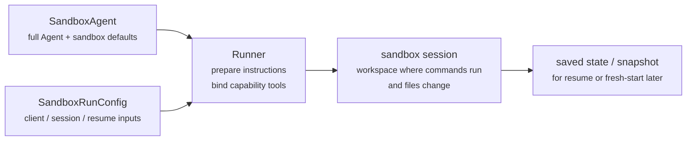
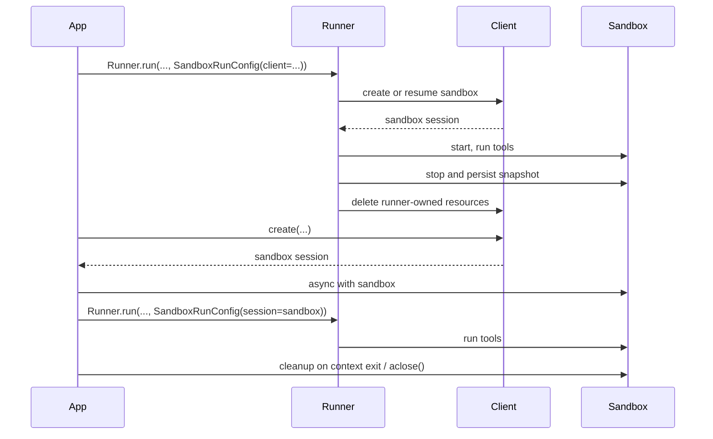

---
search:
  exclude: true
---
# 概念

!!! warning "ベータ機能"

    Sandbox Agents はベータ版です。一般提供前に API 、デフォルト、対応機能の詳細が変更されることがあり、今後さらに高度な機能が追加される予定です。

現代のエージェントは、ファイルシステム上の実際のファイルを操作できるときに最も効果を発揮します。**Sandbox Agents** は、専用ツールやシェルコマンドを利用して、大規模なドキュメント群の検索や操作、ファイル編集、成果物の生成、コマンド実行を行えます。サンドボックスはモデルに永続的なワークスペースを提供し、エージェントがユーザーに代わって作業できるようにします。Agents SDK の Sandbox Agents は、サンドボックス環境と組み合わせたエージェントの実行を簡単にし、適切なファイルをファイルシステムに配置し、サンドボックスの開始、停止、再開をオーケストレーションして、大規模なタスクの実行を容易にします。

ワークスペースは、エージェントが必要とするデータに基づいて定義します。GitHub リポジトリ、ローカルのファイルやディレクトリ、合成されたタスクファイル、 S3 や Azure Blob Storage などのリモートファイルシステム、その他ユーザーが提供するサンドボックス入力を起点にできます。

<div class="sandbox-harness-image" markdown="1">


</div>

`SandboxAgent` は引き続き `Agent` です。`instructions`、`prompt`、`tools`、`handoffs`、`mcp_servers`、`model_settings`、`output_type`、ガードレール、フックといった通常のエージェントの表面 API を維持し、通常の `Runner` API を通じて実行されます。変わるのは実行境界です。

- `SandboxAgent` はエージェント自体を定義します。通常のエージェント設定に加えて、`default_manifest`、`base_instructions`、`run_as` などのサンドボックス固有のデフォルトや、ファイルシステムツール、シェルアクセス、スキル、メモリ、コンパクションなどの機能を含みます。
- `Manifest` は、新しいサンドボックスワークスペースの開始時の内容とレイアウトを宣言し、ファイル、リポジトリ、マウント、環境を含みます。
- sandbox session は、コマンドが実行され、ファイルが変更される生きた分離環境です。
- [`SandboxRunConfig`][agents.run_config.SandboxRunConfig] は、その実行がどのように sandbox session を取得するかを決定します。たとえば、直接注入する、直列化された sandbox session state から再接続する、または sandbox client を通じて新しい sandbox session を作成する、といった方法です。
- 保存済みのサンドボックス状態とスナップショットにより、後続の実行で以前の作業に再接続したり、保存済みの内容から新しい sandbox session を初期化したりできます。

`Manifest` は新規セッション用ワークスペースの契約であり、すべての生きたサンドボックスに対する完全な唯一の情報源ではありません。実行時の実効ワークスペースは、再利用された sandbox session、直列化された sandbox session state、または実行時に選択されたスナップショットから取得されることがあります。

このページ全体でいう "sandbox session" とは、 sandbox client によって管理される生きた実行環境を指します。これは、[Sessions](../sessions/index.md) で説明されている SDK の会話用 [`Session`][agents.memory.session.Session] インターフェースとは異なります。

外側のランタイムは、引き続き承認、トレーシング、ハンドオフ、再開時の管理を担います。sandbox session は、コマンド、ファイル変更、環境の分離を担います。この分離はモデルの中核です。

### 構成要素の適合

サンドボックス実行は、エージェント定義と実行ごとのサンドボックス設定を組み合わせます。ランナーはエージェントを準備し、生きた sandbox session に結び付け、後続の実行のために状態を保存できます。



サンドボックス固有のデフォルトは `SandboxAgent` に保持されます。実行ごとの sandbox session の選択は `SandboxRunConfig` に保持されます。

ライフサイクルは 3 段階で考えるとよいです。

1. `SandboxAgent`、`Manifest`、および機能で、エージェントと新規ワークスペース契約を定義します。
2. `Runner` に `SandboxRunConfig` を渡して実行し、 sandbox session を注入、再開、または作成します。
3. ランナー管理の `RunState`、明示的な sandbox `session_state`、または保存済みワークスペーススナップショットから後で続行します。

シェルアクセスがたまに使うツールの 1 つにすぎない場合は、[tools guide](../tools.md) のホスト型シェルから始めてください。ワークスペース分離、 sandbox client の選択、または sandbox session の再開動作が設計の一部である場合に sandbox agents を選んでください。

## 利用場面

Sandbox agents は、ワークスペース中心のワークフローに適しています。たとえば次のようなものです。

- コーディングとデバッグ。たとえば、 GitHub リポジトリの issue レポートに対する自動修正をエージェントオーケストレーションし、対象を絞ったテストを実行する場合
- ドキュメント処理と編集。たとえば、ユーザーの財務書類から情報を抽出し、記入済みの税務フォーム下書きを作成する場合
- ファイルに基づくレビューや分析。たとえば、オンボーディング資料、生成されたレポート、成果物バンドルを確認してから回答する場合
- 分離されたマルチエージェントパターン。たとえば、各レビュー担当やコーディング用サブエージェントに専用ワークスペースを与える場合
- 複数ステップのワークスペースタスク。たとえば、 1 回の実行でバグを修正し、後で回帰テストを追加する場合や、スナップショットまたは sandbox session state から再開する場合

ファイルや生きたファイルシステムへのアクセスが不要であれば、引き続き `Agent` を使用してください。シェルアクセスがたまに必要な機能にすぎない場合はホスト型シェルを追加し、ワークスペース境界そのものが機能の一部である場合は sandbox agents を使用してください。

## sandbox client の選択

ローカル開発では `UnixLocalSandboxClient` から始めてください。コンテナー分離やイメージの同一性が必要になったら `DockerSandboxClient` に移行します。プロバイダー管理の実行が必要ならホスト型プロバイダーに移行します。

ほとんどの場合、`SandboxAgent` の定義は同じままで、 sandbox client とそのオプションだけが [`SandboxRunConfig`][agents.run_config.SandboxRunConfig] で変わります。ローカル、 Docker 、ホスト型、リモートマウントの選択肢については [Sandbox clients](clients.md) を参照してください。

## 中核要素

<div class="sandbox-nowrap-first-column-table" markdown="1">

| Layer | Main SDK pieces | What it answers |
| --- | --- | --- |
| エージェント定義 | `SandboxAgent`、`Manifest`、機能 | どのエージェントが実行され、どの新規セッション用ワークスペース契約から開始すべきですか。 |
| サンドボックス実行 | `SandboxRunConfig`、 sandbox client 、および生きた sandbox session | この実行はどのように生きた sandbox session を取得し、どこで作業が実行されますか。 |
| 保存済みサンドボックス状態 | `RunState` のサンドボックスペイロード、`session_state`、およびスナップショット | このワークフローはどのように以前のサンドボックス作業に再接続するか、または保存済み内容から新しい sandbox session を初期化しますか。 |

</div>

主な SDK 要素は、これらのレイヤーに次のように対応します。

<div class="sandbox-nowrap-first-column-table" markdown="1">

| Piece | What it owns | Ask this question |
| --- | --- | --- |
| [`SandboxAgent`][agents.sandbox.sandbox_agent.SandboxAgent] | エージェント定義 | このエージェントは何をすべきで、どのデフォルトを一緒に持ち運ぶべきですか。 |
| [`Manifest`][agents.sandbox.manifest.Manifest] | 新規セッション用ワークスペースのファイルとフォルダー | 実行開始時に、ファイルシステム上にどのファイルやフォルダーが存在すべきですか。 |
| [`Capability`][agents.sandbox.capabilities.capability.Capability] | サンドボックスネイティブな動作 | どのツール、指示断片、またはランタイム動作をこのエージェントに付与すべきですか。 |
| [`SandboxRunConfig`][agents.run_config.SandboxRunConfig] | 実行ごとの sandbox client と sandbox session の取得元 | この実行は sandbox session を注入、再開、または作成すべきですか。 |
| [`RunState`][agents.run_state.RunState] | ランナー管理の保存済みサンドボックス状態 | 以前のランナー管理ワークフローを再開し、そのサンドボックス状態を自動的に引き継いでいますか。 |
| [`SandboxRunConfig.session_state`][agents.run_config.SandboxRunConfig.session_state] | 明示的に直列化された sandbox session state | `RunState` の外で既に直列化したサンドボックス状態から再開したいですか。 |
| [`SandboxRunConfig.snapshot`][agents.run_config.SandboxRunConfig.snapshot] | 新しい sandbox session 用の保存済みワークスペース内容 | 新しい sandbox session を保存済みファイルや成果物から開始すべきですか。 |

</div>

実用的な設計順序は次のとおりです。

1. `Manifest` で新規セッション用ワークスペース契約を定義します。
2. `SandboxAgent` でエージェントを定義します。
3. 組み込みまたはカスタムの機能を追加します。
4. 各実行が sandbox session をどのように取得するかを `RunConfig(sandbox=SandboxRunConfig(...))` で決定します。

## サンドボックス実行の準備

実行時、ランナーはその定義を具体的なサンドボックス支援の実行に変換します。

1. `SandboxRunConfig` から sandbox session を解決します。
   `session=...` を渡した場合、その生きた sandbox session を再利用します。
   それ以外では、`client=...` を使って作成または再開します。
2. 実行に対する実効ワークスペース入力を決定します。
   実行が sandbox session を注入または再開する場合、その既存のサンドボックス状態が優先されます。
   それ以外では、ランナーは一度限りの manifest 上書きまたは `agent.default_manifest` から開始します。
   このため、`Manifest` だけではすべての実行の最終的な生きたワークスペースを定義しません。
3. 機能により、結果として得られる manifest を処理します。
   これにより、最終的なエージェントが準備される前に、機能がファイル、マウント、その他のワークスペース範囲の動作を追加できます。
4. 固定順序で最終的な指示を構築します。
   SDK のデフォルトサンドボックスプロンプト、または明示的に上書きした場合は `base_instructions`、次に `instructions`、次に機能の指示断片、次にリモートマウントポリシーのテキスト、最後にレンダリングされたファイルシステムツリーです。
5. 機能ツールを生きた sandbox session に結び付け、準備済みエージェントを通常の `Runner` API で実行します。

サンドボックス化は 1 ターンの意味を変えません。ターンは引き続きモデルの 1 ステップであり、単一のシェルコマンドやサンドボックス操作ではありません。サンドボックス側の操作とターンの間に固定の 1:1 対応はありません。作業の一部はサンドボックス実行レイヤー内に留まり、別のアクションはツール結果、承認、または他の状態を返して、次のモデルステップを必要とすることがあります。実務上は、サンドボックス作業の後にエージェントランタイムが別のモデル応答を必要とするときにのみ、追加のターンが消費されます。

これらの準備手順により、`default_manifest`、`instructions`、`base_instructions`、`capabilities`、`run_as` が、`SandboxAgent` を設計する際に考えるべき主なサンドボックス固有オプションになります。

## `SandboxAgent` オプション

通常の `Agent` フィールドに加えて、サンドボックス固有のオプションは次のとおりです。

<div class="sandbox-nowrap-first-column-table" markdown="1">

| Option | Best use |
| --- | --- |
| `default_manifest` | ランナーが作成する新しい sandbox session のデフォルトワークスペースです。 |
| `instructions` | SDK のサンドボックスプロンプトの後に追加される、役割、ワークフロー、成功条件です。 |
| `base_instructions` | SDK のサンドボックスプロンプトを置き換える高度なエスケープハッチです。 |
| `capabilities` | このエージェントと一緒に持ち運ばれるべき、サンドボックスネイティブなツールと動作です。 |
| `run_as` | シェルコマンド、ファイル読み取り、パッチなどのモデル向けサンドボックスツールに対するユーザー ID です。 |

</div>

sandbox client の選択、 sandbox session の再利用、 manifest の上書き、スナップショットの選択は、エージェントではなく [`SandboxRunConfig`][agents.run_config.SandboxRunConfig] に属します。

### `default_manifest`

`default_manifest` は、ランナーがこのエージェント用に新しい sandbox session を作成するときに使用するデフォルトの [`Manifest`][agents.sandbox.manifest.Manifest] です。エージェントが通常開始時に持つべきファイル、リポジトリ、補助資料、出力ディレクトリ、マウントに使用します。

これはあくまでデフォルトです。実行ごとに `SandboxRunConfig(manifest=...)` で上書きでき、再利用または再開された sandbox session は既存のワークスペース状態を保持します。

### `instructions` と `base_instructions`

`instructions` は、異なるプロンプトをまたいでも維持したい短いルールに使います。`SandboxAgent` では、これらの指示は SDK のサンドボックス基本プロンプトの後に追加されるため、組み込みのサンドボックスガイダンスを維持しつつ、独自の役割、ワークフロー、成功条件を加えられます。

`base_instructions` は、SDK のサンドボックス基本プロンプトを置き換えたい場合にのみ使用します。ほとんどのエージェントでは設定不要です。

<div class="sandbox-nowrap-first-column-table" markdown="1">

| Put it in... | Use it for | Examples |
| --- | --- | --- |
| `instructions` | エージェントの安定した役割、ワークフロールール、成功条件。 | "オンボーディング書類を確認してからハンドオフする。", "最終ファイルを `output/` に書き込む。" |
| `base_instructions` | SDK のサンドボックス基本プロンプトの完全な置き換え。 | カスタムの低レベルサンドボックスラッパープロンプト。 |
| ユーザープロンプト | この実行だけの一度限りの要求。 | "このワークスペースを要約してください。" |
| manifest 内のワークスペースファイル | より長いタスク仕様、リポジトリローカルの指示、または範囲の限定された参考資料。 | `repo/task.md`、ドキュメント一式、サンプルパケット。 |

</div>

`instructions` の良い使い方には次があります。

- [examples/sandbox/unix_local_pty.py](https://github.com/openai/openai-agents-python/blob/main/examples/sandbox/unix_local_pty.py) は、 PTY の状態が重要なときにエージェントを 1 つの対話的プロセス内に保ちます。
- [examples/sandbox/handoffs.py](https://github.com/openai/openai-agents-python/blob/main/examples/sandbox/handoffs.py) は、検査後にサンドボックスレビュワーがユーザーへ直接回答することを禁止します。
- [examples/sandbox/tax_prep.py](https://github.com/openai/openai-agents-python/blob/main/examples/sandbox/tax_prep.py) は、最終的に記入済みファイルが実際に `output/` に配置されることを要求します。
- [examples/sandbox/docs/coding_task.py](https://github.com/openai/openai-agents-python/blob/main/examples/sandbox/docs/coding_task.py) は、正確な検証コマンドを固定し、ワークスペースルート相対のパッチパスを明確にします。

ユーザーの一度限りのタスクを `instructions` にコピーしたり、 manifest に置くべき長い参考資料を埋め込んだり、組み込み機能が既に注入するツール説明を繰り返したり、実行時にモデルが不要なローカルインストールメモを混在させたりすることは避けてください。

`instructions` を省略しても、SDK はデフォルトのサンドボックスプロンプトを含みます。これは低レベルラッパーには十分ですが、ほとんどのユーザー向けエージェントでは、明示的な `instructions` を提供するべきです。

### `capabilities`

機能は、サンドボックスネイティブな動作を `SandboxAgent` に付与します。実行開始前にワークスペースを整えたり、サンドボックス固有の指示を追加したり、生きた sandbox session に結び付くツールを公開したり、そのエージェント向けのモデル動作や入力処理を調整したりできます。

組み込み機能には次があります。

<div class="sandbox-nowrap-first-column-table" markdown="1">

| Capability | Add it when | Notes |
| --- | --- | --- |
| `Shell` | エージェントにシェルアクセスが必要なとき。 | `exec_command` を追加し、 sandbox client が PTY 対話をサポートしている場合は `write_stdin` も追加します。 |
| `Filesystem` | エージェントがファイルを編集したり、ローカル画像を確認したりする必要があるとき。 | `apply_patch` と `view_image` を追加します。パッチパスはワークスペースルート相対です。 |
| `Skills` | サンドボックス内でのスキル検出と実体化が必要なとき。 | サンドボックスローカルな `SKILL.md` スキルでは、`.agents` や `.agents/skills` を手動でマウントするよりこちらを推奨します。 |
| `Memory` | 後続の実行でメモリ成果物を読み取ったり生成したりすべきとき。 | `Shell` が必要です。生きた更新には `Filesystem` も必要です。 |
| `Compaction` | 長時間実行フローで compaction 項目の後にコンテキスト切り詰めが必要なとき。 | モデルのサンプリングと入力処理を調整します。 |

</div>

デフォルトでは、`SandboxAgent.capabilities` は `Capabilities.default()` を使用し、`Filesystem()`、`Shell()`、`Compaction()` を含みます。`capabilities=[...]` を渡すと、そのリストがデフォルトを置き換えるため、必要なデフォルト機能は明示的に含めてください。

スキルについては、どのように実体化したいかに応じてソースを選びます。

- `Skills(lazy_from=LocalDirLazySkillSource(...))` は、大きめのローカルスキルディレクトリに対する良いデフォルトです。モデルが最初にインデックスを検出し、必要なものだけを読み込めるためです。
- `Skills(from_=LocalDir(src=...))` は、最初から配置したい小規模なローカルバンドルに向いています。
- `Skills(from_=GitRepo(repo=..., ref=...))` は、スキル自体をリポジトリから取得したい場合に適しています。

スキルがすでに `.agents/skills/<name>/SKILL.md` のような形でディスク上に存在する場合は、`LocalDir(...)` をそのソースルートに向けたうえで、引き続き `Skills(...)` を使って公開してください。既存のワークスペース契約で別のサンドボックス内レイアウトに依存していない限り、デフォルトの `skills_path=".agents"` を維持してください。

組み込み機能で足りる場合は、それを優先してください。組み込みでカバーできないサンドボックス固有のツールや指示表面が必要な場合にのみ、カスタム機能を書いてください。

## 概念

### Manifest

[`Manifest`][agents.sandbox.manifest.Manifest] は、新しい sandbox session のワークスペースを記述します。ワークスペース `root` を設定し、ファイルやディレクトリを宣言し、ローカルファイルをコピーし、 Git リポジトリをクローンし、リモートストレージマウントを接続し、環境変数を設定し、ユーザーやグループを定義できます。

Manifest エントリのパスはワークスペース相対です。絶対パスにしたり、`..` でワークスペース外へ出たりできないため、ローカル、 Docker 、ホスト型 client 間でワークスペース契約の移植性が保たれます。

作業開始前にエージェントが必要とする資料には manifest エントリを使います。

<div class="sandbox-nowrap-first-column-table" markdown="1">

| Manifest entry | Use it for |
| --- | --- |
| `File`、`Dir` | 小さな合成入力、補助ファイル、または出力ディレクトリ。 |
| `LocalFile`、`LocalDir` | サンドボックス内に実体化すべきホストファイルまたはディレクトリ。 |
| `GitRepo` | ワークスペースに取得すべきリポジトリ。 |
| `S3Mount`、`GCSMount`、`R2Mount`、`AzureBlobMount`、`S3FilesMount` などのマウント | サンドボックス内に現れるべき外部ストレージ。 |

</div>

マウントエントリは公開するストレージを記述し、マウント戦略はサンドボックスバックエンドがそのストレージをどのように接続するかを記述します。マウントオプションとプロバイダー対応については [Sandbox clients](clients.md#mounts-and-remote-storage) を参照してください。

良い manifest 設計とは通常、ワークスペース契約を狭く保ち、長いタスク手順を `repo/task.md` のようなワークスペースファイルに置き、`repo/task.md` や `output/report.md` のようなワークスペース相対パスを指示内で使うことです。エージェントが `Filesystem` 機能の `apply_patch` ツールでファイルを編集する場合、パッチパスはシェルの `workdir` ではなくサンドボックスワークスペースのルート相対であることに注意してください。

### Permissions

`Permissions` は、 manifest エントリのファイルシステム権限を制御します。これはサンドボックスが実体化するファイルに関するものであり、モデル権限、承認ポリシー、 API 資格情報に関するものではありません。

デフォルトでは、 manifest エントリは所有者に対して読み取り、書き込み、実行が許可され、グループおよびその他に対して読み取りと実行が許可されます。配置するファイルを非公開、読み取り専用、または実行可能にしたい場合は上書きしてください。

```python
from agents.sandbox import FileMode, Permissions
from agents.sandbox.entries import File

private_notes = File(
    text="internal notes",
    permissions=Permissions(
        owner=FileMode.READ | FileMode.WRITE,
        group=FileMode.NONE,
        other=FileMode.NONE,
    ),
)
```

`Permissions` は、所有者、グループ、その他のビットと、そのエントリがディレクトリかどうかを個別に保持します。直接構築することも、`Permissions.from_str(...)` でモード文字列から解析することも、`Permissions.from_mode(...)` で OS モードから導出することもできます。

ユーザーは、作業を実行できるサンドボックス内の ID です。その ID をサンドボックス内に存在させたい場合は manifest に `User` を追加し、そのユーザーとしてシェルコマンド、ファイル読み取り、パッチなどのモデル向けサンドボックスツールを実行したい場合は `SandboxAgent.run_as` を設定します。`run_as` が manifest にまだ存在しないユーザーを指している場合、ランナーがそのユーザーを実効 manifest に追加します。

```python
from agents import Runner
from agents.run import RunConfig
from agents.sandbox import FileMode, Manifest, Permissions, SandboxAgent, SandboxRunConfig, User
from agents.sandbox.entries import Dir, LocalDir
from agents.sandbox.sandboxes.unix_local import UnixLocalSandboxClient

analyst = User(name="analyst")

agent = SandboxAgent(
    name="Dataroom analyst",
    instructions="Review the files in `dataroom/` and write findings to `output/`.",
    default_manifest=Manifest(
        # Declare the sandbox user so manifest entries can grant access to it.
        users=[analyst],
        entries={
            "dataroom": LocalDir(
                src="./dataroom",
                # Let the analyst traverse and read the mounted dataroom, but not edit it.
                group=analyst,
                permissions=Permissions(
                    owner=FileMode.READ | FileMode.EXEC,
                    group=FileMode.READ | FileMode.EXEC,
                    other=FileMode.NONE,
                ),
            ),
            "output": Dir(
                # Give the analyst a writable scratch/output directory for artifacts.
                group=analyst,
                permissions=Permissions(
                    owner=FileMode.ALL,
                    group=FileMode.ALL,
                    other=FileMode.NONE,
                ),
            ),
        },
    ),
    # Run model-facing sandbox actions as this user, so those permissions apply.
    run_as=analyst,
)

result = await Runner.run(
    agent,
    "Summarize the contracts and call out renewal dates.",
    run_config=RunConfig(
        sandbox=SandboxRunConfig(client=UnixLocalSandboxClient()),
    ),
)
```

ファイルレベルの共有ルールも必要な場合は、ユーザーと manifest のグループ、およびエントリの `group` メタデータを組み合わせてください。`run_as` ユーザーは誰がサンドボックスネイティブなアクションを実行するかを制御し、`Permissions` はサンドボックスがワークスペースを実体化した後で、そのユーザーがどのファイルを読み取り、書き込み、実行できるかを制御します。

### SnapshotSpec

`SnapshotSpec` は、新しい sandbox session に対して、保存済みワークスペース内容をどこから復元し、どこへ永続化し直すかを指示します。これはサンドボックスワークスペースのスナップショットポリシーであり、`session_state` は特定のサンドボックスバックエンドを再開するための直列化済み接続状態です。

ローカルの永続スナップショットには `LocalSnapshotSpec` を使い、アプリがリモートスナップショット client を提供する場合は `RemoteSnapshotSpec` を使います。ローカルスナップショット設定が利用できない場合は no-op スナップショットがフォールバックとして使われ、ワークスペーススナップショットの永続化を望まない高度な利用者はそれを明示的に使うこともできます。

```python
from pathlib import Path

from agents.run import RunConfig
from agents.sandbox import LocalSnapshotSpec, SandboxRunConfig
from agents.sandbox.sandboxes.unix_local import UnixLocalSandboxClient

run_config = RunConfig(
    sandbox=SandboxRunConfig(
        client=UnixLocalSandboxClient(),
        snapshot=LocalSnapshotSpec(base_path=Path("/tmp/my-sandbox-snapshots")),
    )
)
```

ランナーが新しい sandbox session を作成すると、 sandbox client はそのセッション用のスナップショットインスタンスを構築します。開始時に、スナップショットが復元可能であれば、実行が続く前にサンドボックスが保存済みワークスペース内容を復元します。クリーンアップ時には、ランナー所有の sandbox session がワークスペースをアーカイブし、スナップショットを通じて永続化し直します。

`snapshot` を省略すると、ランタイムは可能であればデフォルトのローカルスナップショット場所を使おうとします。設定できない場合は no-op スナップショットにフォールバックします。マウントされたパスや一時パスは、永続的なワークスペース内容としてスナップショットにコピーされません。

### サンドボックスライフサイクル

ライフサイクルモードは **SDK 所有** と **開発者所有** の 2 つです。

<div class="sandbox-lifecycle-diagram" markdown="1">



</div>

サンドボックスを 1 回の実行だけ存続させればよい場合は、 SDK 所有ライフサイクルを使います。`client`、任意の `manifest`、任意の `snapshot`、および client `options` を渡すと、ランナーがサンドボックスを作成または再開し、起動し、エージェントを実行し、スナップショット支援のワークスペース状態を永続化し、サンドボックスを停止し、ランナー所有リソースのクリーンアップを client に行わせます。

```python
result = await Runner.run(
    agent,
    "Inspect the workspace and summarize what changed.",
    run_config=RunConfig(
        sandbox=SandboxRunConfig(client=UnixLocalSandboxClient()),
    ),
)
```

サンドボックスを先に作成したい場合、複数実行で 1 つの生きたサンドボックスを再利用したい場合、実行後にファイルを確認したい場合、自分で作成したサンドボックス上でストリーミングしたい場合、またはクリーンアップのタイミングを正確に制御したい場合は、開発者所有ライフサイクルを使います。`session=...` を渡すと、ランナーはその生きたサンドボックスを使いますが、代わりに閉じることはしません。

```python
sandbox = await client.create(manifest=agent.default_manifest)

async with sandbox:
    run_config = RunConfig(sandbox=SandboxRunConfig(session=sandbox))
    await Runner.run(agent, "Analyze the files.", run_config=run_config)
    await Runner.run(agent, "Write the final report.", run_config=run_config)
```

通常の形はコンテキストマネージャーです。入場時にサンドボックスを起動し、終了時にセッションクリーンアップライフサイクルを実行します。アプリがコンテキストマネージャーを使えない場合は、ライフサイクルメソッドを直接呼び出してください。

```python
sandbox = await client.create(
    manifest=agent.default_manifest,
    snapshot=LocalSnapshotSpec(base_path=Path("/tmp/my-sandbox-snapshots")),
)
try:
    await sandbox.start()
    await Runner.run(
        agent,
        "Analyze the files.",
        run_config=RunConfig(sandbox=SandboxRunConfig(session=sandbox)),
    )
    # Persist a checkpoint of the live workspace before doing more work.
    # `aclose()` also calls `stop()`, so this is only needed for an explicit mid-lifecycle save.
    await sandbox.stop()
finally:
    await sandbox.aclose()
```

`stop()` はスナップショット支援のワークスペース内容を永続化するだけで、サンドボックス自体は破棄しません。`aclose()` は完全なセッションクリーンアップ経路です。停止前フックを実行し、`stop()` を呼び出し、サンドボックスリソースを停止し、セッションスコープの依存関係を閉じます。

## `SandboxRunConfig` オプション

[`SandboxRunConfig`][agents.run_config.SandboxRunConfig] は、 sandbox session の取得元と、新しいセッションの初期化方法を決定する実行ごとのオプションを保持します。

### サンドボックス取得元

これらのオプションは、ランナーが sandbox session を再利用、再開、または作成すべきかを決定します。

<div class="sandbox-nowrap-first-column-table" markdown="1">

| Option | Use it when | Notes |
| --- | --- | --- |
| `client` | ランナーに sandbox session の作成、再開、クリーンアップを任せたいとき。 | 生きたサンドボックス `session` を渡さない限り必須です。 |
| `session` | すでに生きた sandbox session を自分で作成しているとき。 | 呼び出し側がライフサイクルを所有し、ランナーはその生きた sandbox session を再利用します。 |
| `session_state` | 直列化済みの sandbox session state はあるが、生きた sandbox session オブジェクトはないとき。 | `client` が必要で、ランナーはその明示的な状態から所有セッションとして再開します。 |

</div>

実際には、ランナーは次の順序で sandbox session を解決します。

1. `run_config.sandbox.session` を注入した場合、その生きた sandbox session を直接再利用します。
2. それ以外で、実行が `RunState` から再開される場合は、保存された sandbox session state を再開します。
3. それ以外で、`run_config.sandbox.session_state` を渡した場合は、ランナーがその明示的に直列化された sandbox session state から再開します。
4. それ以外では、ランナーは新しい sandbox session を作成します。その新しいセッションでは、`run_config.sandbox.manifest` があればそれを使い、なければ `agent.default_manifest` を使います。

### 新規セッション入力

これらのオプションは、ランナーが新しい sandbox session を作成するときにのみ意味を持ちます。

<div class="sandbox-nowrap-first-column-table" markdown="1">

| Option | Use it when | Notes |
| --- | --- | --- |
| `manifest` | 新規セッション用ワークスペースを一度だけ上書きしたいとき。 | 省略時は `agent.default_manifest` にフォールバックします。 |
| `snapshot` | 新しい sandbox session をスナップショットから初期化したいとき。 | 再開に近いフローやリモートスナップショット client に有用です。 |
| `options` | sandbox client が作成時オプションを必要とするとき。 | Docker イメージ、 Modal アプリ名、 E2B テンプレート、タイムアウトなど、 client 固有の設定で一般的です。 |

</div>

### 実体化制御

`concurrency_limits` は、どれだけのサンドボックス実体化作業を並列実行できるかを制御します。大きな manifest やローカルディレクトリコピーで、より厳密なリソース制御が必要な場合は `SandboxConcurrencyLimits(manifest_entries=..., local_dir_files=...)` を使います。いずれかの値を `None` にすると、その特定の制限を無効化します。

覚えておくべき含意がいくつかあります。

- 新規セッション: `manifest=` と `snapshot=` は、ランナーが新しい sandbox session を作成するときにのみ適用されます。
- 再開とスナップショット: `session_state=` は以前に直列化したサンドボックス状態に再接続し、`snapshot=` は保存済みワークスペース内容から新しい sandbox session を初期化します。
- client 固有オプション: `options=` は sandbox client に依存します。Docker や多くのホスト型 client では必須です。
- 注入された生きたセッション: 実行中の sandbox `session` を渡した場合、機能駆動の manifest 更新では互換性のある非マウントエントリを追加できます。`manifest.root`、`manifest.environment`、`manifest.users`、`manifest.groups` を変更したり、既存エントリを削除したり、エントリ型を置き換えたり、マウントエントリを追加または変更したりはできません。
- ランナー API: `SandboxAgent` の実行は、引き続き通常の `Runner.run()`、`Runner.run_sync()`、`Runner.run_streamed()` API を使います。

## 完全な例: コーディングタスク

このコーディングスタイルの例は、良いデフォルトの出発点です。

```python
import asyncio
from pathlib import Path

from agents import ModelSettings, Runner
from agents.run import RunConfig
from agents.sandbox import Manifest, SandboxAgent, SandboxRunConfig
from agents.sandbox.capabilities import (
    Capabilities,
    LocalDirLazySkillSource,
    Skills,
)
from agents.sandbox.entries import LocalDir
from agents.sandbox.sandboxes.unix_local import UnixLocalSandboxClient

EXAMPLE_DIR = Path(__file__).resolve().parent
HOST_REPO_DIR = EXAMPLE_DIR / "repo"
HOST_SKILLS_DIR = EXAMPLE_DIR / "skills"
TARGET_TEST_CMD = "sh tests/test_credit_note.sh"


def build_agent(model: str) -> SandboxAgent[None]:
    return SandboxAgent(
        name="Sandbox engineer",
        model=model,
        instructions=(
            "Inspect the repo, make the smallest correct change, run the most relevant checks, "
            "and summarize the file changes and risks. "
            "Read `repo/task.md` before editing files. Stay grounded in the repository, preserve "
            "existing behavior, and mention the exact verification command you ran. "
            "Use the `$credit-note-fixer` skill before editing files. If the repo lives under "
            "`repo/`, remember that `apply_patch` paths stay relative to the sandbox workspace "
            "root, so edits still target `repo/...`."
        ),
        # Put repos and task files in the manifest.
        default_manifest=Manifest(
            entries={
                "repo": LocalDir(src=HOST_REPO_DIR),
            }
        ),
        capabilities=Capabilities.default() + [
            # Let Skills(...) stage and index sandbox-local skills for you.
            Skills(
                lazy_from=LocalDirLazySkillSource(
                    source=LocalDir(src=HOST_SKILLS_DIR),
                )
            ),
        ],
        model_settings=ModelSettings(tool_choice="required"),
    )


async def main(model: str, prompt: str) -> None:
    result = await Runner.run(
        build_agent(model),
        prompt,
        run_config=RunConfig(
            sandbox=SandboxRunConfig(client=UnixLocalSandboxClient()),
            workflow_name="Sandbox coding example",
        ),
    )
    print(result.final_output)


if __name__ == "__main__":
    asyncio.run(
        main(
            model="gpt-5.4",
            prompt=(
                "Open `repo/task.md`, use the `$credit-note-fixer` skill, fix the bug, "
                f"run `{TARGET_TEST_CMD}`, and summarize the change."
            ),
        )
    )
```

[examples/sandbox/docs/coding_task.py](https://github.com/openai/openai-agents-python/blob/main/examples/sandbox/docs/coding_task.py) を参照してください。この例では、 Unix ローカル実行間で決定的に検証できるよう、小さなシェルベースのリポジトリを使っています。もちろん、実際のタスクリポジトリは Python 、 JavaScript 、その他何でも構いません。

## 一般的なパターン

まずは上の完全な例から始めてください。多くの場合、同じ `SandboxAgent` はそのままで、 sandbox client 、 sandbox session の取得元、またはワークスペースの取得元だけが変わります。

### sandbox client の切り替え

エージェント定義はそのままにし、 run config だけを変更します。コンテナー分離やイメージの同一性が欲しいときは Docker を使い、プロバイダー管理の実行が欲しいときはホスト型プロバイダーを使います。例とプロバイダーオプションについては [Sandbox clients](clients.md) を参照してください。

### ワークスペースの上書き

エージェント定義はそのままにし、新規セッション用 manifest だけを差し替えます。

```python
from agents.run import RunConfig
from agents.sandbox import Manifest, SandboxRunConfig
from agents.sandbox.entries import GitRepo
from agents.sandbox.sandboxes.unix_local import UnixLocalSandboxClient

run_config = RunConfig(
    sandbox=SandboxRunConfig(
        client=UnixLocalSandboxClient(),
        manifest=Manifest(
            entries={
                "repo": GitRepo(repo="openai/openai-agents-python", ref="main"),
            }
        ),
    ),
)
```

同じエージェントの役割を、エージェントを再構築せずに別のリポジトリ、資料パケット、またはタスクバンドルに対して実行したいときに使います。上の検証付きコーディング例では、一度限りの上書きではなく `default_manifest` を使って同じパターンを示しています。

### sandbox session の注入

明示的なライフサイクル制御、実行後の確認、または出力コピーが必要な場合は、生きた sandbox session を注入します。

```python
from agents import Runner
from agents.run import RunConfig
from agents.sandbox import SandboxRunConfig
from agents.sandbox.sandboxes.unix_local import UnixLocalSandboxClient

client = UnixLocalSandboxClient()
sandbox = await client.create(manifest=agent.default_manifest)

async with sandbox:
    result = await Runner.run(
        agent,
        prompt,
        run_config=RunConfig(
            sandbox=SandboxRunConfig(session=sandbox),
        ),
    )
```

実行後にワークスペースを確認したい場合や、すでに開始済みの sandbox session 上でストリーミングしたい場合に使います。[examples/sandbox/docs/coding_task.py](https://github.com/openai/openai-agents-python/blob/main/examples/sandbox/docs/coding_task.py) と [examples/sandbox/docker/docker_runner.py](https://github.com/openai/openai-agents-python/blob/main/examples/sandbox/docker/docker_runner.py) を参照してください。

### session state からの再開

`RunState` の外で既にサンドボックス状態を直列化している場合は、ランナーにその状態から再接続させます。

```python
from agents.run import RunConfig
from agents.sandbox import SandboxRunConfig

serialized = load_saved_payload()
restored_state = client.deserialize_session_state(serialized)

run_config = RunConfig(
    sandbox=SandboxRunConfig(
        client=client,
        session_state=restored_state,
    ),
)
```

サンドボックス状態がユーザー独自のストレージやジョブシステムにあり、`Runner` にそれを直接再開させたい場合に使います。直列化 / 復元フローについては [examples/sandbox/extensions/blaxel_runner.py](https://github.com/openai/openai-agents-python/blob/main/examples/sandbox/extensions/blaxel_runner.py) を参照してください。

### スナップショットからの開始

保存済みファイルや成果物から新しいサンドボックスを初期化します。

```python
from pathlib import Path

from agents.run import RunConfig
from agents.sandbox import LocalSnapshotSpec, SandboxRunConfig
from agents.sandbox.sandboxes.unix_local import UnixLocalSandboxClient

run_config = RunConfig(
    sandbox=SandboxRunConfig(
        client=UnixLocalSandboxClient(),
        snapshot=LocalSnapshotSpec(base_path=Path("/tmp/my-sandbox-snapshot")),
    ),
)
```

新しい実行を `agent.default_manifest` だけでなく保存済みワークスペース内容から開始したい場合に使います。ローカルスナップショットフローは [examples/sandbox/memory.py](https://github.com/openai/openai-agents-python/blob/main/examples/sandbox/memory.py)、リモートスナップショット client は [examples/sandbox/sandbox_agent_with_remote_snapshot.py](https://github.com/openai/openai-agents-python/blob/main/examples/sandbox/sandbox_agent_with_remote_snapshot.py) を参照してください。

### Git からのスキル読み込み

ローカルスキルソースを、リポジトリ支援のものに差し替えます。

```python
from agents.sandbox.capabilities import Capabilities, Skills
from agents.sandbox.entries import GitRepo

capabilities = Capabilities.default() + [
    Skills(from_=GitRepo(repo="sdcoffey/tax-prep-skills", ref="main")),
]
```

スキルバンドル自体に独自のリリースサイクルがある場合や、複数のサンドボックスで共有したい場合に使います。[examples/sandbox/tax_prep.py](https://github.com/openai/openai-agents-python/blob/main/examples/sandbox/tax_prep.py) を参照してください。

### ツールとしての公開

ツールエージェントは、独自のサンドボックス境界を持つことも、親実行から生きたサンドボックスを再利用することもできます。再利用は、高速な読み取り専用の explorer agent に便利です。別のサンドボックスを作成、実体化、スナップショットするコストを払わずに、親が使っている正確なワークスペースを確認できます。

```python
from agents import Runner
from agents.run import RunConfig
from agents.sandbox import FileMode, Manifest, Permissions, SandboxAgent, SandboxRunConfig, User
from agents.sandbox.entries import Dir, File
from agents.sandbox.sandboxes.unix_local import UnixLocalSandboxClient

coordinator = User(name="coordinator")
explorer = User(name="explorer")

manifest = Manifest(
    users=[coordinator, explorer],
    entries={
        "pricing_packet": Dir(
            group=coordinator,
            permissions=Permissions(
                owner=FileMode.ALL,
                group=FileMode.ALL,
                other=FileMode.READ | FileMode.EXEC,
                directory=True,
            ),
            children={
                "pricing.md": File(
                    content=b"Pricing packet contents...",
                    group=coordinator,
                    permissions=Permissions(
                        owner=FileMode.ALL,
                        group=FileMode.ALL,
                        other=FileMode.READ,
                    ),
                ),
            },
        ),
        "work": Dir(
            group=coordinator,
            permissions=Permissions(
                owner=FileMode.ALL,
                group=FileMode.ALL,
                other=FileMode.NONE,
                directory=True,
            ),
        ),
    },
)

pricing_explorer = SandboxAgent(
    name="Pricing Explorer",
    instructions="Read `pricing_packet/` and summarize commercial risk. Do not edit files.",
    run_as=explorer,
)

client = UnixLocalSandboxClient()
sandbox = await client.create(manifest=manifest)

async with sandbox:
    shared_run_config = RunConfig(
        sandbox=SandboxRunConfig(session=sandbox),
    )

    orchestrator = SandboxAgent(
        name="Revenue Operations Coordinator",
        instructions="Coordinate the review and write final notes to `work/`.",
        run_as=coordinator,
        tools=[
            pricing_explorer.as_tool(
                tool_name="review_pricing_packet",
                tool_description="Inspect the pricing packet and summarize commercial risk.",
                run_config=shared_run_config,
                max_turns=2,
            ),
        ],
    )

    result = await Runner.run(
        orchestrator,
        "Review the pricing packet, then write final notes to `work/summary.md`.",
        run_config=shared_run_config,
    )
```

ここでは、親エージェントは `coordinator` として実行され、 explorer ツールエージェントは同じ生きた sandbox session の中で `explorer` として実行されます。`pricing_packet/` のエントリは `other` ユーザーに対して読み取り可能なので、 explorer はそれらを素早く確認できますが、書き込みビットはありません。`work/` ディレクトリは coordinator のユーザー / グループにのみ利用可能なので、親は最終成果物を書き込めますが、 explorer は読み取り専用のままです。

ツールエージェントに本当の分離が必要な場合は、独自のサンドボックス `RunConfig` を与えてください。

```python
from docker import from_env as docker_from_env

from agents.run import RunConfig
from agents.sandbox import SandboxRunConfig
from agents.sandbox.sandboxes.docker import DockerSandboxClient, DockerSandboxClientOptions

rollout_agent.as_tool(
    tool_name="review_rollout_risk",
    tool_description="Inspect the rollout packet and summarize implementation risk.",
    run_config=RunConfig(
        sandbox=SandboxRunConfig(
            client=DockerSandboxClient(docker_from_env()),
            options=DockerSandboxClientOptions(image="python:3.14-slim"),
        ),
    ),
)
```

ツールエージェントに自由な変更を許したい場合、信頼できないコマンドを実行させたい場合、または別のバックエンド / イメージを使わせたい場合は、別のサンドボックスを使います。[examples/sandbox/sandbox_agents_as_tools.py](https://github.com/openai/openai-agents-python/blob/main/examples/sandbox/sandbox_agents_as_tools.py) を参照してください。

### ローカルツールおよび MCP との組み合わせ

同じエージェントで通常のツールを使いながら、サンドボックスワークスペースも維持します。

```python
from agents.sandbox import SandboxAgent
from agents.sandbox.capabilities import Shell

agent = SandboxAgent(
    name="Workspace reviewer",
    instructions="Inspect the workspace and call host tools when needed.",
    tools=[get_discount_approval_path],
    mcp_servers=[server],
    capabilities=[Shell()],
)
```

ワークスペース確認がエージェントの仕事の一部にすぎない場合に使います。[examples/sandbox/sandbox_agent_with_tools.py](https://github.com/openai/openai-agents-python/blob/main/examples/sandbox/sandbox_agent_with_tools.py) を参照してください。

## メモリ

将来の sandbox-agent 実行が過去の実行から学習すべき場合は、`Memory` 機能を使います。メモリは SDK の会話用 `Session` メモリとは別です。学んだことをサンドボックスワークスペース内のファイルへ要約し、後続の実行でそれらのファイルを読み取れるようにします。

設定、読み取り / 生成動作、複数ターン会話、レイアウト分離については [Agent memory](memory.md) を参照してください。

## 構成パターン

単一エージェントのパターンが明確になったら、次の設計上の問いは、より大きなシステムの中でサンドボックス境界をどこに置くかです。

Sandbox agents は引き続き SDK の他の部分と組み合わせられます。

- [Handoffs](../handoffs.md): サンドボックスなしの受付エージェントから、ドキュメント量の多い作業をサンドボックスレビュワーへハンドオフします。
- [Agents as tools](../tools.md#agents-as-tools): 複数の sandbox agents をツールとして公開します。通常は各 `Agent.as_tool(...)` 呼び出しで `run_config=RunConfig(sandbox=SandboxRunConfig(...))` を渡し、各ツールが独自のサンドボックス境界を持つようにします。
- [MCP](../mcp.md) と通常の関数ツール: サンドボックス機能は `mcp_servers` や通常の Python ツールと共存できます。
- [Running agents](../running_agents.md): サンドボックス実行でも通常の `Runner` API を使います。

特に一般的なパターンは 2 つです。

- ワークスペース分離が必要な部分にだけ、サンドボックスなしエージェントから sandbox agent へハンドオフする
- オーケストレーターが複数の sandbox agents をツールとして公開し、通常は各 `Agent.as_tool(...)` 呼び出しごとに別のサンドボックス `RunConfig` を使って、各ツールに独立したワークスペースを与える

### ターンとサンドボックス実行

ハンドオフと agent-as-tool 呼び出しは分けて考えると理解しやすくなります。

ハンドオフでは、引き続き 1 つのトップレベル実行と 1 つのトップレベルターンループがあります。アクティブなエージェントは変わりますが、実行が入れ子になるわけではありません。サンドボックスなしの受付エージェントがサンドボックスレビュワーへハンドオフすると、その同じ実行内の次のモデル呼び出しは sandbox agent 用に準備され、その sandbox agent が次のターンを担当します。つまり、ハンドオフは同じ実行の次のターンをどのエージェントが所有するかを変えます。[examples/sandbox/handoffs.py](https://github.com/openai/openai-agents-python/blob/main/examples/sandbox/handoffs.py) を参照してください。

`Agent.as_tool(...)` では関係が異なります。外側のオーケストレーターは 1 つの外側ターンを使ってツール呼び出しを決定し、そのツール呼び出しが sandbox agent の入れ子実行を開始します。入れ子実行は独自のターンループ、`max_turns`、承認、そして通常は独自のサンドボックス `RunConfig` を持ちます。 1 回の入れ子ターンで終わることもあれば、複数回かかることもあります。外側のオーケストレーターの視点では、それらすべての作業は引き続き 1 回のツール呼び出しの背後にあるため、入れ子ターンは外側実行のターンカウンターを増やしません。[examples/sandbox/sandbox_agents_as_tools.py](https://github.com/openai/openai-agents-python/blob/main/examples/sandbox/sandbox_agents_as_tools.py) を参照してください。

承認動作も同じ分離に従います。

- ハンドオフでは、 sandbox agent がその実行のアクティブエージェントになるため、承認は同じトップレベル実行に留まります
- `Agent.as_tool(...)` では、 sandbox ツールエージェント内で発生した承認も外側実行に現れますが、それらは保存済みの入れ子実行状態から来ており、外側実行が再開されると入れ子 sandbox 実行も再開されます

## 参考資料

- [Quickstart](quickstart.md): 1 つの sandbox agent を動かします。
- [Sandbox clients](clients.md): ローカル、 Docker 、ホスト型、マウントの選択肢を選びます。
- [Agent memory](memory.md): 過去の sandbox 実行から学んだことを保存して再利用します。
- [examples/sandbox/](https://github.com/openai/openai-agents-python/tree/main/examples/sandbox): 実行可能なローカル、コーディング、メモリ、ハンドオフ、エージェント構成パターンです。