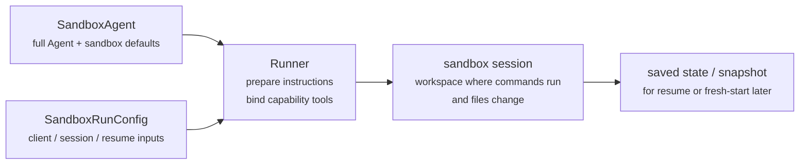
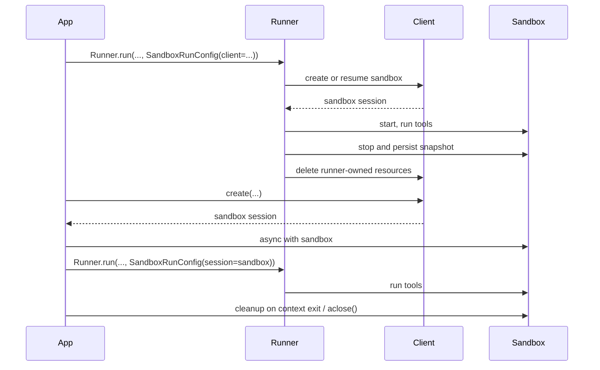

---
search:
  exclude: true
---
# 概念

!!! warning "ベータ機能"

    SandboxAgent はベータ版です。一般提供までに API 、デフォルト、対応機能の詳細は変更される可能性があり、時間とともにより高度な機能が追加される見込みです。

現代のエージェントは、ファイルシステム上の実ファイルを扱えるときに最も効果的に動作します。 **Sandbox Agents** は、特化したツールやシェルコマンドを利用して、大規模なドキュメント集合の検索や操作、ファイル編集、成果物の生成、コマンド実行を行えます。サンドボックスは、モデルに永続的なワークスペースを提供し、エージェントがユーザーに代わって作業できるようにします。Agents SDK の Sandbox Agents は、サンドボックス環境と組み合わせたエージェントの実行を容易にし、ファイルシステム上に適切なファイルを配置しやすくするとともに、サンドボックスの開始、停止、再開を大規模に簡単にオーケストレーションできるようにします。

ワークスペースは、エージェントが必要とするデータを中心に定義します。GitHub リポジトリ、ローカルファイルやディレクトリ、合成タスクファイル、 S3 や Azure Blob Storage などのリモートファイルシステム、その他ユーザーが提供するサンドボックス入力から開始できます。

<div class="sandbox-harness-image" markdown="1">


</div>

`SandboxAgent` は引き続き `Agent` です。`instructions` 、 `prompt` 、 `tools` 、 `handoffs` 、 `mcp_servers` 、 `model_settings` 、 `output_type` 、ガードレール、フックといった通常のエージェント表面を維持し、通常の `Runner` API を通じて実行されます。変わるのは実行境界です。

- `SandboxAgent` はエージェント自体を定義します。通常のエージェント設定に加え、`default_manifest` 、 `base_instructions` 、 `run_as` などのサンドボックス固有のデフォルトや、ファイルシステムツール、シェルアクセス、スキル、メモリ、コンパクションなどの機能を含みます。
- `Manifest` は、新しいサンドボックスワークスペースの望ましい初期内容とレイアウトを宣言します。これには、ファイル、リポジトリ、マウント、環境が含まれます。
- サンドボックスセッションは、コマンドが実行されファイルが変更される、稼働中の分離環境です。
- [`SandboxRunConfig`][agents.run_config.SandboxRunConfig] は、実行がどのようにそのサンドボックスセッションを取得するかを決定します。たとえば、直接注入する、直列化されたサンドボックスセッション状態から再接続する、またはサンドボックスクライアントを通じて新しいサンドボックスセッションを作成する、などです。
- 保存済みのサンドボックス状態とスナップショットにより、後続の実行で以前の作業に再接続したり、保存済み内容から新しいサンドボックスセッションを初期化したりできます。

`Manifest` は新規セッション用ワークスペースの契約であり、すべての稼働中サンドボックスの完全な真実の源泉ではありません。実行時の実効ワークスペースは、再利用されたサンドボックスセッション、直列化されたサンドボックスセッション状態、または実行時に選ばれたスナップショットから決まることがあります。

このページ全体で、「サンドボックスセッション」はサンドボックスクライアントが管理する稼働中の実行環境を意味します。これは [Sessions](../sessions/index.md) で説明されている SDK の会話用 [`Session`][agents.memory.session.Session] インターフェースとは異なります。

外側のランタイムは、引き続き承認、トレーシング、ハンドオフ、再開の管理を担います。サンドボックスセッションは、コマンド、ファイル変更、環境分離を担います。この分離はモデルの中核です。

### 各要素の適合

サンドボックス実行は、エージェント定義と実行ごとのサンドボックス設定を組み合わせます。ランナーはエージェントを準備し、稼働中のサンドボックスセッションに結び付け、後続の実行のために状態を保存できます。



サンドボックス固有のデフォルトは `SandboxAgent` に残ります。実行ごとのサンドボックスセッション選択は `SandboxRunConfig` に残ります。

ライフサイクルは 3 つのフェーズで考えるとよいです。

1. `SandboxAgent` 、 `Manifest` 、機能を使って、エージェントと新規ワークスペース契約を定義します。
2. `SandboxRunConfig` を `Runner` に渡して、サンドボックスセッションを注入、再開、または作成して実行します。
3. ランナー管理の `RunState` 、明示的なサンドボックス `session_state` 、または保存済みワークスペーススナップショットから後で続行します。

シェルアクセスが単なる補助的なツールの 1 つにすぎない場合は、まず [tools guide](../tools.md) のホスト型シェルから始めてください。ワークスペース分離、サンドボックスクライアントの選択、またはサンドボックスセッションの再開動作が設計の一部である場合に、サンドボックスエージェントを使ってください。

## 利用場面

サンドボックスエージェントは、たとえば次のようなワークスペース中心のワークフローに適しています。

- コーディングとデバッグ。たとえば、 GitHub リポジトリの issue レポートに対する自動修正をエージェントオーケストレーションし、対象を絞ったテストを実行する場合
- ドキュメント処理と編集。たとえば、ユーザーの財務書類から情報を抽出し、記入済みの税務フォーム下書きを作成する場合
- ファイルに基づくレビューや分析。たとえば、オンボーディングパケット、生成レポート、成果物バンドルを確認してから回答する場合
- 分離されたマルチエージェントパターン。たとえば、各レビュアーやコーディング用サブエージェントにそれぞれ専用ワークスペースを与える場合
- 複数ステップのワークスペースタスク。たとえば、ある実行でバグを修正し、後で回帰テストを追加する場合、またはスナップショットやサンドボックスセッション状態から再開する場合

ファイルや生きたファイルシステムへのアクセスが不要であれば、引き続き `Agent` を使用してください。シェルアクセスが単発的な機能にすぎないならホスト型シェルを追加し、ワークスペース境界自体が機能の一部ならサンドボックスエージェントを使用してください。

## サンドボックスクライアントの選択

ローカル開発では `UnixLocalSandboxClient` から始めてください。コンテナ分離やイメージの同一性が必要になったら `DockerSandboxClient` に移行します。プロバイダー管理の実行が必要ならホスト型プロバイダーに移行します。

多くの場合、`SandboxAgent` の定義自体は変わらず、[`SandboxRunConfig`][agents.run_config.SandboxRunConfig] 内のサンドボックスクライアントとそのオプションだけが変わります。ローカル、 Docker 、ホスト型、リモートマウントの各選択肢については [Sandbox clients](clients.md) を参照してください。

## 中核要素

<div class="sandbox-nowrap-first-column-table" markdown="1">

| レイヤー | 主な SDK 要素 | 答える内容 |
| --- | --- | --- |
| エージェント定義 | `SandboxAgent` 、 `Manifest` 、機能 | どのエージェントが実行されるべきか、またどのような新規セッション用ワークスペース契約から開始すべきか。 |
| サンドボックス実行 | `SandboxRunConfig` 、サンドボックスクライアント、稼働中のサンドボックスセッション | この実行はどのように稼働中のサンドボックスセッションを取得し、作業はどこで実行されるのか。 |
| 保存済みサンドボックス状態 | `RunState` のサンドボックスペイロード、 `session_state` 、スナップショット | このワークフローはどのように以前のサンドボックス作業に再接続するか、または保存済み内容から新しいサンドボックスセッションを初期化するか。 |

</div>

主な SDK 要素は、これらのレイヤーに次のように対応します。

<div class="sandbox-nowrap-first-column-table" markdown="1">

| 要素 | 管理対象 | 確認すべき質問 |
| --- | --- | --- |
| [`SandboxAgent`][agents.sandbox.sandbox_agent.SandboxAgent] | エージェント定義 | このエージェントは何をすべきで、どのデフォルトを持ち運ぶべきか。 |
| [`Manifest`][agents.sandbox.manifest.Manifest] | 新規セッション用ワークスペースのファイルとフォルダー | 実行開始時にファイルシステム上にどのファイルやフォルダーが存在すべきか。 |
| [`Capability`][agents.sandbox.capabilities.capability.Capability] | サンドボックスネイティブな挙動 | このエージェントにどのツール、指示断片、またはランタイム動作を付与すべきか。 |
| [`SandboxRunConfig`][agents.run_config.SandboxRunConfig] | 実行ごとのサンドボックスクライアントとサンドボックスセッションの取得元 | この実行はサンドボックスセッションを注入、再開、作成のいずれにすべきか。 |
| [`RunState`][agents.run_state.RunState] | ランナー管理の保存済みサンドボックス状態 | 以前のランナー管理ワークフローを再開し、そのサンドボックス状態を自動的に引き継いでいるか。 |
| [`SandboxRunConfig.session_state`][agents.run_config.SandboxRunConfig.session_state] | 明示的に直列化されたサンドボックスセッション状態 | `RunState` の外で既に直列化したサンドボックス状態から再開したいか。 |
| [`SandboxRunConfig.snapshot`][agents.run_config.SandboxRunConfig.snapshot] | 新しいサンドボックスセッション用の保存済みワークスペース内容 | 新しいサンドボックスセッションを保存済みファイルや成果物から開始すべきか。 |

</div>

実践的な設計順序は次のとおりです。

1. `Manifest` で新規セッション用ワークスペース契約を定義します。
2. `SandboxAgent` でエージェントを定義します。
3. 組み込みまたはカスタム機能を追加します。
4. `RunConfig(sandbox=SandboxRunConfig(...))` で、各実行がどのようにサンドボックスセッションを取得するか決めます。

## サンドボックス実行の準備方法

実行時には、ランナーがその定義を具体的なサンドボックス対応実行に変換します。

1. `SandboxRunConfig` からサンドボックスセッションを解決します。  
   `session=...` を渡した場合は、その稼働中サンドボックスセッションを再利用します。  
   それ以外の場合は `client=...` を使って作成または再開します。
2. 実行に対する実効ワークスペース入力を決定します。  
   実行がサンドボックスセッションを注入または再開する場合、その既存のサンドボックス状態が優先されます。  
   そうでなければ、ランナーは一時的な manifest 上書きまたは `agent.default_manifest` から開始します。  
   これが、`Manifest` 単体ではすべての実行における最終的な稼働中ワークスペースを定義しない理由です。
3. 機能に対して、結果の manifest を処理させます。  
   これにより、最終的なエージェント準備の前に、機能がファイル、マウント、その他ワークスペーススコープの挙動を追加できます。
4. 最終的な指示を固定順序で構築します。  
   SDK のデフォルトサンドボックスプロンプト、または明示的に上書きした場合は `base_instructions` 、その後に `instructions` 、機能による指示断片、リモートマウントポリシー文言、最後にレンダリングされたファイルシステムツリーです。
5. 機能ツールを稼働中サンドボックスセッションにバインドし、準備済みエージェントを通常の `Runner` API で実行します。

サンドボックス化は 1 ターンの意味を変えません。ターンは依然としてモデルの 1 ステップであり、単一のシェルコマンドやサンドボックス操作ではありません。サンドボックス側の操作とターンの間に固定の 1 対 1 対応はありません。作業の一部はサンドボックス実行レイヤー内に留まり、他の操作はツール結果、承認、または別のモデルステップを必要とする状態を返すことがあります。実務上の目安としては、サンドボックス作業の後にエージェントランタイムが別のモデル応答を必要とするときにのみ、次のターンが消費されます。

これらの準備ステップがあるため、`default_manifest` 、 `instructions` 、 `base_instructions` 、 `capabilities` 、 `run_as` は、`SandboxAgent` を設計する際に主に検討すべきサンドボックス固有のオプションです。

## `SandboxAgent` オプション

これらは通常の `Agent` フィールドに加わるサンドボックス固有のオプションです。

<div class="sandbox-nowrap-first-column-table" markdown="1">

| オプション | 最適な用途 |
| --- | --- |
| `default_manifest` | ランナーが作成する新しいサンドボックスセッションのデフォルトワークスペース。 |
| `instructions` | SDK サンドボックスプロンプトの後に追加される、役割、ワークフロー、成功条件。 |
| `base_instructions` | SDK サンドボックスプロンプトを置き換える高度なエスケープハッチ。 |
| `capabilities` | このエージェントとともに持ち運ぶべき、サンドボックスネイティブなツールと挙動。 |
| `run_as` | シェルコマンド、ファイル読み取り、パッチなどのモデル向けサンドボックスツールに使うユーザー ID 。 |

</div>

サンドボックスクライアントの選択、サンドボックスセッションの再利用、 manifest の上書き、スナップショットの選択は、エージェント上ではなく [`SandboxRunConfig`][agents.run_config.SandboxRunConfig] に属します。

### `default_manifest`

`default_manifest` は、このエージェント用にランナーが新しいサンドボックスセッションを作成するときに使うデフォルトの [`Manifest`][agents.sandbox.manifest.Manifest] です。エージェントが通常開始時に持つべきファイル、リポジトリ、補助資料、出力ディレクトリ、マウントに使います。

これはあくまでデフォルトです。実行ごとに `SandboxRunConfig(manifest=...)` で上書きでき、再利用または再開されたサンドボックスセッションは既存のワークスペース状態を保持します。

### `instructions` と `base_instructions`

`instructions` は、異なるプロンプトでも維持したい短いルールに使います。`SandboxAgent` では、これらの指示は SDK のサンドボックスベースプロンプトの後に追加されるため、組み込みのサンドボックスガイダンスを維持しつつ、独自の役割、ワークフロー、成功条件を追加できます。

`base_instructions` は、SDK のサンドボックスベースプロンプトを置き換えたい場合にのみ使用してください。ほとんどのエージェントでは設定不要です。

<div class="sandbox-nowrap-first-column-table" markdown="1">

| 入れる場所 | 用途 | 例 |
| --- | --- | --- |
| `instructions` | エージェントの安定した役割、ワークフロールール、成功条件。 | 「オンボーディング文書を確認してからハンドオフする。」、 「最終ファイルを `output/` に書き込む。」 |
| `base_instructions` | SDK サンドボックスベースプロンプトの完全な置き換え。 | カスタムの低レベルなサンドボックスラッパープロンプト。 |
| ユーザープロンプト | この実行だけの単発リクエスト。 | 「このワークスペースを要約してください。」 |
| manifest 内のワークスペースファイル | より長いタスク仕様、リポジトリローカルの指示、または限定された参考資料。 | `repo/task.md` 、文書バンドル、サンプルパケット。 |

</div>

`instructions` のよい用途の例は次のとおりです。

- [examples/sandbox/unix_local_pty.py](https://github.com/openai/openai-agents-python/blob/main/examples/sandbox/unix_local_pty.py) では、 PTY 状態が重要な場合に、エージェントを 1 つの対話型プロセス内に維持します。
- [examples/sandbox/handoffs.py](https://github.com/openai/openai-agents-python/blob/main/examples/sandbox/handoffs.py) では、サンドボックスレビュアーが確認後にユーザーへ直接回答することを禁止します。
- [examples/sandbox/tax_prep.py](https://github.com/openai/openai-agents-python/blob/main/examples/sandbox/tax_prep.py) では、最終的に記入済みファイルが実際に `output/` に配置されることを要求します。
- [examples/sandbox/docs/coding_task.py](https://github.com/openai/openai-agents-python/blob/main/examples/sandbox/docs/coding_task.py) では、正確な検証コマンドを固定し、ワークスペースルート相対のパッチパスを明確にします。

ユーザーの単発タスクを `instructions` にコピーしたり、 manifest に置くべき長い参考資料を埋め込んだり、組み込み機能が既に注入するツールドキュメントを言い換えたり、実行時にモデルが必要としないローカルインストールメモを混在させたりするのは避けてください。

`instructions` を省略しても、SDK はデフォルトのサンドボックスプロンプトを含みます。これは低レベルラッパーには十分ですが、ほとんどのユーザー向けエージェントでは明示的な `instructions` を提供するべきです。

### `capabilities`

機能は、サンドボックスネイティブな挙動を `SandboxAgent` に付与します。実行開始前にワークスペースを形成し、サンドボックス固有の指示を追加し、稼働中のサンドボックスセッションにバインドされるツールを公開し、そのエージェント向けにモデル挙動や入力処理を調整できます。

組み込み機能には次が含まれます。

<div class="sandbox-nowrap-first-column-table" markdown="1">

| 機能 | 追加する場面 | 注記 |
| --- | --- | --- |
| `Shell` | エージェントにシェルアクセスが必要な場合。 | `exec_command` を追加し、サンドボックスクライアントが PTY 対話をサポートする場合は `write_stdin` も追加します。 |
| `Filesystem` | エージェントがファイル編集やローカル画像確認を行う必要がある場合。 | `apply_patch` と `view_image` を追加します。パッチパスはワークスペースルート相対です。 |
| `Skills` | サンドボックス内でスキルの検出と実体化を行いたい場合。 | `.agents` や `.agents/skills` を手動でマウントするよりこちらを推奨します。`Skills` はスキルをインデックス化し、サンドボックス内に実体化します。 |
| `Memory` | 後続の実行でメモリ成果物を読み取ったり生成したりする必要がある場合。 | `Shell` が必要です。ライブ更新には `Filesystem` も必要です。 |
| `Compaction` | 長時間実行フローで compaction 項目の後にコンテキストの切り詰めが必要な場合。 | モデルサンプリングと入力処理を調整します。 |

</div>

デフォルトでは、`SandboxAgent.capabilities` は `Capabilities.default()` を使い、`Filesystem()` 、 `Shell()` 、 `Compaction()` を含みます。`capabilities=[...]` を渡すとそのリストがデフォルトを置き換えるため、必要なデフォルト機能を引き続き含めてください。

スキルについては、どのように実体化したいかに応じてソースを選びます。

- `Skills(lazy_from=LocalDirLazySkillSource(...))` は、大規模なローカルスキルディレクトリのよいデフォルトです。モデルはまずインデックスを確認し、必要なものだけを読み込めます。
- `LocalDirLazySkillSource(source=LocalDir(src=...))` は、SDK プロセスが実行されているファイルシステムから読み取ります。サンドボックスイメージやワークスペース内にしか存在しないパスではなく、元のホスト側スキルディレクトリを渡してください。
- `Skills(from_=LocalDir(src=...))` は、事前に配置したい小さなローカルバンドルに適しています。
- `Skills(from_=GitRepo(repo=..., ref=...))` は、スキル自体をリポジトリから取得すべき場合に適しています。

`LocalDir.src` は SDK ホスト上のソースパスです。`skills_path` は、`load_skill` 呼び出し時にスキルが配置されるサンドボックスワークスペース内の相対的な宛先パスです。

スキルが既に `.agents/skills/<name>/SKILL.md` のようにディスク上にある場合は、`LocalDir(...)` をそのソースルートに向けたうえで、公開には引き続き `Skills(...)` を使用してください。既存のワークスペース契約が別のサンドボックス内レイアウトに依存していない限り、デフォルトの `skills_path=".agents"` を維持してください。

適合する場合は組み込み機能を優先してください。組み込み機能でカバーされない、サンドボックス固有のツールや指示表面が必要な場合にのみカスタム機能を書いてください。

## 概念

### Manifest

[`Manifest`][agents.sandbox.manifest.Manifest] は、新しいサンドボックスセッションのワークスペースを記述します。ワークスペース `root` の設定、ファイルやディレクトリの宣言、ローカルファイルのコピー、 Git リポジトリのクローン、リモートストレージマウントの追加、環境変数の設定、ユーザーやグループの定義、ワークスペース外の特定の絶対パスへのアクセス許可を行えます。

Manifest のエントリパスはワークスペース相対です。絶対パスにはできず、`..` でワークスペース外へ出ることもできません。これにより、ワークスペース契約はローカル、 Docker 、ホスト型クライアント間で移植可能に保たれます。

manifest エントリは、作業開始前にエージェントが必要とする素材に使ってください。

<div class="sandbox-nowrap-first-column-table" markdown="1">

| Manifest エントリ | 用途 |
| --- | --- |
| `File` 、 `Dir` | 小さな合成入力、補助ファイル、または出力ディレクトリ。 |
| `LocalFile` 、 `LocalDir` | サンドボックス内に実体化すべきホストファイルまたはディレクトリ。 |
| `GitRepo` | ワークスペースに取得すべきリポジトリ。 |
| `S3Mount` 、 `GCSMount` 、 `R2Mount` 、 `AzureBlobMount` 、 `BoxMount` 、 `S3FilesMount` などのマウント | サンドボックス内に見えるようにすべき外部ストレージ。 |

</div>

マウントエントリは公開するストレージを記述し、マウント戦略はサンドボックスバックエンドがそのストレージをどう接続するかを記述します。マウントオプションとプロバイダー対応については [Sandbox clients](clients.md#mounts-and-remote-storage) を参照してください。

よい manifest 設計とは通常、ワークスペース契約を狭く保ち、長いタスク手順は `repo/task.md` のようなワークスペースファイルに置き、指示では `repo/task.md` や `output/report.md` のような相対ワークスペースパスを使うことを意味します。エージェントが `Filesystem` 機能の `apply_patch` ツールでファイル編集する場合は、パッチパスがシェルの `workdir` ではなくサンドボックスワークスペースルート相対であることに注意してください。

`extra_path_grants` は、エージェントがワークスペース外の具体的な絶対パスを必要とする場合にのみ使用してください。たとえば、一時ツール出力用の `/tmp` や、読み取り専用ランタイム用の `/opt/toolchain` です。付与は、バックエンドがファイルシステムポリシーを適用できる限り、SDK ファイル API とシェル実行の両方に適用されます。

```python
from agents.sandbox import Manifest, SandboxPathGrant

manifest = Manifest(
    extra_path_grants=(
        SandboxPathGrant(path="/tmp"),
        SandboxPathGrant(path="/opt/toolchain", read_only=True),
    ),
)
```

スナップショットと `persist_workspace()` に含まれるのは、引き続きワークスペースルートのみです。追加で付与されたパスは実行時アクセスであり、永続的なワークスペース状態ではありません。

### 権限

`Permissions` は、 manifest エントリのファイルシステム権限を制御します。これはサンドボックスが実体化するファイルに関するものであり、モデル権限、承認ポリシー、 API 資格情報に関するものではありません。

デフォルトでは、 manifest エントリは所有者に対して読み取り、書き込み、実行を許可し、グループとその他には読み取りと実行を許可します。配置されるファイルを非公開、読み取り専用、または実行可能にしたい場合はこれを上書きしてください。

```python
from agents.sandbox import FileMode, Permissions
from agents.sandbox.entries import File

private_notes = File(
    text="internal notes",
    permissions=Permissions(
        owner=FileMode.READ | FileMode.WRITE,
        group=FileMode.NONE,
        other=FileMode.NONE,
    ),
)
```

`Permissions` は、所有者、グループ、その他の各ビットと、そのエントリがディレクトリかどうかを個別に保持します。直接構築することも、`Permissions.from_str(...)` でモード文字列から解析することも、`Permissions.from_mode(...)` で OS モードから導出することもできます。

ユーザーは、作業を実行できるサンドボックス内の ID です。その ID をサンドボックス内に存在させたい場合は、 manifest に `User` を追加し、シェルコマンド、ファイル読み取り、パッチなどのモデル向けサンドボックスツールをそのユーザーとして実行したい場合は `SandboxAgent.run_as` を設定してください。`run_as` が manifest にまだ存在しないユーザーを指している場合、ランナーがそのユーザーを実効 manifest に追加します。

```python
from agents import Runner
from agents.run import RunConfig
from agents.sandbox import FileMode, Manifest, Permissions, SandboxAgent, SandboxRunConfig, User
from agents.sandbox.entries import Dir, LocalDir
from agents.sandbox.sandboxes.unix_local import UnixLocalSandboxClient

analyst = User(name="analyst")

agent = SandboxAgent(
    name="Dataroom analyst",
    instructions="Review the files in `dataroom/` and write findings to `output/`.",
    default_manifest=Manifest(
        # Declare the sandbox user so manifest entries can grant access to it.
        users=[analyst],
        entries={
            "dataroom": LocalDir(
                src="./dataroom",
                # Let the analyst traverse and read the mounted dataroom, but not edit it.
                group=analyst,
                permissions=Permissions(
                    owner=FileMode.READ | FileMode.EXEC,
                    group=FileMode.READ | FileMode.EXEC,
                    other=FileMode.NONE,
                ),
            ),
            "output": Dir(
                # Give the analyst a writable scratch/output directory for artifacts.
                group=analyst,
                permissions=Permissions(
                    owner=FileMode.ALL,
                    group=FileMode.ALL,
                    other=FileMode.NONE,
                ),
            ),
        },
    ),
    # Run model-facing sandbox actions as this user, so those permissions apply.
    run_as=analyst,
)

result = await Runner.run(
    agent,
    "Summarize the contracts and call out renewal dates.",
    run_config=RunConfig(
        sandbox=SandboxRunConfig(client=UnixLocalSandboxClient()),
    ),
)
```

ファイルレベルの共有ルールも必要な場合は、ユーザーと manifest グループ、およびエントリの `group` メタデータを組み合わせてください。`run_as` ユーザーはサンドボックスネイティブ操作を誰が実行するかを制御し、`Permissions` は、サンドボックスがワークスペースを実体化した後でそのユーザーがどのファイルを読み取り、書き込み、実行できるかを制御します。

### SnapshotSpec

`SnapshotSpec` は、新しいサンドボックスセッションに対して、保存済みワークスペース内容をどこから復元し、どこへ永続化するかを指定します。これはサンドボックスワークスペースのスナップショットポリシーであり、`session_state` は特定のサンドボックスバックエンドを再開するための直列化された接続状態です。

ローカルの永続スナップショットには `LocalSnapshotSpec` を使用し、アプリがリモートスナップショットクライアントを提供する場合は `RemoteSnapshotSpec` を使用します。ローカルスナップショット設定が利用できない場合はフォールバックとして no-op スナップショットが使われ、ワークスペーススナップショットの永続化を望まない高度な呼び出し側は、それを明示的に使うこともできます。

```python
from pathlib import Path

from agents.run import RunConfig
from agents.sandbox import LocalSnapshotSpec, SandboxRunConfig
from agents.sandbox.sandboxes.unix_local import UnixLocalSandboxClient

run_config = RunConfig(
    sandbox=SandboxRunConfig(
        client=UnixLocalSandboxClient(),
        snapshot=LocalSnapshotSpec(base_path=Path("/tmp/my-sandbox-snapshots")),
    )
)
```

ランナーが新しいサンドボックスセッションを作成するとき、サンドボックスクライアントはそのセッション用のスナップショットインスタンスを構築します。開始時に、スナップショットが復元可能であれば、実行継続前に保存済みワークスペース内容を復元します。クリーンアップ時には、ランナー所有のサンドボックスセッションがワークスペースをアーカイブし、スナップショットを通じて永続化し直します。

`snapshot` を省略すると、ランタイムは可能な場合にデフォルトのローカルスナップショット保存場所を使おうとします。設定できない場合は no-op スナップショットにフォールバックします。マウント済みパスや一時パスは、永続的なワークスペース内容としてスナップショットにはコピーされません。

### サンドボックスライフサイクル

ライフサイクルモードは **SDK 所有** と **開発者所有** の 2 つです。

<div class="sandbox-lifecycle-diagram" markdown="1">



</div>

サンドボックスが 1 回の実行だけ生きればよい場合は、SDK 所有ライフサイクルを使用します。`client` 、任意の `manifest` 、任意の `snapshot` 、クライアント `options` を渡すと、ランナーがサンドボックスを作成または再開し、開始し、エージェントを実行し、スナップショット対応のワークスペース状態を永続化し、サンドボックスを停止し、ランナー所有リソースをクライアントにクリーンアップさせます。

```python
result = await Runner.run(
    agent,
    "Inspect the workspace and summarize what changed.",
    run_config=RunConfig(
        sandbox=SandboxRunConfig(client=UnixLocalSandboxClient()),
    ),
)
```

サンドボックスを事前に作成したい場合、1 つの稼働中サンドボックスを複数実行で再利用したい場合、実行後にファイルを確認したい場合、自分で作成したサンドボックスに対してストリーミングしたい場合、またはクリーンアップのタイミングを厳密に制御したい場合は、開発者所有ライフサイクルを使用します。`session=...` を渡すと、その稼働中サンドボックスをランナーが使いますが、閉じるのはランナーではありません。

```python
sandbox = await client.create(manifest=agent.default_manifest)

async with sandbox:
    run_config = RunConfig(sandbox=SandboxRunConfig(session=sandbox))
    await Runner.run(agent, "Analyze the files.", run_config=run_config)
    await Runner.run(agent, "Write the final report.", run_config=run_config)
```

コンテキストマネージャーが通常の形です。入場時にサンドボックスを開始し、終了時にセッションクリーンアップライフサイクルを実行します。アプリでコンテキストマネージャーを使えない場合は、ライフサイクルメソッドを直接呼び出してください。

```python
sandbox = await client.create(
    manifest=agent.default_manifest,
    snapshot=LocalSnapshotSpec(base_path=Path("/tmp/my-sandbox-snapshots")),
)
try:
    await sandbox.start()
    await Runner.run(
        agent,
        "Analyze the files.",
        run_config=RunConfig(sandbox=SandboxRunConfig(session=sandbox)),
    )
    # Persist a checkpoint of the live workspace before doing more work.
    # `aclose()` also calls `stop()`, so this is only needed for an explicit mid-lifecycle save.
    await sandbox.stop()
finally:
    await sandbox.aclose()
```

`stop()` はスナップショット対応のワークスペース内容だけを永続化し、サンドボックス自体は破棄しません。`aclose()` は完全なセッションクリーンアップ経路です。停止前フックを実行し、`stop()` を呼び出し、サンドボックスリソースをシャットダウンし、セッションスコープの依存関係を閉じます。

## `SandboxRunConfig` オプション

[`SandboxRunConfig`][agents.run_config.SandboxRunConfig] は、サンドボックスセッションの取得元と、新しいセッションの初期化方法を決定する実行ごとのオプションを保持します。

### サンドボックス取得元

これらのオプションは、ランナーがサンドボックスセッションを再利用、再開、作成のどれにするかを決めます。

<div class="sandbox-nowrap-first-column-table" markdown="1">

| オプション | 使う場面 | 注記 |
| --- | --- | --- |
| `client` | ランナーにサンドボックスセッションの作成、再開、クリーンアップを任せたい場合。 | 稼働中のサンドボックス `session` を渡さない限り必須です。 |
| `session` | 稼働中のサンドボックスセッションを自分で既に作成している場合。 | ライフサイクルは呼び出し側が所有し、ランナーはその稼働中サンドボックスセッションを再利用します。 |
| `session_state` | サンドボックスセッション状態は直列化済みだが、稼働中のサンドボックスセッションオブジェクトはない場合。 | `client` が必要で、ランナーはその明示的な状態から所有セッションとして再開します。 |

</div>

実際には、ランナーは次の順序でサンドボックスセッションを解決します。

1. `run_config.sandbox.session` を注入した場合、その稼働中サンドボックスセッションを直接再利用します。
2. そうでなく、実行が `RunState` から再開されている場合は、保存されたサンドボックスセッション状態を再開します。
3. そうでなく、`run_config.sandbox.session_state` を渡した場合は、ランナーがその明示的に直列化されたサンドボックスセッション状態から再開します。
4. それ以外の場合、ランナーは新しいサンドボックスセッションを作成します。その新規セッションには、提供されていれば `run_config.sandbox.manifest` を、なければ `agent.default_manifest` を使います。

### 新規セッション入力

これらのオプションは、ランナーが新しいサンドボックスセッションを作成する場合にのみ重要です。

<div class="sandbox-nowrap-first-column-table" markdown="1">

| オプション | 使う場面 | 注記 |
| --- | --- | --- |
| `manifest` | 1 回限りの新規セッションワークスペース上書きを行いたい場合。 | 省略時は `agent.default_manifest` にフォールバックします。 |
| `snapshot` | 新しいサンドボックスセッションをスナップショットから初期化したい場合。 | 再開に近いフローやリモートスナップショットクライアントで有用です。 |
| `options` | サンドボックスクライアントに作成時オプションが必要な場合。 | Docker イメージ、 Modal アプリ名、 E2B テンプレート、タイムアウトなど、クライアント固有設定でよく使います。 |

</div>

### 実体化制御

`concurrency_limits` は、並列実行できるサンドボックス実体化作業の量を制御します。大きな manifest やローカルディレクトリコピーでより厳密なリソース制御が必要な場合は、`SandboxConcurrencyLimits(manifest_entries=..., local_dir_files=...)` を使ってください。いずれかの値を `None` にすると、その特定の制限は無効になります。

いくつか覚えておくべき含意があります。

- 新規セッション: `manifest=` と `snapshot=` が適用されるのは、ランナーが新しいサンドボックスセッションを作成する場合のみです。
- 再開とスナップショット: `session_state=` は以前に直列化されたサンドボックス状態へ再接続するのに対し、`snapshot=` は保存済みワークスペース内容から新しいサンドボックスセッションを初期化します。
- クライアント固有オプション: `options=` はサンドボックスクライアントに依存します。Docker や多くのホスト型クライアントではこれが必要です。
- 注入された稼働中セッション: 稼働中のサンドボックス `session` を渡した場合、機能主導の manifest 更新では互換性のある非マウントエントリを追加できます。ただし、`manifest.root` 、 `manifest.environment` 、 `manifest.users` 、 `manifest.groups` の変更、既存エントリの削除、エントリ型の置き換え、マウントエントリの追加や変更はできません。
- ランナー API : `SandboxAgent` の実行には、引き続き通常の `Runner.run()` 、 `Runner.run_sync()` 、 `Runner.run_streamed()` API を使います。

## 完全な例: コーディングタスク

このコーディングスタイルの例は、よいデフォルトの出発点です。

```python
import asyncio
from pathlib import Path

from agents import ModelSettings, Runner
from agents.run import RunConfig
from agents.sandbox import Manifest, SandboxAgent, SandboxRunConfig
from agents.sandbox.capabilities import (
    Capabilities,
    LocalDirLazySkillSource,
    Skills,
)
from agents.sandbox.entries import LocalDir
from agents.sandbox.sandboxes.unix_local import UnixLocalSandboxClient

EXAMPLE_DIR = Path(__file__).resolve().parent
HOST_REPO_DIR = EXAMPLE_DIR / "repo"
HOST_SKILLS_DIR = EXAMPLE_DIR / "skills"
TARGET_TEST_CMD = "sh tests/test_credit_note.sh"


def build_agent(model: str) -> SandboxAgent[None]:
    return SandboxAgent(
        name="Sandbox engineer",
        model=model,
        instructions=(
            "Inspect the repo, make the smallest correct change, run the most relevant checks, "
            "and summarize the file changes and risks. "
            "Read `repo/task.md` before editing files. Stay grounded in the repository, preserve "
            "existing behavior, and mention the exact verification command you ran. "
            "Use the `$credit-note-fixer` skill before editing files. If the repo lives under "
            "`repo/`, remember that `apply_patch` paths stay relative to the sandbox workspace "
            "root, so edits still target `repo/...`."
        ),
        # Put repos and task files in the manifest.
        default_manifest=Manifest(
            entries={
                "repo": LocalDir(src=HOST_REPO_DIR),
            }
        ),
        capabilities=Capabilities.default() + [
            Skills(
                lazy_from=LocalDirLazySkillSource(
                    # This is a host path read by the SDK process.
                    # Requested skills are copied into `skills_path` in the sandbox.
                    source=LocalDir(src=HOST_SKILLS_DIR),
                )
            ),
        ],
        model_settings=ModelSettings(tool_choice="required"),
    )


async def main(model: str, prompt: str) -> None:
    result = await Runner.run(
        build_agent(model),
        prompt,
        run_config=RunConfig(
            sandbox=SandboxRunConfig(client=UnixLocalSandboxClient()),
            workflow_name="Sandbox coding example",
        ),
    )
    print(result.final_output)


if __name__ == "__main__":
    asyncio.run(
        main(
            model="gpt-5.4",
            prompt=(
                "Open `repo/task.md`, use the `$credit-note-fixer` skill, fix the bug, "
                f"run `{TARGET_TEST_CMD}`, and summarize the change."
            ),
        )
    )
```

[examples/sandbox/docs/coding_task.py](https://github.com/openai/openai-agents-python/blob/main/examples/sandbox/docs/coding_task.py) を参照してください。この例では、 Unix ローカル実行全体で決定的に検証できるよう、小さなシェルベースのリポジトリを使っています。もちろん、実際のタスクリポジトリは Python 、 JavaScript 、その他何でも構いません。

## 一般的なパターン

まず上記の完全な例から始めてください。多くの場合、同じ `SandboxAgent` をそのまま維持しつつ、サンドボックスクライアント、サンドボックスセッション取得元、またはワークスペース取得元だけを変更できます。

### サンドボックスクライアントの切り替え

エージェント定義はそのままにして、実行設定だけを変更します。コンテナ分離やイメージの同一性が必要なら Docker を、プロバイダー管理の実行が必要ならホスト型プロバイダーを使ってください。例とプロバイダーオプションについては [Sandbox clients](clients.md) を参照してください。

### ワークスペースの上書き

エージェント定義はそのままにし、新規セッション manifest だけを差し替えます。

```python
from agents.run import RunConfig
from agents.sandbox import Manifest, SandboxRunConfig
from agents.sandbox.entries import GitRepo
from agents.sandbox.sandboxes.unix_local import UnixLocalSandboxClient

run_config = RunConfig(
    sandbox=SandboxRunConfig(
        client=UnixLocalSandboxClient(),
        manifest=Manifest(
            entries={
                "repo": GitRepo(repo="openai/openai-agents-python", ref="main"),
            }
        ),
    ),
)
```

これは、同じエージェントの役割を、エージェントを作り直さずに異なるリポジトリ、パケット、タスクバンドルに対して実行したい場合に使います。上の検証可能なコーディング例は、単発の上書きではなく `default_manifest` を使って同じパターンを示しています。

### サンドボックスセッションの注入

明示的なライフサイクル制御、実行後の確認、または出力コピーが必要な場合は、稼働中のサンドボックスセッションを注入します。

```python
from agents import Runner
from agents.run import RunConfig
from agents.sandbox import SandboxRunConfig
from agents.sandbox.sandboxes.unix_local import UnixLocalSandboxClient

client = UnixLocalSandboxClient()
sandbox = await client.create(manifest=agent.default_manifest)

async with sandbox:
    result = await Runner.run(
        agent,
        prompt,
        run_config=RunConfig(
            sandbox=SandboxRunConfig(session=sandbox),
        ),
    )
```

これは、実行後にワークスペースを確認したい場合や、既に開始済みのサンドボックスセッションに対してストリーミングしたい場合に使います。[examples/sandbox/docs/coding_task.py](https://github.com/openai/openai-agents-python/blob/main/examples/sandbox/docs/coding_task.py) と [examples/sandbox/docker/docker_runner.py](https://github.com/openai/openai-agents-python/blob/main/examples/sandbox/docker/docker_runner.py) を参照してください。

### セッション状態からの再開

`RunState` の外で既にサンドボックス状態を直列化している場合は、その状態からランナーに再接続させます。

```python
from agents.run import RunConfig
from agents.sandbox import SandboxRunConfig

serialized = load_saved_payload()
restored_state = client.deserialize_session_state(serialized)

run_config = RunConfig(
    sandbox=SandboxRunConfig(
        client=client,
        session_state=restored_state,
    ),
)
```

これは、サンドボックス状態が独自のストレージやジョブシステムにあり、`Runner` にそれを直接再開させたい場合に使います。直列化と逆直列化の流れについては [examples/sandbox/extensions/blaxel_runner.py](https://github.com/openai/openai-agents-python/blob/main/examples/sandbox/extensions/blaxel_runner.py) を参照してください。

### スナップショットからの開始

保存済みファイルや成果物から新しいサンドボックスを初期化します。

```python
from pathlib import Path

from agents.run import RunConfig
from agents.sandbox import LocalSnapshotSpec, SandboxRunConfig
from agents.sandbox.sandboxes.unix_local import UnixLocalSandboxClient

run_config = RunConfig(
    sandbox=SandboxRunConfig(
        client=UnixLocalSandboxClient(),
        snapshot=LocalSnapshotSpec(base_path=Path("/tmp/my-sandbox-snapshot")),
    ),
)
```

これは、新しい実行を `agent.default_manifest` だけでなく、保存済みワークスペース内容から開始したい場合に使います。ローカルスナップショットの流れについては [examples/sandbox/memory.py](https://github.com/openai/openai-agents-python/blob/main/examples/sandbox/memory.py) を、リモートスナップショットクライアントについては [examples/sandbox/sandbox_agent_with_remote_snapshot.py](https://github.com/openai/openai-agents-python/blob/main/examples/sandbox/sandbox_agent_with_remote_snapshot.py) を参照してください。

### Git からのスキル読み込み

ローカルスキルソースを、リポジトリベースのものに切り替えます。

```python
from agents.sandbox.capabilities import Capabilities, Skills
from agents.sandbox.entries import GitRepo

capabilities = Capabilities.default() + [
    Skills(from_=GitRepo(repo="sdcoffey/tax-prep-skills", ref="main")),
]
```

これは、スキルバンドル自体に独自のリリースサイクルがある場合や、複数のサンドボックス間で共有したい場合に使います。[examples/sandbox/tax_prep.py](https://github.com/openai/openai-agents-python/blob/main/examples/sandbox/tax_prep.py) を参照してください。

### ツールとしての公開

ツールエージェントには、独自のサンドボックス境界を与えることも、親実行の稼働中サンドボックスを再利用させることもできます。再利用は、高速な読み取り専用エクスプローラーエージェントに有用です。別のサンドボックスを作成、ハイドレート、スナップショットするコストを払わずに、親が使っている正確なワークスペースを確認できます。

```python
from agents import Runner
from agents.run import RunConfig
from agents.sandbox import FileMode, Manifest, Permissions, SandboxAgent, SandboxRunConfig, User
from agents.sandbox.entries import Dir, File
from agents.sandbox.sandboxes.unix_local import UnixLocalSandboxClient

coordinator = User(name="coordinator")
explorer = User(name="explorer")

manifest = Manifest(
    users=[coordinator, explorer],
    entries={
        "pricing_packet": Dir(
            group=coordinator,
            permissions=Permissions(
                owner=FileMode.ALL,
                group=FileMode.ALL,
                other=FileMode.READ | FileMode.EXEC,
                directory=True,
            ),
            children={
                "pricing.md": File(
                    content=b"Pricing packet contents...",
                    group=coordinator,
                    permissions=Permissions(
                        owner=FileMode.ALL,
                        group=FileMode.ALL,
                        other=FileMode.READ,
                    ),
                ),
            },
        ),
        "work": Dir(
            group=coordinator,
            permissions=Permissions(
                owner=FileMode.ALL,
                group=FileMode.ALL,
                other=FileMode.NONE,
                directory=True,
            ),
        ),
    },
)

pricing_explorer = SandboxAgent(
    name="Pricing Explorer",
    instructions="Read `pricing_packet/` and summarize commercial risk. Do not edit files.",
    run_as=explorer,
)

client = UnixLocalSandboxClient()
sandbox = await client.create(manifest=manifest)

async with sandbox:
    shared_run_config = RunConfig(
        sandbox=SandboxRunConfig(session=sandbox),
    )

    orchestrator = SandboxAgent(
        name="Revenue Operations Coordinator",
        instructions="Coordinate the review and write final notes to `work/`.",
        run_as=coordinator,
        tools=[
            pricing_explorer.as_tool(
                tool_name="review_pricing_packet",
                tool_description="Inspect the pricing packet and summarize commercial risk.",
                run_config=shared_run_config,
                max_turns=2,
            ),
        ],
    )

    result = await Runner.run(
        orchestrator,
        "Review the pricing packet, then write final notes to `work/summary.md`.",
        run_config=shared_run_config,
    )
```

ここでは、親エージェントは `coordinator` として動作し、エクスプローラーツールエージェントは同じ稼働中サンドボックスセッション内で `explorer` として動作します。`pricing_packet/` のエントリは `other` ユーザーが読み取り可能なので、エクスプローラーは素早く確認できますが、書き込みビットはありません。`work/` ディレクトリはコーディネーターのユーザー / グループでのみ利用可能なので、親は最終成果物を書き込めますが、エクスプローラーは読み取り専用のままです。

ツールエージェントに本当の分離が必要な場合は、独自のサンドボックス `RunConfig` を与えてください。

```python
from docker import from_env as docker_from_env

from agents.run import RunConfig
from agents.sandbox import SandboxRunConfig
from agents.sandbox.sandboxes.docker import DockerSandboxClient, DockerSandboxClientOptions

rollout_agent.as_tool(
    tool_name="review_rollout_risk",
    tool_description="Inspect the rollout packet and summarize implementation risk.",
    run_config=RunConfig(
        sandbox=SandboxRunConfig(
            client=DockerSandboxClient(docker_from_env()),
            options=DockerSandboxClientOptions(image="python:3.14-slim"),
        ),
    ),
)
```

これは、ツールエージェントに自由な変更を許可したい場合、信頼できないコマンドを実行させたい場合、または異なるバックエンド / イメージを使いたい場合に使います。[examples/sandbox/sandbox_agents_as_tools.py](https://github.com/openai/openai-agents-python/blob/main/examples/sandbox/sandbox_agents_as_tools.py) を参照してください。

### ローカルツールおよび MCP との組み合わせ

同じエージェント上で通常のツールを使いつつ、サンドボックスワークスペースも維持します。

```python
from agents.sandbox import SandboxAgent
from agents.sandbox.capabilities import Shell

agent = SandboxAgent(
    name="Workspace reviewer",
    instructions="Inspect the workspace and call host tools when needed.",
    tools=[get_discount_approval_path],
    mcp_servers=[server],
    capabilities=[Shell()],
)
```

これは、ワークスペース確認がエージェントの仕事の一部にすぎない場合に使います。[examples/sandbox/sandbox_agent_with_tools.py](https://github.com/openai/openai-agents-python/blob/main/examples/sandbox/sandbox_agent_with_tools.py) を参照してください。

## メモリ

将来のサンドボックスエージェント実行が過去の実行から学習すべき場合は、`Memory` 機能を使用してください。メモリは SDK の会話用 `Session` メモリとは別です。学びをサンドボックスワークスペース内のファイルに要約し、その後の実行でそれらのファイルを読み取れるようにします。

セットアップ、読み取り / 生成動作、マルチターン会話、レイアウト分離については [Agent memory](memory.md) を参照してください。

## 構成パターン

単一エージェントパターンが明確になったら、次の設計上の問いは、より大きなシステムのどこにサンドボックス境界を置くかです。

サンドボックスエージェントは引き続き SDK の他の部分と組み合わせられます。

- [Handoffs](../handoffs.md): サンドボックスなしの受付エージェントから、ドキュメント量の多い作業をサンドボックスレビュアーへハンドオフします。
- [Agents as tools](../tools.md#agents-as-tools): 複数のサンドボックスエージェントをツールとして公開します。通常は各 `Agent.as_tool(...)` 呼び出しに `run_config=RunConfig(sandbox=SandboxRunConfig(...))` を渡して、各ツールが独自のサンドボックス境界を持つようにします。
- [MCP](../mcp.md) と通常の関数ツール: サンドボックス機能は `mcp_servers` や通常の Python ツールと共存できます。
- [Running agents](../running_agents.md): サンドボックス実行でも、引き続き通常の `Runner` API を使います。

特によくあるパターンは 2 つです。

- ワークスペース分離が必要な部分だけで、サンドボックスなしエージェントがサンドボックスエージェントへハンドオフする
- オーケストレーターが複数のサンドボックスエージェントをツールとして公開し、通常は各 `Agent.as_tool(...)` 呼び出しごとに別々のサンドボックス `RunConfig` を使って、各ツールに独立したワークスペースを与える

### ターンとサンドボックス実行

ハンドオフと agent-as-tool 呼び出しは別々に説明するとわかりやすいです。

ハンドオフでは、依然として 1 つのトップレベル実行と 1 つのトップレベルターンループがあります。アクティブなエージェントは変わりますが、実行がネストされるわけではありません。サンドボックスなしの受付エージェントがサンドボックスレビュアーへハンドオフすると、同じ実行内の次のモデル呼び出しはサンドボックスエージェント向けに準備され、そのサンドボックスエージェントが次のターンを担当します。つまり、ハンドオフは同じ実行の次のターンをどのエージェントが所有するかを変えます。[examples/sandbox/handoffs.py](https://github.com/openai/openai-agents-python/blob/main/examples/sandbox/handoffs.py) を参照してください。

`Agent.as_tool(...)` では関係が異なります。外側のオーケストレーターは 1 つの外側ターンを使ってツール呼び出しを決定し、そのツール呼び出しがサンドボックスエージェントのネストされた実行を開始します。ネストされた実行には独自のターンループ、`max_turns` 、承認、通常は独自のサンドボックス `RunConfig` があります。1 回のネストターンで完了することも、複数ターンかかることもあります。外側のオーケストレーターから見ると、そのすべての作業は依然として 1 回のツール呼び出しの背後にあるため、ネストされたターンは外側実行のターンカウンターを増やしません。[examples/sandbox/sandbox_agents_as_tools.py](https://github.com/openai/openai-agents-python/blob/main/examples/sandbox/sandbox_agents_as_tools.py) を参照してください。

承認の挙動も同じ分割に従います。

- ハンドオフでは、サンドボックスエージェントがその実行のアクティブエージェントになるため、承認は同じトップレベル実行上に留まります
- `Agent.as_tool(...)` では、サンドボックスツールエージェント内で発生した承認も外側実行に現れますが、それらは保存されたネスト実行状態に由来し、外側実行が再開されるとネストされたサンドボックス実行を再開します

## 参考資料

- [Quickstart](quickstart.md): 1 つのサンドボックスエージェントを動かします。
- [Sandbox clients](clients.md): ローカル、 Docker 、ホスト型、マウントの選択肢を選びます。
- [Agent memory](memory.md): 過去のサンドボックス実行から得た学びを保存して再利用します。
- [examples/sandbox/](https://github.com/openai/openai-agents-python/tree/main/examples/sandbox): 実行可能なローカル、コーディング、メモリ、ハンドオフ、エージェント構成パターンです。