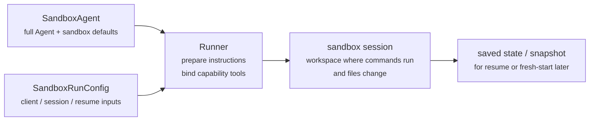
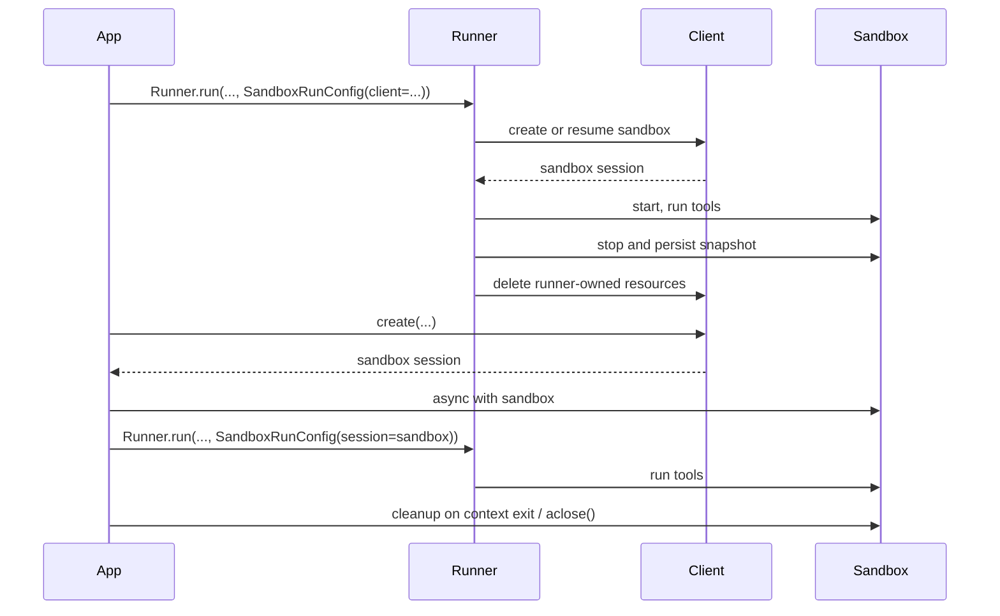

---
search:
  exclude: true
---
# 概念

!!! warning "Beta 機能"

    Sandbox Agents は beta です。API の詳細、デフォルト値、対応機能は一般提供前に変更される可能性があり、時間の経過とともにより高度な機能が追加される予定です。

現代的なエージェントは、ファイルシステム上の実際のファイルを操作できると最も効果的に動作します。**Sandbox Agents** は、特化したツールやシェルコマンドを利用して、大規模なドキュメント集合の検索や操作、ファイル編集、成果物の生成、コマンド実行を行えます。sandbox は、モデルに永続的なワークスペースを提供し、エージェントがユーザーに代わって作業できるようにします。Agents SDK の Sandbox Agents は、sandbox 環境と組み合わせたエージェントの実行を容易にし、適切なファイルをファイルシステム上に配置し、sandbox をオーケストレーションして、大規模にタスクを開始、停止、再開しやすくします。

エージェントに必要なデータを中心にワークスペースを定義します。GitHub リポジトリ、ローカルファイルやディレクトリ、合成されたタスクファイル、S3 や Azure Blob Storage などのリモートファイルシステム、その他ユーザーが提供する sandbox 入力から開始できます。

<div class="sandbox-harness-image" markdown="1">


</div>

`SandboxAgent` は依然として `Agent` です。`instructions`、`prompt`、`tools`、`handoffs`、`mcp_servers`、`model_settings`、`output_type`、ガードレール、hooks など、通常のエージェントのインターフェースを維持し、通常の `Runner` API を通じて実行されます。変わるのは実行境界です。

- `SandboxAgent` はエージェント自体を定義します。通常のエージェント設定に加えて、`default_manifest`、`base_instructions`、`run_as` といった sandbox 固有のデフォルトや、ファイルシステムツール、シェルアクセス、skills、memory、compaction などの機能を含みます。
- `Manifest` は、新しい sandbox ワークスペースの望ましい初期内容とレイアウトを宣言します。これには、ファイル、リポジトリ、mount、環境が含まれます。
- sandbox session は、コマンドが実行され、ファイルが変更されるライブな分離環境です。
- [`SandboxRunConfig`][agents.run_config.SandboxRunConfig] は、その実行がどのように sandbox session を取得するかを決定します。たとえば、直接注入する、シリアライズ済みの sandbox session state から再接続する、sandbox client を通じて新しい sandbox session を作成する、などです。
- 保存された sandbox state と snapshots により、後続の実行で以前の作業に再接続したり、保存済みの内容から新しい sandbox session を初期化したりできます。

`Manifest` は新規 session 用ワークスペースの契約であり、すべてのライブ sandbox の完全な正本ではありません。実行時の実効ワークスペースは、再利用される sandbox session、シリアライズ済み sandbox session state、または実行時に選択された snapshot から決まることがあります。

このページ全体でいう "sandbox session" とは、sandbox client が管理するライブ実行環境を指します。これは [Sessions](../sessions/index.md) で説明されている SDK の会話用 [`Session`][agents.memory.session.Session] インターフェースとは異なります。

外側のランタイムは引き続き approvals、トレーシング、ハンドオフ、再開 bookkeeping を管理します。sandbox session はコマンド、ファイル変更、環境分離を管理します。この分離はモデルの中核的な部分です。

### 構成要素の適合

sandbox 実行は、エージェント定義と実行ごとの sandbox 設定を組み合わせたものです。runner はエージェントを準備し、ライブな sandbox session にバインドし、後続の実行のために state を保存できます。



sandbox 固有のデフォルトは `SandboxAgent` に置かれます。実行ごとの sandbox-session の選択は `SandboxRunConfig` に置かれます。

ライフサイクルは 3 つのフェーズで考えるとよいです。

1. `SandboxAgent`、`Manifest`、および capabilities で、エージェントと新規ワークスペース契約を定義します。
2. `Runner` に `SandboxRunConfig` を渡して sandbox session を注入、再開、または作成し、実行します。
3. runner 管理の `RunState`、明示的な sandbox `session_state`、または保存済みワークスペース snapshot から後で継続します。

シェルアクセスがたまに使うツールの 1 つにすぎない場合は、まず [tools ガイド](../tools.md) の hosted shell を使ってください。ワークスペース分離、sandbox client の選択、sandbox-session の再開動作が設計の一部である場合に sandbox agents を使ってください。

## 利用場面

sandbox agents は、たとえば次のようなワークスペース中心のワークフローに適しています。

- コーディングやデバッグ。たとえば、GitHub リポジトリの issue レポートに対する自動修正をエージェントオーケストレーションし、対象を絞ったテストを実行する
- ドキュメント処理や編集。たとえば、ユーザーの財務書類から情報を抽出し、記入済みの納税フォーム草案を作成する
- ファイルに基づくレビューや分析。たとえば、オンボーディング資料、生成されたレポート、成果物バンドルを確認してから回答する
- 分離されたマルチエージェントパターン。たとえば、各レビュー担当またはコーディング用サブエージェントに専用ワークスペースを与える
- 複数段階のワークスペースタスク。たとえば、ある実行でバグを修正し、後でリグレッションテストを追加する、または snapshot や sandbox session state から再開する

ファイルや動的なファイルシステムへのアクセスが不要であれば、引き続き `Agent` を使ってください。シェルアクセスがたまに必要な機能であれば hosted shell を追加してください。ワークスペース境界自体が機能の一部であるなら sandbox agents を使ってください。

## sandbox client の選択

ローカル開発では `UnixLocalSandboxClient` から始めてください。コンテナ分離やイメージの一致が必要になったら `DockerSandboxClient` に移行してください。プロバイダー管理の実行が必要なら hosted provider に移行してください。

ほとんどの場合、`SandboxAgent` の定義は同じままで、変更されるのは sandbox client とそのオプションだけであり、それらは [`SandboxRunConfig`][agents.run_config.SandboxRunConfig] で指定します。ローカル、Docker、hosted、remote-mount の各オプションについては [Sandbox clients](clients.md) を参照してください。

## 中核要素

<div class="sandbox-nowrap-first-column-table" markdown="1">

| Layer | Main SDK pieces | What it answers |
| --- | --- | --- |
| エージェント定義 | `SandboxAgent`、`Manifest`、capabilities | どのエージェントが実行され、新規 session のワークスペース契約は何から開始されるべきですか。 |
| sandbox 実行 | `SandboxRunConfig`、sandbox client、ライブな sandbox session | この実行はどのようにライブな sandbox session を取得し、どこで作業が実行されますか。 |
| 保存された sandbox state | `RunState` の sandbox payload、`session_state`、snapshots | このワークフローはどのように以前の sandbox 作業に再接続するか、または保存済み内容から新しい sandbox session を初期化しますか。 |

</div>

主な SDK 要素は、これらのレイヤーに次のように対応します。

<div class="sandbox-nowrap-first-column-table" markdown="1">

| Piece | What it owns | Ask this question |
| --- | --- | --- |
| [`SandboxAgent`][agents.sandbox.sandbox_agent.SandboxAgent] | エージェント定義 | このエージェントは何を行うべきで、どのデフォルトを一緒に持ち運ぶべきですか。 |
| [`Manifest`][agents.sandbox.manifest.Manifest] | 新規 session のワークスペースファイルとフォルダー | 実行開始時に、どのファイルとフォルダーがファイルシステム上に存在すべきですか。 |
| [`Capability`][agents.sandbox.capabilities.capability.Capability] | sandbox ネイティブな動作 | どのツール、instructions の断片、またはランタイム動作をこのエージェントに付与すべきですか。 |
| [`SandboxRunConfig`][agents.run_config.SandboxRunConfig] | 実行ごとの sandbox client と sandbox-session の取得元 | この実行では sandbox session を注入、再開、または作成すべきですか。 |
| [`RunState`][agents.run_state.RunState] | runner 管理の保存済み sandbox state | 以前の runner 管理ワークフローを再開し、その sandbox state を自動的に引き継いでいますか。 |
| [`SandboxRunConfig.session_state`][agents.run_config.SandboxRunConfig.session_state] | 明示的にシリアライズされた sandbox session state | `RunState` の外で既にシリアライズした sandbox state から再開したいですか。 |
| [`SandboxRunConfig.snapshot`][agents.run_config.SandboxRunConfig.snapshot] | 新しい sandbox session 用の保存済みワークスペース内容 | 新しい sandbox session を保存済みのファイルや成果物から開始すべきですか。 |

</div>

実践的な設計順序は次のとおりです。

1. `Manifest` で新規 session のワークスペース契約を定義します。
2. `SandboxAgent` でエージェントを定義します。
3. 組み込みまたはカスタム capabilities を追加します。
4. 各実行が `RunConfig(sandbox=SandboxRunConfig(...))` でどのように sandbox session を取得するか決めます。

## sandbox 実行の準備

実行時に、runner はその定義を具体的な sandbox-backed 実行へ変換します。

1. `SandboxRunConfig` から sandbox session を解決します。
   `session=...` を渡した場合、そのライブな sandbox session を再利用します。
   それ以外の場合は `client=...` を使って作成または再開します。
2. 実行用の実効ワークスペース入力を決定します。
   実行が sandbox session を注入または再開する場合、その既存の sandbox state が優先されます。
   それ以外の場合、runner は一時的な manifest override または `agent.default_manifest` から開始します。
   これが、`Manifest` だけではすべての実行の最終的なライブワークスペースを定義しない理由です。
3. capabilities に、生成された manifest を処理させます。
   これにより、最終的なエージェント準備の前に、capabilities がファイル、mount、またはその他のワークスペーススコープの動作を追加できます。
4. 最終的な instructions を固定順で構築します。
   SDK のデフォルト sandbox prompt、または明示的に上書きした場合は `base_instructions`、その後に `instructions`、次に capability の instructions 断片、次に remote-mount policy のテキスト、最後にレンダリングされたファイルシステムツリーを追加します。
5. capability のツールをライブな sandbox session にバインドし、準備されたエージェントを通常の `Runner` API で実行します。

sandbox 化しても、turn の意味は変わりません。turn は依然としてモデルの 1 ステップであり、単一のシェルコマンドや sandbox 操作ではありません。sandbox 側の操作と turn の間に固定の 1:1 対応はありません。作業の一部は sandbox 実行レイヤー内に留まり、別のアクションはツール結果、approval、または別のモデルステップを必要とするその他の state を返すことがあります。実用上のルールとしては、sandbox 作業の後にエージェントランタイムが別のモデル応答を必要とする場合にのみ、追加の turn が消費されます。

これらの準備手順があるため、`default_manifest`、`instructions`、`base_instructions`、`capabilities`、`run_as` が `SandboxAgent` を設計する際に考えるべき主な sandbox 固有オプションです。

## `SandboxAgent` のオプション

通常の `Agent` フィールドに加えて、sandbox 固有のオプションは次のとおりです。

<div class="sandbox-nowrap-first-column-table" markdown="1">

| Option | Best use |
| --- | --- |
| `default_manifest` | runner が作成する新しい sandbox session のデフォルトワークスペース。 |
| `instructions` | SDK の sandbox prompt の後に追加される、追加の役割、ワークフロー、成功基準。 |
| `base_instructions` | SDK の sandbox prompt を置き換えるための高度な escape hatch。 |
| `capabilities` | このエージェントとともに持ち運ばれるべき sandbox ネイティブなツールと動作。 |
| `run_as` | シェルコマンド、ファイル読み取り、patch など、モデル向け sandbox ツールで使うユーザー ID。 |

</div>

sandbox client の選択、sandbox-session の再利用、manifest override、snapshot の選択は、エージェントではなく [`SandboxRunConfig`][agents.run_config.SandboxRunConfig] に属します。

### `default_manifest`

`default_manifest` は、このエージェント用に runner が新しい sandbox session を作成する際に使われるデフォルトの [`Manifest`][agents.sandbox.manifest.Manifest] です。エージェントが通常開始時に持つべきファイル、リポジトリ、補助資料、出力ディレクトリ、mount のために使ってください。

これはあくまでデフォルトです。実行ごとに `SandboxRunConfig(manifest=...)` で上書きできますし、再利用または再開された sandbox session は既存のワークスペース state を保持します。

### `instructions` と `base_instructions`

`instructions` は、異なる prompt でも維持したい短いルールに使ってください。`SandboxAgent` では、これらの instructions は SDK の sandbox base prompt の後に追加されるため、組み込みの sandbox ガイダンスを保持しつつ、独自の役割、ワークフロー、成功基準を追加できます。

`base_instructions` は、SDK の sandbox base prompt を置き換えたい場合にのみ使ってください。ほとんどのエージェントでは設定しないほうがよいです。

<div class="sandbox-nowrap-first-column-table" markdown="1">

| Put it in... | Use it for | Examples |
| --- | --- | --- |
| `instructions` | エージェントの安定した役割、ワークフロールール、成功基準。 | 「オンボーディング文書を確認してからハンドオフしてください。」「最終ファイルは `output/` に書き込んでください。」 |
| `base_instructions` | SDK の sandbox base prompt の完全な置き換え。 | カスタムの低レベル sandbox wrapper prompt。 |
| ユーザープロンプト | この実行の一度限りのリクエスト。 | 「このワークスペースを要約してください。」 |
| manifest 内のワークスペースファイル | 長めのタスク仕様、リポジトリローカルの instructions、または範囲が限定された参考資料。 | `repo/task.md`、document bundles、sample packets。 |

</div>

`instructions` の適切な使い方の例は次のとおりです。

- [examples/sandbox/unix_local_pty.py](https://github.com/openai/openai-agents-python/blob/main/examples/sandbox/unix_local_pty.py) は、PTY state が重要な場合にエージェントを 1 つの対話的プロセス内に保ちます。
- [examples/sandbox/handoffs.py](https://github.com/openai/openai-agents-python/blob/main/examples/sandbox/handoffs.py) は、sandbox reviewer が確認後にユーザーへ直接回答することを禁止します。
- [examples/sandbox/tax_prep.py](https://github.com/openai/openai-agents-python/blob/main/examples/sandbox/tax_prep.py) は、最終的な記入済みファイルが実際に `output/` に配置されることを要求します。
- [examples/sandbox/docs/coding_task.py](https://github.com/openai/openai-agents-python/blob/main/examples/sandbox/docs/coding_task.py) は、正確な検証コマンドを固定し、ワークスペースルート相対の patch path を明確にします。

ユーザーの一度限りのタスクを `instructions` にコピーしたり、manifest に置くべき長い参考資料を埋め込んだり、組み込み capabilities がすでに注入するツールドキュメントを繰り返したり、実行時にモデルが必要としないローカルインストール手順を混在させたりするのは避けてください。

`instructions` を省略しても、SDK はデフォルトの sandbox prompt を含めます。これは低レベル wrapper には十分ですが、ほとんどのユーザー向けエージェントでは明示的な `instructions` を提供するべきです。

### `capabilities`

capabilities は `SandboxAgent` に sandbox ネイティブな動作を付与します。実行開始前のワークスペース形成、sandbox 固有 instructions の追加、ライブな sandbox session にバインドされるツールの公開、そのエージェント向けのモデル動作や入力処理の調整を行えます。

組み込み capabilities には次が含まれます。

<div class="sandbox-nowrap-first-column-table" markdown="1">

| Capability | Add it when | Notes |
| --- | --- | --- |
| `Shell` | エージェントにシェルアクセスが必要。 | `exec_command` を追加し、sandbox client が PTY 対話をサポートする場合は `write_stdin` も追加します。 |
| `Filesystem` | エージェントがファイルを編集したりローカル画像を調べたりする必要がある。 | `apply_patch` と `view_image` を追加します。patch path はワークスペースルート相対です。 |
| `Skills` | sandbox 内で skill の発見と materialization を行いたい。 | sandbox ローカルの `SKILL.md` skills には、`.agents` や `.agents/skills` を手動で mount するよりこれを推奨します。 |
| `Memory` | 後続の実行で memory artifacts を読み取ったり生成したりすべき。 | `Shell` が必要です。ライブ更新には `Filesystem` も必要です。 |
| `Compaction` | 長時間実行フローで compaction items の後にコンテキスト圧縮が必要。 | モデル sampling と入力処理を調整します。 |

</div>

デフォルトでは、`SandboxAgent.capabilities` は `Capabilities.default()` を使い、これには `Filesystem()`、`Shell()`、`Compaction()` が含まれます。`capabilities=[...]` を渡すと、そのリストがデフォルトを置き換えるため、引き続き必要なデフォルト capability は含めてください。

skills については、どのように materialize したいかに応じて source を選んでください。

- `Skills(lazy_from=LocalDirLazySkillSource(...))` は、より大きなローカル skill ディレクトリに対するよいデフォルトです。モデルがまず index を発見し、必要なものだけを読み込めるためです。
- `Skills(from_=LocalDir(src=...))` は、事前に一括配置したい小さなローカル bundle に適しています。
- `Skills(from_=GitRepo(repo=..., ref=...))` は、skills 自体をリポジトリから取得したい場合に適しています。

skills がすでに `.agents/skills/<name>/SKILL.md` のような場所に存在する場合は、`LocalDir(...)` をその source root に向け、公開には引き続き `Skills(...)` を使ってください。sandbox 内レイアウトを別にする既存のワークスペース契約に依存していない限り、デフォルトの `skills_path=".agents"` を維持してください。

適合する場合は、組み込み capabilities を優先してください。組み込みで対応できない sandbox 固有のツールや instructions の表面が必要な場合にのみ、カスタム capability を書いてください。

## 概念

### Manifest

[`Manifest`][agents.sandbox.manifest.Manifest] は、新しい sandbox session のワークスペースを記述します。ワークスペースの `root` を設定し、ファイルやディレクトリを宣言し、ローカルファイルをコピーし、Git リポジトリを clone し、リモートストレージ mount を接続し、環境変数を設定し、ユーザーやグループを定義し、ワークスペース外の特定の絶対 path へのアクセスを許可できます。

Manifest エントリの path はワークスペース相対です。絶対 path にしたり、`..` でワークスペース外へ出たりはできないため、ローカル、Docker、hosted client 間でワークスペース契約の移植性が保たれます。

作業開始前にエージェントが必要とする資料には manifest エントリを使ってください。

<div class="sandbox-nowrap-first-column-table" markdown="1">

| Manifest entry | Use it for |
| --- | --- |
| `File`、`Dir` | 小さな合成入力、補助ファイル、出力ディレクトリ。 |
| `LocalFile`、`LocalDir` | sandbox 内に materialize すべきホストファイルまたはディレクトリ。 |
| `GitRepo` | ワークスペースに取得すべきリポジトリ。 |
| `S3Mount`、`GCSMount`、`R2Mount`、`AzureBlobMount`、`S3FilesMount` などの mounts | sandbox 内に表示すべき外部ストレージ。 |

</div>

mount エントリは、どのストレージを公開するかを記述します。mount strategy は、sandbox backend がそのストレージをどのように接続するかを記述します。mount オプションとプロバイダー対応については [Sandbox clients](clients.md#mounts-and-remote-storage) を参照してください。

よい manifest 設計とは通常、ワークスペース契約を狭く保ち、長いタスク手順を `repo/task.md` のようなワークスペースファイルに置き、instructions では `repo/task.md` や `output/report.md` のようにワークスペース相対 path を使うことです。エージェントが `Filesystem` capability の `apply_patch` ツールでファイルを編集する場合、patch path はシェルの `workdir` ではなく sandbox ワークスペースルート相対であることを忘れないでください。

`extra_path_grants` は、エージェントがワークスペース外の具体的な絶対 path を必要とする場合にのみ使ってください。たとえば、一時的なツール出力のための `/tmp` や、読み取り専用ランタイムのための `/opt/toolchain` などです。grant は、backend がファイルシステムポリシーを適用できる場所では、SDK ファイル API とシェル実行の両方に適用されます。

```python
from agents.sandbox import Manifest, SandboxPathGrant

manifest = Manifest(
    extra_path_grants=(
        SandboxPathGrant(path="/tmp"),
        SandboxPathGrant(path="/opt/toolchain", read_only=True),
    ),
)
```

snapshots と `persist_workspace()` には、引き続きワークスペースルートのみが含まれます。追加で許可された path は実行時アクセスであり、永続的なワークスペース state ではありません。

### 権限

`Permissions` は manifest エントリのファイルシステム権限を制御します。これは sandbox が materialize するファイルに関するものであり、モデル権限、approval policy、API 資格情報に関するものではありません。

デフォルトでは、manifest エントリは owner に対して読み取り、書き込み、実行が可能であり、group と others に対しては読み取りと実行が可能です。ステージングされたファイルを非公開、読み取り専用、または実行可能にしたい場合は、これを上書きしてください。

```python
from agents.sandbox import FileMode, Permissions
from agents.sandbox.entries import File

private_notes = File(
    text="internal notes",
    permissions=Permissions(
        owner=FileMode.READ | FileMode.WRITE,
        group=FileMode.NONE,
        other=FileMode.NONE,
    ),
)
```

`Permissions` は、owner、group、other ごとの個別の bit と、そのエントリがディレクトリかどうかを保持します。直接構築することも、`Permissions.from_str(...)` で mode 文字列から解析することも、`Permissions.from_mode(...)` で OS mode から導出することもできます。

Users は、作業を実行できる sandbox ID です。その ID を sandbox 内に存在させたい場合は manifest に `User` を追加し、シェルコマンド、ファイル読み取り、patch などのモデル向け sandbox ツールをそのユーザーで実行したい場合は `SandboxAgent.run_as` を設定してください。`run_as` が manifest にまだないユーザーを指している場合、runner はそのユーザーを実効 manifest に自動で追加します。

```python
from agents import Runner
from agents.run import RunConfig
from agents.sandbox import FileMode, Manifest, Permissions, SandboxAgent, SandboxRunConfig, User
from agents.sandbox.entries import Dir, LocalDir
from agents.sandbox.sandboxes.unix_local import UnixLocalSandboxClient

analyst = User(name="analyst")

agent = SandboxAgent(
    name="Dataroom analyst",
    instructions="Review the files in `dataroom/` and write findings to `output/`.",
    default_manifest=Manifest(
        # Declare the sandbox user so manifest entries can grant access to it.
        users=[analyst],
        entries={
            "dataroom": LocalDir(
                src="./dataroom",
                # Let the analyst traverse and read the mounted dataroom, but not edit it.
                group=analyst,
                permissions=Permissions(
                    owner=FileMode.READ | FileMode.EXEC,
                    group=FileMode.READ | FileMode.EXEC,
                    other=FileMode.NONE,
                ),
            ),
            "output": Dir(
                # Give the analyst a writable scratch/output directory for artifacts.
                group=analyst,
                permissions=Permissions(
                    owner=FileMode.ALL,
                    group=FileMode.ALL,
                    other=FileMode.NONE,
                ),
            ),
        },
    ),
    # Run model-facing sandbox actions as this user, so those permissions apply.
    run_as=analyst,
)

result = await Runner.run(
    agent,
    "Summarize the contracts and call out renewal dates.",
    run_config=RunConfig(
        sandbox=SandboxRunConfig(client=UnixLocalSandboxClient()),
    ),
)
```

ファイルレベルの共有ルールも必要な場合は、users と manifest groups、およびエントリの `group` metadata を組み合わせてください。`run_as` ユーザーは誰が sandbox ネイティブアクションを実行するかを制御し、`Permissions` は sandbox がワークスペースを materialize した後に、そのユーザーがどのファイルを読み取り、書き込み、実行できるかを制御します。

### SnapshotSpec

`SnapshotSpec` は、新しい sandbox session に対して、保存済みワークスペース内容をどこから復元し、どこへ永続化するかを指定します。これは sandbox ワークスペースの snapshot policy であり、`session_state` は特定の sandbox backend を再開するためのシリアライズ済み接続 state です。

ローカルの永続 snapshots には `LocalSnapshotSpec` を使い、アプリが remote snapshot client を提供する場合は `RemoteSnapshotSpec` を使ってください。ローカル snapshot のセットアップが利用できない場合は no-op snapshot が fallback として使われ、ワークスペース snapshot の永続化が不要な高度な呼び出し側はそれを明示的に使うこともできます。

```python
from pathlib import Path

from agents.run import RunConfig
from agents.sandbox import LocalSnapshotSpec, SandboxRunConfig
from agents.sandbox.sandboxes.unix_local import UnixLocalSandboxClient

run_config = RunConfig(
    sandbox=SandboxRunConfig(
        client=UnixLocalSandboxClient(),
        snapshot=LocalSnapshotSpec(base_path=Path("/tmp/my-sandbox-snapshots")),
    )
)
```

runner が新しい sandbox session を作成すると、その session 用の snapshot instance が sandbox client によって構築されます。開始時に snapshot が復元可能であれば、sandbox は保存済みワークスペース内容を復元してから実行を続行します。cleanup 時には、runner が所有する sandbox session がワークスペースをアーカイブし、snapshot を通じて再び永続化します。

`snapshot` を省略すると、ランタイムは可能であればデフォルトのローカル snapshot 保存先を使おうとします。設定できない場合は no-op snapshot に fallback します。mount された path や一時的な path は、永続的なワークスペース内容として snapshots にコピーされません。

### sandbox ライフサイクル

ライフサイクルモードは **SDK 所有** と **開発者所有** の 2 つです。

<div class="sandbox-lifecycle-diagram" markdown="1">



</div>

sandbox を 1 回の実行だけ存続させればよい場合は、SDK 所有ライフサイクルを使ってください。`client`、任意の `manifest`、任意の `snapshot`、client の `options` を渡すと、runner が sandbox を作成または再開し、開始し、エージェントを実行し、snapshot-backed なワークスペース state を永続化し、sandbox を停止し、runner 所有リソースを client に cleanup させます。

```python
result = await Runner.run(
    agent,
    "Inspect the workspace and summarize what changed.",
    run_config=RunConfig(
        sandbox=SandboxRunConfig(client=UnixLocalSandboxClient()),
    ),
)
```

sandbox を事前に作成したい、1 つのライブ sandbox を複数実行で再利用したい、実行後にファイルを確認したい、自分で作成した sandbox 上で stream したい、または cleanup のタイミングを厳密に制御したい場合は、開発者所有ライフサイクルを使ってください。`session=...` を渡すと、runner はそのライブ sandbox を使いますが、代わりに閉じることはしません。

```python
sandbox = await client.create(manifest=agent.default_manifest)

async with sandbox:
    run_config = RunConfig(sandbox=SandboxRunConfig(session=sandbox))
    await Runner.run(agent, "Analyze the files.", run_config=run_config)
    await Runner.run(agent, "Write the final report.", run_config=run_config)
```

通常の形は context manager です。entry 時に sandbox を開始し、exit 時に session cleanup ライフサイクルを実行します。アプリで context manager を使えない場合は、ライフサイクルメソッドを直接呼び出してください。

```python
sandbox = await client.create(
    manifest=agent.default_manifest,
    snapshot=LocalSnapshotSpec(base_path=Path("/tmp/my-sandbox-snapshots")),
)
try:
    await sandbox.start()
    await Runner.run(
        agent,
        "Analyze the files.",
        run_config=RunConfig(sandbox=SandboxRunConfig(session=sandbox)),
    )
    # Persist a checkpoint of the live workspace before doing more work.
    # `aclose()` also calls `stop()`, so this is only needed for an explicit mid-lifecycle save.
    await sandbox.stop()
finally:
    await sandbox.aclose()
```

`stop()` は snapshot-backed なワークスペース内容を永続化するだけで、sandbox 自体は破棄しません。`aclose()` は完全な session cleanup 経路です。pre-stop hooks を実行し、`stop()` を呼び出し、sandbox リソースを停止し、session スコープの依存関係を閉じます。

## `SandboxRunConfig` のオプション

[`SandboxRunConfig`][agents.run_config.SandboxRunConfig] は、sandbox session の取得元と、新しい session をどのように初期化するかを決める実行ごとのオプションを保持します。

### sandbox の取得元

これらのオプションは、runner が sandbox session を再利用、再開、または作成するかどうかを決定します。

<div class="sandbox-nowrap-first-column-table" markdown="1">

| Option | Use it when | Notes |
| --- | --- | --- |
| `client` | runner に sandbox session の作成、再開、cleanup を任せたい。 | ライブな sandbox `session` を渡さない限り必須です。 |
| `session` | すでにライブな sandbox session を自分で作成している。 | ライフサイクルは呼び出し側が所有し、runner はそのライブ sandbox session を再利用します。 |
| `session_state` | シリアライズ済み sandbox session state はあるが、ライブな sandbox session object はない。 | `client` が必要で、runner はその明示的 state から所有 session として再開します。 |

</div>

実際には、runner は次の順序で sandbox session を解決します。

1. `run_config.sandbox.session` を注入した場合、そのライブな sandbox session を直接再利用します。
2. それ以外で、実行が `RunState` から再開される場合は、保存された sandbox session state を再開します。
3. それ以外で、`run_config.sandbox.session_state` を渡した場合は、その明示的にシリアライズされた sandbox session state から runner が再開します。
4. それ以外の場合、runner は新しい sandbox session を作成します。その新しい session には、指定があれば `run_config.sandbox.manifest`、なければ `agent.default_manifest` を使います。

### 新規 session の入力

これらのオプションは、runner が新しい sandbox session を作成するときにのみ重要です。

<div class="sandbox-nowrap-first-column-table" markdown="1">

| Option | Use it when | Notes |
| --- | --- | --- |
| `manifest` | 一度限りの新規 session ワークスペース override が必要。 | 省略時は `agent.default_manifest` に fallback します。 |
| `snapshot` | 新しい sandbox session を snapshot から初期化すべき。 | 再開に近いフローや remote snapshot client に有用です。 |
| `options` | sandbox client に作成時オプションが必要。 | Docker image、Modal app 名、E2B template、timeouts など、client 固有設定でよく使われます。 |

</div>

### materialization 制御

`concurrency_limits` は、どれだけの sandbox materialization 作業を並列実行できるかを制御します。大きな manifests やローカルディレクトリのコピーで、より厳密なリソース制御が必要な場合は `SandboxConcurrencyLimits(manifest_entries=..., local_dir_files=...)` を使ってください。どちらかの値を `None` にすると、その特定の制限を無効化できます。

いくつかの含意を覚えておくとよいです。

- 新しい session: `manifest=` と `snapshot=` は、runner が新しい sandbox session を作成する場合にのみ適用されます。
- 再開と snapshot: `session_state=` は以前にシリアライズした sandbox state に再接続するものであり、`snapshot=` は保存済みワークスペース内容から新しい sandbox session を初期化するものです。
- client 固有オプション: `options=` は sandbox client に依存します。Docker や多くの hosted client では必須です。
- 注入されたライブ session: 実行中の sandbox `session` を渡した場合、capability による manifest 更新で、互換性のある非 mount エントリを追加できます。ただし `manifest.root`、`manifest.environment`、`manifest.users`、`manifest.groups` を変更したり、既存エントリを削除したり、エントリ型を置き換えたり、mount エントリを追加または変更したりはできません。
- Runner API: `SandboxAgent` の実行は、引き続き通常の `Runner.run()`、`Runner.run_sync()`、`Runner.run_streamed()` API を使います。

## 完全な例: コーディングタスク

このコーディングスタイルの例は、よいデフォルトの出発点です。

```python
import asyncio
from pathlib import Path

from agents import ModelSettings, Runner
from agents.run import RunConfig
from agents.sandbox import Manifest, SandboxAgent, SandboxRunConfig
from agents.sandbox.capabilities import (
    Capabilities,
    LocalDirLazySkillSource,
    Skills,
)
from agents.sandbox.entries import LocalDir
from agents.sandbox.sandboxes.unix_local import UnixLocalSandboxClient

EXAMPLE_DIR = Path(__file__).resolve().parent
HOST_REPO_DIR = EXAMPLE_DIR / "repo"
HOST_SKILLS_DIR = EXAMPLE_DIR / "skills"
TARGET_TEST_CMD = "sh tests/test_credit_note.sh"


def build_agent(model: str) -> SandboxAgent[None]:
    return SandboxAgent(
        name="Sandbox engineer",
        model=model,
        instructions=(
            "Inspect the repo, make the smallest correct change, run the most relevant checks, "
            "and summarize the file changes and risks. "
            "Read `repo/task.md` before editing files. Stay grounded in the repository, preserve "
            "existing behavior, and mention the exact verification command you ran. "
            "Use the `$credit-note-fixer` skill before editing files. If the repo lives under "
            "`repo/`, remember that `apply_patch` paths stay relative to the sandbox workspace "
            "root, so edits still target `repo/...`."
        ),
        # Put repos and task files in the manifest.
        default_manifest=Manifest(
            entries={
                "repo": LocalDir(src=HOST_REPO_DIR),
            }
        ),
        capabilities=Capabilities.default() + [
            # Let Skills(...) stage and index sandbox-local skills for you.
            Skills(
                lazy_from=LocalDirLazySkillSource(
                    source=LocalDir(src=HOST_SKILLS_DIR),
                )
            ),
        ],
        model_settings=ModelSettings(tool_choice="required"),
    )


async def main(model: str, prompt: str) -> None:
    result = await Runner.run(
        build_agent(model),
        prompt,
        run_config=RunConfig(
            sandbox=SandboxRunConfig(client=UnixLocalSandboxClient()),
            workflow_name="Sandbox coding example",
        ),
    )
    print(result.final_output)


if __name__ == "__main__":
    asyncio.run(
        main(
            model="gpt-5.4",
            prompt=(
                "Open `repo/task.md`, use the `$credit-note-fixer` skill, fix the bug, "
                f"run `{TARGET_TEST_CMD}`, and summarize the change."
            ),
        )
    )
```

[examples/sandbox/docs/coding_task.py](https://github.com/openai/openai-agents-python/blob/main/examples/sandbox/docs/coding_task.py) を参照してください。この例では、小さなシェルベースのリポジトリを使っているため、Unix ローカル実行全体で決定的に検証できます。もちろん実際のタスクリポジトリは Python、JavaScript、その他何でも構いません。

## 一般的なパターン

上記の完全な例から始めてください。多くの場合、同じ `SandboxAgent` はそのままで、sandbox client、sandbox-session の取得元、またはワークスペースの取得元だけを変更できます。

### sandbox client の切り替え

エージェント定義はそのままにして、run config だけを変更します。コンテナ分離やイメージの一致が必要なら Docker を使い、プロバイダー管理の実行が必要なら hosted provider を使ってください。例とプロバイダーオプションについては [Sandbox clients](clients.md) を参照してください。

### ワークスペースの上書き

エージェント定義はそのままにして、新規 session の manifest だけを差し替えます。

```python
from agents.run import RunConfig
from agents.sandbox import Manifest, SandboxRunConfig
from agents.sandbox.entries import GitRepo
from agents.sandbox.sandboxes.unix_local import UnixLocalSandboxClient

run_config = RunConfig(
    sandbox=SandboxRunConfig(
        client=UnixLocalSandboxClient(),
        manifest=Manifest(
            entries={
                "repo": GitRepo(repo="openai/openai-agents-python", ref="main"),
            }
        ),
    ),
)
```

同じエージェントの役割を、異なるリポジトリ、資料パケット、タスクバンドルに対して、エージェントを作り直さずに実行したい場合に使います。上の検証可能なコーディング例では、一度限りの override の代わりに `default_manifest` を使って同じパターンを示しています。

### sandbox session の注入

明示的なライフサイクル制御、実行後の確認、または出力コピーが必要な場合は、ライブな sandbox session を注入します。

```python
from agents import Runner
from agents.run import RunConfig
from agents.sandbox import SandboxRunConfig
from agents.sandbox.sandboxes.unix_local import UnixLocalSandboxClient

client = UnixLocalSandboxClient()
sandbox = await client.create(manifest=agent.default_manifest)

async with sandbox:
    result = await Runner.run(
        agent,
        prompt,
        run_config=RunConfig(
            sandbox=SandboxRunConfig(session=sandbox),
        ),
    )
```

実行後にワークスペースを確認したい場合や、すでに開始済みの sandbox session 上で stream したい場合に使います。[examples/sandbox/docs/coding_task.py](https://github.com/openai/openai-agents-python/blob/main/examples/sandbox/docs/coding_task.py) と [examples/sandbox/docker/docker_runner.py](https://github.com/openai/openai-agents-python/blob/main/examples/sandbox/docker/docker_runner.py) を参照してください。

### session state からの再開

すでに `RunState` の外で sandbox state をシリアライズしている場合は、その state から runner に再接続させてください。

```python
from agents.run import RunConfig
from agents.sandbox import SandboxRunConfig

serialized = load_saved_payload()
restored_state = client.deserialize_session_state(serialized)

run_config = RunConfig(
    sandbox=SandboxRunConfig(
        client=client,
        session_state=restored_state,
    ),
)
```

sandbox state が独自のストレージや job system にあり、`Runner` にそこから直接再開させたい場合に使います。serialize / deserialize の流れについては [examples/sandbox/extensions/blaxel_runner.py](https://github.com/openai/openai-agents-python/blob/main/examples/sandbox/extensions/blaxel_runner.py) を参照してください。

### snapshot からの開始

保存済みファイルや成果物から新しい sandbox を初期化します。

```python
from pathlib import Path

from agents.run import RunConfig
from agents.sandbox import LocalSnapshotSpec, SandboxRunConfig
from agents.sandbox.sandboxes.unix_local import UnixLocalSandboxClient

run_config = RunConfig(
    sandbox=SandboxRunConfig(
        client=UnixLocalSandboxClient(),
        snapshot=LocalSnapshotSpec(base_path=Path("/tmp/my-sandbox-snapshot")),
    ),
)
```

新しい実行を、`agent.default_manifest` だけでなく保存済みワークスペース内容から開始したい場合に使います。ローカル snapshot フローについては [examples/sandbox/memory.py](https://github.com/openai/openai-agents-python/blob/main/examples/sandbox/memory.py)、remote snapshot client については [examples/sandbox/sandbox_agent_with_remote_snapshot.py](https://github.com/openai/openai-agents-python/blob/main/examples/sandbox/sandbox_agent_with_remote_snapshot.py) を参照してください。

### Git から skills を読み込む

ローカル skill source を、リポジトリベースのものに差し替えます。

```python
from agents.sandbox.capabilities import Capabilities, Skills
from agents.sandbox.entries import GitRepo

capabilities = Capabilities.default() + [
    Skills(from_=GitRepo(repo="sdcoffey/tax-prep-skills", ref="main")),
]
```

skills bundle に独自のリリースサイクルがある場合や、複数の sandbox 間で共有したい場合に使います。[examples/sandbox/tax_prep.py](https://github.com/openai/openai-agents-python/blob/main/examples/sandbox/tax_prep.py) を参照してください。

### ツールとして公開

tool-agent は、独自の sandbox 境界を持つことも、親実行からライブな sandbox を再利用することもできます。再利用は、高速な読み取り専用 explorer agent に有用です。別の sandbox を作成、hydrate、snapshot するコストを払わずに、親が使っている正確なワークスペースを確認できます。

```python
from agents import Runner
from agents.run import RunConfig
from agents.sandbox import FileMode, Manifest, Permissions, SandboxAgent, SandboxRunConfig, User
from agents.sandbox.entries import Dir, File
from agents.sandbox.sandboxes.unix_local import UnixLocalSandboxClient

coordinator = User(name="coordinator")
explorer = User(name="explorer")

manifest = Manifest(
    users=[coordinator, explorer],
    entries={
        "pricing_packet": Dir(
            group=coordinator,
            permissions=Permissions(
                owner=FileMode.ALL,
                group=FileMode.ALL,
                other=FileMode.READ | FileMode.EXEC,
                directory=True,
            ),
            children={
                "pricing.md": File(
                    content=b"Pricing packet contents...",
                    group=coordinator,
                    permissions=Permissions(
                        owner=FileMode.ALL,
                        group=FileMode.ALL,
                        other=FileMode.READ,
                    ),
                ),
            },
        ),
        "work": Dir(
            group=coordinator,
            permissions=Permissions(
                owner=FileMode.ALL,
                group=FileMode.ALL,
                other=FileMode.NONE,
                directory=True,
            ),
        ),
    },
)

pricing_explorer = SandboxAgent(
    name="Pricing Explorer",
    instructions="Read `pricing_packet/` and summarize commercial risk. Do not edit files.",
    run_as=explorer,
)

client = UnixLocalSandboxClient()
sandbox = await client.create(manifest=manifest)

async with sandbox:
    shared_run_config = RunConfig(
        sandbox=SandboxRunConfig(session=sandbox),
    )

    orchestrator = SandboxAgent(
        name="Revenue Operations Coordinator",
        instructions="Coordinate the review and write final notes to `work/`.",
        run_as=coordinator,
        tools=[
            pricing_explorer.as_tool(
                tool_name="review_pricing_packet",
                tool_description="Inspect the pricing packet and summarize commercial risk.",
                run_config=shared_run_config,
                max_turns=2,
            ),
        ],
    )

    result = await Runner.run(
        orchestrator,
        "Review the pricing packet, then write final notes to `work/summary.md`.",
        run_config=shared_run_config,
    )
```

ここでは、親エージェントは `coordinator` として実行され、explorer tool-agent は同じライブな sandbox session 内で `explorer` として実行されます。`pricing_packet/` のエントリは `other` ユーザーに対して読み取り可能なので、explorer はそれらを素早く確認できますが、書き込み bit はありません。`work/` ディレクトリは coordinator の user / group にのみ利用可能なので、親は最終成果物を書き込めますが、explorer は読み取り専用のままです。

tool-agent に本当の分離が必要な場合は、独自の sandbox `RunConfig` を与えてください。

```python
from docker import from_env as docker_from_env

from agents.run import RunConfig
from agents.sandbox import SandboxRunConfig
from agents.sandbox.sandboxes.docker import DockerSandboxClient, DockerSandboxClientOptions

rollout_agent.as_tool(
    tool_name="review_rollout_risk",
    tool_description="Inspect the rollout packet and summarize implementation risk.",
    run_config=RunConfig(
        sandbox=SandboxRunConfig(
            client=DockerSandboxClient(docker_from_env()),
            options=DockerSandboxClientOptions(image="python:3.14-slim"),
        ),
    ),
)
```

tool-agent が自由に変更を加えるべき場合、信頼できないコマンドを実行すべき場合、または別の backend / image を使うべき場合は、別の sandbox を使ってください。[examples/sandbox/sandbox_agents_as_tools.py](https://github.com/openai/openai-agents-python/blob/main/examples/sandbox/sandbox_agents_as_tools.py) を参照してください。

### ローカルツールおよび MCP との組み合わせ

同じエージェント上で通常のツールを使いつつ、sandbox ワークスペースも維持します。

```python
from agents.sandbox import SandboxAgent
from agents.sandbox.capabilities import Shell

agent = SandboxAgent(
    name="Workspace reviewer",
    instructions="Inspect the workspace and call host tools when needed.",
    tools=[get_discount_approval_path],
    mcp_servers=[server],
    capabilities=[Shell()],
)
```

ワークスペース確認がエージェントの仕事の一部にすぎない場合に使います。[examples/sandbox/sandbox_agent_with_tools.py](https://github.com/openai/openai-agents-python/blob/main/examples/sandbox/sandbox_agent_with_tools.py) を参照してください。

## Memory

将来の sandbox-agent 実行が過去の実行から学習すべき場合は、`Memory` capability を使ってください。Memory は SDK の会話用 `Session` memory とは別物です。学びを sandbox ワークスペース内のファイルに要約し、後続の実行でそれらのファイルを読み取れるようにします。

セットアップ、読み取り / 生成の動作、複数 turn の会話、レイアウト分離については [Agent memory](memory.md) を参照してください。

## 構成パターン

単一エージェントのパターンが明確になったら、次の設計上の問いは、より大きなシステムの中で sandbox 境界をどこに置くかです。

sandbox agents は、SDK の他の部分とも引き続き組み合わせられます。

- [Handoffs](../handoffs.md): sandbox でない intake agent から、ドキュメント量の多い作業を sandbox reviewer に handoff します。
- [Agents as tools](../tools.md#agents-as-tools): 複数の sandbox agent をツールとして公開します。通常は各 `Agent.as_tool(...)` 呼び出しに `run_config=RunConfig(sandbox=SandboxRunConfig(...))` を渡し、各ツールが独自の sandbox 境界を持つようにします。
- [MCP](../mcp.md) と通常の関数ツール: sandbox capabilities は `mcp_servers` や通常の Python ツールと共存できます。
- [Running agents](../running_agents.md): sandbox 実行も引き続き通常の `Runner` API を使います。

特によくあるパターンは次の 2 つです。

- sandbox でないエージェントが、ワークスペース分離が必要なワークフロー部分だけ sandbox agent に handoff する
- オーケストレーターが複数の sandbox agent をツールとして公開し、通常は各 `Agent.as_tool(...)` 呼び出しごとに別個の sandbox `RunConfig` を使って、各ツールが独自の分離ワークスペースを持つようにする

### turn と sandbox 実行

handoff と agent-as-tool の呼び出しは分けて説明すると理解しやすくなります。

handoff の場合、トップレベルの実行は 1 つで、トップレベルの turn loop も 1 つのままです。アクティブなエージェントは変わりますが、実行はネストしません。sandbox でない intake agent が sandbox reviewer に handoff すると、その同じ実行内の次のモデル呼び出しは sandbox agent 向けに準備され、その sandbox agent が次の turn を担当するエージェントになります。つまり handoff は、同じ実行の次の turn をどのエージェントが担当するかを変えるものです。[examples/sandbox/handoffs.py](https://github.com/openai/openai-agents-python/blob/main/examples/sandbox/handoffs.py) を参照してください。

`Agent.as_tool(...)` の場合は関係が異なります。外側のオーケストレーターは 1 回の外側 turn を使ってツール呼び出しを決定し、そのツール呼び出しによって sandbox agent のネストされた実行が開始されます。ネストされた実行は独自の turn loop、`max_turns`、approvals、そして通常は独自の sandbox `RunConfig` を持ちます。1 回のネスト turn で終わることもあれば、複数回かかることもあります。外側のオーケストレーターの観点では、そのすべての作業は依然として 1 回のツール呼び出しの背後にあるため、ネストされた turn は外側の実行の turn counter を増やしません。[examples/sandbox/sandbox_agents_as_tools.py](https://github.com/openai/openai-agents-python/blob/main/examples/sandbox/sandbox_agents_as_tools.py) を参照してください。

approval の動作も同じ分割に従います。

- handoff では、sandbox agent がその実行のアクティブエージェントになるため、approvals は同じトップレベル実行に留まります
- `Agent.as_tool(...)` では、sandbox tool-agent 内で発生した approvals も外側の実行に現れますが、それらは保存されたネスト実行 state から来るものであり、外側の実行が再開されるとネストされた sandbox 実行も再開されます

## 参考資料

- [Quickstart](quickstart.md): 1 つの sandbox agent を動かします。
- [Sandbox clients](clients.md): ローカル、Docker、hosted、mount のオプションを選びます。
- [Agent memory](memory.md): 過去の sandbox 実行から得た学びを保存して再利用します。
- [examples/sandbox/](https://github.com/openai/openai-agents-python/tree/main/examples/sandbox): 実行可能なローカル、コーディング、memory、handoff、エージェント構成パターンです。