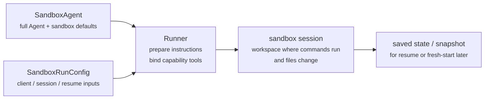
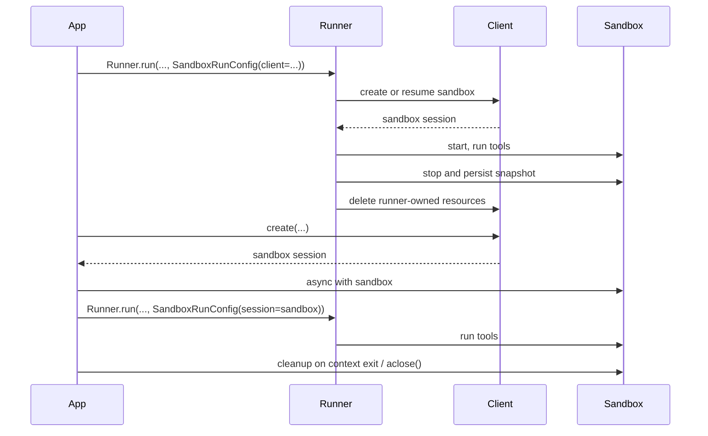

---
search:
  exclude: true
---
# 概念

最新のエージェントは、ファイルシステム上の実ファイルを操作できる場合に最も効果を発揮します。 **サンドボックスエージェント** は、専用ツールやシェルコマンドを使用して、大規模なドキュメントセットの検索や操作、ファイルの編集、成果物の生成、コマンドの実行を行えます。サンドボックスは、エージェントがユーザーに代わって作業するために使用できる永続的なワークスペースをモデルに提供します。Agents SDK のサンドボックスエージェントを使用すると、サンドボックス環境と組み合わせたエージェントを簡単に実行できます。これにより、適切なファイルをファイルシステムに配置し、サンドボックスをオーケストレーションして、大規模なタスクを容易に開始、停止、再開できます。

エージェントが必要とするデータを中心にワークスペースを定義します。GitHub リポジトリ、ローカルのファイルやディレクトリ、合成タスクファイル、S3 や Azure Blob Storage などのリモートファイルシステム、および指定したその他のサンドボックス入力から開始できます。

<div class="sandbox-harness-image" markdown="1">


</div>

`SandboxAgent` は引き続き `Agent` です。`instructions`、`prompt`、`tools`、`handoffs`、`mcp_servers`、`model_settings`、`output_type`、ガードレール、フックなど、通常のエージェントインターフェースを維持し、通常の `Runner` API を通じて実行されます。変わるのは実行境界です。

- `SandboxAgent` はエージェント自体を定義します。つまり、通常のエージェント設定に加えて、`default_manifest`、`base_instructions`、`run_as` などのサンドボックス固有のデフォルト、およびファイルシステムツール、シェルアクセス、スキル、メモリ、コンパクションなどの機能を定義します。
- `Manifest` は、新しいサンドボックスワークスペースに必要な初期コンテンツとレイアウトを宣言します。これには、ファイル、リポジトリ、マウント、環境が含まれます。
- サンドボックスセッションは、コマンドが実行され、ファイルが変更される実稼働の実行環境です。セッションによって提供される分離は、そのバックエンドと設定によって異なります。
- [`SandboxRunConfig`][agents.run_config.SandboxRunConfig] は、実行がサンドボックスセッションを取得する方法を決定します。たとえば、セッションを直接注入する、シリアライズされたサンドボックスセッション状態から再接続する、サンドボックスクライアントを通じて新しいサンドボックスセッションを作成する、といった方法があります。
- 保存されたサンドボックス状態とスナップショットを使用すると、後続の実行で以前の作業に再接続したり、保存済みコンテンツから新しいサンドボックスセッションを初期化したりできます。

`Manifest` は新規セッション用のワークスペース契約であり、すべての実稼働サンドボックスに対する完全な信頼できる唯一の情報源ではありません。実行で有効となるワークスペースは、再利用されたサンドボックスセッション、シリアライズされたサンドボックスセッション状態、または実行時に選択されたスナップショットから取得される場合もあります。

このページ全体で「サンドボックスセッション」とは、サンドボックスクライアントによって管理される実稼働の実行環境を指します。これは、[セッション](../sessions/index.md)で説明されている SDK の会話用 [`Session`][agents.memory.session.Session] インターフェースとは異なります。

外側のランタイムは引き続き、承認、トレーシング、ハンドオフ、実行の再開に必要な状態の追跡を管理します。サンドボックスセッションは、そのバックエンドを通じてコマンドとファイル変更を管理します。適用される分離制御はバックエンドによって決まります。セッション自体が OS レベルの隔離を保証するわけではありません。

### 各要素の関係 {#how-the-pieces-fit-together}

サンドボックス実行では、エージェント定義と実行ごとのサンドボックス設定を組み合わせます。ランナーはエージェントを準備し、実稼働のサンドボックスセッションにバインドし、後続の実行用に状態を保存できます。


```mermaid
flowchart LR
    agent["SandboxAgent<br/><small>full Agent + sandbox defaults</small>"]
    config["SandboxRunConfig<br/><small>client / session / resume inputs</small>"]
    runner["Runner<br/><small>prepare instructions<br/>bind capability tools</small>"]
    sandbox["sandbox session<br/><small>workspace where commands run<br/>and files change</small>"]
    saved["saved state / snapshot<br/><small>for resume or fresh-start later</small>"]

    agent --> runner
    config --> runner
    runner --> sandbox
    sandbox --> saved
```

サンドボックス固有のデフォルトは `SandboxAgent` に保持します。実行ごとのサンドボックスセッションの選択は `SandboxRunConfig` に保持します。

ライフサイクルは次の 3 つのフェーズで考えてください。

1. `SandboxAgent`、`Manifest`、および各種機能を使用して、エージェントと新規ワークスペース契約を定義します。
2. `Runner` に、サンドボックスセッションを注入、再開、または作成する `SandboxRunConfig` を指定して実行します。
3. ランナーが管理する `RunState`、明示的なサンドボックス `session_state`、または保存済みワークスペーススナップショットから、後で処理を継続します。

シェルアクセスが時折使用するツールの 1 つにすぎない場合は、[ツールガイド](../tools.md)のホスト型シェルから始めてください。ワークスペースの分離、サンドボックスクライアントの選択、またはサンドボックスセッションの再開動作が設計の一部である場合は、サンドボックスエージェントを使用してください。

## 使用場面 {#when-to-use-them}

サンドボックスエージェントは、次のようなワークスペース中心のワークフローに適しています。

- コーディングとデバッグ。たとえば、GitHub リポジトリ内の Issue 報告に対する自動修正をオーケストレーションし、対象を絞ったテストを実行する場合
- ドキュメントの処理と編集。たとえば、ユーザーの財務書類から情報を抽出し、記入済みの税務フォーム案を作成する場合
- ファイルを根拠としたレビューや分析。たとえば、回答する前にオンボーディング資料、生成されたレポート、成果物バンドルを確認する場合
- 個別のワークスペースを持つマルチエージェントパターン。たとえば、各レビュアーやコーディングサブエージェントに独自のワークスペースを割り当てる場合
- 複数ステップのワークスペースタスク。たとえば、ある実行でバグを修正し、後で回帰テストを追加する場合や、スナップショットまたはサンドボックスセッション状態から再開する場合

ファイルへのアクセスや、状態を保持して変更可能なファイルシステムが不要な場合は、引き続き `Agent` を使用してください。シェルアクセスが時折必要になる機能の 1 つにすぎない場合は、ホスト型シェルを追加します。ワークスペース境界自体が機能の一部である場合は、サンドボックスエージェントを使用してください。

## サンドボックスクライアントの選択 {#choose-a-sandbox-client}

macOS または Linux 上の信頼できるローカル開発、あるいは外部で分離された環境では、`UnixLocalSandboxClient` を使用します。Linux では、このバックエンドは OS レベルの隔離を追加せず、ホストプロセスとしてコマンドを実行します。macOS では、`sandbox-exec` を通じてファイルシステム制限を適用しますが、ネットワーク分離は提供しません。

デフォルトでは、新しい Unix ローカルセッションごとに個別の一時ワークスペースが割り当てられます。同じカスタム `Manifest.root` を使用してセッションを設定すると、それらのセッションはワークスペースを共有します。セッションを分けても、OS レベルの分離は保証されません。

信頼できない入力の影響を受けるコマンドを含む、信頼できないコマンドの場合は、適切に設定された `DockerSandboxClient`、ホスト型プロバイダー、または外部の分離を使用してください。Windows では Docker またはホスト型プロバイダーを使用します。ローカルバックエンドを選択する前に、[Unix ローカル実行の制限](clients.md#decision-guide)を参照してください。

ほとんどの場合、`SandboxAgent` の定義はそのまま維持し、[`SandboxRunConfig`][agents.run_config.SandboxRunConfig] 内のサンドボックスクライアントとそのオプションだけを変更します。ローカル、Docker、ホスト型、リモートマウントの各オプションについては、[サンドボックスクライアント](clients.md)を参照してください。

## 主要要素 {#core-pieces}

<div class="sandbox-nowrap-first-column-table" markdown="1">

| レイヤー | SDK の主要要素 | 答える内容 |
| --- | --- | --- |
| エージェント定義 | `SandboxAgent`、`Manifest`、各種機能 | どのエージェントを実行し、どの新規セッション用ワークスペース契約から開始するか |
| サンドボックス実行 | `SandboxRunConfig`、サンドボックスクライアント、実稼働のサンドボックスセッション | この実行が実稼働のサンドボックスセッションを取得する方法と、作業を実行する場所 |
| 保存済みサンドボックス状態 | `RunState` サンドボックスペイロード、`session_state`、スナップショット | このワークフローが以前のサンドボックス作業に再接続する方法、または保存済みコンテンツから新しいサンドボックスセッションを初期化する方法 |

</div>

SDK の主要要素は、次のように各レイヤーに対応します。

<div class="sandbox-nowrap-first-column-table" markdown="1">

| 要素 | 管理対象 | 確認する内容 |
| --- | --- | --- |
| [`SandboxAgent`][agents.sandbox.sandbox_agent.SandboxAgent] | エージェント定義 | このエージェントが行うべきことと、一緒に引き継ぐデフォルト |
| [`Manifest`][agents.sandbox.manifest.Manifest] | 新規セッション用ワークスペースのファイルとフォルダー | 実行開始時にファイルシステム上に存在すべきファイルとフォルダー |
| [`Capability`][agents.sandbox.capabilities.capability.Capability] | サンドボックスネイティブの動作 | このエージェントに付加するツール、指示フラグメント、ランタイム動作 |
| [`SandboxRunConfig`][agents.run_config.SandboxRunConfig] | 実行ごとのサンドボックスクライアントとサンドボックスセッションソース | この実行でサンドボックスセッションを注入、再開、作成するか |
| [`RunState`][agents.run_state.RunState] | ランナーが管理する保存済みサンドボックス状態 | ランナーが管理していた以前のワークフローを再開し、そのサンドボックス状態を自動的に引き継ぐか |
| [`SandboxRunConfig.session_state`][agents.run_config.SandboxRunConfig.session_state] | 明示的にシリアライズされたサンドボックスセッション状態 | `RunState` の外部ですでにシリアライズしたサンドボックス状態から再開するか |
| [`SandboxRunConfig.snapshot`][agents.run_config.SandboxRunConfig.snapshot] | 新しいサンドボックスセッション用に保存されたワークスペースコンテンツ | 新しいサンドボックスセッションを保存済みファイルや成果物から開始するか |

</div>

実用的な設計順序は次のとおりです。

1. `Manifest` を使用して、新規セッション用ワークスペース契約を定義します。
2. `SandboxAgent` を使用して、エージェントを定義します。
3. 組み込みまたはカスタムの機能を追加します。
4. `RunConfig(sandbox=SandboxRunConfig(...))` で、各実行がサンドボックスセッションを取得する方法を決定します。

## サンドボックス実行の準備 {#how-a-sandbox-run-is-prepared}

実行時に、ランナーは定義を具体的なサンドボックスベースの実行へ変換します。

1. `SandboxRunConfig` からサンドボックスセッションを解決します。`session=...` を渡した場合は、その実稼働のサンドボックスセッションを再利用します。それ以外の場合は、`client=...` を使用してセッションを作成または再開します。
2. 実行で有効となるワークスペース入力を決定します。実行がサンドボックスセッションを注入または再開する場合は、既存のサンドボックス状態が優先されます。それ以外の場合、ランナーは 1 回限りのマニフェストオーバーライドまたは `agent.default_manifest` から開始します。このため、`Manifest` だけでは、すべての実行における最終的な実稼働ワークスペースは定義されません。
3. 各機能が、結果として得られたマニフェストを処理します。これにより、最終的なエージェントを準備する前に、各機能がファイル、マウント、その他のワークスペーススコープの動作を追加できます。
4. 次の固定順序で最終的な指示を構築します。SDK のデフォルトのサンドボックスプロンプト、または明示的にオーバーライドした場合の `base_instructions`、続いて `instructions`、機能の指示フラグメント、リモートマウントのポリシーテキスト、レンダリングされたファイルシステムツリーです。
5. 機能のツールを実稼働のサンドボックスセッションにバインドし、通常の `Runner` API を通じて準備済みのエージェントを実行します。

サンドボックス化によってターンの意味は変わりません。ターンは引き続きモデルの 1 ステップであり、単一のシェルコマンドやサンドボックス操作ではありません。サンドボックス側の操作とターンの間に固定された 1 対 1 の対応はありません。一部の作業はサンドボックス実行レイヤー内に留まる一方、ツールの実行結果、承認、その他の状態など、別のモデルステップが必要な情報を返す操作もあります。実用上、サンドボックスでの作業後にエージェントランタイムが別のモデル応答を必要とする場合にのみ、次のターンが消費されます。

こうした準備手順があるため、`default_manifest`、`instructions`、`base_instructions`、`capabilities`、`run_as` は、`SandboxAgent` を設計するときに検討すべき主要なサンドボックス固有オプションです。

## `SandboxAgent` のオプション {#sandboxagent-options}

通常の `Agent` フィールドに加えて、次のサンドボックス固有オプションがあります。

<div class="sandbox-nowrap-first-column-table" markdown="1">

| オプション | 最適な用途 |
| --- | --- |
| `default_manifest` | ランナーが作成する新しいサンドボックスセッションのデフォルトワークスペース。 |
| `instructions` | SDK のサンドボックスプロンプトの後に追加される、役割、ワークフロー、成功基準。 |
| `base_instructions` | SDK のサンドボックスプロンプトを置き換える高度なエスケープハッチ。 |
| `capabilities` | このエージェントと一緒に引き継ぐサンドボックスネイティブのツールと動作。 |
| `run_as` | シェルコマンド、ファイル読み取り、パッチなど、モデル向けサンドボックスツールのユーザー ID。 |

</div>

サンドボックスクライアントの選択、サンドボックスセッションの再利用、マニフェストのオーバーライド、スナップショットの選択は、エージェントではなく [`SandboxRunConfig`][agents.run_config.SandboxRunConfig] に設定します。

### `default_manifest` {#default_manifest}

`default_manifest` は、ランナーがこのエージェント用に新しいサンドボックスセッションを作成するときに使用するデフォルトの [`Manifest`][agents.sandbox.manifest.Manifest] です。エージェントが通常、最初から利用できるようにするファイル、リポジトリ、補助資料、出力ディレクトリ、マウントに使用します。

これはデフォルトにすぎません。実行時に `SandboxRunConfig(manifest=...)` でオーバーライドでき、再利用または再開されたサンドボックスセッションでは既存のワークスペース状態が維持されます。

### `instructions` と `base_instructions` {#instructions-and-base_instructions}

異なるプロンプトでも維持すべき短いルールには、`instructions` を使用します。`SandboxAgent` では、これらの指示が SDK のサンドボックス基本プロンプトの後に追加されるため、組み込みのサンドボックスガイダンスを維持しながら、独自の役割、ワークフロー、成功基準を追加できます。

SDK のサンドボックス基本プロンプトを置き換える場合にのみ、`base_instructions` を使用してください。ほとんどのエージェントでは設定しないでください。

<div class="sandbox-nowrap-first-column-table" markdown="1">

| 配置先 | 用途 | 例 |
| --- | --- | --- |
| `instructions` | エージェントの安定した役割、ワークフロールール、成功基準。 | 「オンボーディング書類を確認してからハンドオフする。」「最終ファイルを `output/` に書き込む。」 |
| `base_instructions` | SDK のサンドボックス基本プロンプトの完全な置き換え。 | カスタムの低レベルサンドボックスラッパープロンプト。 |
| ユーザープロンプト | この実行に対する 1 回限りのリクエスト。 | 「このワークスペースを要約してください。」 |
| マニフェスト内のワークスペースファイル | 長いタスク仕様、リポジトリローカルの指示、範囲を限定した参照資料。 | `repo/task.md`、ドキュメントバンドル、サンプル資料。 |

</div>

`instructions` の適切な使用例は次のとおりです。

- [examples/sandbox/unix_local_pty.py](https://github.com/openai/openai-agents-python/blob/main/examples/sandbox/unix_local_pty.py) では、PTY の状態が重要な場合に、エージェントを 1 つの対話型プロセス内に維持します。
- [examples/sandbox/handoffs.py](https://github.com/openai/openai-agents-python/blob/main/examples/sandbox/handoffs.py) では、サンドボックスレビュアーが確認後にユーザーへ直接回答することを禁止します。
- [examples/sandbox/tax_prep.py](https://github.com/openai/openai-agents-python/blob/main/examples/sandbox/tax_prep.py) では、最終的に記入されたファイルを実際に `output/` へ配置するよう求めます。
- [examples/sandbox/docs/coding_task.py](https://github.com/openai/openai-agents-python/blob/main/examples/sandbox/docs/coding_task.py) では、正確な検証コマンドを固定し、`SandboxRunConfig.cwd` が未設定の場合にパッチのパスがワークスペースルート相対であることを明確にします。

ユーザーの 1 回限りのタスクを `instructions` にコピーすること、マニフェストに含めるべき長い参照資料を埋め込むこと、組み込み機能がすでに注入しているツールドキュメントを繰り返すこと、モデルが実行時に必要としないローカルインストール情報を混在させることは避けてください。

`instructions` を省略しても、SDK はデフォルトのサンドボックスプロンプトを含めます。低レベルラッパーにはそれで十分ですが、ユーザー向けのほとんどのエージェントでは、明示的な `instructions` も指定してください。

### `capabilities` {#capabilities}

各機能は、サンドボックスネイティブの動作を `SandboxAgent` に付加します。実行開始前にワークスペースを構成し、サンドボックス固有の指示を追加し、実稼働のサンドボックスセッションにバインドされるツールを公開し、そのエージェントのモデル動作や入力処理を調整できます。

組み込み機能には次のものがあります。

<div class="sandbox-nowrap-first-column-table" markdown="1">

| 機能 | 追加する場合 | 注記 |
| --- | --- | --- |
| `Shell` | エージェントにシェルアクセスが必要な場合。 | `exec_command` を追加します。サンドボックスクライアントが PTY 操作をサポートする場合は、`write_stdin` も追加します。 |
| `Filesystem` | エージェントがファイルを編集したり、ローカル画像を確認したりする必要がある場合。 | `apply_patch` と `view_image` を追加します。相対パスはデフォルトでワークスペースルートを使用し、設定されている場合は `SandboxRunConfig.cwd` を使用します。 |
| `Skills` | サンドボックス内でスキルを検出し、マテリアライズする場合。 | `.agents` や `.agents/skills` を手動でマウントするよりも、こちらを優先してください。`Skills` がスキルをインデックス化し、サンドボックス内にマテリアライズします。 |
| `Memory` | 後続の実行でメモリ成果物を読み取る、または生成する場合。 | `Shell` が必要です。実行中にメモリ成果物を更新するには、`Filesystem` も必要です。 |
| `Compaction` | 長時間実行されるフローで、コンパクション項目の後にコンテキストを削減する必要がある場合。 | モデルのサンプリングと入力処理を調整します。 |

</div>

デフォルトでは、`SandboxAgent.capabilities` は `Capabilities.default()` を使用します。これには `Filesystem()`、`Shell()`、`Compaction()` が含まれます。`capabilities=[...]` を渡すと、そのリストがデフォルトを置き換えるため、引き続き必要なデフォルト機能を含めてください。

`view_image` ツールは、ファイル名の拡張子ではなくファイル内容から、PNG、JPEG、GIF、WebP、BMP、TIFF のラスター画像を識別します。ラスター画像用の拡張子を持つファイルでも、内容がサポートされていない場合は拒否されます。一方、サポート対象のラスター画像であれば、ファイル名に画像拡張子がなくても読み込めます。`.svg` および `.svgz` ファイルでは、ファイル内容から SVG マークアップを認識することに加えて、ファイル名ベースの互換性も維持されます。

スキルについては、マテリアライズ方法に応じてソースを選択します。

- `Skills(lazy_from=LocalDirLazySkillSource(...))` は、モデルが最初にインデックスを確認し、必要なものだけを読み込めるため、大規模なローカルスキルディレクトリに適したデフォルトです。
- `LocalDirLazySkillSource(source=LocalDir(src=...))` は、SDK プロセスが実行されているファイルシステムから読み取ります。サンドボックスイメージまたはワークスペース内にしか存在しないパスではなく、元のホスト側スキルディレクトリを渡してください。
- `Skills(from_=LocalDir(src=...))` は、事前にステージングしておきたい小規模なローカルバンドルに適しています。
- `Skills(from_=GitRepo(repo=..., ref=...))` は、スキル自体をリポジトリから取得する場合に適しています。

`LocalDir.src` は SDK ホスト上のソースパスです。`skills_path` は、`load_skill` が呼び出されたときにスキルをステージングする、サンドボックスワークスペース内の相対的な配置先パスです。

スキルがすでに `.agents/skills/<name>/SKILL.md` のような場所に保存されている場合は、`LocalDir(...)` をそのソースルートに向け、引き続き `Skills(...)` を使用して公開します。別のサンドボックス内レイアウトに依存する既存のワークスペース契約がない限り、デフォルトの `skills_path=".agents"` を維持してください。

適合する場合は、組み込み機能を優先してください。組み込み機能では対応できないサンドボックス固有のツールまたは指示インターフェースが必要な場合にのみ、カスタム機能を作成してください。

## 概念 {#concepts_1}

### マニフェスト {#manifest}

[`Manifest`][agents.sandbox.manifest.Manifest] は、新しいサンドボックスセッションのワークスペースを記述します。ワークスペースの `root` の設定、ファイルとディレクトリの宣言、ローカルファイルのコピー、Git リポジトリのクローン、リモートストレージマウントの接続、環境変数の設定、ユーザーまたはグループの定義、ワークスペース外の特定の絶対パスへのアクセス許可を行えます。

マニフェストエントリのパスは、ワークスペース相対です。絶対パスにしたり、`..` を使用してワークスペースの外へ移動したりすることはできません。これにより、ワークスペース契約をローカル、Docker、ホスト型の各クライアント間で移植可能に保てます。

作業開始前にエージェントが必要とする素材には、マニフェストエントリを使用します。

<div class="sandbox-nowrap-first-column-table" markdown="1">

| マニフェストエントリ | 用途 |
| --- | --- |
| `File`、`Dir` | 小規模な合成入力、補助ファイル、出力ディレクトリ。 |
| `LocalFile`、`LocalDir` | サンドボックス内にマテリアライズするホストのファイルまたはディレクトリ。 |
| `GitRepo` | ワークスペースへ取得するリポジトリ。 |
| `S3Mount`、`GCSMount`、`R2Mount`、`AzureBlobMount`、`BoxMount`、`S3FilesMount` などのマウント | サンドボックス内に表示する外部ストレージ。 |

</div>

`Dir` は、合成された子要素からサンドボックスワークスペース内にディレクトリを作成するか、出力先としてディレクトリを作成します。ホストファイルシステムから読み取ることはありません。既存のホストディレクトリをサンドボックスワークスペースへコピーする場合は、`LocalDir` を使用します。

`LocalFile.src` と `LocalDir.src` は、デフォルトでは SDK プロセスの作業ディレクトリを基準に解決されます。`extra_path_grants` の対象でない限り、ソースはそのベースディレクトリ内に留まる必要があります。これにより、ローカルソースのマテリアライズが、サンドボックスマニフェストの他の部分と同じホストパスの信頼境界内に保たれます。

マウントエントリは公開するストレージを記述し、マウント方式はサンドボックスバックエンドがそのストレージを接続する方法を記述します。マウントオプションとプロバイダーのサポートについては、[サンドボックスクライアント](clients.md#mounts-and-remote-storage)を参照してください。

適切なマニフェスト設計では通常、ワークスペース契約を必要最小限に保ち、長いタスク手順を `repo/task.md` などのワークスペースファイルに配置し、指示では `repo/task.md` や `output/report.md` などのワークスペース相対パスを使用します。エージェントが `Filesystem` 機能の `apply_patch` ツールを使用してファイルを編集する場合、パッチのパスはデフォルトでサンドボックスのワークスペースルートを基準とし、設定されている場合は `SandboxRunConfig.cwd` を使用することに注意してください。シェルの `workdir` は使用しません。

エージェントがワークスペース外の具体的な絶対パスを必要とする場合、またはマニフェストが SDK プロセスの作業ディレクトリ外にある信頼済みローカルソースをコピーする必要がある場合にのみ、`extra_path_grants` を使用してください。例として、一時的なツール出力用の `/tmp`、読み取り専用ランタイム用の `/opt/toolchain`、サンドボックス内にマテリアライズする生成済みスキルディレクトリなどがあります。許可は、ローカルソースのマテリアライズと SDK ファイル API に適用されます。バックエンドがファイルシステムポリシーを適用できる場合は、シェル実行にも適用されます。

```python
from agents.sandbox import Manifest, SandboxPathGrant

manifest = Manifest(
    extra_path_grants=(
        SandboxPathGrant(path="/tmp"),
        SandboxPathGrant(path="/opt/toolchain", read_only=True),
    ),
)
```

Docker が別の絶対ホストパスを、コンテナ内の絶対 POSIX `path` にバインドマウントする場合は、`host_path` を設定します。`UnixLocalSandboxClient` は、両方のパスが同一であるパスのみの許可だけをサポートし、`host_path` を拒否します。サンドボックスが変更してはならないホストデータには `read_only=True` を使用します。コピーで十分な場合は、`LocalFile` または `LocalDir` を使用します。

Unix ローカルのパス許可は、ワークスペースへコピーできるホストソースと、SDK ファイル API がアクセスできるパスを制御します。`read_only=True` は、許可されたパスへの SDK ファイル API による書き込みを防止します。Linux では、これらの設定によって任意のシェルコマンドは制限されません。プロセスの権限と外部の分離によって許可されているホストパスには、そのパスに許可がなくてもコマンドからアクセスできます。macOS のファイルシステムプロファイルと Docker のバインドマウントでは、それぞれの許可制限がコマンドに適用されます。

`extra_path_grants` を含むマニフェストは、信頼済み設定として扱ってください。アプリケーションが対象のホストパスをすでに承認していない限り、モデル出力やその他の信頼できないペイロードから許可を読み込まないでください。

スナップショットと `persist_workspace()` に含まれるのは、引き続きワークスペースルートのみです。追加で許可されたパスはランタイムアクセスであり、永続的なワークスペース状態ではありません。

### 権限 {#permissions}

`Permissions` は、マニフェストエントリのファイルシステム権限を制御します。これは、サンドボックスがマテリアライズするファイルに関するものであり、モデルの権限、承認ポリシー、API 認証情報に関するものではありません。

デフォルトでは、マニフェストエントリは所有者による読み取り、書き込み、実行が可能で、グループおよびその他のユーザーによる読み取りと実行が可能です。ステージングされたファイルを非公開、読み取り専用、または実行可能にする場合は、この設定をオーバーライドします。

```python
from agents.sandbox import FileMode, Permissions
from agents.sandbox.entries import File

private_notes = File(
    content=b"internal notes",
    permissions=Permissions(
        owner=FileMode.READ | FileMode.WRITE,
        group=FileMode.NONE,
        other=FileMode.NONE,
    ),
)
```

`Permissions` は、所有者、グループ、その他のユーザー用のビットと、エントリがディレクトリかどうかを個別に保持します。直接構築するか、`Permissions.from_str(...)` を使用してモード文字列から解析するか、`Permissions.from_mode(...)` を使用して OS モードから生成できます。

ユーザーは、作業を実行できるサンドボックス ID です。その ID をサンドボックス内に存在させる場合は、マニフェストに `User` を追加します。その後、シェルコマンド、ファイル読み取り、パッチなど、モデル向けのサンドボックスツールをそのユーザーとして実行する場合は、`SandboxAgent.run_as` を設定します。`run_as` がマニフェストにまだ存在しないユーザーを指している場合、ランナーがそのユーザーを有効なマニフェストに追加します。

```python
from agents import Runner
from agents.run import RunConfig
from agents.sandbox import FileMode, Manifest, Permissions, SandboxAgent, SandboxRunConfig, User
from agents.sandbox.entries import Dir, LocalDir
from agents.sandbox.sandboxes.unix_local import UnixLocalSandboxClient

analyst = User(name="analyst")

agent = SandboxAgent(
    name="Dataroom analyst",
    instructions="Review the files in `dataroom/` and write findings to `output/`.",
    default_manifest=Manifest(
        # Declare the sandbox user so manifest entries can grant access to it.
        users=[analyst],
        entries={
            "dataroom": LocalDir(
                src="./dataroom",
                # Let the analyst traverse and read the mounted dataroom, but not edit it.
                group=analyst,
                permissions=Permissions(
                    owner=FileMode.READ | FileMode.EXEC,
                    group=FileMode.READ | FileMode.EXEC,
                    other=FileMode.NONE,
                ),
            ),
            "output": Dir(
                # Give the analyst a writable scratch/output directory for artifacts.
                group=analyst,
                permissions=Permissions(
                    owner=FileMode.ALL,
                    group=FileMode.ALL,
                    other=FileMode.NONE,
                ),
            ),
        },
    ),
    # Run model-facing sandbox actions as this user, so those permissions apply.
    run_as=analyst,
)

result = await Runner.run(
    agent,
    "Summarize the contracts and call out renewal dates.",
    run_config=RunConfig(
        sandbox=SandboxRunConfig(client=UnixLocalSandboxClient()),
    ),
)
```

ファイルレベルの共有ルールも必要な場合は、ユーザーをマニフェストのグループおよびエントリの `group` メタデータと組み合わせます。`run_as` ユーザーはサンドボックスネイティブのアクションを実行する ID を制御し、`Permissions` はサンドボックスがワークスペースをマテリアライズした後、そのユーザーが読み取り、書き込み、実行できるファイルを制御します。

### SnapshotSpec {#snapshotspec}

`SnapshotSpec` は、新しいサンドボックスセッションで保存済みワークスペースコンテンツを復元する場所と、再度保存する場所を指定します。これはサンドボックスワークスペースのスナップショットポリシーであり、`session_state` は特定のサンドボックスバックエンドを再開するためのシリアライズ済み接続状態です。

ローカルの永続的なスナップショットには `LocalSnapshotSpec` を使用し、アプリがリモートスナップショットクライアントを提供する場合は `RemoteSnapshotSpec` を使用します。ローカルスナップショットを設定できない場合は、フォールバックとして何もしないスナップショットが使用されます。ワークスペーススナップショットを永続化したくない場合は、高度な呼び出し元がこれを明示的に使用することもできます。

```python
from pathlib import Path

from agents.run import RunConfig
from agents.sandbox import LocalSnapshotSpec, SandboxRunConfig
from agents.sandbox.sandboxes.unix_local import UnixLocalSandboxClient

run_config = RunConfig(
    sandbox=SandboxRunConfig(
        client=UnixLocalSandboxClient(),
        snapshot=LocalSnapshotSpec(base_path=Path("/tmp/my-sandbox-snapshots")),
    )
)
```

ランナーが新しいサンドボックスセッションを作成すると、サンドボックスクライアントはそのセッション用のスナップショットインスタンスを構築します。開始時にスナップショットを復元できる場合、実行を継続する前に、サンドボックスが保存済みワークスペースコンテンツを復元します。クリーンアップ時には、ランナーが所有するサンドボックスセッションがワークスペースをアーカイブし、スナップショットを通じて再度永続化します。

`snapshot` を省略すると、ランタイムは可能な場合にデフォルトのローカルスナップショット保存場所を使用しようとします。設定できない場合は、何もしないスナップショットへフォールバックします。マウントされたパスと一時パスは、永続的なワークスペースコンテンツとしてスナップショットにコピーされません。

### サンドボックスのライフサイクル {#sandbox-lifecycle}

ライフサイクルには、 **SDK 所有** と **開発者所有** の 2 つのモードがあります。

<div class="sandbox-lifecycle-diagram" markdown="1">


```mermaid
sequenceDiagram
    participant App
    participant Runner
    participant Client
    participant Sandbox

    App->>Runner: Runner.run(..., SandboxRunConfig(client=...))
    Runner->>Client: create or resume sandbox
    Client-->>Runner: sandbox session
    Runner->>Sandbox: start, run tools
    Runner->>Sandbox: stop and persist snapshot
    Runner->>Client: delete runner-owned resources

    App->>Client: create(...)
    Client-->>App: sandbox session
    App->>Sandbox: async with sandbox
    App->>Runner: Runner.run(..., SandboxRunConfig(session=sandbox))
    Runner->>Sandbox: run tools
    App->>Sandbox: cleanup on context exit / aclose()
```

</div>

サンドボックスを 1 回の実行中だけ存続させる必要がある場合は、SDK 所有のライフサイクルを使用します。`client` と、必要に応じて `manifest` および `snapshot`、さらに必要なクライアントの `options` を渡します。ランナーがサンドボックスの作成または再開、開始、エージェントの実行、スナップショットで保持されるワークスペース状態の永続化、サンドボックスセッションの終了を行い、クライアントがランナー所有のリソースをクリーンアップできるようにします。

```python
result = await Runner.run(
    agent,
    "Inspect the workspace and summarize what changed.",
    run_config=RunConfig(
        sandbox=SandboxRunConfig(client=UnixLocalSandboxClient()),
    ),
)
```

サンドボックスを事前に作成する、複数の実行で 1 つの実稼働サンドボックスを再利用する、実行後にファイルを確認する、自分で作成したサンドボックス上でストリーミングする、またはクリーンアップの正確なタイミングを決定する場合は、開発者所有のライフサイクルを使用します。`session=...` を渡すと、ランナーはその実稼働サンドボックスを使用しますが、代わりに閉じることはありません。

```python
sandbox = await client.create(manifest=agent.default_manifest)

async with sandbox:
    run_config = RunConfig(sandbox=SandboxRunConfig(session=sandbox))
    await Runner.run(agent, "Analyze the files.", run_config=run_config)
    await Runner.run(agent, "Write the final report.", run_config=run_config)
```

通常はコンテキストマネージャーを使用します。開始時にサンドボックスを起動し、終了時にセッションのクリーンアップライフサイクルを実行します。アプリでコンテキストマネージャーを使用できない場合は、ライフサイクルメソッドを直接呼び出します。

```python
sandbox = await client.create(
    manifest=agent.default_manifest,
    snapshot=LocalSnapshotSpec(base_path=Path("/tmp/my-sandbox-snapshots")),
)
try:
    await sandbox.start()
    await Runner.run(
        agent,
        "Analyze the files.",
        run_config=RunConfig(sandbox=SandboxRunConfig(session=sandbox)),
    )
    # Persist a checkpoint of the live workspace before doing more work.
    # `aclose()` also calls `stop()`, so this is only needed for an explicit mid-lifecycle save.
    await sandbox.stop()
finally:
    await sandbox.aclose()
```

`stop()` は、スナップショットで保持されるワークスペースコンテンツのみを永続化し、サンドボックスを終了しません。`aclose()` はセッション全体のクリーンアップ処理です。停止前フックを実行し、`stop()` を呼び出し、サンドボックスリソースを停止し、セッションスコープの依存関係を閉じます。

## `SandboxRunConfig` のオプション {#sandboxrunconfig-options}

[`SandboxRunConfig`][agents.run_config.SandboxRunConfig] は、サンドボックスセッションの取得元と、新しいセッションの初期化方法を決定する実行ごとのオプションを保持します。

### サンドボックスの取得元 {#sandbox-source}

次のオプションは、ランナーがサンドボックスセッションを再利用、再開、作成するかどうかを決定します。

<div class="sandbox-nowrap-first-column-table" markdown="1">

| オプション | 使用する場合 | 注記 |
| --- | --- | --- |
| `client` | ランナーにサンドボックスセッションの作成、再開、クリーンアップを任せる場合。 | 実稼働サンドボックス `session` を指定しない限り必須です。 |
| `session` | 実稼働のサンドボックスセッションを自分ですでに作成している場合。 | 呼び出し元がライフサイクルを所有し、ランナーはその実稼働サンドボックスセッションを再利用します。 |
| `session_state` | シリアライズ済みのサンドボックスセッション状態はあるものの、実稼働のサンドボックスセッションオブジェクトがない場合。 | `client` が必要です。ランナーは明示的な状態から再開し、再開したセッションのライフサイクルを所有します。 |

</div>

実際には、ランナーは次の順序でサンドボックスセッションを解決します。

1. `run_config.sandbox.session` を注入した場合、その実稼働サンドボックスセッションを直接再利用します。
2. それ以外で、実行が `RunState` から再開される場合、保存されたサンドボックスセッション状態を再開します。
3. それ以外で、`run_config.sandbox.session_state` を渡した場合、その明示的にシリアライズされたサンドボックスセッション状態から再開します。
4. それ以外の場合、ランナーは新しいサンドボックスセッションを作成します。この新規セッションでは、指定されていれば `run_config.sandbox.manifest` を使用し、指定されていなければ `agent.default_manifest` を使用します。

### 新規セッションの入力 {#fresh-session-inputs}

次のオプションは、ランナーが新しいサンドボックスセッションを作成する場合にのみ関係します。

<div class="sandbox-nowrap-first-column-table" markdown="1">

| オプション | 使用する場合 | 注記 |
| --- | --- | --- |
| `manifest` | 新規セッション用ワークスペースを 1 回限りオーバーライドする場合。 | 省略すると `agent.default_manifest` にフォールバックします。 |
| `snapshot` | 新しいサンドボックスセッションをスナップショットから初期化する場合。 | 再開に似たフローやリモートスナップショットクライアントに便利です。 |
| `options` | サンドボックスクライアントが作成時のオプションを必要とする場合。 | Docker イメージ、Modal アプリ名、E2B テンプレート、タイムアウト、および同様のクライアント固有設定で一般的です。 |

</div>

### モデル向け作業ディレクトリ {#model-facing-working-directory}

複数の実行で 1 つのサンドボックスセッションを共有しながら、個別のサブディレクトリで作業する場合は、POSIX 形式のワークスペース相対ディレクトリを `cwd` に設定します。ランナーが `cwd` を検証するとき、そのディレクトリが存在し、設定されたサンドボックスユーザーからアクセスできる必要があります。新規セッションでは、ランナーが最初にマニフェストをマテリアライズするため、この検証前にマニフェストでディレクトリを作成できます。

```python
from agents import Runner
from agents.run import RunConfig
from agents.sandbox import SandboxRunConfig

result = await Runner.run(
    agent,
    "Work only on task A.",
    run_config=RunConfig(
        sandbox=SandboxRunConfig(
            session=shared_sandbox,
            cwd="tasks/task-a",
        ),
    ),
)
```

組み込みの `exec_command`、`view_image`、`apply_patch` ツールで使用される相対パスは、`cwd` を基準に解決されます。`cwd` の値自体については、絶対パス、`..` などの親セグメント、空の値は拒否されます。文字列値ではスラッシュを使用する必要があります。相対的な `PurePath` 値は POSIX 形式に正規化されますが、絶対的な `PurePath` 値は引き続き無効です。直接使用する `BaseSandboxSession` ファイル API はワークスペースルート相対のままなので、`cwd` によって `Manifest.root` やセッションの基礎となるワークスペース境界は変更されません。この設定が変更するのは相対パスの解決だけです。実行を `cwd` 内に隔離したり、共有セッションのワークスペースポリシーで許可されている他のパスへのアクセスを防止したりするものではありません。

パスを扱うカスタム機能は、モデルが指定した相対パスを解決するときに、バインドされた [`SandboxWorkspaceScope`][agents.sandbox.workspace_paths.SandboxWorkspaceScope] を適用する必要があります。1 つのサンドボックスセッションを共有しながら、モデル向け作業ディレクトリを分離して 2 つの実行を同時に行う例については、[examples/sandbox/shared_session_workdirs.py](https://github.com/openai/openai-agents-python/blob/main/examples/sandbox/shared_session_workdirs.py) を参照してください。

### マテリアライズの制御 {#materialization-controls}

`concurrency_limits` は、並列実行できるサンドボックスのマテリアライズ作業量を制御します。大規模なマニフェストやローカルディレクトリのコピーで、より厳密なリソース制御が必要な場合は、`SandboxConcurrencyLimits(manifest_entries=..., local_dir_files=...)` を使用します。特定の制限を無効にするには、それぞれの値を `None` に設定します。

`archive_limits` は、アーカイブ展開に対する SDK 側のリソースチェックを制御します。SDK のデフォルトしきい値を有効にするには `archive_limits=SandboxArchiveLimits()` を設定します。アーカイブに対してより厳密なリソース制御が必要な場合は、`SandboxArchiveLimits(max_input_bytes=..., max_extracted_bytes=..., max_members=...)` などの明示的な値を渡します。SDK のアーカイブリソース制限を適用しないデフォルト動作を維持するには、`archive_limits=None` のままにします。個別の制限だけを無効にするには、そのフィールドを `None` に設定します。

留意すべき点は次のとおりです。

- 新規セッション: `manifest=` と `snapshot=` は、ランナーが新しいサンドボックスセッションを作成する場合にのみ適用されます。
- 再開とスナップショット: `session_state=` は以前にシリアライズされたサンドボックス状態へ再接続し、`snapshot=` は保存済みワークスペースコンテンツから新しいサンドボックスセッションを初期化します。
- クライアント固有オプション: `options=` はサンドボックスクライアントによって異なります。Docker と多くのホスト型クライアントでは必須です。
- 注入された実稼働セッション: 実行中のサンドボックス `session` を渡す場合、機能によるマニフェスト更新で、互換性のあるマウント以外のエントリを追加できます。ただし、`manifest.root`、`manifest.environment`、`manifest.users`、`manifest.groups` の変更、既存エントリの削除、エントリ型の置き換え、マウントエントリの追加や変更はできません。
- ランナー API: `SandboxAgent` の実行でも、通常の `Runner.run()`、`Runner.run_sync()`、`Runner.run_streamed()` API を使用します。

## 完全な例: コーディングタスク {#full-example-coding-task}

このコーディング形式の例は、デフォルトの開始点として適しています。

```python
import asyncio
from pathlib import Path

from agents import ModelSettings, Runner
from agents.run import RunConfig
from agents.sandbox import Manifest, SandboxAgent, SandboxRunConfig
from agents.sandbox.capabilities import (
    Capabilities,
    LocalDirLazySkillSource,
    Skills,
)
from agents.sandbox.entries import LocalDir
from agents.sandbox.sandboxes.unix_local import UnixLocalSandboxClient

EXAMPLE_DIR = Path(__file__).resolve().parent
HOST_REPO_DIR = EXAMPLE_DIR / "repo"
HOST_SKILLS_DIR = EXAMPLE_DIR / "skills"
TARGET_TEST_CMD = "sh tests/test_credit_note.sh"


def build_agent(model: str) -> SandboxAgent[None]:
    return SandboxAgent(
        name="Sandbox engineer",
        model=model,
        instructions=(
            "Inspect the repo, make the smallest correct change, run the most relevant checks, "
            "and summarize the file changes and risks. "
            "Read `repo/task.md` before editing files. Stay grounded in the repository, preserve "
            "existing behavior, and mention the exact verification command you ran. "
            "Use the `$credit-note-fixer` skill before editing files. "
            "This example leaves `SandboxRunConfig.cwd` unset, so `apply_patch` paths stay "
            "relative to the sandbox workspace root and edits still target `repo/...`."
        ),
        # Put repos and task files in the manifest.
        default_manifest=Manifest(
            entries={
                "repo": LocalDir(src=HOST_REPO_DIR),
            }
        ),
        capabilities=Capabilities.default() + [
            Skills(
                lazy_from=LocalDirLazySkillSource(
                    # This is a host path read by the SDK process.
                    # Requested skills are copied into `skills_path` in the sandbox.
                    source=LocalDir(src=HOST_SKILLS_DIR),
                )
            ),
        ],
        model_settings=ModelSettings(tool_choice="required"),
    )


async def main(model: str, prompt: str) -> None:
    result = await Runner.run(
        build_agent(model),
        prompt,
        run_config=RunConfig(
            sandbox=SandboxRunConfig(client=UnixLocalSandboxClient()),
            workflow_name="Sandbox coding example",
        ),
    )
    print(result.final_output)


if __name__ == "__main__":
    asyncio.run(
        main(
            model="gpt-5.6-sol",
            prompt=(
                "Open `repo/task.md`, use the `$credit-note-fixer` skill, fix the bug, "
                f"run `{TARGET_TEST_CMD}`, and summarize the change."
            ),
        )
    )
```

[examples/sandbox/docs/coding_task.py](https://github.com/openai/openai-agents-python/blob/main/examples/sandbox/docs/coding_task.py) を参照してください。このコード例では、Unix ローカル実行間で決定論的に検証できるよう、小規模なシェルベースのリポジトリを使用します。実際のタスクリポジトリには、もちろん Python、JavaScript、その他の任意のものを使用できます。

## 一般的なパターン {#common-patterns}

上記の完全な例から始めてください。多くの場合、同じ `SandboxAgent` をそのまま維持し、サンドボックスクライアント、サンドボックスセッションの取得元、またはワークスペースの取得元だけを変更できます。

### サンドボックスクライアントの切り替え {#switch-sandbox-clients}

エージェント定義を同じまま維持し、実行設定だけを変更します。コンテナ分離やイメージの同等性が必要な場合は Docker を使用し、プロバイダー管理の実行が必要な場合はホスト型プロバイダーを使用します。コード例とプロバイダーオプションについては、[サンドボックスクライアント](clients.md)を参照してください。

### ワークスペースのオーバーライド {#override-the-workspace}

エージェント定義を同じまま維持し、新規セッション用マニフェストだけを差し替えます。

```python
from agents.run import RunConfig
from agents.sandbox import Manifest, SandboxRunConfig
from agents.sandbox.entries import GitRepo
from agents.sandbox.sandboxes.unix_local import UnixLocalSandboxClient

run_config = RunConfig(
    sandbox=SandboxRunConfig(
        client=UnixLocalSandboxClient(),
        manifest=Manifest(
            entries={
                "repo": GitRepo(repo="openai/openai-agents-python", ref="main"),
            }
        ),
    ),
)
```

エージェントを再構築せずに、同じエージェントの役割を異なるリポジトリ、資料、タスクバンドルに対して実行する場合に使用します。上記の検証済みコーディング例では、1 回限りのオーバーライドではなく `default_manifest` を使用して、同じパターンを示しています。

### サンドボックスセッションの注入 {#inject-a-sandbox-session}

ライフサイクルを明示的に制御する、実行後に確認する、または出力をコピーする必要がある場合は、実稼働のサンドボックスセッションを注入します。

```python
from agents import Runner
from agents.run import RunConfig
from agents.sandbox import SandboxRunConfig
from agents.sandbox.sandboxes.unix_local import UnixLocalSandboxClient

client = UnixLocalSandboxClient()
sandbox = await client.create(manifest=agent.default_manifest)

async with sandbox:
    result = await Runner.run(
        agent,
        prompt,
        run_config=RunConfig(
            sandbox=SandboxRunConfig(session=sandbox),
        ),
    )
```

実行後にワークスペースを確認する場合や、起動済みのサンドボックスセッション上でストリーミングする場合に使用します。[examples/sandbox/docs/coding_task.py](https://github.com/openai/openai-agents-python/blob/main/examples/sandbox/docs/coding_task.py) および [examples/sandbox/docker/docker_runner.py](https://github.com/openai/openai-agents-python/blob/main/examples/sandbox/docker/docker_runner.py) を参照してください。

### セッション状態からの再開 {#resume-from-session-state}

`RunState` の外部ですでにサンドボックス状態をシリアライズしている場合は、ランナーにその状態から再接続させます。

```python
from agents.run import RunConfig
from agents.sandbox import SandboxRunConfig

serialized = load_saved_payload()
restored_state = client.deserialize_session_state(serialized)

run_config = RunConfig(
    sandbox=SandboxRunConfig(
        client=client,
        session_state=restored_state,
    ),
)
```

サンドボックス状態を独自のストレージやジョブシステムに保存し、`Runner` にその状態から直接再開させる場合に使用します。シリアライズとデシリアライズのフローについては、[examples/sandbox/extensions/blaxel_runner.py](https://github.com/openai/openai-agents-python/blob/main/examples/sandbox/extensions/blaxel_runner.py) を参照してください。

セッション状態のシリアライズでは、ネイティブの `host_path` 値が省略されます。ホストを基盤とする許可を再開するには、現在の信頼済みマニフェストを `SandboxRunConfig.manifest` または `agent.default_manifest` を通じて指定してください。指定しない場合、サンドボックスの開始前に再開が失敗します。シリアライズ済み入力やその他の信頼できない入力からホストパスを生成しないでください。

セッション状態と `RunState` のシリアライズでは、クラウドマウントの認証情報、認証情報を含むヘルパー設定、コンテナ内での認証情報公開に関する確認も削除されます。マウント済みセッションの再開をサポートするバックエンドでは、状態に秘匿化されたマウント権限が含まれる場合、現在の信頼済みマニフェストを `SandboxRunConfig.manifest` または `agent.default_manifest` を通じて指定してください。`"data"` という名前のマウントエントリでマウントスコープの確認が必要な場合は、再開前に、コピーしたマニフェストを `trusted_manifest = trusted_manifest.with_in_container_mount_credential_exposure_acknowledged("data")` とともに保持してください。広範な権限には `trusted_manifest = trusted_manifest.with_in_container_mount_broad_credential_exposure_acknowledged("data")` を使用し、マウントで両方の権限クラスを使用する場合は両方のメソッドを呼び出します。確認が必要なすべての正確なマウントパスを渡してください。Agents SDK が認証情報を復元するのは、現在の信頼済みマニフェストが、永続化された状態とまったく同じ認証情報を除いたマウントトポロジーを持つ場合のみです。信頼済み設定が不足している、または一致しない場合、サンドボックスの開始前に再開が失敗します。シリアライズ済み状態だけで権限が付与されることはありません。`VercelSandboxClient` ではマウント済みセッションを再開できないため、代わりに信頼済みマニフェストを使用して新しいサンドボックスを開始してください。

### スナップショットからの開始 {#start-from-a-snapshot}

保存済みファイルと成果物から新しいサンドボックスを初期化します。

```python
from pathlib import Path

from agents.run import RunConfig
from agents.sandbox import LocalSnapshotSpec, SandboxRunConfig
from agents.sandbox.sandboxes.unix_local import UnixLocalSandboxClient

run_config = RunConfig(
    sandbox=SandboxRunConfig(
        client=UnixLocalSandboxClient(),
        snapshot=LocalSnapshotSpec(base_path=Path("/tmp/my-sandbox-snapshot")),
    ),
)
```

新しいサンドボックスセッションを作成する実行で、`agent.default_manifest` だけではなく、保存済みワークスペースコンテンツから開始する場合に使用します。ローカルスナップショットのフローについては [examples/sandbox/memory.py](https://github.com/openai/openai-agents-python/blob/main/examples/sandbox/memory.py) を、リモートスナップショットクライアントについては [examples/sandbox/sandbox_agent_with_remote_snapshot.py](https://github.com/openai/openai-agents-python/blob/main/examples/sandbox/sandbox_agent_with_remote_snapshot.py) を参照してください。

### Git からのスキル読み込み {#load-skills-from-git}

ローカルのスキルソースを、リポジトリを基盤とするものへ差し替えます。

```python
from agents.sandbox.capabilities import Capabilities, Skills
from agents.sandbox.entries import GitRepo

capabilities = Capabilities.default() + [
    Skills(from_=GitRepo(repo="sdcoffey/tax-prep-skills", ref="main")),
]
```

スキルバンドルに独自のリリースサイクルがある場合や、複数のサンドボックスで共有する場合に使用します。[examples/sandbox/tax_prep.py](https://github.com/openai/openai-agents-python/blob/main/examples/sandbox/tax_prep.py) を参照してください。

### ツールとしての公開 {#expose-as-tools}

ツールエージェントには、独自のサンドボックス境界を割り当てるか、親実行の実稼働サンドボックスを再利用させることができます。再利用は、高速な読み取り専用エクスプローラーエージェントに便利です。別のサンドボックスを作成、ハイドレーション、スナップショットするコストをかけずに、親実行が使用しているものとまったく同じワークスペースを確認できます。

```python
from agents import Runner
from agents.run import RunConfig
from agents.sandbox import FileMode, Manifest, Permissions, SandboxAgent, SandboxRunConfig, User
from agents.sandbox.entries import Dir, File
from agents.sandbox.sandboxes.unix_local import UnixLocalSandboxClient

coordinator = User(name="coordinator")
explorer = User(name="explorer")

manifest = Manifest(
    users=[coordinator, explorer],
    entries={
        "pricing_packet": Dir(
            group=coordinator,
            permissions=Permissions(
                owner=FileMode.ALL,
                group=FileMode.ALL,
                other=FileMode.READ | FileMode.EXEC,
                directory=True,
            ),
            children={
                "pricing.md": File(
                    content=b"Pricing packet contents...",
                    group=coordinator,
                    permissions=Permissions(
                        owner=FileMode.ALL,
                        group=FileMode.ALL,
                        other=FileMode.READ,
                    ),
                ),
            },
        ),
        "work": Dir(
            group=coordinator,
            permissions=Permissions(
                owner=FileMode.ALL,
                group=FileMode.ALL,
                other=FileMode.NONE,
                directory=True,
            ),
        ),
    },
)

pricing_explorer = SandboxAgent(
    name="Pricing Explorer",
    instructions="Read `pricing_packet/` and summarize commercial risk. Do not edit files.",
    run_as=explorer,
)

client = UnixLocalSandboxClient()
sandbox = await client.create(manifest=manifest)

async with sandbox:
    shared_run_config = RunConfig(
        sandbox=SandboxRunConfig(session=sandbox),
    )

    orchestrator = SandboxAgent(
        name="Revenue Operations Coordinator",
        instructions="Coordinate the review and write final notes to `work/`.",
        run_as=coordinator,
        tools=[
            pricing_explorer.as_tool(
                tool_name="review_pricing_packet",
                tool_description="Inspect the pricing packet and summarize commercial risk.",
                run_config=shared_run_config,
                max_turns=2,
            ),
        ],
    )

    result = await Runner.run(
        orchestrator,
        "Review the pricing packet, then write final notes to `work/summary.md`.",
        run_config=shared_run_config,
    )
```

ここでは、親エージェントが `coordinator` として実行され、エクスプローラーツールエージェントが同じ実稼働サンドボックスセッション内で `explorer` として実行されます。`pricing_packet/` エントリは `other` ユーザーが読み取れるため、エクスプローラーはすばやく確認できますが、書き込みビットはありません。`work/` ディレクトリはコーディネーターのユーザーまたはグループだけが利用できるため、エクスプローラーを読み取り専用のまま維持しながら、親は最終成果物を書き込めます。

ツールエージェントに独自のコンテナが必要な場合は、Docker セッションを作成するサンドボックス `RunConfig` を割り当てます。

```python
from docker import from_env as docker_from_env

from agents.run import RunConfig
from agents.sandbox import SandboxAgent, SandboxRunConfig
from agents.sandbox.sandboxes.docker import DockerSandboxClient, DockerSandboxClientOptions

rollout_agent = SandboxAgent(
    name="Rollout Reviewer",
    instructions="Inspect the rollout packet and summarize implementation risk.",
)

rollout_agent.as_tool(
    tool_name="review_rollout_risk",
    tool_description="Inspect the rollout packet and summarize implementation risk.",
    run_config=RunConfig(
        sandbox=SandboxRunConfig(
            client=DockerSandboxClient(docker_from_env()),
            options=DockerSandboxClientOptions(image="python:3.14-slim"),
        ),
    ),
)
```

ツールエージェントがファイルを独立して編集する場合は別のワークスペースを使用し、異なるバックエンドやイメージが必要な場合は別のセッションを使用します。信頼できないコマンドには、必要な分離を提供するバックエンドと設定を選択してください。Unix ローカルセッションを分けるだけでは、Linux の OS レベルの隔離は提供されません。個別のローカルワークスペースについては、[examples/sandbox/sandbox_agents_as_tools.py](https://github.com/openai/openai-agents-python/blob/main/examples/sandbox/sandbox_agents_as_tools.py) を参照してください。

### ローカルツールおよび MCP との組み合わせ {#combine-with-local-tools-and-mcp}

同じエージェントで通常のツールを使用しながら、サンドボックスワークスペースも維持します。

```python
from agents.sandbox import SandboxAgent
from agents.sandbox.capabilities import Shell

agent = SandboxAgent(
    name="Workspace reviewer",
    instructions="Inspect the workspace and call host tools when needed.",
    tools=[get_discount_approval_path],
    mcp_servers=[server],
    capabilities=[Shell()],
)
```

ワークスペースの確認がエージェントの作業の一部にすぎない場合に使用します。[examples/sandbox/sandbox_agent_with_tools.py](https://github.com/openai/openai-agents-python/blob/main/examples/sandbox/sandbox_agent_with_tools.py) を参照してください。

## メモリ {#memory}

将来のサンドボックスエージェントの実行で以前の実行から学習する場合は、`Memory` 機能を使用します。メモリは SDK の会話用 `Session` メモリとは別です。学習内容をサンドボックスワークスペース内のファイルに要約し、後続の実行でそのファイルを読み取れるようにします。

設定、読み取りと生成の動作、マルチターンの会話、レイアウトの分離については、[エージェントメモリ](memory.md)を参照してください。

## 構成パターン {#composition-patterns}

単一エージェントのパターンを理解したら、次の設計上の課題は、より大規模なシステムのどこにサンドボックス境界を配置するかです。

サンドボックスエージェントは、SDK の他の要素とも引き続き組み合わせられます。

- [ハンドオフ](../handoffs.md): サンドボックスを使用しない受付エージェントから、ドキュメントを多用する作業をサンドボックスレビュアーへハンドオフします。
- [Agents as tools](../tools.md#agents-as-tools): 複数のサンドボックスエージェントをツールとして公開します。通常は、各 `Agent.as_tool(...)` 呼び出しで `run_config=RunConfig(sandbox=SandboxRunConfig(...))` を渡し、各ツールに独自のセッションを割り当てます。各セッションによって提供される分離は、バックエンドと設定によって決まります。
- [MCP](../mcp.md) および通常の関数ツール: サンドボックス機能は、`mcp_servers` および通常の Python ツールと共存できます。
- [エージェントの実行](../running_agents.md): サンドボックス実行でも、通常の `Runner` API を使用します。

特によく使用されるパターンは次の 2 つです。

- ワークスペースの分離が必要なワークフロー部分だけを、サンドボックスを使用しないエージェントからサンドボックスエージェントへハンドオフする
- オーケストレーターが複数のサンドボックスエージェントをツールとして公開し、通常は `Agent.as_tool(...)` 呼び出しごとに個別のサンドボックス `RunConfig` を使用して、各ツールに独自のワークスペースを割り当てる

### ターンとサンドボックス実行 {#turns-and-sandbox-runs}

ハンドオフとエージェントをツールとして呼び出す場合は、別々に説明すると理解しやすくなります。

ハンドオフの場合も、トップレベルの実行とトップレベルのターンループはそれぞれ 1 つです。アクティブなエージェントは変わりますが、実行がネストされることはありません。サンドボックスを使用しない受付エージェントがサンドボックスレビュアーへハンドオフすると、同じ実行内の次のモデル呼び出しがサンドボックスエージェント用に準備され、そのサンドボックスエージェントが次のターンを担当します。つまり、ハンドオフは、同じ実行の次のターンを担当するエージェントを変更します。[examples/sandbox/handoffs.py](https://github.com/openai/openai-agents-python/blob/main/examples/sandbox/handoffs.py) を参照してください。

`Agent.as_tool(...)` では関係が異なります。外側のオーケストレーターは、ツールを呼び出すことを決定するために外側のターンを 1 つ使用し、そのツール呼び出しがサンドボックスエージェントのネストされた実行を開始します。ネストされた実行には、独自のターンループ、`max_turns`、承認、通常は独自のサンドボックス `RunConfig` があります。ネストされた 1 ターンで完了する場合もあれば、複数ターンかかる場合もあります。外側のオーケストレーターから見ると、そのすべての作業は 1 回のツール呼び出しの背後で行われるため、ネストされたターンによって外側の実行のターンカウンターが増えることはありません。[examples/sandbox/sandbox_agents_as_tools.py](https://github.com/openai/openai-agents-python/blob/main/examples/sandbox/sandbox_agents_as_tools.py) を参照してください。

承認の動作も同様に分かれます。

- ハンドオフでは、サンドボックスエージェントがその実行のアクティブなエージェントになるため、承認は同じトップレベル実行に留まります
- `Agent.as_tool(...)` では、サンドボックスツールエージェント内で発生した承認も外側の実行に提示されますが、保存されたネスト済み実行状態から取得され、外側の実行が再開されたときにネストされたサンドボックス実行を再開します

## 関連資料 {#further-reading}

- [クイックスタート](../sandbox_agents.md): サンドボックスエージェントを 1 つ実行します。
- [サンドボックスクライアント](clients.md): ローカル、Docker、ホスト型、マウントの各オプションを選択します。
- [エージェントメモリ](memory.md): 以前のサンドボックス実行から得た学習内容を保持し、再利用します。
- [examples/sandbox/](https://github.com/openai/openai-agents-python/tree/main/examples/sandbox): 実行可能なローカル、コーディング、メモリ、ハンドオフ、エージェント構成の各パターンです。