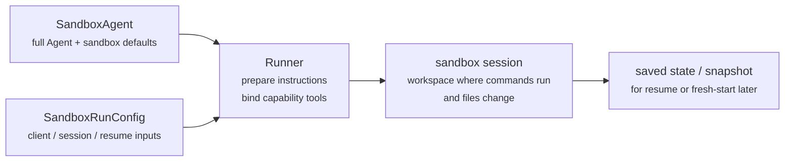
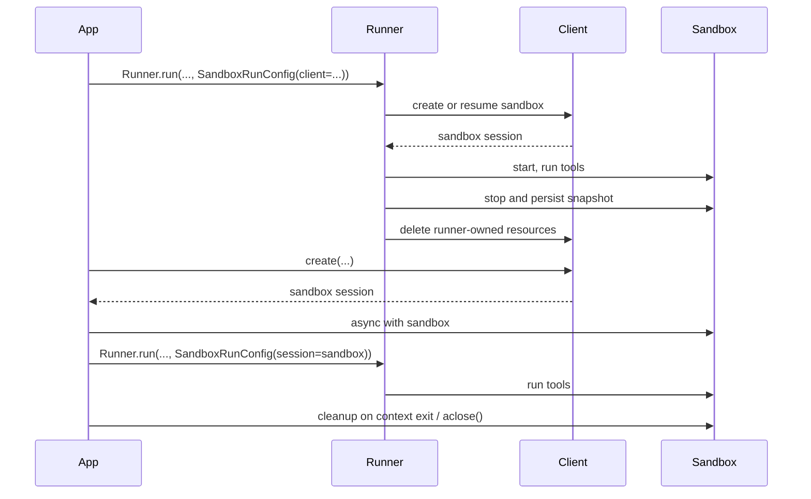

---
search:
  exclude: true
---
# 概念

!!! warning "ベータ機能"

    サンドボックスエージェントはベータ版です。一般提供の開始前に、API の詳細、デフォルト値、サポートされる機能が変更される可能性があります。また、今後さらに高度な機能が追加される予定です。

最新のエージェントは、ファイルシステム上の実際のファイルを操作できる場合に最も効果的に機能します。 **サンドボックスエージェント** は、専用ツールやシェルコマンドを使用して、大規模なドキュメントセットの検索と操作、ファイルの編集、成果物の生成、コマンドの実行を行えます。サンドボックスは、エージェントがユーザーに代わって作業するために使用できる永続的なワークスペースをモデルに提供します。Agents SDK のサンドボックスエージェントを使用すると、サンドボックス環境と組み合わせたエージェントを簡単に実行できます。適切なファイルをファイルシステム上に配置し、サンドボックスをオーケストレーションして、大規模なタスクを容易に開始、停止、再開できます。

エージェントに必要なデータを中心にワークスペースを定義します。GitHub リポジトリ、ローカルのファイルとディレクトリ、合成されたタスクファイル、S3 や Azure Blob Storage などのリモートファイルシステム、および指定したその他のサンドボックス入力から開始できます。

<div class="sandbox-harness-image" markdown="1">


</div>

`SandboxAgent` も引き続き `Agent` です。`instructions`、`prompt`、`tools`、`handoffs`、`mcp_servers`、`model_settings`、`output_type`、ガードレール、フックなど、通常のエージェントのインターフェースを維持し、通常の `Runner` API を通じて実行されます。異なるのは実行境界です。

- `SandboxAgent` はエージェント自体を定義します。これには、通常のエージェント設定に加え、`default_manifest`、`base_instructions`、`run_as` などのサンドボックス固有のデフォルト値と、ファイルシステムツール、シェルアクセス、スキル、メモリ、コンパクションなどの機能が含まれます。
- `Manifest` は、ファイル、リポジトリ、マウント、環境など、新しいサンドボックスワークスペースで求められる初期コンテンツとレイアウトを宣言します。
- サンドボックスセッションは、コマンドが実行され、ファイルが変更される、稼働中の分離環境です。
- [`SandboxRunConfig`][agents.run_config.SandboxRunConfig] は、実行でそのサンドボックスセッションを取得する方法を決定します。たとえば、直接注入する、シリアライズされたサンドボックスセッション状態から再接続する、サンドボックスクライアントを通じて新しいサンドボックスセッションを作成する、などです。
- 保存されたサンドボックス状態とスナップショットにより、後続の実行で以前の作業に再接続したり、保存されたコンテンツを使用して新しいサンドボックスセッションを初期化したりできます。

`Manifest` は新規セッションのワークスペースに関する契約であり、稼働中のすべてのサンドボックスに対する完全な信頼できる情報源ではありません。実行で有効になるワークスペースは、再利用されたサンドボックスセッション、シリアライズされたサンドボックスセッション状態、または実行時に選択されたスナップショットから取得される場合もあります。

このページ全体で「サンドボックスセッション」とは、サンドボックスクライアントが管理する稼働中の実行環境を意味します。これは、[セッション](../sessions/index.md)で説明している SDK の会話用 [`Session`][agents.memory.session.Session] インターフェースとは異なります。

外側のランタイムは、引き続き承認、トレーシング、ハンドオフ、再開用の記録を管理します。サンドボックスセッションは、コマンド、ファイル変更、環境の分離を管理します。この分担はモデルの中核部分です。

### 各要素の関係

サンドボックス実行では、エージェント定義と実行ごとのサンドボックス設定を組み合わせます。ランナーはエージェントを準備し、稼働中のサンドボックスセッションにバインドし、後続の実行用に状態を保存できます。


```mermaid
flowchart LR
    agent["SandboxAgent<br/><small>full Agent + sandbox defaults</small>"]
    config["SandboxRunConfig<br/><small>client / session / resume inputs</small>"]
    runner["Runner<br/><small>prepare instructions<br/>bind capability tools</small>"]
    sandbox["sandbox session<br/><small>workspace where commands run<br/>and files change</small>"]
    saved["saved state / snapshot<br/><small>for resume or fresh-start later</small>"]

    agent --> runner
    config --> runner
    runner --> sandbox
    sandbox --> saved
```

サンドボックス固有のデフォルト値は `SandboxAgent` に保持します。実行ごとのサンドボックスセッションの選択は `SandboxRunConfig` に保持します。

ライフサイクルは、次の 3 つのフェーズで考えます。

1. `SandboxAgent`、`Manifest`、各種機能を使用して、エージェントと新規ワークスペースに関する契約を定義します。
2. `Runner` に、サンドボックスセッションを注入、再開、または作成する `SandboxRunConfig` を指定して、実行を開始します。
3. ランナーが管理する `RunState`、明示的なサンドボックスの `session_state`、または保存されたワークスペーススナップショットから後で続行します。

シェルアクセスが時折使用するツールの 1 つにすぎない場合は、[ツールガイド](../tools.md)のホステッドシェルから始めてください。ワークスペースの分離、サンドボックスクライアントの選択、またはサンドボックスセッションの再開動作が設計の一部である場合は、サンドボックスエージェントを使用してください。

## 使用に適したケース

サンドボックスエージェントは、次のようなワークスペース中心のワークフローに適しています。

- コーディングとデバッグ。たとえば、GitHub リポジトリの問題報告に対する自動修正をオーケストレーションし、対象を絞ったテストを実行する場合
- ドキュメントの処理と編集。たとえば、ユーザーの財務書類から情報を抽出し、記入済みの税務フォーム案を作成する場合
- ファイルに基づくレビューや分析。たとえば、回答する前にオンボーディング資料、生成されたレポート、成果物のバンドルを確認する場合
- 分離されたマルチエージェントパターン。たとえば、各レビュー担当エージェントやコーディングサブエージェントに専用のワークスペースを割り当てる場合
- 複数ステップのワークスペースタスク。たとえば、ある実行でバグを修正して後で回帰テストを追加する場合や、スナップショットまたはサンドボックスセッション状態から再開する場合

ファイルや稼働状態を維持するファイルシステムへのアクセスが不要な場合は、引き続き `Agent` を使用してください。シェルアクセスが時折使用する機能の 1 つにすぎない場合はホステッドシェルを追加し、ワークスペース境界自体が機能の一部である場合はサンドボックスエージェントを使用してください。

## サンドボックスクライアントの選択

macOS または Linux でのローカル開発には、`UnixLocalSandboxClient` から始めてください。Windows では、代わりに `DockerSandboxClient` またはホステッドプロバイダーを使用してください。サポートされているどのプラットフォームでも、コンテナ分離やイメージの同等性が必要な場合は `DockerSandboxClient` に移行し、プロバイダー管理の実行が必要な場合はホステッドプロバイダーに移行してください。

ほとんどの場合、`SandboxAgent` の定義は同じままで、サンドボックスクライアントとそのオプションのみを [`SandboxRunConfig`][agents.run_config.SandboxRunConfig] で変更します。ローカル、Docker、ホステッド、リモートマウントの各オプションについては、[サンドボックスクライアント](clients.md)を参照してください。

## 中核要素

<div class="sandbox-nowrap-first-column-table" markdown="1">

| レイヤー | 主な SDK 要素 | 回答する問い |
| --- | --- | --- |
| エージェント定義 | `SandboxAgent`、`Manifest`、各種機能 | どのエージェントを実行し、どの新規セッション用ワークスペース契約から開始するか？ |
| サンドボックス実行 | `SandboxRunConfig`、サンドボックスクライアント、稼働中のサンドボックスセッション | この実行は稼働中のサンドボックスセッションをどのように取得し、作業はどこで実行されるか？ |
| 保存されたサンドボックス状態 | `RunState` のサンドボックスペイロード、`session_state`、スナップショット | このワークフローは、以前のサンドボックス作業にどのように再接続するか、または保存されたコンテンツから新しいサンドボックスセッションをどのように初期化するか？ |

</div>

主な SDK 要素は、これらのレイヤーに次のように対応します。

<div class="sandbox-nowrap-first-column-table" markdown="1">

| 要素 | 管理対象 | 確認する問い |
| --- | --- | --- |
| [`SandboxAgent`][agents.sandbox.sandbox_agent.SandboxAgent] | エージェント定義 | このエージェントは何を行い、どのデフォルト値を引き継ぐべきか？ |
| [`Manifest`][agents.sandbox.manifest.Manifest] | 新規セッション用ワークスペースのファイルとフォルダー | 実行開始時に、ファイルシステム上にどのファイルとフォルダーが存在すべきか？ |
| [`Capability`][agents.sandbox.capabilities.capability.Capability] | サンドボックスネイティブの動作 | どのツール、instructions の断片、またはランタイム動作をこのエージェントに関連付けるべきか？ |
| [`SandboxRunConfig`][agents.run_config.SandboxRunConfig] | 実行ごとのサンドボックスクライアントとサンドボックスセッションのソース | この実行では、サンドボックスセッションを注入、再開、作成のどれにするか？ |
| [`RunState`][agents.run_state.RunState] | ランナーが管理する保存済みサンドボックス状態 | 以前のランナー管理ワークフローを再開し、そのサンドボックス状態を自動的に引き継いでいるか？ |
| [`SandboxRunConfig.session_state`][agents.run_config.SandboxRunConfig.session_state] | 明示的にシリアライズされたサンドボックスセッション状態 | `RunState` の外部ですでにシリアライズしたサンドボックス状態から再開するか？ |
| [`SandboxRunConfig.snapshot`][agents.run_config.SandboxRunConfig.snapshot] | 新しいサンドボックスセッション用に保存されたワークスペースコンテンツ | 新しいサンドボックスセッションを、保存されたファイルと成果物から開始するか？ |

</div>

実用的な設計順序は次のとおりです。

1. `Manifest` を使用して、新規セッションのワークスペースに関する契約を定義します。
2. `SandboxAgent` を使用してエージェントを定義します。
3. 組み込みまたはカスタムの機能を追加します。
4. `RunConfig(sandbox=SandboxRunConfig(...))` で、各実行がサンドボックスセッションを取得する方法を決定します。

## サンドボックス実行の準備方法

実行時に、ランナーはその定義を具体的なサンドボックス対応の実行へ変換します。

1. `SandboxRunConfig` からサンドボックスセッションを解決します。`session=...` を渡した場合は、その稼働中のサンドボックスセッションを再利用します。それ以外の場合は、`client=...` を使用してセッションを作成または再開します。
2. 実行で有効になるワークスペース入力を決定します。実行でサンドボックスセッションを注入または再開する場合は、既存のサンドボックス状態が優先されます。それ以外の場合、ランナーは 1 回限りのマニフェストオーバーライドまたは `agent.default_manifest` から開始します。このため、`Manifest` だけでは、すべての実行における最終的な稼働中のワークスペースは定義されません。
3. 各機能が、生成されたマニフェストを処理できるようにします。これにより、最終的なエージェントが準備される前に、各機能がファイル、マウント、その他のワークスペーススコープの動作を追加できます。
4. 固定された順序で最終的な instructions を構築します。まず SDK のデフォルトのサンドボックスプロンプト、または明示的にオーバーライドした場合は `base_instructions`、次に `instructions`、機能の instructions 断片、リモートマウントのポリシーテキスト、レンダリングされたファイルシステムツリーの順です。
5. 機能のツールを稼働中のサンドボックスセッションにバインドし、準備されたエージェントを通常の `Runner` API を通じて実行します。

サンドボックス化によってターンの意味が変わることはありません。ターンは引き続きモデルの 1 ステップであり、単一のシェルコマンドやサンドボックス操作ではありません。サンドボックス側の操作とターンの間には、固定された 1 対 1 の対応関係はありません。一部の作業はサンドボックス実行レイヤー内に留まる場合がありますが、他のアクションでは、別のモデルステップを必要とするツール結果、承認、その他の状態が返されます。実用上の原則として、サンドボックス作業の発生後にエージェントランタイムが別のモデル応答を必要とする場合にのみ、次のターンが消費されます。

これらの準備手順があるため、`SandboxAgent` を設計する際には、`default_manifest`、`instructions`、`base_instructions`、`capabilities`、`run_as` が、検討すべき主なサンドボックス固有のオプションです。

## `SandboxAgent` のオプション

通常の `Agent` フィールドに加えて、次のサンドボックス固有のオプションがあります。

<div class="sandbox-nowrap-first-column-table" markdown="1">

| オプション | 最適な用途 |
| --- | --- |
| `default_manifest` | ランナーが作成する新しいサンドボックスセッションのデフォルトワークスペース。 |
| `instructions` | SDK のサンドボックスプロンプトの後に追加される、ロール、ワークフロー、成功条件。 |
| `base_instructions` | SDK のサンドボックスプロンプトを置き換える高度なエスケープハッチ。 |
| `capabilities` | このエージェントとともに引き継ぐサンドボックスネイティブのツールと動作。 |
| `run_as` | シェルコマンド、ファイル読み取り、パッチなど、モデル向けのサンドボックスツールに使用するユーザー ID。 |

</div>

サンドボックスクライアントの選択、サンドボックスセッションの再利用、マニフェストのオーバーライド、スナップショットの選択は、エージェント上ではなく [`SandboxRunConfig`][agents.run_config.SandboxRunConfig] に属します。

### `default_manifest`

`default_manifest` は、ランナーがこのエージェント用に新しいサンドボックスセッションを作成するときに使用されるデフォルトの [`Manifest`][agents.sandbox.manifest.Manifest] です。エージェントが通常、作業開始時に必要とするファイル、リポジトリ、補助資料、出力ディレクトリ、マウントに使用します。

これはデフォルトにすぎません。実行では `SandboxRunConfig(manifest=...)` を使用してオーバーライドでき、再利用または再開されたサンドボックスセッションでは既存のワークスペース状態が維持されます。

### `instructions` と `base_instructions`

異なるプロンプトでも維持すべき短いルールには `instructions` を使用します。`SandboxAgent` では、これらの instructions が SDK のサンドボックスベースプロンプトの後に追加されるため、組み込みのサンドボックスガイダンスを維持しながら、独自のロール、ワークフロー、成功条件を追加できます。

SDK のサンドボックスベースプロンプトを置き換える場合にのみ、`base_instructions` を使用してください。ほとんどのエージェントでは設定すべきではありません。

<div class="sandbox-nowrap-first-column-table" markdown="1">

| 配置先 | 用途 | 例 |
| --- | --- | --- |
| `instructions` | エージェントの安定したロール、ワークフロールール、成功条件。 | 「オンボーディング文書を確認してから、ハンドオフしてください。」、「最終ファイルを `output/` に書き込んでください。」 |
| `base_instructions` | SDK のサンドボックスベースプロンプトの完全な置き換え。 | カスタムの低レベルサンドボックスラッパープロンプト。 |
| ユーザープロンプト | この実行に対する 1 回限りのリクエスト。 | 「このワークスペースを要約してください。」 |
| マニフェスト内のワークスペースファイル | 長いタスク仕様、リポジトリローカルの instructions、または範囲を限定した参照資料。 | `repo/task.md`、ドキュメントバンドル、サンプル資料一式。 |

</div>

`instructions` の適切な使用例は次のとおりです。

- [examples/sandbox/unix_local_pty.py](https://github.com/openai/openai-agents-python/blob/main/examples/sandbox/unix_local_pty.py) では、PTY の状態が重要な場合に、エージェントを 1 つの対話型プロセス内に維持します。
- [examples/sandbox/handoffs.py](https://github.com/openai/openai-agents-python/blob/main/examples/sandbox/handoffs.py) では、サンドボックスのレビュー担当エージェントが確認後にユーザーへ直接回答することを禁止します。
- [examples/sandbox/tax_prep.py](https://github.com/openai/openai-agents-python/blob/main/examples/sandbox/tax_prep.py) では、最終的な記入済みファイルが実際に `output/` に配置されることを必須にします。
- [examples/sandbox/docs/coding_task.py](https://github.com/openai/openai-agents-python/blob/main/examples/sandbox/docs/coding_task.py) では、正確な検証コマンドを固定し、ワークスペースルート相対のパッチパスを明確にします。

ユーザーの 1 回限りのタスクを `instructions` にコピーすること、マニフェストに含めるべき長い参照資料を埋め込むこと、組み込み機能がすでに注入するツールドキュメントを再記述すること、モデルが実行時に必要としないローカルインストール手順を混在させることは避けてください。

`instructions` を省略しても、SDK にはデフォルトのサンドボックスプロンプトが含まれます。これは低レベルのラッパーには十分ですが、ユーザー向けエージェントのほとんどでは、引き続き明示的な `instructions` を指定する必要があります。

### `capabilities`

機能は、サンドボックスネイティブの動作を `SandboxAgent` に関連付けます。実行開始前にワークスペースを構成し、サンドボックス固有の instructions を追加し、稼働中のサンドボックスセッションにバインドするツールを公開し、そのエージェントのモデル動作や入力処理を調整できます。

組み込み機能には次のものがあります。

<div class="sandbox-nowrap-first-column-table" markdown="1">

| 機能 | 追加する場合 | 備考 |
| --- | --- | --- |
| `Shell` | エージェントにシェルアクセスが必要な場合。 | `exec_command` を追加し、サンドボックスクライアントが PTY 対話をサポートする場合は `write_stdin` も追加します。 |
| `Filesystem` | エージェントがファイルを編集したり、ローカル画像を確認したりする必要がある場合。 | `apply_patch` と `view_image` を追加します。パッチパスはワークスペースルート相対です。 |
| `Skills` | サンドボックス内でスキルの検出と実体化を行う場合。 | `.agents` または `.agents/skills` を手動でマウントするより、こちらを推奨します。`Skills` がスキルをインデックス化し、サンドボックス内に実体化します。 |
| `Memory` | 後続の実行でメモリ成果物を読み取る、または生成する必要がある場合。 | `Shell` が必要です。ライブ更新には `Filesystem` も必要です。 |
| `Compaction` | 長時間実行されるフローで、コンパクション項目の後にコンテキストを削減する必要がある場合。 | モデルのサンプリングと入力処理を調整します。 |

</div>

デフォルトでは、`SandboxAgent.capabilities` は `Capabilities.default()` を使用し、これには `Filesystem()`、`Shell()`、`Compaction()` が含まれます。`capabilities=[...]` を渡すと、そのリストによってデフォルトが置き換えられるため、引き続き使用するデフォルト機能を含めてください。

スキルでは、実体化の方法に応じてソースを選択します。

- `Skills(lazy_from=LocalDirLazySkillSource(...))` は、モデルが最初にインデックスを検出し、必要なものだけを読み込めるため、大規模なローカルスキルディレクトリの適切なデフォルトです。
- `LocalDirLazySkillSource(source=LocalDir(src=...))` は、SDK プロセスが実行されているファイルシステムから読み取ります。サンドボックスイメージまたはワークスペース内にのみ存在するパスではなく、元のホスト側のスキルディレクトリを渡してください。
- `Skills(from_=LocalDir(src=...))` は、事前にステージングする小規模なローカルバンドルに適しています。
- `Skills(from_=GitRepo(repo=..., ref=...))` は、スキル自体をリポジトリから取得する場合に適しています。

`LocalDir.src` は SDK ホスト上のソースパスです。`skills_path` は、`load_skill` の呼び出し時にスキルがステージングされる、サンドボックスワークスペース内の相対的な宛先パスです。

スキルがすでに `.agents/skills/<name>/SKILL.md` のような場所にディスク上で存在する場合は、`LocalDir(...)` でそのソースルートを指定し、引き続き `Skills(...)` を使用して公開してください。既存のワークスペース契約が別のサンドボックス内レイアウトに依存していない限り、デフォルトの `skills_path=".agents"` を維持してください。

適合する場合は組み込み機能を優先してください。組み込み機能では対応できない、サンドボックス固有のツールまたは instructions のインターフェースが必要な場合にのみ、カスタム機能を作成してください。

## 概念

### マニフェスト

[`Manifest`][agents.sandbox.manifest.Manifest] は、新しいサンドボックスセッションのワークスペースを記述します。ワークスペースの `root` の設定、ファイルとディレクトリの宣言、ローカルファイルのコピー、Git リポジトリのクローン、リモートストレージマウントの接続、環境変数の設定、ユーザーまたはグループの定義、ワークスペース外の特定の絶対パスへのアクセス許可を行えます。

マニフェストエントリのパスはワークスペース相対です。絶対パスを指定したり、`..` を使用してワークスペース外へ移動したりすることはできません。これにより、ローカル、Docker、ホステッドの各クライアント間でワークスペース契約の移植性が維持されます。

作業開始前にエージェントが必要とする素材には、マニフェストエントリを使用します。

<div class="sandbox-nowrap-first-column-table" markdown="1">

| マニフェストエントリ | 用途 |
| --- | --- |
| `File`、`Dir` | 小規模な合成入力、補助ファイル、出力ディレクトリ。 |
| `LocalFile`、`LocalDir` | サンドボックス内に実体化するホストのファイルまたはディレクトリ。 |
| `GitRepo` | ワークスペースに取得するリポジトリ。 |
| `S3Mount`、`GCSMount`、`R2Mount`、`AzureBlobMount`、`BoxMount`、`S3FilesMount` などのマウント | サンドボックス内に表示する外部ストレージ。 |

</div>

`Dir` は、合成された子要素から、または出力先としてサンドボックスワークスペース内にディレクトリを作成します。ホストファイルシステムから読み取るものではありません。既存のホストディレクトリをサンドボックスワークスペースにコピーする場合は、`LocalDir` を使用してください。

`LocalFile.src` と `LocalDir.src` は、デフォルトでは SDK プロセスの作業ディレクトリを基準に解決されます。ソースは、`extra_path_grants` の対象でない限り、そのベースディレクトリ内に留まる必要があります。これにより、ローカルソースの実体化が、サンドボックスマニフェストの他の部分と同じホストパスの信頼境界内に維持されます。

マウントエントリは公開するストレージを記述し、マウント戦略はサンドボックスバックエンドがそのストレージを接続する方法を記述します。マウントオプションとプロバイダーのサポートについては、[サンドボックスクライアント](clients.md#mounts-and-remote-storage)を参照してください。

適切なマニフェスト設計では通常、ワークスペース契約を狭く保ち、長いタスク手順を `repo/task.md` などのワークスペースファイルに配置し、instructions では `repo/task.md` や `output/report.md` などのワークスペース相対パスを使用します。エージェントが `Filesystem` 機能の `apply_patch` ツールでファイルを編集する場合、パッチパスはシェルの `workdir` ではなく、サンドボックスワークスペースのルートを基準とすることに注意してください。

エージェントがワークスペース外の具体的な絶対パスを必要とする場合、またはマニフェストが SDK プロセスの作業ディレクトリ外にある信頼済みのローカルソースをコピーする必要がある場合にのみ、`extra_path_grants` を使用してください。例として、一時的なツール出力用の `/tmp`、読み取り専用ランタイム用の `/opt/toolchain`、サンドボックス内に実体化する生成済みスキルディレクトリなどがあります。許可は、ローカルソースの実体化、SDK のファイル API、およびバックエンドがファイルシステムポリシーを適用できる場合のシェル実行に適用されます。

```python
from agents.sandbox import Manifest, SandboxPathGrant

manifest = Manifest(
    extra_path_grants=(
        SandboxPathGrant(path="/tmp"),
        SandboxPathGrant(path="/opt/toolchain", read_only=True),
    ),
)
```

Docker がコンテナ内の絶対 POSIX `path` に別の絶対ホストパスをバインドマウントする必要がある場合は、`host_path` を設定します。`UnixLocalSandboxClient` は、両方のパスが同一であるパスのみの許可に対応し、`host_path` を拒否します。サンドボックスによる変更を禁止するホストデータには `read_only=True` を使用し、コピーで十分な場合は `LocalFile` または `LocalDir` を使用してください。

`extra_path_grants` を含むマニフェストは、信頼済みの設定として扱ってください。アプリケーションが対象のホストパスをすでに承認していない限り、モデル出力やその他の信頼できないペイロードから許可を読み込まないでください。

スナップショットと `persist_workspace()` に含まれるのは、引き続きワークスペースルートのみです。追加で許可されたパスはランタイムアクセスであり、永続的なワークスペース状態ではありません。

### 権限

`Permissions` は、マニフェストエントリのファイルシステム権限を制御します。これはサンドボックスが実体化するファイルに関するものであり、モデルの権限、承認ポリシー、API 認証情報に関するものではありません。

デフォルトでは、マニフェストエントリは所有者による読み取り、書き込み、実行が可能で、グループとその他のユーザーによる読み取り、実行が可能です。ステージングされたファイルを非公開、読み取り専用、または実行可能にする場合は、これをオーバーライドします。

```python
from agents.sandbox import FileMode, Permissions
from agents.sandbox.entries import File

private_notes = File(
    content=b"internal notes",
    permissions=Permissions(
        owner=FileMode.READ | FileMode.WRITE,
        group=FileMode.NONE,
        other=FileMode.NONE,
    ),
)
```

`Permissions` は、所有者、グループ、その他のユーザーごとに個別のビットを保持し、エントリがディレクトリであるかどうかも保持します。直接構築するか、`Permissions.from_str(...)` を使用してモード文字列から解析するか、`Permissions.from_mode(...)` を使用して OS モードから導出できます。

ユーザーは、サンドボックス内で作業を実行できる ID です。その ID をサンドボックス内に存在させる場合は、マニフェストに `User` を追加します。次に、シェルコマンド、ファイル読み取り、パッチなど、モデル向けのサンドボックスツールをそのユーザーとして実行する場合は、`SandboxAgent.run_as` を設定します。`run_as` がマニフェストにまだ存在しないユーザーを指している場合、ランナーが有効なマニフェストにそのユーザーを追加します。

```python
from agents import Runner
from agents.run import RunConfig
from agents.sandbox import FileMode, Manifest, Permissions, SandboxAgent, SandboxRunConfig, User
from agents.sandbox.entries import Dir, LocalDir
from agents.sandbox.sandboxes.unix_local import UnixLocalSandboxClient

analyst = User(name="analyst")

agent = SandboxAgent(
    name="Dataroom analyst",
    instructions="Review the files in `dataroom/` and write findings to `output/`.",
    default_manifest=Manifest(
        # Declare the sandbox user so manifest entries can grant access to it.
        users=[analyst],
        entries={
            "dataroom": LocalDir(
                src="./dataroom",
                # Let the analyst traverse and read the mounted dataroom, but not edit it.
                group=analyst,
                permissions=Permissions(
                    owner=FileMode.READ | FileMode.EXEC,
                    group=FileMode.READ | FileMode.EXEC,
                    other=FileMode.NONE,
                ),
            ),
            "output": Dir(
                # Give the analyst a writable scratch/output directory for artifacts.
                group=analyst,
                permissions=Permissions(
                    owner=FileMode.ALL,
                    group=FileMode.ALL,
                    other=FileMode.NONE,
                ),
            ),
        },
    ),
    # Run model-facing sandbox actions as this user, so those permissions apply.
    run_as=analyst,
)

result = await Runner.run(
    agent,
    "Summarize the contracts and call out renewal dates.",
    run_config=RunConfig(
        sandbox=SandboxRunConfig(client=UnixLocalSandboxClient()),
    ),
)
```

ファイルレベルの共有ルールも必要な場合は、ユーザーをマニフェストのグループおよびエントリの `group` メタデータと組み合わせます。`run_as` ユーザーはサンドボックスネイティブのアクションを実行するユーザーを制御し、`Permissions` はサンドボックスがワークスペースを実体化した後、そのユーザーが読み取り、書き込み、実行できるファイルを制御します。

### SnapshotSpec

`SnapshotSpec` は、保存済みのワークスペースコンテンツをどこから新しいサンドボックスセッションに復元し、どこへ永続化するかを指定します。これはサンドボックスワークスペースのスナップショットポリシーです。一方、`session_state` は、特定のサンドボックスバックエンドを再開するためにシリアライズされた接続状態です。

ローカルの永続スナップショットには `LocalSnapshotSpec` を使用し、アプリケーションがリモートスナップショットクライアントを提供する場合は `RemoteSnapshotSpec` を使用します。ローカルスナップショットを設定できない場合は、フォールバックとして何もしないスナップショットが使用されます。ワークスペーススナップショットの永続化を望まない高度な呼び出し元は、これを明示的に使用することもできます。

```python
from pathlib import Path

from agents.run import RunConfig
from agents.sandbox import LocalSnapshotSpec, SandboxRunConfig
from agents.sandbox.sandboxes.unix_local import UnixLocalSandboxClient

run_config = RunConfig(
    sandbox=SandboxRunConfig(
        client=UnixLocalSandboxClient(),
        snapshot=LocalSnapshotSpec(base_path=Path("/tmp/my-sandbox-snapshots")),
    )
)
```

ランナーが新しいサンドボックスセッションを作成すると、サンドボックスクライアントはそのセッション用のスナップショットインスタンスを構築します。開始時にスナップショットを復元できる場合、実行が続行される前に、サンドボックスは保存済みのワークスペースコンテンツを復元します。クリーンアップ時には、ランナーが所有するサンドボックスセッションがワークスペースをアーカイブし、スナップショットを通じて再度永続化します。

`snapshot` を省略すると、ランタイムは可能な場合にデフォルトのローカルスナップショット保存場所を使用しようとします。設定できない場合は、何もしないスナップショットにフォールバックします。マウントされたパスと一時的なパスは、永続的なワークスペースコンテンツとしてスナップショットにコピーされません。

### サンドボックスのライフサイクル

ライフサイクルには、 **SDK 所有** と **開発者所有** の 2 つのモードがあります。

<div class="sandbox-lifecycle-diagram" markdown="1">


```mermaid
sequenceDiagram
    participant App
    participant Runner
    participant Client
    participant Sandbox

    App->>Runner: Runner.run(..., SandboxRunConfig(client=...))
    Runner->>Client: create or resume sandbox
    Client-->>Runner: sandbox session
    Runner->>Sandbox: start, run tools
    Runner->>Sandbox: stop and persist snapshot
    Runner->>Client: delete runner-owned resources

    App->>Client: create(...)
    Client-->>App: sandbox session
    App->>Sandbox: async with sandbox
    App->>Runner: Runner.run(..., SandboxRunConfig(session=sandbox))
    Runner->>Sandbox: run tools
    App->>Sandbox: cleanup on context exit / aclose()
```

</div>

サンドボックスが 1 回の実行中だけ存続すればよい場合は、SDK 所有のライフサイクルを使用します。`client`、任意の `manifest`、任意の `snapshot`、クライアントの `options` を渡します。ランナーはサンドボックスを作成または再開し、起動してエージェントを実行し、スナップショットに基づくワークスペース状態を永続化し、サンドボックスをシャットダウンして、ランナーが所有するリソースをクライアントにクリーンアップさせます。

```python
result = await Runner.run(
    agent,
    "Inspect the workspace and summarize what changed.",
    run_config=RunConfig(
        sandbox=SandboxRunConfig(client=UnixLocalSandboxClient()),
    ),
)
```

サンドボックスを事前に作成する場合、稼働中の 1 つのサンドボックスを複数の実行で再利用する場合、実行後にファイルを確認する場合、自分で作成したサンドボックス上でストリーミングする場合、またはクリーンアップのタイミングを厳密に決める場合は、開発者所有のライフサイクルを使用します。`session=...` を渡すと、ランナーはその稼働中のサンドボックスを使用しますが、自動的には閉じません。

```python
sandbox = await client.create(manifest=agent.default_manifest)

async with sandbox:
    run_config = RunConfig(sandbox=SandboxRunConfig(session=sandbox))
    await Runner.run(agent, "Analyze the files.", run_config=run_config)
    await Runner.run(agent, "Write the final report.", run_config=run_config)
```

通常はコンテキストマネージャーを使用します。開始時にサンドボックスを起動し、終了時にセッションのクリーンアップライフサイクルを実行します。アプリケーションでコンテキストマネージャーを使用できない場合は、ライフサイクルメソッドを直接呼び出します。

```python
sandbox = await client.create(
    manifest=agent.default_manifest,
    snapshot=LocalSnapshotSpec(base_path=Path("/tmp/my-sandbox-snapshots")),
)
try:
    await sandbox.start()
    await Runner.run(
        agent,
        "Analyze the files.",
        run_config=RunConfig(sandbox=SandboxRunConfig(session=sandbox)),
    )
    # Persist a checkpoint of the live workspace before doing more work.
    # `aclose()` also calls `stop()`, so this is only needed for an explicit mid-lifecycle save.
    await sandbox.stop()
finally:
    await sandbox.aclose()
```

`stop()` は、スナップショットに基づくワークスペースコンテンツを永続化するだけで、サンドボックスを破棄しません。`aclose()` は完全なセッションクリーンアップ処理です。停止前フックを実行し、`stop()` を呼び出し、サンドボックスリソースをシャットダウンして、セッションスコープの依存関係を閉じます。

## `SandboxRunConfig` のオプション

[`SandboxRunConfig`][agents.run_config.SandboxRunConfig] は、サンドボックスセッションの取得元と、新しいセッションの初期化方法を決定する実行ごとのオプションを保持します。

### サンドボックスのソース

次のオプションは、ランナーがサンドボックスセッションを再利用、再開、作成のいずれにするかを決定します。

<div class="sandbox-nowrap-first-column-table" markdown="1">

| オプション | 使用する場合 | 備考 |
| --- | --- | --- |
| `client` | ランナーにサンドボックスセッションの作成、再開、クリーンアップを任せる場合。 | 稼働中のサンドボックス `session` を指定しない限り必須です。 |
| `session` | 稼働中のサンドボックスセッションをすでに自分で作成している場合。 | 呼び出し元がライフサイクルを所有し、ランナーはその稼働中のサンドボックスセッションを再利用します。 |
| `session_state` | シリアライズされたサンドボックスセッション状態はあるものの、稼働中のサンドボックスセッションオブジェクトがない場合。 | `client` が必要です。ランナーは、その明示的な状態から所有セッションとして再開します。 |

</div>

実際には、ランナーは次の順序でサンドボックスセッションを解決します。

1. `run_config.sandbox.session` を注入した場合、その稼働中のサンドボックスセッションを直接再利用します。
2. それ以外で、実行が `RunState` から再開される場合は、保存されたサンドボックスセッション状態を再開します。
3. それ以外で、`run_config.sandbox.session_state` を渡した場合は、その明示的にシリアライズされたサンドボックスセッション状態から再開します。
4. それ以外の場合、ランナーは新しいサンドボックスセッションを作成します。その新しいセッションでは、`run_config.sandbox.manifest` が指定されていればそれを使用し、指定されていなければ `agent.default_manifest` を使用します。

### 新規セッションの入力

次のオプションは、ランナーが新しいサンドボックスセッションを作成する場合にのみ関係します。

<div class="sandbox-nowrap-first-column-table" markdown="1">

| オプション | 使用する場合 | 備考 |
| --- | --- | --- |
| `manifest` | 新規セッション用ワークスペースを 1 回限りでオーバーライドする場合。 | 省略すると `agent.default_manifest` にフォールバックします。 |
| `snapshot` | 新しいサンドボックスセッションをスナップショットから初期化する場合。 | 再開に似たフローやリモートスナップショットクライアントに便利です。 |
| `options` | サンドボックスクライアントが作成時のオプションを必要とする場合。 | Docker イメージ、Modal アプリ名、E2B テンプレート、タイムアウト、および同様のクライアント固有設定でよく使用します。 |

</div>

### 実体化の制御

`concurrency_limits` は、並列実行できるサンドボックス実体化作業の量を制御します。大規模なマニフェストやローカルディレクトリのコピーで、より厳密なリソース制御が必要な場合は、`SandboxConcurrencyLimits(manifest_entries=..., local_dir_files=...)` を使用します。特定の制限を無効にするには、対応する値を `None` に設定します。

`archive_limits` は、アーカイブ抽出に対する SDK 側のリソースチェックを制御します。SDK のデフォルトしきい値を有効にするには `archive_limits=SandboxArchiveLimits()` を設定し、アーカイブでより厳密なリソース制御が必要な場合は、`SandboxArchiveLimits(max_input_bytes=..., max_extracted_bytes=..., max_members=...)` のように明示的な値を渡します。SDK のアーカイブリソース制限を設けないデフォルト動作を維持するには `archive_limits=None` のままにし、個別の制限だけを無効にするには対応するフィールドを `None` に設定します。

次の点に注意してください。

- 新規セッション：`manifest=` と `snapshot=` は、ランナーが新しいサンドボックスセッションを作成する場合にのみ適用されます。
- 再開とスナップショット：`session_state=` は以前にシリアライズされたサンドボックス状態へ再接続します。一方、`snapshot=` は保存されたワークスペースコンテンツから新しいサンドボックスセッションを初期化します。
- クライアント固有のオプション：`options=` はサンドボックスクライアントによって異なります。Docker と多くのホステッドクライアントでは必須です。
- 注入された稼働中のセッション：実行中のサンドボックス `session` を渡した場合、機能によるマニフェスト更新で、互換性のあるマウント以外のエントリを追加できます。ただし、`manifest.root`、`manifest.environment`、`manifest.users`、`manifest.groups` の変更、既存エントリの削除、エントリタイプの置き換え、マウントエントリの追加または変更はできません。
- ランナー API：`SandboxAgent` の実行でも、通常の `Runner.run()`、`Runner.run_sync()`、`Runner.run_streamed()` API を使用します。

## 完全な例：コーディングタスク

このコーディング形式の例は、デフォルトの出発点として適しています。

```python
import asyncio
from pathlib import Path

from agents import ModelSettings, Runner
from agents.run import RunConfig
from agents.sandbox import Manifest, SandboxAgent, SandboxRunConfig
from agents.sandbox.capabilities import (
    Capabilities,
    LocalDirLazySkillSource,
    Skills,
)
from agents.sandbox.entries import LocalDir
from agents.sandbox.sandboxes.unix_local import UnixLocalSandboxClient

EXAMPLE_DIR = Path(__file__).resolve().parent
HOST_REPO_DIR = EXAMPLE_DIR / "repo"
HOST_SKILLS_DIR = EXAMPLE_DIR / "skills"
TARGET_TEST_CMD = "sh tests/test_credit_note.sh"


def build_agent(model: str) -> SandboxAgent[None]:
    return SandboxAgent(
        name="Sandbox engineer",
        model=model,
        instructions=(
            "Inspect the repo, make the smallest correct change, run the most relevant checks, "
            "and summarize the file changes and risks. "
            "Read `repo/task.md` before editing files. Stay grounded in the repository, preserve "
            "existing behavior, and mention the exact verification command you ran. "
            "Use the `$credit-note-fixer` skill before editing files. If the repo lives under "
            "`repo/`, remember that `apply_patch` paths stay relative to the sandbox workspace "
            "root, so edits still target `repo/...`."
        ),
        # Put repos and task files in the manifest.
        default_manifest=Manifest(
            entries={
                "repo": LocalDir(src=HOST_REPO_DIR),
            }
        ),
        capabilities=Capabilities.default() + [
            Skills(
                lazy_from=LocalDirLazySkillSource(
                    # This is a host path read by the SDK process.
                    # Requested skills are copied into `skills_path` in the sandbox.
                    source=LocalDir(src=HOST_SKILLS_DIR),
                )
            ),
        ],
        model_settings=ModelSettings(tool_choice="required"),
    )


async def main(model: str, prompt: str) -> None:
    result = await Runner.run(
        build_agent(model),
        prompt,
        run_config=RunConfig(
            sandbox=SandboxRunConfig(client=UnixLocalSandboxClient()),
            workflow_name="Sandbox coding example",
        ),
    )
    print(result.final_output)


if __name__ == "__main__":
    asyncio.run(
        main(
            model="gpt-5.6-sol",
            prompt=(
                "Open `repo/task.md`, use the `$credit-note-fixer` skill, fix the bug, "
                f"run `{TARGET_TEST_CMD}`, and summarize the change."
            ),
        )
    )
```

[examples/sandbox/docs/coding_task.py](https://github.com/openai/openai-agents-python/blob/main/examples/sandbox/docs/coding_task.py) を参照してください。この例では、Unix ローカル実行で決定論的に検証できるように、小規模なシェルベースのリポジトリを使用しています。実際のタスクリポジトリは、もちろん Python、JavaScript、その他の任意のものを使用できます。

## 一般的なパターン

上記の完全な例から始めてください。多くの場合、同じ `SandboxAgent` をそのまま維持し、サンドボックスクライアント、サンドボックスセッションのソース、またはワークスペースのソースだけを変更できます。

### サンドボックスクライアントの切り替え

エージェント定義は同じままにして、実行設定だけを変更します。コンテナ分離やイメージの同等性が必要な場合は Docker を使用し、プロバイダー管理の実行が必要な場合はホステッドプロバイダーを使用します。コード例とプロバイダーオプションについては、[サンドボックスクライアント](clients.md)を参照してください。

### ワークスペースのオーバーライド

エージェント定義は同じままにして、新規セッションのマニフェストだけを入れ替えます。

```python
from agents.run import RunConfig
from agents.sandbox import Manifest, SandboxRunConfig
from agents.sandbox.entries import GitRepo
from agents.sandbox.sandboxes.unix_local import UnixLocalSandboxClient

run_config = RunConfig(
    sandbox=SandboxRunConfig(
        client=UnixLocalSandboxClient(),
        manifest=Manifest(
            entries={
                "repo": GitRepo(repo="openai/openai-agents-python", ref="main"),
            }
        ),
    ),
)
```

エージェントを再構築せずに、同じエージェントのロールを異なるリポジトリ、資料一式、タスクバンドルに対して実行する場合に使用します。上記の検証済みコーディング例では、1 回限りのオーバーライドではなく `default_manifest` を使用して同じパターンを示しています。

### サンドボックスセッションの注入

ライフサイクルの明示的な制御、実行後の確認、出力のコピーが必要な場合は、稼働中のサンドボックスセッションを注入します。

```python
from agents import Runner
from agents.run import RunConfig
from agents.sandbox import SandboxRunConfig
from agents.sandbox.sandboxes.unix_local import UnixLocalSandboxClient

client = UnixLocalSandboxClient()
sandbox = await client.create(manifest=agent.default_manifest)

async with sandbox:
    result = await Runner.run(
        agent,
        prompt,
        run_config=RunConfig(
            sandbox=SandboxRunConfig(session=sandbox),
        ),
    )
```

実行後にワークスペースを確認する場合、またはすでに起動済みのサンドボックスセッション上でストリーミングする場合に使用します。[examples/sandbox/docs/coding_task.py](https://github.com/openai/openai-agents-python/blob/main/examples/sandbox/docs/coding_task.py) と [examples/sandbox/docker/docker_runner.py](https://github.com/openai/openai-agents-python/blob/main/examples/sandbox/docker/docker_runner.py) を参照してください。

### セッション状態からの再開

`RunState` の外部でサンドボックス状態をすでにシリアライズしている場合は、その状態からランナーを再接続させます。

```python
from agents.run import RunConfig
from agents.sandbox import SandboxRunConfig

serialized = load_saved_payload()
restored_state = client.deserialize_session_state(serialized)

run_config = RunConfig(
    sandbox=SandboxRunConfig(
        client=client,
        session_state=restored_state,
    ),
)
```

サンドボックス状態が独自のストレージまたはジョブシステムにあり、`Runner` でそこから直接再開する場合に使用します。シリアライズとデシリアライズのフローについては、[examples/sandbox/extensions/blaxel_runner.py](https://github.com/openai/openai-agents-python/blob/main/examples/sandbox/extensions/blaxel_runner.py) を参照してください。

セッション状態のシリアライズでは、ネイティブの `host_path` 値が省略されます。ホストに基づく許可を再開するには、現在の信頼済みマニフェストを `SandboxRunConfig.manifest` または `agent.default_manifest` で指定してください。指定しない場合、サンドボックスの起動前に再開が失敗します。シリアライズされた入力やその他の信頼できない入力からホストパスを導出しないでください。

### スナップショットからの開始

保存済みのファイルと成果物から新しいサンドボックスを初期化します。

```python
from pathlib import Path

from agents.run import RunConfig
from agents.sandbox import LocalSnapshotSpec, SandboxRunConfig
from agents.sandbox.sandboxes.unix_local import UnixLocalSandboxClient

run_config = RunConfig(
    sandbox=SandboxRunConfig(
        client=UnixLocalSandboxClient(),
        snapshot=LocalSnapshotSpec(base_path=Path("/tmp/my-sandbox-snapshot")),
    ),
)
```

新しい実行を `agent.default_manifest` だけでなく、保存済みのワークスペースコンテンツから開始する場合に使用します。ローカルスナップショットのフローについては [examples/sandbox/memory.py](https://github.com/openai/openai-agents-python/blob/main/examples/sandbox/memory.py) を、リモートスナップショットクライアントについては [examples/sandbox/sandbox_agent_with_remote_snapshot.py](https://github.com/openai/openai-agents-python/blob/main/examples/sandbox/sandbox_agent_with_remote_snapshot.py) を参照してください。

### Git からのスキル読み込み

ローカルのスキルソースを、リポジトリに基づくソースと入れ替えます。

```python
from agents.sandbox.capabilities import Capabilities, Skills
from agents.sandbox.entries import GitRepo

capabilities = Capabilities.default() + [
    Skills(from_=GitRepo(repo="sdcoffey/tax-prep-skills", ref="main")),
]
```

スキルバンドルに独自のリリースサイクルがある場合、または複数のサンドボックス間で共有する場合に使用します。[examples/sandbox/tax_prep.py](https://github.com/openai/openai-agents-python/blob/main/examples/sandbox/tax_prep.py) を参照してください。

### ツールとしての公開

ツールエージェントには、独自のサンドボックス境界を与えることも、親実行の稼働中のサンドボックスを再利用させることもできます。再利用は、高速な読み取り専用の探索エージェントに便利です。別のサンドボックスを作成、初期化、スナップショット化するコストをかけずに、親が使用しているものと同一のワークスペースを確認できます。

```python
from agents import Runner
from agents.run import RunConfig
from agents.sandbox import FileMode, Manifest, Permissions, SandboxAgent, SandboxRunConfig, User
from agents.sandbox.entries import Dir, File
from agents.sandbox.sandboxes.unix_local import UnixLocalSandboxClient

coordinator = User(name="coordinator")
explorer = User(name="explorer")

manifest = Manifest(
    users=[coordinator, explorer],
    entries={
        "pricing_packet": Dir(
            group=coordinator,
            permissions=Permissions(
                owner=FileMode.ALL,
                group=FileMode.ALL,
                other=FileMode.READ | FileMode.EXEC,
                directory=True,
            ),
            children={
                "pricing.md": File(
                    content=b"Pricing packet contents...",
                    group=coordinator,
                    permissions=Permissions(
                        owner=FileMode.ALL,
                        group=FileMode.ALL,
                        other=FileMode.READ,
                    ),
                ),
            },
        ),
        "work": Dir(
            group=coordinator,
            permissions=Permissions(
                owner=FileMode.ALL,
                group=FileMode.ALL,
                other=FileMode.NONE,
                directory=True,
            ),
        ),
    },
)

pricing_explorer = SandboxAgent(
    name="Pricing Explorer",
    instructions="Read `pricing_packet/` and summarize commercial risk. Do not edit files.",
    run_as=explorer,
)

client = UnixLocalSandboxClient()
sandbox = await client.create(manifest=manifest)

async with sandbox:
    shared_run_config = RunConfig(
        sandbox=SandboxRunConfig(session=sandbox),
    )

    orchestrator = SandboxAgent(
        name="Revenue Operations Coordinator",
        instructions="Coordinate the review and write final notes to `work/`.",
        run_as=coordinator,
        tools=[
            pricing_explorer.as_tool(
                tool_name="review_pricing_packet",
                tool_description="Inspect the pricing packet and summarize commercial risk.",
                run_config=shared_run_config,
                max_turns=2,
            ),
        ],
    )

    result = await Runner.run(
        orchestrator,
        "Review the pricing packet, then write final notes to `work/summary.md`.",
        run_config=shared_run_config,
    )
```

ここでは、親エージェントが `coordinator` として実行され、探索用ツールエージェントが同じ稼働中のサンドボックスセッション内で `explorer` として実行されます。`pricing_packet/` のエントリは `other` ユーザーが読み取り可能なため、探索エージェントは迅速に確認できますが、書き込み権限はありません。`work/` ディレクトリはコーディネーターのユーザーまたはグループだけが利用できるため、探索エージェントを読み取り専用のまま維持しながら、親は最終成果物を書き込めます。

ツールエージェントに実際の分離が必要な場合は、独自のサンドボックス `RunConfig` を指定します。

```python
from docker import from_env as docker_from_env

from agents.run import RunConfig
from agents.sandbox import SandboxAgent, SandboxRunConfig
from agents.sandbox.sandboxes.docker import DockerSandboxClient, DockerSandboxClientOptions

rollout_agent = SandboxAgent(
    name="Rollout Reviewer",
    instructions="Inspect the rollout packet and summarize implementation risk.",
)

rollout_agent.as_tool(
    tool_name="review_rollout_risk",
    tool_description="Inspect the rollout packet and summarize implementation risk.",
    run_config=RunConfig(
        sandbox=SandboxRunConfig(
            client=DockerSandboxClient(docker_from_env()),
            options=DockerSandboxClientOptions(image="python:3.14-slim"),
        ),
    ),
)
```

ツールエージェントが自由に変更を加える場合、信頼できないコマンドを実行する場合、または異なるバックエンドやイメージを使用する場合は、別のサンドボックスを使用します。[examples/sandbox/sandbox_agents_as_tools.py](https://github.com/openai/openai-agents-python/blob/main/examples/sandbox/sandbox_agents_as_tools.py) を参照してください。

### ローカルツールおよび MCP との組み合わせ

同じエージェントで通常のツールも使用しながら、サンドボックスワークスペースを維持します。

```python
from agents.sandbox import SandboxAgent
from agents.sandbox.capabilities import Shell

agent = SandboxAgent(
    name="Workspace reviewer",
    instructions="Inspect the workspace and call host tools when needed.",
    tools=[get_discount_approval_path],
    mcp_servers=[server],
    capabilities=[Shell()],
)
```

ワークスペースの確認がエージェントの作業の一部にすぎない場合に使用します。[examples/sandbox/sandbox_agent_with_tools.py](https://github.com/openai/openai-agents-python/blob/main/examples/sandbox/sandbox_agent_with_tools.py) を参照してください。

## メモリ

将来のサンドボックスエージェントの実行で、以前の実行から学習する必要がある場合は、`Memory` 機能を使用します。メモリは SDK の会話用 `Session` メモリとは異なります。学習内容をサンドボックスワークスペース内のファイルに抽出し、後続の実行でそのファイルを読み取れるようにします。

セットアップ、読み取りと生成の動作、複数ターンの会話、レイアウトの分離については、[エージェントメモリ](memory.md)を参照してください。

## 構成パターン

単一エージェントのパターンを理解した後は、より大規模なシステムのどこにサンドボックス境界を配置するかが次の設計上の問いになります。

サンドボックスエージェントは、引き続き SDK の他の要素と組み合わせられます。

- [ハンドオフ](../handoffs.md)：ドキュメント量の多い作業を、サンドボックスを使用しない受付エージェントからサンドボックスのレビュー担当エージェントに引き継ぎます。
- [Agents as tools](../tools.md#agents-as-tools)：複数のサンドボックスエージェントをツールとして公開します。通常は、各 `Agent.as_tool(...)` 呼び出しで `run_config=RunConfig(sandbox=SandboxRunConfig(...))` を渡し、各ツールに独自のサンドボックス境界を割り当てます。
- [MCP](../mcp.md) と通常の関数ツール：サンドボックス機能は、`mcp_servers` や通常の Python ツールと共存できます。
- [エージェントの実行](../running_agents.md)：サンドボックス実行でも通常の `Runner` API を使用します。

特に一般的なパターンは次の 2 つです。

- ワークフローのうちワークスペースの分離が必要な部分だけを、サンドボックスを使用しないエージェントからサンドボックスエージェントへハンドオフする
- オーケストレーターが複数のサンドボックスエージェントをツールとして公開し、通常は各 `Agent.as_tool(...)` 呼び出しに個別のサンドボックス `RunConfig` を指定して、各ツールに独自の分離ワークスペースを割り当てる

### ターンとサンドボックス実行

ハンドオフとエージェントをツールとして呼び出す場合は、分けて説明すると理解しやすくなります。

ハンドオフでは、トップレベルの実行とトップレベルのターンループは引き続き 1 つです。アクティブなエージェントは変わりますが、実行がネストされるわけではありません。サンドボックスを使用しない受付エージェントがサンドボックスのレビュー担当エージェントにハンドオフすると、同じ実行内の次のモデル呼び出しがサンドボックスエージェント用に準備され、そのサンドボックスエージェントが次のターンを担当します。つまり、ハンドオフは、同じ実行の次のターンをどのエージェントが担当するかを変更します。[examples/sandbox/handoffs.py](https://github.com/openai/openai-agents-python/blob/main/examples/sandbox/handoffs.py) を参照してください。

`Agent.as_tool(...)` では、関係が異なります。外側のオーケストレーターは、外側の 1 ターンを使用してツールの呼び出しを決定し、そのツール呼び出しによってサンドボックスエージェントのネストされた実行が開始されます。ネストされた実行には、独自のターンループ、`max_turns`、承認、および通常は独自のサンドボックス `RunConfig` があります。ネストされた 1 ターンで完了する場合も、複数ターンを要する場合もあります。外側のオーケストレーターから見ると、これらの作業はすべて 1 回のツール呼び出しの背後で行われるため、ネストされたターンによって外側の実行のターンカウンターが増加することはありません。[examples/sandbox/sandbox_agents_as_tools.py](https://github.com/openai/openai-agents-python/blob/main/examples/sandbox/sandbox_agents_as_tools.py) を参照してください。

承認の動作も同じ区分に従います。

- ハンドオフでは、サンドボックスエージェントがその実行のアクティブなエージェントになるため、承認は同じトップレベルの実行に留まります
- `Agent.as_tool(...)` では、サンドボックスのツールエージェント内で発生した承認も外側の実行に公開されますが、保存されたネスト済み実行状態から取得され、外側の実行が再開されるとネストされたサンドボックス実行も再開されます

## 関連資料

- [クイックスタート](../sandbox_agents.md)：サンドボックスエージェントを 1 つ実行します。
- [サンドボックスクライアント](clients.md)：ローカル、Docker、ホステッド、マウントの各オプションを選択します。
- [エージェントメモリ](memory.md)：以前のサンドボックス実行から得た学習内容を保持し、再利用します。
- [examples/sandbox/](https://github.com/openai/openai-agents-python/tree/main/examples/sandbox)：実行可能なローカル、コーディング、メモリ、ハンドオフ、エージェント構成の各パターン。