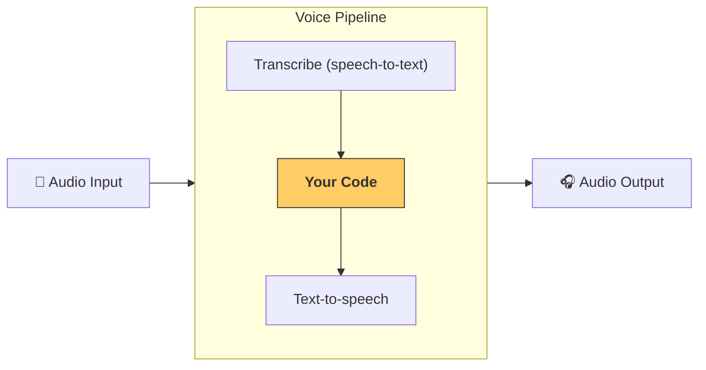

---
search:
  exclude: true
---
# パイプラインとワークフロー

[`VoicePipeline`][agents.voice.pipeline.VoicePipeline] は、エージェント ワークフローを音声アプリに簡単に変換できるクラスです。実行するワークフローを渡すと、パイプラインが入力音声の文字起こし、音声終了の検出、適切なタイミングでのワークフロー呼び出し、そしてワークフロー出力の音声化までを処理します。



## パイプラインの設定

パイプラインを作成する際には、次の項目を設定できます。

1. 新しい音声が文字起こしされるたびに実行されるコードである [`workflow`][agents.voice.workflow.VoiceWorkflowBase]
2. 使用する [`speech-to-text`][agents.voice.model.STTModel] と [`text-to-speech`][agents.voice.model.TTSModel] のモデル
3. 次のような設定が可能な [`config`][agents.voice.pipeline_config.VoicePipelineConfig]
    - モデル名をモデルに対応付けるモデルプロバイダー
    - トレーシング（トレーシングの無効化可否、音声ファイルのアップロード可否、ワークフロー名、トレース ID など）
    - プロンプト、言語、使用するデータ型などの TTS と STT のモデル設定

## パイプラインの実行

パイプラインは [`run()`][agents.voice.pipeline.VoicePipeline.run] メソッドで実行でき、音声入力を次の 2 つの形式で渡せます。

1. [`AudioInput`][agents.voice.input.AudioInput] は、完全な音声の文字起こしがあり、その結果だけを生成したい場合に使用します。話者の発話終了を検出する必要がないケース、たとえば録音済み音声や、ユーザーの発話終了が明確なプッシュトゥトーク アプリで便利です。
2. [`StreamedAudioInput`][agents.voice.input.StreamedAudioInput] は、ユーザーの発話終了を検出する必要がある場合に使用します。検出された音声チャンクを逐次プッシュでき、音声パイプラインは「アクティビティ検出」と呼ばれるプロセスを通じて、適切なタイミングで自動的にエージェント ワークフローを実行します。

## 結果

音声パイプライン実行の結果は [`StreamedAudioResult`][agents.voice.result.StreamedAudioResult] です。これは、イベントの発生と同時にストリーミングできるオブジェクトです。いくつかの種類の [`VoiceStreamEvent`][agents.voice.events.VoiceStreamEvent] があり、次を含みます。

1. [`VoiceStreamEventAudio`][agents.voice.events.VoiceStreamEventAudio] は、音声のチャンクを含みます。
2. [`VoiceStreamEventLifecycle`][agents.voice.events.VoiceStreamEventLifecycle] は、ターンの開始や終了などのライフサイクルイベントを知らせます。
3. [`VoiceStreamEventError`][agents.voice.events.VoiceStreamEventError] は、エラーイベントです。

```python

result = await pipeline.run(input)

async for event in result.stream():
    if event.type == "voice_stream_event_audio":
        # play audio
    elif event.type == "voice_stream_event_lifecycle":
        # lifecycle
    elif event.type == "voice_stream_event_error"
        # error
    ...
```

## ベストプラクティス

### 割り込み

Agents SDK は現在、[`StreamedAudioInput`][agents.voice.input.StreamedAudioInput] に対する組み込みの割り込み対応をサポートしていません。検出された各ターンごとに、ワークフローの個別の実行がトリガーされます。アプリケーション内で割り込みを処理したい場合は、[`VoiceStreamEventLifecycle`][agents.voice.events.VoiceStreamEventLifecycle] イベントをリッスンしてください。`turn_started` は新しいターンが文字起こしされ処理が開始されたことを示し、`turn_ended` は該当ターンのすべての音声がディスパッチされた後にトリガーされます。モデルがターンを開始したときに話者のマイクをミュートし、ターンに関する音声をすべてフラッシュし終えた後にミュート解除する、といった制御にこれらのイベントを利用できます。