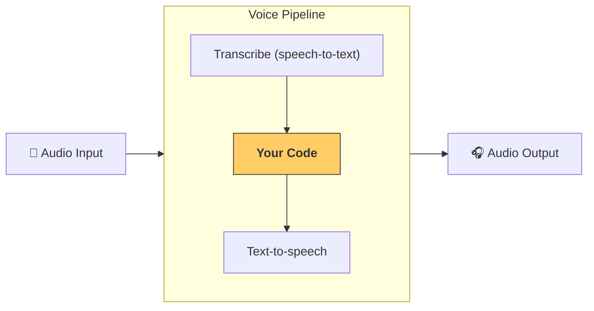

---
search:
  exclude: true
---
# パイプラインとワークフロー

[`VoicePipeline`][agents.voice.pipeline.VoicePipeline] は、エージェントのワークフローを音声アプリに変換しやすくするクラスです。実行するワークフローを渡すと、パイプラインが入力音声の文字起こし、音声終了の検出、適切なタイミングでのワークフロー呼び出し、そしてワークフロー出力を音声へ戻す処理までを担当します。



## パイプラインの設定

パイプライン作成時に、次の項目を設定できます。

1. [`workflow`][agents.voice.workflow.VoiceWorkflowBase]: 新しい音声が文字起こしされるたびに実行されるコード
2. 使用する [`speech-to-text`][agents.voice.model.STTModel] と [`text-to-speech`][agents.voice.model.TTSModel] のモデル
3. [`config`][agents.voice.pipeline_config.VoicePipelineConfig]: 次のような設定が可能です
    - モデルプロバイダー（モデル名をモデルにマッピング）
    - トレーシング（トレーシングの無効化、音声ファイルのアップロード可否、workflow 名、trace ID など）
    - TTS と STT モデルの設定（プロンプト、言語、使用するデータ型など）

## パイプラインの実行

パイプラインは [`run()`][agents.voice.pipeline.VoicePipeline.run] メソッドで実行でき、音声入力を 2 つの形で渡せます。

1. [`AudioInput`][agents.voice.input.AudioInput]: 完全な音声の書き起こしがあり、その結果だけを生成したい場合に使用します。話者の発話終了検出が不要なケース（例: 事前録音の音声や、ユーザーの発話終了が明確なプッシュトゥトークのアプリ）に適しています。
2. [`StreamedAudioInput`][agents.voice.input.StreamedAudioInput]: ユーザーの発話終了を検出する必要がある場合に使用します。検出された音声チャンクを順次プッシュでき、パイプラインは「アクティビティ検出」によって適切なタイミングで自動的にエージェントのワークフローを実行します。

## 結果

音声パイプライン実行の結果は [`StreamedAudioResult`][agents.voice.result.StreamedAudioResult] です。これは、発生するイベントをストリーミングで受け取れるオブジェクトです。[`VoiceStreamEvent`][agents.voice.events.VoiceStreamEvent] にはいくつかの種類があります。

1. [`VoiceStreamEventAudio`][agents.voice.events.VoiceStreamEventAudio]: 音声チャンクを含みます。
2. [`VoiceStreamEventLifecycle`][agents.voice.events.VoiceStreamEventLifecycle]: ターンの開始・終了などライフサイクルのイベントを通知します。
3. [`VoiceStreamEventError`][agents.voice.events.VoiceStreamEventError]: エラーイベントです。

```python

result = await pipeline.run(input)

async for event in result.stream():
    if event.type == "voice_stream_event_audio":
        # play audio
    elif event.type == "voice_stream_event_lifecycle":
        # lifecycle
    elif event.type == "voice_stream_event_error"
        # error
    ...
```

## ベストプラクティス

### 割り込み

Agents SDK は現在、[`StreamedAudioInput`][agents.voice.input.StreamedAudioInput] に対する組み込みの割り込みサポートを提供していません。検出された各ターンごとに、ワークフローの個別の実行が開始されます。アプリ内で割り込みを扱いたい場合は、[`VoiceStreamEventLifecycle`][agents.voice.events.VoiceStreamEventLifecycle] のイベントを監視してください。`turn_started` は新しいターンが文字起こしされ処理が始まったことを示します。`turn_ended` は該当ターンの音声がすべて送出された後に発火します。これらのイベントを使い、モデルがターンを開始した際に話者のマイクをミュートし、そのターンに関連する音声をすべて送出し終えた後にアンミュートするといった制御が可能です。