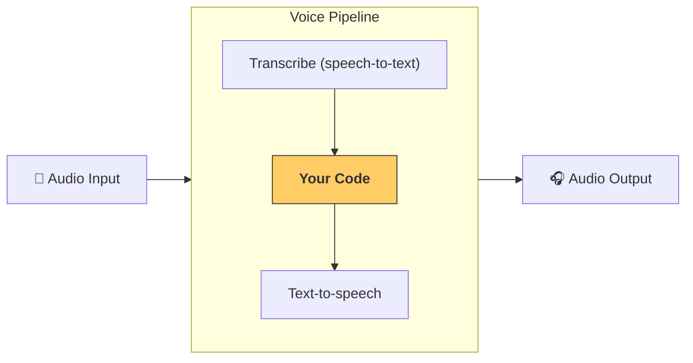

---
search:
  exclude: true
---
# パイプラインとワークフロー

[`VoicePipeline`][agents.voice.pipeline.VoicePipeline] は、エージェントのワークフローを音声アプリに簡単に変換できるクラスです。実行するワークフローを渡すと、パイプラインが入力音声の文字起こし、音声終了の検出、適切なタイミングでのワークフロー呼び出し、そしてワークフロー出力の音声への変換を担います。



## パイプラインの設定

パイプラインを作成する際、いくつかの項目を設定できます。

1. [`workflow`][agents.voice.workflow.VoiceWorkflowBase]：新しい音声が文字起こしされるたびに実行されるコードです。
2. 使用する [`speech-to-text`][agents.voice.model.STTModel] および [`text-to-speech`][agents.voice.model.TTSModel] モデル
3. [`config`][agents.voice.pipeline_config.VoicePipelineConfig]：次のような項目を設定できます。
    - モデルプロバイダー（モデル名をモデルにマッピングできます）
    - トレーシング（トレーシングを無効化するかどうか、音声ファイルをアップロードするかどうか、ワークフロー名、トレース ID など）
    - TTS および STT モデルの設定（プロンプト、言語、使用するデータ型など）

## パイプラインの実行

パイプラインは [`run()`][agents.voice.pipeline.VoicePipeline.run] メソッドで実行でき、音声入力を 2 つの形式で渡せます。

1. [`AudioInput`][agents.voice.input.AudioInput]：音声の全文書き起こしがすでにあり、それに対する結果だけを生成したい場合に使用します。話者が話し終えたタイミングを検出する必要がないケースで有用です。たとえば、事前録音の音声がある場合や、ユーザーが話し終えたことが明確な push-to-talk アプリなどです。
2. [`StreamedAudioInput`][agents.voice.input.StreamedAudioInput]：ユーザーが話し終えたことを検出する必要がある可能性がある場合に使用します。検出された音声チャンクを順次プッシュでき、音声パイプラインは「activity detection」と呼ばれるプロセスにより、適切なタイミングで自動的にエージェントのワークフローを実行します。

## 結果

音声パイプライン実行の結果は [`StreamedAudioResult`][agents.voice.result.StreamedAudioResult] です。これは、発生したイベントをストリーミングできるオブジェクトです。[`VoiceStreamEvent`][agents.voice.events.VoiceStreamEvent] にはいくつかの種類があり、たとえば次のものがあります。

1. [`VoiceStreamEventAudio`][agents.voice.events.VoiceStreamEventAudio]：音声のチャンクを含みます。
2. [`VoiceStreamEventLifecycle`][agents.voice.events.VoiceStreamEventLifecycle]：ターンの開始や終了などのライフサイクルイベントを通知します。
3. [`VoiceStreamEventError`][agents.voice.events.VoiceStreamEventError]：エラーイベントです。

```python

result = await pipeline.run(input)

async for event in result.stream():
    if event.type == "voice_stream_event_audio":
        # play audio
    elif event.type == "voice_stream_event_lifecycle":
        # lifecycle
    elif event.type == "voice_stream_event_error":
        # error
    ...
```

## ベストプラクティス

### 割り込み

Agents SDK は現在、[`StreamedAudioInput`][agents.voice.input.StreamedAudioInput] に対する組み込みの割り込みサポートを提供していません。代わりに、検出された各ターンごとに、ワークフローの別個の実行がトリガーされます。アプリケーション内で割り込みを扱いたい場合は、[`VoiceStreamEventLifecycle`][agents.voice.events.VoiceStreamEventLifecycle] イベントをリッスンできます。`turn_started` は、新しいターンが文字起こしされて処理が開始されたことを示します。`turn_ended` は、該当ターンのすべての音声がディスパッチされた後にトリガーされます。これらのイベントを使って、モデルがターンを開始したときに話者のマイクをミュートし、ターンに関連する音声をすべてフラッシュした後にミュート解除するといった実装が可能です。