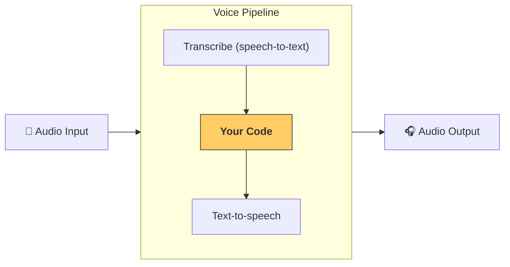

---
search:
  exclude: true
---
# パイプラインとワークフロー

[`VoicePipeline`][agents.voice.pipeline.VoicePipeline] は、エージェント型のワークフローを音声アプリにするのを容易にするクラスです。実行するワークフローを渡すと、入力音声の書き起こし、音声の終了検出、適切なタイミングでのワークフロー呼び出し、そしてワークフロー出力を音声へ戻すまでをパイプラインが処理します。



## パイプラインの設定

パイプラインを作成する際には、次の項目を設定できます。

1. [`workflow`][agents.voice.workflow.VoiceWorkflowBase]: 新しい音声が書き起こされるたびに実行されるコードです。
2. 使用する [`speech-to-text`][agents.voice.model.STTModel] と [`text-to-speech`][agents.voice.model.TTSModel] のモデル
3. [`config`][agents.voice.pipeline_config.VoicePipelineConfig]: 次のような設定が可能です。
    - モデルプロバイダー。モデル名をモデルにマッピングできます
    - トレーシング。トレーシングの無効化、音声ファイルのアップロード有無、ワークフロー名、トレース ID など
    - TTS と STT のモデル設定。プロンプト、言語、使用するデータ型など

## パイプラインの実行

パイプラインは [`run()`][agents.voice.pipeline.VoicePipeline.run] メソッドで実行でき、音声入力を次の 2 つの形式で渡せます。

1. [`AudioInput`][agents.voice.input.AudioInput]: 完全な音声を書き起こしたテキストがあり、その結果だけを生成したい場合に使用します。話者が話し終えるタイミングを検出する必要がないケースに有用です。たとえば、事前録音の音声がある場合や、ユーザーが話し終えるタイミングが明確なプッシュトゥトーク型のアプリなどです。
2. [`StreamedAudioInput`][agents.voice.input.StreamedAudioInput]: ユーザーが話し終えたかどうかを検出する必要がある場合に使用します。検出された音声チャンクを順次プッシュでき、音声パイプラインは「アクティビティ検出」と呼ばれるプロセスにより適切なタイミングで自動的にエージェントのワークフローを実行します。

## 結果

音声パイプラインの実行結果は [`StreamedAudioResult`][agents.voice.result.StreamedAudioResult] です。これは、発生するイベントをストリーミングできるオブジェクトです。いくつかの種類の [`VoiceStreamEvent`][agents.voice.events.VoiceStreamEvent] があり、次を含みます。

1. [`VoiceStreamEventAudio`][agents.voice.events.VoiceStreamEventAudio]: 音声チャンクを含みます。
2. [`VoiceStreamEventLifecycle`][agents.voice.events.VoiceStreamEventLifecycle]: ターンの開始や終了などのライフサイクルイベントを通知します。
3. [`VoiceStreamEventError`][agents.voice.events.VoiceStreamEventError]: エラーイベントです。

```python

result = await pipeline.run(input)

async for event in result.stream():
    if event.type == "voice_stream_event_audio":
        # play audio
    elif event.type == "voice_stream_event_lifecycle":
        # lifecycle
    elif event.type == "voice_stream_event_error"
        # error
    ...
```

## ベストプラクティス

### 割り込み

Agents SDK は現時点で [`StreamedAudioInput`][agents.voice.input.StreamedAudioInput] に対する組み込みの割り込み処理をサポートしていません。代わりに、検出された各ターンごとに、ワークフローの個別の実行がトリガーされます。アプリケーション内で割り込みに対応したい場合は、[`VoiceStreamEventLifecycle`][agents.voice.events.VoiceStreamEventLifecycle] イベントをリッスンしてください。`turn_started` は新しいターンが書き起こされ処理が開始されたことを示します。`turn_ended` は該当ターンの音声がすべて送出された後にトリガーされます。これらのイベントを使って、モデルがターンを開始した際に話者のマイクをミュートし、ターンに関連する音声をすべてフラッシュした後にミュートを解除するといった制御が可能です。