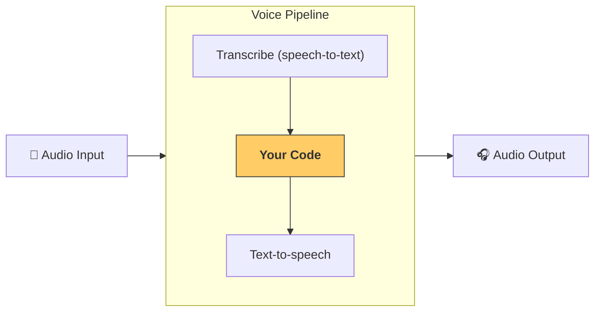

---
search:
  exclude: true
---
# パイプラインとワークフロー

[`VoicePipeline`][agents.voice.pipeline.VoicePipeline] は、エージェントオーケストレーションを音声アプリに簡単に変換できるクラスです。実行するワークフローを渡すと、パイプラインが入力音声の文字起こし、音声終了の検出、適切なタイミングでのワークフロー呼び出し、そしてワークフロー出力の音声への変換を処理します。


```mermaid
graph LR
    %% Input
    A["🎤 Audio Input"]

    %% Voice Pipeline
    subgraph Voice_Pipeline [Voice Pipeline]
        direction TB
        B["Transcribe (speech-to-text)"]
        C["Your Code"]:::highlight
        D["Text-to-speech"]
        B --> C --> D
    end

    %% Output
    E["🎧 Audio Output"]

    %% Flow
    A --> Voice_Pipeline
    Voice_Pipeline --> E

    %% Custom styling
    classDef highlight fill:#ffcc66,stroke:#333,stroke-width:1px,font-weight:700;

```

## パイプラインの設定

パイプラインを作成する際には、いくつかの項目を設定できます。

1. [`workflow`][agents.voice.workflow.VoiceWorkflowBase]。新しい音声が文字起こしされるたびに実行されるコードです。
2. 使用する [`speech-to-text`][agents.voice.model.STTModel] および [`text-to-speech`][agents.voice.model.TTSModel] モデル
3. [`config`][agents.voice.pipeline_config.VoicePipelineConfig]。以下のような項目を設定できます。
    - モデル名をモデルにマッピングできるモデルプロバイダー
    - トレーシング。トレーシングを無効にするかどうか、音声ファイルをアップロードするかどうか、ワークフロー名、トレース ID などを含みます。
    - プロンプト、言語、使用するデータ型など、 TTS および STT モデルの設定

## パイプラインの実行

パイプラインは [`run()`][agents.voice.pipeline.VoicePipeline.run] メソッドで実行でき、音声入力は 2 つの形式で渡せます。

1. [`AudioInput`][agents.voice.input.AudioInput] は、完全な音声文字起こしがあり、それに対する結果だけを生成したい場合に使用します。これは、話者が話し終えたタイミングを検出する必要がないケースで有用です。たとえば、事前録音された音声がある場合や、ユーザーが話し終えたことが明確な push-to-talk アプリなどです。
2. [`StreamedAudioInput`][agents.voice.input.StreamedAudioInput] は、ユーザーが話し終えたかどうかを検出する必要がある場合に使用します。検出された音声チャンクを随時プッシュでき、音声パイプラインは "activity detection" と呼ばれるプロセスを通じて、適切なタイミングで自動的にエージェントのワークフローを実行します。

## 結果

音声パイプライン実行の結果は [`StreamedAudioResult`][agents.voice.result.StreamedAudioResult] です。これは、発生したイベントをストリーミングできるオブジェクトです。[`VoiceStreamEvent`][agents.voice.events.VoiceStreamEvent] にはいくつかの種類があります。

1. [`VoiceStreamEventAudio`][agents.voice.events.VoiceStreamEventAudio]。音声チャンクを含みます。
2. [`VoiceStreamEventLifecycle`][agents.voice.events.VoiceStreamEventLifecycle]。ターンの開始や終了などのライフサイクルイベントを通知します。
3. [`VoiceStreamEventError`][agents.voice.events.VoiceStreamEventError]。エラーイベントです。

```python

result = await pipeline.run(input)

async for event in result.stream():
    if event.type == "voice_stream_event_audio":
        # play audio
    elif event.type == "voice_stream_event_lifecycle":
        # lifecycle
    elif event.type == "voice_stream_event_error":
        # error
    ...
```

## ベストプラクティス

### 割り込み

現在、 Agents SDK は [`StreamedAudioInput`][agents.voice.input.StreamedAudioInput] に対する組み込みの割り込み処理を提供していません。代わりに、検出された各ターンごとにワークフローの個別の実行がトリガーされます。アプリケーション内で割り込みを処理したい場合は、 [`VoiceStreamEventLifecycle`][agents.voice.events.VoiceStreamEventLifecycle] イベントを監視できます。`turn_started` は、新しいターンが文字起こしされ、処理が開始されることを示します。`turn_ended` は、対応するターンに対するすべての音声が送出された後にトリガーされます。これらのイベントを使用して、モデルがターンを開始したときに話者のマイクをミュートし、そのターンに関連する音声をすべてフラッシュした後でミュートを解除できます。