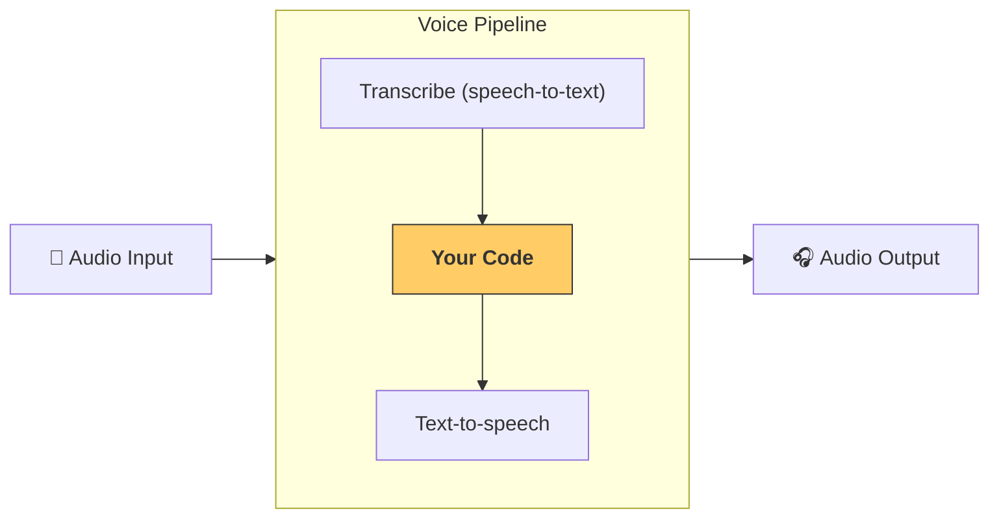

---
search:
  exclude: true
---
# パイプラインとワークフロー

[`VoicePipeline`][agents.voice.pipeline.VoicePipeline] は、エージェントを活用したワークフローを音声アプリに変換しやすくするクラスです。実行するワークフローを渡すと、パイプラインが入力音声の文字起こし、音声の終了検出、適切なタイミングでのワークフロー呼び出し、ワークフローの出力を音声に戻す処理を担います。


```mermaid
graph LR
    %% Input
    A["🎤 Audio Input"]

    %% Voice Pipeline
    subgraph Voice_Pipeline [Voice Pipeline]
        direction TB
        B["Transcribe (speech-to-text)"]
        C["Your Code"]:::highlight
        D["Text-to-speech"]
        B --> C --> D
    end

    %% Output
    E["🎧 Audio Output"]

    %% Flow
    A --> Voice_Pipeline
    Voice_Pipeline --> E

    %% Custom styling
    classDef highlight fill:#ffcc66,stroke:#333,stroke-width:1px,font-weight:700;

```

## パイプラインの設定

パイプラインを作成する際に、いくつかの項目を設定できます。

1. [`workflow`][agents.voice.workflow.VoiceWorkflowBase]。新しい音声が文字起こしされるたびに実行されるコードです。
2. 使用する [`speech-to-text`][agents.voice.model.STTModel] モデルと [`text-to-speech`][agents.voice.model.TTSModel] モデル
3. [`config`][agents.voice.pipeline_config.VoicePipelineConfig]。次のような項目を設定できます。
    - モデル名をモデルに対応付けられるモデルプロバイダー
    - トレーシング。トレーシングを無効にするか、音声ファイルをアップロードするか、ワークフロー名、トレース ID などを含みます。
    - TTS モデルと STT モデルの設定。プロンプト、言語、使用するデータ型などです。

## パイプラインの実行

[`run()`][agents.voice.pipeline.VoicePipeline.run] メソッドを使ってパイプラインを実行できます。このメソッドでは、次の 2 つの形式で音声入力を渡せます。

1. [`AudioInput`][agents.voice.input.AudioInput] は、完全な音声文字起こしがあり、それに対する実行結果だけを生成したい場合に使用します。話者が話し終えたタイミングを検出する必要がない場合に便利です。たとえば、事前録音された音声がある場合や、ユーザーが話し終えたことが明確なプッシュ・トゥ・トークアプリなどです。
2. [`StreamedAudioInput`][agents.voice.input.StreamedAudioInput] は、ユーザーが話し終えたタイミングを検出する必要がある可能性がある場合に使用します。検出された音声チャンクを送信でき、音声パイプラインは「アクティビティ検出」と呼ばれるプロセスを通じて、適切なタイミングでエージェントワークフローを自動的に実行します。

## 実行結果

音声パイプライン実行の結果は [`StreamedAudioResult`][agents.voice.result.StreamedAudioResult] です。これは、発生したイベントをストリーミングできるオブジェクトです。[`VoiceStreamEvent`][agents.voice.events.VoiceStreamEvent] には、次のようないくつかの種類があります。

1. [`VoiceStreamEventAudio`][agents.voice.events.VoiceStreamEventAudio]。音声チャンクを含みます。
2. [`VoiceStreamEventLifecycle`][agents.voice.events.VoiceStreamEventLifecycle]。ターンの開始や終了などのライフサイクルイベントを通知します。
3. [`VoiceStreamEventError`][agents.voice.events.VoiceStreamEventError]。エラーイベントです。

```python

result = await pipeline.run(input)

async for event in result.stream():
    if event.type == "voice_stream_event_audio":
        # play audio
    elif event.type == "voice_stream_event_lifecycle":
        # lifecycle
    elif event.type == "voice_stream_event_error":
        # error
    ...
```

## ベストプラクティス

### 割り込み

Agents SDK は現在、[`StreamedAudioInput`][agents.voice.input.StreamedAudioInput] に対する組み込みの割り込み処理を提供していません。代わりに、検出された各ターンごとに、ワークフローの個別の実行がトリガーされます。アプリケーション内で割り込みを処理したい場合は、[`VoiceStreamEventLifecycle`][agents.voice.events.VoiceStreamEventLifecycle] イベントをリッスンできます。`turn_started` は、新しいターンが文字起こしされ、処理が開始されたことを示します。`turn_ended` は、該当するターンのすべての音声がディスパッチされた後にトリガーされます。これらのイベントを使用して、モデルがターンを開始したときに話者のマイクをミュートし、そのターンに関連するすべての音声をフラッシュした後にミュートを解除できます。