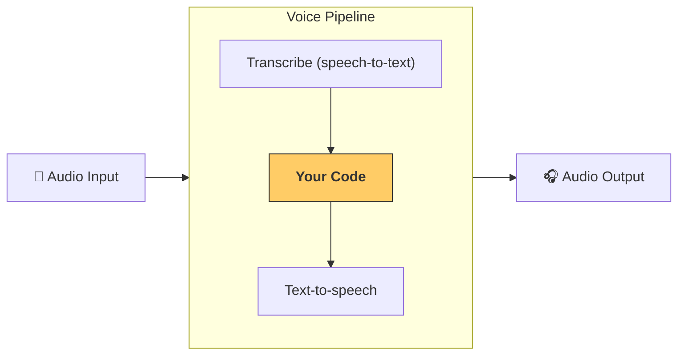

---
search:
  exclude: true
---
# パイプラインとワークフロー

[`VoicePipeline`][agents.voice.pipeline.VoicePipeline] は、エージェントワークフローを音声アプリへ簡単に変換できるクラスです。実行するワークフローを渡すと、パイプラインが入力音声の文字起こし、音声終了の検出、適切なタイミングでのワークフローの呼び出し、ワークフロー出力の音声への再変換を処理します。


```mermaid
graph LR
    %% Input
    A["🎤 Audio Input"]

    %% Voice Pipeline
    subgraph Voice_Pipeline [Voice Pipeline]
        direction TB
        B["Transcribe (speech-to-text)"]
        C["Your Code"]:::highlight
        D["Text-to-speech"]
        B --> C --> D
    end

    %% Output
    E["🎧 Audio Output"]

    %% Flow
    A --> Voice_Pipeline
    Voice_Pipeline --> E

    %% Custom styling
    classDef highlight fill:#ffcc66,stroke:#333,stroke-width:1px,font-weight:700;

```

## パイプラインの設定 {#configuring-a-pipeline}

パイプラインを作成するときは、いくつかの項目を設定できます。

1. [`workflow`][agents.voice.workflow.VoiceWorkflowBase]。新しい音声が文字起こしされるたびに実行されるコードです。
2. 使用する [`speech-to-text`][agents.voice.model.STTModel] および [`text-to-speech`][agents.voice.model.TTSModel] モデル
3. [`config`][agents.voice.pipeline_config.VoicePipelineConfig]。次のような項目を設定できます。
    - モデル名をモデルにマッピングできるモデルプロバイダー
    - トレーシングを無効にするかどうか、音声ファイルをアップロードするかどうか、ワークフロー名、トレース ID などを含むトレーシング
    - プロンプト、言語、使用するデータ型など、TTS および STT モデルの設定

### 単一エージェントワークフローへのアプリケーションコンテキストの受け渡し {#pass-application-context-to-a-single-agent-workflow}

音声エージェント、そのツール、またはライフサイクルフックでアプリケーションの状態や依存関係が必要な場合は、[`SingleAgentVoiceWorkflow`][agents.voice.workflow.SingleAgentVoiceWorkflow] に `context` を渡します。

```python
from dataclasses import dataclass

from agents import Agent
from agents.voice import SingleAgentVoiceWorkflow, VoicePipeline


@dataclass
class VoiceContext:
    user_id: str


agent = Agent[VoiceContext](name="Voice assistant")
workflow = SingleAgentVoiceWorkflow(
    agent,
    context=VoiceContext(user_id="user-123"),
)
pipeline = VoicePipeline(workflow=workflow)
```

ワークフローは、後続の文字起こしターンを含め、開始するすべてのエージェント実行に同じコンテキストオブジェクトを渡します。ツールとライフサイクルフックは、[`RunContextWrapper.context`][agents.run_context.RunContextWrapper.context] を通じてこのオブジェクトを受け取ります。コンテキストはアプリケーション内にのみ保持され、モデルには送信されません。型付けとライフサイクルに関するガイダンスについては、[コンテキスト管理](../context.md)を参照してください。

### OpenAI 音声モデルの設定 {#configure-openai-speech-models}

デフォルトの OpenAI 音声モデルを設定するには、`VoicePipelineConfig` を通じて [`STTModelSettings`][agents.voice.model.STTModelSettings] と [`TTSModelSettings`][agents.voice.model.TTSModelSettings] を渡します。

```python
from agents.voice import STTModelSettings, TTSModelSettings, VoicePipeline, VoicePipelineConfig

config = VoicePipelineConfig(
    stt_settings=STTModelSettings(
        language="en",
        prompt="A customer support call about product AC-42.",
    ),
    tts_settings=TTSModelSettings(
        voice="marin",
    ),
)
pipeline = VoicePipeline(workflow=workflow, config=config)
```

完全な音声入力では、`STTModelSettings.language` と `prompt` が文字起こしリクエストに渡されます。[`StreamedAudioInput`][agents.voice.input.StreamedAudioInput] の場合、WebSocket セッションの設定時に、OpenAI の文字起こしセッションにも `language`、`prompt`、およびストリーミング専用の `languages` と `keywords` の設定が渡されます。`gpt-transcribe` と `gpt-live-transcribe` は、想定される入力言語のリストである `languages` と、音声に含まれる可能性があるリテラル語句のリストである `keywords` を使用します。`languages` が設定されている場合は、`language` より優先されます。それ以外の場合、これら 2 つのモデルには、SDK の単一の `language` 値が、要素 1 つの `languages` リストとして渡されます。その他の文字起こしモデルには、引き続き単一の `language` フィールドが渡されます。API がサポートする言語コードを使用し、`prompt` には文字起こしタスクを改めて記述するのではなく、録音内容や収録環境を記述してください。キーワードは文字起こしのヒントであり、必須の出力ではありません。OpenAI の[文字起こしコンテキストガイド](https://developers.openai.com/api/docs/guides/transcription#improve-transcription-quality)を参照してください。

想定言語を切り替えられるストリーミング文字起こしでは、ストリーミング専用フィールドを明示的に設定します。

```python
config = VoicePipelineConfig(
    stt_settings=STTModelSettings(
        languages=["en", "es"],
        keywords=["AC-42", "Agents SDK"],
        prompt="A customer support call about product AC-42.",
    ),
)
```

`TTSModelSettings.dtype` では、`np.int16`、`np.float32`、`"int16"`、`"float32"`、および `"f4"` などのエイリアスを含め、ネイティブの `int16` または `float32` として解決される NumPy dtype 表記を使用できます。その他の dtype や非ネイティブのバイトオーダーを指定すると、パイプラインがストリーミングされた TTS 音声を変換するときに [`UserError`][agents.exceptions.UserError] が発生します。

サポートされている組み込みの `TTSModelSettings.voice` 値は、`alloy`、`ash`、`ballad`、`coral`、`echo`、`fable`、`onyx`、`nova`、`sage`、`shimmer`、`verse`、`marin`、`cedar` です。音声の利用可否は、選択した音声合成モデルによって異なります。現在のモデル別の利用可否については、OpenAI の[音声オプション](https://developers.openai.com/api/docs/guides/text-to-speech#voice-options)を参照してください。OpenAI カスタム音声へのアクセス権を持つ組織は、代わりにカスタム音声 ID を渡すことができます。

```python
config = VoicePipelineConfig(
    tts_settings=TTSModelSettings(
        voice={"id": "voice_123abc"},
    ),
)
```

カスタム音声は対象となる顧客のみ利用でき、使用前に OpenAI API を通じて作成する必要があります。アクセス、同意、作成の要件については、OpenAI の[カスタム音声ガイド](https://developers.openai.com/api/docs/guides/text-to-speech#custom-voices)を参照してください。

[`OpenAIVoiceModelProvider`][agents.voice.models.openai_model_provider.OpenAIVoiceModelProvider] は、設定された `AsyncOpenAI` クライアントを、非ストリーミングの文字起こしリクエスト、TTS リクエスト、ストリーミング STT 接続に使用します。ストリーミング STT の WebSocket 接続は、そのクライアントからエンドポイント、認証設定、デフォルトヘッダー、デフォルトクエリパラメーターを取得します。プロバイダーの所有権と優先順位のルールについては、[API キーとクライアント](../config.md#api-keys-and-clients)を参照してください。

## パイプラインの実行 {#running-a-pipeline}

パイプラインは [`run()`][agents.voice.pipeline.VoicePipeline.run] メソッドで実行でき、次の 2 つの形式で音声入力を渡せます。

1. [`AudioInput`][agents.voice.input.AudioInput] は、完全な音声入力があり、その実行結果のみを生成する場合に使用します。話者が話し終えたことを検出する必要がない場合に便利です。たとえば、事前に録音された音声を使用する場合や、ユーザーが話し終えたタイミングが明確なプッシュトゥトークアプリの場合です。
2. [`StreamedAudioInput`][agents.voice.input.StreamedAudioInput] は、ユーザーが話し終えたことを検出する必要がある場合に使用します。検出された音声チャンクを随時プッシュでき、音声パイプラインは「アクティビティ検出」と呼ばれる処理を通じて、適切なタイミングでエージェントワークフローを自動的に実行します。

## 実行結果 {#results}

音声パイプラインを実行した結果は、[`StreamedAudioResult`][agents.voice.result.StreamedAudioResult] です。これは、イベントの発生時にストリーミングできるオブジェクトです。[`VoiceStreamEvent`][agents.voice.events.VoiceStreamEvent] には、次のようないくつかの種類があります。

1. [`VoiceStreamEventAudio`][agents.voice.events.VoiceStreamEventAudio]。音声チャンクが含まれます。
2. [`VoiceStreamEventLifecycle`][agents.voice.events.VoiceStreamEventLifecycle]。ターンの開始や終了などのライフサイクルイベントを通知します。
3. [`VoiceStreamEventError`][agents.voice.events.VoiceStreamEventError]。エラーイベントです。

パイプラインを終了させるエラーは、アプリケーションが [`StreamedAudioResult.stream()`][agents.voice.result.StreamedAudioResult.stream] を処理している間に送出されます。それ以外は正常に完了した実行後に音声テキスト変換の文字起こしセッションをクローズできなかった場合、ストリームは無期限に待機するのではなく、そのクローズエラーを送出します。ターンがすでに失敗しており、文字起こしセッションのクローズにも失敗した場合、ストリームは元のターンエラーを主要なエラーとして保持します。

```python

result = await pipeline.run(input)

async for event in result.stream():
    if event.type == "voice_stream_event_audio":
        # play audio
        pass
    elif event.type == "voice_stream_event_lifecycle":
        # lifecycle
        pass
    elif event.type == "voice_stream_event_error":
        # error
        pass
```

## ベストプラクティス {#best-practices}

### 割り込み {#interruptions}

現在、Agents SDK は [`StreamedAudioInput`][agents.voice.input.StreamedAudioInput] に組み込みの割り込み処理を提供していません。代わりに、検出されたターンごとにワークフローが個別に実行されます。アプリケーション内で割り込みを処理する場合は、[`VoiceStreamEventLifecycle`][agents.voice.events.VoiceStreamEventLifecycle] イベントを監視できます。`turn_started` は、新しいターンが文字起こしされ、処理が開始されたことを示します。`turn_ended` は、該当するターンのすべての音声が送出された後にトリガーされます。これらのイベントを使用して、モデルがターンを開始したときに話者のマイクをミュートし、そのターンに関連するすべての音声をアプリケーションが再生し終えた後にミュートを解除できます。