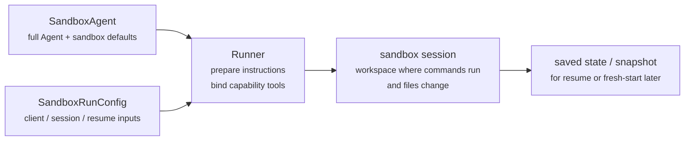
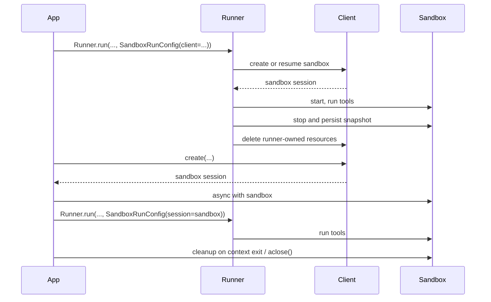

---
search:
  exclude: true
---
# 개념

!!! warning "베타 기능"

    샌드박스 에이전트는 베타 기능입니다. API, 기본값, 지원 기능의 세부 사항은 일반 공개(GA) 전에 변경될 수 있으며, 시간이 지남에 따라 더 고급 기능이 추가될 수 있습니다.

최신 에이전트는 파일시스템의 실제 파일을 다룰 수 있을 때 가장 잘 작동합니다. **샌드박스 에이전트** 는 특수 도구와 셸 명령을 사용하여 대규모 문서 집합을 검색하고 조작하며, 파일을 편집하고, 아티팩트를 생성하고, 명령을 실행할 수 있습니다. 샌드박스는 에이전트가 사용자를 대신해 작업할 수 있는 지속 작업 공간을 모델에 제공합니다. Agents SDK 의 샌드박스 에이전트는 샌드박스 환경과 결합된 에이전트를 쉽게 실행할 수 있도록 도와주며, 파일시스템에 올바른 파일을 배치하고 샌드박스를 오케스트레이션하여 대규모로 작업을 쉽게 시작, 중지, 재개할 수 있게 합니다.

에이전트에 필요한 데이터를 중심으로 작업 공간을 정의합니다. 작업 공간은 GitHub 리포지토리, 로컬 파일과 디렉터리, 합성 작업 파일, S3 또는 Azure Blob Storage 같은 원격 파일시스템, 그리고 사용자가 제공하는 기타 샌드박스 입력에서 시작할 수 있습니다.

<div class="sandbox-harness-image" markdown="1">


</div>

`SandboxAgent` 는 여전히 `Agent` 입니다. `instructions`, `prompt`, `tools`, `handoffs`, `mcp_servers`, `model_settings`, `output_type`, 가드레일, 훅 같은 일반적인 에이전트 표면을 유지하며, 여전히 일반 `Runner` API 를 통해 실행됩니다. 달라지는 것은 실행 경계입니다.

- `SandboxAgent` 는 에이전트 자체를 정의합니다. 일반 에이전트 구성에 더해 `default_manifest`, `base_instructions`, `run_as` 같은 샌드박스별 기본값과 파일시스템 도구, 셸 접근, 스킬, 메모리, compaction 같은 기능을 포함합니다.
- `Manifest` 는 파일, 리포지토리, 마운트, 환경을 포함하여 새 샌드박스 작업 공간의 원하는 시작 콘텐츠와 레이아웃을 선언합니다.
- 샌드박스 세션은 명령이 실행되고 파일이 변경되는 실행 중인 격리 환경입니다.
- [`SandboxRunConfig`][agents.run_config.SandboxRunConfig] 는 실행이 해당 샌드박스 세션을 얻는 방법을 결정합니다. 예를 들어 세션을 직접 주입하거나, 직렬화된 샌드박스 세션 상태에서 다시 연결하거나, 샌드박스 클라이언트를 통해 새 샌드박스 세션을 만들 수 있습니다.
- 저장된 샌드박스 상태와 스냅샷을 통해 이후 실행이 이전 작업에 다시 연결하거나 저장된 콘텐츠에서 새 샌드박스 세션을 시드할 수 있습니다.

`Manifest` 는 새 세션 작업 공간 계약이지, 모든 실행 중인 샌드박스의 전체 기준 데이터가 아닙니다. 실행의 유효 작업 공간은 대신 재사용된 샌드박스 세션, 직렬화된 샌드박스 세션 상태, 또는 실행 시 선택된 스냅샷에서 올 수 있습니다.

이 페이지 전체에서 "샌드박스 세션"은 샌드박스 클라이언트가 관리하는 실행 중인 실행 환경을 의미합니다. 이는 [세션](../sessions/index.md) 에 설명된 SDK 의 대화형 [`Session`][agents.memory.session.Session] 인터페이스와 다릅니다.

외부 런타임은 여전히 승인, 트레이싱, 핸드오프, 재개용 기록 관리를 담당합니다. 샌드박스 세션은 명령, 파일 변경, 환경 격리를 담당합니다. 이 분리는 모델의 핵심 부분입니다.

### 구성 요소의 결합 방식

샌드박스 실행은 에이전트 정의와 실행별 샌드박스 구성을 결합합니다. 러너는 에이전트를 준비하고, 이를 실행 중인 샌드박스 세션에 바인딩하며, 이후 실행을 위해 상태를 저장할 수 있습니다.



샌드박스별 기본값은 `SandboxAgent` 에 둡니다. 실행별 샌드박스 세션 선택은 `SandboxRunConfig` 에 둡니다.

생명주기를 세 단계로 생각해 보세요.

1. `SandboxAgent`, `Manifest`, 기능으로 에이전트와 새 작업 공간 계약을 정의합니다.
2. 샌드박스 세션을 주입, 재개, 또는 생성하는 `SandboxRunConfig` 를 `Runner` 에 전달하여 실행을 수행합니다.
3. 러너가 관리하는 `RunState`, 명시적 샌드박스 `session_state`, 또는 저장된 작업 공간 스냅샷에서 나중에 이어서 진행합니다.

셸 접근이 가끔 사용하는 도구 하나에 불과하다면 [도구 가이드](../tools.md) 의 호스티드 셸부터 시작하세요. 작업 공간 격리, 샌드박스 클라이언트 선택, 또는 샌드박스 세션 재개 동작이 설계의 일부라면 샌드박스 에이전트를 사용하세요.

## 사용 시점

샌드박스 에이전트는 작업 공간 중심 워크플로에 적합합니다. 예를 들면 다음과 같습니다.

- 코딩과 디버깅. 예를 들어 GitHub 리포지토리의 이슈 보고에 대한 자동 수정 사항을 오케스트레이션하고 대상 테스트를 실행하는 경우
- 문서 처리와 편집. 예를 들어 사용자의 금융 문서에서 정보를 추출하고 완성된 세금 양식 초안을 만드는 경우
- 파일 기반 검토 또는 분석. 예를 들어 답변 전에 온보딩 패킷, 생성된 보고서, 아티팩트 번들을 확인하는 경우
- 격리된 멀티 에이전트 패턴. 예를 들어 각 검토자 또는 코딩 하위 에이전트에 자체 작업 공간을 제공하는 경우
- 다단계 작업 공간 작업. 예를 들어 한 실행에서 버그를 수정하고 이후 회귀 테스트를 추가하거나, 스냅샷 또는 샌드박스 세션 상태에서 재개하는 경우

파일이나 실행 중인 파일시스템에 접근할 필요가 없다면 계속 `Agent` 를 사용하세요. 셸 접근이 가끔 필요한 기능 하나일 뿐이라면 호스티드 셸을 추가하세요. 작업 공간 경계 자체가 기능의 일부라면 샌드박스 에이전트를 사용하세요.

## 샌드박스 클라이언트 선택

로컬 개발에는 `UnixLocalSandboxClient` 로 시작하세요. 컨테이너 격리나 이미지 동등성이 필요하면 `DockerSandboxClient` 로 이동하세요. 공급자가 관리하는 실행이 필요하면 호스티드 제공자로 이동하세요.

대부분의 경우 `SandboxAgent` 정의는 그대로 유지하고, 샌드박스 클라이언트와 해당 옵션만 [`SandboxRunConfig`][agents.run_config.SandboxRunConfig] 에서 변경합니다. 로컬, Docker, 호스티드, 원격 마운트 옵션은 [샌드박스 클라이언트](clients.md) 를 참고하세요.

## 핵심 구성 요소

<div class="sandbox-nowrap-first-column-table" markdown="1">

| 계층 | 주요 SDK 구성 요소 | 답하는 질문 |
| --- | --- | --- |
| 에이전트 정의 | `SandboxAgent`, `Manifest`, 기능 | 어떤 에이전트를 실행할 것이며, 어떤 새 세션 작업 공간 계약에서 시작해야 하나요? |
| 샌드박스 실행 | `SandboxRunConfig`, 샌드박스 클라이언트, 실행 중인 샌드박스 세션 | 이 실행은 실행 중인 샌드박스 세션을 어떻게 얻고, 작업은 어디에서 실행되나요? |
| 저장된 샌드박스 상태 | `RunState` 샌드박스 페이로드, `session_state`, 스냅샷 | 이 워크플로는 이전 샌드박스 작업에 어떻게 다시 연결하거나 저장된 콘텐츠에서 새 샌드박스 세션을 시드하나요? |

</div>

주요 SDK 구성 요소는 이러한 계층에 다음과 같이 매핑됩니다.

<div class="sandbox-nowrap-first-column-table" markdown="1">

| 구성 요소 | 담당 범위 | 확인할 질문 |
| --- | --- | --- |
| [`SandboxAgent`][agents.sandbox.sandbox_agent.SandboxAgent] | 에이전트 정의 | 이 에이전트는 무엇을 해야 하며, 어떤 기본값을 함께 가져가야 하나요? |
| [`Manifest`][agents.sandbox.manifest.Manifest] | 새 세션 작업 공간 파일과 폴더 | 실행이 시작될 때 파일시스템에 어떤 파일과 폴더가 있어야 하나요? |
| [`Capability`][agents.sandbox.capabilities.capability.Capability] | 샌드박스 네이티브 동작 | 어떤 도구, 지시문 조각, 또는 런타임 동작을 이 에이전트에 연결해야 하나요? |
| [`SandboxRunConfig`][agents.run_config.SandboxRunConfig] | 실행별 샌드박스 클라이언트와 샌드박스 세션 소스 | 이 실행은 샌드박스 세션을 주입, 재개, 또는 생성해야 하나요? |
| [`RunState`][agents.run_state.RunState] | 러너가 관리하는 저장된 샌드박스 상태 | 이전에 러너가 관리하던 워크플로를 재개하며 해당 샌드박스 상태를 자동으로 이어가고 있나요? |
| [`SandboxRunConfig.session_state`][agents.run_config.SandboxRunConfig.session_state] | 명시적인 직렬화된 샌드박스 세션 상태 | `RunState` 외부에서 이미 직렬화한 샌드박스 상태에서 재개하고 싶나요? |
| [`SandboxRunConfig.snapshot`][agents.run_config.SandboxRunConfig.snapshot] | 새 샌드박스 세션을 위한 저장된 작업 공간 콘텐츠 | 새 샌드박스 세션이 저장된 파일과 아티팩트에서 시작해야 하나요? |

</div>

실용적인 설계 순서는 다음과 같습니다.

1. `Manifest` 로 새 세션 작업 공간 계약을 정의합니다.
2. `SandboxAgent` 로 에이전트를 정의합니다.
3. 기본 제공 기능 또는 사용자 지정 기능을 추가합니다.
4. 각 실행이 샌드박스 세션을 어떻게 얻을지 `RunConfig(sandbox=SandboxRunConfig(...))` 에서 결정합니다.

## 샌드박스 실행 준비 방식

실행 시 러너는 해당 정의를 구체적인 샌드박스 기반 실행으로 변환합니다.

1. `SandboxRunConfig` 에서 샌드박스 세션을 확인합니다.
   `session=...` 을 전달하면 해당 실행 중인 샌드박스 세션을 재사용합니다.
   그렇지 않으면 `client=...` 를 사용하여 세션을 만들거나 재개합니다.
2. 실행의 유효 작업 공간 입력을 결정합니다.
   실행이 샌드박스 세션을 주입하거나 재개하는 경우 기존 샌드박스 상태가 우선합니다.
   그렇지 않으면 러너는 일회성 manifest 재정의 또는 `agent.default_manifest` 에서 시작합니다.
   이 때문에 `Manifest` 만으로는 모든 실행의 최종 실행 중 작업 공간을 정의할 수 없습니다.
3. 기능이 결과 manifest 를 처리하도록 합니다.
   이는 기능이 최종 에이전트가 준비되기 전에 파일, 마운트, 또는 기타 작업 공간 범위 동작을 추가할 수 있는 방식입니다.
4. 고정된 순서로 최종 instructions 를 구성합니다.
   SDK 의 기본 샌드박스 프롬프트, 또는 명시적으로 재정의한 경우 `base_instructions`, 그다음 `instructions`, 기능 지시문 조각, 원격 마운트 정책 텍스트, 렌더링된 파일시스템 트리 순서입니다.
5. 기능 도구를 실행 중인 샌드박스 세션에 바인딩하고 준비된 에이전트를 일반 `Runner` API 를 통해 실행합니다.

샌드박싱은 턴의 의미를 바꾸지 않습니다. 턴은 여전히 모델 단계이지, 단일 셸 명령이나 샌드박스 동작이 아닙니다. 샌드박스 측 작업과 턴 사이에는 고정된 1:1 매핑이 없습니다. 일부 작업은 샌드박스 실행 계층 내부에 머물 수 있고, 다른 동작은 또 다른 모델 단계가 필요한 도구 결과, 승인, 또는 기타 상태를 반환할 수 있습니다. 실용적인 규칙으로는, 샌드박스 작업이 발생한 뒤 에이전트 런타임에 또 다른 모델 응답이 필요할 때만 추가 턴이 소비됩니다.

이러한 준비 단계 때문에 `SandboxAgent` 를 설계할 때는 `default_manifest`, `instructions`, `base_instructions`, `capabilities`, `run_as` 가 고려해야 할 주요 샌드박스별 옵션입니다.

## `SandboxAgent` 옵션

다음은 일반적인 `Agent` 필드에 더해 제공되는 샌드박스별 옵션입니다.

<div class="sandbox-nowrap-first-column-table" markdown="1">

| 옵션 | 최적의 용도 |
| --- | --- |
| `default_manifest` | 러너가 생성하는 새 샌드박스 세션의 기본 작업 공간입니다. |
| `instructions` | SDK 샌드박스 프롬프트 뒤에 추가되는 역할, 워크플로, 성공 기준입니다. |
| `base_instructions` | SDK 샌드박스 프롬프트를 대체하는 고급 우회 수단입니다. |
| `capabilities` | 이 에이전트와 함께 이동해야 하는 샌드박스 네이티브 도구와 동작입니다. |
| `run_as` | 셸 명령, 파일 읽기, 패치 같은 모델이 호출하는 샌드박스 도구의 사용자 ID 입니다. |

</div>

샌드박스 클라이언트 선택, 샌드박스 세션 재사용, manifest 재정의, 스냅샷 선택은 에이전트가 아니라 [`SandboxRunConfig`][agents.run_config.SandboxRunConfig] 에 속합니다.

### `default_manifest`

`default_manifest` 는 러너가 이 에이전트에 대해 새 샌드박스 세션을 생성할 때 사용하는 기본 [`Manifest`][agents.sandbox.manifest.Manifest] 입니다. 에이전트가 일반적으로 시작해야 하는 파일, 리포지토리, 도움 자료, 출력 디렉터리, 마운트에 사용하세요.

이는 기본값일 뿐입니다. 실행은 `SandboxRunConfig(manifest=...)` 로 이를 재정의할 수 있으며, 재사용되거나 재개된 샌드박스 세션은 기존 작업 공간 상태를 유지합니다.

### `instructions` 및 `base_instructions`

여러 프롬프트에서도 유지되어야 하는 짧은 규칙에는 `instructions` 를 사용하세요. `SandboxAgent` 에서 이러한 instructions 는 SDK 의 샌드박스 기본 프롬프트 뒤에 추가되므로, 기본 제공 샌드박스 안내를 유지하면서 고유한 역할, 워크플로, 성공 기준을 추가할 수 있습니다.

SDK 샌드박스 기본 프롬프트를 대체하려는 경우에만 `base_instructions` 를 사용하세요. 대부분의 에이전트는 이를 설정하지 않아야 합니다.

<div class="sandbox-nowrap-first-column-table" markdown="1">

| 넣을 위치 | 용도 | 예시 |
| --- | --- | --- |
| `instructions` | 에이전트의 안정적인 역할, 워크플로 규칙, 성공 기준 | "온보딩 문서를 검사한 다음 핸드오프하세요.", "최종 파일을 `output/` 내부에 작성하세요." |
| `base_instructions` | SDK 샌드박스 기본 프롬프트의 전체 대체 | 사용자 지정 저수준 샌드박스 래퍼 프롬프트 |
| 사용자 프롬프트 | 이 실행을 위한 일회성 요청 | "이 작업 공간을 요약하세요." |
| manifest 의 작업 공간 파일 | 더 긴 작업 명세, 리포지토리 로컬 지침, 또는 범위가 제한된 참고 자료 | `repo/task.md`, 문서 번들, 샘플 패킷 |

</div>

`instructions` 의 좋은 사용 예는 다음과 같습니다.

- [examples/sandbox/unix_local_pty.py](https://github.com/openai/openai-agents-python/blob/main/examples/sandbox/unix_local_pty.py) 는 PTY 상태가 중요할 때 에이전트를 하나의 인터랙티브 프로세스 안에 유지합니다.
- [examples/sandbox/handoffs.py](https://github.com/openai/openai-agents-python/blob/main/examples/sandbox/handoffs.py) 는 샌드박스 검토자가 검사 후 사용자에게 직접 답변하는 것을 금지합니다.
- [examples/sandbox/tax_prep.py](https://github.com/openai/openai-agents-python/blob/main/examples/sandbox/tax_prep.py) 는 최종으로 채워진 파일이 실제로 `output/` 에 저장되도록 요구합니다.
- [examples/sandbox/docs/coding_task.py](https://github.com/openai/openai-agents-python/blob/main/examples/sandbox/docs/coding_task.py) 는 정확한 검증 명령을 고정하고 작업 공간 루트 기준 상대 패치 경로를 명확히 합니다.

사용자의 일회성 작업을 `instructions` 에 복사하거나, manifest 에 넣어야 하는 긴 참고 자료를 포함하거나, 기본 제공 기능이 이미 주입하는 도구 문서를 반복하거나, 런타임에 모델이 필요로 하지 않는 로컬 설치 참고사항을 섞는 것은 피하세요.

`instructions` 를 생략해도 SDK 는 기본 샌드박스 프롬프트를 포함합니다. 이는 저수준 래퍼에는 충분하지만, 대부분의 사용자 대상 에이전트는 여전히 명시적인 `instructions` 를 제공해야 합니다.

### `capabilities`

기능은 샌드박스 네이티브 동작을 `SandboxAgent` 에 연결합니다. 기능은 실행 시작 전에 작업 공간을 구성하고, 샌드박스별 지시문을 추가하고, 실행 중인 샌드박스 세션에 바인딩되는 도구를 노출하며, 해당 에이전트의 모델 동작이나 입력 처리를 조정할 수 있습니다.

기본 제공 기능은 다음과 같습니다.

<div class="sandbox-nowrap-first-column-table" markdown="1">

| 기능 | 추가할 시점 | 참고 |
| --- | --- | --- |
| `Shell` | 에이전트에 셸 접근이 필요할 때 | `exec_command` 를 추가하며, 샌드박스 클라이언트가 PTY 상호작용을 지원하면 `write_stdin` 도 추가합니다. |
| `Filesystem` | 에이전트가 파일을 편집하거나 로컬 이미지를 검사해야 할 때 | `apply_patch` 와 `view_image` 를 추가합니다. 패치 경로는 작업 공간 루트 기준 상대 경로입니다. |
| `Skills` | 샌드박스에서 스킬 검색과 구체화를 사용하려는 경우 | `.agents` 또는 `.agents/skills` 를 수동으로 마운트하는 대신 이를 선호하세요. `Skills` 가 스킬을 인덱싱하고 샌드박스에 구체화합니다. |
| `Memory` | 후속 실행이 메모리 아티팩트를 읽거나 생성해야 할 때 | `Shell` 이 필요합니다. 라이브 업데이트에는 `Filesystem` 도 필요합니다. |
| `Compaction` | 장기 실행 흐름에서 compaction 항목 이후 컨텍스트 트리밍이 필요할 때 | 모델 샘플링과 입력 처리를 조정합니다. |

</div>

기본적으로 `SandboxAgent.capabilities` 는 `Filesystem()`, `Shell()`, `Compaction()` 을 포함하는 `Capabilities.default()` 를 사용합니다. `capabilities=[...]` 를 전달하면 해당 목록이 기본값을 대체하므로, 여전히 원하는 기본 기능을 모두 포함하세요.

스킬의 경우, 구체화하려는 방식에 따라 소스를 선택하세요.

- `Skills(lazy_from=LocalDirLazySkillSource(...))` 는 더 큰 로컬 스킬 디렉터리에 좋은 기본값입니다. 모델이 먼저 인덱스를 발견하고 필요한 것만 로드할 수 있기 때문입니다.
- `LocalDirLazySkillSource(source=LocalDir(src=...))` 는 SDK 프로세스가 실행 중인 파일시스템에서 읽습니다. 샌드박스 이미지나 작업 공간 내부에만 존재하는 경로가 아니라 원래의 호스트 측 스킬 디렉터리를 전달하세요.
- `Skills(from_=LocalDir(src=...))` 는 처음부터 스테이징하려는 작은 로컬 번들에 더 적합합니다.
- `Skills(from_=GitRepo(repo=..., ref=...))` 는 스킬 자체가 리포지토리에서 와야 할 때 적합합니다.

`LocalDir.src` 는 SDK 호스트의 소스 경로입니다. `skills_path` 는 `load_skill` 이 호출될 때 스킬이 스테이징되는 샌드박스 작업 공간 내부의 상대 대상 경로입니다.

스킬이 이미 디스크의 `.agents/skills/<name>/SKILL.md` 같은 위치에 있다면 `LocalDir(...)` 이 해당 소스 루트를 가리키도록 하고, 그래도 `Skills(...)` 를 사용해 노출하세요. 다른 샌드박스 내부 레이아웃에 의존하는 기존 작업 공간 계약이 없다면 기본 `skills_path=".agents"` 를 유지하세요.

적합한 경우에는 기본 제공 기능을 선호하세요. 기본 제공 기능이 포괄하지 않는 샌드박스별 도구 또는 지시문 표면이 필요한 경우에만 사용자 지정 기능을 작성하세요.

## 개념

### Manifest

[`Manifest`][agents.sandbox.manifest.Manifest] 는 새 샌드박스 세션의 작업 공간을 설명합니다. 작업 공간 `root` 를 설정하고, 파일과 디렉터리를 선언하고, 로컬 파일을 복사해 넣고, Git 리포지토리를 클론하고, 원격 스토리지 마운트를 연결하고, 환경 변수를 설정하고, 사용자 또는 그룹을 정의하고, 작업 공간 밖의 특정 절대 경로에 대한 접근 권한을 부여할 수 있습니다.

매니페스트 엔트리 경로는 작업 공간 기준 상대 경로입니다. 절대 경로일 수 없으며 `..` 로 작업 공간을 벗어날 수 없습니다. 이를 통해 작업 공간 계약을 로컬, Docker, 호스티드 클라이언트 전반에서 이식 가능하게 유지합니다.

작업이 시작되기 전에 에이전트에 필요한 자료에는 매니페스트 엔트리를 사용하세요.

<div class="sandbox-nowrap-first-column-table" markdown="1">

| Manifest 엔트리 | 용도 |
| --- | --- |
| `File`, `Dir` | 작은 합성 입력, 도움 파일, 또는 출력 디렉터리 |
| `LocalFile`, `LocalDir` | 샌드박스에 구체화해야 하는 호스트 파일 또는 디렉터리 |
| `GitRepo` | 작업 공간으로 가져와야 하는 리포지토리 |
| `S3Mount`, `GCSMount`, `R2Mount`, `AzureBlobMount`, `BoxMount`, `S3FilesMount` 같은 마운트 | 샌드박스 내부에 표시되어야 하는 외부 스토리지 |

</div>

`Dir` 은 합성 자식에서 또는 출력 위치로 샌드박스 작업 공간 안에 디렉터리를 만듭니다. 호스트 파일시스템에서 읽지는 않습니다. 기존 호스트 디렉터리를 샌드박스 작업 공간으로 복사해야 할 때는 `LocalDir` 을 사용하세요.

`LocalFile.src` 와 `LocalDir.src` 는 기본적으로 SDK 프로세스 작업 디렉터리를 기준으로 해석됩니다. 소스는 `extra_path_grants` 로 포함되지 않는 한 해당 기본 디렉터리 아래에 있어야 합니다. 이를 통해 로컬 소스 구체화를 샌드박스 manifest 의 나머지 부분과 동일한 호스트 경로 신뢰 경계 안에 유지합니다.

마운트 엔트리는 노출할 스토리지를 설명하고, 마운트 전략은 샌드박스 백엔드가 해당 스토리지를 연결하는 방식을 설명합니다. 마운트 옵션과 제공자 지원은 [샌드박스 클라이언트](clients.md#mounts-and-remote-storage) 를 참고하세요.

좋은 manifest 설계는 일반적으로 작업 공간 계약을 좁게 유지하고, 긴 작업 절차를 `repo/task.md` 같은 작업 공간 파일에 넣으며, instructions 에서 `repo/task.md` 또는 `output/report.md` 같은 상대 작업 공간 경로를 사용하는 것을 의미합니다. 에이전트가 `Filesystem` 기능의 `apply_patch` 도구로 파일을 편집하는 경우, 패치 경로는 셸 `workdir` 이 아니라 샌드박스 작업 공간 루트 기준 상대 경로라는 점을 기억하세요.

에이전트가 작업 공간 밖의 구체적인 절대 경로가 필요하거나, manifest 가 SDK 프로세스 작업 디렉터리 밖의 신뢰할 수 있는 로컬 소스를 복사해야 할 때만 `extra_path_grants` 를 사용하세요. 예시로는 임시 도구 출력을 위한 `/tmp`, 읽기 전용 런타임을 위한 `/opt/toolchain`, 또는 샌드박스에 구체화해야 하는 생성된 스킬 디렉터리가 있습니다. 허용은 로컬 소스 구체화, SDK 파일 API, 그리고 백엔드가 파일시스템 정책을 적용할 수 있는 경우 셸 실행에 적용됩니다.

```python
from agents.sandbox import Manifest, SandboxPathGrant

manifest = Manifest(
    extra_path_grants=(
        SandboxPathGrant(path="/tmp"),
        SandboxPathGrant(path="/opt/toolchain", read_only=True),
    ),
)
```

`extra_path_grants` 를 포함하는 manifest 는 신뢰할 수 있는 구성으로 취급하세요. 애플리케이션이 해당 호스트 경로를 이미 승인하지 않았다면 모델 출력이나 기타 신뢰할 수 없는 페이로드에서 허용을 로드하지 마세요.

스냅샷과 `persist_workspace()` 는 여전히 작업 공간 루트만 포함합니다. 추가로 허용된 경로는 런타임 접근 권한이지 지속되는 작업 공간 상태가 아닙니다.

### Permissions

`Permissions` 는 manifest 엔트리의 파일시스템 권한을 제어합니다. 이는 샌드박스가 구체화하는 파일에 관한 것이며, 모델 권한, 승인 정책, 또는 API 자격 증명에 관한 것이 아닙니다.

기본적으로 manifest 엔트리는 소유자가 읽기/쓰기/실행할 수 있고, 그룹과 기타 사용자가 읽기/실행할 수 있습니다. 스테이징된 파일이 비공개, 읽기 전용, 또는 실행 가능해야 할 때 이를 재정의하세요.

```python
from agents.sandbox import FileMode, Permissions
from agents.sandbox.entries import File

private_notes = File(
    content=b"internal notes",
    permissions=Permissions(
        owner=FileMode.READ | FileMode.WRITE,
        group=FileMode.NONE,
        other=FileMode.NONE,
    ),
)
```

`Permissions` 는 엔트리가 디렉터리인지 여부와 함께 소유자, 그룹, 기타 비트를 별도로 저장합니다. 이를 직접 만들거나, `Permissions.from_str(...)` 로 모드 문자열에서 파싱하거나, `Permissions.from_mode(...)` 로 OS 모드에서 파생할 수 있습니다.

사용자는 작업을 실행할 수 있는 샌드박스 ID 입니다. 해당 ID 가 샌드박스에 존재해야 한다면 manifest 에 `User` 를 추가한 다음, 셸 명령, 파일 읽기, 패치 같은 모델이 호출하는 샌드박스 도구가 해당 사용자로 실행되어야 할 때 `SandboxAgent.run_as` 를 설정하세요. `run_as` 가 manifest 에 아직 없는 사용자를 가리키면 러너가 유효 manifest 에 이를 추가해 줍니다.

```python
from agents import Runner
from agents.run import RunConfig
from agents.sandbox import FileMode, Manifest, Permissions, SandboxAgent, SandboxRunConfig, User
from agents.sandbox.entries import Dir, LocalDir
from agents.sandbox.sandboxes.unix_local import UnixLocalSandboxClient

analyst = User(name="analyst")

agent = SandboxAgent(
    name="Dataroom analyst",
    instructions="Review the files in `dataroom/` and write findings to `output/`.",
    default_manifest=Manifest(
        # Declare the sandbox user so manifest entries can grant access to it.
        users=[analyst],
        entries={
            "dataroom": LocalDir(
                src="./dataroom",
                # Let the analyst traverse and read the mounted dataroom, but not edit it.
                group=analyst,
                permissions=Permissions(
                    owner=FileMode.READ | FileMode.EXEC,
                    group=FileMode.READ | FileMode.EXEC,
                    other=FileMode.NONE,
                ),
            ),
            "output": Dir(
                # Give the analyst a writable scratch/output directory for artifacts.
                group=analyst,
                permissions=Permissions(
                    owner=FileMode.ALL,
                    group=FileMode.ALL,
                    other=FileMode.NONE,
                ),
            ),
        },
    ),
    # Run model-facing sandbox actions as this user, so those permissions apply.
    run_as=analyst,
)

result = await Runner.run(
    agent,
    "Summarize the contracts and call out renewal dates.",
    run_config=RunConfig(
        sandbox=SandboxRunConfig(client=UnixLocalSandboxClient()),
    ),
)
```

파일 수준 공유 규칙도 필요하다면 사용자와 manifest 그룹 및 엔트리 `group` 메타데이터를 결합하세요. `run_as` 사용자는 샌드박스 네이티브 동작을 누가 실행하는지 제어하고, `Permissions` 는 샌드박스가 작업 공간을 구체화한 뒤 해당 사용자가 어떤 파일을 읽고, 쓰고, 실행할 수 있는지 제어합니다.

### SnapshotSpec

`SnapshotSpec` 은 새 샌드박스 세션에 저장된 작업 공간 콘텐츠를 어디에서 복원하고 다시 어디에 영속화할지 알려줍니다. 이는 샌드박스 작업 공간의 스냅샷 정책이며, `session_state` 는 특정 샌드박스 백엔드를 재개하기 위한 직렬화된 연결 상태입니다.

로컬 지속 스냅샷에는 `LocalSnapshotSpec` 을 사용하고, 앱이 원격 스냅샷 클라이언트를 제공하는 경우 `RemoteSnapshotSpec` 을 사용하세요. 로컬 스냅샷 설정을 사용할 수 없을 때는 무작동(no-op) 스냅샷이 대체로 사용되며, 고급 호출자는 작업 공간 스냅샷 지속성을 원하지 않을 때 이를 명시적으로 사용할 수 있습니다.

```python
from pathlib import Path

from agents.run import RunConfig
from agents.sandbox import LocalSnapshotSpec, SandboxRunConfig
from agents.sandbox.sandboxes.unix_local import UnixLocalSandboxClient

run_config = RunConfig(
    sandbox=SandboxRunConfig(
        client=UnixLocalSandboxClient(),
        snapshot=LocalSnapshotSpec(base_path=Path("/tmp/my-sandbox-snapshots")),
    )
)
```

러너가 새 샌드박스 세션을 생성하면 샌드박스 클라이언트가 해당 세션의 스냅샷 인스턴스를 빌드합니다. 시작 시 스냅샷을 복원할 수 있으면, 샌드박스는 실행이 계속되기 전에 저장된 작업 공간 콘텐츠를 복원합니다. 정리 시 러너 소유 샌드박스 세션은 작업 공간을 아카이브하고 스냅샷을 통해 다시 영속화합니다.

`snapshot` 을 생략하면 런타임은 가능한 경우 기본 로컬 스냅샷 위치를 사용하려고 시도합니다. 이를 설정할 수 없으면 무작동 스냅샷으로 대체합니다. 마운트된 경로와 임시 경로는 지속 작업 공간 콘텐츠로 스냅샷에 복사되지 않습니다.

### 샌드박스 생명주기

두 가지 생명주기 모드가 있습니다. **SDK 소유** 와 **개발자 소유** 입니다.

<div class="sandbox-lifecycle-diagram" markdown="1">



</div>

샌드박스가 한 번의 실행 동안만 살아 있으면 되는 경우 SDK 소유 생명주기를 사용하세요. `client`, 선택적 `manifest`, 선택적 `snapshot`, 클라이언트 `options` 를 전달하면 러너가 샌드박스를 생성하거나 재개하고, 시작하고, 에이전트를 실행하고, 스냅샷 기반 작업 공간 상태를 영속화하고, 샌드박스를 종료한 다음 클라이언트가 러너 소유 리소스를 정리하도록 합니다.

```python
result = await Runner.run(
    agent,
    "Inspect the workspace and summarize what changed.",
    run_config=RunConfig(
        sandbox=SandboxRunConfig(client=UnixLocalSandboxClient()),
    ),
)
```

샌드박스를 미리 생성하거나, 하나의 실행 중인 샌드박스를 여러 실행에서 재사용하거나, 실행 후 파일을 검사하거나, 직접 생성한 샌드박스에서 스트리밍하거나, 정리가 정확히 언제 일어나는지 결정하려면 개발자 소유 생명주기를 사용하세요. `session=...` 을 전달하면 러너가 해당 실행 중인 샌드박스를 사용하지만, 대신 닫아 주지는 않습니다.

```python
sandbox = await client.create(manifest=agent.default_manifest)

async with sandbox:
    run_config = RunConfig(sandbox=SandboxRunConfig(session=sandbox))
    await Runner.run(agent, "Analyze the files.", run_config=run_config)
    await Runner.run(agent, "Write the final report.", run_config=run_config)
```

컨텍스트 매니저가 일반적인 형태입니다. 진입 시 샌드박스를 시작하고 종료 시 세션 정리 생명주기를 실행합니다. 앱에서 컨텍스트 매니저를 사용할 수 없다면 생명주기 메서드를 직접 호출하세요.

```python
sandbox = await client.create(
    manifest=agent.default_manifest,
    snapshot=LocalSnapshotSpec(base_path=Path("/tmp/my-sandbox-snapshots")),
)
try:
    await sandbox.start()
    await Runner.run(
        agent,
        "Analyze the files.",
        run_config=RunConfig(sandbox=SandboxRunConfig(session=sandbox)),
    )
    # Persist a checkpoint of the live workspace before doing more work.
    # `aclose()` also calls `stop()`, so this is only needed for an explicit mid-lifecycle save.
    await sandbox.stop()
finally:
    await sandbox.aclose()
```

`stop()` 은 스냅샷 기반 작업 공간 콘텐츠만 영속화하며, 샌드박스를 해체하지 않습니다. `aclose()` 는 전체 세션 정리 경로입니다. 사전 중지 훅을 실행하고, `stop()` 을 호출하고, 샌드박스 리소스를 종료하며, 세션 범위 의존성을 닫습니다.

## `SandboxRunConfig` 옵션

[`SandboxRunConfig`][agents.run_config.SandboxRunConfig] 는 샌드박스 세션이 어디에서 오는지와 새 세션을 어떻게 초기화할지 결정하는 실행별 옵션을 담습니다.

### 샌드박스 소스

다음 옵션은 러너가 샌드박스 세션을 재사용, 재개, 또는 생성해야 하는지를 결정합니다.

<div class="sandbox-nowrap-first-column-table" markdown="1">

| 옵션 | 사용할 시점 | 참고 |
| --- | --- | --- |
| `client` | 러너가 샌드박스 세션을 생성, 재개, 정리하도록 하려는 경우 | 실행 중인 샌드박스 `session` 을 제공하지 않는 한 필수입니다. |
| `session` | 이미 실행 중인 샌드박스 세션을 직접 생성한 경우 | 호출자가 생명주기를 소유합니다. 러너는 해당 실행 중인 샌드박스 세션을 재사용합니다. |
| `session_state` | 직렬화된 샌드박스 세션 상태는 있지만 실행 중인 샌드박스 세션 객체는 없는 경우 | `client` 가 필요합니다. 러너는 해당 명시적 상태에서 소유 세션으로 재개합니다. |

</div>

실제로 러너는 다음 순서로 샌드박스 세션을 확인합니다.

1. `run_config.sandbox.session` 을 주입하면 해당 실행 중인 샌드박스 세션을 직접 재사용합니다.
2. 그렇지 않고 실행이 `RunState` 에서 재개 중이면 저장된 샌드박스 세션 상태를 재개합니다.
3. 그렇지 않고 `run_config.sandbox.session_state` 를 전달하면 러너는 해당 명시적 직렬화된 샌드박스 세션 상태에서 재개합니다.
4. 그렇지 않으면 러너는 새 샌드박스 세션을 생성합니다. 해당 새 세션에는 제공된 경우 `run_config.sandbox.manifest` 를 사용하고, 그렇지 않으면 `agent.default_manifest` 를 사용합니다.

### 새 세션 입력

다음 옵션은 러너가 새 샌드박스 세션을 생성할 때만 중요합니다.

<div class="sandbox-nowrap-first-column-table" markdown="1">

| 옵션 | 사용할 시점 | 참고 |
| --- | --- | --- |
| `manifest` | 일회성 새 세션 작업 공간 재정의를 원하는 경우 | 생략하면 `agent.default_manifest` 로 대체됩니다. |
| `snapshot` | 새 샌드박스 세션이 스냅샷에서 시드되어야 하는 경우 | 재개와 유사한 흐름이나 원격 스냅샷 클라이언트에 유용합니다. |
| `options` | 샌드박스 클라이언트에 생성 시 옵션이 필요한 경우 | Docker 이미지, Modal 앱 이름, E2B 템플릿, 타임아웃, 유사한 클라이언트별 설정에 흔히 사용됩니다. |

</div>

### 구체화 제어

`concurrency_limits` 는 병렬로 실행될 수 있는 샌드박스 구체화 작업의 양을 제어합니다. 대규모 manifest 또는 로컬 디렉터리 복사에 더 엄격한 리소스 제어가 필요할 때 `SandboxConcurrencyLimits(manifest_entries=..., local_dir_files=...)` 를 사용하세요. 특정 제한을 비활성화하려면 해당 값을 `None` 으로 설정하세요.

`archive_limits` 는 아카이브 추출에 대한 SDK 측 리소스 검사를 제어합니다. SDK 기본 임계값을 활성화하려면 `archive_limits=SandboxArchiveLimits()` 를 설정하고, 아카이브에 더 엄격한 리소스 제어가 필요하면 `SandboxArchiveLimits(max_input_bytes=..., max_extracted_bytes=..., max_members=...)` 같은 명시적 값을 전달하세요. SDK 아카이브 리소스 제한이 없는 기본 동작을 유지하려면 `archive_limits=None` 으로 두거나, 특정 제한만 비활성화하려면 개별 필드를 `None` 으로 설정하세요.

몇 가지 유의할 점은 다음과 같습니다.

- 새 세션: `manifest=` 와 `snapshot=` 은 러너가 새 샌드박스 세션을 생성할 때만 적용됩니다.
- 재개와 스냅샷: `session_state=` 는 이전에 직렬화된 샌드박스 상태에 다시 연결하는 반면, `snapshot=` 은 저장된 작업 공간 콘텐츠에서 새 샌드박스 세션을 시드합니다.
- 클라이언트별 옵션: `options=` 는 샌드박스 클라이언트에 따라 다릅니다. Docker 와 많은 호스티드 클라이언트에는 필요합니다.
- 주입된 실행 중 세션: 실행 중인 샌드박스 `session` 을 전달하면, 기능이 주도하는 manifest 업데이트가 호환되는 비마운트 엔트리를 추가할 수 있습니다. `manifest.root`, `manifest.environment`, `manifest.users`, `manifest.groups` 를 변경하거나, 기존 엔트리를 제거하거나, 엔트리 유형을 대체하거나, 마운트 엔트리를 추가 또는 변경할 수는 없습니다.
- Runner API: `SandboxAgent` 실행은 여전히 일반 `Runner.run()`, `Runner.run_sync()`, `Runner.run_streamed()` API 를 사용합니다.

## 전체 예제: 코딩 작업

이 코딩 스타일의 예제는 좋은 기본 시작점입니다.

```python
import asyncio
from pathlib import Path

from agents import ModelSettings, Runner
from agents.run import RunConfig
from agents.sandbox import Manifest, SandboxAgent, SandboxRunConfig
from agents.sandbox.capabilities import (
    Capabilities,
    LocalDirLazySkillSource,
    Skills,
)
from agents.sandbox.entries import LocalDir
from agents.sandbox.sandboxes.unix_local import UnixLocalSandboxClient

EXAMPLE_DIR = Path(__file__).resolve().parent
HOST_REPO_DIR = EXAMPLE_DIR / "repo"
HOST_SKILLS_DIR = EXAMPLE_DIR / "skills"
TARGET_TEST_CMD = "sh tests/test_credit_note.sh"


def build_agent(model: str) -> SandboxAgent[None]:
    return SandboxAgent(
        name="Sandbox engineer",
        model=model,
        instructions=(
            "Inspect the repo, make the smallest correct change, run the most relevant checks, "
            "and summarize the file changes and risks. "
            "Read `repo/task.md` before editing files. Stay grounded in the repository, preserve "
            "existing behavior, and mention the exact verification command you ran. "
            "Use the `$credit-note-fixer` skill before editing files. If the repo lives under "
            "`repo/`, remember that `apply_patch` paths stay relative to the sandbox workspace "
            "root, so edits still target `repo/...`."
        ),
        # Put repos and task files in the manifest.
        default_manifest=Manifest(
            entries={
                "repo": LocalDir(src=HOST_REPO_DIR),
            }
        ),
        capabilities=Capabilities.default() + [
            Skills(
                lazy_from=LocalDirLazySkillSource(
                    # This is a host path read by the SDK process.
                    # Requested skills are copied into `skills_path` in the sandbox.
                    source=LocalDir(src=HOST_SKILLS_DIR),
                )
            ),
        ],
        model_settings=ModelSettings(tool_choice="required"),
    )


async def main(model: str, prompt: str) -> None:
    result = await Runner.run(
        build_agent(model),
        prompt,
        run_config=RunConfig(
            sandbox=SandboxRunConfig(client=UnixLocalSandboxClient()),
            workflow_name="Sandbox coding example",
        ),
    )
    print(result.final_output)


if __name__ == "__main__":
    asyncio.run(
        main(
            model="gpt-5.5",
            prompt=(
                "Open `repo/task.md`, use the `$credit-note-fixer` skill, fix the bug, "
                f"run `{TARGET_TEST_CMD}`, and summarize the change."
            ),
        )
    )
```

[examples/sandbox/docs/coding_task.py](https://github.com/openai/openai-agents-python/blob/main/examples/sandbox/docs/coding_task.py) 를 참고하세요. 이 예제는 Unix-local 실행 전반에서 결정적으로 검증할 수 있도록 작은 셸 기반 리포지토리를 사용합니다. 실제 작업 리포지토리는 물론 Python, JavaScript, 또는 그 밖의 무엇이든 될 수 있습니다.

## 일반 패턴

위의 전체 예제에서 시작하세요. 많은 경우 동일한 `SandboxAgent` 는 그대로 두고 샌드박스 클라이언트, 샌드박스 세션 소스, 또는 작업 공간 소스만 변경할 수 있습니다.

### 샌드박스 클라이언트 전환

에이전트 정의는 그대로 유지하고 실행 구성만 변경하세요. 컨테이너 격리나 이미지 동등성이 필요하면 Docker 를 사용하고, 공급자가 관리하는 실행을 원하면 호스티드 제공자를 사용하세요. 예시와 제공자 옵션은 [샌드박스 클라이언트](clients.md) 를 참고하세요.

### 작업 공간 재정의

에이전트 정의는 그대로 유지하고 새 세션 manifest 만 교체하세요.

```python
from agents.run import RunConfig
from agents.sandbox import Manifest, SandboxRunConfig
from agents.sandbox.entries import GitRepo
from agents.sandbox.sandboxes.unix_local import UnixLocalSandboxClient

run_config = RunConfig(
    sandbox=SandboxRunConfig(
        client=UnixLocalSandboxClient(),
        manifest=Manifest(
            entries={
                "repo": GitRepo(repo="openai/openai-agents-python", ref="main"),
            }
        ),
    ),
)
```

에이전트를 다시 빌드하지 않고 동일한 에이전트 역할을 여러 리포지토리, 패킷, 또는 작업 번들에 대해 실행해야 할 때 사용하세요. 위의 검증된 코딩 예제는 일회성 재정의 대신 `default_manifest` 로 동일한 패턴을 보여줍니다.

### 샌드박스 세션 주입

명시적 생명주기 제어, 실행 후 검사, 또는 출력 복사가 필요할 때 실행 중인 샌드박스 세션을 주입하세요.

```python
from agents import Runner
from agents.run import RunConfig
from agents.sandbox import SandboxRunConfig
from agents.sandbox.sandboxes.unix_local import UnixLocalSandboxClient

client = UnixLocalSandboxClient()
sandbox = await client.create(manifest=agent.default_manifest)

async with sandbox:
    result = await Runner.run(
        agent,
        prompt,
        run_config=RunConfig(
            sandbox=SandboxRunConfig(session=sandbox),
        ),
    )
```

실행 후 작업 공간을 검사하거나 이미 시작된 샌드박스 세션에서 스트리밍하려는 경우 사용하세요. [examples/sandbox/docs/coding_task.py](https://github.com/openai/openai-agents-python/blob/main/examples/sandbox/docs/coding_task.py) 와 [examples/sandbox/docker/docker_runner.py](https://github.com/openai/openai-agents-python/blob/main/examples/sandbox/docker/docker_runner.py) 를 참고하세요.

### 세션 상태 기반 재개

이미 `RunState` 외부에서 샌드박스 상태를 직렬화했다면, 러너가 해당 상태에서 다시 연결하도록 하세요.

```python
from agents.run import RunConfig
from agents.sandbox import SandboxRunConfig

serialized = load_saved_payload()
restored_state = client.deserialize_session_state(serialized)

run_config = RunConfig(
    sandbox=SandboxRunConfig(
        client=client,
        session_state=restored_state,
    ),
)
```

샌드박스 상태가 자체 스토리지 또는 작업 시스템에 있고 `Runner` 가 그 상태에서 직접 재개하기를 원할 때 사용하세요. 직렬화/역직렬화 흐름은 [examples/sandbox/extensions/blaxel_runner.py](https://github.com/openai/openai-agents-python/blob/main/examples/sandbox/extensions/blaxel_runner.py) 를 참고하세요.

### 스냅샷 기반 시작

저장된 파일과 아티팩트에서 새 샌드박스를 시드하세요.

```python
from pathlib import Path

from agents.run import RunConfig
from agents.sandbox import LocalSnapshotSpec, SandboxRunConfig
from agents.sandbox.sandboxes.unix_local import UnixLocalSandboxClient

run_config = RunConfig(
    sandbox=SandboxRunConfig(
        client=UnixLocalSandboxClient(),
        snapshot=LocalSnapshotSpec(base_path=Path("/tmp/my-sandbox-snapshot")),
    ),
)
```

새 실행이 `agent.default_manifest` 만이 아니라 저장된 작업 공간 콘텐츠에서 시작해야 할 때 사용하세요. 로컬 스냅샷 흐름은 [examples/sandbox/memory.py](https://github.com/openai/openai-agents-python/blob/main/examples/sandbox/memory.py) 를, 원격 스냅샷 클라이언트는 [examples/sandbox/sandbox_agent_with_remote_snapshot.py](https://github.com/openai/openai-agents-python/blob/main/examples/sandbox/sandbox_agent_with_remote_snapshot.py) 를 참고하세요.

### Git 기반 스킬 로드

로컬 스킬 소스를 리포지토리 기반 소스로 교체하세요.

```python
from agents.sandbox.capabilities import Capabilities, Skills
from agents.sandbox.entries import GitRepo

capabilities = Capabilities.default() + [
    Skills(from_=GitRepo(repo="sdcoffey/tax-prep-skills", ref="main")),
]
```

스킬 번들이 자체 릴리스 주기를 갖고 있거나 여러 샌드박스에서 공유되어야 할 때 사용하세요. [examples/sandbox/tax_prep.py](https://github.com/openai/openai-agents-python/blob/main/examples/sandbox/tax_prep.py) 를 참고하세요.

### 도구로 노출

도구 에이전트는 자체 샌드박스 경계를 가질 수도 있고, 부모 실행의 실행 중인 샌드박스를 재사용할 수도 있습니다. 재사용은 빠른 읽기 전용 탐색 에이전트에 유용합니다. 또 다른 샌드박스를 생성, 하이드레이트, 또는 스냅샷하는 비용 없이 부모가 사용하는 정확한 작업 공간을 검사할 수 있기 때문입니다.

```python
from agents import Runner
from agents.run import RunConfig
from agents.sandbox import FileMode, Manifest, Permissions, SandboxAgent, SandboxRunConfig, User
from agents.sandbox.entries import Dir, File
from agents.sandbox.sandboxes.unix_local import UnixLocalSandboxClient

coordinator = User(name="coordinator")
explorer = User(name="explorer")

manifest = Manifest(
    users=[coordinator, explorer],
    entries={
        "pricing_packet": Dir(
            group=coordinator,
            permissions=Permissions(
                owner=FileMode.ALL,
                group=FileMode.ALL,
                other=FileMode.READ | FileMode.EXEC,
                directory=True,
            ),
            children={
                "pricing.md": File(
                    content=b"Pricing packet contents...",
                    group=coordinator,
                    permissions=Permissions(
                        owner=FileMode.ALL,
                        group=FileMode.ALL,
                        other=FileMode.READ,
                    ),
                ),
            },
        ),
        "work": Dir(
            group=coordinator,
            permissions=Permissions(
                owner=FileMode.ALL,
                group=FileMode.ALL,
                other=FileMode.NONE,
                directory=True,
            ),
        ),
    },
)

pricing_explorer = SandboxAgent(
    name="Pricing Explorer",
    instructions="Read `pricing_packet/` and summarize commercial risk. Do not edit files.",
    run_as=explorer,
)

client = UnixLocalSandboxClient()
sandbox = await client.create(manifest=manifest)

async with sandbox:
    shared_run_config = RunConfig(
        sandbox=SandboxRunConfig(session=sandbox),
    )

    orchestrator = SandboxAgent(
        name="Revenue Operations Coordinator",
        instructions="Coordinate the review and write final notes to `work/`.",
        run_as=coordinator,
        tools=[
            pricing_explorer.as_tool(
                tool_name="review_pricing_packet",
                tool_description="Inspect the pricing packet and summarize commercial risk.",
                run_config=shared_run_config,
                max_turns=2,
            ),
        ],
    )

    result = await Runner.run(
        orchestrator,
        "Review the pricing packet, then write final notes to `work/summary.md`.",
        run_config=shared_run_config,
    )
```

여기서 부모 에이전트는 `coordinator` 로 실행되고, 탐색기 도구 에이전트는 동일한 실행 중인 샌드박스 세션 안에서 `explorer` 로 실행됩니다. `pricing_packet/` 엔트리는 `other` 사용자도 읽을 수 있으므로 탐색기가 빠르게 검사할 수 있지만, 쓰기 비트는 없습니다. `work/` 디렉터리는 coordinator 의 사용자/그룹만 사용할 수 있으므로, 탐색기는 읽기 전용으로 유지되는 동안 부모는 최종 아티팩트를 작성할 수 있습니다.

도구 에이전트에 실제 격리가 필요하다면 자체 샌드박스 `RunConfig` 를 제공하세요.

```python
from docker import from_env as docker_from_env

from agents.run import RunConfig
from agents.sandbox import SandboxAgent, SandboxRunConfig
from agents.sandbox.sandboxes.docker import DockerSandboxClient, DockerSandboxClientOptions

rollout_agent = SandboxAgent(
    name="Rollout Reviewer",
    instructions="Inspect the rollout packet and summarize implementation risk.",
)

rollout_agent.as_tool(
    tool_name="review_rollout_risk",
    tool_description="Inspect the rollout packet and summarize implementation risk.",
    run_config=RunConfig(
        sandbox=SandboxRunConfig(
            client=DockerSandboxClient(docker_from_env()),
            options=DockerSandboxClientOptions(image="python:3.14-slim"),
        ),
    ),
)
```

도구 에이전트가 자유롭게 변경하거나, 신뢰할 수 없는 명령을 실행하거나, 다른 백엔드/이미지를 사용해야 할 때 별도의 샌드박스를 사용하세요. [examples/sandbox/sandbox_agents_as_tools.py](https://github.com/openai/openai-agents-python/blob/main/examples/sandbox/sandbox_agents_as_tools.py) 를 참고하세요.

### 로컬 도구 및 MCP와의 결합

동일한 에이전트에서 일반 도구를 계속 사용하면서 샌드박스 작업 공간을 유지하세요.

```python
from agents.sandbox import SandboxAgent
from agents.sandbox.capabilities import Shell

agent = SandboxAgent(
    name="Workspace reviewer",
    instructions="Inspect the workspace and call host tools when needed.",
    tools=[get_discount_approval_path],
    mcp_servers=[server],
    capabilities=[Shell()],
)
```

작업 공간 검사가 에이전트 작업의 일부일 뿐일 때 사용하세요. [examples/sandbox/sandbox_agent_with_tools.py](https://github.com/openai/openai-agents-python/blob/main/examples/sandbox/sandbox_agent_with_tools.py) 를 참고하세요.

## 메모리

향후 샌드박스 에이전트 실행이 이전 실행에서 학습해야 할 때 `Memory` 기능을 사용하세요. 메모리는 SDK 의 대화형 `Session` 메모리와 별개입니다. 샌드박스 작업 공간 안의 파일로 교훈을 추출한 다음, 이후 실행이 해당 파일을 읽을 수 있습니다.

설정, 읽기/생성 동작, 멀티턴 대화, 레이아웃 격리는 [에이전트 메모리](memory.md) 를 참고하세요.

## 구성 패턴

단일 에이전트 패턴이 명확해지면, 다음 설계 질문은 더 큰 시스템에서 샌드박스 경계를 어디에 둘지입니다.

샌드박스 에이전트는 여전히 SDK 의 나머지 부분과 결합됩니다.

- [핸드오프](../handoffs.md): 문서가 많은 작업을 샌드박스가 아닌 접수 에이전트에서 샌드박스 검토자로 핸드오프합니다.
- [Agents as tools](../tools.md#agents-as-tools): 여러 샌드박스 에이전트를 도구로 노출합니다. 일반적으로 각 `Agent.as_tool(...)` 호출에 `run_config=RunConfig(sandbox=SandboxRunConfig(...))` 를 전달하여 각 도구가 자체 샌드박스 경계를 갖도록 합니다.
- [MCP](../mcp.md) 와 일반 함수 도구: 샌드박스 기능은 `mcp_servers` 및 일반 Python 도구와 공존할 수 있습니다.
- [에이전트 실행](../running_agents.md): 샌드박스 실행은 여전히 일반 `Runner` API 를 사용합니다.

특히 흔한 두 가지 패턴은 다음과 같습니다.

- 샌드박스가 아닌 에이전트가 워크플로 중 작업 공간 격리가 필요한 부분에만 샌드박스 에이전트로 핸드오프
- 오케스트레이터가 여러 샌드박스 에이전트를 도구로 노출. 일반적으로 각 `Agent.as_tool(...)` 호출마다 별도의 샌드박스 `RunConfig` 를 사용하여 각 도구가 자체 격리 작업 공간을 갖도록 함

### 턴 및 샌드박스 실행

핸드오프와 agent-as-tool 호출을 별도로 설명하면 이해에 도움이 됩니다.

핸드오프의 경우에도 여전히 하나의 최상위 실행과 하나의 최상위 턴 루프가 있습니다. 활성 에이전트는 변경되지만 실행이 중첩되는 것은 아닙니다. 샌드박스가 아닌 접수 에이전트가 샌드박스 검토자에게 핸드오프하면, 동일한 실행의 다음 모델 호출이 샌드박스 에이전트를 위해 준비되고 해당 샌드박스 에이전트가 다음 턴을 수행하는 에이전트가 됩니다. 즉, 핸드오프는 같은 실행의 다음 턴을 어느 에이전트가 소유하는지를 변경합니다. [examples/sandbox/handoffs.py](https://github.com/openai/openai-agents-python/blob/main/examples/sandbox/handoffs.py) 를 참고하세요.

`Agent.as_tool(...)` 의 경우 관계가 다릅니다. 외부 오케스트레이터는 도구를 호출하기로 결정하는 데 하나의 외부 턴을 사용하며, 해당 도구 호출은 샌드박스 에이전트의 중첩 실행을 시작합니다. 중첩 실행에는 자체 턴 루프, `max_turns`, 승인, 그리고 일반적으로 자체 샌드박스 `RunConfig` 가 있습니다. 하나의 중첩 턴으로 끝날 수도 있고 여러 턴이 걸릴 수도 있습니다. 외부 오케스트레이터의 관점에서는 그 모든 작업이 여전히 하나의 도구 호출 뒤에 있으므로, 중첩 턴은 외부 실행의 턴 카운터를 증가시키지 않습니다. [examples/sandbox/sandbox_agents_as_tools.py](https://github.com/openai/openai-agents-python/blob/main/examples/sandbox/sandbox_agents_as_tools.py) 를 참고하세요.

승인 동작도 동일하게 분리됩니다.

- 핸드오프의 경우, 샌드박스 에이전트가 이제 해당 실행의 활성 에이전트이므로 승인은 동일한 최상위 실행에 유지됩니다.
- `Agent.as_tool(...)` 의 경우, 샌드박스 도구 에이전트 내부에서 발생한 승인도 여전히 외부 실행에 표시되지만, 저장된 중첩 실행 상태에서 오며 외부 실행이 재개될 때 중첩 샌드박스 실행을 재개합니다.

## 추가 자료

- [빠른 시작](../sandbox_agents.md): 샌드박스 에이전트 하나를 실행합니다.
- [샌드박스 클라이언트](clients.md): 로컬, Docker, 호스티드, 마운트 옵션을 선택합니다.
- [에이전트 메모리](memory.md): 이전 샌드박스 실행의 교훈을 보존하고 재사용합니다.
- [examples/sandbox/](https://github.com/openai/openai-agents-python/tree/main/examples/sandbox): 실행 가능한 로컬, 코딩, 메모리, 핸드오프, 에이전트 구성 패턴입니다.