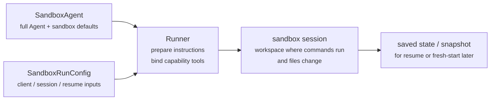
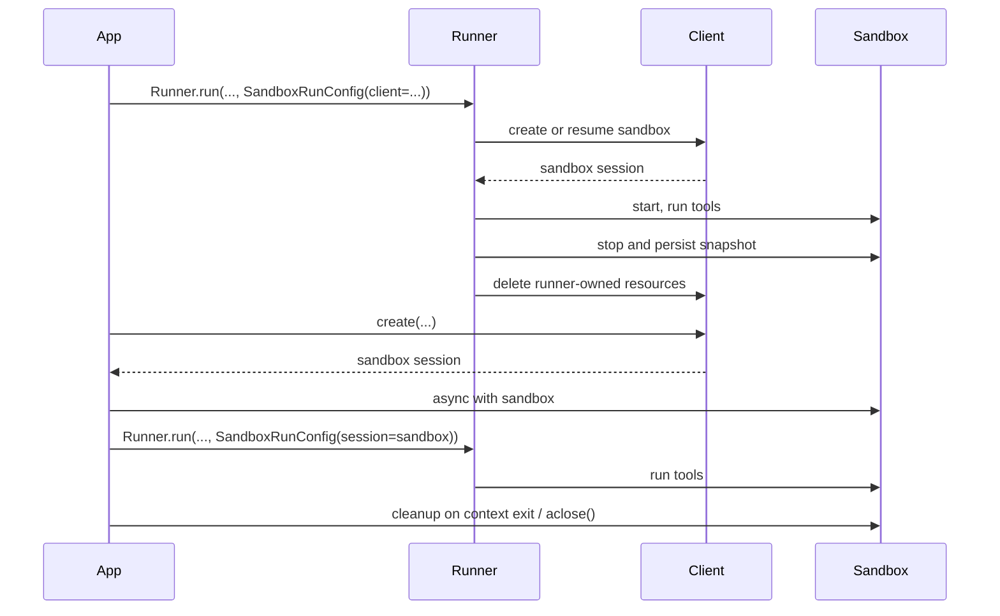

---
search:
  exclude: true
---
# 개념

!!! warning "베타 기능"

    Sandbox Agents는 베타입니다. 정식 출시 전까지 API의 세부 사항, 기본값, 지원 기능이 변경될 수 있으며, 시간이 지나면서 더 고급 기능이 추가될 수 있습니다.

현대적인 에이전트는 파일시스템의 실제 파일에서 작업할 수 있을 때 가장 잘 동작합니다. **Sandbox Agents**는 특화된 도구와 셸 명령을 활용해 대규모 문서 집합을 검색하고 조작하며, 파일을 편집하고, 아티팩트를 생성하고, 명령을 실행할 수 있습니다. 샌드박스는 모델에 지속적인 워크스페이스를 제공하며, 에이전트는 이를 사용해 사용자를 대신해 작업할 수 있습니다. Agents SDK의 Sandbox Agents는 샌드박스 환경과 연결된 에이전트를 쉽게 실행할 수 있게 해주며, 파일시스템에 올바른 파일을 배치하고 샌드박스를 오케스트레이션해 대규모로 작업을 쉽게 시작, 중지, 재개할 수 있도록 도와줍니다.

워크스페이스는 에이전트에 필요한 데이터를 중심으로 정의합니다. GitHub 리포지토리, 로컬 파일 및 디렉터리, 합성 작업 파일, S3 또는 Azure Blob Storage 같은 원격 파일시스템, 그리고 사용자가 제공하는 기타 샌드박스 입력에서 시작할 수 있습니다.

<div class="sandbox-harness-image" markdown="1">


</div>

`SandboxAgent`는 여전히 `Agent`입니다. `instructions`, `prompt`, `tools`, `handoffs`, `mcp_servers`, `model_settings`, `output_type`, 가드레일, 훅 같은 일반적인 에이전트 표면을 그대로 유지하며, 여전히 일반 `Runner` API를 통해 실행됩니다. 달라지는 것은 실행 경계입니다.

- `SandboxAgent`는 에이전트 자체를 정의합니다. 일반적인 에이전트 구성에 더해 `default_manifest`, `base_instructions`, `run_as` 같은 샌드박스 전용 기본값과 파일시스템 도구, 셸 접근, 스킬, 메모리, 컴팩션 같은 기능을 포함합니다
- `Manifest`는 파일, 리포지토리, 마운트, 환경을 포함해 새 샌드박스 워크스페이스의 원하는 시작 콘텐츠와 레이아웃을 선언합니다
- 샌드박스 세션은 명령이 실행되고 파일이 변경되는 실제 격리 환경입니다
- [`SandboxRunConfig`][agents.run_config.SandboxRunConfig]는 실행이 샌드박스 세션을 어떻게 얻는지 결정합니다. 예를 들어 직접 주입하거나, 직렬화된 샌드박스 세션 상태에서 재연결하거나, 샌드박스 클라이언트를 통해 새로운 샌드박스 세션을 생성할 수 있습니다
- 저장된 샌드박스 상태와 스냅샷을 사용하면 이후 실행에서 이전 작업에 재연결하거나 저장된 콘텐츠로 새로운 샌드박스 세션을 시드할 수 있습니다

`Manifest`는 새 세션 워크스페이스 계약이지, 모든 실제 샌드박스의 완전한 단일 진실 공급원은 아닙니다. 실행의 실효 워크스페이스는 대신 재사용된 샌드박스 세션, 직렬화된 샌드박스 세션 상태, 또는 실행 시점에 선택된 스냅샷에서 올 수 있습니다.

이 페이지 전반에서 "샌드박스 세션"은 샌드박스 클라이언트가 관리하는 실제 실행 환경을 의미합니다. 이는 [Sessions](../sessions/index.md)에서 설명하는 SDK의 대화형 [`Session`][agents.memory.session.Session] 인터페이스와는 다릅니다.

바깥 런타임은 여전히 승인, 트레이싱, 핸드오프, 재개 기록 관리를 담당합니다. 샌드박스 세션은 명령, 파일 변경, 환경 격리를 담당합니다. 이러한 분리는 모델의 핵심 부분입니다.

### 구성 요소의 결합 방식

샌드박스 실행은 에이전트 정의와 실행별 샌드박스 구성을 결합합니다. 러너는 에이전트를 준비하고, 이를 실제 샌드박스 세션에 바인딩하며, 이후 실행을 위해 상태를 저장할 수 있습니다.



샌드박스 전용 기본값은 `SandboxAgent`에 유지됩니다. 실행별 샌드박스 세션 선택은 `SandboxRunConfig`에 유지됩니다.

수명주기를 세 단계로 생각해 보세요.

1. `SandboxAgent`, `Manifest`, 기능을 사용해 에이전트와 새 워크스페이스 계약을 정의합니다
2. 샌드박스 세션을 주입, 재개 또는 생성하는 `SandboxRunConfig`를 `Runner`에 제공해 실행합니다
3. 러너가 관리하는 `RunState`, 명시적인 샌드박스 `session_state`, 또는 저장된 워크스페이스 스냅샷에서 나중에 이어갑니다

셸 접근이 가끔 필요한 도구 하나에 불과하다면 [도구 가이드](../tools.md)의 호스티드 셸부터 시작하세요. 워크스페이스 격리, 샌드박스 클라이언트 선택, 또는 샌드박스 세션 재개 동작이 설계의 일부라면 샌드박스 에이전트를 사용하세요.

## 사용 시점

샌드박스 에이전트는 워크스페이스 중심 워크플로에 적합합니다. 예를 들면 다음과 같습니다.

- 코딩 및 디버깅. 예를 들어 GitHub 리포지토리의 이슈 보고서에 대한 자동 수정 작업을 오케스트레이션하고 대상 테스트를 실행하는 경우
- 문서 처리 및 편집. 예를 들어 사용자의 금융 문서에서 정보를 추출하고 작성 완료된 세금 양식 초안을 만드는 경우
- 파일 기반 검토 또는 분석. 예를 들어 온보딩 패킷, 생성된 보고서, 또는 아티팩트 번들을 확인한 뒤 응답하는 경우
- 격리된 다중 에이전트 패턴. 예를 들어 각 리뷰어 또는 코딩 하위 에이전트에 자체 워크스페이스를 제공하는 경우
- 다단계 워크스페이스 작업. 예를 들어 한 실행에서 버그를 수정하고 나중에 회귀 테스트를 추가하거나, 스냅샷 또는 샌드박스 세션 상태에서 재개하는 경우

파일이나 실제 파일시스템에 대한 접근이 필요하지 않다면 계속 `Agent`를 사용하세요. 셸 접근이 가끔 필요한 기능일 뿐이라면 호스티드 셸을 추가하고, 워크스페이스 경계 자체가 기능의 일부라면 샌드박스 에이전트를 사용하세요.

## 샌드박스 클라이언트 선택

로컬 개발에는 `UnixLocalSandboxClient`로 시작하세요. 컨테이너 격리나 이미지 일치성이 필요하면 `DockerSandboxClient`로 이동하세요. 제공업체가 관리하는 실행이 필요하면 호스티드 제공업체로 이동하세요.

대부분의 경우 `SandboxAgent` 정의는 그대로 유지되고, 샌드박스 클라이언트와 해당 옵션만 [`SandboxRunConfig`][agents.run_config.SandboxRunConfig]에서 변경됩니다. 로컬, Docker, 호스티드, 원격 마운트 옵션은 [Sandbox clients](clients.md)를 참고하세요.

## 핵심 구성 요소

<div class="sandbox-nowrap-first-column-table" markdown="1">

| 계층 | 주요 SDK 구성 요소 | 답하는 질문 |
| --- | --- | --- |
| 에이전트 정의 | `SandboxAgent`, `Manifest`, capabilities | 어떤 에이전트가 실행되며, 어떤 새 세션 워크스페이스 계약에서 시작해야 하는가? |
| 샌드박스 실행 | `SandboxRunConfig`, 샌드박스 클라이언트, 실제 샌드박스 세션 | 이 실행은 실제 샌드박스 세션을 어떻게 얻으며, 작업은 어디에서 실행되는가? |
| 저장된 샌드박스 상태 | `RunState` 샌드박스 페이로드, `session_state`, 스냅샷 | 이 워크플로는 이전 샌드박스 작업에 어떻게 재연결하거나 저장된 콘텐츠로 새로운 샌드박스 세션을 어떻게 시드하는가? |

</div>

주요 SDK 구성 요소는 다음과 같이 해당 계층에 매핑됩니다.

<div class="sandbox-nowrap-first-column-table" markdown="1">

| 구성 요소 | 소유 대상 | 확인할 질문 |
| --- | --- | --- |
| [`SandboxAgent`][agents.sandbox.sandbox_agent.SandboxAgent] | 에이전트 정의 | 이 에이전트는 무엇을 해야 하며, 어떤 기본값을 함께 가져가야 하는가? |
| [`Manifest`][agents.sandbox.manifest.Manifest] | 새 세션 워크스페이스 파일 및 폴더 | 실행 시작 시 파일시스템에 어떤 파일과 폴더가 있어야 하는가? |
| [`Capability`][agents.sandbox.capabilities.capability.Capability] | 샌드박스 네이티브 동작 | 어떤 도구, 지시문 조각, 또는 런타임 동작을 이 에이전트에 부착해야 하는가? |
| [`SandboxRunConfig`][agents.run_config.SandboxRunConfig] | 실행별 샌드박스 클라이언트 및 샌드박스 세션 소스 | 이 실행은 샌드박스 세션을 주입, 재개, 생성해야 하는가? |
| [`RunState`][agents.run_state.RunState] | 러너가 관리하는 저장된 샌드박스 상태 | 이전에 러너가 관리하던 워크플로를 재개하면서 샌드박스 상태를 자동으로 이어받고 있는가? |
| [`SandboxRunConfig.session_state`][agents.run_config.SandboxRunConfig.session_state] | 명시적인 직렬화된 샌드박스 세션 상태 | 이미 `RunState` 외부에서 직렬화한 샌드박스 상태로 재개하고 싶은가? |
| [`SandboxRunConfig.snapshot`][agents.run_config.SandboxRunConfig.snapshot] | 새로운 샌드박스 세션을 위한 저장된 워크스페이스 콘텐츠 | 새 샌드박스 세션이 저장된 파일과 아티팩트에서 시작해야 하는가? |

</div>

실용적인 설계 순서는 다음과 같습니다.

1. `Manifest`로 새 세션 워크스페이스 계약을 정의합니다
2. `SandboxAgent`로 에이전트를 정의합니다
3. 내장 또는 커스텀 기능을 추가합니다
4. `RunConfig(sandbox=SandboxRunConfig(...))`에서 각 실행이 샌드박스 세션을 어떻게 얻을지 결정합니다

## 샌드박스 실행 준비 방식

실행 시 러너는 해당 정의를 구체적인 샌드박스 기반 실행으로 변환합니다.

1. `SandboxRunConfig`에서 샌드박스 세션을 확인합니다  
   `session=...`을 전달하면 해당 실제 샌드박스 세션을 재사용합니다  
   그렇지 않으면 `client=...`를 사용해 생성하거나 재개합니다
2. 실행의 실효 워크스페이스 입력을 결정합니다  
   실행이 샌드박스 세션을 주입하거나 재개하는 경우, 기존 샌드박스 상태가 우선합니다  
   그렇지 않으면 러너는 일회성 manifest 재정의 또는 `agent.default_manifest`에서 시작합니다  
   그래서 `Manifest`만으로는 모든 실행의 최종 실제 워크스페이스를 정의하지 않습니다
3. 기능이 결과 manifest를 처리하도록 합니다  
   이를 통해 기능은 최종 에이전트가 준비되기 전에 파일, 마운트, 또는 기타 워크스페이스 범위 동작을 추가할 수 있습니다
4. 고정된 순서로 최종 instructions를 구성합니다  
   SDK의 기본 샌드박스 프롬프트 또는 명시적으로 재정의한 `base_instructions`, 그 다음 `instructions`, 그 다음 기능 지시문 조각, 그 다음 원격 마운트 정책 텍스트, 마지막으로 렌더링된 파일시스템 트리 순입니다
5. 기능 도구를 실제 샌드박스 세션에 바인딩하고 준비된 에이전트를 일반 `Runner` API를 통해 실행합니다

샌드박싱은 턴의 의미를 바꾸지 않습니다. 턴은 여전히 단일 셸 명령이나 샌드박스 작업이 아니라 모델 단계입니다. 샌드박스 측 작업과 턴 사이에는 고정된 1:1 매핑이 없습니다. 일부 작업은 샌드박스 실행 계층 안에 머무를 수 있고, 다른 작업은 도구 결과, 승인, 또는 또 다른 모델 단계가 필요한 기타 상태를 반환할 수 있습니다. 실용적으로 말하면, 샌드박스 작업이 발생한 뒤 에이전트 런타임이 또 다른 모델 응답을 필요로 할 때만 추가 턴이 소비됩니다.

이러한 준비 단계 때문에 `default_manifest`, `instructions`, `base_instructions`, `capabilities`, `run_as`가 `SandboxAgent`를 설계할 때 생각해야 할 주요 샌드박스 전용 옵션입니다.

## `SandboxAgent` 옵션

다음은 일반적인 `Agent` 필드에 더해지는 샌드박스 전용 옵션입니다.

<div class="sandbox-nowrap-first-column-table" markdown="1">

| 옵션 | 적절한 사용처 |
| --- | --- |
| `default_manifest` | 러너가 생성하는 새로운 샌드박스 세션의 기본 워크스페이스 |
| `instructions` | SDK 샌드박스 프롬프트 뒤에 추가되는 역할, 워크플로, 성공 기준 |
| `base_instructions` | SDK 샌드박스 프롬프트를 대체하는 고급 탈출구 |
| `capabilities` | 이 에이전트와 함께 이동해야 하는 샌드박스 네이티브 도구 및 동작 |
| `run_as` | 셸 명령, 파일 읽기, 패치 같은 모델 대상 샌드박스 도구의 사용자 ID |

</div>

샌드박스 클라이언트 선택, 샌드박스 세션 재사용, manifest 재정의, 스냅샷 선택은 에이전트가 아니라 [`SandboxRunConfig`][agents.run_config.SandboxRunConfig]에 속합니다.

### `default_manifest`

`default_manifest`는 러너가 이 에이전트를 위해 새로운 샌드박스 세션을 만들 때 사용하는 기본 [`Manifest`][agents.sandbox.manifest.Manifest]입니다. 에이전트가 보통 시작할 파일, 리포지토리, 도우미 자료, 출력 디렉터리, 마운트에 사용하세요.

이것은 기본값일 뿐입니다. 실행은 `SandboxRunConfig(manifest=...)`로 이를 재정의할 수 있고, 재사용되거나 재개된 샌드박스 세션은 기존 워크스페이스 상태를 유지합니다.

### `instructions`와 `base_instructions`

다양한 프롬프트에서도 유지되어야 하는 짧은 규칙에는 `instructions`를 사용하세요. `SandboxAgent`에서 이 instructions는 SDK의 샌드박스 기본 프롬프트 뒤에 추가되므로, 내장 샌드박스 가이드를 유지하면서 자체 역할, 워크플로, 성공 기준을 추가할 수 있습니다.

SDK 샌드박스 기본 프롬프트를 대체하려는 경우에만 `base_instructions`를 사용하세요. 대부분의 에이전트는 이를 설정할 필요가 없습니다.

<div class="sandbox-nowrap-first-column-table" markdown="1">

| 다음에 넣기... | 용도 | 예시 |
| --- | --- | --- |
| `instructions` | 에이전트의 안정적인 역할, 워크플로 규칙, 성공 기준 | "온보딩 문서를 검토한 뒤 핸드오프하세요.", "최종 파일을 `output/`에 작성하세요." |
| `base_instructions` | SDK 샌드박스 기본 프롬프트의 완전한 대체 | 커스텀 저수준 샌드박스 래퍼 프롬프트 |
| 사용자 프롬프트 | 이번 실행을 위한 일회성 요청 | "이 워크스페이스를 요약하세요." |
| manifest의 워크스페이스 파일 | 더 긴 작업 명세, 리포지토리 로컬 instructions, 또는 범위가 제한된 참조 자료 | `repo/task.md`, 문서 번들, 샘플 패킷 |

</div>

`instructions`의 좋은 사용 예는 다음과 같습니다.

- [examples/sandbox/unix_local_pty.py](https://github.com/openai/openai-agents-python/blob/main/examples/sandbox/unix_local_pty.py)는 PTY 상태가 중요할 때 에이전트가 하나의 인터랙티브 프로세스 안에 머물도록 합니다
- [examples/sandbox/handoffs.py](https://github.com/openai/openai-agents-python/blob/main/examples/sandbox/handoffs.py)는 샌드박스 리뷰어가 검토 후 사용자에게 직접 응답하지 못하도록 금지합니다
- [examples/sandbox/tax_prep.py](https://github.com/openai/openai-agents-python/blob/main/examples/sandbox/tax_prep.py)는 최종 작성된 파일이 실제로 `output/`에 저장되도록 요구합니다
- [examples/sandbox/docs/coding_task.py](https://github.com/openai/openai-agents-python/blob/main/examples/sandbox/docs/coding_task.py)는 정확한 검증 명령을 고정하고 워크스페이스 루트 기준의 패치 경로를 명확히 합니다

사용자의 일회성 작업을 `instructions`에 복사하거나, manifest에 들어가야 할 긴 참조 자료를 포함하거나, 내장 기능이 이미 주입하는 도구 문서를 반복하거나, 모델이 실행 시점에 필요로 하지 않는 로컬 설치 메모를 섞어 넣는 것은 피하세요.

`instructions`를 생략해도 SDK는 기본 샌드박스 프롬프트를 포함합니다. 저수준 래퍼에는 이것만으로 충분하지만, 대부분의 사용자 대상 에이전트는 여전히 명시적인 `instructions`를 제공하는 것이 좋습니다.

### `capabilities`

Capabilities는 샌드박스 네이티브 동작을 `SandboxAgent`에 부착합니다. 실행 시작 전 워크스페이스를 구성하고, 샌드박스 전용 instructions를 추가하며, 실제 샌드박스 세션에 바인딩되는 도구를 노출하고, 해당 에이전트의 모델 동작이나 입력 처리를 조정할 수 있습니다.

내장 기능에는 다음이 포함됩니다.

<div class="sandbox-nowrap-first-column-table" markdown="1">

| Capability | 추가할 시점 | 참고 |
| --- | --- | --- |
| `Shell` | 에이전트에 셸 접근이 필요할 때 | `exec_command`를 추가하며, 샌드박스 클라이언트가 PTY 상호작용을 지원하면 `write_stdin`도 추가합니다 |
| `Filesystem` | 에이전트가 파일을 편집하거나 로컬 이미지를 확인해야 할 때 | `apply_patch`와 `view_image`를 추가합니다. 패치 경로는 워크스페이스 루트 기준 상대 경로입니다 |
| `Skills` | 샌드박스에서 스킬 검색과 구체화가 필요할 때 | `.agents` 또는 `.agents/skills`를 수동으로 마운트하는 대신 이것을 권장합니다. `Skills`가 스킬을 인덱싱하고 샌드박스에 구체화해 줍니다 |
| `Memory` | 후속 실행이 메모리 아티팩트를 읽거나 생성해야 할 때 | `Shell`이 필요하며, 실시간 업데이트에는 `Filesystem`도 필요합니다 |
| `Compaction` | 장시간 실행 흐름에서 컴팩션 항목 이후 컨텍스트 축소가 필요할 때 | 모델 샘플링과 입력 처리를 조정합니다 |

</div>

기본적으로 `SandboxAgent.capabilities`는 `Filesystem()`, `Shell()`, `Compaction()`을 포함하는 `Capabilities.default()`를 사용합니다. `capabilities=[...]`를 전달하면 그 목록이 기본값을 대체하므로, 여전히 원하는 기본 기능이 있다면 함께 포함해야 합니다.

스킬의 경우, 구체화 방식을 기준으로 소스를 선택하세요.

- `Skills(lazy_from=LocalDirLazySkillSource(...))`는 더 큰 로컬 스킬 디렉터리에 적합한 기본 선택입니다. 모델이 먼저 인덱스를 탐색하고 필요한 것만 로드할 수 있기 때문입니다
- `LocalDirLazySkillSource(source=LocalDir(src=...))`는 SDK 프로세스가 실행 중인 파일시스템에서 읽습니다. 샌드박스 이미지나 워크스페이스 내부에만 존재하는 경로가 아니라 원래 호스트 측 스킬 디렉터리를 전달하세요
- `Skills(from_=LocalDir(src=...))`는 미리 단계적으로 올려두고 싶은 작은 로컬 번들에 더 적합합니다
- `Skills(from_=GitRepo(repo=..., ref=...))`는 스킬 자체가 리포지토리에서 와야 할 때 적합합니다

`LocalDir.src`는 SDK 호스트의 소스 경로입니다. `skills_path`는 `load_skill`이 호출될 때 스킬이 배치되는 샌드박스 워크스페이스 내부의 상대 대상 경로입니다.

스킬이 이미 `.agents/skills/<name>/SKILL.md` 같은 형태로 디스크에 있다면, `LocalDir(...)`는 해당 소스 루트를 가리키게 하고, 노출에는 여전히 `Skills(...)`를 사용하세요. 기존 워크스페이스 계약이 다른 샌드박스 내부 레이아웃에 의존하지 않는 한 기본 `skills_path=".agents"`를 유지하세요.

적합하다면 내장 기능을 우선 사용하세요. 내장 기능으로 다루지 못하는 샌드박스 전용 도구나 지시문 표면이 필요할 때만 커스텀 capability를 작성하세요.

## 개념

### Manifest

[`Manifest`][agents.sandbox.manifest.Manifest]는 새로운 샌드박스 세션의 워크스페이스를 설명합니다. 워크스페이스 `root`를 설정하고, 파일과 디렉터리를 선언하고, 로컬 파일을 복사하고, Git 리포지토리를 클론하고, 원격 스토리지 마운트를 연결하고, 환경 변수를 설정하고, 사용자나 그룹을 정의하고, 워크스페이스 외부의 특정 절대 경로에 대한 접근을 부여할 수 있습니다.

Manifest 항목 경로는 워크스페이스 상대 경로입니다. 절대 경로일 수 없고 `..`로 워크스페이스를 벗어날 수도 없으므로, 워크스페이스 계약은 로컬, Docker, 호스티드 클라이언트 전반에서 이식 가능하게 유지됩니다.

작업 시작 전에 에이전트가 필요로 하는 자료에는 manifest 항목을 사용하세요.

<div class="sandbox-nowrap-first-column-table" markdown="1">

| Manifest 항목 | 용도 |
| --- | --- |
| `File`, `Dir` | 작은 합성 입력, 도우미 파일, 또는 출력 디렉터리 |
| `LocalFile`, `LocalDir` | 샌드박스에 구체화되어야 하는 호스트 파일 또는 디렉터리 |
| `GitRepo` | 워크스페이스로 가져와야 하는 리포지토리 |
| `S3Mount`, `GCSMount`, `R2Mount`, `AzureBlobMount`, `BoxMount`, `S3FilesMount` 같은 mounts | 샌드박스 내부에 나타나야 하는 외부 스토리지 |

</div>

Mount 항목은 노출할 스토리지를 설명하고, mount 전략은 샌드박스 백엔드가 해당 스토리지를 어떻게 연결할지 설명합니다. 마운트 옵션과 제공업체 지원은 [Sandbox clients](clients.md#mounts-and-remote-storage)를 참고하세요.

좋은 manifest 설계는 보통 워크스페이스 계약을 좁게 유지하고, 긴 작업 절차는 `repo/task.md` 같은 워크스페이스 파일에 넣고, instructions에서는 `repo/task.md`나 `output/report.md`처럼 상대 워크스페이스 경로를 사용하는 것을 의미합니다. 에이전트가 `Filesystem` capability의 `apply_patch` 도구로 파일을 편집한다면, 패치 경로는 셸 `workdir`이 아니라 샌드박스 워크스페이스 루트 기준 상대 경로임을 기억하세요.

에이전트가 워크스페이스 외부의 구체적인 절대 경로가 필요할 때만 `extra_path_grants`를 사용하세요. 예를 들어 임시 도구 출력을 위한 `/tmp`나 읽기 전용 런타임을 위한 `/opt/toolchain` 등이 있습니다. 권한 부여는 백엔드가 파일시스템 정책을 강제할 수 있는 SDK 파일 API와 셸 실행 모두에 적용됩니다.

```python
from agents.sandbox import Manifest, SandboxPathGrant

manifest = Manifest(
    extra_path_grants=(
        SandboxPathGrant(path="/tmp"),
        SandboxPathGrant(path="/opt/toolchain", read_only=True),
    ),
)
```

스냅샷과 `persist_workspace()`는 여전히 워크스페이스 루트만 포함합니다. 추가로 부여된 경로는 런타임 접근이지, 지속되는 워크스페이스 상태가 아닙니다.

### 권한

`Permissions`는 manifest 항목의 파일시스템 권한을 제어합니다. 이는 샌드박스가 구체화하는 파일에 대한 것이며, 모델 권한, 승인 정책, API 자격 증명에 대한 것이 아닙니다.

기본적으로 manifest 항목은 소유자 읽기/쓰기/실행 가능, 그룹과 기타 사용자 읽기/실행 가능입니다. 단계적으로 올린 파일을 비공개, 읽기 전용, 또는 실행 가능으로 해야 할 때 이를 재정의하세요.

```python
from agents.sandbox import FileMode, Permissions
from agents.sandbox.entries import File

private_notes = File(
    text="internal notes",
    permissions=Permissions(
        owner=FileMode.READ | FileMode.WRITE,
        group=FileMode.NONE,
        other=FileMode.NONE,
    ),
)
```

`Permissions`는 소유자, 그룹, 기타에 대한 개별 비트와 해당 항목이 디렉터리인지 여부를 저장합니다. 직접 구성할 수도 있고, `Permissions.from_str(...)`로 모드 문자열에서 파싱하거나, `Permissions.from_mode(...)`로 OS 모드에서 파생할 수도 있습니다.

사용자는 작업을 실행할 수 있는 샌드박스 ID입니다. 해당 ID가 샌드박스에 존재하도록 하려면 manifest에 `User`를 추가하고, 셸 명령, 파일 읽기, 패치 같은 모델 대상 샌드박스 도구를 해당 사용자로 실행하려면 `SandboxAgent.run_as`를 설정하세요. `run_as`가 manifest에 아직 없는 사용자를 가리키면 러너가 이를 실효 manifest에 자동으로 추가합니다.

```python
from agents import Runner
from agents.run import RunConfig
from agents.sandbox import FileMode, Manifest, Permissions, SandboxAgent, SandboxRunConfig, User
from agents.sandbox.entries import Dir, LocalDir
from agents.sandbox.sandboxes.unix_local import UnixLocalSandboxClient

analyst = User(name="analyst")

agent = SandboxAgent(
    name="Dataroom analyst",
    instructions="Review the files in `dataroom/` and write findings to `output/`.",
    default_manifest=Manifest(
        # Declare the sandbox user so manifest entries can grant access to it.
        users=[analyst],
        entries={
            "dataroom": LocalDir(
                src="./dataroom",
                # Let the analyst traverse and read the mounted dataroom, but not edit it.
                group=analyst,
                permissions=Permissions(
                    owner=FileMode.READ | FileMode.EXEC,
                    group=FileMode.READ | FileMode.EXEC,
                    other=FileMode.NONE,
                ),
            ),
            "output": Dir(
                # Give the analyst a writable scratch/output directory for artifacts.
                group=analyst,
                permissions=Permissions(
                    owner=FileMode.ALL,
                    group=FileMode.ALL,
                    other=FileMode.NONE,
                ),
            ),
        },
    ),
    # Run model-facing sandbox actions as this user, so those permissions apply.
    run_as=analyst,
)

result = await Runner.run(
    agent,
    "Summarize the contracts and call out renewal dates.",
    run_config=RunConfig(
        sandbox=SandboxRunConfig(client=UnixLocalSandboxClient()),
    ),
)
```

파일 수준 공유 규칙도 필요하다면, 사용자와 manifest 그룹 및 항목 `group` 메타데이터를 함께 사용하세요. `run_as` 사용자는 누가 샌드박스 네이티브 작업을 실행하는지 제어하고, `Permissions`는 샌드박스가 워크스페이스를 구체화한 뒤 해당 사용자가 어떤 파일을 읽고, 쓰고, 실행할 수 있는지 제어합니다.

### SnapshotSpec

`SnapshotSpec`은 새로운 샌드박스 세션에 저장된 워크스페이스 콘텐츠를 어디서 복원하고 어디로 다시 저장할지 알려줍니다. 이는 샌드박스 워크스페이스의 스냅샷 정책이며, `session_state`는 특정 샌드박스 백엔드를 재개하기 위한 직렬화된 연결 상태입니다.

로컬의 지속 스냅샷에는 `LocalSnapshotSpec`을 사용하고, 앱이 원격 스냅샷 클라이언트를 제공하는 경우에는 `RemoteSnapshotSpec`을 사용하세요. 로컬 스냅샷 설정을 사용할 수 없으면 no-op 스냅샷이 대체로 사용되며, 고급 사용자는 워크스페이스 스냅샷 지속성이 필요 없을 때 이를 명시적으로 사용할 수 있습니다.

```python
from pathlib import Path

from agents.run import RunConfig
from agents.sandbox import LocalSnapshotSpec, SandboxRunConfig
from agents.sandbox.sandboxes.unix_local import UnixLocalSandboxClient

run_config = RunConfig(
    sandbox=SandboxRunConfig(
        client=UnixLocalSandboxClient(),
        snapshot=LocalSnapshotSpec(base_path=Path("/tmp/my-sandbox-snapshots")),
    )
)
```

러너가 새로운 샌드박스 세션을 만들면 샌드박스 클라이언트는 해당 세션을 위한 스냅샷 인스턴스를 생성합니다. 시작 시 스냅샷이 복원 가능하면, 샌드박스는 실행이 계속되기 전에 저장된 워크스페이스 콘텐츠를 복원합니다. 정리 시 러너가 소유한 샌드박스 세션은 워크스페이스를 아카이브하고 스냅샷을 통해 다시 저장합니다.

`snapshot`을 생략하면 런타임은 가능할 경우 기본 로컬 스냅샷 위치를 사용하려고 시도합니다. 이를 설정할 수 없으면 no-op 스냅샷으로 대체됩니다. 마운트된 경로와 임시 경로는 지속 워크스페이스 콘텐츠로 스냅샷에 복사되지 않습니다.

### 샌드박스 수명주기

수명주기 모드는 두 가지입니다. **SDK 소유**와 **개발자 소유**입니다.

<div class="sandbox-lifecycle-diagram" markdown="1">



</div>

샌드박스가 한 번의 실행 동안만 살아 있으면 SDK 소유 수명주기를 사용하세요. `client`, 선택적 `manifest`, 선택적 `snapshot`, 클라이언트 `options`를 전달하면 러너가 샌드박스를 생성 또는 재개하고, 시작하고, 에이전트를 실행하고, 스냅샷 기반 워크스페이스 상태를 저장하고, 샌드박스를 종료하고, 클라이언트가 러너 소유 리소스를 정리하도록 합니다.

```python
result = await Runner.run(
    agent,
    "Inspect the workspace and summarize what changed.",
    run_config=RunConfig(
        sandbox=SandboxRunConfig(client=UnixLocalSandboxClient()),
    ),
)
```

샌드박스를 미리 생성하거나, 여러 실행에 걸쳐 하나의 실제 샌드박스를 재사용하거나, 실행 후 파일을 검사하거나, 직접 생성한 샌드박스에 대해 스트리밍하거나, 정리 시점을 정확히 제어하려면 개발자 소유 수명주기를 사용하세요. `session=...`을 전달하면 러너가 해당 실제 샌드박스를 사용하지만, 이를 대신 닫지는 않습니다.

```python
sandbox = await client.create(manifest=agent.default_manifest)

async with sandbox:
    run_config = RunConfig(sandbox=SandboxRunConfig(session=sandbox))
    await Runner.run(agent, "Analyze the files.", run_config=run_config)
    await Runner.run(agent, "Write the final report.", run_config=run_config)
```

컨텍스트 매니저가 일반적인 형태입니다. 진입 시 샌드박스를 시작하고 종료 시 세션 정리 수명주기를 실행합니다. 앱에서 컨텍스트 매니저를 사용할 수 없다면 수명주기 메서드를 직접 호출하세요.

```python
sandbox = await client.create(
    manifest=agent.default_manifest,
    snapshot=LocalSnapshotSpec(base_path=Path("/tmp/my-sandbox-snapshots")),
)
try:
    await sandbox.start()
    await Runner.run(
        agent,
        "Analyze the files.",
        run_config=RunConfig(sandbox=SandboxRunConfig(session=sandbox)),
    )
    # Persist a checkpoint of the live workspace before doing more work.
    # `aclose()` also calls `stop()`, so this is only needed for an explicit mid-lifecycle save.
    await sandbox.stop()
finally:
    await sandbox.aclose()
```

`stop()`은 스냅샷 기반 워크스페이스 콘텐츠만 저장하며, 샌드박스를 해제하지는 않습니다. `aclose()`는 전체 세션 정리 경로입니다. pre-stop 훅을 실행하고, `stop()`을 호출하고, 샌드박스 리소스를 종료하고, 세션 범위 의존성을 닫습니다.

## `SandboxRunConfig` 옵션

[`SandboxRunConfig`][agents.run_config.SandboxRunConfig]는 샌드박스 세션이 어디서 오는지, 새 세션이 어떻게 초기화되어야 하는지를 결정하는 실행별 옵션을 담습니다.

### 샌드박스 소스

다음 옵션은 러너가 샌드박스 세션을 재사용, 재개, 생성할지 결정합니다.

<div class="sandbox-nowrap-first-column-table" markdown="1">

| 옵션 | 사용 시점 | 참고 |
| --- | --- | --- |
| `client` | 러너가 샌드박스 세션을 생성, 재개, 정리해 주기를 원할 때 | 실제 샌드박스 `session`을 제공하지 않는 한 필수입니다 |
| `session` | 이미 실제 샌드박스 세션을 직접 만든 경우 | 수명주기는 호출자 소유이며, 러너는 해당 실제 샌드박스 세션을 재사용합니다 |
| `session_state` | 직렬화된 샌드박스 세션 상태는 있지만 실제 샌드박스 세션 객체는 없을 때 | `client`가 필요하며, 러너는 해당 명시적 상태에서 소유 세션으로 재개합니다 |

</div>

실제로 러너는 다음 순서로 샌드박스 세션을 확인합니다.

1. `run_config.sandbox.session`을 주입하면 해당 실제 샌드박스 세션을 직접 재사용합니다
2. 그렇지 않고 실행이 `RunState`에서 재개되는 경우 저장된 샌드박스 세션 상태를 재개합니다
3. 그렇지 않고 `run_config.sandbox.session_state`를 전달하면 러너는 해당 명시적 직렬화 샌드박스 세션 상태에서 재개합니다
4. 그렇지 않으면 러너가 새로운 샌드박스 세션을 생성합니다. 이 새 세션에는 제공된 경우 `run_config.sandbox.manifest`를, 그렇지 않으면 `agent.default_manifest`를 사용합니다

### 새 세션 입력

다음 옵션은 러너가 새로운 샌드박스 세션을 생성할 때만 중요합니다.

<div class="sandbox-nowrap-first-column-table" markdown="1">

| 옵션 | 사용 시점 | 참고 |
| --- | --- | --- |
| `manifest` | 일회성 새 세션 워크스페이스 재정의가 필요할 때 | 생략 시 `agent.default_manifest`로 대체됩니다 |
| `snapshot` | 새 샌드박스 세션이 스냅샷에서 시드되어야 할 때 | 재개 유사 흐름이나 원격 스냅샷 클라이언트에 유용합니다 |
| `options` | 샌드박스 클라이언트에 생성 시점 옵션이 필요할 때 | Docker 이미지, Modal 앱 이름, E2B 템플릿, 타임아웃 등 클라이언트별 설정에 흔히 사용됩니다 |

</div>

### 구체화 제어

`concurrency_limits`는 얼마나 많은 샌드박스 구체화 작업을 병렬로 실행할 수 있는지 제어합니다. 큰 manifest나 로컬 디렉터리 복사에 더 엄격한 리소스 제어가 필요할 때 `SandboxConcurrencyLimits(manifest_entries=..., local_dir_files=...)`를 사용하세요. 특정 제한을 비활성화하려면 해당 값을 `None`으로 설정하세요.

기억해 둘 만한 몇 가지 의미는 다음과 같습니다.

- 새로운 세션: `manifest=`와 `snapshot=`은 러너가 새로운 샌드박스 세션을 만들 때만 적용됩니다
- 재개 vs 스냅샷: `session_state=`는 이전에 직렬화된 샌드박스 상태에 재연결하고, `snapshot=`은 저장된 워크스페이스 콘텐츠에서 새로운 샌드박스 세션을 시드합니다
- 클라이언트별 옵션: `options=`는 샌드박스 클라이언트에 따라 다르며, Docker와 많은 호스티드 클라이언트는 이를 요구합니다
- 주입된 실제 세션: 실행 중인 샌드박스 `session`을 전달하면 capability 기반 manifest 업데이트는 호환 가능한 비마운트 항목을 추가할 수 있습니다. 하지만 `manifest.root`, `manifest.environment`, `manifest.users`, `manifest.groups`를 변경하거나, 기존 항목을 제거하거나, 항목 유형을 교체하거나, 마운트 항목을 추가 또는 변경할 수는 없습니다
- 러너 API: `SandboxAgent` 실행은 여전히 일반 `Runner.run()`, `Runner.run_sync()`, `Runner.run_streamed()` API를 사용합니다

## 전체 예시: 코딩 작업

이 코딩 스타일 예시는 시작점으로 적합한 기본 예시입니다.

```python
import asyncio
from pathlib import Path

from agents import ModelSettings, Runner
from agents.run import RunConfig
from agents.sandbox import Manifest, SandboxAgent, SandboxRunConfig
from agents.sandbox.capabilities import (
    Capabilities,
    LocalDirLazySkillSource,
    Skills,
)
from agents.sandbox.entries import LocalDir
from agents.sandbox.sandboxes.unix_local import UnixLocalSandboxClient

EXAMPLE_DIR = Path(__file__).resolve().parent
HOST_REPO_DIR = EXAMPLE_DIR / "repo"
HOST_SKILLS_DIR = EXAMPLE_DIR / "skills"
TARGET_TEST_CMD = "sh tests/test_credit_note.sh"


def build_agent(model: str) -> SandboxAgent[None]:
    return SandboxAgent(
        name="Sandbox engineer",
        model=model,
        instructions=(
            "Inspect the repo, make the smallest correct change, run the most relevant checks, "
            "and summarize the file changes and risks. "
            "Read `repo/task.md` before editing files. Stay grounded in the repository, preserve "
            "existing behavior, and mention the exact verification command you ran. "
            "Use the `$credit-note-fixer` skill before editing files. If the repo lives under "
            "`repo/`, remember that `apply_patch` paths stay relative to the sandbox workspace "
            "root, so edits still target `repo/...`."
        ),
        # Put repos and task files in the manifest.
        default_manifest=Manifest(
            entries={
                "repo": LocalDir(src=HOST_REPO_DIR),
            }
        ),
        capabilities=Capabilities.default() + [
            Skills(
                lazy_from=LocalDirLazySkillSource(
                    # This is a host path read by the SDK process.
                    # Requested skills are copied into `skills_path` in the sandbox.
                    source=LocalDir(src=HOST_SKILLS_DIR),
                )
            ),
        ],
        model_settings=ModelSettings(tool_choice="required"),
    )


async def main(model: str, prompt: str) -> None:
    result = await Runner.run(
        build_agent(model),
        prompt,
        run_config=RunConfig(
            sandbox=SandboxRunConfig(client=UnixLocalSandboxClient()),
            workflow_name="Sandbox coding example",
        ),
    )
    print(result.final_output)


if __name__ == "__main__":
    asyncio.run(
        main(
            model="gpt-5.4",
            prompt=(
                "Open `repo/task.md`, use the `$credit-note-fixer` skill, fix the bug, "
                f"run `{TARGET_TEST_CMD}`, and summarize the change."
            ),
        )
    )
```

[examples/sandbox/docs/coding_task.py](https://github.com/openai/openai-agents-python/blob/main/examples/sandbox/docs/coding_task.py)를 참고하세요. 예시를 Unix 로컬 실행 전반에서 결정론적으로 검증할 수 있도록 작은 셸 기반 리포지토리를 사용합니다. 물론 실제 작업 리포지토리는 Python, JavaScript, 또는 다른 어떤 것이어도 괜찮습니다.

## 일반 패턴

위의 전체 예시에서 시작하세요. 많은 경우 동일한 `SandboxAgent`는 그대로 유지하고, 샌드박스 클라이언트, 샌드박스 세션 소스, 또는 워크스페이스 소스만 변경하면 됩니다.

### 샌드박스 클라이언트 전환

에이전트 정의는 그대로 두고 실행 구성만 변경하세요. 컨테이너 격리나 이미지 일치성이 필요하면 Docker를 사용하고, 제공업체 관리 실행이 필요하면 호스티드 제공업체를 사용하세요. 예시와 제공업체 옵션은 [Sandbox clients](clients.md)를 참고하세요.

### 워크스페이스 재정의

에이전트 정의는 그대로 두고 새로운 세션 manifest만 교체하세요.

```python
from agents.run import RunConfig
from agents.sandbox import Manifest, SandboxRunConfig
from agents.sandbox.entries import GitRepo
from agents.sandbox.sandboxes.unix_local import UnixLocalSandboxClient

run_config = RunConfig(
    sandbox=SandboxRunConfig(
        client=UnixLocalSandboxClient(),
        manifest=Manifest(
            entries={
                "repo": GitRepo(repo="openai/openai-agents-python", ref="main"),
            }
        ),
    ),
)
```

동일한 에이전트 역할을 다른 리포지토리, 패킷, 또는 작업 번들에 대해 실행하되 에이전트를 다시 만들고 싶지 않을 때 사용하세요. 위의 검증된 코딩 예시는 일회성 재정의 대신 `default_manifest`로 같은 패턴을 보여줍니다.

### 샌드박스 세션 주입

명시적인 수명주기 제어, 실행 후 검사, 또는 출력 복사가 필요할 때 실제 샌드박스 세션을 주입하세요.

```python
from agents import Runner
from agents.run import RunConfig
from agents.sandbox import SandboxRunConfig
from agents.sandbox.sandboxes.unix_local import UnixLocalSandboxClient

client = UnixLocalSandboxClient()
sandbox = await client.create(manifest=agent.default_manifest)

async with sandbox:
    result = await Runner.run(
        agent,
        prompt,
        run_config=RunConfig(
            sandbox=SandboxRunConfig(session=sandbox),
        ),
    )
```

실행 후 워크스페이스를 검사하거나 이미 시작된 샌드박스 세션에 대해 스트리밍하고 싶을 때 사용하세요. [examples/sandbox/docs/coding_task.py](https://github.com/openai/openai-agents-python/blob/main/examples/sandbox/docs/coding_task.py)와 [examples/sandbox/docker/docker_runner.py](https://github.com/openai/openai-agents-python/blob/main/examples/sandbox/docker/docker_runner.py)를 참고하세요.

### 세션 상태에서 재개

이미 `RunState` 외부에서 샌드박스 상태를 직렬화했다면, 러너가 해당 상태에서 재연결하도록 하세요.

```python
from agents.run import RunConfig
from agents.sandbox import SandboxRunConfig

serialized = load_saved_payload()
restored_state = client.deserialize_session_state(serialized)

run_config = RunConfig(
    sandbox=SandboxRunConfig(
        client=client,
        session_state=restored_state,
    ),
)
```

샌드박스 상태가 자체 스토리지나 작업 시스템에 있고, `Runner`가 그 상태에서 직접 재개하기를 원할 때 사용하세요. serialize/deserialize 흐름은 [examples/sandbox/extensions/blaxel_runner.py](https://github.com/openai/openai-agents-python/blob/main/examples/sandbox/extensions/blaxel_runner.py)를 참고하세요.

### 스냅샷에서 시작

저장된 파일과 아티팩트에서 새로운 샌드박스를 시드하세요.

```python
from pathlib import Path

from agents.run import RunConfig
from agents.sandbox import LocalSnapshotSpec, SandboxRunConfig
from agents.sandbox.sandboxes.unix_local import UnixLocalSandboxClient

run_config = RunConfig(
    sandbox=SandboxRunConfig(
        client=UnixLocalSandboxClient(),
        snapshot=LocalSnapshotSpec(base_path=Path("/tmp/my-sandbox-snapshot")),
    ),
)
```

새 실행이 `agent.default_manifest`만이 아니라 저장된 워크스페이스 콘텐츠에서 시작해야 할 때 사용하세요. 로컬 스냅샷 흐름은 [examples/sandbox/memory.py](https://github.com/openai/openai-agents-python/blob/main/examples/sandbox/memory.py), 원격 스냅샷 클라이언트는 [examples/sandbox/sandbox_agent_with_remote_snapshot.py](https://github.com/openai/openai-agents-python/blob/main/examples/sandbox/sandbox_agent_with_remote_snapshot.py)를 참고하세요.

### Git에서 스킬 로드

로컬 스킬 소스를 리포지토리 기반 소스로 교체하세요.

```python
from agents.sandbox.capabilities import Capabilities, Skills
from agents.sandbox.entries import GitRepo

capabilities = Capabilities.default() + [
    Skills(from_=GitRepo(repo="sdcoffey/tax-prep-skills", ref="main")),
]
```

스킬 번들이 자체 릴리스 주기를 가지거나 샌드박스 간 공유되어야 할 때 사용하세요. [examples/sandbox/tax_prep.py](https://github.com/openai/openai-agents-python/blob/main/examples/sandbox/tax_prep.py)를 참고하세요.

### 도구로 노출

도구 에이전트는 자체 샌드박스 경계를 가질 수도 있고, 부모 실행의 실제 샌드박스를 재사용할 수도 있습니다. 재사용은 빠른 읽기 전용 탐색 에이전트에 유용합니다. 다른 샌드박스를 생성, 구체화, 스냅샷하는 비용 없이 부모가 사용하는 정확한 워크스페이스를 검사할 수 있기 때문입니다.

```python
from agents import Runner
from agents.run import RunConfig
from agents.sandbox import FileMode, Manifest, Permissions, SandboxAgent, SandboxRunConfig, User
from agents.sandbox.entries import Dir, File
from agents.sandbox.sandboxes.unix_local import UnixLocalSandboxClient

coordinator = User(name="coordinator")
explorer = User(name="explorer")

manifest = Manifest(
    users=[coordinator, explorer],
    entries={
        "pricing_packet": Dir(
            group=coordinator,
            permissions=Permissions(
                owner=FileMode.ALL,
                group=FileMode.ALL,
                other=FileMode.READ | FileMode.EXEC,
                directory=True,
            ),
            children={
                "pricing.md": File(
                    content=b"Pricing packet contents...",
                    group=coordinator,
                    permissions=Permissions(
                        owner=FileMode.ALL,
                        group=FileMode.ALL,
                        other=FileMode.READ,
                    ),
                ),
            },
        ),
        "work": Dir(
            group=coordinator,
            permissions=Permissions(
                owner=FileMode.ALL,
                group=FileMode.ALL,
                other=FileMode.NONE,
                directory=True,
            ),
        ),
    },
)

pricing_explorer = SandboxAgent(
    name="Pricing Explorer",
    instructions="Read `pricing_packet/` and summarize commercial risk. Do not edit files.",
    run_as=explorer,
)

client = UnixLocalSandboxClient()
sandbox = await client.create(manifest=manifest)

async with sandbox:
    shared_run_config = RunConfig(
        sandbox=SandboxRunConfig(session=sandbox),
    )

    orchestrator = SandboxAgent(
        name="Revenue Operations Coordinator",
        instructions="Coordinate the review and write final notes to `work/`.",
        run_as=coordinator,
        tools=[
            pricing_explorer.as_tool(
                tool_name="review_pricing_packet",
                tool_description="Inspect the pricing packet and summarize commercial risk.",
                run_config=shared_run_config,
                max_turns=2,
            ),
        ],
    )

    result = await Runner.run(
        orchestrator,
        "Review the pricing packet, then write final notes to `work/summary.md`.",
        run_config=shared_run_config,
    )
```

여기서 부모 에이전트는 `coordinator`로 실행되고, 탐색기 도구 에이전트는 동일한 실제 샌드박스 세션 내부에서 `explorer`로 실행됩니다. `pricing_packet/` 항목은 `other` 사용자에게 읽기 가능하므로 탐색기는 이를 빠르게 검사할 수 있지만 쓰기 비트는 없습니다. `work/` 디렉터리는 coordinator의 사용자/그룹에만 제공되므로 부모는 최종 아티팩트를 쓸 수 있고 탐색기는 읽기 전용으로 유지됩니다.

도구 에이전트에 실제 격리가 필요하다면 대신 자체 샌드박스 `RunConfig`를 제공하세요.

```python
from docker import from_env as docker_from_env

from agents.run import RunConfig
from agents.sandbox import SandboxRunConfig
from agents.sandbox.sandboxes.docker import DockerSandboxClient, DockerSandboxClientOptions

rollout_agent.as_tool(
    tool_name="review_rollout_risk",
    tool_description="Inspect the rollout packet and summarize implementation risk.",
    run_config=RunConfig(
        sandbox=SandboxRunConfig(
            client=DockerSandboxClient(docker_from_env()),
            options=DockerSandboxClientOptions(image="python:3.14-slim"),
        ),
    ),
)
```

도구 에이전트가 자유롭게 변경해야 하거나, 신뢰할 수 없는 명령을 실행해야 하거나, 다른 백엔드/이미지를 사용해야 할 때는 별도의 샌드박스를 사용하세요. [examples/sandbox/sandbox_agents_as_tools.py](https://github.com/openai/openai-agents-python/blob/main/examples/sandbox/sandbox_agents_as_tools.py)를 참고하세요.

### 로컬 도구 및 MCP와 결합

동일한 에이전트에서 일반 도구를 계속 사용하면서 샌드박스 워크스페이스를 유지하세요.

```python
from agents.sandbox import SandboxAgent
from agents.sandbox.capabilities import Shell

agent = SandboxAgent(
    name="Workspace reviewer",
    instructions="Inspect the workspace and call host tools when needed.",
    tools=[get_discount_approval_path],
    mcp_servers=[server],
    capabilities=[Shell()],
)
```

워크스페이스 검사가 에이전트 작업의 일부에 불과할 때 사용하세요. [examples/sandbox/sandbox_agent_with_tools.py](https://github.com/openai/openai-agents-python/blob/main/examples/sandbox/sandbox_agent_with_tools.py)를 참고하세요.

## 메모리

향후 샌드박스 에이전트 실행이 이전 실행에서 학습해야 한다면 `Memory` capability를 사용하세요. 메모리는 SDK의 대화형 `Session` 메모리와는 별개입니다. 샌드박스 워크스페이스 내부의 파일로 교훈을 추출하고, 이후 실행에서 해당 파일을 읽을 수 있습니다.

설정, 읽기/생성 동작, 다중 턴 대화, 레이아웃 격리는 [Agent memory](memory.md)를 참고하세요.

## 구성 패턴

단일 에이전트 패턴이 명확해지면, 다음 설계 질문은 더 큰 시스템에서 샌드박스 경계를 어디에 둘지입니다.

샌드박스 에이전트는 여전히 SDK의 나머지 부분과 조합할 수 있습니다.

- [Handoffs](../handoffs.md): 샌드박스가 아닌 접수 에이전트에서 문서 중심 작업을 샌드박스 리뷰어로 넘깁니다
- [Agents as tools](../tools.md#agents-as-tools): 여러 샌드박스 에이전트를 도구로 노출합니다. 보통 각 `Agent.as_tool(...)` 호출에 `run_config=RunConfig(sandbox=SandboxRunConfig(...))`를 전달해 각 도구가 자체 샌드박스 경계를 갖도록 합니다
- [MCP](../mcp.md) 및 일반 함수 도구: 샌드박스 capability는 `mcp_servers` 및 일반 Python 도구와 공존할 수 있습니다
- [Running agents](../running_agents.md): 샌드박스 실행도 여전히 일반 `Runner` API를 사용합니다

특히 흔한 패턴은 두 가지입니다.

- 샌드박스가 아닌 에이전트가 워크스페이스 격리가 필요한 워크플로의 일부에 대해서만 샌드박스 에이전트로 핸드오프하는 패턴
- 오케스트레이터가 여러 샌드박스 에이전트를 도구로 노출하는 패턴. 보통 각 `Agent.as_tool(...)` 호출에 별도의 샌드박스 `RunConfig`를 두어 각 도구가 자체 격리 워크스페이스를 갖게 합니다

### 턴과 샌드박스 실행

핸드오프와 agent-as-tool 호출은 별도로 설명하는 것이 도움이 됩니다.

핸드오프에서는 여전히 하나의 최상위 실행과 하나의 최상위 턴 루프가 있습니다. 활성 에이전트는 바뀌지만 실행이 중첩되지는 않습니다. 샌드박스가 아닌 접수 에이전트가 샌드박스 리뷰어로 핸드오프하면, 같은 실행 안의 다음 모델 호출은 샌드박스 에이전트용으로 준비되고, 그 샌드박스 에이전트가 다음 턴을 맡게 됩니다. 즉, 핸드오프는 같은 실행의 다음 턴을 어떤 에이전트가 담당할지만 바꿉니다. [examples/sandbox/handoffs.py](https://github.com/openai/openai-agents-python/blob/main/examples/sandbox/handoffs.py)를 참고하세요.

`Agent.as_tool(...)`에서는 관계가 다릅니다. 외부 오케스트레이터는 하나의 외부 턴을 사용해 도구 호출을 결정하고, 그 도구 호출은 샌드박스 에이전트에 대한 중첩 실행을 시작합니다. 중첩 실행은 자체 턴 루프, `max_turns`, 승인, 그리고 보통 자체 샌드박스 `RunConfig`를 가집니다. 한 번의 중첩 턴으로 끝날 수도 있고 여러 턴이 걸릴 수도 있습니다. 외부 오케스트레이터 관점에서는 이 모든 작업이 여전히 하나의 도구 호출 뒤에 있으므로, 중첩 턴은 외부 실행의 턴 카운터를 증가시키지 않습니다. [examples/sandbox/sandbox_agents_as_tools.py](https://github.com/openai/openai-agents-python/blob/main/examples/sandbox/sandbox_agents_as_tools.py)를 참고하세요.

승인 동작도 같은 방식으로 나뉩니다.

- 핸드오프에서는 샌드박스 에이전트가 같은 실행의 활성 에이전트가 되므로 승인이 동일한 최상위 실행에 유지됩니다
- `Agent.as_tool(...)`에서는 샌드박스 도구 에이전트 내부에서 발생한 승인도 여전히 외부 실행에 표시되지만, 저장된 중첩 실행 상태에서 오며 외부 실행이 재개될 때 중첩 샌드박스 실행을 재개합니다

## 추가 자료

- [Quickstart](quickstart.md): 샌드박스 에이전트 하나를 실행해 보기
- [Sandbox clients](clients.md): 로컬, Docker, 호스티드, 마운트 옵션 선택
- [Agent memory](memory.md): 이전 샌드박스 실행의 교훈을 보존하고 재사용하기
- [examples/sandbox/](https://github.com/openai/openai-agents-python/tree/main/examples/sandbox): 실행 가능한 로컬, 코딩, 메모리, 핸드오프, 에이전트 조합 패턴