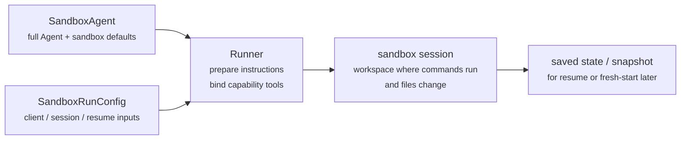
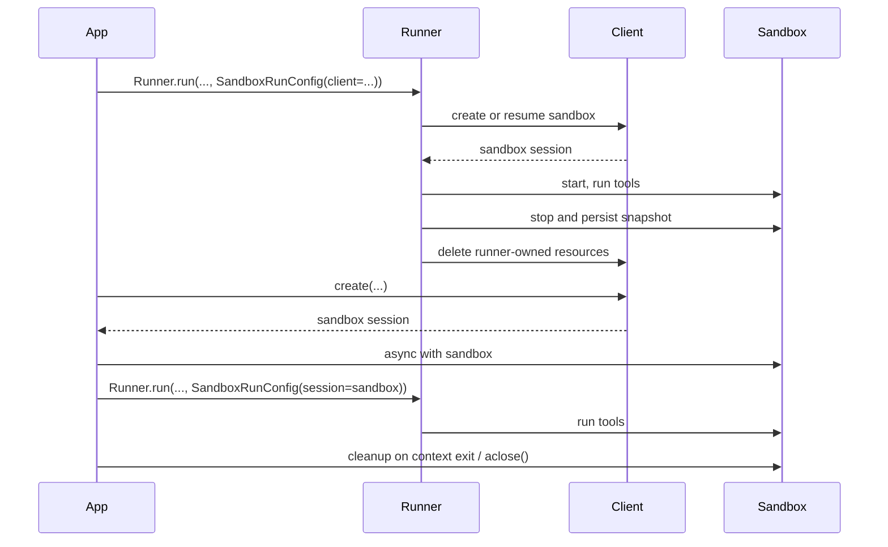

---
search:
  exclude: true
---
# 개념

!!! warning "베타 기능"

    샌드박스 에이전트는 베타 버전입니다. 정식 출시 전까지 API 세부 사항, 기본값, 지원 기능이 변경될 수 있으며, 시간이 지남에 따라 더 고급 기능이 추가될 수 있습니다.

현대적인 에이전트는 파일 시스템의 실제 파일을 다룰 수 있을 때 가장 효과적으로 작동합니다. **샌드박스 에이전트**는 특화된 도구와 셸 명령을 사용하여 대규모 문서 집합을 검색하고 조작하며, 파일을 편집하고, 결과물을 생성하고, 명령을 실행할 수 있습니다. 샌드박스는 에이전트가 사용자를 대신해 작업할 수 있는 영구 작업 공간을 모델에 제공합니다. Agents SDK의 샌드박스 에이전트를 사용하면 샌드박스 환경과 결합된 에이전트를 쉽게 실행할 수 있으며, 필요한 파일을 파일 시스템에 배치하고 샌드박스를 오케스트레이션하여 대규모 작업을 쉽게 시작, 중지, 재개할 수 있습니다.

에이전트에 필요한 데이터를 중심으로 작업 공간을 정의합니다. GitHub 저장소, 로컬 파일과 디렉터리, 합성 작업 파일, S3 또는 Azure Blob Storage 같은 원격 파일 시스템 및 사용자가 제공하는 기타 샌드박스 입력에서 시작할 수 있습니다.

<div class="sandbox-harness-image" markdown="1">


</div>

`SandboxAgent`은 여전히 `Agent`입니다. `instructions`, `prompt`, `tools`, `handoffs`, `mcp_servers`, `model_settings`, `output_type`, 가드레일, 훅과 같은 일반적인 에이전트 인터페이스를 유지하며, 일반적인 `Runner` API를 통해 계속 실행됩니다. 달라지는 것은 실행 경계입니다.

- `SandboxAgent`은 에이전트 자체를 정의합니다. 일반적인 에이전트 구성에 더해 `default_manifest`, `base_instructions`, `run_as` 같은 샌드박스별 기본값과 파일 시스템 도구, 셸 액세스, 스킬, 메모리 또는 압축 같은 기능을 포함합니다.
- `Manifest`는 파일, 저장소, 마운트 및 환경을 포함하여 새 샌드박스 작업 공간에 필요한 초기 콘텐츠와 레이아웃을 선언합니다.
- 샌드박스 세션은 명령이 실행되고 파일이 변경되는 실제 실행 환경입니다. 세션이 제공하는 격리 수준은 백엔드와 구성에 따라 달라집니다.
- [`SandboxRunConfig`][agents.run_config.SandboxRunConfig]는 해당 실행이 샌드박스 세션을 얻는 방식을 결정합니다. 예를 들어 세션을 직접 주입하거나, 직렬화된 샌드박스 세션 상태에서 다시 연결하거나, 샌드박스 클라이언트를 통해 새 샌드박스 세션을 생성할 수 있습니다.
- 저장된 샌드박스 상태와 스냅샷을 사용하면 이후 실행에서 이전 작업에 다시 연결하거나 저장된 콘텐츠로 새 샌드박스 세션을 초기화할 수 있습니다.

`Manifest`은 새 세션의 작업 공간 계약이며, 실행 중인 모든 샌드박스에 대한 완전한 단일 정보 소스는 아닙니다. 실행의 실제 작업 공간은 재사용된 샌드박스 세션, 직렬화된 샌드박스 세션 상태 또는 실행 시 선택한 스냅샷에서 가져올 수도 있습니다.

이 페이지에서 "샌드박스 세션"은 샌드박스 클라이언트가 관리하는 실제 실행 환경을 의미합니다. 이는 [세션](../sessions/index.md)에서 설명하는 SDK의 대화형 [`Session`][agents.memory.session.Session] 인터페이스와 다릅니다.

외부 런타임은 계속해서 승인, 트레이싱, 핸드오프와 실행 재개에 필요한 상태 추적을 담당합니다. 샌드박스 세션은 백엔드를 통해 명령과 파일 변경을 관리합니다. 어떤 격리 제어가 적용되는지는 백엔드에 따라 결정되며, 세션 자체가 OS 수준의 격리를 보장하지는 않습니다.

### 구성 요소 간 관계 {#how-the-pieces-fit-together}

샌드박스 실행은 에이전트 정의와 실행별 샌드박스 구성을 결합합니다. 러너는 에이전트를 준비하고 실제 샌드박스 세션에 바인딩하며, 이후 실행을 위해 상태를 저장할 수 있습니다.


```mermaid
flowchart LR
    agent["SandboxAgent<br/><small>full Agent + sandbox defaults</small>"]
    config["SandboxRunConfig<br/><small>client / session / resume inputs</small>"]
    runner["Runner<br/><small>prepare instructions<br/>bind capability tools</small>"]
    sandbox["sandbox session<br/><small>workspace where commands run<br/>and files change</small>"]
    saved["saved state / snapshot<br/><small>for resume or fresh-start later</small>"]

    agent --> runner
    config --> runner
    runner --> sandbox
    sandbox --> saved
```

샌드박스별 기본값은 `SandboxAgent`에 유지합니다. 실행별 샌드박스 세션 선택 사항은 `SandboxRunConfig`에 유지합니다.

수명 주기는 세 단계로 구분할 수 있습니다.

1. `SandboxAgent`, `Manifest` 및 기능을 사용하여 에이전트와 새 작업 공간 계약을 정의합니다.
2. 샌드박스 세션을 주입하거나, 재개하거나, 생성하는 `SandboxRunConfig`을 `Runner`에 제공하여 실행합니다.
3. 러너가 관리하는 `RunState`, 명시적인 샌드박스 `session_state` 또는 저장된 작업 공간 스냅샷에서 나중에 작업을 이어갑니다.

셸 액세스가 가끔 사용하는 도구 중 하나일 뿐이라면 [도구 가이드](../tools.md)의 호스티드 셸부터 시작하세요. 작업 공간 격리, 샌드박스 클라이언트 선택 또는 샌드박스 세션 재개 동작이 설계의 일부라면 샌드박스 에이전트를 사용하세요.

## 사용 시점 {#when-to-use-them}

샌드박스 에이전트는 다음과 같은 작업 공간 중심 워크플로에 적합합니다.

- 코딩 및 디버깅. 예를 들어 GitHub 저장소의 이슈 보고서에 대한 자동 수정 작업을 오케스트레이션하고 대상 테스트 실행
- 문서 처리 및 편집. 예를 들어 사용자의 재무 문서에서 정보를 추출하여 작성된 세금 양식 초안 생성
- 파일 기반 검토 또는 분석. 예를 들어 답변 전에 온보딩 패킷, 생성된 보고서 또는 결과물 번들 확인
- 별도의 작업 공간을 사용하는 멀티 에이전트 패턴. 예를 들어 각 검토자 또는 코딩 하위 에이전트에 자체 작업 공간 제공
- 여러 단계로 구성된 작업 공간 작업. 예를 들어 한 실행에서 버그를 수정하고 나중에 회귀 테스트를 추가하거나, 스냅샷 또는 샌드박스 세션 상태에서 재개

파일이나 상태를 유지하며 변경할 수 있는 파일 시스템에 액세스할 필요가 없다면 `Agent`을 계속 사용하세요. 셸 액세스가 가끔 필요한 기능일 뿐이라면 호스티드 셸을 추가하고, 작업 공간 경계 자체가 기능의 일부라면 샌드박스 에이전트를 사용하세요.

## 샌드박스 클라이언트 선택 {#choose-a-sandbox-client}

macOS 또는 Linux의 신뢰할 수 있는 로컬 개발 환경이나 외부에서 격리된 환경에서는 `UnixLocalSandboxClient`을 사용하세요. Linux에서 이 백엔드는 OS 수준의 격리를 추가하지 않고 명령을 호스트 프로세스로 실행합니다. macOS에서는 `sandbox-exec`을 통해 파일 시스템 제한을 적용하지만 네트워크 격리는 제공하지 않습니다.

기본적으로 새로운 Unix 로컬 세션에는 각각 별도의 임시 작업 공간이 제공됩니다. 동일한 사용자 지정 `Manifest.root`으로 세션을 구성하면 해당 세션들은 작업 공간을 공유합니다. 별도의 세션이 OS 수준의 격리를 보장하지는 않습니다.

신뢰할 수 없는 입력의 영향을 받는 명령을 포함하여 신뢰할 수 없는 명령에는 적절하게 구성된 `DockerSandboxClient` 또는 호스티드 제공자를 선택하거나 외부 격리를 제공하세요. Windows에서는 Docker 또는 호스티드 제공자를 사용하세요. 로컬 백엔드를 선택하기 전에 [Unix 로컬 실행 제한](clients.md#decision-guide)을 참고하세요.

대부분의 경우 `SandboxAgent` 정의는 동일하게 유지하고 [`SandboxRunConfig`][agents.run_config.SandboxRunConfig]에서 샌드박스 클라이언트와 해당 옵션만 변경합니다. 로컬, Docker, 호스티드 및 원격 마운트 옵션은 [샌드박스 클라이언트](clients.md)를 참고하세요.

## 핵심 구성 요소 {#core-pieces}

<div class="sandbox-nowrap-first-column-table" markdown="1">

| 계층 | 주요 SDK 구성 요소 | 답하는 질문 |
| --- | --- | --- |
| 에이전트 정의 | `SandboxAgent`, `Manifest`, 기능 | 어떤 에이전트가 실행되며, 어떤 새 세션 작업 공간 계약에서 시작해야 합니까? |
| 샌드박스 실행 | `SandboxRunConfig`, 샌드박스 클라이언트 및 실제 샌드박스 세션 | 이 실행은 어떻게 실제 샌드박스 세션을 얻으며, 작업은 어디에서 실행됩니까? |
| 저장된 샌드박스 상태 | `RunState` 샌드박스 페이로드, `session_state` 및 스냅샷 | 이 워크플로는 어떻게 이전 샌드박스 작업에 다시 연결하거나 저장된 콘텐츠로 새 샌드박스 세션을 초기화합니까? |

</div>

주요 SDK 구성 요소는 다음과 같이 각 계층에 대응합니다.

<div class="sandbox-nowrap-first-column-table" markdown="1">

| 구성 요소 | 담당 영역 | 확인할 질문 |
| --- | --- | --- |
| [`SandboxAgent`][agents.sandbox.sandbox_agent.SandboxAgent] | 에이전트 정의 | 이 에이전트는 무엇을 해야 하며, 어떤 기본값을 함께 유지해야 합니까? |
| [`Manifest`][agents.sandbox.manifest.Manifest] | 새 세션 작업 공간의 파일과 폴더 | 실행이 시작될 때 파일 시스템에 어떤 파일과 폴더가 있어야 합니까? |
| [`Capability`][agents.sandbox.capabilities.capability.Capability] | 샌드박스 네이티브 동작 | 이 에이전트에 어떤 도구, instructions 조각 또는 런타임 동작을 연결해야 합니까? |
| [`SandboxRunConfig`][agents.run_config.SandboxRunConfig] | 실행별 샌드박스 클라이언트와 샌드박스 세션 소스 | 이 실행에서 샌드박스 세션을 주입, 재개 또는 생성해야 합니까? |
| [`RunState`][agents.run_state.RunState] | 러너가 관리하는 저장된 샌드박스 상태 | 이전에 러너가 관리하던 워크플로를 재개하고 해당 샌드박스 상태를 자동으로 이어가고 있습니까? |
| [`SandboxRunConfig.session_state`][agents.run_config.SandboxRunConfig.session_state] | 명시적으로 직렬화된 샌드박스 세션 상태 | `RunState` 외부에서 이미 직렬화한 샌드박스 상태를 재개하려고 합니까? |
| [`SandboxRunConfig.snapshot`][agents.run_config.SandboxRunConfig.snapshot] | 새 샌드박스 세션용으로 저장된 작업 공간 콘텐츠 | 새 샌드박스 세션을 저장된 파일과 결과물에서 시작해야 합니까? |

</div>

실용적인 설계 순서는 다음과 같습니다.

1. `Manifest`으로 새 세션 작업 공간 계약을 정의합니다.
2. `SandboxAgent`으로 에이전트를 정의합니다.
3. 기본 제공 또는 사용자 지정 기능을 추가합니다.
4. `RunConfig(sandbox=SandboxRunConfig(...))`에서 각 실행이 샌드박스 세션을 얻는 방식을 결정합니다.

## 샌드박스 실행 준비 방식 {#how-a-sandbox-run-is-prepared}

실행 시 러너는 해당 정의를 구체적인 샌드박스 기반 실행으로 변환합니다.

1. `SandboxRunConfig`에서 샌드박스 세션을 결정합니다. `session=...`을 전달하면 해당 실제 샌드박스 세션을 재사용합니다. 그렇지 않으면 `client=...`을 사용하여 세션을 생성하거나 재개합니다.
2. 실행에 적용할 작업 공간 입력을 결정합니다. 실행에서 샌드박스 세션을 주입하거나 재개하면 기존 샌드박스 상태가 우선합니다. 그렇지 않으면 러너는 일회성 매니페스트 재정의 또는 `agent.default_manifest`에서 시작합니다. 따라서 `Manifest`만으로는 모든 실행의 최종 실제 작업 공간을 정의할 수 없습니다.
3. 기능이 결과 매니페스트를 처리하도록 합니다. 이를 통해 최종 에이전트를 준비하기 전에 기능이 파일, 마운트 또는 기타 작업 공간 범위의 동작을 추가할 수 있습니다.
4. 고정된 순서로 최종 instructions를 구성합니다. SDK의 기본 샌드박스 프롬프트 또는 명시적으로 재정의한 경우 `base_instructions`, 그다음 `instructions`, 기능 instructions 조각, 원격 마운트 정책 텍스트, 렌더링된 파일 시스템 트리 순서입니다.
5. 기능의 도구를 실제 샌드박스 세션에 바인딩하고 일반적인 `Runner` API를 통해 준비된 에이전트를 실행합니다.

샌드박스 사용 여부는 턴의 의미를 바꾸지 않습니다. 턴은 여전히 하나의 모델 단계이며, 단일 셸 명령이나 샌드박스 작업을 의미하지 않습니다. 샌드박스 측 작업과 턴 사이에는 고정된 1:1 대응 관계가 없습니다. 일부 작업은 샌드박스 실행 계층 내부에서 완료될 수 있지만, 도구 결과, 승인 또는 다른 종류의 상태처럼 또 다른 모델 단계가 필요한 정보를 반환하는 작업도 있습니다. 실용적인 기준으로는 샌드박스 작업이 수행된 후 에이전트 런타임에 또 다른 모델 응답이 필요할 때만 추가 턴이 소모됩니다.

이러한 준비 단계 때문에 `default_manifest`, `instructions`, `base_instructions`, `capabilities`, `run_as`은 `SandboxAgent`을 설계할 때 고려해야 할 주요 샌드박스별 옵션입니다.

## `SandboxAgent` 옵션 {#sandboxagent-options}

일반적인 `Agent` 필드에 더해 사용할 수 있는 샌드박스별 옵션은 다음과 같습니다.

<div class="sandbox-nowrap-first-column-table" markdown="1">

| 옵션 | 권장 용도 |
| --- | --- |
| `default_manifest` | 러너가 생성하는 새 샌드박스 세션의 기본 작업 공간 |
| `instructions` | SDK 샌드박스 프롬프트 뒤에 추가되는 역할, 워크플로 및 성공 기준 |
| `base_instructions` | SDK 샌드박스 프롬프트를 대체하는 고급 이스케이프 해치 |
| `capabilities` | 이 에이전트와 함께 유지할 샌드박스 네이티브 도구와 동작 |
| `run_as` | 셸 명령, 파일 읽기, 패치처럼 모델에 노출되는 샌드박스 도구의 사용자 ID |

</div>

샌드박스 클라이언트 선택, 샌드박스 세션 재사용, 매니페스트 재정의 및 스냅샷 선택은 에이전트가 아니라 [`SandboxRunConfig`][agents.run_config.SandboxRunConfig]에 설정합니다.

### `default_manifest` {#default_manifest}

`default_manifest`는 러너가 이 에이전트용 새 샌드박스 세션을 생성할 때 사용하는 기본 [`Manifest`][agents.sandbox.manifest.Manifest]입니다. 에이전트가 일반적으로 시작할 때 필요한 파일, 저장소, 보조 자료, 출력 디렉터리 및 마운트에 사용하세요.

이는 기본값일 뿐입니다. 실행에서 `SandboxRunConfig(manifest=...)`으로 재정의할 수 있으며, 재사용하거나 재개한 샌드박스 세션은 기존 작업 공간 상태를 유지합니다.

### `instructions` 및 `base_instructions` {#instructions-and-base_instructions}

다양한 프롬프트에서도 유지해야 하는 짧은 규칙에는 `instructions`을 사용하세요. `SandboxAgent`에서 이러한 instructions는 SDK의 샌드박스 기본 프롬프트 뒤에 추가되므로, 기본 제공 샌드박스 지침을 유지하면서 고유한 역할, 워크플로 및 성공 기준을 추가할 수 있습니다.

SDK 샌드박스 기본 프롬프트를 대체하려는 경우에만 `base_instructions`을 사용하세요. 대부분의 에이전트에서는 설정하지 않는 것이 좋습니다.

<div class="sandbox-nowrap-first-column-table" markdown="1">

| 배치 위치 | 용도 | 예시 |
| --- | --- | --- |
| `instructions` | 에이전트의 안정적인 역할, 워크플로 규칙 및 성공 기준 | "온보딩 문서를 검사한 후 핸드오프하세요.", "최종 파일을 `output/`에 작성하세요." |
| `base_instructions` | SDK 샌드박스 기본 프롬프트의 전체 대체 | 사용자 지정 저수준 샌드박스 래퍼 프롬프트 |
| 사용자 프롬프트 | 이 실행을 위한 일회성 요청 | "이 작업 공간을 요약하세요." |
| 매니페스트의 작업 공간 파일 | 긴 작업 사양, 저장소 로컬 instructions 또는 범위가 제한된 참고 자료 | `repo/task.md`, 문서 번들, 샘플 패킷 |

</div>

`instructions`의 적절한 사용 예시는 다음과 같습니다.

- [examples/sandbox/unix_local_pty.py](https://github.com/openai/openai-agents-python/blob/main/examples/sandbox/unix_local_pty.py)는 PTY 상태가 중요할 때 에이전트를 하나의 대화형 프로세스에 유지합니다.
- [examples/sandbox/handoffs.py](https://github.com/openai/openai-agents-python/blob/main/examples/sandbox/handoffs.py)는 샌드박스 검토자가 검사 후 사용자에게 직접 답변하지 못하도록 합니다.
- [examples/sandbox/tax_prep.py](https://github.com/openai/openai-agents-python/blob/main/examples/sandbox/tax_prep.py)는 최종 작성 파일이 실제로 `output/`에 저장되도록 요구합니다.
- [examples/sandbox/docs/coding_task.py](https://github.com/openai/openai-agents-python/blob/main/examples/sandbox/docs/coding_task.py)는 정확한 검증 명령을 고정하고, `SandboxRunConfig.cwd`이 설정되지 않은 경우 패치 경로가 작업 공간 루트를 기준으로 한다는 점을 명확히 합니다.

사용자의 일회성 작업을 `instructions`에 복사하거나, 매니페스트에 포함해야 할 긴 참고 자료를 삽입하거나, 기본 제공 기능에서 이미 주입하는 도구 문서를 반복하거나, 모델이 실행 시 필요로 하지 않는 로컬 설치 참고 사항을 포함하지 마세요.

`instructions`을 생략해도 SDK에는 기본 샌드박스 프롬프트가 포함됩니다. 저수준 래퍼에는 이것만으로 충분하지만, 대부분의 사용자 대상 에이전트에는 명시적인 `instructions`도 제공해야 합니다.

### `capabilities` {#capabilities}

기능은 `SandboxAgent`에 샌드박스 네이티브 동작을 연결합니다. 실행이 시작되기 전에 작업 공간을 구성하고, 샌드박스별 instructions를 추가하고, 실제 샌드박스 세션에 바인딩되는 도구를 노출하며, 해당 에이전트의 모델 동작이나 입력 처리를 조정할 수 있습니다.

기본 제공 기능은 다음과 같습니다.

<div class="sandbox-nowrap-first-column-table" markdown="1">

| 기능 | 추가 시점 | 참고 사항 |
| --- | --- | --- |
| `Shell` | 에이전트에 셸 액세스가 필요한 경우 | `exec_command`을 추가하며, 샌드박스 클라이언트가 PTY 상호작용을 지원하면 `write_stdin`도 추가합니다. |
| `Filesystem` | 에이전트가 파일을 편집하거나 로컬 이미지를 검사해야 하는 경우 | `apply_patch`과 `view_image`을 추가합니다. 상대 경로는 기본적으로 작업 공간 루트를 사용하며, 구성된 경우 `SandboxRunConfig.cwd`을 사용합니다. |
| `Skills` | 샌드박스에서 스킬 검색 및 구체화를 사용하려는 경우 | `.agents` 또는 `.agents/skills`을 수동으로 마운트하는 것보다 이 기능을 권장합니다. `Skills`이 스킬을 인덱싱하고 샌드박스에 구체화합니다. |
| `Memory` | 후속 실행에서 메모리 결과물을 읽거나 생성해야 하는 경우 | `Shell`이 필요하며, 실행 중 메모리 결과물을 업데이트하려면 `Filesystem`도 필요합니다. |
| `Compaction` | 장기 실행 흐름에서 압축 항목 이후 컨텍스트를 잘라내야 하는 경우 | 모델 샘플링과 입력 처리를 조정합니다. |

</div>

기본적으로 `SandboxAgent.capabilities`은 `Filesystem()`, `Shell()`, `Compaction()`을 포함하는 `Capabilities.default()`을 사용합니다. `capabilities=[...]`을 전달하면 해당 목록이 기본값을 대체하므로, 계속 사용하려는 기본 기능을 모두 포함하세요.

`view_image` 도구는 파일 이름 확장자가 아니라 파일 콘텐츠를 기준으로 PNG, JPEG, GIF, WebP, BMP 및 TIFF 래스터 이미지를 식별합니다. 래스터 이미지 확장자를 가진 파일이라도 콘텐츠가 지원되지 않으면 거부되며, 지원되는 래스터 콘텐츠는 파일 이름에 이미지 확장자가 없어도 불러올 수 있습니다. `.svg` 및 `.svgz` 파일의 경우 파일 콘텐츠에서 SVG 마크업을 인식하는 것에 더해 파일 이름 기반 호환성도 유지합니다.

스킬은 구체화하려는 방식에 따라 소스를 선택하세요.

- `Skills(lazy_from=LocalDirLazySkillSource(...))`은 규모가 큰 로컬 스킬 디렉터리에 적합한 기본 선택입니다. 모델이 먼저 인덱스를 검색하고 필요한 항목만 불러올 수 있습니다.
- `LocalDirLazySkillSource(source=LocalDir(src=...))`은 SDK 프로세스가 실행 중인 파일 시스템에서 읽습니다. 샌드박스 이미지나 작업 공간 내부에만 존재하는 경로가 아니라 원래 호스트 측 스킬 디렉터리를 전달하세요.
- `Skills(from_=LocalDir(src=...))`은 미리 스테이징하려는 소규모 로컬 번들에 더 적합합니다.
- 스킬 자체를 저장소에서 가져와야 하는 경우 `Skills(from_=GitRepo(repo=..., ref=...))`이 적합합니다.

`LocalDir.src`은 SDK 호스트의 소스 경로입니다. `skills_path`은 `load_skill`이 호출될 때 스킬이 스테이징되는 샌드박스 작업 공간 내부의 상대 대상 경로입니다.

스킬이 이미 `.agents/skills/<name>/SKILL.md` 같은 디스크 경로에 있다면 `LocalDir(...)`이 해당 소스 루트를 가리키도록 하고, 이를 노출할 때는 계속 `Skills(...)`을 사용하세요. 다른 샌드박스 내부 레이아웃에 의존하는 기존 작업 공간 계약이 없다면 기본 `skills_path=".agents"`을 유지하세요.

적합한 경우 기본 제공 기능을 우선 사용하세요. 기본 제공 기능으로 다룰 수 없는 샌드박스별 도구 또는 instructions 인터페이스가 필요한 경우에만 사용자 지정 기능을 작성하세요.

## 개념 {#concepts_1}

### 매니페스트 {#manifest}

[`Manifest`][agents.sandbox.manifest.Manifest]는 새 샌드박스 세션의 작업 공간을 설명합니다. 작업 공간 `root`을 설정하고, 파일과 디렉터리를 선언하고, 로컬 파일을 복사하고, Git 저장소를 복제하고, 원격 저장소 마운트를 연결하고, 환경 변수를 설정하고, 사용자나 그룹을 정의하며, 작업 공간 외부의 특정 절대 경로에 대한 액세스 권한을 부여할 수 있습니다.

매니페스트 항목 경로는 작업 공간 기준 상대 경로입니다. 절대 경로를 사용할 수 없으며 `..`을 사용하여 작업 공간을 벗어날 수도 없습니다. 따라서 작업 공간 계약을 로컬, Docker 및 호스티드 클라이언트 간에 이식할 수 있습니다.

작업을 시작하기 전에 에이전트에 필요한 자료에는 매니페스트 항목을 사용하세요.

<div class="sandbox-nowrap-first-column-table" markdown="1">

| 매니페스트 항목 | 용도 |
| --- | --- |
| `File`, `Dir` | 소규모 합성 입력, 보조 파일 또는 출력 디렉터리 |
| `LocalFile`, `LocalDir` | 샌드박스에 구체화해야 하는 호스트 파일 또는 디렉터리 |
| `GitRepo` | 작업 공간으로 가져와야 하는 저장소 |
| `S3Mount`, `GCSMount`, `R2Mount`, `AzureBlobMount`, `BoxMount`, `S3FilesMount` 같은 마운트 | 샌드박스 내부에 표시해야 하는 외부 저장소 |

</div>

`Dir`은 합성 하위 항목으로 구성하거나 출력 위치로 사용할 디렉터리를 샌드박스 작업 공간 내부에 생성하며, 호스트 파일 시스템에서는 읽지 않습니다. 기존 호스트 디렉터리를 샌드박스 작업 공간으로 복사해야 하는 경우 `LocalDir`을 사용하세요.

기본적으로 `LocalFile.src`과 `LocalDir.src`은 SDK 프로세스의 작업 디렉터리를 기준으로 확인됩니다. `extra_path_grants`에 포함되지 않은 소스는 해당 기본 디렉터리 아래에 있어야 합니다. 이를 통해 로컬 소스 구체화를 샌드박스 매니페스트의 나머지 부분과 동일한 호스트 경로 신뢰 경계 내에 유지합니다.

마운트 항목은 노출할 저장소를 설명하고, 마운트 전략은 샌드박스 백엔드가 해당 저장소를 연결하는 방식을 설명합니다. 마운트 옵션과 제공자 지원은 [샌드박스 클라이언트](clients.md#mounts-and-remote-storage)를 참고하세요.

적절한 매니페스트 설계에서는 일반적으로 작업 공간 계약의 범위를 좁게 유지하고, 긴 작업 절차를 `repo/task.md` 같은 작업 공간 파일에 배치하며, instructions에서 `repo/task.md` 또는 `output/report.md` 같은 작업 공간 상대 경로를 사용합니다. 에이전트가 `Filesystem` 기능의 `apply_patch` 도구로 파일을 편집하는 경우, 패치 경로는 기본적으로 샌드박스 작업 공간 루트를 사용하고 구성된 경우 `SandboxRunConfig.cwd`을 사용한다는 점에 유의하세요. 셸 `workdir`을 사용하지 않습니다.

에이전트에 작업 공간 외부의 구체적인 절대 경로가 필요하거나 매니페스트가 SDK 프로세스 작업 디렉터리 외부의 신뢰할 수 있는 로컬 소스를 복사해야 하는 경우에만 `extra_path_grants`을 사용하세요. 예를 들어 임시 도구 출력용 `/tmp`, 읽기 전용 런타임용 `/opt/toolchain`, 샌드박스에 구체화해야 하는 생성된 스킬 디렉터리 등이 있습니다. 권한 부여는 로컬 소스 구체화와 SDK 파일 API에 적용됩니다. 백엔드가 파일 시스템 정책을 적용할 수 있는 경우 셸 실행에도 적용됩니다.

```python
from agents.sandbox import Manifest, SandboxPathGrant

manifest = Manifest(
    extra_path_grants=(
        SandboxPathGrant(path="/tmp"),
        SandboxPathGrant(path="/opt/toolchain", read_only=True),
    ),
)
```

Docker가 컨테이너 내부의 절대 POSIX `path`에 다른 절대 호스트 경로를 바인드 마운트해야 하는 경우 `host_path`을 설정하세요. `UnixLocalSandboxClient`은 두 경로가 동일한 경로 전용 권한 부여만 지원하며 `host_path`을 거부합니다. 샌드박스에서 수정하지 않아야 하는 호스트 데이터에는 `read_only=True`을 사용하고, 복사만으로 충분한 경우에는 `LocalFile` 또는 `LocalDir`을 사용하세요.

Unix 로컬 경로 권한 부여는 작업 공간으로 복사할 수 있는 호스트 소스와 SDK 파일 API가 액세스할 수 있는 경로를 제어합니다. `read_only=True`은 권한이 부여된 경로에 대한 SDK 파일 API 쓰기를 방지합니다. Linux에서는 이러한 설정이 임의의 셸 명령을 제한하지 않습니다. 명령은 해당 경로에 권한 부여가 없어도 프로세스 권한과 외부 격리에서 허용하는 호스트 경로에 액세스할 수 있습니다. macOS 파일 시스템 프로필과 Docker 바인드 마운트는 각각의 권한 부여 제한을 명령에 적용합니다.

`extra_path_grants`이 포함된 매니페스트는 신뢰할 수 있는 구성으로 취급하세요. 애플리케이션에서 해당 호스트 경로를 이미 승인하지 않았다면 모델 출력이나 기타 신뢰할 수 없는 페이로드에서 권한 부여를 불러오지 마세요.

스냅샷과 `persist_workspace()`에는 계속해서 작업 공간 루트만 포함됩니다. 추가로 권한이 부여된 경로는 런타임 액세스이며, 영구 작업 공간 상태가 아닙니다.

### 권한 {#permissions}

`Permissions`은 매니페스트 항목의 파일 시스템 권한을 제어합니다. 이는 샌드박스가 구체화하는 파일에 대한 것이며, 모델 권한, 승인 정책 또는 API 자격 증명에 대한 것이 아닙니다.

기본적으로 매니페스트 항목은 소유자가 읽기, 쓰기, 실행할 수 있고 그룹과 기타 사용자가 읽고 실행할 수 있습니다. 스테이징된 파일을 비공개, 읽기 전용 또는 실행 가능 상태로 설정해야 하는 경우 이를 재정의하세요.

```python
from agents.sandbox import FileMode, Permissions
from agents.sandbox.entries import File

private_notes = File(
    content=b"internal notes",
    permissions=Permissions(
        owner=FileMode.READ | FileMode.WRITE,
        group=FileMode.NONE,
        other=FileMode.NONE,
    ),
)
```

`Permissions`은 소유자, 그룹 및 기타 사용자의 비트를 개별적으로 저장하고 해당 항목이 디렉터리인지 여부도 저장합니다. 직접 구성하거나, `Permissions.from_str(...)`로 모드 문자열에서 파싱하거나, `Permissions.from_mode(...)`으로 OS 모드에서 파생할 수 있습니다.

사용자는 작업을 실행할 수 있는 샌드박스 ID입니다. 해당 ID가 샌드박스에 존재하도록 하려면 매니페스트에 `User`을 추가한 다음, 셸 명령, 파일 읽기, 패치처럼 모델에 노출되는 샌드박스 도구를 해당 사용자로 실행하려면 `SandboxAgent.run_as`을 설정하세요. `run_as`이 아직 매니페스트에 없는 사용자를 가리키면 러너가 해당 사용자를 실제 매니페스트에 추가합니다.

```python
from agents import Runner
from agents.run import RunConfig
from agents.sandbox import FileMode, Manifest, Permissions, SandboxAgent, SandboxRunConfig, User
from agents.sandbox.entries import Dir, LocalDir
from agents.sandbox.sandboxes.unix_local import UnixLocalSandboxClient

analyst = User(name="analyst")

agent = SandboxAgent(
    name="Dataroom analyst",
    instructions="Review the files in `dataroom/` and write findings to `output/`.",
    default_manifest=Manifest(
        # Declare the sandbox user so manifest entries can grant access to it.
        users=[analyst],
        entries={
            "dataroom": LocalDir(
                src="./dataroom",
                # Let the analyst traverse and read the mounted dataroom, but not edit it.
                group=analyst,
                permissions=Permissions(
                    owner=FileMode.READ | FileMode.EXEC,
                    group=FileMode.READ | FileMode.EXEC,
                    other=FileMode.NONE,
                ),
            ),
            "output": Dir(
                # Give the analyst a writable scratch/output directory for artifacts.
                group=analyst,
                permissions=Permissions(
                    owner=FileMode.ALL,
                    group=FileMode.ALL,
                    other=FileMode.NONE,
                ),
            ),
        },
    ),
    # Run model-facing sandbox actions as this user, so those permissions apply.
    run_as=analyst,
)

result = await Runner.run(
    agent,
    "Summarize the contracts and call out renewal dates.",
    run_config=RunConfig(
        sandbox=SandboxRunConfig(client=UnixLocalSandboxClient()),
    ),
)
```

파일 수준 공유 규칙도 필요한 경우 사용자와 매니페스트 그룹 및 항목의 `group` 메타데이터를 함께 사용하세요. `run_as` 사용자는 샌드박스 네이티브 작업을 실행할 주체를 제어하고, `Permissions`은 샌드박스가 작업 공간을 구체화한 후 해당 사용자가 읽거나 쓰거나 실행할 수 있는 파일을 제어합니다.

### SnapshotSpec {#snapshotspec}

`SnapshotSpec`은 새 샌드박스 세션에 저장된 작업 공간 콘텐츠를 어디에서 복원하고 어디에 다시 저장할지 지정합니다. 이는 샌드박스 작업 공간의 스냅샷 정책이며, `session_state`은 특정 샌드박스 백엔드를 재개하기 위한 직렬화된 연결 상태입니다.

로컬 영구 스냅샷에는 `LocalSnapshotSpec`을 사용하고, 앱에서 원격 스냅샷 클라이언트를 제공하는 경우에는 `RemoteSnapshotSpec`을 사용하세요. 로컬 스냅샷을 설정할 수 없으면 아무 작업도 하지 않는 스냅샷이 폴백으로 사용되며, 작업 공간 스냅샷 영속성을 원하지 않는 고급 호출자는 이를 명시적으로 사용할 수 있습니다.

```python
from pathlib import Path

from agents.run import RunConfig
from agents.sandbox import LocalSnapshotSpec, SandboxRunConfig
from agents.sandbox.sandboxes.unix_local import UnixLocalSandboxClient

run_config = RunConfig(
    sandbox=SandboxRunConfig(
        client=UnixLocalSandboxClient(),
        snapshot=LocalSnapshotSpec(base_path=Path("/tmp/my-sandbox-snapshots")),
    )
)
```

러너가 새 샌드박스 세션을 생성하면 샌드박스 클라이언트가 해당 세션의 스냅샷 인스턴스를 구성합니다. 시작 시 스냅샷을 복원할 수 있으면 실행을 계속하기 전에 저장된 작업 공간 콘텐츠를 복원합니다. 정리 시에는 러너가 소유한 샌드박스 세션이 작업 공간을 보관하고 스냅샷을 통해 다시 저장합니다.

`snapshot`을 생략하면 런타임은 가능한 경우 기본 로컬 스냅샷 위치를 사용하려고 합니다. 설정할 수 없으면 아무 작업도 하지 않는 스냅샷으로 폴백합니다. 마운트된 경로와 임시 경로는 영구 작업 공간 콘텐츠로 스냅샷에 복사되지 않습니다.

### 샌드박스 수명 주기 {#sandbox-lifecycle}

수명 주기 모드는 **SDK 소유**와 **개발자 소유** 두 가지입니다.

<div class="sandbox-lifecycle-diagram" markdown="1">


```mermaid
sequenceDiagram
    participant App
    participant Runner
    participant Client
    participant Sandbox

    App->>Runner: Runner.run(..., SandboxRunConfig(client=...))
    Runner->>Client: create or resume sandbox
    Client-->>Runner: sandbox session
    Runner->>Sandbox: start, run tools
    Runner->>Sandbox: stop and persist snapshot
    Runner->>Client: delete runner-owned resources

    App->>Client: create(...)
    Client-->>App: sandbox session
    App->>Sandbox: async with sandbox
    App->>Runner: Runner.run(..., SandboxRunConfig(session=sandbox))
    Runner->>Sandbox: run tools
    App->>Sandbox: cleanup on context exit / aclose()
```

</div>

샌드박스가 한 번의 실행 동안만 유지되면 되는 경우 SDK 소유 수명 주기를 사용하세요. `client`, 선택적으로 `manifest`와 `snapshot`, 그리고 필요한 클라이언트 `options`를 전달하면 러너가 샌드박스를 생성하거나 재개하고, 시작하고, 에이전트를 실행하고, 스냅샷 기반 작업 공간 상태를 저장하고, 샌드박스 세션을 종료한 뒤 클라이언트가 러너 소유 리소스를 정리하도록 합니다.

```python
result = await Runner.run(
    agent,
    "Inspect the workspace and summarize what changed.",
    run_config=RunConfig(
        sandbox=SandboxRunConfig(client=UnixLocalSandboxClient()),
    ),
)
```

샌드박스를 미리 생성하거나, 여러 실행에서 하나의 실제 샌드박스를 재사용하거나, 실행 후 파일을 검사하거나, 직접 생성한 샌드박스에서 스트리밍하거나, 정리 시점을 정확히 결정하려면 개발자 소유 수명 주기를 사용하세요. `session=...`을 전달하면 러너가 해당 실제 샌드박스를 사용하지만 대신 종료하지는 않습니다.

```python
sandbox = await client.create(manifest=agent.default_manifest)

async with sandbox:
    run_config = RunConfig(sandbox=SandboxRunConfig(session=sandbox))
    await Runner.run(agent, "Analyze the files.", run_config=run_config)
    await Runner.run(agent, "Write the final report.", run_config=run_config)
```

일반적으로 컨텍스트 관리자를 사용합니다. 진입 시 샌드박스를 시작하고 종료 시 세션 정리 수명 주기를 실행합니다. 앱에서 컨텍스트 관리자를 사용할 수 없는 경우 수명 주기 메서드를 직접 호출하세요.

```python
sandbox = await client.create(
    manifest=agent.default_manifest,
    snapshot=LocalSnapshotSpec(base_path=Path("/tmp/my-sandbox-snapshots")),
)
try:
    await sandbox.start()
    await Runner.run(
        agent,
        "Analyze the files.",
        run_config=RunConfig(sandbox=SandboxRunConfig(session=sandbox)),
    )
    # Persist a checkpoint of the live workspace before doing more work.
    # `aclose()` also calls `stop()`, so this is only needed for an explicit mid-lifecycle save.
    await sandbox.stop()
finally:
    await sandbox.aclose()
```

`stop()`은 스냅샷 기반 작업 공간 콘텐츠만 저장하며 샌드박스를 종료하지 않습니다. `aclose()`은 전체 세션 정리 경로입니다. 중지 전 훅을 실행하고, `stop()`을 호출하고, 샌드박스 리소스를 종료하고, 세션 범위 종속성을 닫습니다.

## `SandboxRunConfig` 옵션 {#sandboxrunconfig-options}

[`SandboxRunConfig`][agents.run_config.SandboxRunConfig]에는 샌드박스 세션의 출처와 새 세션 초기화 방식을 결정하는 실행별 옵션이 포함됩니다.

### 샌드박스 소스 {#sandbox-source}

다음 옵션은 러너가 샌드박스 세션을 재사용, 재개 또는 생성할지 결정합니다.

<div class="sandbox-nowrap-first-column-table" markdown="1">

| 옵션 | 사용 시점 | 참고 사항 |
| --- | --- | --- |
| `client` | 러너가 샌드박스 세션을 생성하거나 재개하고 정리하도록 하려는 경우 | 실제 샌드박스 `session`을 제공하지 않으면 필수입니다. |
| `session` | 이미 직접 실제 샌드박스 세션을 생성한 경우 | 호출자가 수명 주기를 소유하며, 러너는 해당 실제 샌드박스 세션을 재사용합니다. |
| `session_state` | 직렬화된 샌드박스 세션 상태는 있지만 실제 샌드박스 세션 객체는 없는 경우 | `client`이 필요하며, 러너가 명시적 상태에서 재개하고 재개된 세션의 수명 주기를 소유합니다. |

</div>

실제로 러너는 다음 순서로 샌드박스 세션을 결정합니다.

1. `run_config.sandbox.session`을 주입하면 해당 실제 샌드박스 세션을 직접 재사용합니다.
2. 그렇지 않고 실행이 `RunState`에서 재개되면 저장된 샌드박스 세션 상태를 재개합니다.
3. 그렇지 않고 `run_config.sandbox.session_state`을 전달하면 명시적으로 직렬화된 해당 샌드박스 세션 상태에서 재개합니다.
4. 그렇지 않으면 새 샌드박스 세션을 생성합니다. 새 세션에는 제공된 경우 `run_config.sandbox.manifest`을 사용하고, 그렇지 않으면 `agent.default_manifest`을 사용합니다.

### 새 세션 입력 {#fresh-session-inputs}

다음 옵션은 러너가 새 샌드박스 세션을 생성할 때만 적용됩니다.

<div class="sandbox-nowrap-first-column-table" markdown="1">

| 옵션 | 사용 시점 | 참고 사항 |
| --- | --- | --- |
| `manifest` | 새 세션 작업 공간을 일회성으로 재정의하려는 경우 | 생략하면 `agent.default_manifest`을 사용합니다. |
| `snapshot` | 스냅샷에서 새 샌드박스 세션을 초기화해야 하는 경우 | 재개와 유사한 흐름 또는 원격 스냅샷 클라이언트에 유용합니다. |
| `options` | 샌드박스 클라이언트에 생성 시점 옵션이 필요한 경우 | Docker 이미지, Modal 앱 이름, E2B 템플릿, 시간 제한 및 유사한 클라이언트별 설정에 주로 사용합니다. |

</div>

### 모델 대상 작업 디렉터리 {#model-facing-working-directory}

여러 실행이 하나의 샌드박스 세션을 공유하면서 별도의 하위 디렉터리에서 작업해야 하는 경우 POSIX 작업 공간 상대 디렉터리로 `cwd`을 설정하세요. 러너가 `cwd`을 검증할 때 해당 디렉터리가 존재하고 구성된 샌드박스 사용자가 액세스할 수 있어야 합니다. 새 세션의 경우 러너가 먼저 매니페스트를 구체화하므로, 검증 전에 매니페스트에서 디렉터리를 생성할 수 있습니다.

```python
from agents import Runner
from agents.run import RunConfig
from agents.sandbox import SandboxRunConfig

result = await Runner.run(
    agent,
    "Work only on task A.",
    run_config=RunConfig(
        sandbox=SandboxRunConfig(
            session=shared_sandbox,
            cwd="tasks/task-a",
        ),
    ),
)
```

기본 제공 `exec_command`, `view_image`, `apply_patch` 도구에서 사용하는 상대 경로는 `cwd`을 기준으로 확인됩니다. `cwd` 값 자체에는 절대 경로, `..` 같은 상위 디렉터리 세그먼트 또는 빈 값을 사용할 수 없습니다. 문자열 값에는 슬래시를 사용해야 합니다. 상대 `PurePath` 값은 POSIX 형식으로 정규화되지만 절대 `PurePath` 값은 계속 허용되지 않습니다. 직접 사용하는 `BaseSandboxSession` 파일 API는 계속 작업 공간 루트 기준 상대 경로를 사용하므로, `cwd`은 `Manifest.root`이나 세션의 기본 작업 공간 경계를 변경하지 않습니다. 이 설정은 상대 경로 확인 방식만 변경합니다. 실행을 `cwd`으로 제한하거나 공유 세션의 작업 공간 정책에서 허용하는 다른 경로에 대한 액세스를 차단하지는 않습니다.

경로를 사용하는 사용자 지정 기능은 모델이 제공한 상대 경로를 확인할 때 바인딩된 [`SandboxWorkspaceScope`][agents.sandbox.workspace_paths.SandboxWorkspaceScope]을 적용해야 합니다. 모델 대상 작업 디렉터리를 분리하면서 하나의 샌드박스 세션을 공유하는 두 개의 동시 실행 예시는 [examples/sandbox/shared_session_workdirs.py](https://github.com/openai/openai-agents-python/blob/main/examples/sandbox/shared_session_workdirs.py)를 참고하세요.

### 구체화 제어 {#materialization-controls}

`concurrency_limits`은 병렬로 실행할 수 있는 샌드박스 구체화 작업의 양을 제어합니다. 대규모 매니페스트 또는 로컬 디렉터리 복사에 더 엄격한 리소스 제어가 필요한 경우 `SandboxConcurrencyLimits(manifest_entries=..., local_dir_files=...)`을 사용하세요. 특정 제한을 비활성화하려면 해당 값을 `None`으로 설정하세요.

`archive_limits`은 아카이브 추출을 위한 SDK 측 리소스 검사를 제어합니다. SDK 기본 임계값을 활성화하려면 `archive_limits=SandboxArchiveLimits()`을 설정하고, 아카이브에 더 엄격한 리소스 제어가 필요하면 `SandboxArchiveLimits(max_input_bytes=..., max_extracted_bytes=..., max_members=...)` 같은 명시적인 값을 전달하세요. SDK 아카이브 리소스 제한이 없는 기본 동작을 유지하려면 `archive_limits=None`으로 두고, 특정 제한만 비활성화하려면 개별 필드를 `None`으로 설정하세요.

다음과 같은 몇 가지 사항에 유의해야 합니다.

- 새 세션: `manifest=`과 `snapshot=`은 러너가 새 샌드박스 세션을 생성할 때만 적용됩니다.
- 재개와 스냅샷: `session_state=`은 이전에 직렬화된 샌드박스 상태에 다시 연결하지만, `snapshot=`은 저장된 작업 공간 콘텐츠로 새 샌드박스 세션을 초기화합니다.
- 클라이언트별 옵션: `options=`은 샌드박스 클라이언트에 따라 달라집니다. Docker와 다수의 호스티드 클라이언트에서 필요합니다.
- 주입된 실제 세션: 실행 중인 샌드박스 `session`을 전달하면 기능 기반 매니페스트 업데이트로 호환되는 비마운트 항목을 추가할 수 있습니다. 하지만 `manifest.root`, `manifest.environment`, `manifest.users`, `manifest.groups`을 변경하거나, 기존 항목을 제거하거나, 항목 유형을 대체하거나, 마운트 항목을 추가 또는 변경할 수는 없습니다.
- 러너 API: `SandboxAgent` 실행은 계속 일반적인 `Runner.run()`, `Runner.run_sync()`, `Runner.run_streamed()` API를 사용합니다.

## 전체 예제: 코딩 작업 {#full-example-coding-task}

다음 코딩 스타일 예제는 적절한 기본 시작점입니다.

```python
import asyncio
from pathlib import Path

from agents import ModelSettings, Runner
from agents.run import RunConfig
from agents.sandbox import Manifest, SandboxAgent, SandboxRunConfig
from agents.sandbox.capabilities import (
    Capabilities,
    LocalDirLazySkillSource,
    Skills,
)
from agents.sandbox.entries import LocalDir
from agents.sandbox.sandboxes.unix_local import UnixLocalSandboxClient

EXAMPLE_DIR = Path(__file__).resolve().parent
HOST_REPO_DIR = EXAMPLE_DIR / "repo"
HOST_SKILLS_DIR = EXAMPLE_DIR / "skills"
TARGET_TEST_CMD = "sh tests/test_credit_note.sh"


def build_agent(model: str) -> SandboxAgent[None]:
    return SandboxAgent(
        name="Sandbox engineer",
        model=model,
        instructions=(
            "Inspect the repo, make the smallest correct change, run the most relevant checks, "
            "and summarize the file changes and risks. "
            "Read `repo/task.md` before editing files. Stay grounded in the repository, preserve "
            "existing behavior, and mention the exact verification command you ran. "
            "Use the `$credit-note-fixer` skill before editing files. "
            "This example leaves `SandboxRunConfig.cwd` unset, so `apply_patch` paths stay "
            "relative to the sandbox workspace root and edits still target `repo/...`."
        ),
        # Put repos and task files in the manifest.
        default_manifest=Manifest(
            entries={
                "repo": LocalDir(src=HOST_REPO_DIR),
            }
        ),
        capabilities=Capabilities.default() + [
            Skills(
                lazy_from=LocalDirLazySkillSource(
                    # This is a host path read by the SDK process.
                    # Requested skills are copied into `skills_path` in the sandbox.
                    source=LocalDir(src=HOST_SKILLS_DIR),
                )
            ),
        ],
        model_settings=ModelSettings(tool_choice="required"),
    )


async def main(model: str, prompt: str) -> None:
    result = await Runner.run(
        build_agent(model),
        prompt,
        run_config=RunConfig(
            sandbox=SandboxRunConfig(client=UnixLocalSandboxClient()),
            workflow_name="Sandbox coding example",
        ),
    )
    print(result.final_output)


if __name__ == "__main__":
    asyncio.run(
        main(
            model="gpt-5.6-sol",
            prompt=(
                "Open `repo/task.md`, use the `$credit-note-fixer` skill, fix the bug, "
                f"run `{TARGET_TEST_CMD}`, and summarize the change."
            ),
        )
    )
```

[examples/sandbox/docs/coding_task.py](https://github.com/openai/openai-agents-python/blob/main/examples/sandbox/docs/coding_task.py)를 참고하세요. 이 예제는 Unix 로컬 실행에서 결정론적으로 검증할 수 있도록 작은 셸 기반 저장소를 사용합니다. 실제 작업 저장소는 물론 Python, JavaScript 또는 다른 어떤 언어로 구성해도 됩니다.

## 일반적인 패턴 {#common-patterns}

위의 전체 예제에서 시작하세요. 대부분의 경우 동일한 `SandboxAgent`을 그대로 유지하면서 샌드박스 클라이언트, 샌드박스 세션 소스 또는 작업 공간 소스만 변경할 수 있습니다.

### 샌드박스 클라이언트 전환 {#switch-sandbox-clients}

에이전트 정의는 동일하게 유지하고 실행 구성만 변경하세요. 컨테이너 격리 또는 이미지 동등성이 필요하면 Docker를 사용하고, 제공자가 관리하는 실행이 필요하면 호스티드 제공자를 사용하세요. 예제와 제공자 옵션은 [샌드박스 클라이언트](clients.md)를 참고하세요.

### 작업 공간 재정의 {#override-the-workspace}

에이전트 정의는 동일하게 유지하고 새 세션 매니페스트만 교체하세요.

```python
from agents.run import RunConfig
from agents.sandbox import Manifest, SandboxRunConfig
from agents.sandbox.entries import GitRepo
from agents.sandbox.sandboxes.unix_local import UnixLocalSandboxClient

run_config = RunConfig(
    sandbox=SandboxRunConfig(
        client=UnixLocalSandboxClient(),
        manifest=Manifest(
            entries={
                "repo": GitRepo(repo="openai/openai-agents-python", ref="main"),
            }
        ),
    ),
)
```

에이전트를 다시 구성하지 않고 동일한 에이전트 역할을 서로 다른 저장소, 패킷 또는 작업 번들에 실행해야 할 때 사용하세요. 위에서 검증한 코딩 예제는 일회성 재정의 대신 `default_manifest`을 사용하는 동일한 패턴을 보여 줍니다.

### 샌드박스 세션 주입 {#inject-a-sandbox-session}

수명 주기를 명시적으로 제어하거나, 실행 후 검사하거나, 출력을 복사해야 하는 경우 실제 샌드박스 세션을 주입하세요.

```python
from agents import Runner
from agents.run import RunConfig
from agents.sandbox import SandboxRunConfig
from agents.sandbox.sandboxes.unix_local import UnixLocalSandboxClient

client = UnixLocalSandboxClient()
sandbox = await client.create(manifest=agent.default_manifest)

async with sandbox:
    result = await Runner.run(
        agent,
        prompt,
        run_config=RunConfig(
            sandbox=SandboxRunConfig(session=sandbox),
        ),
    )
```

실행 후 작업 공간을 검사하거나 이미 시작된 샌드박스 세션에서 스트리밍하려는 경우 사용하세요. [examples/sandbox/docs/coding_task.py](https://github.com/openai/openai-agents-python/blob/main/examples/sandbox/docs/coding_task.py)와 [examples/sandbox/docker/docker_runner.py](https://github.com/openai/openai-agents-python/blob/main/examples/sandbox/docker/docker_runner.py)를 참고하세요.

### 세션 상태에서 재개 {#resume-from-session-state}

`RunState` 외부에서 이미 샌드박스 상태를 직렬화했다면 러너가 해당 상태에 다시 연결하도록 하세요.

```python
from agents.run import RunConfig
from agents.sandbox import SandboxRunConfig

serialized = load_saved_payload()
restored_state = client.deserialize_session_state(serialized)

run_config = RunConfig(
    sandbox=SandboxRunConfig(
        client=client,
        session_state=restored_state,
    ),
)
```

샌드박스 상태가 자체 저장소나 작업 시스템에 있고 `Runner`에서 직접 재개하려는 경우 사용하세요. 직렬화 및 역직렬화 흐름은 [examples/sandbox/extensions/blaxel_runner.py](https://github.com/openai/openai-agents-python/blob/main/examples/sandbox/extensions/blaxel_runner.py)를 참고하세요.

세션 상태 직렬화에서는 네이티브 `host_path` 값이 생략됩니다. 호스트 기반 권한 부여를 재개하려면 `SandboxRunConfig.manifest` 또는 `agent.default_manifest`을 통해 현재 신뢰할 수 있는 매니페스트를 제공하세요. 그렇지 않으면 샌드박스가 시작되기 전에 재개가 실패합니다. 직렬화된 입력이나 기타 신뢰할 수 없는 입력에서 호스트 경로를 파생하지 마세요.

세션 상태와 `RunState` 직렬화에서는 클라우드 마운트 자격 증명, 자격 증명이 포함된 보조 구성 및 컨테이너 내부 자격 증명 노출 승인도 제거됩니다. 마운트된 세션의 재개를 지원하는 백엔드에서는 상태에 수정된 마운트 권한 정보가 포함된 경우 `SandboxRunConfig.manifest` 또는 `agent.default_manifest`을 통해 현재 신뢰할 수 있는 매니페스트를 제공하세요. `"data"`이라는 마운트 항목에 마운트 범위 승인이 필요한 경우 재개하기 전에 `trusted_manifest = trusted_manifest.with_in_container_mount_credential_exposure_acknowledged("data")`으로 복사된 매니페스트를 유지하세요. 광범위한 권한에는 `trusted_manifest = trusted_manifest.with_in_container_mount_broad_credential_exposure_acknowledged("data")`을 사용하고, 마운트에서 두 권한 클래스를 모두 사용하는 경우 두 메서드를 모두 호출하세요. 승인이 필요한 모든 정확한 마운트 경로를 전달하세요. Agents SDK는 현재 신뢰할 수 있는 매니페스트의 자격 증명을 제외한 마운트 토폴로지가 저장된 상태와 정확히 동일한 경우에만 자격 증명을 복원합니다. 신뢰할 수 있는 구성이 누락되거나 일치하지 않으면 샌드박스가 시작되기 전에 재개가 실패합니다. 직렬화된 상태 자체는 절대로 권한을 부여하지 않습니다. `VercelSandboxClient`은 마운트된 세션을 재개할 수 없으므로 신뢰할 수 있는 매니페스트로 새 샌드박스를 시작하세요.

### 스냅샷에서 시작 {#start-from-a-snapshot}

저장된 파일과 결과물로 새 샌드박스를 초기화합니다.

```python
from pathlib import Path

from agents.run import RunConfig
from agents.sandbox import LocalSnapshotSpec, SandboxRunConfig
from agents.sandbox.sandboxes.unix_local import UnixLocalSandboxClient

run_config = RunConfig(
    sandbox=SandboxRunConfig(
        client=UnixLocalSandboxClient(),
        snapshot=LocalSnapshotSpec(base_path=Path("/tmp/my-sandbox-snapshot")),
    ),
)
```

새 샌드박스 세션을 생성하는 실행이 `agent.default_manifest`만 사용하는 대신 저장된 작업 공간 콘텐츠에서 시작해야 할 때 사용하세요. 로컬 스냅샷 흐름은 [examples/sandbox/memory.py](https://github.com/openai/openai-agents-python/blob/main/examples/sandbox/memory.py)를, 원격 스냅샷 클라이언트는 [examples/sandbox/sandbox_agent_with_remote_snapshot.py](https://github.com/openai/openai-agents-python/blob/main/examples/sandbox/sandbox_agent_with_remote_snapshot.py)를 참고하세요.

### Git에서 스킬 불러오기 {#load-skills-from-git}

로컬 스킬 소스를 저장소 기반 소스로 교체합니다.

```python
from agents.sandbox.capabilities import Capabilities, Skills
from agents.sandbox.entries import GitRepo

capabilities = Capabilities.default() + [
    Skills(from_=GitRepo(repo="sdcoffey/tax-prep-skills", ref="main")),
]
```

스킬 번들에 자체 릴리스 주기가 있거나 여러 샌드박스에서 공유해야 할 때 사용하세요. [examples/sandbox/tax_prep.py](https://github.com/openai/openai-agents-python/blob/main/examples/sandbox/tax_prep.py)를 참고하세요.

### 도구로 노출 {#expose-as-tools}

도구 에이전트는 자체 샌드박스 경계를 사용하거나 상위 실행의 실제 샌드박스를 재사용할 수 있습니다. 재사용은 빠른 읽기 전용 탐색기 에이전트에 유용합니다. 다른 샌드박스를 생성하거나, 초기화하거나, 스냅샷을 만들지 않고도 상위 실행에서 사용하는 작업 공간을 정확히 검사할 수 있습니다.

```python
from agents import Runner
from agents.run import RunConfig
from agents.sandbox import FileMode, Manifest, Permissions, SandboxAgent, SandboxRunConfig, User
from agents.sandbox.entries import Dir, File
from agents.sandbox.sandboxes.unix_local import UnixLocalSandboxClient

coordinator = User(name="coordinator")
explorer = User(name="explorer")

manifest = Manifest(
    users=[coordinator, explorer],
    entries={
        "pricing_packet": Dir(
            group=coordinator,
            permissions=Permissions(
                owner=FileMode.ALL,
                group=FileMode.ALL,
                other=FileMode.READ | FileMode.EXEC,
                directory=True,
            ),
            children={
                "pricing.md": File(
                    content=b"Pricing packet contents...",
                    group=coordinator,
                    permissions=Permissions(
                        owner=FileMode.ALL,
                        group=FileMode.ALL,
                        other=FileMode.READ,
                    ),
                ),
            },
        ),
        "work": Dir(
            group=coordinator,
            permissions=Permissions(
                owner=FileMode.ALL,
                group=FileMode.ALL,
                other=FileMode.NONE,
                directory=True,
            ),
        ),
    },
)

pricing_explorer = SandboxAgent(
    name="Pricing Explorer",
    instructions="Read `pricing_packet/` and summarize commercial risk. Do not edit files.",
    run_as=explorer,
)

client = UnixLocalSandboxClient()
sandbox = await client.create(manifest=manifest)

async with sandbox:
    shared_run_config = RunConfig(
        sandbox=SandboxRunConfig(session=sandbox),
    )

    orchestrator = SandboxAgent(
        name="Revenue Operations Coordinator",
        instructions="Coordinate the review and write final notes to `work/`.",
        run_as=coordinator,
        tools=[
            pricing_explorer.as_tool(
                tool_name="review_pricing_packet",
                tool_description="Inspect the pricing packet and summarize commercial risk.",
                run_config=shared_run_config,
                max_turns=2,
            ),
        ],
    )

    result = await Runner.run(
        orchestrator,
        "Review the pricing packet, then write final notes to `work/summary.md`.",
        run_config=shared_run_config,
    )
```

여기서 상위 에이전트는 동일한 실제 샌드박스 세션 내에서 `coordinator`로 실행되고, 탐색기 도구 에이전트는 `explorer`로 실행됩니다. `pricing_packet/` 항목은 `other` 사용자가 읽을 수 있으므로 탐색기가 빠르게 검사할 수 있지만 쓰기 비트는 없습니다. `work/` 디렉터리는 코디네이터의 사용자와 그룹만 사용할 수 있으므로, 탐색기는 읽기 전용 상태를 유지하면서 상위 에이전트가 최종 결과물을 작성할 수 있습니다.

도구 에이전트에 자체 컨테이너가 필요한 경우 Docker 세션을 생성하는 샌드박스 `RunConfig`을 제공하세요.

```python
from docker import from_env as docker_from_env

from agents.run import RunConfig
from agents.sandbox import SandboxAgent, SandboxRunConfig
from agents.sandbox.sandboxes.docker import DockerSandboxClient, DockerSandboxClientOptions

rollout_agent = SandboxAgent(
    name="Rollout Reviewer",
    instructions="Inspect the rollout packet and summarize implementation risk.",
)

rollout_agent.as_tool(
    tool_name="review_rollout_risk",
    tool_description="Inspect the rollout packet and summarize implementation risk.",
    run_config=RunConfig(
        sandbox=SandboxRunConfig(
            client=DockerSandboxClient(docker_from_env()),
            options=DockerSandboxClientOptions(image="python:3.14-slim"),
        ),
    ),
)
```

도구 에이전트가 파일을 독립적으로 편집해야 할 때는 별도의 작업 공간을 사용하고, 다른 백엔드나 이미지가 필요할 때는 별도의 세션을 사용하세요. 신뢰할 수 없는 명령에는 필요한 격리를 제공하는 백엔드와 구성을 선택하세요. 별도의 Unix 로컬 세션만으로는 Linux OS 격리를 제공하지 않습니다. 별도의 로컬 작업 공간은 [examples/sandbox/sandbox_agents_as_tools.py](https://github.com/openai/openai-agents-python/blob/main/examples/sandbox/sandbox_agents_as_tools.py)를 참고하세요.

### 로컬 도구 및 MCP와의 결합 {#combine-with-local-tools-and-mcp}

동일한 에이전트에서 일반 도구를 계속 사용하면서 샌드박스 작업 공간을 유지할 수 있습니다.

```python
from agents.sandbox import SandboxAgent
from agents.sandbox.capabilities import Shell

agent = SandboxAgent(
    name="Workspace reviewer",
    instructions="Inspect the workspace and call host tools when needed.",
    tools=[get_discount_approval_path],
    mcp_servers=[server],
    capabilities=[Shell()],
)
```

작업 공간 검사가 에이전트 작업의 일부에 불과한 경우 사용하세요. [examples/sandbox/sandbox_agent_with_tools.py](https://github.com/openai/openai-agents-python/blob/main/examples/sandbox/sandbox_agent_with_tools.py)를 참고하세요.

## 메모리 {#memory}

향후 샌드박스 에이전트 실행에서 이전 실행의 내용을 학습해야 하는 경우 `Memory` 기능을 사용하세요. 메모리는 SDK의 대화형 `Session` 메모리와 별개입니다. 학습 내용을 샌드박스 작업 공간 내부의 파일로 정제한 다음 이후 실행에서 해당 파일을 읽을 수 있습니다.

설정, 읽기 및 생성 동작, 멀티턴 대화와 레이아웃 격리는 [에이전트 메모리](memory.md)를 참고하세요.

## 구성 패턴 {#composition-patterns}

단일 에이전트 패턴을 이해한 후에는 더 큰 시스템에서 샌드박스 경계를 어디에 배치할지 결정해야 합니다.

샌드박스 에이전트는 SDK의 나머지 기능과 계속 조합할 수 있습니다.

- [핸드오프](../handoffs.md): 샌드박스를 사용하지 않는 접수 에이전트에서 문서 중심 작업을 샌드박스 검토자에게 핸드오프합니다.
- [Agents as tools](../tools.md#agents-as-tools): 여러 샌드박스 에이전트를 도구로 노출합니다. 일반적으로 각 도구가 자체 세션을 사용하도록 각 `Agent.as_tool(...)` 호출에 `run_config=RunConfig(sandbox=SandboxRunConfig(...))`을 전달합니다. 각 세션이 제공하는 격리 수준은 백엔드와 구성에 따라 결정됩니다.
- [MCP](../mcp.md) 및 일반 함수 도구: 샌드박스 기능은 `mcp_servers` 및 일반 Python 도구와 함께 사용할 수 있습니다.
- [에이전트 실행](../running_agents.md): 샌드박스 실행도 일반적인 `Runner` API를 사용합니다.

특히 자주 사용되는 두 가지 패턴은 다음과 같습니다.

- 작업 공간 격리가 필요한 워크플로 부분에만 샌드박스를 사용하지 않는 에이전트가 샌드박스 에이전트로 핸드오프
- 오케스트레이터가 여러 샌드박스 에이전트를 도구로 노출하며, 일반적으로 각 도구가 자체 작업 공간을 사용하도록 각 `Agent.as_tool(...)` 호출에 별도의 샌드박스 `RunConfig`을 제공

### 턴과 샌드박스 실행 {#turns-and-sandbox-runs}

핸드오프와 Agents-as-tools 호출은 구분하여 설명하는 것이 좋습니다.

핸드오프에서는 여전히 하나의 최상위 실행과 하나의 최상위 턴 루프가 있습니다. 활성 에이전트는 변경되지만 실행이 중첩되지는 않습니다. 샌드박스를 사용하지 않는 접수 에이전트가 샌드박스 검토자에게 핸드오프하면 동일한 실행의 다음 모델 호출이 샌드박스 에이전트용으로 준비되고, 해당 샌드박스 에이전트가 다음 턴을 수행합니다. 즉, 핸드오프는 동일한 실행의 다음 턴을 담당할 에이전트를 변경합니다. [examples/sandbox/handoffs.py](https://github.com/openai/openai-agents-python/blob/main/examples/sandbox/handoffs.py)를 참고하세요.

`Agent.as_tool(...)`에서는 관계가 다릅니다. 외부 오케스트레이터는 한 번의 외부 턴을 사용하여 도구 호출을 결정하고, 해당 도구 호출은 샌드박스 에이전트의 중첩 실행을 시작합니다. 중첩 실행에는 자체 턴 루프, `max_turns`, 승인 및 일반적으로 자체 샌드박스 `RunConfig`이 있습니다. 중첩 실행은 한 번의 중첩 턴에서 완료되거나 여러 턴이 필요할 수 있습니다. 외부 오케스트레이터 관점에서 이러한 모든 작업은 하나의 도구 호출 뒤에서 실행되므로, 중첩 턴은 외부 실행의 턴 카운터를 증가시키지 않습니다. [examples/sandbox/sandbox_agents_as_tools.py](https://github.com/openai/openai-agents-python/blob/main/examples/sandbox/sandbox_agents_as_tools.py)를 참고하세요.

승인 동작도 동일하게 구분됩니다.

- 핸드오프에서는 샌드박스 에이전트가 해당 실행의 활성 에이전트가 되므로 승인이 동일한 최상위 실행에 유지됩니다.
- `Agent.as_tool(...)`에서는 샌드박스 도구 에이전트 내부에서 발생한 승인도 외부 실행에 표시되지만, 저장된 중첩 실행 상태에서 가져오며 외부 실행이 재개될 때 중첩 샌드박스 실행을 재개합니다.

## 추가 자료 {#further-reading}

- [빠른 시작](../sandbox_agents.md): 샌드박스 에이전트 하나를 실행하는 방법
- [샌드박스 클라이언트](clients.md): 로컬, Docker, 호스티드 및 마운트 옵션 선택
- [에이전트 메모리](memory.md): 이전 샌드박스 실행에서 얻은 내용을 보존하고 재사용하는 방법
- [examples/sandbox/](https://github.com/openai/openai-agents-python/tree/main/examples/sandbox): 실행 가능한 로컬, 코딩, 메모리, 핸드오프 및 에이전트 구성 패턴