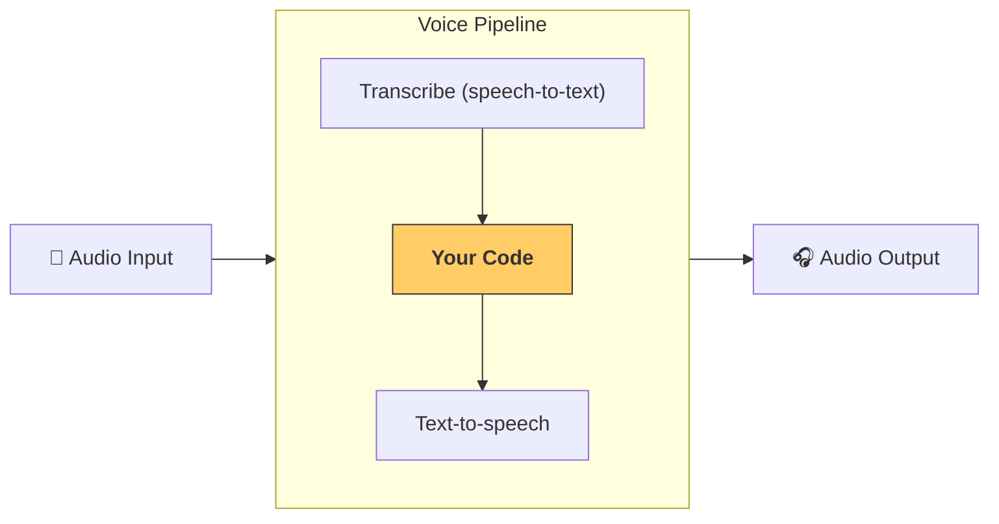

---
search:
  exclude: true
---
# 파이프라인과 워크플로

[`VoicePipeline`][agents.voice.pipeline.VoicePipeline]은 에이전트 워크플로를 음성 앱으로 쉽게 전환할 수 있게 해주는 클래스입니다. 실행할 워크플로를 전달하면 파이프라인이 입력 오디오의 음성 인식, 오디오 종료 감지, 적절한 타이밍에 워크플로 호출, 워크플로 출력을 다시 오디오로 변환하는 작업을 처리합니다.



## 파이프라인 구성

파이프라인을 생성할 때 다음 항목을 설정할 수 있습니다:

1. 새로운 오디오가 음성 인식될 때마다 실행되는 코드인 [`workflow`][agents.voice.workflow.VoiceWorkflowBase]
2. 사용되는 [`speech-to-text`][agents.voice.model.STTModel] 및 [`text-to-speech`][agents.voice.model.TTSModel] 모델
3. 다음과 같은 항목을 구성할 수 있는 [`config`][agents.voice.pipeline_config.VoicePipelineConfig]
    - 모델 이름을 실제 모델에 매핑할 수 있는 모델 제공자
    - 트레이싱: 트레이싱 비활성화 여부, 오디오 파일 업로드 여부, 워크플로 이름, 트레이스 ID 등
    - TTS 및 STT 모델의 설정: 프롬프트, 언어, 사용되는 데이터 타입 등

## 파이프라인 실행

[`run()`][agents.voice.pipeline.VoicePipeline.run] 메서드를 통해 파이프라인을 실행할 수 있으며, 두 가지 형태로 오디오 입력을 전달할 수 있습니다:

1. 전체 오디오 트랜스크립트가 있고 그에 대한 결과만 생성하면 될 때는 [`AudioInput`][agents.voice.input.AudioInput]을 사용합니다. 사전 녹음된 오디오가 있거나 사용자가 언제 말하기를 마쳤는지 명확한 푸시투토크 앱처럼, 화자의 발화 종료를 감지할 필요가 없는 경우에 유용합니다
2. 사용자가 언제 말하기를 마쳤는지 감지해야 할 수도 있는 경우에는 [`StreamedAudioInput`][agents.voice.input.StreamedAudioInput]을 사용합니다. 오디오 청크를 감지되는 대로 푸시할 수 있으며, 보이스 파이프라인은 "activity detection(활동 감지)"이라 불리는 과정을 통해 적절한 타이밍에 에이전트 워크플로를 자동으로 실행합니다

## 결과

보이스 파이프라인 실행 결과는 [`StreamedAudioResult`][agents.voice.result.StreamedAudioResult]입니다. 이는 발생하는 이벤트를 스트리밍으로 제공하는 객체입니다. 다음과 같은 여러 종류의 [`VoiceStreamEvent`][agents.voice.events.VoiceStreamEvent]가 있습니다:

1. 오디오 청크를 포함하는 [`VoiceStreamEventAudio`][agents.voice.events.VoiceStreamEventAudio]
2. 턴 시작/종료 같은 라이프사이클 이벤트를 알려주는 [`VoiceStreamEventLifecycle`][agents.voice.events.VoiceStreamEventLifecycle]
3. 오류 이벤트인 [`VoiceStreamEventError`][agents.voice.events.VoiceStreamEventError]

```python

result = await pipeline.run(input)

async for event in result.stream():
    if event.type == "voice_stream_event_audio":
        # play audio
    elif event.type == "voice_stream_event_lifecycle":
        # lifecycle
    elif event.type == "voice_stream_event_error"
        # error
    ...
```

## 모범 사례

### 인터럽션(중단 처리)

Agents SDK는 현재 [`StreamedAudioInput`][agents.voice.input.StreamedAudioInput]에 대한 내장 인터럽션(중단 처리) 기능을 지원하지 않습니다. 대신 감지된 각 턴마다 워크플로의 별도 실행을 트리거합니다. 애플리케이션 내부에서 인터럽션을 처리하려면 [`VoiceStreamEventLifecycle`][agents.voice.events.VoiceStreamEventLifecycle] 이벤트를 수신할 수 있습니다. `turn_started`는 새로운 턴이 트랜스크립트되었고 처리가 시작됨을 나타냅니다. `turn_ended`는 해당 턴에 대한 모든 오디오가 전송된 후 트리거됩니다. 모델이 턴을 시작할 때 화자의 마이크를 음소거하고, 해당 턴의 관련 오디오를 모두 플러시한 후 음소거를 해제하는 방식으로 이 이벤트들을 사용할 수 있습니다.