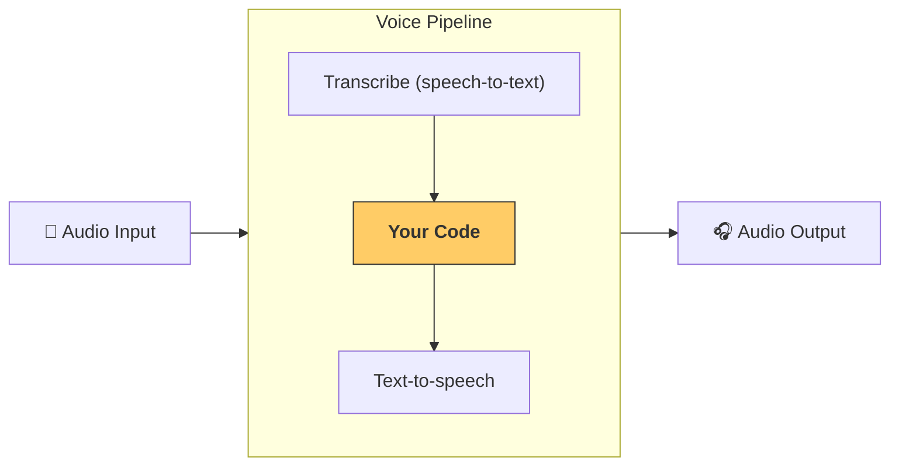

---
search:
  exclude: true
---
# 파이프라인 및 워크플로

[`VoicePipeline`][agents.voice.pipeline.VoicePipeline] 클래스는 에이전트 워크플로를 음성 앱으로 쉽게 전환할 수 있도록 지원합니다. 실행할 워크플로를 전달하면 파이프라인이 입력 오디오 전사, 오디오 종료 감지, 적절한 시점의 워크플로 호출, 워크플로 출력의 오디오 변환을 처리합니다.


```mermaid
graph LR
    %% Input
    A["🎤 Audio Input"]

    %% Voice Pipeline
    subgraph Voice_Pipeline [Voice Pipeline]
        direction TB
        B["Transcribe (speech-to-text)"]
        C["Your Code"]:::highlight
        D["Text-to-speech"]
        B --> C --> D
    end

    %% Output
    E["🎧 Audio Output"]

    %% Flow
    A --> Voice_Pipeline
    Voice_Pipeline --> E

    %% Custom styling
    classDef highlight fill:#ffcc66,stroke:#333,stroke-width:1px,font-weight:700;

```

## 파이프라인 구성 {#configuring-a-pipeline}

파이프라인을 생성할 때 다음 몇 가지 항목을 설정할 수 있습니다.

1. 새 오디오가 전사될 때마다 실행되는 코드인 [`workflow`][agents.voice.workflow.VoiceWorkflowBase]
2. 사용되는 [`speech-to-text`][agents.voice.model.STTModel] 및 [`text-to-speech`][agents.voice.model.TTSModel] 모델
3. 다음과 같은 항목을 구성할 수 있는 [`config`][agents.voice.pipeline_config.VoicePipelineConfig]:
    - 모델 이름을 모델에 매핑할 수 있는 모델 제공자
    - 트레이싱 사용 중지 여부, 오디오 파일 업로드 여부, 워크플로 이름, 트레이스 ID 등을 포함한 트레이싱
    - 프롬프트, 언어, 사용되는 데이터 형식 등 TTS 및 STT 모델의 설정

### 단일 에이전트 워크플로를 위한 애플리케이션 컨텍스트 전달 {#pass-application-context-to-a-single-agent-workflow}

음성 에이전트나 해당 도구 또는 수명 주기 훅에 애플리케이션 상태 또는 종속성이 필요한 경우, [`SingleAgentVoiceWorkflow`][agents.voice.workflow.SingleAgentVoiceWorkflow] 생성 시 `context` 값을 전달합니다.

```python
from dataclasses import dataclass

from agents import Agent
from agents.voice import SingleAgentVoiceWorkflow, VoicePipeline


@dataclass
class VoiceContext:
    user_id: str


agent = Agent[VoiceContext](name="Voice assistant")
workflow = SingleAgentVoiceWorkflow(
    agent,
    context=VoiceContext(user_id="user-123"),
)
pipeline = VoicePipeline(workflow=workflow)
```

워크플로는 자신이 시작하는 모든 에이전트 실행에 동일한 컨텍스트 객체를 전달하며, 이후의 전사 턴도 여기에 포함됩니다. 도구와 수명 주기 훅은 [`RunContextWrapper.context`][agents.run_context.RunContextWrapper.context] 경로를 통해 이 객체를 전달받습니다. 컨텍스트는 애플리케이션 내부에만 유지되며 모델로 전송되지 않습니다. 타입 지정 및 수명 주기에 관한 지침은 [컨텍스트 관리](../context.md)를 참조하세요.

### OpenAI 음성 모델 구성 {#configure-openai-speech-models}

기본 OpenAI 음성 모델을 구성하려면 [`STTModelSettings`][agents.voice.model.STTModelSettings] 및 [`TTSModelSettings`][agents.voice.model.TTSModelSettings] 설정을 `VoicePipelineConfig` 값을 통해 전달합니다.

```python
from agents.voice import STTModelSettings, TTSModelSettings, VoicePipeline, VoicePipelineConfig

config = VoicePipelineConfig(
    stt_settings=STTModelSettings(
        language="en",
        prompt="A customer support call about product AC-42.",
    ),
    tts_settings=TTSModelSettings(
        voice="marin",
    ),
)
pipeline = VoicePipeline(workflow=workflow, config=config)
```

전체 오디오 입력의 경우 `STTModelSettings.language` 및 `prompt` 값이 전사 요청에 전달됩니다. [`StreamedAudioInput`][agents.voice.input.StreamedAudioInput] 입력을 사용하는 경우, WebSocket 세션이 구성될 때 OpenAI 전사 세션에는 `language`, `prompt`와 스트리밍 전용 `languages` 및 `keywords` 설정도 전달됩니다. `gpt-transcribe` 및 `gpt-live-transcribe` 모델에서는 예상 입력 언어 목록인 `languages`와 오디오에 등장할 수 있는 리터럴 용어 목록인 `keywords`을 사용합니다. `languages` 값이 설정되면 `language` 값보다 우선 적용됩니다. 그렇지 않으면 이 두 모델에는 SDK의 단일 `language` 값이 요소 하나로 구성된 `languages` 목록으로 전달됩니다. 다른 전사 모델에는 단수형 `language` 필드가 계속 전달됩니다. API에서 지원하는 언어 코드를 사용하고, `prompt` 값에는 전사 작업을 다시 설명하는 대신 녹음 내용이나 녹음 환경을 설명합니다. 키워드는 전사 힌트이며 필수 출력이 아닙니다. OpenAI의 [전사 컨텍스트 가이드](https://developers.openai.com/api/docs/guides/transcription#improve-transcription-quality)를 참조하세요.

예상 언어 간에 전환할 수 있는 스트리밍 전사의 경우 스트리밍 전용 필드를 명시적으로 구성합니다.

```python
config = VoicePipelineConfig(
    stt_settings=STTModelSettings(
        languages=["en", "es"],
        keywords=["AC-42", "Agents SDK"],
        prompt="A customer support call about product AC-42.",
    ),
)
```

`TTSModelSettings.dtype` 값에는 네이티브 `int16` 또는 `float32` 타입으로 해석되는 NumPy dtype 표기를 사용할 수 있습니다. 여기에는 `np.int16`, `np.float32`, `"int16"`, `"float32"` 및 `"f4"` 같은 별칭이 포함됩니다. 파이프라인이 스트리밍된 TTS 오디오를 변환할 때 다른 dtype이나 네이티브가 아닌 바이트 순서를 사용하면 [`UserError`][agents.exceptions.UserError] 오류가 발생합니다.

`TTSModelSettings.voice` 값으로 기본 제공되는 지원 항목은 `alloy`, `ash`, `ballad`, `coral`, `echo`, `fable`, `onyx`, `nova`, `sage`, `shimmer`, `verse`, `marin`, `cedar`입니다. 음성 사용 가능 여부는 선택한 텍스트 음성 변환 모델에 따라 달라집니다. 현재 모델별 사용 가능 여부는 OpenAI의 [음성 옵션](https://developers.openai.com/api/docs/guides/text-to-speech#voice-options)을 참조하세요. OpenAI 사용자 지정 음성을 사용할 수 있는 조직은 대신 사용자 지정 음성 ID를 전달할 수 있습니다.

```python
config = VoicePipelineConfig(
    tts_settings=TTSModelSettings(
        voice={"id": "voice_123abc"},
    ),
)
```

사용자 지정 음성은 자격을 갖춘 고객만 사용할 수 있으며, 사용하기 전에 OpenAI API를 통해 생성해야 합니다. 액세스, 동의 및 생성 요구 사항은 OpenAI의 [사용자 지정 음성 가이드](https://developers.openai.com/api/docs/guides/text-to-speech#custom-voices)를 참조하세요.

[`OpenAIVoiceModelProvider`][agents.voice.models.openai_model_provider.OpenAIVoiceModelProvider] 클래스는 구성된 `AsyncOpenAI` 클라이언트를 비스트리밍 전사 요청, TTS 요청 및 스트리밍 STT 연결에 사용합니다. 스트리밍 STT WebSocket 연결은 해당 클라이언트에서 엔드포인트, 인증 및 기본 헤더와 기본 쿼리 매개변수를 가져옵니다. 제공자 소유권 및 우선순위 규칙은 [API 키 및 클라이언트](../config.md#api-keys-and-clients)를 참조하세요.

## 파이프라인 실행 {#running-a-pipeline}

[`run()`][agents.voice.pipeline.VoicePipeline.run] 메서드를 통해 파이프라인을 실행할 수 있으며, 오디오 입력은 다음 두 가지 형식으로 전달할 수 있습니다.

1. [`AudioInput`][agents.voice.input.AudioInput] 입력은 전체 오디오 입력이 있고 이에 대한 결과만 생성하려는 경우 사용합니다. 화자가 말하기를 마친 시점을 감지할 필요가 없는 경우에 유용합니다. 예를 들어 사전 녹음된 오디오가 있거나, 사용자가 말하기를 마친 시점이 명확한 푸시 투 토크 앱에서 사용할 수 있습니다.
2. [`StreamedAudioInput`][agents.voice.input.StreamedAudioInput] 입력은 사용자가 말하기를 마친 시점을 감지해야 할 수 있는 경우 사용합니다. 오디오 청크가 감지되는 대로 전달할 수 있으며, 음성 파이프라인은 "활동 감지"라는 프로세스를 통해 적절한 시점에 에이전트 워크플로를 자동으로 실행합니다.

## 결과 {#results}

음성 파이프라인 실행 결과는 [`StreamedAudioResult`][agents.voice.result.StreamedAudioResult] 객체입니다. 이 객체를 사용하면 이벤트가 발생하는 즉시 스트리밍할 수 있습니다. [`VoiceStreamEvent`][agents.voice.events.VoiceStreamEvent]에는 다음과 같은 몇 가지 유형이 있습니다.

1. 오디오 청크가 포함된 [`VoiceStreamEventAudio`][agents.voice.events.VoiceStreamEventAudio]
2. 턴 시작 또는 종료 같은 수명 주기 이벤트를 알려주는 [`VoiceStreamEventLifecycle`][agents.voice.events.VoiceStreamEventLifecycle]
3. 오류 이벤트인 [`VoiceStreamEventError`][agents.voice.events.VoiceStreamEventError]

애플리케이션이 [`StreamedAudioResult.stream()`][agents.voice.result.StreamedAudioResult.stream] 값을 소비하는 동안 치명적인 파이프라인 오류가 발생합니다. 그 외에는 정상적으로 실행이 완료되었지만 음성-텍스트 전사 세션을 종료하지 못하는 경우, 스트림은 무기한 기다리는 대신 해당 종료 오류를 발생시킵니다. 턴이 이미 실패한 상태에서 전사 세션 종료도 실패하면 스트림은 원래 턴 오류를 기본 오류로 유지합니다.

```python

result = await pipeline.run(input)

async for event in result.stream():
    if event.type == "voice_stream_event_audio":
        # play audio
        pass
    elif event.type == "voice_stream_event_lifecycle":
        # lifecycle
        pass
    elif event.type == "voice_stream_event_error":
        # error
        pass
```

## 모범 사례 {#best-practices}

### 인터럽션(중단 처리) {#interruptions}

Agents SDK는 현재 [`StreamedAudioInput`][agents.voice.input.StreamedAudioInput] 입력을 위한 기본 제공 인터럽션(중단 처리) 기능을 제공하지 않습니다. 대신 감지된 각 턴은 워크플로를 별도로 실행합니다. 애플리케이션 내에서 인터럽션(중단 처리)을 구현하려면 [`VoiceStreamEventLifecycle`][agents.voice.events.VoiceStreamEventLifecycle] 이벤트를 수신할 수 있습니다. `turn_started` 이벤트는 새 턴의 전사가 완료되어 처리가 시작됨을 나타냅니다. `turn_ended` 이벤트는 해당 턴의 모든 오디오가 전달된 후 발생합니다. 이러한 이벤트를 사용하여 모델이 턴을 시작할 때 화자의 마이크를 음소거하고, 애플리케이션에서 해당 턴과 관련된 모든 오디오 재생을 마치면 음소거를 해제할 수 있습니다.