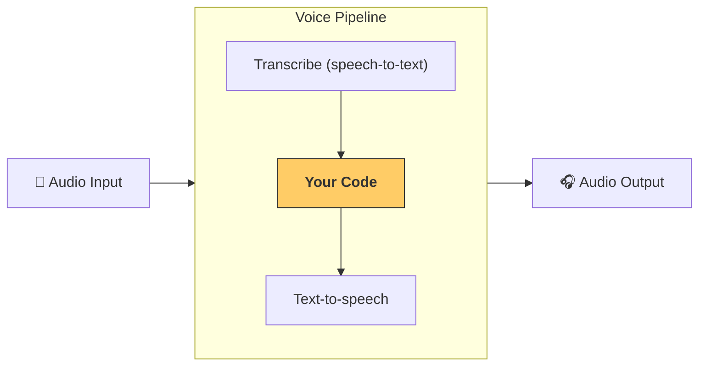

# Pipelines and workflows

[`VoicePipeline`][agents.voice.pipeline.VoicePipeline] is a class that makes it easy to turn your agentic workflows into a voice app. You pass in a workflow to run, and the pipeline takes care of transcribing input audio, detecting when the audio ends, calling your workflow at the right time, and turning the workflow output back into audio.



## Configuring a pipeline

When you create a pipeline, you can set a few things:

1. The [`workflow`][agents.voice.workflow.VoiceWorkflowBase], which is the code that runs each time new audio is transcribed.
2. The [`speech-to-text`][agents.voice.model.STTModel] and [`text-to-speech`][agents.voice.model.TTSModel] models used
3. The [`config`][agents.voice.pipeline_config.VoicePipelineConfig], which lets you configure things like:
    - A model provider, which can map model names to models
    - Tracing, including whether to disable tracing, whether audio files are uploaded, the workflow name, trace IDs etc.
    - Settings on the TTS and STT models, such as the prompt, language, and data types used.

### Pass application context to a single-agent workflow

Pass `context` to [`SingleAgentVoiceWorkflow`][agents.voice.workflow.SingleAgentVoiceWorkflow] when the voice Agent, its tools, or its lifecycle hooks need application state or dependencies:

```python
from dataclasses import dataclass

from agents import Agent
from agents.voice import SingleAgentVoiceWorkflow, VoicePipeline


@dataclass
class VoiceContext:
    user_id: str


agent = Agent[VoiceContext](name="Voice assistant")
workflow = SingleAgentVoiceWorkflow(
    agent,
    context=VoiceContext(user_id="user-123"),
)
pipeline = VoicePipeline(workflow=workflow)
```

The workflow forwards the same context object to every agent run that it starts, including later transcription turns. Tools and lifecycle hooks receive it through [`RunContextWrapper.context`][agents.run_context.RunContextWrapper.context]. The context remains local to your application and is not sent to the model. See [Context management](../context.md) for typing and lifecycle guidance.

### Configure OpenAI speech models

Pass [`STTModelSettings`][agents.voice.model.STTModelSettings] and [`TTSModelSettings`][agents.voice.model.TTSModelSettings] through `VoicePipelineConfig` to configure the default OpenAI speech models:

```python
from agents.voice import STTModelSettings, TTSModelSettings, VoicePipeline, VoicePipelineConfig

config = VoicePipelineConfig(
    stt_settings=STTModelSettings(
        language="en",
        prompt="A customer support call about product AC-42.",
    ),
    tts_settings=TTSModelSettings(
        voice="marin",
    ),
)
pipeline = VoicePipeline(workflow=workflow, config=config)
```

For complete audio input, `STTModelSettings.language` and `prompt` are passed to the transcription request. For [`StreamedAudioInput`][agents.voice.input.StreamedAudioInput], the OpenAI transcription session also receives `language`, `prompt`, and the streaming-only `languages` and `keywords` settings when the WebSocket session is configured. `gpt-transcribe` and `gpt-live-transcribe` use `languages`, a list of expected input languages, and `keywords`, a list of literal terms that may appear in the audio. When `languages` is set, it takes precedence over `language`. Otherwise, these two models receive the single SDK `language` value as a one-element `languages` list. Other transcription models continue to receive the singular `language` field. Use API-supported language codes, and use `prompt` to describe the recording or its setting rather than restating the transcription task. Keywords are transcription hints, not required output. See the OpenAI [transcription context guide](https://developers.openai.com/api/docs/guides/transcription#improve-transcription-quality).

For a streamed transcription that can switch between expected languages, configure the streaming-only fields explicitly:

```python
config = VoicePipelineConfig(
    stt_settings=STTModelSettings(
        languages=["en", "es"],
        keywords=["AC-42", "Agents SDK"],
        prompt="A customer support call about product AC-42.",
    ),
)
```

`TTSModelSettings.dtype` accepts NumPy dtype spellings that resolve to native `int16` or `float32`, including `np.int16`, `np.float32`, `"int16"`, `"float32"`, and aliases such as `"f4"`. Other dtypes and non-native byte orders raise [`UserError`][agents.exceptions.UserError] when the pipeline transforms streamed TTS audio.

The supported built-in `TTSModelSettings.voice` values are `alloy`, `ash`, `ballad`, `coral`, `echo`, `fable`, `onyx`, `nova`, `sage`, `shimmer`, `verse`, `marin`, and `cedar`. Voice availability depends on the selected text-to-speech model; see the OpenAI [voice options](https://developers.openai.com/api/docs/guides/text-to-speech#voice-options) for current model-specific availability. Organizations with access to OpenAI custom voices can instead pass a custom voice ID:

```python
config = VoicePipelineConfig(
    tts_settings=TTSModelSettings(
        voice={"id": "voice_123abc"},
    ),
)
```

Custom voices are limited to eligible customers and must be created through the OpenAI API before use. See the OpenAI [custom voices guide](https://developers.openai.com/api/docs/guides/text-to-speech#custom-voices) for access, consent, and creation requirements.

[`OpenAIVoiceModelProvider`][agents.voice.models.openai_model_provider.OpenAIVoiceModelProvider] uses its configured `AsyncOpenAI` client for non-streamed transcription requests, TTS requests, and streamed STT connections. The streamed STT WebSocket connection derives its endpoint, authentication and default headers, and default query parameters from that client. See [API keys and clients](../config.md#api-keys-and-clients) for provider ownership and precedence rules.

## Running a pipeline

You can run a pipeline via the [`run()`][agents.voice.pipeline.VoicePipeline.run] method, which lets you pass in audio input in two forms:

1. [`AudioInput`][agents.voice.input.AudioInput] is used when you have a complete audio input and just want to produce a result for it. This is useful in cases where you don't need to detect when a speaker is done speaking; for example, when you have pre-recorded audio or in push-to-talk apps where it's clear when the user is done speaking.
2. [`StreamedAudioInput`][agents.voice.input.StreamedAudioInput] is used when you might need to detect when a user is done speaking. It allows you to push audio chunks as they are detected, and the voice pipeline will automatically run the agent workflow at the right time, via a process called "activity detection".

## Results

The result of a voice pipeline run is a [`StreamedAudioResult`][agents.voice.result.StreamedAudioResult]. This is an object that lets you stream events as they occur. There are a few kinds of [`VoiceStreamEvent`][agents.voice.events.VoiceStreamEvent], including:

1. [`VoiceStreamEventAudio`][agents.voice.events.VoiceStreamEventAudio], which contains a chunk of audio.
2. [`VoiceStreamEventLifecycle`][agents.voice.events.VoiceStreamEventLifecycle], which informs you of lifecycle events like a turn starting or ending.
3. [`VoiceStreamEventError`][agents.voice.events.VoiceStreamEventError], which is an error event.

Terminal pipeline errors are raised while the application consumes [`StreamedAudioResult.stream()`][agents.voice.result.StreamedAudioResult.stream]. If the speech-to-text transcription session fails to close after an otherwise clean run, the stream raises that close error instead of waiting indefinitely. If the turn has already failed and closing the transcription session also fails, the stream preserves the original turn error as the primary error.

```python

result = await pipeline.run(input)

async for event in result.stream():
    if event.type == "voice_stream_event_audio":
        # play audio
        pass
    elif event.type == "voice_stream_event_lifecycle":
        # lifecycle
        pass
    elif event.type == "voice_stream_event_error":
        # error
        pass
```

## Best practices

### Interruptions

The Agents SDK currently does not provide any built-in interruption handling for [`StreamedAudioInput`][agents.voice.input.StreamedAudioInput]. Instead, every detected turn triggers a separate run of your workflow. If you want to handle interruptions inside your application, you can listen to the [`VoiceStreamEventLifecycle`][agents.voice.events.VoiceStreamEventLifecycle] events. `turn_started` indicates that a new turn was transcribed and processing is beginning. `turn_ended` triggers after all the audio was dispatched for a respective turn. You could use these events to mute the speaker's microphone when the model starts a turn and unmute it after your application finishes playing all audio related to that turn.
