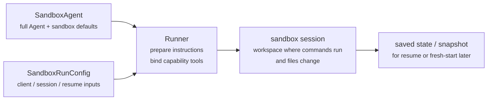
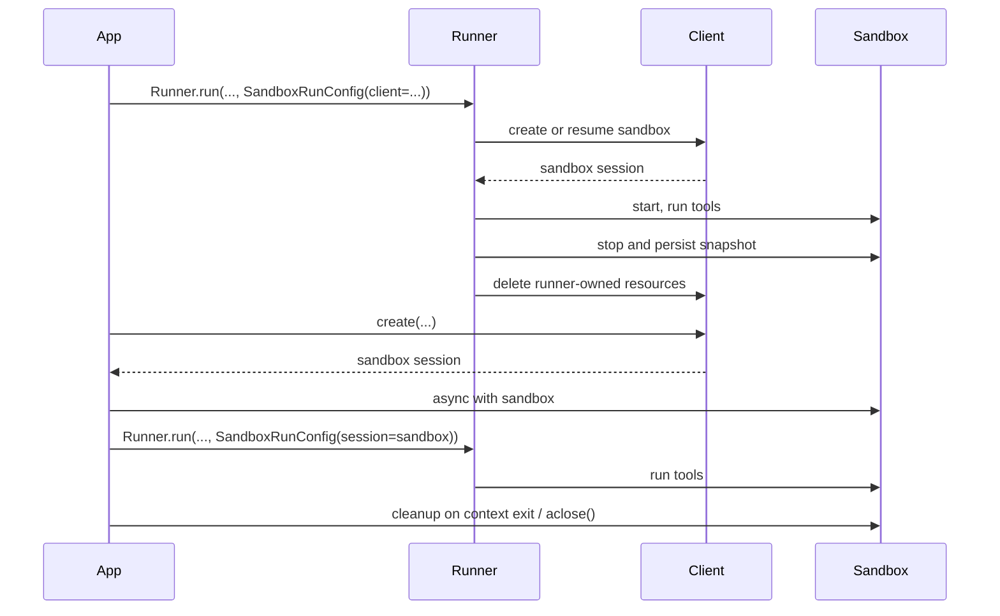

---
search:
  exclude: true
---
# 概念

!!! warning "Beta 功能"

    Sandbox 智能体目前处于 beta 阶段。预计 API 的细节、默认值和支持的能力在正式可用之前都会发生变化，并且功能也会随着时间推移变得更高级。

现代智能体在能够对文件系统中的真实文件进行操作时效果最佳。**Sandbox 智能体**可以使用专门的工具和 shell 命令，在大型文档集合上执行检索和操作、编辑文件、生成产物以及运行命令。sandbox 为模型提供了一个持久化工作区，智能体可以利用它代表你执行工作。Agents SDK 中的 Sandbox 智能体可帮助你轻松运行与 sandbox 环境配对的智能体，从而更方便地将正确的文件放入文件系统，并编排 sandboxes，以便大规模地轻松启动、停止和恢复任务。

你可以围绕智能体所需的数据来定义工作区。它可以从 GitHub 仓库、本地文件和目录、合成任务文件、诸如 S3 或 Azure Blob Storage 之类的远程文件系统，以及你提供的其他 sandbox 输入开始。

<div class="sandbox-harness-image" markdown="1">


</div>

`SandboxAgent` 仍然是一个 `Agent`。它保留了常规的智能体接口，例如 `instructions`、`prompt`、`tools`、`handoffs`、`mcp_servers`、`model_settings`、`output_type`、安全防护措施和 hooks，并且仍然通过常规的 `Runner` API 运行。变化之处在于执行边界：

- `SandboxAgent` 定义智能体本身：常规的智能体配置，加上 sandbox 专属默认值，例如 `default_manifest`、`base_instructions`、`run_as`，以及文件系统工具、shell 访问、skills、memory 或 compaction 等能力。
- `Manifest` 声明一个全新 sandbox 工作区所需的初始内容和布局，包括文件、仓库、挂载和环境。
- sandbox session 是命令运行和文件发生变化的实时隔离环境。
- [`SandboxRunConfig`][agents.run_config.SandboxRunConfig] 决定该次运行如何获得该 sandbox session，例如直接注入一个 session、从序列化的 sandbox session 状态重连，或通过 sandbox client 创建一个新的 sandbox session。
- 已保存的 sandbox 状态和快照允许后续运行重新连接到先前的工作，或用保存的内容为新的 sandbox session 提供初始内容。

`Manifest` 是全新 session 工作区的契约，而不是每个实时 sandbox 的完整事实来源。一次运行的实际工作区也可能来自复用的 sandbox session、序列化的 sandbox session 状态，或在运行时选择的快照。

在本页中，“sandbox session”指的是由 sandbox client 管理的实时执行环境。它不同于 [Sessions](../sessions/index.md) 中描述的 SDK 对话式 [`Session`][agents.memory.session.Session] 接口。

外层运行时仍然负责 approvals、追踪、任务转移和恢复记录。sandbox session 负责命令、文件变更和环境隔离。这种划分是该模型的核心部分。

### 组件协作方式

一次 sandbox 运行将智能体定义与每次运行的 sandbox 配置结合起来。runner 会准备智能体，将其绑定到一个实时 sandbox session，并且可以为后续运行保存状态。



sandbox 专属默认值保留在 `SandboxAgent` 上。每次运行的 sandbox-session 选择保留在 `SandboxRunConfig` 中。

可以将生命周期理解为三个阶段：

1. 使用 `SandboxAgent`、`Manifest` 和能力来定义智能体及全新工作区契约。
2. 通过向 `Runner` 提供一个 `SandboxRunConfig` 来执行运行，以注入、恢复或创建 sandbox session。
3. 稍后从 runner 管理的 `RunState`、显式的 sandbox `session_state` 或已保存的工作区快照继续。

如果 shell 访问只是一个偶尔使用的工具，请从 [工具指南](../tools.md) 中的 hosted shell 开始。当工作区隔离、sandbox client 选择或 sandbox-session 恢复行为本身就是设计的一部分时，再使用 sandbox 智能体。

## 适用场景

Sandbox 智能体非常适合以工作区为中心的工作流，例如：

- 编码和调试，例如在 GitHub 仓库中编排针对 issue 报告的自动修复并运行有针对性的测试
- 文档处理与编辑，例如从用户的财务文件中提取信息并创建一份填写完成的税表草稿
- 基于文件的审查或分析，例如在回答之前检查入职材料包、生成的报告或产物包
- 隔离的多智能体模式，例如为每个审查员或编码子智能体分配各自的工作区
- 多步骤工作区任务，例如在一次运行中修复 bug，稍后再添加回归测试，或从快照或 sandbox session 状态恢复

如果你不需要访问文件或一个活动中的文件系统，请继续使用 `Agent`。如果 shell 访问只是偶尔需要的一项能力，请添加 hosted shell；如果工作区边界本身就是功能的一部分，请使用 sandbox 智能体。

## sandbox client 选择

本地开发时从 `UnixLocalSandboxClient` 开始。当你需要容器隔离或镜像一致性时，切换到 `DockerSandboxClient`。当你需要由提供方管理执行环境时，切换到托管提供方。

在大多数情况下，`SandboxAgent` 定义保持不变，而 sandbox client 及其选项在 [`SandboxRunConfig`][agents.run_config.SandboxRunConfig] 中变化。有关本地、Docker、托管和远程挂载选项，请参见 [Sandbox clients](clients.md)。

## 核心组件

<div class="sandbox-nowrap-first-column-table" markdown="1">

| 层级 | 主要 SDK 组件 | 回答的问题 |
| --- | --- | --- |
| 智能体定义 | `SandboxAgent`、`Manifest`、capabilities | 将运行什么智能体，以及它应从什么样的全新 session 工作区契约开始？ |
| Sandbox 执行 | `SandboxRunConfig`、sandbox client 和实时 sandbox session | 此次运行如何获得一个实时 sandbox session，工作在哪里执行？ |
| 已保存的 sandbox 状态 | `RunState` sandbox payload、`session_state` 和 snapshots | 此工作流如何重新连接到之前的 sandbox 工作，或从已保存内容为新的 sandbox session 提供初始内容？ |

</div>

主要 SDK 组件与这些层级的对应关系如下：

<div class="sandbox-nowrap-first-column-table" markdown="1">

| 组件 | 负责内容 | 请问这个问题 |
| --- | --- | --- |
| [`SandboxAgent`][agents.sandbox.sandbox_agent.SandboxAgent] | 智能体定义 | 这个智能体应该做什么，哪些默认值应随其一同携带？ |
| [`Manifest`][agents.sandbox.manifest.Manifest] | 全新 session 工作区文件和文件夹 | 运行开始时，文件系统中应存在哪些文件和文件夹？ |
| [`Capability`][agents.sandbox.capabilities.capability.Capability] | sandbox 原生行为 | 哪些工具、instruction 片段或运行时行为应附加到此智能体？ |
| [`SandboxRunConfig`][agents.run_config.SandboxRunConfig] | 每次运行的 sandbox client 和 sandbox-session 来源 | 此次运行应注入、恢复，还是创建一个 sandbox session？ |
| [`RunState`][agents.run_state.RunState] | runner 管理的已保存 sandbox 状态 | 我是否正在恢复一个先前由 runner 管理的工作流，并自动延续其 sandbox 状态？ |
| [`SandboxRunConfig.session_state`][agents.run_config.SandboxRunConfig.session_state] | 显式序列化的 sandbox session 状态 | 我是否希望从已经在 `RunState` 之外序列化的 sandbox 状态恢复？ |
| [`SandboxRunConfig.snapshot`][agents.run_config.SandboxRunConfig.snapshot] | 用于全新 sandbox sessions 的已保存工作区内容 | 新的 sandbox session 是否应从已保存文件和产物开始？ |

</div>

一个实用的设计顺序是：

1. 用 `Manifest` 定义全新 session 工作区契约。
2. 用 `SandboxAgent` 定义智能体。
3. 添加内置或自定义能力。
4. 在 `RunConfig(sandbox=SandboxRunConfig(...))` 中决定每次运行应如何获取其 sandbox session。

## sandbox 运行的准备方式

在运行时，runner 会将该定义转换为一次具体的、由 sandbox 支持的运行：

1. 它从 `SandboxRunConfig` 解析 sandbox session。
   如果你传入 `session=...`，它会复用该实时 sandbox session。
   否则，它会使用 `client=...` 来创建或恢复一个。
2. 它确定该次运行的实际工作区输入。
   如果运行注入或恢复了一个 sandbox session，则现有的 sandbox 状态优先生效。
   否则，runner 会从一次性的 manifest 覆盖或 `agent.default_manifest` 开始。
   这就是为什么仅有 `Manifest` 并不能定义每次运行的最终实时工作区。
3. 它让 capabilities 处理生成的 manifest。
   这样 capabilities 就可以在最终智能体准备完成之前，添加文件、挂载或其他作用于工作区范围的行为。
4. 它按固定顺序构建最终 instructions：
   SDK 的默认 sandbox 提示词，或如果你显式覆盖则使用 `base_instructions`，然后是 `instructions`，接着是 capability instruction 片段，再是任何远程挂载策略文本，最后是渲染后的文件系统树。
5. 它将 capability 工具绑定到实时 sandbox session，并通过常规 `Runner` API 运行已准备好的智能体。

Sandboxing 不会改变一个 turn 的含义。turn 仍然是一个模型步骤，而不是单个 shell 命令或 sandbox 动作。sandbox 侧操作与 turn 之间并不存在固定的一对一映射：有些工作可能停留在 sandbox 执行层内部，而其他动作会返回工具结果、approvals 或其他需要再进行一次模型步骤的状态。实践上，只有当智能体运行时在 sandbox 工作发生后还需要另一个模型响应时，才会消耗另一个 turn。

这些准备步骤说明了为什么在设计 `SandboxAgent` 时，`default_manifest`、`instructions`、`base_instructions`、`capabilities` 和 `run_as` 是主要需要考虑的 sandbox 专属选项。

## `SandboxAgent` 选项

这些是在常规 `Agent` 字段之外的 sandbox 专属选项：

<div class="sandbox-nowrap-first-column-table" markdown="1">

| 选项 | 最佳用途 |
| --- | --- |
| `default_manifest` | 由 runner 创建的全新 sandbox sessions 的默认工作区。 |
| `instructions` | 追加在 SDK sandbox 提示词之后的额外角色、工作流和成功标准。 |
| `base_instructions` | 用于替换 SDK sandbox 提示词的高级逃生舱口。 |
| `capabilities` | 应随此智能体携带的 sandbox 原生工具和行为。 |
| `run_as` | 面向模型的 sandbox 工具（如 shell 命令、文件读取和 patch）所使用的用户身份。 |

</div>

sandbox client 选择、sandbox-session 复用、manifest 覆盖和快照选择属于 [`SandboxRunConfig`][agents.run_config.SandboxRunConfig]，而不是智能体本身。

### `default_manifest`

`default_manifest` 是当 runner 为此智能体创建一个全新 sandbox session 时使用的默认 [`Manifest`][agents.sandbox.manifest.Manifest]。应将它用于智能体通常应具备的文件、仓库、辅助材料、输出目录和挂载。

这只是默认值。一次运行可以通过 `SandboxRunConfig(manifest=...)` 覆盖它，而一个复用或恢复的 sandbox session 会保留其现有工作区状态。

### `instructions` 和 `base_instructions`

将 `instructions` 用于应跨不同提示词保留的简短规则。在 `SandboxAgent` 中，这些 instructions 会追加在 SDK 的 sandbox 基础提示词之后，因此你可以保留内置的 sandbox 指引，并添加自己的角色、工作流和成功标准。

只有当你想替换 SDK sandbox 基础提示词时，才使用 `base_instructions`。大多数智能体都不应设置它。

<div class="sandbox-nowrap-first-column-table" markdown="1">

| 放在...中 | 用途 | 示例 |
| --- | --- | --- |
| `instructions` | 智能体的稳定角色、工作流规则和成功标准。 | “检查入职文档，然后执行任务转移。”, “将最终文件写入 `output/`。” |
| `base_instructions` | 完整替换 SDK sandbox 基础提示词。 | 自定义的底层 sandbox 包装提示词。 |
| 用户提示词 | 此次运行的一次性请求。 | “总结这个工作区。” |
| manifest 中的工作区文件 | 更长的任务规范、仓库本地 instructions 或有界的参考材料。 | `repo/task.md`、文档包、示例材料包。 |

</div>

`instructions` 的良好用法包括：

- [examples/sandbox/unix_local_pty.py](https://github.com/openai/openai-agents-python/blob/main/examples/sandbox/unix_local_pty.py) 在 PTY 状态很重要时，让智能体保持在单个交互式进程中。
- [examples/sandbox/handoffs.py](https://github.com/openai/openai-agents-python/blob/main/examples/sandbox/handoffs.py) 禁止 sandbox 审查智能体在检查后直接回答用户。
- [examples/sandbox/tax_prep.py](https://github.com/openai/openai-agents-python/blob/main/examples/sandbox/tax_prep.py) 要求最终填写完成的文件实际落在 `output/` 中。
- [examples/sandbox/docs/coding_task.py](https://github.com/openai/openai-agents-python/blob/main/examples/sandbox/docs/coding_task.py) 固定了精确的验证命令，并澄清了相对于工作区根目录的 patch 路径。

避免将用户的一次性任务复制到 `instructions` 中、嵌入应放在 manifest 中的长参考材料、重复内置 capabilities 已经注入的工具文档，或混入模型在运行时并不需要的本地安装说明。

如果你省略 `instructions`，SDK 仍会包含默认 sandbox 提示词。对于低层封装器来说这已经足够，但大多数面向用户的智能体仍应提供明确的 `instructions`。

### `capabilities`

Capabilities 会将 sandbox 原生行为附加到 `SandboxAgent`。它们可以在运行开始前塑造工作区、追加 sandbox 专属 instructions、暴露绑定到实时 sandbox session 的工具，并为该智能体调整模型行为或输入处理方式。

内置 capabilities 包括：

<div class="sandbox-nowrap-first-column-table" markdown="1">

| Capability | 适用场景 | 说明 |
| --- | --- | --- |
| `Shell` | 智能体需要 shell 访问。 | 添加 `exec_command`，并在 sandbox client 支持 PTY 交互时添加 `write_stdin`。 |
| `Filesystem` | 智能体需要编辑文件或检查本地图片。 | 添加 `apply_patch` 和 `view_image`；patch 路径相对于工作区根目录。 |
| `Skills` | 你希望在 sandbox 中进行 skill 发现和具体化。 | 优先使用它，而不是手动挂载 `.agents` 或 `.agents/skills`；`Skills` 会为你在 sandbox 中索引并具体化 skills。 |
| `Memory` | 后续运行应读取或生成 memory 产物。 | 需要 `Shell`；实时更新还需要 `Filesystem`。 |
| `Compaction` | 长时间运行的流程需要在 compaction 项之后裁剪上下文。 | 会调整模型采样和输入处理。 |

</div>

默认情况下，`SandboxAgent.capabilities` 使用 `Capabilities.default()`，其中包括 `Filesystem()`、`Shell()` 和 `Compaction()`。如果你传入 `capabilities=[...]`，该列表会替换默认值，因此请包含你仍然需要的任何默认 capability。

对于 skills，请根据你希望其被具体化的方式选择来源：

- `Skills(lazy_from=LocalDirLazySkillSource(...))` 是较大的本地 skill 目录的一个良好默认选项，因为模型可以先发现索引，再仅加载所需内容。
- `LocalDirLazySkillSource(source=LocalDir(src=...))` 会从运行 SDK 进程的文件系统中读取。请传入宿主机侧原始 skills 目录，而不是只存在于 sandbox 镜像或工作区中的路径。
- `Skills(from_=LocalDir(src=...))` 更适合你希望预先准备好的小型本地 bundle。
- `Skills(from_=GitRepo(repo=..., ref=...))` 适用于 skills 本身应来自某个仓库的场景。

`LocalDir.src` 是 SDK 宿主机上的源路径。`skills_path` 是调用 `load_skill` 时，skills 在 sandbox 工作区内准备到的相对目标路径。

如果你的 skills 已经以类似 `.agents/skills/<name>/SKILL.md` 的结构存在于磁盘上，请将 `LocalDir(...)` 指向该源根目录，并仍然使用 `Skills(...)` 来暴露它们。保留默认的 `skills_path=".agents"`，除非你已有依赖不同 sandbox 内布局的现有工作区契约。

在适用时优先使用内置 capabilities。只有当你需要内置项未覆盖的 sandbox 专属工具或 instruction 接口时，才编写自定义 capability。

## 概念

### Manifest

[`Manifest`][agents.sandbox.manifest.Manifest] 描述一个全新 sandbox session 的工作区。它可以设置工作区 `root`、声明文件和目录、复制本地文件、克隆 Git 仓库、附加远程存储挂载、设置环境变量、定义用户或组，并授予对工作区外特定绝对路径的访问权限。

Manifest 条目的路径是相对于工作区的。它们不能是绝对路径，也不能通过 `..` 逃离工作区，这使工作区契约可以在本地、Docker 和托管 client 之间保持可移植性。

将 manifest 条目用于智能体在开始工作前所需的材料：

<div class="sandbox-nowrap-first-column-table" markdown="1">

| Manifest 条目 | 用途 |
| --- | --- |
| `File`、`Dir` | 小型合成输入、辅助文件或输出目录。 |
| `LocalFile`、`LocalDir` | 应在 sandbox 中具体化的宿主机文件或目录。 |
| `GitRepo` | 应获取到工作区中的仓库。 |
| 挂载，如 `S3Mount`、`GCSMount`、`R2Mount`、`AzureBlobMount`、`BoxMount`、`S3FilesMount` | 应出现在 sandbox 内的外部存储。 |

</div>

挂载条目描述要暴露什么存储；挂载策略描述 sandbox 后端如何附加该存储。有关挂载选项和提供方支持，请参见 [Sandbox clients](clients.md#mounts-and-remote-storage)。

良好的 manifest 设计通常意味着保持工作区契约精简，将较长的任务说明放在工作区文件中，例如 `repo/task.md`，并在 instructions 中使用相对工作区路径，例如 `repo/task.md` 或 `output/report.md`。如果智能体使用 `Filesystem` capability 的 `apply_patch` 工具编辑文件，请记住 patch 路径相对于 sandbox 工作区根目录，而不是 shell 的 `workdir`。

仅当智能体需要访问工作区外的具体绝对路径时，才使用 `extra_path_grants`，例如用于临时工具输出的 `/tmp` 或用于只读运行时的 `/opt/toolchain`。在后端可以实施文件系统策略的情况下，授权同时适用于 SDK 文件 API 和 shell 执行：

```python
from agents.sandbox import Manifest, SandboxPathGrant

manifest = Manifest(
    extra_path_grants=(
        SandboxPathGrant(path="/tmp"),
        SandboxPathGrant(path="/opt/toolchain", read_only=True),
    ),
)
```

快照和 `persist_workspace()` 仍然只包含工作区根目录。额外授权的路径属于运行时访问，而不是持久化工作区状态。

### 权限

`Permissions` 控制 manifest 条目的文件系统权限。它针对的是 sandbox 具体化出来的文件，而不是模型权限、approval 策略或 API 凭证。

默认情况下，manifest 条目对所有者可读/可写/可执行，对组和其他用户可读/可执行。当准备的文件应为私有、只读或可执行时，请覆盖此设置：

```python
from agents.sandbox import FileMode, Permissions
from agents.sandbox.entries import File

private_notes = File(
    text="internal notes",
    permissions=Permissions(
        owner=FileMode.READ | FileMode.WRITE,
        group=FileMode.NONE,
        other=FileMode.NONE,
    ),
)
```

`Permissions` 存储独立的 owner、group 和 other 位，以及该条目是否为目录。你可以直接构建它，也可以通过 `Permissions.from_str(...)` 从 mode 字符串解析，或通过 `Permissions.from_mode(...)` 从操作系统 mode 派生。

Users 是可以执行工作的 sandbox 身份。当你希望某个身份存在于 sandbox 中时，请向 manifest 添加一个 `User`；然后，当面向模型的 sandbox 工具（如 shell 命令、文件读取和 patch）应以该用户身份运行时，设置 `SandboxAgent.run_as`。如果 `run_as` 指向一个尚未存在于 manifest 中的用户，runner 会自动将其添加到实际 manifest 中。

```python
from agents import Runner
from agents.run import RunConfig
from agents.sandbox import FileMode, Manifest, Permissions, SandboxAgent, SandboxRunConfig, User
from agents.sandbox.entries import Dir, LocalDir
from agents.sandbox.sandboxes.unix_local import UnixLocalSandboxClient

analyst = User(name="analyst")

agent = SandboxAgent(
    name="Dataroom analyst",
    instructions="Review the files in `dataroom/` and write findings to `output/`.",
    default_manifest=Manifest(
        # Declare the sandbox user so manifest entries can grant access to it.
        users=[analyst],
        entries={
            "dataroom": LocalDir(
                src="./dataroom",
                # Let the analyst traverse and read the mounted dataroom, but not edit it.
                group=analyst,
                permissions=Permissions(
                    owner=FileMode.READ | FileMode.EXEC,
                    group=FileMode.READ | FileMode.EXEC,
                    other=FileMode.NONE,
                ),
            ),
            "output": Dir(
                # Give the analyst a writable scratch/output directory for artifacts.
                group=analyst,
                permissions=Permissions(
                    owner=FileMode.ALL,
                    group=FileMode.ALL,
                    other=FileMode.NONE,
                ),
            ),
        },
    ),
    # Run model-facing sandbox actions as this user, so those permissions apply.
    run_as=analyst,
)

result = await Runner.run(
    agent,
    "Summarize the contracts and call out renewal dates.",
    run_config=RunConfig(
        sandbox=SandboxRunConfig(client=UnixLocalSandboxClient()),
    ),
)
```

如果你还需要文件级别的共享规则，请将 users 与 manifest groups 以及条目的 `group` 元数据结合使用。`run_as` 用户控制谁执行 sandbox 原生动作；`Permissions` 控制一旦 sandbox 具体化工作区后，该用户可以读取、写入或执行哪些文件。

### SnapshotSpec

`SnapshotSpec` 告诉一个全新 sandbox session，应从哪里恢复已保存的工作区内容，以及持久化回哪里。它是 sandbox 工作区的快照策略，而 `session_state` 是用于恢复特定 sandbox 后端的序列化连接状态。

当你需要本地持久快照时，使用 `LocalSnapshotSpec`；当你的应用提供远程快照 client 时，使用 `RemoteSnapshotSpec`。当本地快照设置不可用时，会回退使用 no-op 快照；高级调用方也可以在不希望工作区快照持久化时显式使用它。

```python
from pathlib import Path

from agents.run import RunConfig
from agents.sandbox import LocalSnapshotSpec, SandboxRunConfig
from agents.sandbox.sandboxes.unix_local import UnixLocalSandboxClient

run_config = RunConfig(
    sandbox=SandboxRunConfig(
        client=UnixLocalSandboxClient(),
        snapshot=LocalSnapshotSpec(base_path=Path("/tmp/my-sandbox-snapshots")),
    )
)
```

当 runner 创建一个全新 sandbox session 时，sandbox client 会为该 session 构建一个快照实例。启动时，如果快照可恢复，sandbox 会在运行继续前恢复已保存的工作区内容。清理时，由 runner 拥有的 sandbox sessions 会归档工作区，并通过快照将其持久化回去。

如果你省略 `snapshot`，运行时会在可行时尝试使用默认的本地快照位置。如果无法设置，则会回退为 no-op 快照。已挂载路径和临时路径不会作为持久工作区内容复制进快照。

### Sandbox 生命周期

有两种生命周期模式：**SDK-owned** 和 **developer-owned**。

<div class="sandbox-lifecycle-diagram" markdown="1">



</div>

当 sandbox 只需存活一次运行时，使用 SDK-owned 生命周期。传入 `client`、可选的 `manifest`、可选的 `snapshot` 和 client `options`；runner 会创建或恢复 sandbox，启动它，运行智能体，持久化由快照支持的工作区状态，关闭 sandbox，并让 client 清理由 runner 拥有的资源。

```python
result = await Runner.run(
    agent,
    "Inspect the workspace and summarize what changed.",
    run_config=RunConfig(
        sandbox=SandboxRunConfig(client=UnixLocalSandboxClient()),
    ),
)
```

当你想要提前创建一个 sandbox、在多次运行间复用同一个实时 sandbox、在运行后检查文件、对你自己创建的 sandbox 进行流式处理，或精确决定何时清理时，请使用 developer-owned 生命周期。传入 `session=...` 会告诉 runner 使用该实时 sandbox，但不会替你关闭它。

```python
sandbox = await client.create(manifest=agent.default_manifest)

async with sandbox:
    run_config = RunConfig(sandbox=SandboxRunConfig(session=sandbox))
    await Runner.run(agent, "Analyze the files.", run_config=run_config)
    await Runner.run(agent, "Write the final report.", run_config=run_config)
```

上下文管理器是常见形式：进入时启动 sandbox，退出时运行 session 清理生命周期。如果你的应用无法使用上下文管理器，请直接调用生命周期方法：

```python
sandbox = await client.create(
    manifest=agent.default_manifest,
    snapshot=LocalSnapshotSpec(base_path=Path("/tmp/my-sandbox-snapshots")),
)
try:
    await sandbox.start()
    await Runner.run(
        agent,
        "Analyze the files.",
        run_config=RunConfig(sandbox=SandboxRunConfig(session=sandbox)),
    )
    # Persist a checkpoint of the live workspace before doing more work.
    # `aclose()` also calls `stop()`, so this is only needed for an explicit mid-lifecycle save.
    await sandbox.stop()
finally:
    await sandbox.aclose()
```

`stop()` 只会持久化由快照支持的工作区内容；它不会拆除 sandbox。`aclose()` 是完整的 session 清理路径：它会运行 pre-stop hooks、调用 `stop()`、关闭 sandbox 资源，并关闭 session 范围的依赖项。

## `SandboxRunConfig` 选项

[`SandboxRunConfig`][agents.run_config.SandboxRunConfig] 包含每次运行的选项，用于决定 sandbox session 来自哪里，以及全新 session 应如何初始化。

### Sandbox 来源

这些选项决定 runner 应复用、恢复还是创建 sandbox session：

<div class="sandbox-nowrap-first-column-table" markdown="1">

| 选项 | 适用场景 | 说明 |
| --- | --- | --- |
| `client` | 你希望 runner 为你创建、恢复并清理 sandbox sessions。 | 除非你提供一个实时 sandbox `session`，否则必填。 |
| `session` | 你已经自行创建了一个实时 sandbox session。 | 生命周期由调用方负责；runner 会复用该实时 sandbox session。 |
| `session_state` | 你拥有序列化的 sandbox session 状态，但没有实时 sandbox session 对象。 | 需要 `client`；runner 会以拥有型 session 的方式从该显式状态恢复。 |

</div>

在实践中，runner 会按以下顺序解析 sandbox session：

1. 如果你注入 `run_config.sandbox.session`，则直接复用该实时 sandbox session。
2. 否则，如果该运行是从 `RunState` 恢复的，则恢复存储的 sandbox session 状态。
3. 否则，如果你传入 `run_config.sandbox.session_state`，runner 会从该显式序列化的 sandbox session 状态恢复。
4. 否则，runner 会创建一个全新的 sandbox session。对于该全新 session，若提供了 `run_config.sandbox.manifest` 就使用它，否则使用 `agent.default_manifest`。

### 全新 session 输入

这些选项仅在 runner 正在创建一个全新 sandbox session 时才有意义：

<div class="sandbox-nowrap-first-column-table" markdown="1">

| 选项 | 适用场景 | 说明 |
| --- | --- | --- |
| `manifest` | 你希望一次性覆盖全新 session 工作区。 | 省略时回退到 `agent.default_manifest`。 |
| `snapshot` | 全新的 sandbox session 应从快照中获得初始内容。 | 适用于类似恢复的流程或远程快照 client。 |
| `options` | sandbox client 需要创建时选项。 | 常见于 Docker 镜像、Modal 应用名、E2B 模板、超时以及类似的 client 专属设置。 |

</div>

### 具体化控制

`concurrency_limits` 控制有多少 sandbox 具体化工作可以并行运行。当大型 manifest 或本地目录复制需要更严格的资源控制时，使用 `SandboxConcurrencyLimits(manifest_entries=..., local_dir_files=...)`。将任一值设为 `None` 可禁用该特定限制。

有几点值得注意：

- 全新 sessions：`manifest=` 和 `snapshot=` 仅在 runner 创建全新 sandbox session 时生效。
- 恢复 vs 快照：`session_state=` 会重新连接到先前序列化的 sandbox 状态，而 `snapshot=` 会从已保存的工作区内容为新的 sandbox session 提供初始内容。
- client 专属选项：`options=` 依赖于 sandbox client；Docker 和许多托管 client 都需要它。
- 注入的实时 sessions：如果你传入一个正在运行的 sandbox `session`，由 capability 驱动的 manifest 更新可以添加兼容的非挂载条目。它们不能更改 `manifest.root`、`manifest.environment`、`manifest.users` 或 `manifest.groups`；不能移除现有条目；不能替换条目类型；也不能添加或更改挂载条目。
- Runner API：`SandboxAgent` 执行仍使用常规的 `Runner.run()`、`Runner.run_sync()` 和 `Runner.run_streamed()` API。

## 完整示例：编码任务

这个编码风格的示例是一个很好的默认起点：

```python
import asyncio
from pathlib import Path

from agents import ModelSettings, Runner
from agents.run import RunConfig
from agents.sandbox import Manifest, SandboxAgent, SandboxRunConfig
from agents.sandbox.capabilities import (
    Capabilities,
    LocalDirLazySkillSource,
    Skills,
)
from agents.sandbox.entries import LocalDir
from agents.sandbox.sandboxes.unix_local import UnixLocalSandboxClient

EXAMPLE_DIR = Path(__file__).resolve().parent
HOST_REPO_DIR = EXAMPLE_DIR / "repo"
HOST_SKILLS_DIR = EXAMPLE_DIR / "skills"
TARGET_TEST_CMD = "sh tests/test_credit_note.sh"


def build_agent(model: str) -> SandboxAgent[None]:
    return SandboxAgent(
        name="Sandbox engineer",
        model=model,
        instructions=(
            "Inspect the repo, make the smallest correct change, run the most relevant checks, "
            "and summarize the file changes and risks. "
            "Read `repo/task.md` before editing files. Stay grounded in the repository, preserve "
            "existing behavior, and mention the exact verification command you ran. "
            "Use the `$credit-note-fixer` skill before editing files. If the repo lives under "
            "`repo/`, remember that `apply_patch` paths stay relative to the sandbox workspace "
            "root, so edits still target `repo/...`."
        ),
        # Put repos and task files in the manifest.
        default_manifest=Manifest(
            entries={
                "repo": LocalDir(src=HOST_REPO_DIR),
            }
        ),
        capabilities=Capabilities.default() + [
            Skills(
                lazy_from=LocalDirLazySkillSource(
                    # This is a host path read by the SDK process.
                    # Requested skills are copied into `skills_path` in the sandbox.
                    source=LocalDir(src=HOST_SKILLS_DIR),
                )
            ),
        ],
        model_settings=ModelSettings(tool_choice="required"),
    )


async def main(model: str, prompt: str) -> None:
    result = await Runner.run(
        build_agent(model),
        prompt,
        run_config=RunConfig(
            sandbox=SandboxRunConfig(client=UnixLocalSandboxClient()),
            workflow_name="Sandbox coding example",
        ),
    )
    print(result.final_output)


if __name__ == "__main__":
    asyncio.run(
        main(
            model="gpt-5.4",
            prompt=(
                "Open `repo/task.md`, use the `$credit-note-fixer` skill, fix the bug, "
                f"run `{TARGET_TEST_CMD}`, and summarize the change."
            ),
        )
    )
```

参见 [examples/sandbox/docs/coding_task.py](https://github.com/openai/openai-agents-python/blob/main/examples/sandbox/docs/coding_task.py)。它使用了一个基于 shell 的微型仓库，以便该示例可以在 Unix 本地运行中被确定性验证。当然，你的真实任务仓库可以是 Python、JavaScript 或任何其他类型。

## 常见模式

从上面的完整示例开始。在许多情况下，同一个 `SandboxAgent` 可以保持不变，而只更改 sandbox client、sandbox-session 来源或工作区来源。

### 切换 sandbox clients

保持智能体定义不变，只更改 run config。当你需要容器隔离或镜像一致性时使用 Docker；当你希望由提供方管理执行环境时使用托管提供方。示例和提供方选项请参见 [Sandbox clients](clients.md)。

### 覆盖工作区

保持智能体定义不变，仅替换全新 session 的 manifest：

```python
from agents.run import RunConfig
from agents.sandbox import Manifest, SandboxRunConfig
from agents.sandbox.entries import GitRepo
from agents.sandbox.sandboxes.unix_local import UnixLocalSandboxClient

run_config = RunConfig(
    sandbox=SandboxRunConfig(
        client=UnixLocalSandboxClient(),
        manifest=Manifest(
            entries={
                "repo": GitRepo(repo="openai/openai-agents-python", ref="main"),
            }
        ),
    ),
)
```

当同一智能体角色应面向不同仓库、材料包或任务包运行，而无需重建智能体时，可使用此方式。上面的已验证编码示例展示了使用 `default_manifest` 而不是一次性覆盖的相同模式。

### 注入 sandbox session

当你需要显式生命周期控制、运行后检查或输出复制时，注入一个实时 sandbox session：

```python
from agents import Runner
from agents.run import RunConfig
from agents.sandbox import SandboxRunConfig
from agents.sandbox.sandboxes.unix_local import UnixLocalSandboxClient

client = UnixLocalSandboxClient()
sandbox = await client.create(manifest=agent.default_manifest)

async with sandbox:
    result = await Runner.run(
        agent,
        prompt,
        run_config=RunConfig(
            sandbox=SandboxRunConfig(session=sandbox),
        ),
    )
```

当你希望在运行后检查工作区，或对一个已经启动的 sandbox session 进行流式处理时，可使用此方式。参见 [examples/sandbox/docs/coding_task.py](https://github.com/openai/openai-agents-python/blob/main/examples/sandbox/docs/coding_task.py) 和 [examples/sandbox/docker/docker_runner.py](https://github.com/openai/openai-agents-python/blob/main/examples/sandbox/docker/docker_runner.py)。

### 从 session 状态恢复

如果你已经在 `RunState` 之外序列化了 sandbox 状态，让 runner 从该状态重新连接：

```python
from agents.run import RunConfig
from agents.sandbox import SandboxRunConfig

serialized = load_saved_payload()
restored_state = client.deserialize_session_state(serialized)

run_config = RunConfig(
    sandbox=SandboxRunConfig(
        client=client,
        session_state=restored_state,
    ),
)
```

当 sandbox 状态保存在你自己的存储或作业系统中，并且你希望 `Runner` 直接从中恢复时，可使用此方式。序列化/反序列化流程请参见 [examples/sandbox/extensions/blaxel_runner.py](https://github.com/openai/openai-agents-python/blob/main/examples/sandbox/extensions/blaxel_runner.py)。

### 从快照开始

从已保存的文件和产物为新的 sandbox 提供初始内容：

```python
from pathlib import Path

from agents.run import RunConfig
from agents.sandbox import LocalSnapshotSpec, SandboxRunConfig
from agents.sandbox.sandboxes.unix_local import UnixLocalSandboxClient

run_config = RunConfig(
    sandbox=SandboxRunConfig(
        client=UnixLocalSandboxClient(),
        snapshot=LocalSnapshotSpec(base_path=Path("/tmp/my-sandbox-snapshot")),
    ),
)
```

当一次全新运行应从已保存的工作区内容开始，而不仅仅是 `agent.default_manifest` 时，可使用此方式。本地快照流程请参见 [examples/sandbox/memory.py](https://github.com/openai/openai-agents-python/blob/main/examples/sandbox/memory.py)，远程快照 client 请参见 [examples/sandbox/sandbox_agent_with_remote_snapshot.py](https://github.com/openai/openai-agents-python/blob/main/examples/sandbox/sandbox_agent_with_remote_snapshot.py)。

### 从 Git 加载 skills

将本地 skill 来源替换为仓库支持的来源：

```python
from agents.sandbox.capabilities import Capabilities, Skills
from agents.sandbox.entries import GitRepo

capabilities = Capabilities.default() + [
    Skills(from_=GitRepo(repo="sdcoffey/tax-prep-skills", ref="main")),
]
```

当 skills bundle 有其自身的发布节奏，或应在多个 sandboxes 之间共享时，可使用此方式。参见 [examples/sandbox/tax_prep.py](https://github.com/openai/openai-agents-python/blob/main/examples/sandbox/tax_prep.py)。

### 作为工具暴露

工具智能体可以拥有自己的 sandbox 边界，也可以复用父运行中的实时 sandbox。复用对于一个快速的只读探索智能体很有用：它可以检查父级正在使用的精确工作区，而无需付出创建、填充或快照另一个 sandbox 的成本。

```python
from agents import Runner
from agents.run import RunConfig
from agents.sandbox import FileMode, Manifest, Permissions, SandboxAgent, SandboxRunConfig, User
from agents.sandbox.entries import Dir, File
from agents.sandbox.sandboxes.unix_local import UnixLocalSandboxClient

coordinator = User(name="coordinator")
explorer = User(name="explorer")

manifest = Manifest(
    users=[coordinator, explorer],
    entries={
        "pricing_packet": Dir(
            group=coordinator,
            permissions=Permissions(
                owner=FileMode.ALL,
                group=FileMode.ALL,
                other=FileMode.READ | FileMode.EXEC,
                directory=True,
            ),
            children={
                "pricing.md": File(
                    content=b"Pricing packet contents...",
                    group=coordinator,
                    permissions=Permissions(
                        owner=FileMode.ALL,
                        group=FileMode.ALL,
                        other=FileMode.READ,
                    ),
                ),
            },
        ),
        "work": Dir(
            group=coordinator,
            permissions=Permissions(
                owner=FileMode.ALL,
                group=FileMode.ALL,
                other=FileMode.NONE,
                directory=True,
            ),
        ),
    },
)

pricing_explorer = SandboxAgent(
    name="Pricing Explorer",
    instructions="Read `pricing_packet/` and summarize commercial risk. Do not edit files.",
    run_as=explorer,
)

client = UnixLocalSandboxClient()
sandbox = await client.create(manifest=manifest)

async with sandbox:
    shared_run_config = RunConfig(
        sandbox=SandboxRunConfig(session=sandbox),
    )

    orchestrator = SandboxAgent(
        name="Revenue Operations Coordinator",
        instructions="Coordinate the review and write final notes to `work/`.",
        run_as=coordinator,
        tools=[
            pricing_explorer.as_tool(
                tool_name="review_pricing_packet",
                tool_description="Inspect the pricing packet and summarize commercial risk.",
                run_config=shared_run_config,
                max_turns=2,
            ),
        ],
    )

    result = await Runner.run(
        orchestrator,
        "Review the pricing packet, then write final notes to `work/summary.md`.",
        run_config=shared_run_config,
    )
```

这里父智能体以 `coordinator` 身份运行，而探索工具智能体在同一个实时 sandbox session 中以 `explorer` 身份运行。`pricing_packet/` 条目对 `other` 用户可读，因此 explorer 可以快速检查它们，但它没有写权限。`work/` 目录仅对 coordinator 的用户/组可用，因此父级可以写入最终产物，而 explorer 保持只读。

当工具智能体确实需要真正的隔离时，请为它提供自己的 sandbox `RunConfig`：

```python
from docker import from_env as docker_from_env

from agents.run import RunConfig
from agents.sandbox import SandboxRunConfig
from agents.sandbox.sandboxes.docker import DockerSandboxClient, DockerSandboxClientOptions

rollout_agent.as_tool(
    tool_name="review_rollout_risk",
    tool_description="Inspect the rollout packet and summarize implementation risk.",
    run_config=RunConfig(
        sandbox=SandboxRunConfig(
            client=DockerSandboxClient(docker_from_env()),
            options=DockerSandboxClientOptions(image="python:3.14-slim"),
        ),
    ),
)
```

当工具智能体应能自由修改、运行不受信任的命令，或使用不同的后端/镜像时，请使用单独的 sandbox。参见 [examples/sandbox/sandbox_agents_as_tools.py](https://github.com/openai/openai-agents-python/blob/main/examples/sandbox/sandbox_agents_as_tools.py)。

### 结合本地工具和 MCP

在保留 sandbox 工作区的同时，仍在同一个智能体上使用普通工具：

```python
from agents.sandbox import SandboxAgent
from agents.sandbox.capabilities import Shell

agent = SandboxAgent(
    name="Workspace reviewer",
    instructions="Inspect the workspace and call host tools when needed.",
    tools=[get_discount_approval_path],
    mcp_servers=[server],
    capabilities=[Shell()],
)
```

当工作区检查只是智能体工作的一部分时，可使用此方式。参见 [examples/sandbox/sandbox_agent_with_tools.py](https://github.com/openai/openai-agents-python/blob/main/examples/sandbox/sandbox_agent_with_tools.py)。

## Memory

当未来的 sandbox-agent 运行应从先前运行中学习时，使用 `Memory` capability。Memory 与 SDK 的对话式 `Session` memory 分离：它会将经验提炼为 sandbox 工作区内的文件，之后的运行即可读取这些文件。

有关设置、读取/生成行为、多轮对话和布局隔离，请参见 [Agent memory](memory.md)。

## 组合模式

当单智能体模式已经清晰后，下一个设计问题就是在更大的系统中应将 sandbox 边界放在哪里。

Sandbox 智能体仍可与 SDK 的其他部分组合：

- [Handoffs](../handoffs.md)：将文档密集型工作从非 sandbox 的接入智能体转移给 sandbox 审查智能体。
- [Agents as tools](../tools.md#agents-as-tools)：将多个 sandbox 智能体作为工具暴露，通常是在每次 `Agent.as_tool(...)` 调用时传入 `run_config=RunConfig(sandbox=SandboxRunConfig(...))`，以便每个工具获得自己的 sandbox 边界。
- [MCP](../mcp.md) 和普通工具调用：sandbox capabilities 可以与 `mcp_servers` 和常规 Python 工具共存。
- [Running agents](../running_agents.md)：sandbox 运行仍使用常规的 `Runner` API。

有两种模式尤其常见：

- 非 sandbox 智能体仅在工作流中需要工作区隔离的部分才转移给 sandbox 智能体
- 一个编排器将多个 sandbox 智能体作为工具暴露，通常每次 `Agent.as_tool(...)` 调用都使用单独的 sandbox `RunConfig`，从而让每个工具获得各自隔离的工作区

### Turns 和 sandbox 运行

分别解释 handoff 与 agent-as-tool 调用会更容易理解。

对于 handoff，仍然只有一个顶层运行和一个顶层 turn 循环。活动智能体会变化，但运行不会变成嵌套。如果一个非 sandbox 的接入智能体转移给 sandbox 审查智能体，那么该同一次运行中的下一次模型调用就会为 sandbox 智能体准备，而该 sandbox 智能体将成为执行下一个 turn 的智能体。换句话说，handoff 改变的是同一次运行中下一个 turn 由哪个智能体负责。参见 [examples/sandbox/handoffs.py](https://github.com/openai/openai-agents-python/blob/main/examples/sandbox/handoffs.py)。

而对于 `Agent.as_tool(...)`，关系则不同。外层编排器会在一个外层 turn 中决定调用该工具，而该工具调用会为 sandbox 智能体启动一次嵌套运行。嵌套运行有自己的 turn 循环、`max_turns`、approvals，以及通常也有自己的 sandbox `RunConfig`。它可能在一个嵌套 turn 内完成，也可能需要多个。从外层编排器的角度看，这些工作仍然都隐藏在一次工具调用之后，因此嵌套 turn 不会增加外层运行的 turn 计数。参见 [examples/sandbox/sandbox_agents_as_tools.py](https://github.com/openai/openai-agents-python/blob/main/examples/sandbox/sandbox_agents_as_tools.py)。

approval 行为也遵循相同的划分：

- 对于 handoff，approvals 保持在同一个顶层运行上，因为 sandbox 智能体现在是该运行中的活动智能体
- 对于 `Agent.as_tool(...)`，在 sandbox 工具智能体内部产生的 approvals 仍会显示在外层运行上，但它们来自已存储的嵌套运行状态，并会在外层运行恢复时恢复嵌套的 sandbox 运行

## 延伸阅读

- [Quickstart](quickstart.md)：运行一个 sandbox 智能体。
- [Sandbox clients](clients.md)：选择本地、Docker、托管和挂载选项。
- [Agent memory](memory.md)：保留并复用先前 sandbox 运行中的经验。
- [examples/sandbox/](https://github.com/openai/openai-agents-python/tree/main/examples/sandbox)：可运行的本地、编码、memory、handoff 和智能体组合模式。