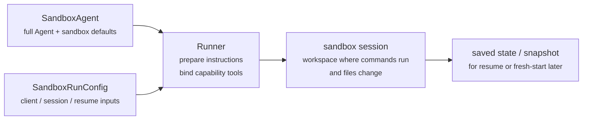
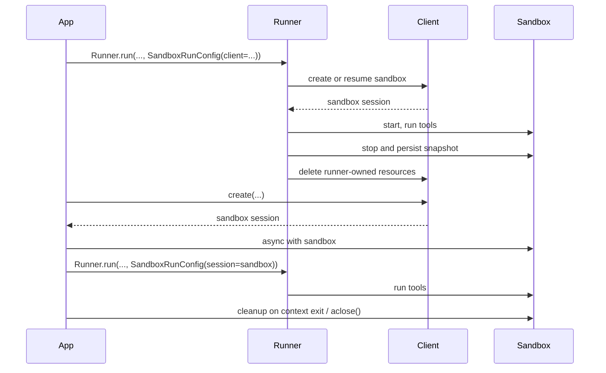

---
search:
  exclude: true
---
# 概念

!!! warning "Beta 功能"

    沙盒智能体目前处于 beta 阶段。在正式可用之前，API 的细节、默认值和受支持的能力可能会发生变化，并且后续会逐步提供更高级的功能。

现代智能体在能够操作文件系统中的真实文件时效果最佳。**沙盒智能体**可以使用专门的工具和 shell 命令来搜索和处理大型文档集、编辑文件、生成工件以及运行命令。沙盒为模型提供一个持久化工作区，智能体可以使用它代你完成工作。Agents SDK 中的沙盒智能体可帮助你轻松运行与沙盒环境配对的智能体，使你能够方便地将正确的文件放到文件系统中，并编排这些沙盒，从而便于大规模启动、停止和恢复任务。

你围绕智能体所需的数据来定义工作区。它可以从 GitHub 仓库、本地文件和目录、合成任务文件、S3 或 Azure Blob Storage 等远程文件系统，以及你提供的其他沙盒输入开始。

<div class="sandbox-harness-image" markdown="1">


</div>

`SandboxAgent` 仍然是一个 `Agent`。它保留了常规智能体接口，例如 `instructions`、`prompt`、`tools`、`handoffs`、`mcp_servers`、`model_settings`、`output_type`、安全防护措施以及钩子，并且仍然通过普通的 `Runner` API 运行。变化的是执行边界：

- `SandboxAgent` 定义智能体本身：常规智能体配置，加上特定于沙盒的默认值，如 `default_manifest`、`base_instructions`、`run_as`，以及文件系统工具、shell 访问、技能、记忆或压缩等能力。
- `Manifest` 声明全新沙盒工作区期望的初始内容和布局，包括文件、仓库、挂载和环境。
- 沙盒会话是命令运行和文件变化所在的实时隔离环境。
- [`SandboxRunConfig`][agents.run_config.SandboxRunConfig] 决定本次运行如何获得该沙盒会话，例如直接注入一个会话、从序列化的沙盒会话状态重新连接，或通过沙盒客户端创建一个新的沙盒会话。
- 已保存的沙盒状态和快照让后续运行能够重新连接到先前的工作，或用已保存的内容为新的沙盒会话提供初始数据。

`Manifest` 是新会话工作区契约，而不是每个实时沙盒的完整事实来源。某次运行的实际工作区也可以来自复用的沙盒会话、序列化的沙盒会话状态，或运行时选择的快照。

在本页中，“沙盒会话”指由沙盒客户端管理的实时执行环境。它不同于 [Sessions](../sessions/index.md) 中描述的 SDK 会话式 [`Session`][agents.memory.session.Session] 接口。

外层运行时仍然负责审批、追踪、任务转移和恢复所需记录。沙盒会话负责命令、文件变更和环境隔离。这种分离是该模型的核心组成部分。

### 组成部分的关系

沙盒运行会将智能体定义与每次运行的沙盒配置结合起来。运行器会准备智能体，将其绑定到实时沙盒会话，并可保存状态以供后续运行使用。



特定于沙盒的默认值保留在 `SandboxAgent` 上。每次运行的沙盒会话选择保留在 `SandboxRunConfig` 中。

可以把生命周期理解为三个阶段：

1. 使用 `SandboxAgent`、`Manifest` 和能力来定义智能体以及新工作区契约。
2. 通过向 `Runner` 提供一个会注入、恢复或创建沙盒会话的 `SandboxRunConfig` 来执行运行。
3. 后续从运行器管理的 `RunState`、显式沙盒 `session_state`，或已保存的工作区快照继续。

如果 shell 访问只是偶尔使用的一个工具，请从[工具指南](../tools.md)中的托管 shell 开始。当工作区隔离、沙盒客户端选择，或沙盒会话恢复行为属于设计的一部分时，再使用沙盒智能体。

## 适用场景

沙盒智能体非常适合以工作区为中心的工作流，例如：

- 编码和调试，例如在 GitHub 仓库中为问题报告编排自动修复并运行针对性测试
- 文档处理和编辑，例如从用户的财务文档中提取信息，并创建填写完成的税务表单草稿
- 基于文件的审阅或分析，例如在回答之前检查入职材料包、生成的报告或工件包
- 隔离的多智能体模式，例如为每个审阅者或编码子智能体提供自己的工作区
- 多步骤工作区任务，例如在一次运行中修复 bug，稍后添加回归测试，或从快照或沙盒会话状态恢复

如果你不需要访问文件或实时文件系统，请继续使用 `Agent`。如果 shell 访问只是偶尔使用的一项能力，请添加托管 shell；如果工作区边界本身就是功能的一部分，请使用沙盒智能体。

## 沙盒客户端选择

本地开发时从 `UnixLocalSandboxClient` 开始。当你需要容器隔离或镜像一致性时，迁移到 `DockerSandboxClient`。当你需要由提供商管理的执行环境时，迁移到托管提供商。

在大多数情况下，`SandboxAgent` 定义保持不变，而沙盒客户端及其选项会在 [`SandboxRunConfig`][agents.run_config.SandboxRunConfig] 中变化。有关本地、Docker、托管和远程挂载选项，请参阅[沙盒客户端](clients.md)。

## 核心组成部分

<div class="sandbox-nowrap-first-column-table" markdown="1">

| 层级 | 主要 SDK 组成部分 | 它回答的问题 |
| --- | --- | --- |
| 智能体定义 | `SandboxAgent`、`Manifest`、能力 | 要运行什么智能体，以及它应从什么新会话工作区契约开始？ |
| 沙盒执行 | `SandboxRunConfig`、沙盒客户端和实时沙盒会话 | 本次运行如何获得实时沙盒会话，工作在哪里执行？ |
| 已保存的沙盒状态 | `RunState` 沙盒载荷、`session_state` 和快照 | 此工作流如何重新连接到先前的沙盒工作，或用已保存的内容为新的沙盒会话提供初始数据？ |

</div>

主要 SDK 组成部分与这些层级的对应关系如下：

<div class="sandbox-nowrap-first-column-table" markdown="1">

| 组成部分 | 它负责的内容 | 要问的问题 |
| --- | --- | --- |
| [`SandboxAgent`][agents.sandbox.sandbox_agent.SandboxAgent] | 智能体定义 | 这个智能体应该做什么，哪些默认值应该随它一起使用？ |
| [`Manifest`][agents.sandbox.manifest.Manifest] | 新会话工作区文件和文件夹 | 运行开始时，文件系统中应该有哪些文件和文件夹？ |
| [`Capability`][agents.sandbox.capabilities.capability.Capability] | 沙盒原生行为 | 哪些工具、指令片段或运行时行为应该附加到此智能体？ |
| [`SandboxRunConfig`][agents.run_config.SandboxRunConfig] | 每次运行的沙盒客户端和沙盒会话来源 | 本次运行应该注入、恢复还是创建沙盒会话？ |
| [`RunState`][agents.run_state.RunState] | 运行器管理的已保存沙盒状态 | 我是否正在恢复先前由运行器管理的工作流，并自动携带其沙盒状态继续？ |
| [`SandboxRunConfig.session_state`][agents.run_config.SandboxRunConfig.session_state] | 显式序列化的沙盒会话状态 | 我是否想从已在 `RunState` 之外序列化的沙盒状态恢复？ |
| [`SandboxRunConfig.snapshot`][agents.run_config.SandboxRunConfig.snapshot] | 用于新沙盒会话的已保存工作区内容 | 新沙盒会话是否应该从已保存的文件和工件开始？ |

</div>

一个实用的设计顺序是：

1. 使用 `Manifest` 定义新会话工作区契约。
2. 使用 `SandboxAgent` 定义智能体。
3. 添加内置或自定义能力。
4. 在 `RunConfig(sandbox=SandboxRunConfig(...))` 中决定每次运行应如何获取其沙盒会话。

## 沙盒运行的准备过程

在运行时，运行器会将该定义转换为一个由具体沙盒支持的运行：

1. 它从 `SandboxRunConfig` 解析沙盒会话。如果你传入 `session=...`，它会复用该实时沙盒会话。否则，它会使用 `client=...` 创建或恢复一个会话。
2. 它确定本次运行的实际工作区输入。如果本次运行注入或恢复了沙盒会话，则该现有沙盒状态优先。否则，运行器会从一次性清单覆盖或 `agent.default_manifest` 开始。这就是为什么仅凭 `Manifest` 并不能定义每次运行的最终实时工作区。
3. 它让能力处理生成的清单。这使能力可以在最终智能体准备完成之前，添加文件、挂载或其他工作区范围内的行为。
4. 它按固定顺序构建最终指令：SDK 默认沙盒提示词，或在你显式覆盖时使用 `base_instructions`，然后是 `instructions`，再是能力指令片段，然后是任何远程挂载策略文本，最后是渲染后的文件系统树。
5. 它将能力工具绑定到实时沙盒会话，并通过普通的 `Runner` API 运行准备好的智能体。

沙盒化不会改变轮次的含义。轮次仍然是一个模型步骤，而不是单个 shell 命令或沙盒动作。沙盒侧操作与轮次之间没有固定的 1:1 映射：有些工作可能停留在沙盒执行层内部，而其他动作会返回工具结果、审批或其他需要另一个模型步骤的状态。作为实用规则，只有当智能体运行时在沙盒工作发生后需要另一个模型响应时，才会消耗另一个轮次。

这些准备步骤说明了为什么在设计 `SandboxAgent` 时，`default_manifest`、`instructions`、`base_instructions`、`capabilities` 和 `run_as` 是需要重点考虑的主要沙盒特定选项。

## `SandboxAgent` 选项

这些是在常规 `Agent` 字段之上的沙盒特定选项：

<div class="sandbox-nowrap-first-column-table" markdown="1">

| 选项 | 最佳用途 |
| --- | --- |
| `default_manifest` | 运行器创建的新沙盒会话的默认工作区。 |
| `instructions` | 追加在 SDK 沙盒提示词之后的额外角色、工作流和成功标准。 |
| `base_instructions` | 替换 SDK 沙盒提示词的高级逃生舱。 |
| `capabilities` | 应随此智能体一起使用的沙盒原生工具和行为。 |
| `run_as` | 面向模型的沙盒工具（例如 shell 命令、文件读取和补丁）的用户身份。 |

</div>

沙盒客户端选择、沙盒会话复用、清单覆盖和快照选择应放在 [`SandboxRunConfig`][agents.run_config.SandboxRunConfig] 中，而不是放在智能体上。

### `default_manifest`

`default_manifest` 是运行器为该智能体创建新沙盒会话时使用的默认 [`Manifest`][agents.sandbox.manifest.Manifest]。将它用于智能体通常应开始使用的文件、仓库、辅助材料、输出目录和挂载。

这只是默认值。某次运行可以通过 `SandboxRunConfig(manifest=...)` 覆盖它，并且复用或恢复的沙盒会话会保留其现有工作区状态。

### `instructions` 和 `base_instructions`

将 `instructions` 用于应在不同提示词中保持稳定的简短规则。在 `SandboxAgent` 中，这些指令会追加在 SDK 沙盒基础提示词之后，因此你可以保留内置沙盒指导，并添加自己的角色、工作流和成功标准。

仅当你想替换 SDK 沙盒基础提示词时，才使用 `base_instructions`。大多数智能体不应设置它。

<div class="sandbox-nowrap-first-column-table" markdown="1">

| 放在... | 用途 | 示例 |
| --- | --- | --- |
| `instructions` | 智能体的稳定角色、工作流规则和成功标准。 | "Inspect onboarding documents, then hand off.", "Write final files into `output/`." |
| `base_instructions` | 对 SDK 沙盒基础提示词的完整替换。 | 自定义低级沙盒包装提示词。 |
| 用户提示词 | 本次运行的一次性请求。 | "Summarize this workspace." |
| 清单中的工作区文件 | 更长的任务规范、仓库本地指令，或有界参考材料。 | `repo/task.md`、文档包、示例材料包。 |

</div>

`instructions` 的良好用途包括：

- [examples/sandbox/unix_local_pty.py](https://github.com/openai/openai-agents-python/blob/main/examples/sandbox/unix_local_pty.py) 在 PTY 状态重要时，让智能体保持在一个交互式进程中。
- [examples/sandbox/handoffs.py](https://github.com/openai/openai-agents-python/blob/main/examples/sandbox/handoffs.py) 禁止沙盒审阅者在检查后直接回答用户。
- [examples/sandbox/tax_prep.py](https://github.com/openai/openai-agents-python/blob/main/examples/sandbox/tax_prep.py) 要求最终填写完成的文件实际落在 `output/` 中。
- [examples/sandbox/docs/coding_task.py](https://github.com/openai/openai-agents-python/blob/main/examples/sandbox/docs/coding_task.py) 固定确切的验证命令，并明确相对于工作区根目录的补丁路径。

避免将用户的一次性任务复制到 `instructions` 中，避免嵌入本应放入清单的长参考材料，避免重述内置能力已经注入的工具文档，也避免混入模型在运行时不需要的本地安装说明。

如果省略 `instructions`，SDK 仍会包含默认沙盒提示词。对于低级包装器来说这已经足够，但大多数面向用户的智能体仍应提供显式的 `instructions`。

### `capabilities`

能力会将沙盒原生行为附加到 `SandboxAgent`。它们可以在运行开始前塑造工作区，追加沙盒特定指令，公开绑定到实时沙盒会话的工具，并调整该智能体的模型行为或输入处理。

内置能力包括：

<div class="sandbox-nowrap-first-column-table" markdown="1">

| 能力 | 添加时机 | 备注 |
| --- | --- | --- |
| `Shell` | 智能体需要 shell 访问。 | 添加 `exec_command`；当沙盒客户端支持 PTY 交互时，还会添加 `write_stdin`。 |
| `Filesystem` | 智能体需要编辑文件或查看本地图像。 | 添加 `apply_patch` 和 `view_image`；补丁路径相对于工作区根目录。 |
| `Skills` | 你需要在沙盒中进行技能发现和物化。 | 优先使用它，而不是手动挂载 `.agents` 或 `.agents/skills`；`Skills` 会为你将技能索引并物化到沙盒中。 |
| `Memory` | 后续运行应读取或生成记忆工件。 | 需要 `Shell`；实时更新还需要 `Filesystem`。 |
| `Compaction` | 长时间运行的流程需要在压缩项之后裁剪上下文。 | 调整模型采样和输入处理。 |

</div>

默认情况下，`SandboxAgent.capabilities` 使用 `Capabilities.default()`，其中包括 `Filesystem()`、`Shell()` 和 `Compaction()`。如果你传入 `capabilities=[...]`，该列表会替换默认值，因此请包含你仍然需要的任何默认能力。

对于技能，请根据希望如何物化它们来选择来源：

- `Skills(lazy_from=LocalDirLazySkillSource(...))` 是较大的本地技能目录的良好默认选择，因为模型可以先发现索引，并只加载所需内容。
- `LocalDirLazySkillSource(source=LocalDir(src=...))` 从 SDK 进程运行所在的文件系统读取。请传入原始主机侧技能目录，而不是只存在于沙盒镜像或工作区内部的路径。
- `Skills(from_=LocalDir(src=...))` 更适合你希望预先暂存的小型本地包。
- `Skills(from_=GitRepo(repo=..., ref=...))` 适合技能本身应来自某个仓库的情况。

`LocalDir.src` 是 SDK 主机上的源路径。`skills_path` 是沙盒工作区内的相对目标路径，当调用 `load_skill` 时，技能会被暂存到该路径。

如果你的技能已经以类似 `.agents/skills/<name>/SKILL.md` 的形式存在于磁盘上，请将 `LocalDir(...)` 指向该源根目录，并仍然使用 `Skills(...)` 来公开它们。除非你已有的工作区契约依赖不同的沙盒内布局，否则请保留默认的 `skills_path=".agents"`。

当内置能力适用时，请优先使用它们。只有当你需要内置能力未覆盖的沙盒特定工具或指令接口时，才编写自定义能力。

## 概念

### Manifest

[`Manifest`][agents.sandbox.manifest.Manifest] 描述新沙盒会话的工作区。它可以设置工作区 `root`，声明文件和目录，复制本地文件，克隆 Git 仓库，附加远程存储挂载，设置环境变量，定义用户或组，并授予对工作区外特定绝对路径的访问权限。

清单条目路径是相对于工作区的。它们不能是绝对路径，也不能用 `..` 逃出工作区，这使工作区契约能够在本地、Docker 和托管客户端之间保持可移植。

将清单条目用于智能体开始工作前所需的材料：

<div class="sandbox-nowrap-first-column-table" markdown="1">

| 清单条目 | 用途 |
| --- | --- |
| `File`、`Dir` | 小型合成输入、辅助文件或输出目录。 |
| `LocalFile`、`LocalDir` | 应物化到沙盒中的主机文件或目录。 |
| `GitRepo` | 应获取到工作区中的仓库。 |
| `S3Mount`、`GCSMount`、`R2Mount`、`AzureBlobMount`、`BoxMount`、`S3FilesMount` 等挂载 | 应出现在沙盒内部的外部存储。 |

</div>

`Dir` 会从合成子项创建沙盒工作区内的目录，或将其作为输出位置；它不会从主机文件系统读取。当需要将现有主机目录复制到沙盒工作区中时，请使用 `LocalDir`。

默认情况下，`LocalFile.src` 和 `LocalDir.src` 会相对于 SDK 进程的工作目录解析。除非源路径由 `extra_path_grants` 覆盖，否则它必须位于该基目录之下。这会将本地源物化限制在与沙盒清单其余部分相同的主机路径信任边界内。

挂载条目描述要公开什么存储；挂载策略描述沙盒后端如何附加该存储。有关挂载选项和提供商支持，请参阅[沙盒客户端](clients.md#mounts-and-remote-storage)。

良好的清单设计通常意味着保持工作区契约狭窄，将较长的任务流程说明放入工作区文件（例如 `repo/task.md`），并在指令中使用相对工作区路径，例如 `repo/task.md` 或 `output/report.md`。如果智能体使用 `Filesystem` 能力的 `apply_patch` 工具编辑文件，请记住补丁路径是相对于沙盒工作区根目录的，而不是相对于 shell 的 `workdir`。

仅当智能体需要工作区外的具体绝对路径，或清单需要复制 SDK 进程工作目录外的可信本地源时，才使用 `extra_path_grants`。示例包括用于临时工具输出的 `/tmp`、用于只读运行时的 `/opt/toolchain`，或应物化到沙盒中的生成技能目录。授权适用于本地源物化、SDK 文件 API，以及后端能够执行文件系统策略时的 shell 执行：

```python
from agents.sandbox import Manifest, SandboxPathGrant

manifest = Manifest(
    extra_path_grants=(
        SandboxPathGrant(path="/tmp"),
        SandboxPathGrant(path="/opt/toolchain", read_only=True),
    ),
)
```

将包含 `extra_path_grants` 的清单视为可信配置。除非你的应用已经批准这些主机路径，否则不要从模型输出或其他不可信载荷中加载授权。

快照和 `persist_workspace()` 仍然只包含工作区根目录。额外授权路径是运行时访问，而不是持久化工作区状态。

### 权限

`Permissions` 控制清单条目的文件系统权限。它关注的是沙盒物化的文件，而不是模型权限、审批策略或 API 凭证。

默认情况下，清单条目对所有者可读/可写/可执行，对组和其他用户可读/可执行。当暂存文件应为私有、只读或可执行时，请覆盖此设置：

```python
from agents.sandbox import FileMode, Permissions
from agents.sandbox.entries import File

private_notes = File(
    content=b"internal notes",
    permissions=Permissions(
        owner=FileMode.READ | FileMode.WRITE,
        group=FileMode.NONE,
        other=FileMode.NONE,
    ),
)
```

`Permissions` 分别存储所有者、组和其他用户的权限位，以及该条目是否为目录。你可以直接构建它，使用 `Permissions.from_str(...)` 从模式字符串解析它，或使用 `Permissions.from_mode(...)` 从 OS 模式派生它。

用户是能够在沙盒中执行工作的沙盒身份。当你希望该身份存在于沙盒中时，请向清单添加一个 `User`；然后，当面向模型的沙盒工具（例如 shell 命令、文件读取和补丁）应以该用户身份运行时，设置 `SandboxAgent.run_as`。如果 `run_as` 指向清单中尚不存在的用户，运行器会将其添加到有效清单中。

```python
from agents import Runner
from agents.run import RunConfig
from agents.sandbox import FileMode, Manifest, Permissions, SandboxAgent, SandboxRunConfig, User
from agents.sandbox.entries import Dir, LocalDir
from agents.sandbox.sandboxes.unix_local import UnixLocalSandboxClient

analyst = User(name="analyst")

agent = SandboxAgent(
    name="Dataroom analyst",
    instructions="Review the files in `dataroom/` and write findings to `output/`.",
    default_manifest=Manifest(
        # Declare the sandbox user so manifest entries can grant access to it.
        users=[analyst],
        entries={
            "dataroom": LocalDir(
                src="./dataroom",
                # Let the analyst traverse and read the mounted dataroom, but not edit it.
                group=analyst,
                permissions=Permissions(
                    owner=FileMode.READ | FileMode.EXEC,
                    group=FileMode.READ | FileMode.EXEC,
                    other=FileMode.NONE,
                ),
            ),
            "output": Dir(
                # Give the analyst a writable scratch/output directory for artifacts.
                group=analyst,
                permissions=Permissions(
                    owner=FileMode.ALL,
                    group=FileMode.ALL,
                    other=FileMode.NONE,
                ),
            ),
        },
    ),
    # Run model-facing sandbox actions as this user, so those permissions apply.
    run_as=analyst,
)

result = await Runner.run(
    agent,
    "Summarize the contracts and call out renewal dates.",
    run_config=RunConfig(
        sandbox=SandboxRunConfig(client=UnixLocalSandboxClient()),
    ),
)
```

如果你还需要文件级共享规则，请将用户与清单组和条目 `group` 元数据结合使用。`run_as` 用户控制谁执行沙盒原生动作；`Permissions` 控制沙盒物化工作区后，该用户可以读取、写入或执行哪些文件。

### SnapshotSpec

`SnapshotSpec` 告诉新的沙盒会话应从何处恢复已保存的工作区内容，以及应将其持久化回何处。它是沙盒工作区的快照策略，而 `session_state` 是用于恢复特定沙盒后端的序列化连接状态。

使用 `LocalSnapshotSpec` 进行本地持久快照；当你的应用提供远程快照客户端时，使用 `RemoteSnapshotSpec`。当本地快照设置不可用时，会使用空操作快照作为回退；当高级调用方不希望进行工作区快照持久化时，也可以显式使用空操作快照。

```python
from pathlib import Path

from agents.run import RunConfig
from agents.sandbox import LocalSnapshotSpec, SandboxRunConfig
from agents.sandbox.sandboxes.unix_local import UnixLocalSandboxClient

run_config = RunConfig(
    sandbox=SandboxRunConfig(
        client=UnixLocalSandboxClient(),
        snapshot=LocalSnapshotSpec(base_path=Path("/tmp/my-sandbox-snapshots")),
    )
)
```

当运行器创建新的沙盒会话时，沙盒客户端会为该会话构建一个快照实例。启动时，如果快照可恢复，沙盒会在运行继续之前恢复已保存的工作区内容。清理时，运行器拥有的沙盒会话会归档工作区，并通过快照将其持久化回去。

如果省略 `snapshot`，运行时会在可行时尝试使用默认本地快照位置。如果无法设置，它会回退到空操作快照。挂载路径和临时路径不会作为持久化工作区内容复制到快照中。

### 沙盒生命周期

有两种生命周期模式：**SDK 管理**和**开发者管理**。

<div class="sandbox-lifecycle-diagram" markdown="1">



</div>

当沙盒只需要为一次运行而存在时，请使用 SDK 管理的生命周期。传入 `client`、可选的 `manifest`、可选的 `snapshot` 和客户端 `options`；运行器会创建或恢复沙盒，启动它，运行智能体，持久化由快照支持的工作区状态，关闭沙盒，并让客户端清理运行器拥有的资源。

```python
result = await Runner.run(
    agent,
    "Inspect the workspace and summarize what changed.",
    run_config=RunConfig(
        sandbox=SandboxRunConfig(client=UnixLocalSandboxClient()),
    ),
)
```

当你想提前创建沙盒、在多次运行之间复用一个实时沙盒、在运行后检查文件、在你自己创建的沙盒上进行流式传输，或精确决定何时清理时，请使用开发者管理的生命周期。传入 `session=...` 会告诉运行器使用该实时沙盒，但不会替你关闭它。

```python
sandbox = await client.create(manifest=agent.default_manifest)

async with sandbox:
    run_config = RunConfig(sandbox=SandboxRunConfig(session=sandbox))
    await Runner.run(agent, "Analyze the files.", run_config=run_config)
    await Runner.run(agent, "Write the final report.", run_config=run_config)
```

上下文管理器是常见形式：进入时启动沙盒，退出时运行会话清理生命周期。如果你的应用无法使用上下文管理器，请直接调用生命周期方法：

```python
sandbox = await client.create(
    manifest=agent.default_manifest,
    snapshot=LocalSnapshotSpec(base_path=Path("/tmp/my-sandbox-snapshots")),
)
try:
    await sandbox.start()
    await Runner.run(
        agent,
        "Analyze the files.",
        run_config=RunConfig(sandbox=SandboxRunConfig(session=sandbox)),
    )
    # Persist a checkpoint of the live workspace before doing more work.
    # `aclose()` also calls `stop()`, so this is only needed for an explicit mid-lifecycle save.
    await sandbox.stop()
finally:
    await sandbox.aclose()
```

`stop()` 只会持久化由快照支持的工作区内容；它不会拆除沙盒。`aclose()` 是完整的会话清理路径：它运行停止前钩子，调用 `stop()`，关闭沙盒资源，并关闭会话范围内的依赖项。

## `SandboxRunConfig` 选项

[`SandboxRunConfig`][agents.run_config.SandboxRunConfig] 保存每次运行的选项，这些选项决定沙盒会话来自哪里，以及新会话应如何初始化。

### 沙盒来源

这些选项决定运行器应复用、恢复还是创建沙盒会话：

<div class="sandbox-nowrap-first-column-table" markdown="1">

| 选项 | 使用时机 | 备注 |
| --- | --- | --- |
| `client` | 你希望运行器为你创建、恢复和清理沙盒会话。 | 除非你提供实时沙盒 `session`，否则必需。 |
| `session` | 你已经自己创建了实时沙盒会话。 | 调用方拥有生命周期；运行器复用该实时沙盒会话。 |
| `session_state` | 你有序列化的沙盒会话状态，但没有实时沙盒会话对象。 | 需要 `client`；运行器从该显式状态恢复为一个拥有生命周期的会话。 |

</div>

实践中，运行器按以下顺序解析沙盒会话：

1. 如果你注入 `run_config.sandbox.session`，则直接复用该实时沙盒会话。
2. 否则，如果本次运行是从 `RunState` 恢复，则恢复已存储的沙盒会话状态。
3. 否则，如果你传入 `run_config.sandbox.session_state`，运行器会从该显式序列化的沙盒会话状态恢复。
4. 否则，运行器会创建一个新的沙盒会话。对于该新会话，如果提供了 `run_config.sandbox.manifest`，则使用它；否则使用 `agent.default_manifest`。

### 新会话输入

这些选项仅在运行器创建新的沙盒会话时才有意义：

<div class="sandbox-nowrap-first-column-table" markdown="1">

| 选项 | 使用时机 | 备注 |
| --- | --- | --- |
| `manifest` | 你想要一次性的新会话工作区覆盖。 | 省略时回退到 `agent.default_manifest`。 |
| `snapshot` | 新沙盒会话应从快照初始化。 | 对类似恢复的流程或远程快照客户端很有用。 |
| `options` | 沙盒客户端需要创建时选项。 | 常用于 Docker 镜像、Modal 应用名称、E2B 模板、超时以及类似的客户端特定设置。 |

</div>

### 物化控制

`concurrency_limits` 控制可以并行运行多少沙盒物化工作。当大型清单或本地目录复制需要更严格的资源控制时，请使用 `SandboxConcurrencyLimits(manifest_entries=..., local_dir_files=...)`。将任一值设为 `None` 可禁用该特定限制。

`archive_limits` 控制归档解压的 SDK 侧资源检查。设置 `archive_limits=SandboxArchiveLimits()` 可启用 SDK 默认阈值；当归档需要更严格的资源控制时，也可以传入显式值，例如 `SandboxArchiveLimits(max_input_bytes=..., max_extracted_bytes=..., max_members=...)`。保留 `archive_limits=None` 可保持默认行为，即没有 SDK 归档资源限制；也可以将单个字段设为 `None`，只禁用该限制。

需要牢记的一些影响：

- 新会话：`manifest=` 和 `snapshot=` 仅在运行器创建新的沙盒会话时适用。
- 恢复与快照：`session_state=` 会重新连接到先前序列化的沙盒状态，而 `snapshot=` 会用已保存的工作区内容为新的沙盒会话提供初始数据。
- 客户端特定选项：`options=` 取决于沙盒客户端；Docker 和许多托管客户端都需要它。
- 注入的实时会话：如果你传入一个正在运行的沙盒 `session`，由能力驱动的清单更新可以添加兼容的非挂载条目。它们不能更改 `manifest.root`、`manifest.environment`、`manifest.users` 或 `manifest.groups`；不能移除现有条目；不能替换条目类型；也不能添加或更改挂载条目。
- 运行器 API：`SandboxAgent` 执行仍使用普通的 `Runner.run()`、`Runner.run_sync()` 和 `Runner.run_streamed()` API。

## 完整示例：编码任务

这个编码类示例是一个很好的默认起点：

```python
import asyncio
from pathlib import Path

from agents import ModelSettings, Runner
from agents.run import RunConfig
from agents.sandbox import Manifest, SandboxAgent, SandboxRunConfig
from agents.sandbox.capabilities import (
    Capabilities,
    LocalDirLazySkillSource,
    Skills,
)
from agents.sandbox.entries import LocalDir
from agents.sandbox.sandboxes.unix_local import UnixLocalSandboxClient

EXAMPLE_DIR = Path(__file__).resolve().parent
HOST_REPO_DIR = EXAMPLE_DIR / "repo"
HOST_SKILLS_DIR = EXAMPLE_DIR / "skills"
TARGET_TEST_CMD = "sh tests/test_credit_note.sh"


def build_agent(model: str) -> SandboxAgent[None]:
    return SandboxAgent(
        name="Sandbox engineer",
        model=model,
        instructions=(
            "Inspect the repo, make the smallest correct change, run the most relevant checks, "
            "and summarize the file changes and risks. "
            "Read `repo/task.md` before editing files. Stay grounded in the repository, preserve "
            "existing behavior, and mention the exact verification command you ran. "
            "Use the `$credit-note-fixer` skill before editing files. If the repo lives under "
            "`repo/`, remember that `apply_patch` paths stay relative to the sandbox workspace "
            "root, so edits still target `repo/...`."
        ),
        # Put repos and task files in the manifest.
        default_manifest=Manifest(
            entries={
                "repo": LocalDir(src=HOST_REPO_DIR),
            }
        ),
        capabilities=Capabilities.default() + [
            Skills(
                lazy_from=LocalDirLazySkillSource(
                    # This is a host path read by the SDK process.
                    # Requested skills are copied into `skills_path` in the sandbox.
                    source=LocalDir(src=HOST_SKILLS_DIR),
                )
            ),
        ],
        model_settings=ModelSettings(tool_choice="required"),
    )


async def main(model: str, prompt: str) -> None:
    result = await Runner.run(
        build_agent(model),
        prompt,
        run_config=RunConfig(
            sandbox=SandboxRunConfig(client=UnixLocalSandboxClient()),
            workflow_name="Sandbox coding example",
        ),
    )
    print(result.final_output)


if __name__ == "__main__":
    asyncio.run(
        main(
            model="gpt-5.5",
            prompt=(
                "Open `repo/task.md`, use the `$credit-note-fixer` skill, fix the bug, "
                f"run `{TARGET_TEST_CMD}`, and summarize the change."
            ),
        )
    )
```

参阅 [examples/sandbox/docs/coding_task.py](https://github.com/openai/openai-agents-python/blob/main/examples/sandbox/docs/coding_task.py)。它使用一个基于 shell 的小型仓库，因此该示例可以在 Unix 本地运行中以确定性方式验证。你的真实任务仓库当然可以是 Python、JavaScript 或任何其他内容。

## 常见模式

从上面的完整示例开始。在许多情况下，同一个 `SandboxAgent` 可以保持不变，只改变沙盒客户端、沙盒会话来源或工作区来源。

### 沙盒客户端切换

保持智能体定义不变，只更改运行配置。当你需要容器隔离或镜像一致性时使用 Docker；当你希望由提供商管理执行环境时使用托管提供商。有关示例和提供商选项，请参阅[沙盒客户端](clients.md)。

### 工作区覆盖

保持智能体定义不变，只替换新会话清单：

```python
from agents.run import RunConfig
from agents.sandbox import Manifest, SandboxRunConfig
from agents.sandbox.entries import GitRepo
from agents.sandbox.sandboxes.unix_local import UnixLocalSandboxClient

run_config = RunConfig(
    sandbox=SandboxRunConfig(
        client=UnixLocalSandboxClient(),
        manifest=Manifest(
            entries={
                "repo": GitRepo(repo="openai/openai-agents-python", ref="main"),
            }
        ),
    ),
)
```

当同一个智能体角色需要针对不同仓库、材料包或任务包运行，而无需重建智能体时，请使用此模式。上面已验证的编码示例展示了相同模式，只是使用 `default_manifest` 而不是一次性覆盖。

### 沙盒会话注入

当你需要显式生命周期控制、运行后检查或输出复制时，请注入实时沙盒会话：

```python
from agents import Runner
from agents.run import RunConfig
from agents.sandbox import SandboxRunConfig
from agents.sandbox.sandboxes.unix_local import UnixLocalSandboxClient

client = UnixLocalSandboxClient()
sandbox = await client.create(manifest=agent.default_manifest)

async with sandbox:
    result = await Runner.run(
        agent,
        prompt,
        run_config=RunConfig(
            sandbox=SandboxRunConfig(session=sandbox),
        ),
    )
```

当你想在运行后检查工作区，或在已经启动的沙盒会话上进行流式传输时，请使用此模式。参阅 [examples/sandbox/docs/coding_task.py](https://github.com/openai/openai-agents-python/blob/main/examples/sandbox/docs/coding_task.py) 和 [examples/sandbox/docker/docker_runner.py](https://github.com/openai/openai-agents-python/blob/main/examples/sandbox/docker/docker_runner.py)。

### 基于会话状态的恢复

如果你已经在 `RunState` 之外序列化了沙盒状态，请让运行器从该状态重新连接：

```python
from agents.run import RunConfig
from agents.sandbox import SandboxRunConfig

serialized = load_saved_payload()
restored_state = client.deserialize_session_state(serialized)

run_config = RunConfig(
    sandbox=SandboxRunConfig(
        client=client,
        session_state=restored_state,
    ),
)
```

当沙盒状态位于你自己的存储或作业系统中，并且你希望 `Runner` 直接从中恢复时，请使用此模式。有关序列化/反序列化流程，请参阅 [examples/sandbox/extensions/blaxel_runner.py](https://github.com/openai/openai-agents-python/blob/main/examples/sandbox/extensions/blaxel_runner.py)。

### 基于快照的启动

用已保存的文件和工件为新沙盒提供初始数据：

```python
from pathlib import Path

from agents.run import RunConfig
from agents.sandbox import LocalSnapshotSpec, SandboxRunConfig
from agents.sandbox.sandboxes.unix_local import UnixLocalSandboxClient

run_config = RunConfig(
    sandbox=SandboxRunConfig(
        client=UnixLocalSandboxClient(),
        snapshot=LocalSnapshotSpec(base_path=Path("/tmp/my-sandbox-snapshot")),
    ),
)
```

当新的运行应从已保存的工作区内容开始，而不仅仅是从 `agent.default_manifest` 开始时，请使用此模式。有关本地快照流程，请参阅 [examples/sandbox/memory.py](https://github.com/openai/openai-agents-python/blob/main/examples/sandbox/memory.py)；有关远程快照客户端，请参阅 [examples/sandbox/sandbox_agent_with_remote_snapshot.py](https://github.com/openai/openai-agents-python/blob/main/examples/sandbox/sandbox_agent_with_remote_snapshot.py)。

### 从 Git 加载技能

将本地技能源替换为由仓库支持的技能源：

```python
from agents.sandbox.capabilities import Capabilities, Skills
from agents.sandbox.entries import GitRepo

capabilities = Capabilities.default() + [
    Skills(from_=GitRepo(repo="sdcoffey/tax-prep-skills", ref="main")),
]
```

当技能包有自己的发布节奏，或应在多个沙盒之间共享时，请使用此模式。参阅 [examples/sandbox/tax_prep.py](https://github.com/openai/openai-agents-python/blob/main/examples/sandbox/tax_prep.py)。

### 工具暴露

工具型智能体可以获得自己的沙盒边界，也可以复用父运行中的实时沙盒。复用对快速只读探索智能体很有用：它可以检查父智能体正在使用的确切工作区，而无需为创建、填充或快照另一个沙盒付出开销。

```python
from agents import Runner
from agents.run import RunConfig
from agents.sandbox import FileMode, Manifest, Permissions, SandboxAgent, SandboxRunConfig, User
from agents.sandbox.entries import Dir, File
from agents.sandbox.sandboxes.unix_local import UnixLocalSandboxClient

coordinator = User(name="coordinator")
explorer = User(name="explorer")

manifest = Manifest(
    users=[coordinator, explorer],
    entries={
        "pricing_packet": Dir(
            group=coordinator,
            permissions=Permissions(
                owner=FileMode.ALL,
                group=FileMode.ALL,
                other=FileMode.READ | FileMode.EXEC,
                directory=True,
            ),
            children={
                "pricing.md": File(
                    content=b"Pricing packet contents...",
                    group=coordinator,
                    permissions=Permissions(
                        owner=FileMode.ALL,
                        group=FileMode.ALL,
                        other=FileMode.READ,
                    ),
                ),
            },
        ),
        "work": Dir(
            group=coordinator,
            permissions=Permissions(
                owner=FileMode.ALL,
                group=FileMode.ALL,
                other=FileMode.NONE,
                directory=True,
            ),
        ),
    },
)

pricing_explorer = SandboxAgent(
    name="Pricing Explorer",
    instructions="Read `pricing_packet/` and summarize commercial risk. Do not edit files.",
    run_as=explorer,
)

client = UnixLocalSandboxClient()
sandbox = await client.create(manifest=manifest)

async with sandbox:
    shared_run_config = RunConfig(
        sandbox=SandboxRunConfig(session=sandbox),
    )

    orchestrator = SandboxAgent(
        name="Revenue Operations Coordinator",
        instructions="Coordinate the review and write final notes to `work/`.",
        run_as=coordinator,
        tools=[
            pricing_explorer.as_tool(
                tool_name="review_pricing_packet",
                tool_description="Inspect the pricing packet and summarize commercial risk.",
                run_config=shared_run_config,
                max_turns=2,
            ),
        ],
    )

    result = await Runner.run(
        orchestrator,
        "Review the pricing packet, then write final notes to `work/summary.md`.",
        run_config=shared_run_config,
    )
```

这里，父智能体以 `coordinator` 身份运行，而探索器工具智能体以 `explorer` 身份在同一个实时沙盒会话中运行。`pricing_packet/` 条目对 `other` 用户可读，因此探索器可以快速检查它们，但没有写权限位。`work/` 目录仅对协调者的用户/组可用，因此父智能体可以写入最终工件，而探索器保持只读。

当工具型智能体需要真正隔离时，请为它提供自己的沙盒 `RunConfig`：

```python
from docker import from_env as docker_from_env

from agents.run import RunConfig
from agents.sandbox import SandboxAgent, SandboxRunConfig
from agents.sandbox.sandboxes.docker import DockerSandboxClient, DockerSandboxClientOptions

rollout_agent = SandboxAgent(
    name="Rollout Reviewer",
    instructions="Inspect the rollout packet and summarize implementation risk.",
)

rollout_agent.as_tool(
    tool_name="review_rollout_risk",
    tool_description="Inspect the rollout packet and summarize implementation risk.",
    run_config=RunConfig(
        sandbox=SandboxRunConfig(
            client=DockerSandboxClient(docker_from_env()),
            options=DockerSandboxClientOptions(image="python:3.14-slim"),
        ),
    ),
)
```

当工具型智能体应自由修改、运行不可信命令，或使用不同后端/镜像时，请使用单独的沙盒。参阅 [examples/sandbox/sandbox_agents_as_tools.py](https://github.com/openai/openai-agents-python/blob/main/examples/sandbox/sandbox_agents_as_tools.py)。

### 与本地工具和 MCP 的组合

保留沙盒工作区，同时仍在同一智能体上使用普通工具：

```python
from agents.sandbox import SandboxAgent
from agents.sandbox.capabilities import Shell

agent = SandboxAgent(
    name="Workspace reviewer",
    instructions="Inspect the workspace and call host tools when needed.",
    tools=[get_discount_approval_path],
    mcp_servers=[server],
    capabilities=[Shell()],
)
```

当工作区检查只是智能体工作的一部分时，请使用此模式。参阅 [examples/sandbox/sandbox_agent_with_tools.py](https://github.com/openai/openai-agents-python/blob/main/examples/sandbox/sandbox_agent_with_tools.py)。

## 记忆

当未来的沙盒智能体运行应从先前运行中学习时，请使用 `Memory` 能力。记忆不同于 SDK 的会话式 `Session` 记忆：它会将经验提炼为沙盒工作区内的文件，后续运行可以读取这些文件。

有关设置、读取/生成行为、多轮对话和布局隔离，请参阅[智能体记忆](memory.md)。

## 组合模式

当单智能体模式清晰之后，下一个设计问题是沙盒边界在更大系统中应放在哪里。

沙盒智能体仍然可以与 SDK 的其余部分组合：

- [任务转移](../handoffs.md)：将文档密集型工作从非沙盒接收智能体转交给沙盒审阅者。
- [Agents as tools](../tools.md#agents-as-tools)：将多个沙盒智能体公开为工具，通常是在每次 `Agent.as_tool(...)` 调用时传入 `run_config=RunConfig(sandbox=SandboxRunConfig(...))`，以便每个工具获得自己的沙盒边界。
- [MCP](../mcp.md) 和普通工具调用：沙盒能力可以与 `mcp_servers` 和普通 Python 工具共存。
- [运行智能体](../running_agents.md)：沙盒运行仍使用普通的 `Runner` API。

有两种模式尤其常见：

- 非沙盒智能体只在工作流中需要工作区隔离的部分任务转移到沙盒智能体
- 编排器将多个沙盒智能体公开为工具，通常是为每次 `Agent.as_tool(...)` 调用提供单独的沙盒 `RunConfig`，以便每个工具获得自己的隔离工作区

### 轮次与沙盒运行

分别说明任务转移和 agent-as-tool 调用会更容易理解。

使用任务转移时，仍然只有一个顶层运行和一个顶层轮次循环。活跃智能体会变化，但运行不会变成嵌套运行。如果非沙盒接收智能体任务转移到沙盒审阅者，同一运行中的下一次模型调用会为该沙盒智能体准备，并且该沙盒智能体会成为执行下一轮的智能体。换句话说，任务转移会改变同一运行中哪个智能体拥有下一轮。参阅 [examples/sandbox/handoffs.py](https://github.com/openai/openai-agents-python/blob/main/examples/sandbox/handoffs.py)。

使用 `Agent.as_tool(...)` 时，关系不同。外层编排器使用一个外层轮次来决定调用该工具，而该工具调用会为沙盒智能体启动一个嵌套运行。嵌套运行拥有自己的轮次循环、`max_turns`、审批，并且通常有自己的沙盒 `RunConfig`。它可能在一个嵌套轮次中完成，也可能需要多个轮次。从外层编排器的角度看，所有这些工作仍然位于一次工具调用之后，因此嵌套轮次不会增加外层运行的轮次计数器。参阅 [examples/sandbox/sandbox_agents_as_tools.py](https://github.com/openai/openai-agents-python/blob/main/examples/sandbox/sandbox_agents_as_tools.py)。

审批行为遵循同样的分离：

- 使用任务转移时，审批仍保留在同一个顶层运行上，因为沙盒智能体现在是该运行中的活跃智能体
- 使用 `Agent.as_tool(...)` 时，在沙盒工具型智能体内部发起的审批仍会呈现在外层运行上，但它们来自已存储的嵌套运行状态，并在外层运行恢复时恢复嵌套沙盒运行

## 延伸阅读

- [快速入门](../sandbox_agents.md)：运行一个沙盒智能体。
- [沙盒客户端](clients.md)：选择本地、Docker、托管和挂载选项。
- [智能体记忆](memory.md)：保留并复用先前沙盒运行中的经验。
- [examples/sandbox/](https://github.com/openai/openai-agents-python/tree/main/examples/sandbox)：可运行的本地、编码、记忆、任务转移和智能体组合模式。