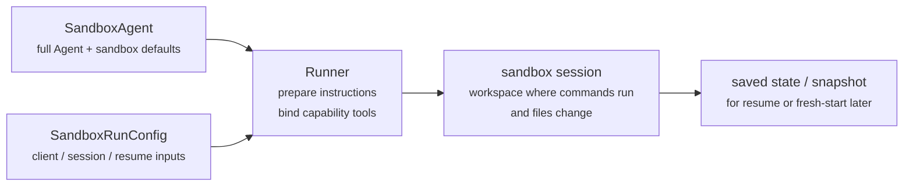
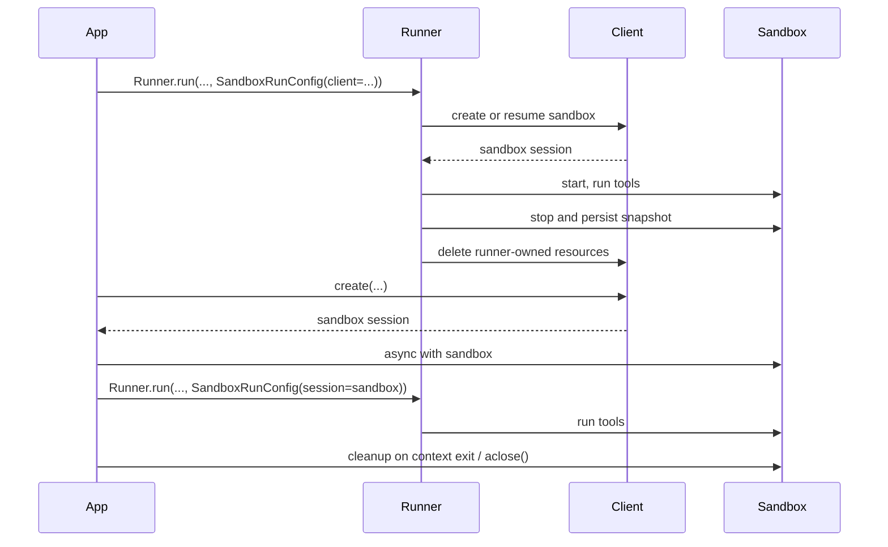

---
search:
  exclude: true
---
# 概念

!!! warning "Beta 功能"

    沙箱智能体目前处于测试阶段。在正式可用之前，API 细节、默认值和支持的能力都可能发生变化，并且后续会逐步提供更高级的功能。

现代智能体在能够对文件系统中的真实文件进行操作时效果最佳。**Sandbox Agents**可以使用专门的工具和 shell 命令来搜索和处理大型文档集、编辑文件、生成产物以及运行命令。沙箱为模型提供了一个持久化工作区，智能体可以利用它代表你完成工作。Agents SDK 中的 Sandbox Agents 可帮助你轻松运行与沙箱环境配对的智能体，使文件进入文件系统、以及对沙箱进行编排以便于大规模启动、停止和恢复任务都变得更加简单。

你可以围绕智能体所需的数据来定义工作区。它可以从 GitHub 仓库、本地文件和目录、合成任务文件、远程文件系统（如 S3 或 Azure Blob Storage）以及你提供的其他沙箱输入开始。

<div class="sandbox-harness-image" markdown="1">


</div>

`SandboxAgent` 仍然是一个 `Agent`。它保留了常见的智能体接口，如 `instructions`、`prompt`、`tools`、`handoffs`、`mcp_servers`、`model_settings`、`output_type`、安全防护措施和 hooks，并且仍通过常规的 `Runner` API 运行。发生变化的是执行边界：

- `SandboxAgent` 定义智能体本身：包括常规的智能体配置，以及诸如 `default_manifest`、`base_instructions`、`run_as` 等沙箱特定默认值，以及文件系统工具、shell 访问、skills、memory 或 compaction 等能力。
- `Manifest` 声明一个全新沙箱工作区所需的初始内容和布局，包括文件、仓库、挂载和环境。
- 沙箱会话是命令运行和文件发生变更的实时隔离环境。
- [`SandboxRunConfig`][agents.run_config.SandboxRunConfig] 决定本次运行如何获取该沙箱会话，例如直接注入现有会话、从序列化的沙箱会话状态重新连接，或通过沙箱客户端创建一个新的沙箱会话。
- 已保存的沙箱状态和快照使后续运行能够重新连接到先前的工作，或从已保存的内容为新的沙箱会话提供初始数据。

`Manifest` 是全新会话工作区的契约，而不是每个实时沙箱的完整事实来源。一次运行的实际工作区也可能来自复用的沙箱会话、序列化的沙箱会话状态，或在运行时选定的快照。

在本页中，“沙箱会话”指由沙箱客户端管理的实时执行环境。它不同于 [Sessions](../sessions/index.md) 中介绍的 SDK 对话式 [`Session`][agents.memory.session.Session] 接口。

外层运行时仍然负责审批、追踪、任务转移以及恢复记账。沙箱会话则负责命令、文件变更和环境隔离。这种划分是该模型的核心部分。

### 组件关系

一次沙箱运行会将一个智能体定义与按次运行的沙箱配置结合起来。runner 会准备智能体，将其绑定到一个实时沙箱会话，并可为后续运行保存状态。



沙箱专属默认值保留在 `SandboxAgent` 上。按次运行的沙箱会话选择则保留在 `SandboxRunConfig` 中。

可以将其生命周期分为三个阶段来理解：

1. 使用 `SandboxAgent`、`Manifest` 和能力来定义智能体与全新工作区契约。
2. 通过向 `Runner` 提供一个 `SandboxRunConfig` 来执行运行，该配置可注入、恢复或创建沙箱会话。
3. 之后通过由 runner 管理的 `RunState`、显式的沙箱 `session_state` 或已保存的工作区快照继续运行。

如果 shell 访问只是偶尔需要的一个工具，请先从[工具指南](../tools.md)中的 hosted shell 开始。如果你的设计中包含工作区隔离、沙箱客户端选择或沙箱会话恢复行为，请使用沙箱智能体。

## 适用场景

沙箱智能体非常适合以工作区为中心的工作流，例如：

- 编码与调试，例如在 GitHub 仓库中编排针对 issue 报告的自动修复并运行定向测试
- 文档处理与编辑，例如从用户的财务文档中提取信息并创建已填写的税表草稿
- 基于文件的审查或分析，例如在回答前检查入职材料、生成的报告或产物包
- 隔离的多智能体模式，例如为每个审阅者或编码子智能体提供独立工作区
- 多步骤工作区任务，例如在一次运行中修复 bug，稍后再添加回归测试，或从快照或沙箱会话状态恢复

如果你不需要访问文件或持续存在的文件系统，请继续使用 `Agent`。如果 shell 访问只是偶发能力，请添加 hosted shell；如果工作区边界本身就是功能设计的一部分，请使用沙箱智能体。

## 沙箱客户端选择

本地开发请从 `UnixLocalSandboxClient` 开始。当你需要容器隔离或镜像一致性时，改用 `DockerSandboxClient`。当你需要由提供方管理执行环境时，改用托管服务提供方。

在大多数情况下，`SandboxAgent` 定义保持不变，变化的是 [`SandboxRunConfig`][agents.run_config.SandboxRunConfig] 中的沙箱客户端及其选项。有关本地、Docker、托管和远程挂载选项，请参见[沙箱客户端](clients.md)。

## 核心组成

<div class="sandbox-nowrap-first-column-table" markdown="1">

| 层级 | 主要 SDK 组件 | 它回答什么问题 |
| --- | --- | --- |
| 智能体定义 | `SandboxAgent`、`Manifest`、能力 | 将运行什么智能体，以及它应从什么样的全新会话工作区契约开始？ |
| 沙箱执行 | `SandboxRunConfig`、沙箱客户端和实时沙箱会话 | 本次运行如何获得一个实时沙箱会话，工作又在何处执行？ |
| 已保存的沙箱状态 | `RunState` 沙箱负载、`session_state` 和快照 | 该工作流如何重新连接到先前的沙箱工作，或用已保存内容为新的沙箱会话提供初始数据？ |

</div>

主要 SDK 组件与这些层级的映射如下：

<div class="sandbox-nowrap-first-column-table" markdown="1">

| 组件 | 它负责什么 | 请问这个问题 |
| --- | --- | --- |
| [`SandboxAgent`][agents.sandbox.sandbox_agent.SandboxAgent] | 智能体定义 | 这个智能体应执行什么任务，以及哪些默认值应随它一起携带？ |
| [`Manifest`][agents.sandbox.manifest.Manifest] | 全新会话工作区的文件和文件夹 | 运行开始时，文件系统中应有哪些文件和文件夹？ |
| [`Capability`][agents.sandbox.capabilities.capability.Capability] | 沙箱原生行为 | 应为这个智能体附加哪些工具、指令片段或运行时行为？ |
| [`SandboxRunConfig`][agents.run_config.SandboxRunConfig] | 按次运行的沙箱客户端和沙箱会话来源 | 本次运行是应注入、恢复还是创建一个沙箱会话？ |
| [`RunState`][agents.run_state.RunState] | 由 runner 管理的已保存沙箱状态 | 我是否正在恢复先前由 runner 管理的工作流，并自动延续其沙箱状态？ |
| [`SandboxRunConfig.session_state`][agents.run_config.SandboxRunConfig.session_state] | 显式序列化的沙箱会话状态 | 我是否希望从已在 `RunState` 外部序列化的沙箱状态恢复？ |
| [`SandboxRunConfig.snapshot`][agents.run_config.SandboxRunConfig.snapshot] | 用于新沙箱会话的已保存工作区内容 | 新的沙箱会话是否应从已保存的文件和产物开始？ |

</div>

一种实用的设计顺序是：

1. 用 `Manifest` 定义全新会话工作区契约。
2. 用 `SandboxAgent` 定义智能体。
3. 添加内置或自定义能力。
4. 在 `RunConfig(sandbox=SandboxRunConfig(...))` 中决定每次运行如何获取其沙箱会话。

## 沙箱运行的准备

在运行时，runner 会将该定义转换为一次具体的沙箱支持运行：

1. 它从 `SandboxRunConfig` 解析沙箱会话。
   如果你传入 `session=...`，它会复用该实时沙箱会话。
   否则它会使用 `client=...` 创建或恢复一个会话。
2. 它确定本次运行的实际工作区输入。
   如果运行是注入或恢复沙箱会话，则现有沙箱状态优先生效。
   否则 runner 会从一次性 manifest 覆盖项或 `agent.default_manifest` 开始。
   这就是为什么单独的 `Manifest` 并不能定义每次运行的最终实时工作区。
3. 它让能力处理生成的 manifest。
   这样能力就可以在最终准备智能体之前添加文件、挂载或其他工作区范围的行为。
4. 它按固定顺序构建最终指令：
   SDK 默认的沙箱提示词，或者你显式覆盖时使用的 `base_instructions`，然后是 `instructions`，然后是能力指令片段，再然后是任何远程挂载策略文本，最后是渲染后的文件系统树。
5. 它将能力工具绑定到实时沙箱会话，并通过常规 `Runner` API 运行已准备好的智能体。

沙箱机制不会改变一个 turn 的含义。turn 仍然是模型的一步，而不是单个 shell 命令或单次沙箱操作。沙箱侧操作与 turn 之间并不存在固定的 1:1 映射：某些工作可能停留在沙箱执行层内，而其他操作则会返回工具结果、审批或其他需要再次进行模型步骤的状态。实际规则是，只有当智能体运行时在沙箱工作发生后还需要另一次模型响应时，才会消耗另一个 turn。

这些准备步骤解释了为什么在设计 `SandboxAgent` 时，`default_manifest`、`instructions`、`base_instructions`、`capabilities` 和 `run_as` 是需要重点考虑的主要沙箱专属选项。

## `SandboxAgent` 选项

这些是在常规 `Agent` 字段之外的沙箱专属选项：

<div class="sandbox-nowrap-first-column-table" markdown="1">

| 选项 | 最佳用途 |
| --- | --- |
| `default_manifest` | 由 runner 创建的新沙箱会话的默认工作区。 |
| `instructions` | 在 SDK 沙箱提示词后附加的额外角色、工作流和成功标准。 |
| `base_instructions` | 用于替换 SDK 沙箱提示词的高级兜底入口。 |
| `capabilities` | 应随该智能体一起携带的沙箱原生工具和行为。 |
| `run_as` | 面向模型的沙箱工具（如 shell 命令、文件读取和补丁）所使用的用户身份。 |

</div>

沙箱客户端选择、沙箱会话复用、manifest 覆盖以及快照选择应放在 [`SandboxRunConfig`][agents.run_config.SandboxRunConfig] 中，而不是放在智能体上。

### `default_manifest`

`default_manifest` 是当 runner 为该智能体创建一个新沙箱会话时使用的默认 [`Manifest`][agents.sandbox.manifest.Manifest]。可将其用于智能体通常应具备的文件、仓库、辅助材料、输出目录和挂载。

这只是默认值。运行时可以用 `SandboxRunConfig(manifest=...)` 覆盖它，而被复用或恢复的沙箱会话会保留其现有工作区状态。

### `instructions` 和 `base_instructions`

对于需要跨不同 prompt 保持稳定的简短规则，请使用 `instructions`。在 `SandboxAgent` 中，这些指令会附加在 SDK 的沙箱基础提示词之后，因此你既能保留内置的沙箱指导，也能添加自己的角色、工作流和成功标准。

只有在你想替换 SDK 沙箱基础提示词时才使用 `base_instructions`。大多数智能体都不应设置它。

<div class="sandbox-nowrap-first-column-table" markdown="1">

| 放在...里 | 用途 | 示例 |
| --- | --- | --- |
| `instructions` | 智能体的稳定角色、工作流规则和成功标准。 | “检查入职文档，然后进行任务转移。”、“将最终文件写入 `output/`。” |
| `base_instructions` | 对 SDK 沙箱基础提示词的完整替换。 | 自定义的底层沙箱包装提示词。 |
| 用户 prompt | 本次运行的一次性请求。 | “总结这个工作区。” |
| manifest 中的工作区文件 | 更长的任务规范、仓库本地说明或有边界的参考材料。 | `repo/task.md`、文档包、示例材料包。 |

</div>

`instructions` 的良好用法包括：

- [examples/sandbox/unix_local_pty.py](https://github.com/openai/openai-agents-python/blob/main/examples/sandbox/unix_local_pty.py) 在 PTY 状态重要时，让智能体保持在一个交互式进程中。
- [examples/sandbox/handoffs.py](https://github.com/openai/openai-agents-python/blob/main/examples/sandbox/handoffs.py) 禁止沙箱审阅智能体在检查后直接回答用户。
- [examples/sandbox/tax_prep.py](https://github.com/openai/openai-agents-python/blob/main/examples/sandbox/tax_prep.py) 要求最终填写好的文件必须实际落到 `output/` 中。
- [examples/sandbox/docs/coding_task.py](https://github.com/openai/openai-agents-python/blob/main/examples/sandbox/docs/coding_task.py) 固定了精确的验证命令，并明确了相对于工作区根目录的补丁路径。

应避免将用户的一次性任务复制到 `instructions` 中，避免嵌入本应放在 manifest 中的长参考材料，避免重复说明内置能力已注入的工具文档，也不要混入模型在运行时不需要的本地安装说明。

如果你省略 `instructions`，SDK 仍会包含默认沙箱提示词。这对于底层包装器来说已经足够，但大多数面向用户的智能体仍应提供明确的 `instructions`。

### `capabilities`

能力会为 `SandboxAgent` 附加沙箱原生行为。它们可以在运行开始前塑造工作区，附加沙箱专属说明，暴露绑定到实时沙箱会话的工具，并调整该智能体的模型行为或输入处理。

内置能力包括：

<div class="sandbox-nowrap-first-column-table" markdown="1">

| 能力 | 在何时添加 | 说明 |
| --- | --- | --- |
| `Shell` | 智能体需要 shell 访问。 | 添加 `exec_command`，并在沙箱客户端支持 PTY 交互时添加 `write_stdin`。 |
| `Filesystem` | 智能体需要编辑文件或检查本地图像。 | 添加 `apply_patch` 和 `view_image`；补丁路径相对于工作区根目录。 |
| `Skills` | 你希望在沙箱中进行 skill 发现和实体化。 | 对于沙箱本地 `SKILL.md` skills，优先使用它，而不是手动挂载 `.agents` 或 `.agents/skills`。 |
| `Memory` | 后续运行应读取或生成 memory 产物。 | 需要 `Shell`；实时更新还需要 `Filesystem`。 |
| `Compaction` | 长时间运行的流程需要在 compaction 项之后裁剪上下文。 | 调整模型采样和输入处理。 |

</div>

默认情况下，`SandboxAgent.capabilities` 使用 `Capabilities.default()`，其中包括 `Filesystem()`、`Shell()` 和 `Compaction()`。如果你传入 `capabilities=[...]`，该列表会替换默认值，因此请包含你仍然想保留的默认能力。

对于 skills，请根据你希望它们如何被实体化来选择来源：

- `Skills(lazy_from=LocalDirLazySkillSource(...))` 是较大本地 skill 目录的一个良好默认选项，因为模型可以先发现索引，只加载所需内容。
- `Skills(from_=LocalDir(src=...))` 更适合你希望预先放入的小型本地 bundle。
- `Skills(from_=GitRepo(repo=..., ref=...))` 则适合 skills 本身应来自仓库的情况。

如果你的 skills 已经存在于磁盘上的类似 `.agents/skills/<name>/SKILL.md` 路径下，请将 `LocalDir(...)` 指向该源根目录，并仍然使用 `Skills(...)` 来暴露它们。除非你已有依赖不同沙箱内布局的工作区契约，否则请保留默认的 `skills_path=".agents"`。

当内置能力满足需求时，应优先使用内置能力。只有在你需要内置能力未覆盖的沙箱专属工具或指令接口时，才编写自定义能力。

## 概念

### Manifest

[`Manifest`][agents.sandbox.manifest.Manifest] 描述的是一个全新沙箱会话的工作区。它可以设置工作区 `root`、声明文件和目录、复制本地文件、克隆 Git 仓库、附加远程存储挂载、设置环境变量以及定义用户或组。

Manifest 条目的路径是相对于工作区的。它们不能是绝对路径，也不能通过 `..` 跳出工作区，这样可以确保工作区契约可在本地、Docker 和托管客户端之间移植。

请使用 manifest 条目来放置智能体在开始工作前所需的材料：

<div class="sandbox-nowrap-first-column-table" markdown="1">

| Manifest 条目 | 用途 |
| --- | --- |
| `File`、`Dir` | 小型合成输入、辅助文件或输出目录。 |
| `LocalFile`、`LocalDir` | 应在沙箱中实体化的宿主文件或目录。 |
| `GitRepo` | 应获取到工作区中的仓库。 |
| 挂载，如 `S3Mount`、`GCSMount`、`R2Mount`、`AzureBlobMount`、`S3FilesMount` | 应在沙箱内部出现的外部存储。 |

</div>

挂载条目描述要暴露什么存储；挂载策略描述沙箱后端如何附加该存储。有关挂载选项和提供方支持，请参见[沙箱客户端](clients.md#mounts-and-remote-storage)。

良好的 manifest 设计通常意味着保持工作区契约精简，将长任务说明放在工作区文件中（如 `repo/task.md`），并在说明中使用相对工作区路径，例如 `repo/task.md` 或 `output/report.md`。如果智能体使用 `Filesystem` 能力的 `apply_patch` 工具编辑文件，请记住补丁路径是相对于沙箱工作区根目录的，而不是 shell 的 `workdir`。

### 权限

`Permissions` 控制 manifest 条目的文件系统权限。它针对的是沙箱实体化出的文件，而不是模型权限、审批策略或 API 凭据。

默认情况下，manifest 条目对所有者可读/可写/可执行，对组和其他用户可读/可执行。当暂存文件应为私有、只读或可执行时，请覆盖该默认值：

```python
from agents.sandbox import FileMode, Permissions
from agents.sandbox.entries import File

private_notes = File(
    text="internal notes",
    permissions=Permissions(
        owner=FileMode.READ | FileMode.WRITE,
        group=FileMode.NONE,
        other=FileMode.NONE,
    ),
)
```

`Permissions` 会分别存储 owner、group 和 other 的权限位，以及该条目是否为目录。你可以直接构建它，也可以用 `Permissions.from_str(...)` 从 mode 字符串解析，或用 `Permissions.from_mode(...)` 从操作系统 mode 推导。

用户是可以在沙箱中执行工作的身份。当你希望该身份存在于沙箱中时，可将一个 `User` 添加到 manifest 中；然后在希望面向模型的沙箱工具（如 shell 命令、文件读取和补丁）以该用户身份运行时，设置 `SandboxAgent.run_as`。如果 `run_as` 指向一个尚未存在于 manifest 中的用户，runner 会自动将其添加到实际 manifest 中。

```python
from agents import Runner
from agents.run import RunConfig
from agents.sandbox import FileMode, Manifest, Permissions, SandboxAgent, SandboxRunConfig, User
from agents.sandbox.entries import Dir, LocalDir
from agents.sandbox.sandboxes.unix_local import UnixLocalSandboxClient

analyst = User(name="analyst")

agent = SandboxAgent(
    name="Dataroom analyst",
    instructions="Review the files in `dataroom/` and write findings to `output/`.",
    default_manifest=Manifest(
        # Declare the sandbox user so manifest entries can grant access to it.
        users=[analyst],
        entries={
            "dataroom": LocalDir(
                src="./dataroom",
                # Let the analyst traverse and read the mounted dataroom, but not edit it.
                group=analyst,
                permissions=Permissions(
                    owner=FileMode.READ | FileMode.EXEC,
                    group=FileMode.READ | FileMode.EXEC,
                    other=FileMode.NONE,
                ),
            ),
            "output": Dir(
                # Give the analyst a writable scratch/output directory for artifacts.
                group=analyst,
                permissions=Permissions(
                    owner=FileMode.ALL,
                    group=FileMode.ALL,
                    other=FileMode.NONE,
                ),
            ),
        },
    ),
    # Run model-facing sandbox actions as this user, so those permissions apply.
    run_as=analyst,
)

result = await Runner.run(
    agent,
    "Summarize the contracts and call out renewal dates.",
    run_config=RunConfig(
        sandbox=SandboxRunConfig(client=UnixLocalSandboxClient()),
    ),
)
```

如果你还需要文件级共享规则，可以将用户与 manifest 组以及条目的 `group` 元数据结合使用。`run_as` 用户控制谁执行沙箱原生操作；而 `Permissions` 则控制该用户在沙箱将工作区实体化之后，能够读取、写入或执行哪些文件。

### SnapshotSpec

`SnapshotSpec` 告诉一个全新沙箱会话应从哪里恢复已保存的工作区内容，以及应将内容持久化回哪里。它是沙箱工作区的快照策略，而 `session_state` 则是用于恢复特定沙箱后端的序列化连接状态。

本地持久快照请使用 `LocalSnapshotSpec`；当你的应用提供远程快照客户端时，请使用 `RemoteSnapshotSpec`。当本地快照设置不可用时，会回退到 no-op 快照；而高级调用方在不希望工作区快照持久化时，也可以显式使用它。

```python
from pathlib import Path

from agents.run import RunConfig
from agents.sandbox import LocalSnapshotSpec, SandboxRunConfig
from agents.sandbox.sandboxes.unix_local import UnixLocalSandboxClient

run_config = RunConfig(
    sandbox=SandboxRunConfig(
        client=UnixLocalSandboxClient(),
        snapshot=LocalSnapshotSpec(base_path=Path("/tmp/my-sandbox-snapshots")),
    )
)
```

当 runner 创建一个新的沙箱会话时，沙箱客户端会为该会话构建一个快照实例。启动时，如果该快照可恢复，沙箱会在运行继续前恢复已保存的工作区内容。清理时，由 runner 拥有的沙箱会话会归档工作区，并通过快照将其持久化回去。

如果你省略 `snapshot`，运行时会在可能的情况下尝试使用默认本地快照位置。如果无法建立，则会退回到 no-op 快照。已挂载路径和临时路径不会作为持久工作区内容复制到快照中。

### 沙箱生命周期

有两种生命周期模式：**SDK-owned** 和 **developer-owned**。

<div class="sandbox-lifecycle-diagram" markdown="1">



</div>

当沙箱只需存活一个运行周期时，请使用 SDK-owned 生命周期。传入 `client`、可选的 `manifest`、可选的 `snapshot` 以及客户端 `options`；runner 会创建或恢复沙箱，启动它，运行智能体，持久化由快照支持的工作区状态，关闭沙箱，并让客户端清理由 runner 拥有的资源。

```python
result = await Runner.run(
    agent,
    "Inspect the workspace and summarize what changed.",
    run_config=RunConfig(
        sandbox=SandboxRunConfig(client=UnixLocalSandboxClient()),
    ),
)
```

当你希望预先创建一个沙箱、在多次运行中复用同一个实时沙箱、在运行后检查文件、对你自己创建的沙箱进行流式处理，或精确决定何时清理时，请使用 developer-owned 生命周期。传入 `session=...` 表示告诉 runner 使用该实时沙箱，但不会替你关闭它。

```python
sandbox = await client.create(manifest=agent.default_manifest)

async with sandbox:
    run_config = RunConfig(sandbox=SandboxRunConfig(session=sandbox))
    await Runner.run(agent, "Analyze the files.", run_config=run_config)
    await Runner.run(agent, "Write the final report.", run_config=run_config)
```

上下文管理器是常见形式：进入时启动沙箱，退出时运行会话清理生命周期。如果你的应用无法使用上下文管理器，请直接调用生命周期方法：

```python
sandbox = await client.create(
    manifest=agent.default_manifest,
    snapshot=LocalSnapshotSpec(base_path=Path("/tmp/my-sandbox-snapshots")),
)
try:
    await sandbox.start()
    await Runner.run(
        agent,
        "Analyze the files.",
        run_config=RunConfig(sandbox=SandboxRunConfig(session=sandbox)),
    )
    # Persist a checkpoint of the live workspace before doing more work.
    # `aclose()` also calls `stop()`, so this is only needed for an explicit mid-lifecycle save.
    await sandbox.stop()
finally:
    await sandbox.aclose()
```

`stop()` 只会持久化由快照支持的工作区内容；它不会拆除沙箱。`aclose()` 是完整的会话清理路径：它会运行 pre-stop hooks、调用 `stop()`、关闭沙箱资源并关闭会话作用域依赖项。

## `SandboxRunConfig` 选项

[`SandboxRunConfig`][agents.run_config.SandboxRunConfig] 保存按次运行的选项，这些选项决定沙箱会话从哪里来，以及新会话应如何初始化。

### 沙箱来源

这些选项决定 runner 是应复用、恢复还是创建沙箱会话：

<div class="sandbox-nowrap-first-column-table" markdown="1">

| 选项 | 使用场景 | 说明 |
| --- | --- | --- |
| `client` | 你希望 runner 为你创建、恢复并清理沙箱会话。 | 除非你提供一个实时沙箱 `session`，否则必填。 |
| `session` | 你已经自己创建了一个实时沙箱会话。 | 生命周期由调用方负责；runner 会复用该实时沙箱会话。 |
| `session_state` | 你有已序列化的沙箱会话状态，但没有实时沙箱会话对象。 | 需要 `client`；runner 会从该显式状态恢复，并将其作为拥有型会话。 |

</div>

实际中，runner 会按以下顺序解析沙箱会话：

1. 如果你注入 `run_config.sandbox.session`，则直接复用该实时沙箱会话。
2. 否则，如果运行是从 `RunState` 恢复，则恢复已存储的沙箱会话状态。
3. 否则，如果你传入 `run_config.sandbox.session_state`，runner 会从该显式序列化的沙箱会话状态恢复。
4. 否则，runner 会创建一个新的沙箱会话。对于该新会话，如果提供了 `run_config.sandbox.manifest`，则使用它；否则使用 `agent.default_manifest`。

### 全新会话输入

这些选项仅在 runner 正在创建一个新的沙箱会话时才有意义：

<div class="sandbox-nowrap-first-column-table" markdown="1">

| 选项 | 使用场景 | 说明 |
| --- | --- | --- |
| `manifest` | 你希望进行一次性的全新会话工作区覆盖。 | 省略时回退到 `agent.default_manifest`。 |
| `snapshot` | 一个新的沙箱会话应从快照提供初始数据。 | 对类似恢复的流程或远程快照客户端很有用。 |
| `options` | 沙箱客户端在创建时需要选项。 | 常见于 Docker 镜像、Modal 应用名、E2B 模板、超时和类似的客户端专属设置。 |

</div>

### 实体化控制

`concurrency_limits` 控制有多少沙箱实体化工作可以并行运行。当大型 manifest 或本地目录复制需要更严格的资源控制时，请使用 `SandboxConcurrencyLimits(manifest_entries=..., local_dir_files=...)`。将任一值设为 `None` 可禁用该特定限制。

有几点含义值得牢记：

- 全新会话：`manifest=` 和 `snapshot=` 仅在 runner 创建新沙箱会话时生效。
- 恢复与快照：`session_state=` 会重新连接到之前序列化的沙箱状态，而 `snapshot=` 则是用已保存的工作区内容为一个新的沙箱会话提供初始数据。
- 客户端专属选项：`options=` 依赖于沙箱客户端；Docker 和许多托管客户端都需要它。
- 注入的实时会话：如果你传入一个正在运行的沙箱 `session`，由能力驱动的 manifest 更新可以添加兼容的非挂载条目。它们不能更改 `manifest.root`、`manifest.environment`、`manifest.users` 或 `manifest.groups`；不能删除现有条目；不能替换条目类型；也不能添加或更改挂载条目。
- Runner API：`SandboxAgent` 的执行仍使用常规的 `Runner.run()`、`Runner.run_sync()` 和 `Runner.run_streamed()` API。

## 完整示例：编码任务

这个编码风格示例是一个很好的默认起点：

```python
import asyncio
from pathlib import Path

from agents import ModelSettings, Runner
from agents.run import RunConfig
from agents.sandbox import Manifest, SandboxAgent, SandboxRunConfig
from agents.sandbox.capabilities import (
    Capabilities,
    LocalDirLazySkillSource,
    Skills,
)
from agents.sandbox.entries import LocalDir
from agents.sandbox.sandboxes.unix_local import UnixLocalSandboxClient

EXAMPLE_DIR = Path(__file__).resolve().parent
HOST_REPO_DIR = EXAMPLE_DIR / "repo"
HOST_SKILLS_DIR = EXAMPLE_DIR / "skills"
TARGET_TEST_CMD = "sh tests/test_credit_note.sh"


def build_agent(model: str) -> SandboxAgent[None]:
    return SandboxAgent(
        name="Sandbox engineer",
        model=model,
        instructions=(
            "Inspect the repo, make the smallest correct change, run the most relevant checks, "
            "and summarize the file changes and risks. "
            "Read `repo/task.md` before editing files. Stay grounded in the repository, preserve "
            "existing behavior, and mention the exact verification command you ran. "
            "Use the `$credit-note-fixer` skill before editing files. If the repo lives under "
            "`repo/`, remember that `apply_patch` paths stay relative to the sandbox workspace "
            "root, so edits still target `repo/...`."
        ),
        # Put repos and task files in the manifest.
        default_manifest=Manifest(
            entries={
                "repo": LocalDir(src=HOST_REPO_DIR),
            }
        ),
        capabilities=Capabilities.default() + [
            # Let Skills(...) stage and index sandbox-local skills for you.
            Skills(
                lazy_from=LocalDirLazySkillSource(
                    source=LocalDir(src=HOST_SKILLS_DIR),
                )
            ),
        ],
        model_settings=ModelSettings(tool_choice="required"),
    )


async def main(model: str, prompt: str) -> None:
    result = await Runner.run(
        build_agent(model),
        prompt,
        run_config=RunConfig(
            sandbox=SandboxRunConfig(client=UnixLocalSandboxClient()),
            workflow_name="Sandbox coding example",
        ),
    )
    print(result.final_output)


if __name__ == "__main__":
    asyncio.run(
        main(
            model="gpt-5.4",
            prompt=(
                "Open `repo/task.md`, use the `$credit-note-fixer` skill, fix the bug, "
                f"run `{TARGET_TEST_CMD}`, and summarize the change."
            ),
        )
    )
```

参见 [examples/sandbox/docs/coding_task.py](https://github.com/openai/openai-agents-python/blob/main/examples/sandbox/docs/coding_task.py)。它使用了一个极简的基于 shell 的仓库，以便该示例能够在 Unix 本地运行中被确定性验证。你自己的真实任务仓库当然也可以是 Python、JavaScript 或其他任何内容。

## 常见模式

请从上面的完整示例开始。在很多情况下，同一个 `SandboxAgent` 可以保持不变，变化的只有沙箱客户端、沙箱会话来源或工作区来源。

### 切换沙箱客户端

保持智能体定义不变，只修改运行配置。当你需要容器隔离或镜像一致性时使用 Docker；当你需要由提供方管理执行环境时使用托管服务提供方。示例和提供方选项见[沙箱客户端](clients.md)。

### 覆盖工作区

保持智能体定义不变，只替换全新会话 manifest：

```python
from agents.run import RunConfig
from agents.sandbox import Manifest, SandboxRunConfig
from agents.sandbox.entries import GitRepo
from agents.sandbox.sandboxes.unix_local import UnixLocalSandboxClient

run_config = RunConfig(
    sandbox=SandboxRunConfig(
        client=UnixLocalSandboxClient(),
        manifest=Manifest(
            entries={
                "repo": GitRepo(repo="openai/openai-agents-python", ref="main"),
            }
        ),
    ),
)
```

当同一个智能体角色需要针对不同仓库、材料包或任务包运行，而不想重建智能体时，请使用这种方式。上面的已验证编码示例则展示了使用 `default_manifest` 而不是一次性覆盖的相同模式。

### 注入沙箱会话

当你需要显式生命周期控制、运行后检查或复制输出时，注入一个实时沙箱会话：

```python
from agents import Runner
from agents.run import RunConfig
from agents.sandbox import SandboxRunConfig
from agents.sandbox.sandboxes.unix_local import UnixLocalSandboxClient

client = UnixLocalSandboxClient()
sandbox = await client.create(manifest=agent.default_manifest)

async with sandbox:
    result = await Runner.run(
        agent,
        prompt,
        run_config=RunConfig(
            sandbox=SandboxRunConfig(session=sandbox),
        ),
    )
```

当你希望在运行后检查工作区，或对一个已启动的沙箱会话进行流式处理时，请使用这种方式。参见 [examples/sandbox/docs/coding_task.py](https://github.com/openai/openai-agents-python/blob/main/examples/sandbox/docs/coding_task.py) 和 [examples/sandbox/docker/docker_runner.py](https://github.com/openai/openai-agents-python/blob/main/examples/sandbox/docker/docker_runner.py)。

### 从会话状态恢复

如果你已在 `RunState` 之外序列化了沙箱状态，可以让 runner 从该状态重新连接：

```python
from agents.run import RunConfig
from agents.sandbox import SandboxRunConfig

serialized = load_saved_payload()
restored_state = client.deserialize_session_state(serialized)

run_config = RunConfig(
    sandbox=SandboxRunConfig(
        client=client,
        session_state=restored_state,
    ),
)
```

当沙箱状态存储在你自己的存储系统或作业系统中，并且你希望 `Runner` 直接从中恢复时，请使用这种方式。序列化/反序列化流程见 [examples/sandbox/extensions/blaxel_runner.py](https://github.com/openai/openai-agents-python/blob/main/examples/sandbox/extensions/blaxel_runner.py)。

### 从快照开始

用已保存的文件和产物为一个新沙箱提供初始数据：

```python
from pathlib import Path

from agents.run import RunConfig
from agents.sandbox import LocalSnapshotSpec, SandboxRunConfig
from agents.sandbox.sandboxes.unix_local import UnixLocalSandboxClient

run_config = RunConfig(
    sandbox=SandboxRunConfig(
        client=UnixLocalSandboxClient(),
        snapshot=LocalSnapshotSpec(base_path=Path("/tmp/my-sandbox-snapshot")),
    ),
)
```

当一次全新运行应从已保存的工作区内容开始，而不是仅从 `agent.default_manifest` 开始时，请使用这种方式。参见 [examples/sandbox/memory.py](https://github.com/openai/openai-agents-python/blob/main/examples/sandbox/memory.py) 了解本地快照流程，以及 [examples/sandbox/sandbox_agent_with_remote_snapshot.py](https://github.com/openai/openai-agents-python/blob/main/examples/sandbox/sandbox_agent_with_remote_snapshot.py) 了解远程快照客户端。

### 从 Git 加载 skills

将本地 skill 来源替换为基于仓库的来源：

```python
from agents.sandbox.capabilities import Capabilities, Skills
from agents.sandbox.entries import GitRepo

capabilities = Capabilities.default() + [
    Skills(from_=GitRepo(repo="sdcoffey/tax-prep-skills", ref="main")),
]
```

当 skills bundle 有自己的发布节奏，或应在多个沙箱之间共享时，请使用这种方式。参见 [examples/sandbox/tax_prep.py](https://github.com/openai/openai-agents-python/blob/main/examples/sandbox/tax_prep.py)。

### 作为工具暴露

工具智能体既可以拥有自己的沙箱边界，也可以复用父级运行中的实时沙箱。对于一个快速只读的 explorer 智能体来说，复用非常有用：它可以检查父级正在使用的精确工作区，而无需付出创建、填充或快照另一个沙箱的成本。

```python
from agents import Runner
from agents.run import RunConfig
from agents.sandbox import FileMode, Manifest, Permissions, SandboxAgent, SandboxRunConfig, User
from agents.sandbox.entries import Dir, File
from agents.sandbox.sandboxes.unix_local import UnixLocalSandboxClient

coordinator = User(name="coordinator")
explorer = User(name="explorer")

manifest = Manifest(
    users=[coordinator, explorer],
    entries={
        "pricing_packet": Dir(
            group=coordinator,
            permissions=Permissions(
                owner=FileMode.ALL,
                group=FileMode.ALL,
                other=FileMode.READ | FileMode.EXEC,
                directory=True,
            ),
            children={
                "pricing.md": File(
                    content=b"Pricing packet contents...",
                    group=coordinator,
                    permissions=Permissions(
                        owner=FileMode.ALL,
                        group=FileMode.ALL,
                        other=FileMode.READ,
                    ),
                ),
            },
        ),
        "work": Dir(
            group=coordinator,
            permissions=Permissions(
                owner=FileMode.ALL,
                group=FileMode.ALL,
                other=FileMode.NONE,
                directory=True,
            ),
        ),
    },
)

pricing_explorer = SandboxAgent(
    name="Pricing Explorer",
    instructions="Read `pricing_packet/` and summarize commercial risk. Do not edit files.",
    run_as=explorer,
)

client = UnixLocalSandboxClient()
sandbox = await client.create(manifest=manifest)

async with sandbox:
    shared_run_config = RunConfig(
        sandbox=SandboxRunConfig(session=sandbox),
    )

    orchestrator = SandboxAgent(
        name="Revenue Operations Coordinator",
        instructions="Coordinate the review and write final notes to `work/`.",
        run_as=coordinator,
        tools=[
            pricing_explorer.as_tool(
                tool_name="review_pricing_packet",
                tool_description="Inspect the pricing packet and summarize commercial risk.",
                run_config=shared_run_config,
                max_turns=2,
            ),
        ],
    )

    result = await Runner.run(
        orchestrator,
        "Review the pricing packet, then write final notes to `work/summary.md`.",
        run_config=shared_run_config,
    )
```

这里父智能体以 `coordinator` 身份运行，而 explorer 工具智能体则在同一个实时沙箱会话中以 `explorer` 身份运行。`pricing_packet/` 条目对 `other` 用户可读，因此 explorer 可以快速检查它们，但没有写权限。`work/` 目录仅对 coordinator 的用户/组可用，因此父级可以写入最终产物，而 explorer 保持只读。

当工具智能体确实需要真正隔离时，请为它提供自己的沙箱 `RunConfig`：

```python
from docker import from_env as docker_from_env

from agents.run import RunConfig
from agents.sandbox import SandboxRunConfig
from agents.sandbox.sandboxes.docker import DockerSandboxClient, DockerSandboxClientOptions

rollout_agent.as_tool(
    tool_name="review_rollout_risk",
    tool_description="Inspect the rollout packet and summarize implementation risk.",
    run_config=RunConfig(
        sandbox=SandboxRunConfig(
            client=DockerSandboxClient(docker_from_env()),
            options=DockerSandboxClientOptions(image="python:3.14-slim"),
        ),
    ),
)
```

当工具智能体需要自由修改、运行不受信任命令，或使用不同后端/镜像时，请使用单独的沙箱。参见 [examples/sandbox/sandbox_agents_as_tools.py](https://github.com/openai/openai-agents-python/blob/main/examples/sandbox/sandbox_agents_as_tools.py)。

### 与本地工具和 MCP 结合

在保留沙箱工作区的同时，仍在同一个智能体上使用普通工具：

```python
from agents.sandbox import SandboxAgent
from agents.sandbox.capabilities import Shell

agent = SandboxAgent(
    name="Workspace reviewer",
    instructions="Inspect the workspace and call host tools when needed.",
    tools=[get_discount_approval_path],
    mcp_servers=[server],
    capabilities=[Shell()],
)
```

当工作区检查只是智能体任务的一部分时，请使用这种方式。参见 [examples/sandbox/sandbox_agent_with_tools.py](https://github.com/openai/openai-agents-python/blob/main/examples/sandbox/sandbox_agent_with_tools.py)。

## Memory

当未来的沙箱智能体运行应从之前的运行中学习时，请使用 `Memory` 能力。Memory 与 SDK 的对话式 `Session` memory 不同：它会将经验提炼为沙箱工作区中的文件，然后后续运行可以读取这些文件。

有关设置、读取/生成行为、多轮对话和布局隔离，请参见[智能体 memory](memory.md)。

## 组合模式

当单智能体模式已经清晰后，下一个设计问题就是在更大的系统中，沙箱边界应该放在哪里。

沙箱智能体仍然可以与 SDK 的其余部分组合：

- [任务转移](../handoffs.md)：将文档较重的工作从非沙箱 intake 智能体转移到沙箱审阅智能体。
- [Agents as tools](../tools.md#agents-as-tools)：将多个沙箱智能体作为工具暴露，通常是在每次 `Agent.as_tool(...)` 调用中传入 `run_config=RunConfig(sandbox=SandboxRunConfig(...))`，使每个工具都有自己的沙箱边界。
- [MCP](../mcp.md) 和普通工具调用：沙箱能力可以与 `mcp_servers` 以及普通 Python 工具共存。
- [运行智能体](../running_agents.md)：沙箱运行仍使用常规 `Runner` API。

其中两种模式尤其常见：

- 非沙箱智能体仅在工作流中需要工作区隔离的那一部分任务转移给沙箱智能体
- 编排器将多个沙箱智能体作为工具暴露，通常在每次 `Agent.as_tool(...)` 调用中为其提供单独的沙箱 `RunConfig`，从而使每个工具获得自己的隔离工作区

### Turns 与沙箱运行

分别解释任务转移与 agent-as-tool 调用会更容易理解。

对于任务转移，仍然只有一个顶层运行和一个顶层 turn 循环。活跃智能体会变化，但运行不会变成嵌套。如果一个非沙箱 intake 智能体将任务转移给一个沙箱审阅智能体，那么同一运行中的下一次模型调用会为该沙箱智能体准备，而该沙箱智能体将成为执行下一 turn 的智能体。换句话说，任务转移改变的是同一次运行中由哪个智能体拥有下一 turn。参见 [examples/sandbox/handoffs.py](https://github.com/openai/openai-agents-python/blob/main/examples/sandbox/handoffs.py)。

而对于 `Agent.as_tool(...)`，关系则不同。外层编排器会在一个外层 turn 中决定调用该工具，而这次工具调用会为沙箱智能体启动一个嵌套运行。这个嵌套运行有自己的 turn 循环、`max_turns`、审批，以及通常独立的沙箱 `RunConfig`。它可能在一个嵌套 turn 中完成，也可能需要多个。从外层编排器的视角来看，所有这些工作仍然都位于一次工具调用之后，因此这些嵌套 turns 不会增加外层运行的 turn 计数。参见 [examples/sandbox/sandbox_agents_as_tools.py](https://github.com/openai/openai-agents-python/blob/main/examples/sandbox/sandbox_agents_as_tools.py)。

审批行为也遵循同样的划分：

- 对于任务转移，审批仍停留在同一个顶层运行上，因为沙箱智能体现在是该运行中的活跃智能体
- 对于 `Agent.as_tool(...)`，在沙箱工具智能体内部触发的审批仍会浮现到外层运行上，但它们来自已存储的嵌套运行状态，并会在外层运行恢复时恢复该嵌套沙箱运行

## 延伸阅读

- [快速开始](quickstart.md)：运行一个沙箱智能体。
- [沙箱客户端](clients.md)：选择本地、Docker、托管和挂载选项。
- [智能体 memory](memory.md)：保留并复用先前沙箱运行中的经验。
- [examples/sandbox/](https://github.com/openai/openai-agents-python/tree/main/examples/sandbox)：可运行的本地、编码、memory、任务转移和智能体组合模式。