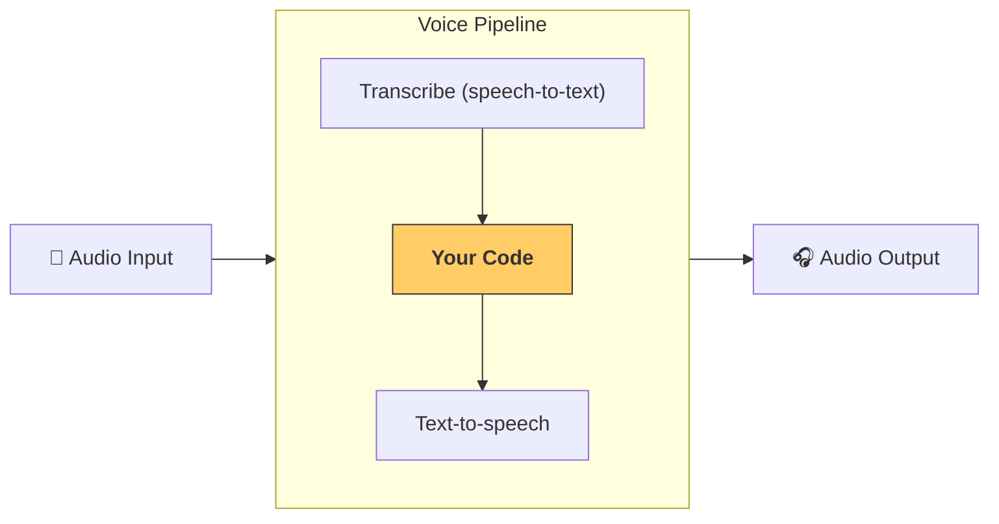

---
search:
  exclude: true
---
# 管线与工作流

[`VoicePipeline`][agents.voice.pipeline.VoicePipeline] 是一个用于将你的智能体工作流快速变成语音应用的类。你传入要运行的工作流，管线会负责转写输入音频、检测音频结束时机、在合适的时间调用你的工作流，并将工作流的输出转换回音频。



## 管线配置

创建管线时，你可以设置以下内容：

1. [`workflow`][agents.voice.workflow.VoiceWorkflowBase]：每当有新的音频被转写时运行的代码。
2. 所使用的 [`speech-to-text`][agents.voice.model.STTModel] 和 [`text-to-speech`][agents.voice.model.TTSModel] 模型。
3. [`config`][agents.voice.pipeline_config.VoicePipelineConfig]：用于配置如下内容：
    - 模型提供方，可将模型名称映射到实际模型
    - 追踪，包括是否禁用追踪、是否上传音频文件、工作流名称、追踪 ID 等
    - TTS 与 STT 模型的设置，如提示词、语言以及使用的数据类型

## 运行管线

你可以通过 [`run()`][agents.voice.pipeline.VoicePipeline.run] 方法运行管线，它允许以两种形式传入音频输入：

1. [`AudioInput`][agents.voice.input.AudioInput]：当你已有完整的音频转写，只需生成对应结果时使用。适用于不需要检测说话者何时结束的场景；例如，处理预录音频，或在按键说话应用中用户结束说话的时机很明确。
2. [`StreamedAudioInput`][agents.voice.input.StreamedAudioInput]：当你可能需要检测用户何时说完时使用。它允许你在检测到音频片段时逐步推送，语音管线会通过“activity detection（活动检测）”在正确的时间自动运行智能体工作流。

## 结果

一次语音管线运行的结果是 [`StreamedAudioResult`][agents.voice.result.StreamedAudioResult]。这是一个可随事件发生而进行流式传输的对象。包含以下几类 [`VoiceStreamEvent`][agents.voice.events.VoiceStreamEvent]：

1. [`VoiceStreamEventAudio`][agents.voice.events.VoiceStreamEventAudio]，包含一段音频数据。
2. [`VoiceStreamEventLifecycle`][agents.voice.events.VoiceStreamEventLifecycle]，用于通知诸如轮次开始或结束等生命周期事件。
3. [`VoiceStreamEventError`][agents.voice.events.VoiceStreamEventError]，为错误事件。

```python

result = await pipeline.run(input)

async for event in result.stream():
    if event.type == "voice_stream_event_audio":
        # play audio
    elif event.type == "voice_stream_event_lifecycle":
        # lifecycle
    elif event.type == "voice_stream_event_error"
        # error
    ...
```

## 最佳实践

### 打断

Agents SDK 目前对 [`StreamedAudioInput`][agents.voice.input.StreamedAudioInput] 尚无内置的打断支持。相反，它会针对每个检测到的轮次单独触发一次工作流运行。如果你希望在应用内处理打断，可以监听 [`VoiceStreamEventLifecycle`][agents.voice.events.VoiceStreamEventLifecycle] 事件。`turn_started` 表示新的轮次已被转写且处理开始；`turn_ended` 会在相应轮次的所有音频分发完成后触发。你可以利用这些事件在模型开始一个轮次时静音说话者的麦克风，并在你将该轮次的相关音频全部发送完毕后取消静音。