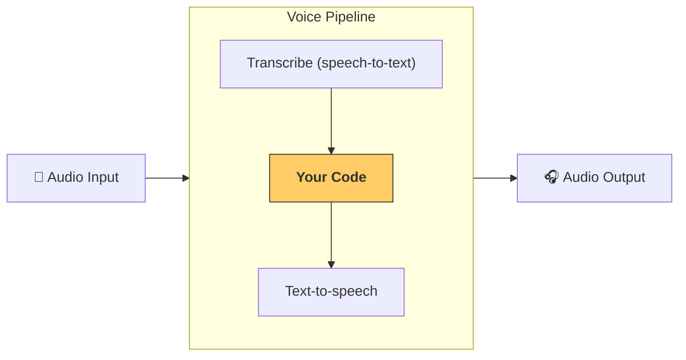

---
search:
  exclude: true
---
# 管道与工作流

[`VoicePipeline`][agents.voice.pipeline.VoicePipeline] 是一个类，可以轻松将你的智能体工作流变成语音应用。你传入一个要运行的工作流，管道会负责转录输入音频、检测音频结束时间、在正确的时机调用你的工作流，并将工作流输出重新转换为音频。



## 管道配置

创建管道时，你可以设置以下内容：

1. [`workflow`][agents.voice.workflow.VoiceWorkflowBase]：每当有新音频被转录时运行的代码。
2. 使用的 [`speech-to-text`][agents.voice.model.STTModel] 和 [`text-to-speech`][agents.voice.model.TTSModel] 模型。
3. [`config`][agents.voice.pipeline_config.VoicePipelineConfig]：用于配置以下内容：
    - 模型提供者，可将模型名称映射到模型
    - 追踪，包括是否禁用追踪、是否上传音频文件、工作流名称、追踪 ID 等
    - TTS 和 STT 模型的设置，例如使用的 prompt、语言和数据类型

## 运行管道

你可以通过 [`run()`][agents.voice.pipeline.VoicePipeline.run] 方法运行管道，它允许你以两种形式传入音频输入：

1. [`AudioInput`][agents.voice.input.AudioInput] 适用于你已经拥有完整音频转录时，仅需为其生成结果的场景。这在不需要检测说话者何时说完的情况下很有用；例如，当你有预先录制的音频，或在“按住说话”的应用中可以明确知道用户何时说完。
2. [`StreamedAudioInput`][agents.voice.input.StreamedAudioInput] 适用于可能需要检测用户何时说完的情况。它允许你在检测到时推送音频分片，语音管道将通过“活动检测”过程在正确的时机自动运行智能体工作流。

## 结果

语音管道运行的结果是一个 [`StreamedAudioResult`][agents.voice.result.StreamedAudioResult]。这是一个对象，允许你在事件发生时进行流式传输。存在几种 [`VoiceStreamEvent`][agents.voice.events.VoiceStreamEvent] 类型，包括：

1. [`VoiceStreamEventAudio`][agents.voice.events.VoiceStreamEventAudio]，包含一段音频分片。
2. [`VoiceStreamEventLifecycle`][agents.voice.events.VoiceStreamEventLifecycle]，通知你回合开始或结束等生命周期事件。
3. [`VoiceStreamEventError`][agents.voice.events.VoiceStreamEventError]，为错误事件。

```python

result = await pipeline.run(input)

async for event in result.stream():
    if event.type == "voice_stream_event_audio":
        # play audio
    elif event.type == "voice_stream_event_lifecycle":
        # lifecycle
    elif event.type == "voice_stream_event_error"
        # error
    ...
```

## 最佳实践

### 中断

Agents SDK 目前不支持对 [`StreamedAudioInput`][agents.voice.input.StreamedAudioInput] 的任何内置中断支持。相反，对于每个检测到的回合，它都会触发对你的工作流的单独运行。如果你想在应用内处理中断，你可以监听 [`VoiceStreamEventLifecycle`][agents.voice.events.VoiceStreamEventLifecycle] 事件。`turn_started` 表示新的回合已被转录并开始处理。`turn_ended` 会在相应回合的所有音频分发完毕后触发。你可以利用这些事件在模型开始一个回合时静音说话者的麦克风，并在你刷新完该回合的所有相关音频后取消静音。