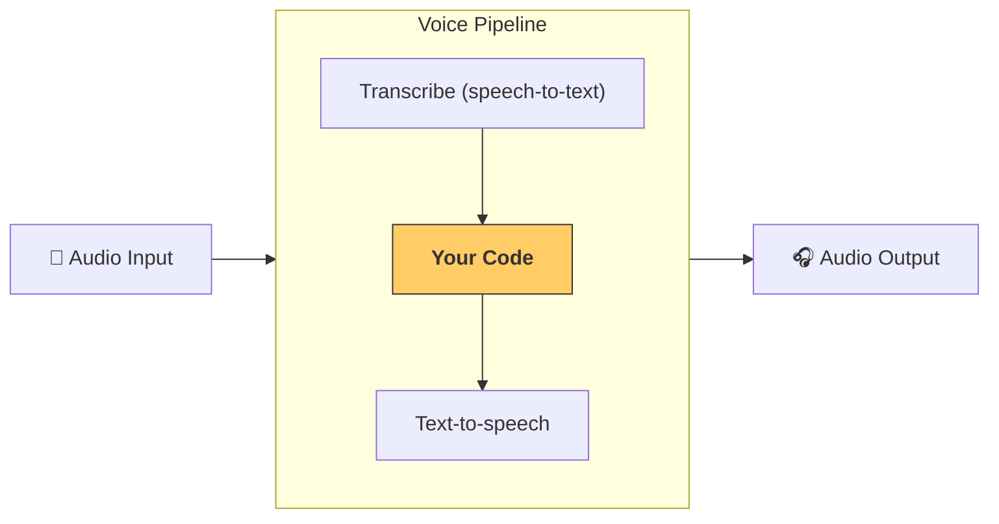

---
search:
  exclude: true
---
# 管道与工作流

[`VoicePipeline`][agents.voice.pipeline.VoicePipeline] 是一个类，可将你的智能体工作流轻松变成语音应用。你传入要运行的工作流，管道会负责转写输入音频、检测音频结束、在正确时间调用你的工作流，并将工作流输出转换回音频。



## 管道配置

创建管道时，你可以设置以下内容：

1. [`workflow`][agents.voice.workflow.VoiceWorkflowBase]：每次有新音频被转写时运行的代码。
2. 使用的 [`speech-to-text`][agents.voice.model.STTModel] 和 [`text-to-speech`][agents.voice.model.TTSModel] 模型。
3. [`config`][agents.voice.pipeline_config.VoicePipelineConfig]：用于配置如下内容：
    - 模型提供方，可将模型名称映射到具体模型
    - 追踪，包括是否禁用追踪、是否上传音频文件、工作流名称、追踪 ID 等
    - TTS 和 STT 模型的设置，如提示词、语言和使用的数据类型

## 运行管道

你可以通过 [`run()`][agents.voice.pipeline.VoicePipeline.run] 方法运行管道，它支持以两种形式传入音频输入：

1. [`AudioInput`][agents.voice.input.AudioInput]：当你已有完整音频并只想为其产生结果时使用。适用于无需检测说话者结束的场景；例如，预录音频或在按下说话（push-to-talk）应用中，何时用户说完很明确。
2. [`StreamedAudioInput`][agents.voice.input.StreamedAudioInput]：当你需要检测用户何时说完时使用。它允许你在检测到音频片段时逐步推送，语音管道会在合适的时机自动运行智能体工作流，这一过程称为“活动检测”(activity detection)。

## 结果

一次语音管道运行的结果是 [`StreamedAudioResult`][agents.voice.result.StreamedAudioResult]。这是一个可在事件发生时实时流式传递事件的对象。[`VoiceStreamEvent`][agents.voice.events.VoiceStreamEvent] 包括几种类型：

1. [`VoiceStreamEventAudio`][agents.voice.events.VoiceStreamEventAudio]：包含一段音频片段。
2. [`VoiceStreamEventLifecycle`][agents.voice.events.VoiceStreamEventLifecycle]：通知轮次开始或结束等生命周期事件。
3. [`VoiceStreamEventError`][agents.voice.events.VoiceStreamEventError]：错误事件。

```python

result = await pipeline.run(input)

async for event in result.stream():
    if event.type == "voice_stream_event_audio":
        # play audio
    elif event.type == "voice_stream_event_lifecycle":
        # lifecycle
    elif event.type == "voice_stream_event_error"
        # error
    ...
```

## 最佳实践

### 中断

Agents SDK 目前对 [`StreamedAudioInput`][agents.voice.input.StreamedAudioInput] 不提供内置的中断支持。相反，每次检测到一轮对话都会触发你的工作流单独运行一次。如果你想在应用内处理中断，可以监听 [`VoiceStreamEventLifecycle`][agents.voice.events.VoiceStreamEventLifecycle] 事件。`turn_started` 表示新的轮次已被转写且处理开始；`turn_ended` 会在相应轮次的全部音频发送完毕后触发。你可以利用这些事件在模型开始一轮时静音说话者的麦克风，并在该轮相关音频全部发送/播放完成后取消静音。