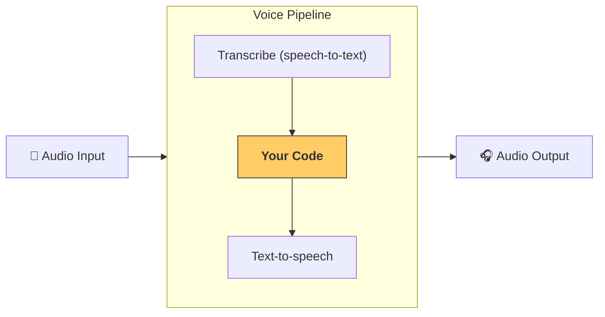

---
search:
  exclude: true
---
# 管道与工作流

[`VoicePipeline`][agents.voice.pipeline.VoicePipeline] 是一个类，可将你的智能体工作流轻松变成语音应用。你传入要运行的工作流，管道会负责转写输入音频、检测音频结束时间点、在正确的时机调用你的工作流，并将工作流输出再转换为音频。



## 管道配置

创建管道时，你可以设置以下内容：

1. [`workflow`][agents.voice.workflow.VoiceWorkflowBase]：每次有新的音频被转写时运行的代码。
2. 使用的 [`speech-to-text`][agents.voice.model.STTModel] 和 [`text-to-speech`][agents.voice.model.TTSModel] 模型。
3. [`config`][agents.voice.pipeline_config.VoicePipelineConfig]：用于配置以下内容：
    - 模型提供方，可将模型名称映射到具体模型
    - 追踪，包括是否禁用追踪、是否上传音频文件、工作流名称、trace ID 等
    - TTS 和 STT 模型的设置，例如提示词、语言以及使用的数据类型

## 管道运行

你可以通过 [`run()`][agents.voice.pipeline.VoicePipeline.run] 方法运行管道，该方法允许以两种形式传入音频输入：

1. [`AudioInput`][agents.voice.input.AudioInput]：当你已有完整的音频转写内容、只想得到其处理结果时使用。适用于无需检测说话者何时说完的场景；例如，使用预录音频，或在“按住说话”的应用中，用户何时说完是明确的。
2. [`StreamedAudioInput`][agents.voice.input.StreamedAudioInput]：用于需要检测用户何时说完的场景。它允许你在检测到音频片段时不断推送，语音管道会通过一种称为“活动检测（activity detection）”的流程，在正确的时机自动运行智能体工作流。

## 结果

语音管道运行的结果是一个 [`StreamedAudioResult`][agents.voice.result.StreamedAudioResult]。该对象允许你在事件发生时进行流式接收。存在几种类型的 [`VoiceStreamEvent`][agents.voice.events.VoiceStreamEvent]，包括：

1. [`VoiceStreamEventAudio`][agents.voice.events.VoiceStreamEventAudio]：包含一段音频片段。
2. [`VoiceStreamEventLifecycle`][agents.voice.events.VoiceStreamEventLifecycle]：告知诸如对话轮次开始或结束等生命周期事件。
3. [`VoiceStreamEventError`][agents.voice.events.VoiceStreamEventError]：错误事件。

```python

result = await pipeline.run(input)

async for event in result.stream():
    if event.type == "voice_stream_event_audio":
        # play audio
    elif event.type == "voice_stream_event_lifecycle":
        # lifecycle
    elif event.type == "voice_stream_event_error"
        # error
    ...
```

## 最佳实践

### 打断处理

Agents SDK 目前尚不支持对 [`StreamedAudioInput`][agents.voice.input.StreamedAudioInput] 的内置打断处理。对于每个检测到的对话轮次（turn），都会触发你工作流的一次独立运行。如果你希望在应用内处理打断，可以监听 [`VoiceStreamEventLifecycle`][agents.voice.events.VoiceStreamEventLifecycle] 事件。`turn_started` 表示新的轮次已被转写并开始处理；`turn_ended` 会在该轮次相关的所有音频都已分发后触发。你可以利用这些事件在模型开始一个轮次时将说话者的麦克风静音，并在你把该轮次的相关音频全部发送完后取消静音。