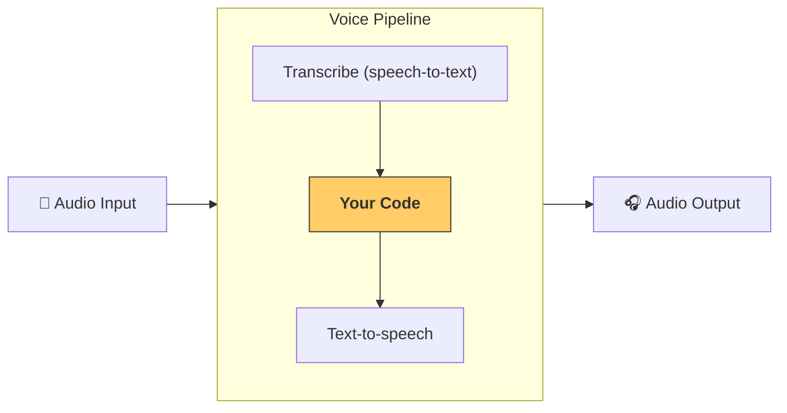

---
search:
  exclude: true
---
# 管线与工作流

[`VoicePipeline`][agents.voice.pipeline.VoicePipeline] 是一个类，可让你轻松将智能体工作流变成语音应用。你传入要运行的工作流，管线会负责转写输入音频、检测音频结束时机、在合适的时刻调用你的工作流，并将工作流输出再转换为音频。



## 配置管线

创建管线时，你可以设置以下内容：

1. [`workflow`][agents.voice.workflow.VoiceWorkflowBase]，即每次有新音频被转写时要运行的代码。
2. 使用的 [`speech-to-text`][agents.voice.model.STTModel] 和 [`text-to-speech`][agents.voice.model.TTSModel] 模型
3. [`config`][agents.voice.pipeline_config.VoicePipelineConfig]，用于配置如下内容：
    - 模型提供方，可将模型名称映射到模型
    - 追踪，包括是否禁用追踪、是否上传音频文件、工作流名称、追踪 ID 等
    - TTS 和 STT 模型的设置，例如提示词、语言和使用的数据类型

## 运行管线

你可以通过 [`run()`][agents.voice.pipeline.VoicePipeline.run] 方法运行管线，它允许以两种形式传入音频输入：

1. 当你已有完整的音频转写并仅想产出结果时，使用 [`AudioInput`][agents.voice.input.AudioInput]。当你不需要检测说话者何时结束说话时很有用；例如，对预录音频，或在按键说话应用中用户结束说话的时间点很明确。
2. 当你可能需要检测用户何时结束说话时，使用 [`StreamedAudioInput`][agents.voice.input.StreamedAudioInput]。它允许你在检测到音频片段时推送这些片段，语音管线会通过一种称为“活动检测”的过程，在正确的时间自动运行智能体工作流。

## 结果

语音管线运行的结果是 [`StreamedAudioResult`][agents.voice.result.StreamedAudioResult]。这是一个对象，允许你在事件发生时进行流式传输。有几种 [`VoiceStreamEvent`][agents.voice.events.VoiceStreamEvent] 类型，包括：

1. [`VoiceStreamEventAudio`][agents.voice.events.VoiceStreamEventAudio]，包含一段音频。
2. [`VoiceStreamEventLifecycle`][agents.voice.events.VoiceStreamEventLifecycle]，用于通知回合开始或结束等生命周期事件。
3. [`VoiceStreamEventError`][agents.voice.events.VoiceStreamEventError]，为错误事件。

```python

result = await pipeline.run(input)

async for event in result.stream():
    if event.type == "voice_stream_event_audio":
        # play audio
    elif event.type == "voice_stream_event_lifecycle":
        # lifecycle
    elif event.type == "voice_stream_event_error"
        # error
    ...
```

## 最佳实践

### 中断

Agents SDK 目前不支持对 [`StreamedAudioInput`][agents.voice.input.StreamedAudioInput] 的任何内置中断支持。相反，对于每个检测到的回合，它都会触发对你的工作流的单独运行。如果你希望在应用内处理中断，可以监听 [`VoiceStreamEventLifecycle`][agents.voice.events.VoiceStreamEventLifecycle] 事件。`turn_started` 表示有新的回合被转写且处理开始。`turn_ended` 会在相应回合的所有音频都已分发后触发。你可以利用这些事件在模型开始一个回合时将说话者的麦克风静音，并在你将该回合相关音频全部发送完之后取消静音。