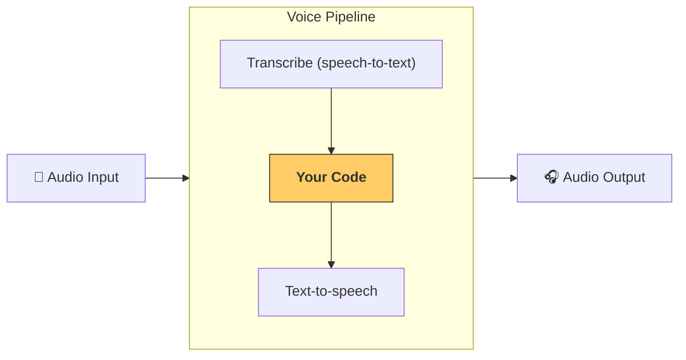

---
search:
  exclude: true
---
# 流水线与工作流

[VoicePipeline](agents.voice.pipeline.VoicePipeline) 是一个类，可轻松将你的智能体工作流变成语音应用。你传入要运行的工作流后，流水线会负责转录输入音频、检测音频结束时间、在合适的时机调用你的工作流，并将工作流输出再转换为音频。



## 配置流水线

创建流水线时，你可以设置以下内容：

1. [workflow](agents.voice.workflow.VoiceWorkflowBase)，即每次有新的音频被转录时运行的代码。
2. 使用的 [speech-to-text](agents.voice.model.STTModel) 和 [text-to-speech](agents.voice.model.TTSModel) 模型
3. [config](agents.voice.pipeline_config.VoicePipelineConfig)，用于配置如下内容：
    - 模型提供者，可将模型名称映射到具体模型
    - 追踪，包括是否禁用追踪、是否上传音频文件、工作流名称、追踪 ID 等
    - TTS 与 STT 模型的设置，如提示词、语言及所用数据类型

## 运行流水线

你可以通过 [run()](agents.voice.pipeline.VoicePipeline.run) 方法运行流水线，它允许以两种形式传入音频输入：

1. [AudioInput](agents.voice.input.AudioInput) 适用于你拥有完整音频转录并只想为其生成结果的情况。这在无需检测说话者何时结束的场景中很有用；例如，当你有预先录制的音频，或在“按键说话（push-to-talk）”应用中用户结束说话的时机是明确的。
2. [StreamedAudioInput](agents.voice.input.StreamedAudioInput) 适用于需要检测用户何时说完的情况。它允许你在检测到音频块时不断推送，语音流水线将通过称为“活动检测”的过程，在合适的时机自动运行智能体工作流。

## 结果

语音流水线运行的结果是一个 [StreamedAudioResult](agents.voice.result.StreamedAudioResult)。它是一个对象，允许你在事件发生时进行流式接收。存在几类 [VoiceStreamEvent](agents.voice.events.VoiceStreamEvent)，包括：

1. [VoiceStreamEventAudio](agents.voice.events.VoiceStreamEventAudio)，包含一段音频数据。
2. [VoiceStreamEventLifecycle](agents.voice.events.VoiceStreamEventLifecycle)，用于告知诸如轮次开始或结束等生命周期事件。
3. [VoiceStreamEventError](agents.voice.events.VoiceStreamEventError)，为错误事件。

```python

result = await pipeline.run(input)

async for event in result.stream():
    if event.type == "voice_stream_event_audio":
        # play audio
    elif event.type == "voice_stream_event_lifecycle":
        # lifecycle
    elif event.type == "voice_stream_event_error"
        # error
    ...
```

## 最佳实践

### 中断

Agents SDK 目前对 [StreamedAudioInput](agents.voice.input.StreamedAudioInput) 不支持任何内置的中断处理。相反，对于每个检测到的轮次，它都会单独触发一次你的工作流运行。如果你想在应用内处理中断，可以监听 [VoiceStreamEventLifecycle](agents.voice.events.VoiceStreamEventLifecycle) 事件。`turn_started` 表示新的轮次已被转录且处理开始；`turn_ended` 会在对应轮次的全部音频分发完成后触发。你可以利用这些事件在模型开始一个轮次时静音说话者的麦克风，并在你为该轮次的相关音频全部播放完成后再取消静音。