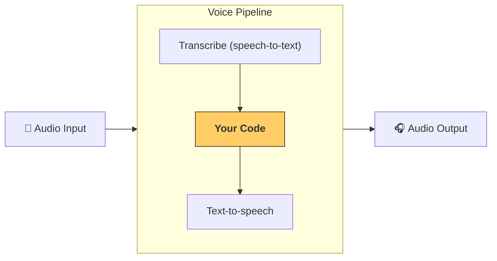

---
search:
  exclude: true
---
# 管道与工作流

[`VoicePipeline`][agents.voice.pipeline.VoicePipeline] 是一个类，可让你轻松将智能体工作流转换为语音应用。你传入要运行的工作流，管道会负责转写输入音频、检测音频何时结束、在合适的时间调用你的工作流，并将工作流输出再转换为音频。



## 管道配置

创建管道时，你可以设置以下几项：

1. [`workflow`][agents.voice.workflow.VoiceWorkflowBase]：每次有新音频被转写时运行的代码。
2. 所使用的 [`speech-to-text`][agents.voice.model.STTModel] 和 [`text-to-speech`][agents.voice.model.TTSModel] 模型
3. [`config`][agents.voice.pipeline_config.VoicePipelineConfig]：用于配置例如：
    - 模型提供方，可将模型名称映射到模型
    - 追踪，包括是否禁用追踪、是否上传音频文件、工作流名称、trace IDs 等
    - TTS 和 STT 模型的设置，例如所使用的提示词、语言和数据类型

## 运行管道

你可以通过 [`run()`][agents.voice.pipeline.VoicePipeline.run] 方法运行管道，它允许你以两种形式传入音频输入：

1. [`AudioInput`][agents.voice.input.AudioInput]：适用于你有完整音频转写（或完整音频内容）且只想为其生成结果的场景。这在你不需要检测说话者何时说完时很有用；例如，你有预录音频，或在按键说话（push-to-talk）应用中，用户何时说完很明确。
2. [`StreamedAudioInput`][agents.voice.input.StreamedAudioInput]：适用于你可能需要检测用户何时说完的场景。它允许你在检测到音频分块时将其推送进来，而语音管道会通过称为“activity detection”的过程，在合适的时间自动运行智能体工作流。

## 结果

一次语音管道运行的结果是 [`StreamedAudioResult`][agents.voice.result.StreamedAudioResult]。该对象允许你在事件发生时进行流式输出。存在几种 [`VoiceStreamEvent`][agents.voice.events.VoiceStreamEvent]，包括：

1. [`VoiceStreamEventAudio`][agents.voice.events.VoiceStreamEventAudio]：包含一段音频分块。
2. [`VoiceStreamEventLifecycle`][agents.voice.events.VoiceStreamEventLifecycle]：通知你轮次开始或结束等生命周期事件。
3. [`VoiceStreamEventError`][agents.voice.events.VoiceStreamEventError]：错误事件。

```python

result = await pipeline.run(input)

async for event in result.stream():
    if event.type == "voice_stream_event_audio":
        # play audio
    elif event.type == "voice_stream_event_lifecycle":
        # lifecycle
    elif event.type == "voice_stream_event_error":
        # error
    ...
```

## 最佳实践

### 打断

Agents SDK 目前不支持对 [`StreamedAudioInput`][agents.voice.input.StreamedAudioInput] 的任何内置打断能力。相反，对于每个检测到的轮次，它都会触发你的工作流的一次独立运行。如果你想在应用内处理打断，可以监听 [`VoiceStreamEventLifecycle`][agents.voice.events.VoiceStreamEventLifecycle] 事件。`turn_started` 表示一个新轮次已被转写且处理开始。`turn_ended` 会在相应轮次的所有音频都已分发后触发。你可以使用这些事件在模型开始一个轮次时将说话者的麦克风静音，并在你刷新完该轮次的所有相关音频后取消静音。