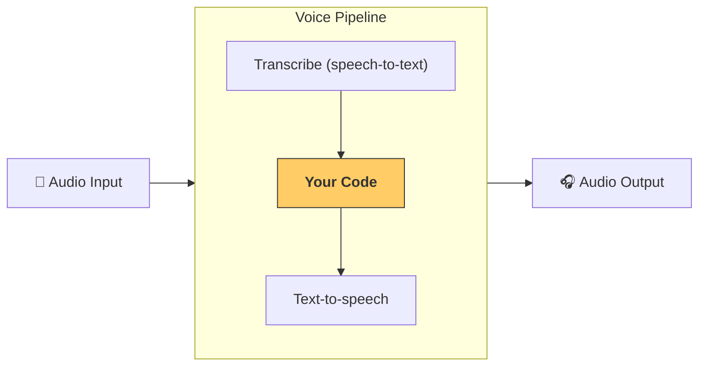

---
search:
  exclude: true
---
# 管道与工作流

[`VoicePipeline`][agents.voice.pipeline.VoicePipeline] 是一个类，可让你轻松将智能体工作流转换为语音应用。你传入一个要运行的工作流，管道会负责转录输入音频、检测音频何时结束、在适当的时机调用你的工作流，并将工作流输出重新转换为音频。


```mermaid
graph LR
    %% Input
    A["🎤 Audio Input"]

    %% Voice Pipeline
    subgraph Voice_Pipeline [Voice Pipeline]
        direction TB
        B["Transcribe (speech-to-text)"]
        C["Your Code"]:::highlight
        D["Text-to-speech"]
        B --> C --> D
    end

    %% Output
    E["🎧 Audio Output"]

    %% Flow
    A --> Voice_Pipeline
    Voice_Pipeline --> E

    %% Custom styling
    classDef highlight fill:#ffcc66,stroke:#333,stroke-width:1px,font-weight:700;

```

## 管道配置

创建管道时，你可以设置以下内容：

1. [`workflow`][agents.voice.workflow.VoiceWorkflowBase]，即每次转录出新音频时运行的代码。
2. 所使用的 [`speech-to-text`][agents.voice.model.STTModel] 和 [`text-to-speech`][agents.voice.model.TTSModel] 模型
3. [`config`][agents.voice.pipeline_config.VoicePipelineConfig]，用于配置以下内容：
    - 模型提供方，可将模型名称映射到模型
    - 追踪，包括是否禁用追踪、是否上传音频文件、工作流名称、追踪 ID 等
    - TTS 和 STT 模型上的设置，例如所使用的提示词、语言和数据类型。

## 管道运行

你可以通过 [`run()`][agents.voice.pipeline.VoicePipeline.run] 方法运行管道，该方法支持传入两种形式的音频输入：

1. 当你拥有完整的音频转录内容，并且只想基于它生成结果时，使用 [`AudioInput`][agents.voice.input.AudioInput]。这适用于不需要检测说话者何时说完的场景；例如，你有预录音频，或者在按键说话应用中，用户何时说完是明确的。
2. 当你可能需要检测用户何时说完时，使用 [`StreamedAudioInput`][agents.voice.input.StreamedAudioInput]。它允许你在检测到音频分块时持续推送这些分块，语音管道会通过称为“活动检测”的过程，在适当的时机自动运行智能体工作流。

## 结果

语音管道运行的结果是一个 [`StreamedAudioResult`][agents.voice.result.StreamedAudioResult]。这是一个允许你在事件发生时进行流式传输的对象。存在几种 [`VoiceStreamEvent`][agents.voice.events.VoiceStreamEvent]，包括：

1. [`VoiceStreamEventAudio`][agents.voice.events.VoiceStreamEventAudio]，其中包含一段音频分块。
2. [`VoiceStreamEventLifecycle`][agents.voice.events.VoiceStreamEventLifecycle]，用于通知你诸如轮次开始或结束之类的生命周期事件。
3. [`VoiceStreamEventError`][agents.voice.events.VoiceStreamEventError]，即错误事件。

```python

result = await pipeline.run(input)

async for event in result.stream():
    if event.type == "voice_stream_event_audio":
        # play audio
    elif event.type == "voice_stream_event_lifecycle":
        # lifecycle
    elif event.type == "voice_stream_event_error":
        # error
    ...
```

## 最佳实践

### 中断

Agents SDK 当前不为 [`StreamedAudioInput`][agents.voice.input.StreamedAudioInput] 提供任何内置的中断处理。相反，对于每个检测到的轮次，它都会触发一次单独的工作流运行。如果你希望在应用内部处理中断，可以监听 [`VoiceStreamEventLifecycle`][agents.voice.events.VoiceStreamEventLifecycle] 事件。`turn_started` 表示新的轮次已被转录并开始处理。`turn_ended` 会在某个轮次的所有音频都被分发后触发。你可以利用这些事件，在模型开始一个轮次时将说话者的麦克风静音，并在你刷新完该轮次的所有相关音频后取消静音。