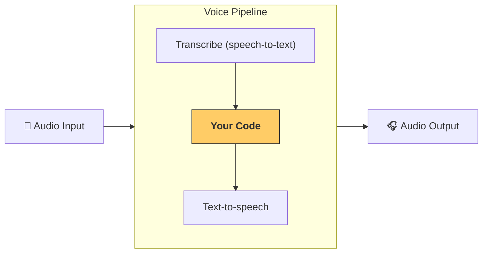

---
search:
  exclude: true
---
# 管线与工作流

[`VoicePipeline`][agents.voice.pipeline.VoicePipeline] 是一个可轻松将智能体工作流转化为语音应用的类。你只需传入要运行的工作流，管线就会负责转录输入音频、检测音频何时结束、在适当时机调用工作流，并将工作流输出重新转换为音频。


```mermaid
graph LR
    %% Input
    A["🎤 Audio Input"]

    %% Voice Pipeline
    subgraph Voice_Pipeline [Voice Pipeline]
        direction TB
        B["Transcribe (speech-to-text)"]
        C["Your Code"]:::highlight
        D["Text-to-speech"]
        B --> C --> D
    end

    %% Output
    E["🎧 Audio Output"]

    %% Flow
    A --> Voice_Pipeline
    Voice_Pipeline --> E

    %% Custom styling
    classDef highlight fill:#ffcc66,stroke:#333,stroke-width:1px,font-weight:700;

```

## 管线配置 {#configuring-a-pipeline}

创建管线时，你可以设置以下几项：

1. [`workflow`][agents.voice.workflow.VoiceWorkflowBase]，即每次转录新音频时运行的代码。
2. 所使用的 [`speech-to-text`][agents.voice.model.STTModel] 和 [`text-to-speech`][agents.voice.model.TTSModel] 模型。
3. [`config`][agents.voice.pipeline_config.VoicePipelineConfig]，可用于配置以下内容：
    - 模型提供商，可将模型名称映射到模型
    - 追踪，包括是否禁用追踪、是否上传音频文件、工作流名称、追踪 ID 等
    - TTS 和 STT 模型的设置，例如提示词、语言和使用的数据类型

### 单智能体工作流的应用上下文传递 {#pass-application-context-to-a-single-agent-workflow}

当语音智能体、其工具或其生命周期钩子需要应用状态或依赖项时，将 `context` 传递给 [`SingleAgentVoiceWorkflow`][agents.voice.workflow.SingleAgentVoiceWorkflow]：

```python
from dataclasses import dataclass

from agents import Agent
from agents.voice import SingleAgentVoiceWorkflow, VoicePipeline


@dataclass
class VoiceContext:
    user_id: str


agent = Agent[VoiceContext](name="Voice assistant")
workflow = SingleAgentVoiceWorkflow(
    agent,
    context=VoiceContext(user_id="user-123"),
)
pipeline = VoicePipeline(workflow=workflow)
```

该工作流会将同一个上下文对象转发给它启动的每次智能体运行，包括后续的转录轮次。工具和生命周期钩子通过 [`RunContextWrapper.context`][agents.run_context.RunContextWrapper.context] 接收该对象。上下文始终保留在你的应用本地，不会发送给模型。有关类型和生命周期的指导，请参阅[上下文管理](../context.md)。

### OpenAI语音模型配置 {#configure-openai-speech-models}

通过 `VoicePipelineConfig` 传递 [`STTModelSettings`][agents.voice.model.STTModelSettings] 和 [`TTSModelSettings`][agents.voice.model.TTSModelSettings]，以配置默认的OpenAI语音模型：

```python
from agents.voice import STTModelSettings, TTSModelSettings, VoicePipeline, VoicePipelineConfig

config = VoicePipelineConfig(
    stt_settings=STTModelSettings(
        language="en",
        prompt="A customer support call about product AC-42.",
    ),
    tts_settings=TTSModelSettings(
        voice="marin",
    ),
)
pipeline = VoicePipeline(workflow=workflow, config=config)
```

对于完整的音频输入，`STTModelSettings.language` 和 `prompt` 会传递给转录请求。对于 [`StreamedAudioInput`][agents.voice.input.StreamedAudioInput]，配置 WebSocket 会话时，OpenAI转录会话还会接收 `language`、`prompt`，以及仅用于流式传输的 `languages` 和 `keywords` 设置。`gpt-transcribe` 和 `gpt-live-transcribe` 使用 `languages`（预期输入语言列表）以及 `keywords`（音频中可能出现的字面术语列表）。设置 `languages` 后，它的优先级高于 `language`。否则，这两个模型会将 SDK 中单一的 `language` 值作为仅含一个元素的 `languages` 列表接收。其他转录模型仍会接收单值 `language` 字段。请使用 API 支持的语言代码，并使用 `prompt` 描述录音或其场景，而不是重复说明转录任务。关键词是转录提示，并非必须输出的内容。请参阅OpenAI的[转录上下文指南](https://developers.openai.com/api/docs/guides/transcription#improve-transcription-quality)。

对于可在多种预期语言之间切换的流式转录，请显式配置仅用于流式传输的字段：

```python
config = VoicePipelineConfig(
    stt_settings=STTModelSettings(
        languages=["en", "es"],
        keywords=["AC-42", "Agents SDK"],
        prompt="A customer support call about product AC-42.",
    ),
)
```

`TTSModelSettings.dtype` 接受可解析为原生 `int16` 或 `float32` 的 NumPy dtype 拼写形式，包括 `np.int16`、`np.float32`、`"int16"`、`"float32"`，以及 `"f4"` 等别名。当管线转换流式 TTS 音频时，其他 dtype 和非原生字节序会引发 [`UserError`][agents.exceptions.UserError]。

支持的内置 `TTSModelSettings.voice` 值包括 `alloy`、`ash`、`ballad`、`coral`、`echo`、`fable`、`onyx`、`nova`、`sage`、`shimmer`、`verse`、`marin` 和 `cedar`。语音的可用性取决于所选的文本转语音模型；有关各模型当前支持的语音，请参阅OpenAI的[语音选项](https://developers.openai.com/api/docs/guides/text-to-speech#voice-options)。有权使用OpenAI自定义语音的组织也可以改为传入自定义语音 ID：

```python
config = VoicePipelineConfig(
    tts_settings=TTSModelSettings(
        voice={"id": "voice_123abc"},
    ),
)
```

自定义语音仅向符合条件的客户开放，并且必须先通过 OpenAI API 创建才能使用。有关访问权限、同意和创建要求，请参阅OpenAI的[自定义语音指南](https://developers.openai.com/api/docs/guides/text-to-speech#custom-voices)。

[`OpenAIVoiceModelProvider`][agents.voice.models.openai_model_provider.OpenAIVoiceModelProvider] 使用其配置的 `AsyncOpenAI` 客户端处理非流式转录请求、TTS 请求和流式 STT 连接。流式 STT WebSocket 连接会从该客户端获取端点、身份验证信息、默认标头和默认查询参数。有关提供商归属和优先级规则，请参阅 [API 密钥和客户端](../config.md#api-keys-and-clients)。

## 管线运行 {#running-a-pipeline}

你可以通过 [`run()`][agents.voice.pipeline.VoicePipeline.run] 方法运行管线。该方法支持传入以下两种形式的音频输入：

1. 当你有完整的音频输入，并且只希望针对该音频生成结果时，可使用 [`AudioInput`][agents.voice.input.AudioInput]。这适用于无需检测说话者何时结束发言的情况，例如处理预录音频，或在可以明确判断用户何时结束发言的按键说话应用中。
2. 当你可能需要检测用户何时结束发言时，可使用 [`StreamedAudioInput`][agents.voice.input.StreamedAudioInput]。它允许你在检测到音频分块时将其推送至管线，语音管线会通过一个称为“活动检测”的过程，在适当时机自动运行智能体工作流。

## 结果 {#results}

语音管线的运行结果是 [`StreamedAudioResult`][agents.voice.result.StreamedAudioResult]。该对象支持在事件发生时对其进行流式传输。[`VoiceStreamEvent`][agents.voice.events.VoiceStreamEvent] 包括以下几种类型：

1. [`VoiceStreamEventAudio`][agents.voice.events.VoiceStreamEventAudio]，包含一个音频分块。
2. [`VoiceStreamEventLifecycle`][agents.voice.events.VoiceStreamEventLifecycle]，用于通知轮次开始或结束等生命周期事件。
3. [`VoiceStreamEventError`][agents.voice.events.VoiceStreamEventError]，表示错误事件。

应用使用 [`StreamedAudioResult.stream()`][agents.voice.result.StreamedAudioResult.stream] 时会引发终止性管线错误。如果语音转文本的转录会话在其他方面均正常的运行结束后未能关闭，流会引发该关闭错误，而不是无限期等待。如果轮次已经失败，并且关闭转录会话也失败，流会保留原始轮次错误作为主要错误。

```python

result = await pipeline.run(input)

async for event in result.stream():
    if event.type == "voice_stream_event_audio":
        # play audio
        pass
    elif event.type == "voice_stream_event_lifecycle":
        # lifecycle
        pass
    elif event.type == "voice_stream_event_error":
        # error
        pass
```

## 最佳实践 {#best-practices}

### 中断处理 {#interruptions}

Agents SDK目前没有为 [`StreamedAudioInput`][agents.voice.input.StreamedAudioInput] 提供任何内置的中断处理机制。相反，每个检测到的轮次都会触发工作流的一次独立运行。如果要在应用内处理中断，可以监听 [`VoiceStreamEventLifecycle`][agents.voice.events.VoiceStreamEventLifecycle] 事件。`turn_started` 表示已转录一个新轮次，并且即将开始处理。`turn_ended` 会在相应轮次的所有音频均已发送后触发。你可以使用这些事件，在模型开始一个轮次时将说话者的麦克风静音，并在应用播放完与该轮次相关的所有音频后取消静音。