```mermaid
graph LR
    %% Input
    A["🎤 Audio Input"]

    %% Voice Pipeline
    subgraph Voice_Pipeline [Voice Pipeline]
        direction TB
        B["Transcribe (speech-to-text)"]
        C["Your Code"]:::highlight
        D["Text-to-speech"]
        B --> C --> D
    end

    %% Output
    E["🎧 Audio Output"]

    %% Flow
    A --> Voice_Pipeline
    Voice_Pipeline --> E

    %% Custom styling
    classDef highlight fill:#ffcc66,stroke:#333,stroke-width:1px,font-weight:700;

```

---
search:
  exclude: true
---
# 管道与工作流

[`VoicePipeline`][agents.voice.pipeline.VoicePipeline] 是一个用于将你的智能体工作流快速变成语音应用的类。你传入要运行的工作流，管道会负责转录输入音频、检测音频结束时间、在合适的时机调用你的工作流，并将工作流输出转换回音频。



## 配置管道

创建管道时，你可以设置以下内容：

1. [`workflow`][agents.voice.workflow.VoiceWorkflowBase]，即每次有新音频被转录时运行的代码。
2. 使用的 [`speech-to-text`][agents.voice.model.STTModel] 和 [`text-to-speech`][agents.voice.model.TTSModel] 模型
3. [`config`][agents.voice.pipeline_config.VoicePipelineConfig]，用于配置如下内容：
    - 模型提供方，可将模型名称映射到模型
    - 追踪，包括是否禁用追踪、是否上传音频文件、工作流名称、追踪 ID 等
    - TTS 与 STT 模型的设置，如提示词、语言和所用数据类型

## 运行管道

你可以通过 [`run()`][agents.voice.pipeline.VoicePipeline.run] 方法运行管道，可用两种形式传入音频输入：

1. 当你已有完整音频转录，并只想基于它生成结果时，使用 [`AudioInput`][agents.voice.input.AudioInput]。这在无需检测说话人何时结束的场景很有用；例如，已有预录音频，或在按键说话（push-to-talk）应用中用户结束说话的时机很清楚。
2. 当你可能需要检测用户何时结束说话时，使用 [`StreamedAudioInput`][agents.voice.input.StreamedAudioInput]。它允许你在检测到时推送音频分片，语音管道会通过“活动检测”过程在合适的时机自动运行智能体工作流。

## 结果

一次语音管道运行的结果是 [`StreamedAudioResult`][agents.voice.result.StreamedAudioResult]。这是一个可在事件发生时进行流式传输的对象。存在几种 [`VoiceStreamEvent`][agents.voice.events.VoiceStreamEvent]，包括：

1. [`VoiceStreamEventAudio`][agents.voice.events.VoiceStreamEventAudio]，包含一段音频分片。
2. [`VoiceStreamEventLifecycle`][agents.voice.events.VoiceStreamEventLifecycle]，用于通知诸如轮次开始或结束等生命周期事件。
3. [`VoiceStreamEventError`][agents.voice.events.VoiceStreamEventError]，表示错误事件。

```python

result = await pipeline.run(input)

async for event in result.stream():
    if event.type == "voice_stream_event_audio":
        # play audio
    elif event.type == "voice_stream_event_lifecycle":
        # lifecycle
    elif event.type == "voice_stream_event_error"
        # error
    ...
```

## 最佳实践

### 中断

Agents SDK 目前对 [`StreamedAudioInput`][agents.voice.input.StreamedAudioInput] 不支持任何内置的中断功能。相反，对于每个被检测到的轮次，它都会触发你的工作流的单独一次运行。若你希望在应用内处理中断，可以监听 [`VoiceStreamEventLifecycle`][agents.voice.events.VoiceStreamEventLifecycle] 事件。`turn_started` 表示新的轮次已被转录且处理开始；`turn_ended` 会在相应轮次的所有音频分发完成后触发。你可以利用这些事件在模型开始一个轮次时静音说话者的麦克风，并在你清空该轮次的相关音频后取消静音。