---
search:
  exclude: true
---
# 流水线与工作流

[`VoicePipeline`][agents.voice.pipeline.VoicePipeline] 是一个类，可将你的智能体工作流轻松转换为语音应用。你传入要运行的工作流，流水线会负责转录输入音频、检测音频结束时间、在正确时机调用你的工作流，并将工作流输出重新合成为音频。



```mermaid
graph LR
    %% Input
    A["🎤 Audio Input"]

    %% Voice Pipeline
    subgraph Voice_Pipeline [Voice Pipeline]
        direction TB
        B["Transcribe (speech-to-text)"]
        C["Your Code"]:::highlight
        D["Text-to-speech"]
        B --> C --> D
    end

    %% Output
    E["🎧 Audio Output"]

    %% Flow
    A --> Voice_Pipeline
    Voice_Pipeline --> E

    %% Custom styling
    classDef highlight fill:#ffcc66,stroke:#333,stroke-width:1px,font-weight:700;

```

## 配置流水线

创建流水线时，你可以设置以下内容：

1. [`workflow`][agents.voice.workflow.VoiceWorkflowBase]：每次有新音频被转录时运行的代码。
2. 使用的 [`speech-to-text`][agents.voice.model.STTModel] 与 [`text-to-speech`][agents.voice.model.TTSModel] 模型。
3. [`config`][agents.voice.pipeline_config.VoicePipelineConfig]：用于配置例如：
    - 模型提供方，可将模型名称映射到实际模型
    - 追踪，包括是否禁用追踪、是否上传音频文件、工作流名称、追踪 ID 等
    - TTS 与 STT 模型的设置，如提示词、语言与所用数据类型

## 运行流水线

你可以通过 [`run()`][agents.voice.pipeline.VoicePipeline.run] 方法运行流水线，该方法允许以两种形式传入音频输入：

1. [`AudioInput`][agents.voice.input.AudioInput]：当你已有完整音频并只需为其生成结果时使用。适用于无需检测说话者何时结束的场景；例如，使用预录音频，或在明确知道用户何时结束说话的按键说话应用中。
2. [`StreamedAudioInput`][agents.voice.input.StreamedAudioInput]：当你需要检测用户何时结束说话时使用。它允许你在检测到音频片段时持续推送，语音流水线会通过“活动检测（activity detection）”在正确时机自动运行智能体工作流。

## 结果

语音流水线运行的结果是 [`StreamedAudioResult`][agents.voice.result.StreamedAudioResult]。该对象允许你在事件发生时进行流式接收。包含几类 [`VoiceStreamEvent`][agents.voice.events.VoiceStreamEvent]：

1. [`VoiceStreamEventAudio`][agents.voice.events.VoiceStreamEventAudio]：包含一段音频数据。
2. [`VoiceStreamEventLifecycle`][agents.voice.events.VoiceStreamEventLifecycle]：通知诸如轮次开始或结束等生命周期事件。
3. [`VoiceStreamEventError`][agents.voice.events.VoiceStreamEventError]：错误事件。

```python

result = await pipeline.run(input)

async for event in result.stream():
    if event.type == "voice_stream_event_audio":
        # play audio
    elif event.type == "voice_stream_event_lifecycle":
        # lifecycle
    elif event.type == "voice_stream_event_error"
        # error
    ...
```

## 最佳实践

### 打断

Agents SDK 目前未对 [`StreamedAudioInput`][agents.voice.input.StreamedAudioInput] 提供任何内置的打断支持。相反，每检测到一个轮次，都会单独触发一次你的工作流运行。若你希望在应用内处理打断，可监听 [`VoiceStreamEventLifecycle`][agents.voice.events.VoiceStreamEventLifecycle] 事件。`turn_started` 表示新的轮次已被转录且开始处理；`turn_ended` 则在相应轮次的全部音频派发完毕后触发。你可以利用这些事件在模型开始一个轮次时静音说话者的麦克风，并在你为该轮次的相关音频全部输出后取消静音。